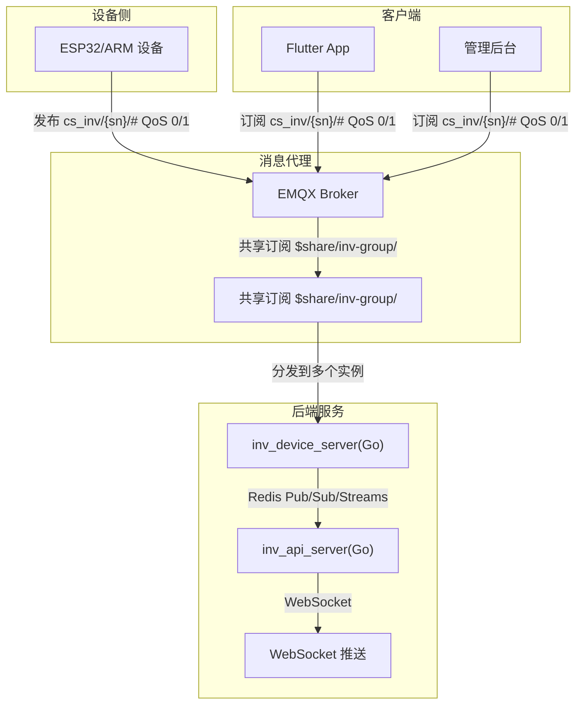
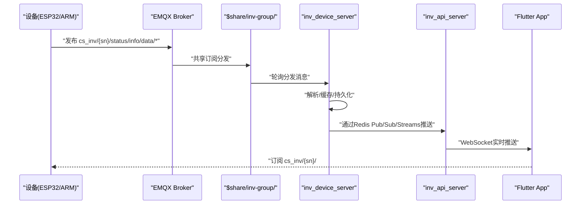
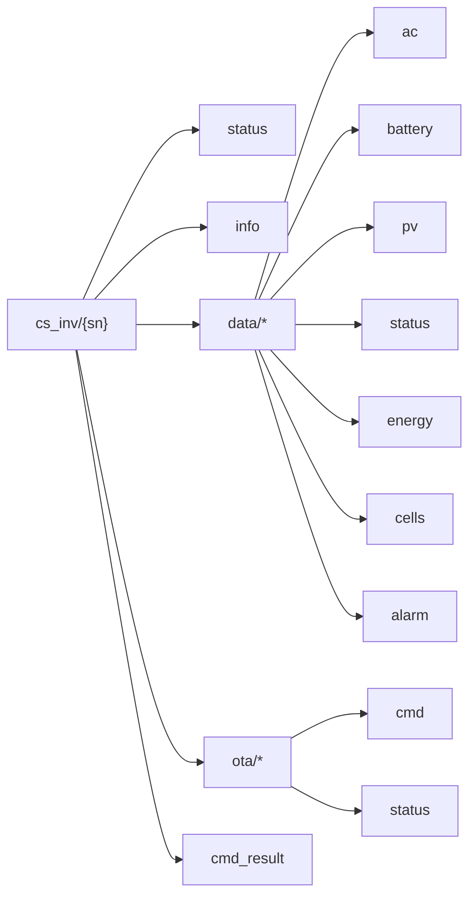
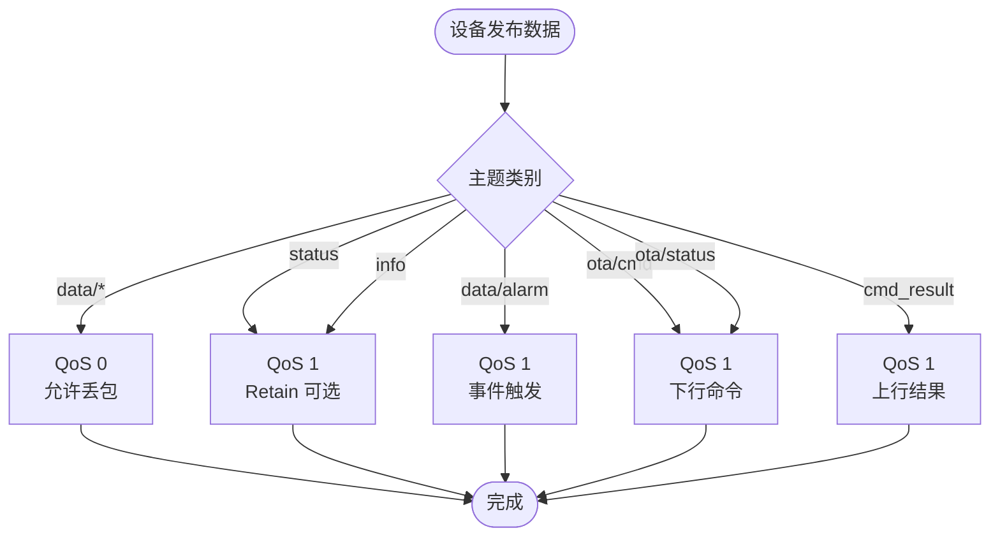
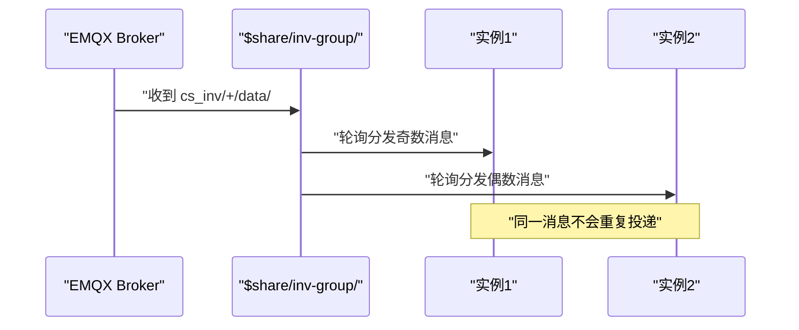
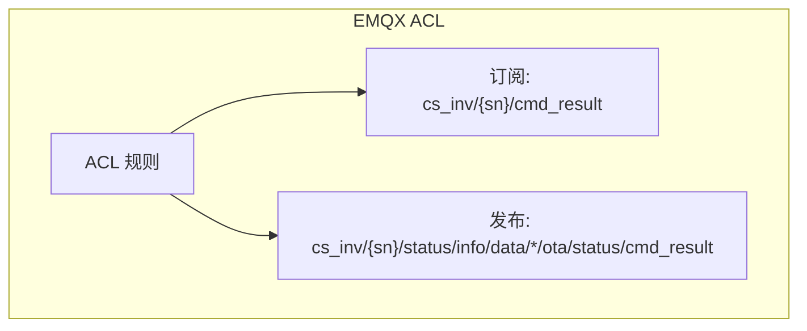
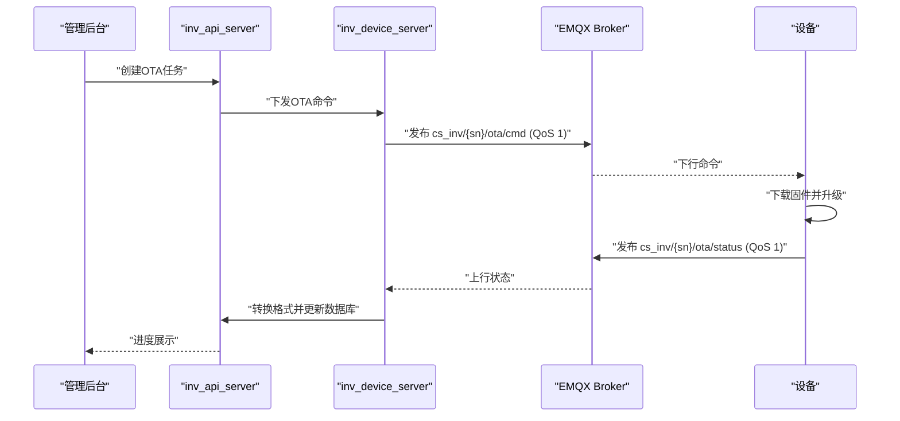
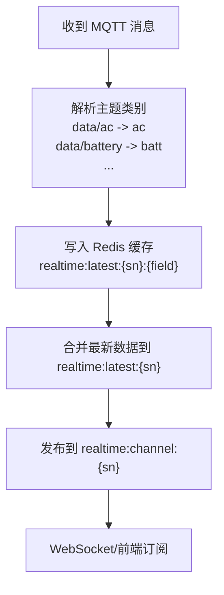
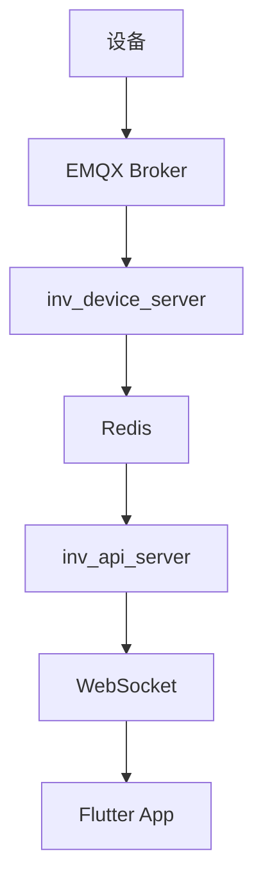

# 主题结构规范

<cite>
**本文引用的文件**
- [README.md](file://README.md)
- [client.go](file://inv_device_server/internal/mqtt/client.go)
- [protocol_parser.go](file://inv_device_server/internal/service/protocol_parser.go)
- [ws_handler.go](file://inv_api_server/internal/handler/ws_handler.go)
- [ARM_ESP32_UART_Protocol.md](file://docs/ARM_ESP32_UART_Protocol.md)
- [MQTT接口文档.md](file://docs/MQTT接口文档.md)
- [系统参数规范_48V离网逆变器.md](file://docs/系统参数规范_48V离网逆变器.md)
- [设备端OTA程序开发指南.md](file://docs/设备端OTA程序开发指南.md)
- [架构升级任务清单.md](file://docs/架构升级任务清单.md)
- [schema.sql](file://database/schema.sql)
- [create_device_models.sql](file://deploy/create_device_models.sql)
- [mqtt_benchmark.sh](file://deploy/mqtt_benchmark.sh)
- [debug-alarm-not-displayed.md](file://debug-alarm-not-displayed.md)
</cite>

## 目录
1. [引言](#引言)
2. [项目结构](#项目结构)
3. [核心组件](#核心组件)
4. [架构总览](#架构总览)
5. [详细组件分析](#详细组件分析)
6. [依赖关系分析](#依赖关系分析)
7. [性能考虑](#性能考虑)
8. [故障排查指南](#故障排查指南)
9. [结论](#结论)
10. [附录](#附录)

## 引言
本文件面向MQTT主题结构的设计与实现，围绕 cs_inv/{设备SN}/{子主题} 的标准化命名规范展开，系统性阐述各子主题的功能分类、QoS与保留消息（Retain）策略、订阅与发布权限控制、通配符使用以及EMQX共享订阅机制 $share/inv-group/ 的负载均衡配置。同时提供面向开发者的最佳实践与扩展指南，帮助在保证实时性与可靠性的同时，构建可维护、可扩展的主题体系。

## 项目结构
本项目采用“设备直连EMQX + 后端服务订阅”的架构模式，移动端与管理后台通过EMQX进行实时数据交互，设备侧通过统一的主题命名规范上报数据。核心主题路径遵循 cs_inv/{sn}/{子主题} 结构，其中：
- cs_inv：主题根命名空间
- {sn}：设备序列号（SN）
- {子主题}：功能域，如 status、info、data/ac、data/battery、data/pv、data/status、data/energy、data/cells、data/alarm、ota/cmd、ota/status、cmd_result 等

**图表来源**
- [README.md: 7-31:7-31](file://README.md#L7-L31)
- [client.go: 159-171:159-171](file://inv_device_server/internal/mqtt/client.go#L159-L171)
- [ws_handler.go: 87-122:87-122](file://inv_api_server/internal/handler/ws_handler.go#L87-L122)

**章节来源**
- [README.md: 35-109:35-109](file://README.md#L35-L109)
- [README.md: 206-279:206-279](file://README.md#L206-L279)

## 核心组件
- 主题命名规范：cs_inv/{sn}/{子主题}
- 子主题分类：
  - 状态监控：cs_inv/{sn}/status
  - 设备信息：cs_inv/{sn}/info
  - 数据上报：cs_inv/{sn}/data/ac、cs_inv/{sn}/data/battery、cs_inv/{sn}/data/pv、cs_inv/{sn}/data/status、cs_inv/{sn}/data/energy、cs_inv/{sn}/data/cells
  - 告警事件：cs_inv/{sn}/data/alarm
  - OTA升级：cs_inv/{sn}/ota/cmd（下行）、cs_inv/{sn}/ota/status（上行）
  - 命令结果：cs_inv/{sn}/cmd_result
- QoS与Retain策略：
  - 设备上报数据类（data/*）：QoS 0
  - 状态类（status、info）：QoS 1；status建议Retain true
  - 告警事件（data/alarm）：QoS 1
  - OTA命令与结果：QoS 1
  - 命令结果：QoS 1
- 通配符与共享订阅：
  - 通配符：+（单级）、#（多级）
  - 共享订阅：$share/inv-group/ 前缀，实现多实例轮询分发
- 权限控制：
  - 设备侧：通过EMQX内置JWT认证（HS256），用户名为设备SN，密码为JWT Token
  - 订阅权限：设备仅能订阅 cs_inv/{sn}/cmd_result
  - 发布权限：设备可发布 cs_inv/{sn}/status、cs_inv/{sn}/info、cs_inv/{sn}/data/*、cs_inv/{sn}/ota/status、cs_inv/{sn}/cmd_result

**章节来源**
- [ARM_ESP32_UART_Protocol.md: 963-971:963-971](file://docs/ARM_ESP32_UART_Protocol.md#L963-L971)
- [MQTT接口文档.md: 73-80:73-80](file://docs/MQTT接口文档.md#L73-L80)
- [系统参数规范_48V离网逆变器.md: 458, 485](file://docs/系统参数规范_48V离网逆变器.md#L458L485)
- [设备端OTA程序开发指南.md: 892](file://docs/设备端OTA程序开发指南.md#L892)
- [架构升级任务清单.md: 68](file://docs/架构升级任务清单.md#L68)
- [README.md: 247, 344](file://README.md#L247L344)

## 架构总览
系统采用“设备直连EMQX -> 共享订阅 -> 后端服务 -> 数据存储/推送”的链路，确保高并发场景下的负载均衡与高可用。

**图表来源**
- [README.md: 206-224:206-224](file://README.md#L206-L224)
- [client.go: 159-171:159-171](file://inv_device_server/internal/mqtt/client.go#L159-L171)
- [ws_handler.go: 87-122:87-122](file://inv_api_server/internal/handler/ws_handler.go#L87-L122)

## 详细组件分析

### 主题命名与层级结构
- cs_inv/{sn}/status：设备在线状态（含LWT离线），建议Retain true
- cs_inv/{sn}/info：设备信息（上电一次性上报）
- cs_inv/{sn}/data/ac：交流输出数据
- cs_inv/{sn}/data/battery：电池BMS数据
- cs_inv/{sn}/data/pv：光伏MPPT数据
- cs_inv/{sn}/data/status：逆变器系统状态
- cs_inv/{sn}/data/energy：能量统计
- cs_inv/{sn}/data/cells：电芯详细数据
- cs_inv/{sn}/data/alarm：告警/故障事件
- cs_inv/{sn}/ota/cmd：OTA升级命令（下行）
- cs_inv/{sn}/ota/status：OTA状态上报（上行）
- cs_inv/{sn}/cmd_result：命令执行结果

**图表来源**
- [ARM_ESP32_UART_Protocol.md: 963-971:963-971](file://docs/ARM_ESP32_UART_Protocol.md#L963-L971)
- [系统参数规范_48V离网逆变器.md: 458, 485](file://docs/系统参数规范_48V离网逆变器.md#L458L485)

**章节来源**
- [ARM_ESP32_UART_Protocol.md: 963-971:963-971](file://docs/ARM_ESP32_UART_Protocol.md#L963-L971)
- [MQTT接口文档.md: 73-80:73-80](file://docs/MQTT接口文档.md#L73-L80)

### QoS与Retain策略
- 设备上报数据类（data/*）：QoS 0，允许丢包以换取实时性
- 状态类（status、info）：QoS 1；status建议Retain true，便于后端快速判断在线/离线
- 告警事件（data/alarm）：QoS 1，确保可靠到达
- OTA命令与结果：QoS 1，保障升级过程的可靠性
- 命令结果：QoS 1，确保上行结果可靠

**图表来源**
- [MQTT接口文档.md: 73-80:73-80](file://docs/MQTT接口文档.md#L73-L80)
- [设备端OTA程序开发指南.md: 892](file://docs/设备端OTA程序开发指南.md#L892)

**章节来源**
- [MQTT接口文档.md: 73-80:73-80](file://docs/MQTT接口文档.md#L73-L80)
- [系统参数规范_48V离网逆变器.md: 458, 485](file://docs/系统参数规范_48V离网逆变器.md#L458L485)
- [设备端OTA程序开发指南.md: 892](file://docs/设备端OTA程序开发指南.md#L892)

### 通配符与共享订阅
- 通配符：
  - +：匹配单级主题
  - #：匹配多级主题
- 共享订阅：
  - $share/inv-group/ 前缀，EMQX轮询分发消息至多个 inv_device_server 实例
  - 后端订阅主题改为 cs_inv/+/...，EMQX内部自动转换为 $share/inv-group/cs_inv/+/...

**图表来源**
- [README.md: 247, 344](file://README.md#L247L344)
- [client.go: 159-171:159-171](file://inv_device_server/internal/mqtt/client.go#L159-L171)

**章节来源**
- [README.md: 247, 344](file://README.md#L247L344)
- [架构升级任务清单.md: 68](file://docs/架构升级任务清单.md#L68)

### 权限控制方案
- 设备认证：用户名=SN，密码=JWT（HS256），EMQX内置JWT验证，过期自动断连
- 订阅权限：设备仅允许订阅 cs_inv/{sn}/cmd_result
- 发布权限：设备可发布 cs_inv/{sn}/status、cs_inv/{sn}/info、cs_inv/{sn}/data/*、cs_inv/{sn}/ota/status、cs_inv/{sn}/cmd_result

**图表来源**
- [README.md: 8-31:8-31](file://README.md#L8-L31)
- [client.go: 159-171:159-171](file://inv_device_server/internal/mqtt/client.go#L159-L171)

**章节来源**
- [README.md: 8-31:8-31](file://README.md#L8-L31)
- [client.go: 159-171:159-171](file://inv_device_server/internal/mqtt/client.go#L159-L171)

### OTA升级主题流

**图表来源**
- [README.md: 253-279:253-279](file://README.md#L253-L279)
- [系统参数规范_48V离网逆变器.md: 458, 485](file://docs/系统参数规范_48V离网逆变器.md#L458L485)

**章节来源**
- [README.md: 253-279:253-279](file://README.md#L253-L279)
- [系统参数规范_48V离网逆变器.md: 458, 485](file://docs/系统参数规范_48V离网逆变器.md#L458L485)

### 数据解析与缓存
后端服务根据主题类别将数据写入Redis缓存与Pub/Sub通道，支持按字段查询与实时推送。

**图表来源**
- [protocol_parser.go: 835-845:835-845](file://inv_device_server/internal/service/protocol_parser.go#L835-L845)
- [protocol_parser.go: 784-833:784-833](file://inv_device_server/internal/service/protocol_parser.go#L784-L833)
- [ws_handler.go: 87-122:87-122](file://inv_api_server/internal/handler/ws_handler.go#L87-L122)

**章节来源**
- [protocol_parser.go: 835-845:835-845](file://inv_device_server/internal/service/protocol_parser.go#L835-L845)
- [protocol_parser.go: 784-833:784-833](file://inv_device_server/internal/service/protocol_parser.go#L784-L833)
- [ws_handler.go: 87-122:87-122](file://inv_api_server/internal/handler/ws_handler.go#L87-L122)

## 依赖关系分析
- 主题依赖：后端服务依赖EMQX共享订阅机制实现高可用；前端通过EMQX直连订阅实现低延迟推送
- 数据依赖：设备侧数据经EMQX -> Redis Pub/Sub/Streams -> API Server -> WebSocket
- 权限依赖：EMQX内置JWT认证与ACL规则控制设备发布/订阅行为

**图表来源**
- [README.md: 206-224:206-224](file://README.md#L206-L224)
- [ws_handler.go: 87-122:87-122](file://inv_api_server/internal/handler/ws_handler.go#L87-L122)

**章节来源**
- [README.md: 206-224:206-224](file://README.md#L206-L224)
- [ws_handler.go: 87-122:87-122](file://inv_api_server/internal/handler/ws_handler.go#L87-L122)

## 性能考虑
- QoS选择：实时数据（data/*）使用QoS 0，降低网络与处理开销；关键事件（status、alarm、ota、cmd_result）使用QoS 1，确保可靠性
- Retain策略：status建议Retain true，减少后端发现设备在线的延迟
- 共享订阅：$share/inv-group/实现多实例轮询分发，避免消息重复投递，提升吞吐
- 压测工具：提供mqtt_benchmark.sh用于MQTT压测，便于评估系统承载能力

**章节来源**
- [MQTT接口文档.md: 73-80:73-80](file://docs/MQTT接口文档.md#L73-L80)
- [设备端OTA程序开发指南.md: 892](file://docs/设备端OTA程序开发指南.md#L892)
- [README.md: 247, 344](file://README.md#L247L344)
- [mqtt_benchmark.sh: 39](file://deploy/mqtt_benchmark.sh#L39)

## 故障排查指南
- 告警未显示：检查设备是否正确发布到 cs_inv/{sn}/data/alarm；确认后端是否订阅该主题且Redis Pub/Sub通道正常
- 在线状态异常：确认设备status主题是否Retain true，且EMQX是否正确转发保留消息
- OTA升级失败：核对 cs_inv/{sn}/ota/cmd 与 cs_inv/{sn}/ota/status 的QoS均为1，且设备端实现符合规范

**章节来源**
- [debug-alarm-not-displayed.md: 5](file://debug-alarm-not-displayed.md#L5)
- [系统参数规范_48V离网逆变器.md: 458, 485](file://docs/系统参数规范_48V离网逆变器.md#L458L485)

## 结论
通过标准化的主题命名、合理的QoS与Retain策略、严格的权限控制以及EMQX共享订阅机制，系统实现了高并发、低延迟、可靠的设备数据采集与推送。建议在扩展新子主题时遵循现有命名与策略，确保整体一致性与可维护性。

## 附录

### 主题定义与示例
- cs_inv/{sn}/status：QoS 1，Retain 可选，设备在线状态
- cs_inv/{sn}/info：QoS 1，Retain false，设备信息
- cs_inv/{sn}/data/ac：QoS 0，Retain false，交流输出数据
- cs_inv/{sn}/data/battery：QoS 0，Retain false，电池BMS数据
- cs_inv/{sn}/data/pv：QoS 0，Retain false，光伏MPPT数据
- cs_inv/{sn}/data/status：QoS 0，Retain false，系统状态
- cs_inv/{sn}/data/energy：QoS 0，Retain false，能量统计
- cs_inv/{sn}/data/cells：QoS 0，Retain false，电芯详细数据
- cs_inv/{sn}/data/alarm：QoS 1，Retain false，告警事件
- cs_inv/{sn}/ota/cmd：QoS 1，Retain false，OTA命令
- cs_inv/{sn}/ota/status：QoS 1，Retain false，OTA状态
- cs_inv/{sn}/cmd_result：QoS 1，Retain false，命令执行结果

**章节来源**
- [MQTT接口文档.md: 73-80:73-80](file://docs/MQTT接口文档.md#L73-L80)
- [ARM_ESP32_UART_Protocol.md: 963-971:963-971](file://docs/ARM_ESP32_UART_Protocol.md#L963-L971)
- [系统参数规范_48V离网逆变器.md: 458, 485](file://docs/系统参数规范_48V离网逆变器.md#L458L485)

### 最佳实践与扩展指南
- 命名规范：严格遵循 cs_inv/{sn}/{子主题}，避免跨域混用
- QoS策略：实时数据优先使用QoS 0，关键事件使用QoS 1
- Retain策略：status建议Retain true，info一次性即可
- 权限控制：设备仅发布指定主题，仅订阅 cs_inv/{sn}/cmd_result
- 共享订阅：后端统一使用 $share/inv-group/ 前缀，确保多实例负载均衡
- 扩展建议：新增子主题时，先在数据库与部署脚本中声明白名单，再完善后端解析与前端展示

**章节来源**
- [schema.sql: 406](file://database/schema.sql#L406)
- [create_device_models.sql: 20](file://deploy/create_device_models.sql#L20)
- [架构升级任务清单.md: 68](file://docs/架构升级任务清单.md#L68)