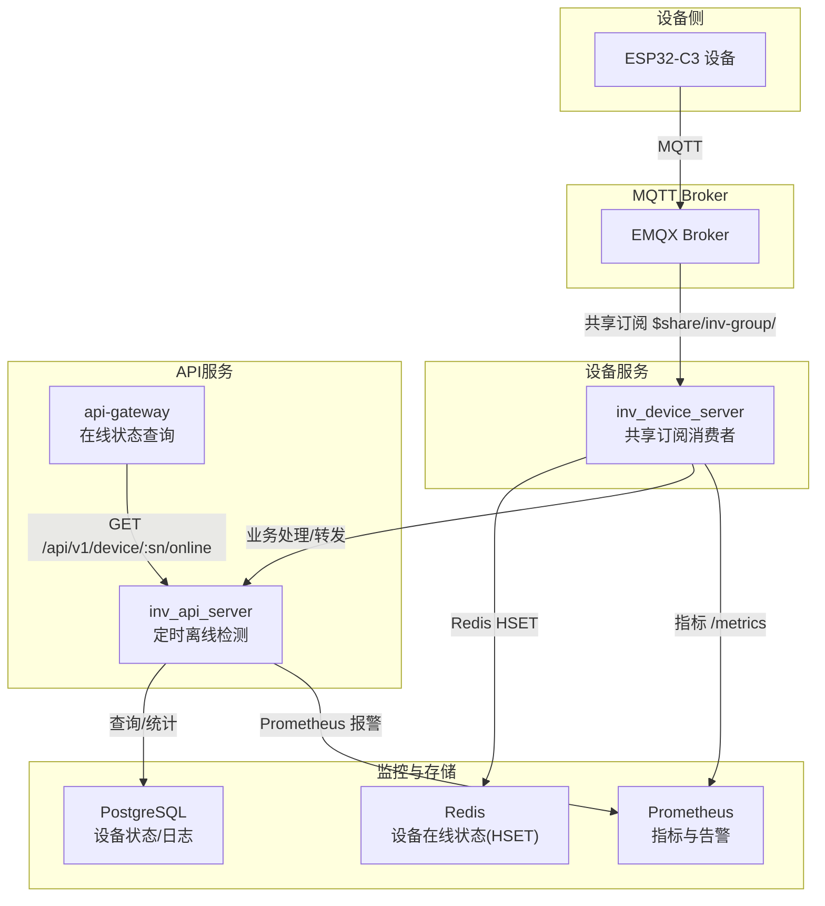
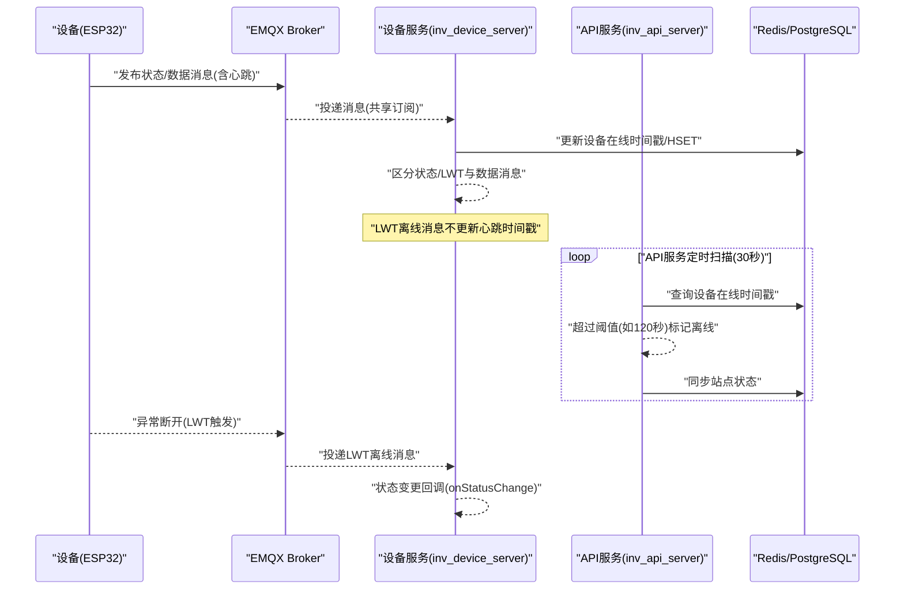
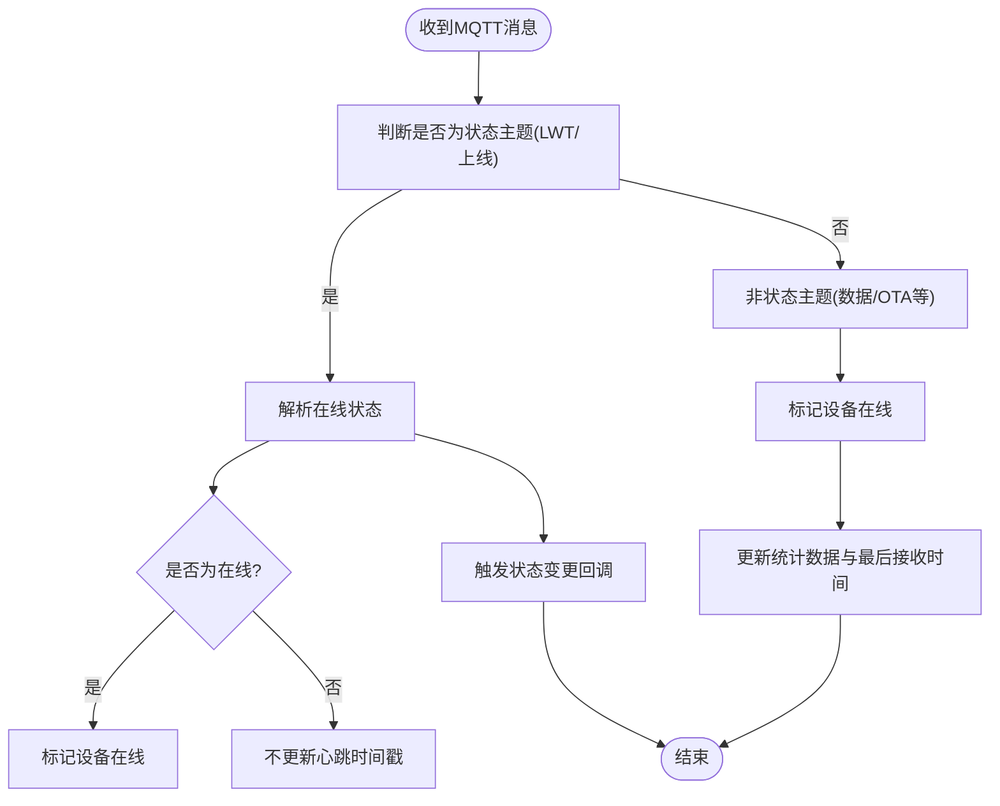
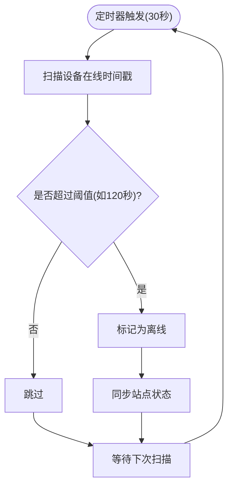
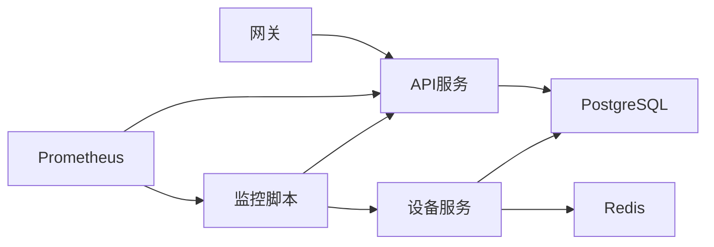

# 心跳与遗嘱机制

<cite>
**本文引用的文件**
- [README.md](file://README.md)
- [main.go](file://inv_api_server/cmd/main.go)
- [client.go](file://inv_device_server/internal/mqtt/client.go)
- [config.go](file://inv_device_server/internal/config/config.go)
- [routes.go](file://api-gateway/internal/routes/routes.go)
- [dashboard_handler.go](file://inv_api_server/internal/handler/dashboard_handler.go)
- [admin_handler.go](file://inv_api_server/internal/handler/admin_handler.go)
- [monitor.sh](file://deploy/monitor.sh)
- [mosquitto.conf](file://deploy/mosquitto/mosquitto.conf)
</cite>

## 目录
1. [引言](#引言)
2. [项目结构](#项目结构)
3. [核心组件](#核心组件)
4. [架构总览](#架构总览)
5. [详细组件分析](#详细组件分析)
6. [依赖关系分析](#依赖关系分析)
7. [性能考虑](#性能考虑)
8. [故障排查指南](#故障排查指南)
9. [结论](#结论)
10. [附录](#附录)

## 引言
本技术文档围绕MQTT心跳与遗嘱（LWT）机制展开，面向系统集成商与开发者，全面阐述设备在线状态检测的完整机制。文档覆盖以下要点：
- 设备在线状态检测：ESP32到ARM的心跳检测（10秒间隔）、ESP32到云端的状态心跳（60秒间隔）
- MQTT LWT遗嘱消息的实现与触发条件
- 心跳包格式、超时阈值设置与异常处理策略
- 在线状态判断逻辑：设备在线、网络断开、设备离线的识别机制
- ARM侧超时报警机制（30秒未收到心跳）与设备异常断开检测方案
- 性能优化、网络适应性与故障恢复策略
- 心跳机制的定制化配置与监控告警设置指南

## 项目结构
该系统采用“设备直连EMQX + 设备服务消费 + API服务管理”的分层架构。与心跳机制直接相关的核心模块包括：
- 设备侧：ESP32-C3通过MQTT向EMQX发布状态/数据，使用LWT表达在线状态
- 设备服务（Go）：订阅共享主题，维护设备在线状态，处理LWT与业务消息
- API服务（Go）：定时扫描离线设备，提供在线状态查询与仪表盘统计
- 网关与监控：统一路由与健康检查脚本，配合Prometheus告警规则

图示来源
- [README.md:206-251](file://README.md#L206-L251)
- [client.go:146-236](file://inv_device_server/internal/mqtt/client.go#L146-L236)
- [routes.go:175-175](file://api-gateway/internal/routes/routes.go#L175-L175)

章节来源
- [README.md:112-251](file://README.md#L112-L251)

## 核心组件
- 设备服务中的MQTT客户端与Hub：负责建立与EMQX的连接、订阅共享主题、解析消息、维护设备在线状态、处理LWT与OTA等业务消息。
- API服务中的心跳扫描：周期性扫描长时间无心跳的设备，将其标记为离线并同步站点状态。
- API网关：提供设备在线状态查询接口，供前端与管理后台调用。
- 监控与告警：结合Prometheus与shell脚本实现服务健康检查与告警。

章节来源
- [client.go:1-236](file://inv_device_server/internal/mqtt/client.go#L1-L236)
- [main.go:165-183](file://inv_api_server/cmd/main.go#L165-L183)
- [routes.go:175-175](file://api-gateway/internal/routes/routes.go#L175-L175)

## 架构总览
心跳与遗嘱机制在系统中的工作流如下：
- 设备侧定期发布状态/数据消息，携带心跳信息；若设备异常断开，Broker根据LWT自动发布离线消息
- 设备服务订阅共享主题，区分状态主题与数据主题，对LWT消息不更新心跳时间戳，仅用于状态变更通知
- 设备服务同时维护Redis中的设备在线时间戳，用于快速判定在线设备集合
- API服务每30秒扫描一次，将超过设定阈值（如120秒）未更新心跳的设备标记为离线
- 管理端通过网关接口查询设备在线状态，仪表盘统计在线/离线数量

图示来源
- [client.go:186-236](file://inv_device_server/internal/mqtt/client.go#L186-L236)
- [main.go:165-183](file://inv_api_server/cmd/main.go#L165-L183)

## 详细组件分析

### 设备服务MQTT客户端与Hub
- 连接与订阅：客户端通过共享订阅前缀订阅主题，确保多实例负载均衡
- 消息处理：
  - 状态主题（LWT/上线消息）：不更新心跳时间戳，仅用于状态变更通知
  - 数据主题：设备发送真实数据时，更新心跳时间戳与统计信息
- 在线状态维护：Hub通过Redis HSET维护设备在线时间戳，提供在线设备查询能力
- 错误处理：捕获客户端错误与服务端断开事件，记录日志便于排障

图示来源
- [client.go:186-236](file://inv_device_server/internal/mqtt/client.go#L186-L236)

章节来源
- [client.go:1-236](file://inv_device_server/internal/mqtt/client.go#L1-L236)

### API服务心跳扫描与离线标记
- 定时器：每30秒触发一次扫描
- 扫描逻辑：查询超过设定阈值（如120秒）未更新心跳的设备，批量标记为离线
- 状态同步：离线设备标记完成后，同步站点状态，保证统计准确性
- 异常处理：扫描过程中出现错误会记录日志，但不影响后续扫描

图示来源
- [main.go:165-183](file://inv_api_server/cmd/main.go#L165-L183)

章节来源
- [main.go:165-183](file://inv_api_server/cmd/main.go#L165-L183)

### 在线状态查询接口
- 接口路径：GET /api/v1/device/:sn/online
- 功能：查询指定设备的在线状态
- 认证：需要鉴权（Auth: true）

章节来源
- [routes.go:175-175](file://api-gateway/internal/routes/routes.go#L175-L175)

### 仪表盘与统计
- 仪表盘接口周期性触发心跳扫描，确保在线/离线统计的实时性
- 统计SQL中使用过滤条件区分在线与离线状态，保障数据准确性

章节来源
- [dashboard_handler.go:1015-1027](file://inv_api_server/internal/handler/dashboard_handler.go#L1015-L1027)
- [dashboard_handler.go:60-84](file://inv_api_server/internal/handler/dashboard_handler.go#L60-L84)
- [dashboard_handler.go:238-271](file://inv_api_server/internal/handler/dashboard_handler.go#L238-L271)

### 配置与环境
- 设备服务配置：包含MQTT Broker地址、端口、TLS配置等
- EMQX配置：JWT认证、共享订阅、LWT行为等
- 监控脚本：服务健康检查与自动重启策略

章节来源
- [config.go](file://inv_device_server/internal/config/config.go)
- [mosquitto.conf](file://deploy/mosquitto/mosquitto.conf)
- [monitor.sh:1-53](file://deploy/monitor.sh#L1-L53)

## 依赖关系分析
- 设备服务依赖Redis维护在线状态，依赖PostgreSQL存储设备元数据与日志
- API服务依赖设备服务提供的在线状态与业务数据，提供查询与统计接口
- 网关作为统一入口，将在线状态查询路由至API服务
- 监控脚本与Prometheus共同实现服务健康与告警

图示来源
- [client.go:47-52](file://inv_device_server/internal/mqtt/client.go#L47-L52)
- [main.go:165-183](file://inv_api_server/cmd/main.go#L165-L183)
- [routes.go:175-175](file://api-gateway/internal/routes/routes.go#L175-L175)
- [monitor.sh:1-53](file://deploy/monitor.sh#L1-L53)

## 性能考虑
- 心跳频率与阈值平衡
  - 设备到ARM心跳：10秒间隔，确保快速感知设备侧异常
  - 设备到云端状态心跳：60秒间隔，降低带宽与CPU消耗
  - 离线阈值：建议设置为心跳周期的2~3倍（如120秒），避免网络抖动导致误判
- Redis在线状态维护
  - 使用HSET存储设备在线时间戳，查询复杂度低，适合高频统计
  - 定时扫描周期（30秒）与阈值（120秒）协同，兼顾实时性与性能
- 消息处理优化
  - 区分状态/LWT与数据消息，避免LWT消息更新心跳时间戳
  - 对OTA状态与命令确认进行专门处理，减少无关逻辑干扰
- 网络适应性
  - 共享订阅确保多实例负载均衡，提升吞吐能力
  - TLS与JWT认证保障连接安全，减少非法连接带来的资源消耗

## 故障排查指南
- 设备频繁离线
  - 检查设备侧心跳发布频率与阈值设置是否匹配
  - 查看设备服务日志，确认是否收到设备数据消息而非仅LWT消息
  - 核对API服务扫描周期与阈值，避免误判
- 在线状态查询异常
  - 确认网关路由配置正确，接口鉴权有效
  - 检查Redis连接与HSET键是否存在
- 服务异常
  - 使用监控脚本检查服务状态，必要时手动重启
  - 查看Prometheus告警规则，定位异常根因

章节来源
- [client.go:226-236](file://inv_device_server/internal/mqtt/client.go#L226-L236)
- [monitor.sh:23-46](file://deploy/monitor.sh#L23-L46)

## 结论
本心跳与遗嘱机制通过“设备侧定期心跳 + Broker LWT + 设备服务在线维护 + API服务定时扫描”的组合，实现了高可靠、低误报的设备在线状态检测。系统在性能与稳定性之间取得良好平衡，并提供了完善的监控与告警能力，满足大规模设备接入场景下的实时监控需求。

## 附录

### 心跳机制定制化配置指南
- 心跳周期
  - 设备到ARM：建议10秒
  - 设备到云端：建议60秒
- 离线阈值
  - 建议设置为心跳周期的2~3倍（如120秒）
- 扫描周期
  - API服务扫描周期：30秒
- Redis键与字段
  - 在线状态存储：HSET键为设备标识，值为最近心跳时间戳
- 接口与权限
  - 在线状态查询接口：GET /api/v1/device/:sn/online
  - 需要鉴权（Auth: true）

章节来源
- [main.go:165-183](file://inv_api_server/cmd/main.go#L165-L183)
- [client.go:106-128](file://inv_device_server/internal/mqtt/client.go#L106-L128)
- [routes.go:175-175](file://api-gateway/internal/routes/routes.go#L175-L175)

### 监控告警设置指南
- 服务健康检查
  - 使用监控脚本定期检查服务状态，失败时自动重启
- Prometheus告警
  - 配置Prometheus抓取设备服务指标端点
  - 设置告警规则：如设备在线数骤降、API扫描失败、Redis连接异常等
- 邮件/IM告警
  - 可扩展监控脚本以发送邮件或IM通知

章节来源
- [monitor.sh:1-53](file://deploy/monitor.sh#L1-L53)
- [README.md:195-206](file://README.md#L195-L206)