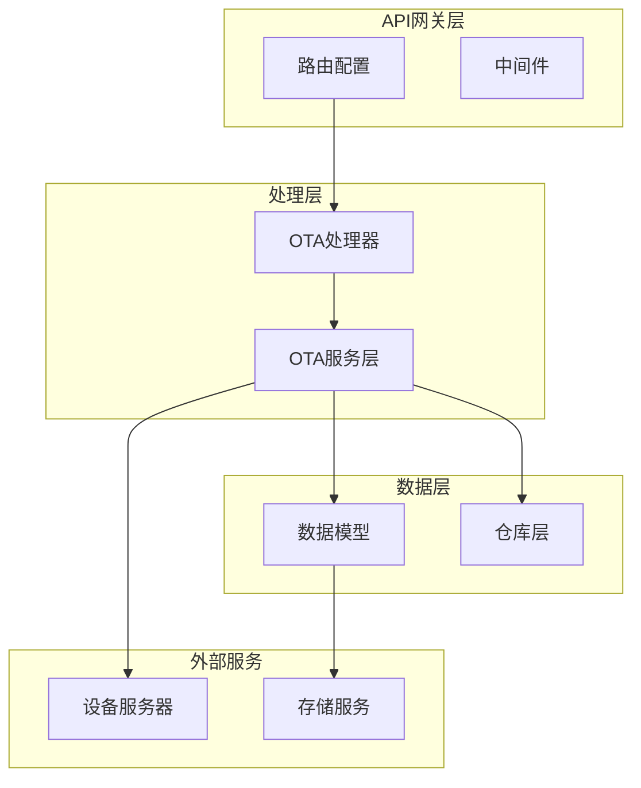
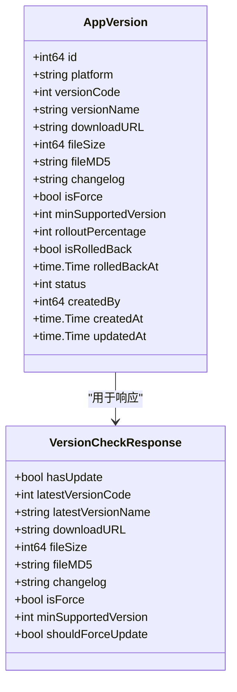
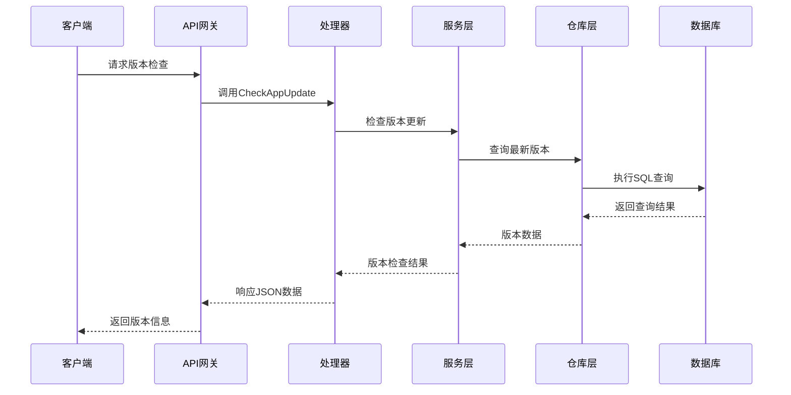
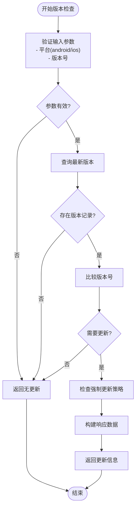
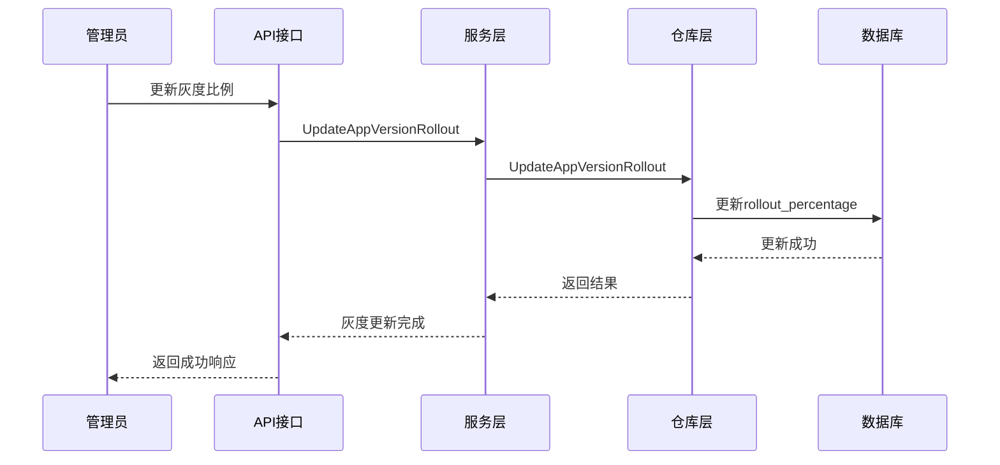
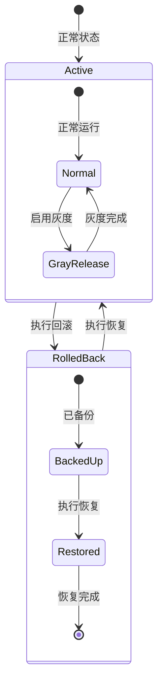
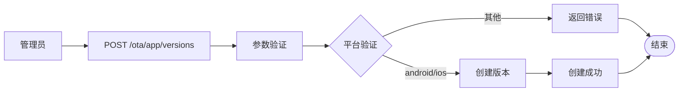
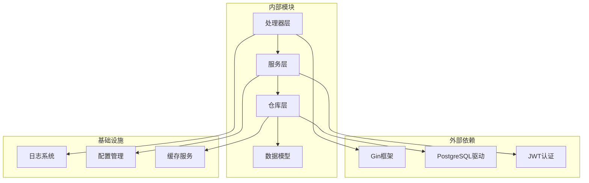

# App版本管理

<cite>
**本文档引用的文件**
- [inv_api_server/cmd/main.go](file://inv_api_server/cmd/main.go)
- [inv_api_server/internal/handler/ota_handler.go](file://inv_api_server/internal/handler/ota_handler.go)
- [inv_api_server/internal/service/ota_service.go](file://inv_api_server/internal/service/ota_service.go)
- [inv_api_server/internal/model/models.go](file://inv_api_server/internal/model/models.go)
- [README.md](file://README.md)
</cite>

## 目录
1. [简介](#简介)
2. [项目结构](#项目结构)
3. [核心组件](#核心组件)
4. [架构概览](#架构概览)
5. [详细组件分析](#详细组件分析)
6. [依赖关系分析](#依赖关系分析)
7. [性能考虑](#性能考虑)
8. [故障排除指南](#故障排除指南)
9. [结论](#结论)
10. [附录](#附录)

## 简介

本项目实现了完整的App版本管理系统，支持移动应用版本的全生命周期管理。系统提供了版本创建、发布、下架、强制更新、灰度发布、版本回滚与恢复等功能，并包含完善的查询和检查接口。

该系统采用Go语言开发，基于Gin框架构建RESTful API，使用PostgreSQL作为数据存储，通过清晰的分层架构实现了业务逻辑的模块化管理。

## 项目结构

App版本管理系统主要由以下核心模块组成：

**图表来源**
- [inv_api_server/cmd/main.go:567-575](file://inv_api_server/cmd/main.go#L567-L575)
- [inv_api_server/internal/handler/ota_handler.go:379-412](file://inv_api_server/internal/handler/ota_handler.go#L379-L412)

**章节来源**
- [inv_api_server/cmd/main.go:548-588](file://inv_api_server/cmd/main.go#L548-L588)

## 核心组件

### 版本管理接口

系统提供了完整的App版本管理接口体系：

| 接口类型 | 方法 | 路径 | 权限 | 功能描述 |
|---------|------|------|------|----------|
| 查询 | GET | `/ota/app/check` | 无需权限 | 客户端版本检查 |
| 管理 | GET | `/ota/app/versions` | ota:view | 列出App版本 |
| 管理 | POST | `/ota/app/versions` | ota:create | 创建App版本 |
| 管理 | DELETE | `/ota/app/versions/:id` | ota:delete | 删除App版本 |
| 控制 | PUT | `/ota/app/versions/:id/rollout` | ota:control | 更新灰度比例 |
| 控制 | POST | `/ota/app/versions/:id/rollback` | ota:control | 版本回滚 |
| 控制 | POST | `/ota/app/versions/:id/restore` | ota:control | 版本恢复 |

### 版本元数据模型

App版本的核心数据结构定义如下：

**图表来源**
- [inv_api_server/internal/model/models.go:360-378](file://inv_api_server/internal/model/models.go#L360-L378)

**章节来源**
- [inv_api_server/internal/model/models.go:360-378](file://inv_api_server/internal/model/models.go#L360-L378)

## 架构概览

系统采用经典的三层架构设计，实现了清晰的职责分离：

**图表来源**
- [inv_api_server/internal/handler/ota_handler.go:381-412](file://inv_api_server/internal/handler/ota_handler.go#L381-L412)
- [inv_api_server/internal/service/ota_service.go:315-325](file://inv_api_server/internal/service/ota_service.go#L315-L325)

## 详细组件分析

### 版本检查流程

版本检查是系统的核心功能之一，负责判断客户端是否需要更新：

**图表来源**
- [inv_api_server/internal/handler/ota_handler.go:381-412](file://inv_api_server/internal/handler/ota_handler.go#L381-L412)

#### 强制更新机制

系统实现了双重强制更新策略：

1. **显式强制更新**: 通过`is_force`字段直接标记为强制更新
2. **最小版本控制**: 通过`min_supported_version`字段实现最低支持版本控制

当满足以下任一条件时，客户端会被要求强制更新：
- 版本标记为强制更新 (`is_force = true`)
- 当前客户端版本低于最低支持版本 (`version_code < min_supported_version`)

**章节来源**
- [inv_api_server/internal/handler/ota_handler.go:381-412](file://inv_api_server/internal/handler/ota_handler.go#L381-L412)

### 灰度发布功能

灰度发布允许系统逐步向用户推送新版本，支持精确的用户群体控制：

**图表来源**
- [inv_api_server/internal/handler/ota_handler.go:482-501](file://inv_api_server/internal/handler/ota_handler.go#L482-L501)

灰度发布的关键特性：
- 支持0-100%的渐进式推送
- 可动态调整灰度比例
- 实现平滑的版本过渡

**章节来源**
- [inv_api_server/internal/handler/ota_handler.go:482-501](file://inv_api_server/internal/handler/ota_handler.go#L482-L501)

### 版本回滚与恢复机制

系统提供了完整的版本回滚和恢复能力，支持紧急情况下的快速响应：

**图表来源**
- [inv_api_server/internal/handler/ota_handler.go:503-533](file://inv_api_server/internal/handler/ota_handler.go#L503-L533)

#### 紧急回滚流程

当检测到新版本存在严重问题时，管理员可以执行紧急回滚：

1. **立即停止新版本分发**
2. **标记版本为回滚状态**
3. **通知相关用户降级到稳定版本**
4. **监控系统稳定性**

#### 版本恢复流程

在问题解决后，可以执行版本恢复：

1. **验证问题已解决**
2. **重新启用新版本分发**
3. **按计划推进灰度发布**
4. **监控系统运行状态**

**章节来源**
- [inv_api_server/internal/handler/ota_handler.go:503-533](file://inv_api_server/internal/handler/ota_handler.go#L503-L533)

### 版本管理API详解

#### 版本创建接口

管理员可以通过以下接口创建新的App版本：

**图表来源**
- [inv_api_server/internal/handler/ota_handler.go:414-455](file://inv_api_server/internal/handler/ota_handler.go#L414-L455)

#### 版本查询接口

系统提供了灵活的版本查询能力：

- **按平台查询**: `GET /ota/app/versions?platform=android`
- **分页查询**: 支持`page`和`page_size`参数
- **完整版本列表**: `GET /ota/app/versions`

**章节来源**
- [inv_api_server/internal/handler/ota_handler.go:457-466](file://inv_api_server/internal/handler/ota_handler.go#L457-L466)

## 依赖关系分析

系统采用清晰的依赖层次结构：

**图表来源**
- [inv_api_server/cmd/main.go:548-588](file://inv_api_server/cmd/main.go#L548-L588)

**章节来源**
- [inv_api_server/cmd/main.go:548-588](file://inv_api_server/cmd/main.go#L548-L588)

## 性能考虑

### 缓存策略

- **版本信息缓存**: 使用Redis缓存最新的版本信息，减少数据库查询压力
- **权限缓存**: 缓存用户权限信息，提高鉴权效率
- **配置缓存**: 缓存系统配置，避免频繁读取配置文件

### 数据库优化

- **索引优化**: 为常用查询字段建立适当索引
- **连接池管理**: 合理配置数据库连接池大小
- **查询优化**: 使用预编译语句，避免SQL注入

### API性能

- **响应压缩**: 启用Gzip压缩，减少网络传输
- **分页查询**: 默认限制每页最大条数，防止大数据量查询
- **并发控制**: 实现请求限流，保护系统资源

## 故障排除指南

### 常见问题及解决方案

#### 版本检查失败

**问题现象**: 客户端无法获取版本信息

**可能原因**:
1. 数据库连接异常
2. 版本数据缺失
3. 参数验证失败

**解决方案**:
1. 检查数据库连接状态
2. 验证版本数据完整性
3. 确认请求参数格式正确

#### 强制更新不生效

**问题现象**: 客户端未收到强制更新提示

**可能原因**:
1. 版本号比较逻辑错误
2. 最低支持版本设置不当
3. 客户端版本号解析问题

**解决方案**:
1. 检查版本号比较算法
2. 验证最低支持版本配置
3. 确认客户端版本号格式

#### 灰度发布异常

**问题现象**: 灰度发布比例不准确

**可能原因**:
1. 灰度比例计算错误
2. 用户分组逻辑问题
3. 数据同步延迟

**解决方案**:
1. 检查灰度比例计算逻辑
2. 验证用户分组算法
3. 确认数据一致性

**章节来源**
- [inv_api_server/internal/handler/ota_handler.go:381-412](file://inv_api_server/internal/handler/ota_handler.go#L381-L412)

## 结论

App版本管理系统提供了完整的移动应用版本生命周期管理能力。系统具有以下优势：

1. **功能完整**: 支持版本创建、发布、下架、强制更新、灰度发布、回滚恢复等全流程管理
2. **架构清晰**: 采用分层架构设计，职责分离明确
3. **扩展性强**: 模块化设计便于功能扩展和维护
4. **安全性高**: 完善的权限控制和数据验证机制
5. **性能优良**: 优化的查询和缓存策略

该系统能够满足现代移动应用版本管理的各种需求，为用户提供稳定可靠的服务。

## 附录

### API接口规范

#### 版本检查接口
- **方法**: GET
- **路径**: `/ota/app/check`
- **查询参数**:
  - `platform`: android或ios
  - `version_code`: 当前版本号(可选，默认0)

#### 版本管理接口
- **方法**: POST
- **路径**: `/ota/app/versions`
- **请求体**: App版本创建数据
- **权限**: ota:create

### 最佳实践建议

1. **版本命名规范**: 建议使用语义化版本号格式
2. **强制更新策略**: 合理设置强制更新阈值，避免过度影响用户体验
3. **灰度发布策略**: 建立科学的灰度发布流程，确保版本质量
4. **监控告警**: 建立完善的版本发布监控和告警机制
5. **回滚预案**: 制定详细的版本回滚预案，确保快速响应