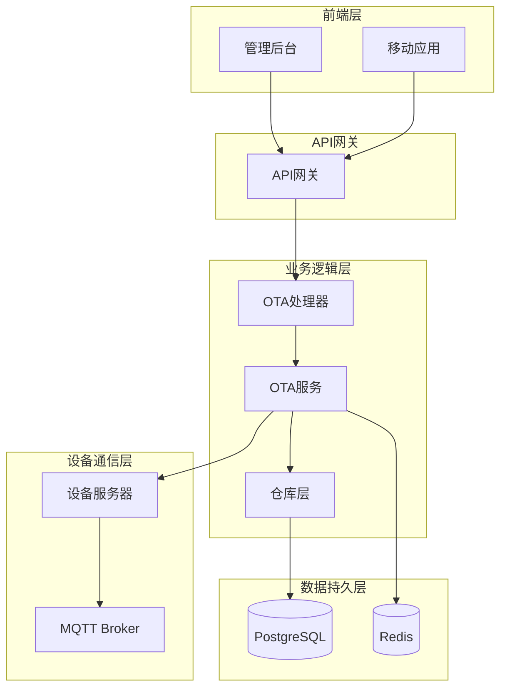
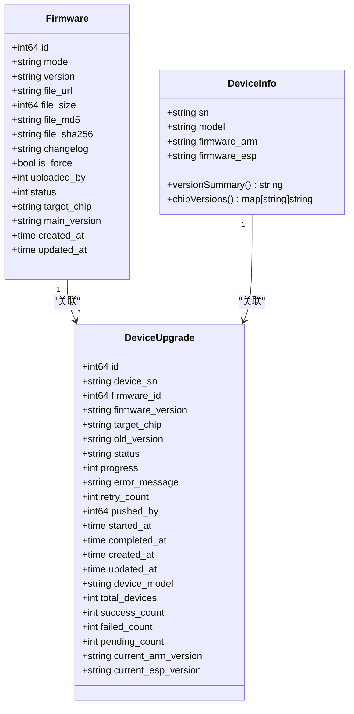
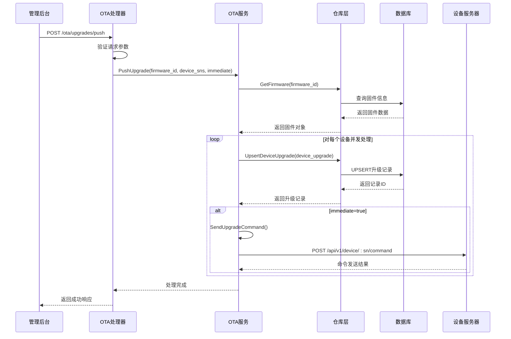
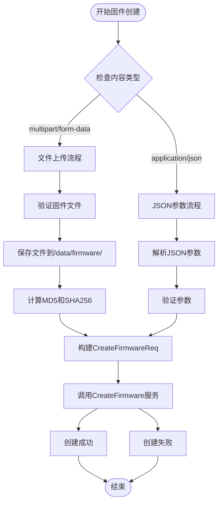
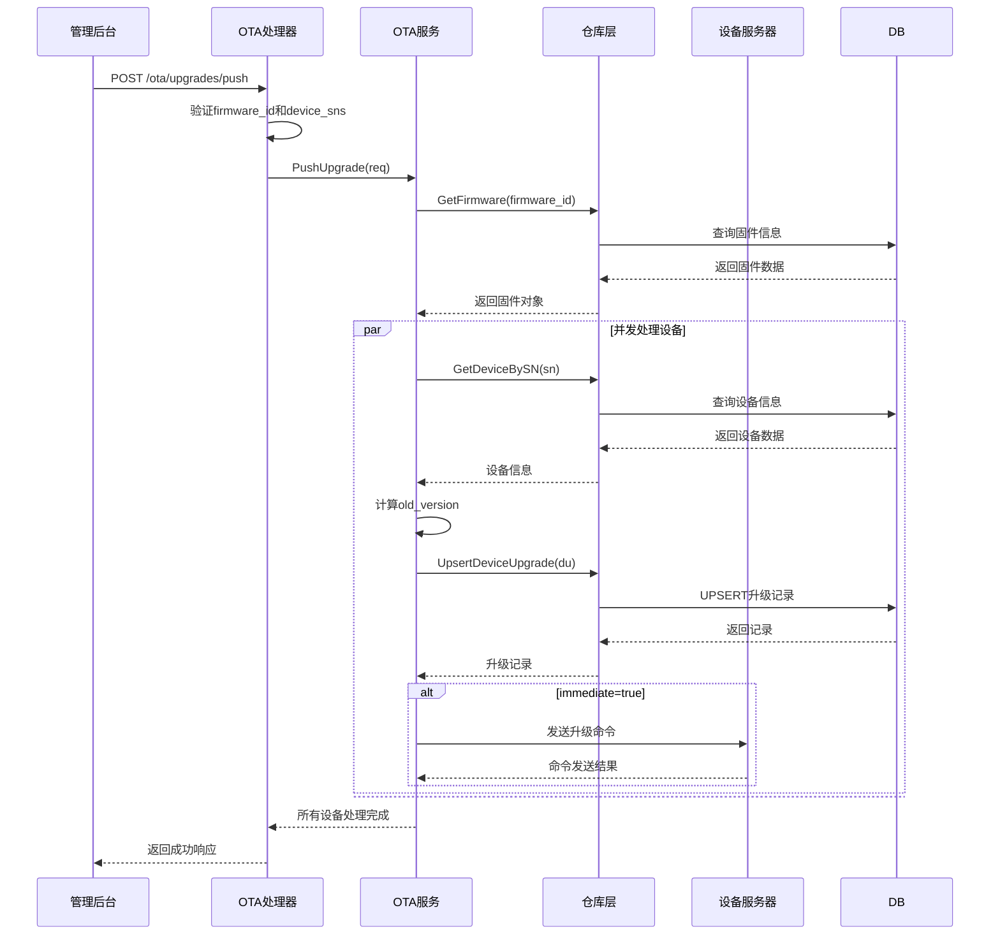
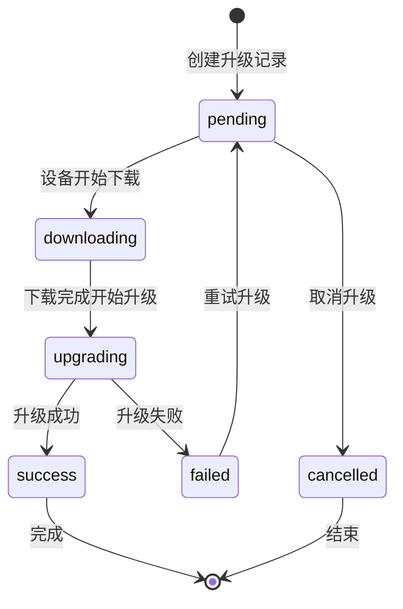
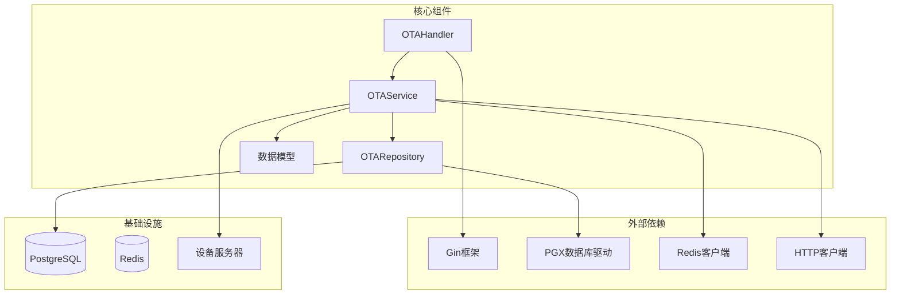
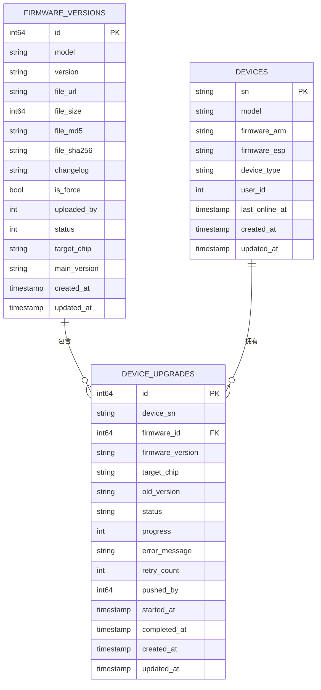

# OTA任务创建

<cite>
**本文档引用的文件**
- [README.md](file://README.md)
- [ota_handler.go](file://inv_api_server/internal/handler/ota_handler.go)
- [ota_service.go](file://inv_api_server/internal/service/ota_service.go)
- [ota_repository.go](file://inv_api_server/internal/repository/ota_repository.go)
- [models.go](file://inv_api_server/internal/model/models.go)
- [main.go](file://inv_api_server/cmd/main.go)
- [otaApi.ts](file://inv-admin-frontend/src/services/otaApi.ts)
- [ota.ts](file://inv-admin-frontend/src/locales/ota.ts)
- [schema.sql](file://database/schema.sql)
- [006_refactor_ota_to_device_upgrades.sql](file://database/migrations/006_refactor_ota_to_device_upgrades.sql)
</cite>

## 目录
1. [简介](#简介)
2. [项目结构](#项目结构)
3. [核心组件](#核心组件)
4. [架构概览](#架构概览)
5. [详细组件分析](#详细组件分析)
6. [依赖关系分析](#依赖关系分析)
7. [性能考虑](#性能考虑)
8. [故障排除指南](#故障排除指南)
9. [结论](#结论)
10. [附录](#附录)

## 简介

本文档详细说明了OTA任务创建功能的技术实现，包括固件管理、设备升级推送、状态跟踪和错误处理机制。系统支持ARM和ESP芯片的固件升级，提供灵活的任务创建流程和多种推送策略。

## 项目结构

OTA功能位于inv_api_server模块中，采用典型的三层架构设计：



**图表来源**
- [main.go:548-579](file://inv_api_server/cmd/main.go#L548-L579)
- [ota_handler.go:1-50](file://inv_api_server/internal/handler/ota_handler.go#L1-L50)
- [ota_service.go:22-42](file://inv_api_server/internal/service/ota_service.go#L22-L42)

**章节来源**
- [main.go:548-579](file://inv_api_server/cmd/main.go#L548-L579)

## 核心组件

### 数据模型

系统定义了完整的OTA相关数据模型：



**图表来源**
- [models.go:283-328](file://inv_api_server/internal/model/models.go#L283-L328)
- [models.go:335-382](file://inv_api_server/internal/model/models.go#L335-L382)

### 接口路由

系统提供了完整的OTA管理接口：

| 接口 | 方法 | 权限 | 描述 |
|------|------|------|------|
| `/ota/firmware` | GET/POST/DELETE | ota:view/create/delete | 固件管理 |
| `/ota/upgrades/dashboard` | GET | ota:view | 升级管理面板 |
| `/ota/upgrades/push` | POST | ota:create | 推送升级 |
| `/ota/upgrades/firmware/:firmwareId` | GET | ota:view | 固件升级详情 |
| `/ota/upgrades/retry` | POST | ota:control | 重试升级 |
| `/ota/upgrades/cancel` | POST | ota:control | 取消升级 |
| `/ota/check/:sn` | GET | 任意用户 | 检查设备更新 |
| `/ota/trigger` | POST | 任意用户 | 触发设备升级 |

**章节来源**
- [main.go:548-579](file://inv_api_server/cmd/main.go#L548-L579)

## 架构概览

OTA任务创建采用事件驱动架构，支持异步处理和并发控制：



**图表来源**
- [ota_handler.go:189-214](file://inv_api_server/internal/handler/ota_handler.go#L189-L214)
- [ota_service.go:120-181](file://inv_api_server/internal/service/ota_service.go#L120-L181)
- [ota_repository.go:82-108](file://inv_api_server/internal/repository/ota_repository.go#L82-L108)

## 详细组件分析

### 固件管理组件

#### 固件创建流程

固件创建支持两种方式：文件上传和JSON参数提交：



**图表来源**
- [ota_handler.go:40-149](file://inv_api_server/internal/handler/ota_handler.go#L40-L149)

#### 固件参数验证

固件创建包含严格的参数验证机制：

| 参数 | 必填 | 验证规则 | 说明 |
|------|------|----------|------|
| model | 是 | 字符串，字母数字下划线点横杠 | 设备型号 |
| target_chip | 是 | arm/esp/dsp/bms | 目标芯片类型 |
| version | 否 | 字符串，字母数字下划线点横杠 | 子版本号 |
| file_url | 是 | URL格式 | 文件下载地址 |
| file_size | 否 | 整数 | 文件大小（字节） |
| file_md5 | 否 | 32位十六进制 | 文件MD5校验码 |
| file_sha256 | 否 | 64位十六进制 | 文件SHA256校验码 |
| changelog | 否 | 文本 | 更新日志 |
| is_force | 否 | 布尔值 | 是否强制更新 |

**章节来源**
- [ota_handler.go:28-38](file://inv_api_server/internal/handler/ota_handler.go#L28-L38)
- [ota_handler.go:40-149](file://inv_api_server/internal/handler/ota_handler.go#L40-L149)

### 任务创建组件

#### 推送升级流程

管理员推送升级到设备的完整流程：



**图表来源**
- [ota_handler.go:189-214](file://inv_api_server/internal/handler/ota_handler.go#L189-L214)
- [ota_service.go:120-181](file://inv_api_server/internal/service/ota_service.go#L120-L181)

#### 推送策略配置

系统支持灵活的推送策略配置：

| 策略类型 | 参数 | 作用 | 使用场景 |
|----------|------|------|----------|
| 立即推送 | immediate: true | 立即发送升级命令 | 紧急修复、测试环境 |
| 仅通知 | immediate: false | 仅创建升级记录 | 灰度发布、定时执行 |
| 批量推送 | 通过API参数控制 | 分批处理设备 | 大规模部署 |
| 灰度发布 | 通过设备选择控制 | 随机选择部分设备 | 新功能验证 |

**章节来源**
- [ota_handler.go:189-214](file://inv_api_server/internal/handler/ota_handler.go#L189-L214)
- [ota_service.go:111-116](file://inv_api_server/internal/service/ota_service.go#L111-L116)

### 设备目标选择机制

系统支持多种设备目标选择方式：

#### 按设备序列号选择
- 直接指定设备SN列表
- 支持单个或多个设备
- 最精确的目标选择方式

#### 按设备型号选择
- 通过设备型号过滤
- 自动获取该型号下的所有设备
- 适用于同型号设备的大规模升级

#### 按设备组选择
- 通过设备分组进行选择
- 支持复杂的设备组合条件
- 适用于多维度的设备管理场景

**章节来源**
- [ota_handler.go:189-214](file://inv_api_server/internal/handler/ota_handler.go#L189-L214)

### 状态管理和跟踪

#### 升级状态流转



#### 状态字段说明

| 状态 | 描述 | 用途 |
|------|------|------|
| pending | 待执行 | 升级记录创建但未开始 |
| downloading | 下载中 | 设备正在下载固件 |
| upgrading | 升级中 | 设备正在进行固件升级 |
| success | 成功 | 升级完成且成功 |
| failed | 失败 | 升级过程中出现错误 |
| cancelled | 已取消 | 管理员主动取消升级 |

**章节来源**
- [ota_repository.go:308-327](file://inv_api_server/internal/repository/ota_repository.go#L308-L327)

## 依赖关系分析

### 组件依赖图



**图表来源**
- [ota_handler.go:1-18](file://inv_api_server/internal/handler/ota_handler.go#L1-L18)
- [ota_service.go:3-20](file://inv_api_server/internal/service/ota_service.go#L3-L20)
- [ota_repository.go:3-11](file://inv_api_server/internal/repository/ota_repository.go#L3-L11)

### 数据库表结构

系统使用PostgreSQL存储OTA相关数据：



**图表来源**
- [schema.sql](file://database/schema.sql)
- [models.go:283-328](file://inv_api_server/internal/model/models.go#L283-L328)

**章节来源**
- [schema.sql](file://database/schema.sql)
- [models.go:283-328](file://inv_api_server/internal/model/models.go#L283-L328)

## 性能考虑

### 并发控制

系统采用信号量和WaitGroup实现并发控制：

- 默认并发数：10个设备同时处理
- 使用channel实现资源池管理
- 避免过度并发导致系统资源耗尽

### 缓存策略

- Redis用于临时状态存储
- 减少数据库查询压力
- 提高状态查询响应速度

### 数据库优化

- 使用UPSERT操作避免重复插入
- 合理的索引设计支持高频查询
- 连接池管理数据库连接

## 故障排除指南

### 常见错误及解决方案

#### 固件相关错误

| 错误类型 | 错误码 | 描述 | 解决方案 |
|----------|--------|------|----------|
| 固件不存在 | 404 | 指定的firmware_id不存在 | 检查固件ID是否正确 |
| 文件上传失败 | 500 | 文件保存或哈希计算失败 | 检查磁盘空间和权限 |
| 参数验证失败 | 400 | 请求参数不符合要求 | 按照API规范修正参数 |

#### 设备相关错误

| 错误类型 | 错误码 | 描述 | 解决方案 |
|----------|--------|------|----------|
| 设备不存在 | 404 | 指定的设备SN不存在 | 检查设备是否在线 |
| 升级命令发送失败 | 500 | 设备服务器响应错误 | 检查设备服务器状态 |
| 升级状态更新失败 | 500 | 数据库更新失败 | 检查数据库连接 |

#### 并发处理错误

| 错误类型 | 描述 | 解决方案 |
|----------|------|----------|
| 并发超时 | 多个设备处理超时 | 调整并发数或增加超时时间 |
| 内存不足 | 处理大量设备时内存溢出 | 分批处理或增加服务器内存 |
| 数据库锁冲突 | UPSERT操作冲突 | 重试机制或优化事务隔离级别 |

**章节来源**
- [ota_handler.go:189-214](file://inv_api_server/internal/handler/ota_handler.go#L189-L214)
- [ota_service.go:120-181](file://inv_api_server/internal/service/ota_service.go#L120-L181)

### 日志监控

系统提供完整的日志记录机制：

- 请求级别的详细日志
- 错误堆栈跟踪
- 性能指标监控
- 异常告警机制

## 结论

OTA任务创建功能提供了完整的固件管理和设备升级解决方案。系统采用现代化的架构设计，支持高并发处理、灵活的推送策略和完善的错误处理机制。通过合理的数据库设计和缓存策略，确保了系统的高性能和可靠性。

## 附录

### API接口说明

#### 固件管理接口

**创建固件（文件上传）**
- 方法：POST `/api/v1/ota/firmware`
- 认证：需要`ota:create`权限
- 内容类型：`multipart/form-data`
- 参数：固件文件、型号、目标芯片、版本号等

**创建固件（JSON参数）**
- 方法：POST `/api/v1/ota/firmware`
- 认证：需要`ota:create`权限
- 内容类型：`application/json`
- 参数：与文件上传相同，但通过JSON传递

**查询固件列表**
- 方法：GET `/api/v1/ota/firmware`
- 认证：需要`ota:view`权限
- 参数：`model`（可选）

**查询固件详情**
- 方法：GET `/api/v1/ota/firmware/:id`
- 认证：需要`ota:view`权限

**删除固件**
- 方法：DELETE `/api/v1/ota/firmware/:id`
- 认证：需要`ota:delete`权限

#### 升级管理接口

**推送升级**
- 方法：POST `/api/v1/ota/upgrades/push`
- 认证：需要`ota:create`权限
- 参数：
  - `firmware_id`: 目标固件ID
  - `device_sns`: 设备SN数组
  - `immediate`: 是否立即推送（可选，默认false）

**升级管理面板**
- 方法：GET `/api/v1/ota/upgrades/dashboard`
- 认证：需要`ota:view`权限
- 参数：`page`、`page_size`

**固件升级详情**
- 方法：GET `/api/v1/ota/upgrades/firmware/:firmwareId`
- 认证：需要`ota:view`权限

**重试升级**
- 方法：POST `/api/v1/ota/upgrades/retry`
- 认证：需要`ota:control`权限

**取消升级**
- 方法：POST `/api/v1/ota/upgrades/cancel`
- 认证：需要`ota:control`权限

#### 设备端接口

**检查设备更新**
- 方法：GET `/api/v1/ota/check/:sn`
- 认证：任意登录用户
- 返回：设备当前固件版本和可用更新信息

**触发设备升级**
- 方法：POST `/api/v1/ota/trigger`
- 认证：任意登录用户
- 参数：`sn`、`firmware_id`

**获取设备升级状态**
- 方法：GET `/api/v1/ota/devices/:sn/status`
- 认证：任意登录用户

**获取设备升级历史**
- 方法：GET `/api/v1/ota/devices/:sn/history`
- 认证：任意登录用户

### 前端集成示例

前端通过`otaApi.ts`服务集成OTA功能：

```typescript
// 推送升级示例
const pushUpgrade = async (firmwareId: number, deviceSns: string[], immediate: boolean = false) => {
  try {
    const response = await api.post('/ota/upgrades/push', {
      firmware_id: firmwareId,
      device_sns: deviceSns,
      immediate: immediate
    });
    return response.data;
  } catch (error) {
    console.error('推送升级失败:', error);
    throw error;
  }
};
```

**章节来源**
- [otaApi.ts:17-23](file://inv-admin-frontend/src/services/otaApi.ts#L17-L23)
- [ota.ts:48-101](file://inv-admin-frontend/src/locales/ota.ts#L48-L101)