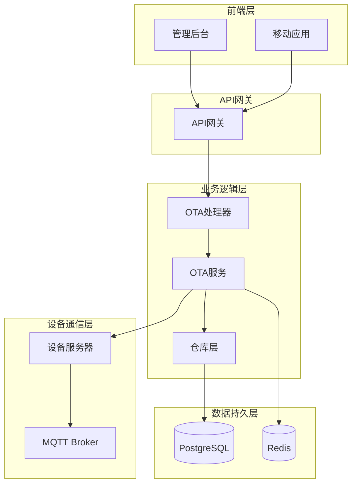
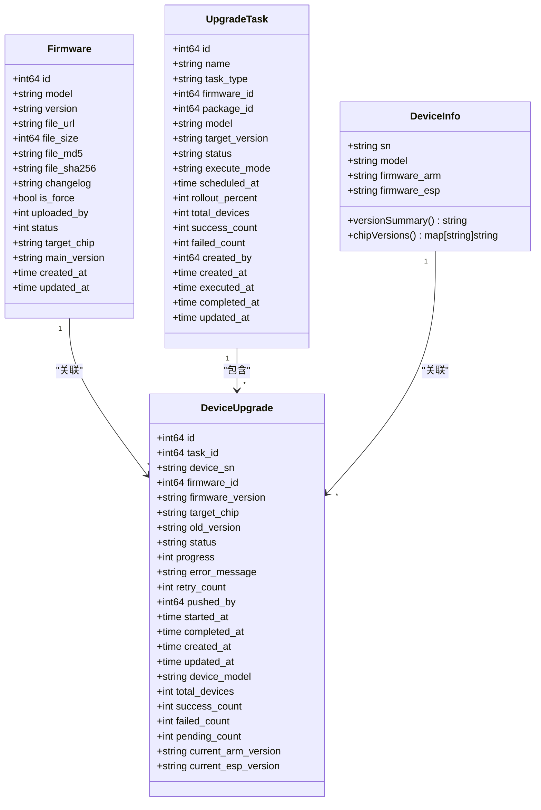
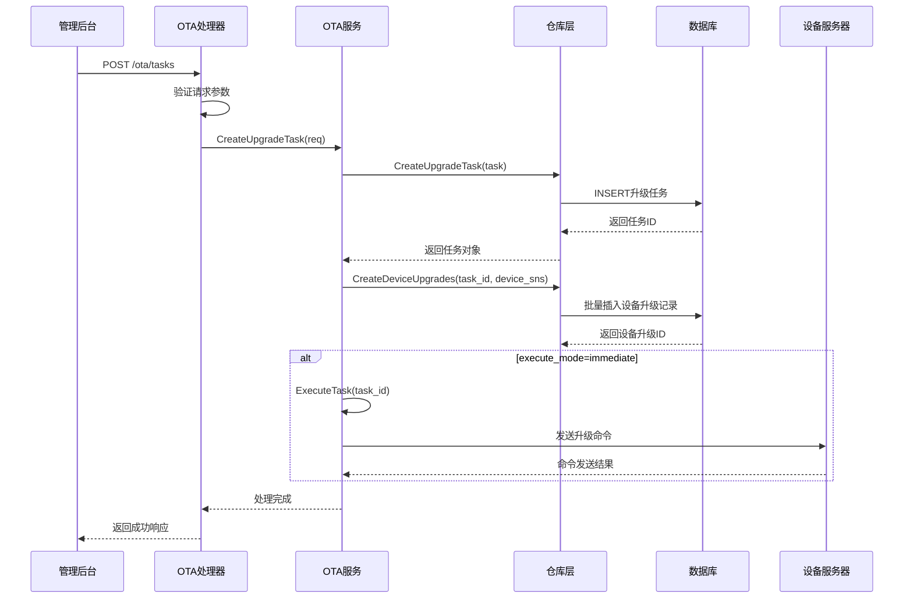
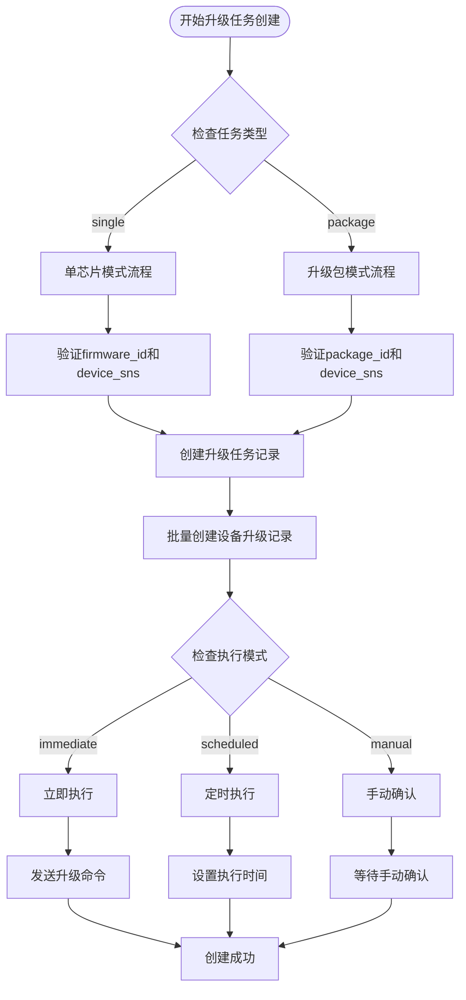
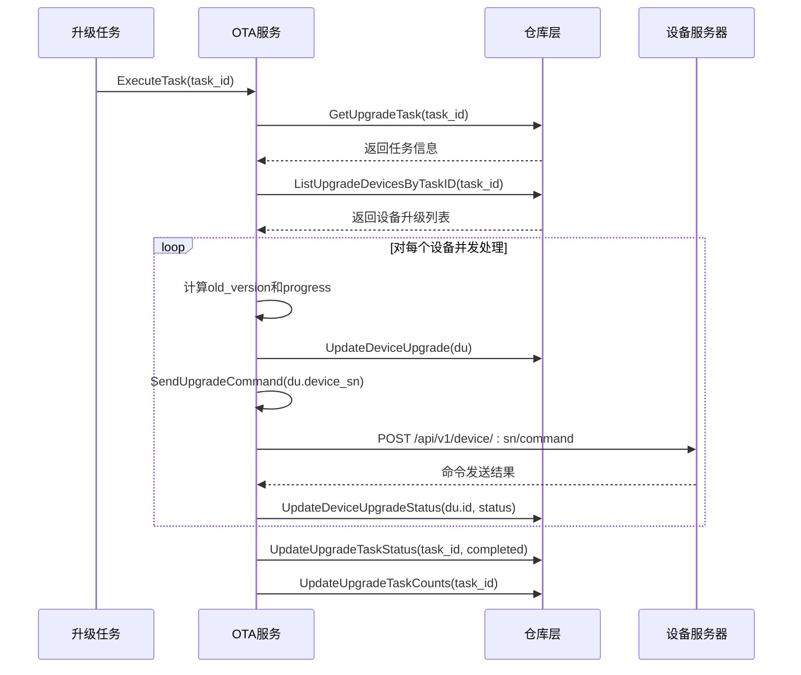
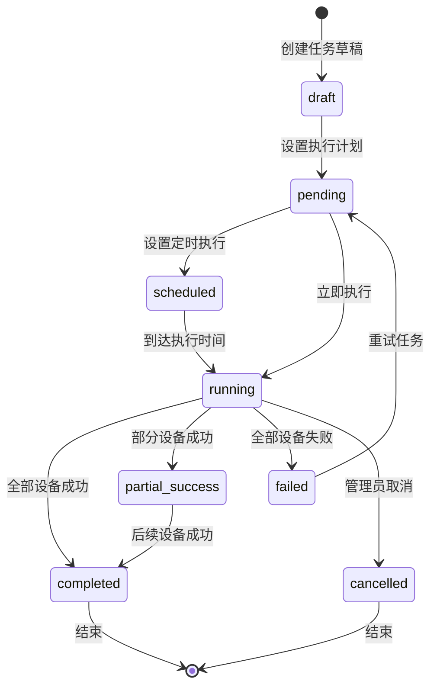
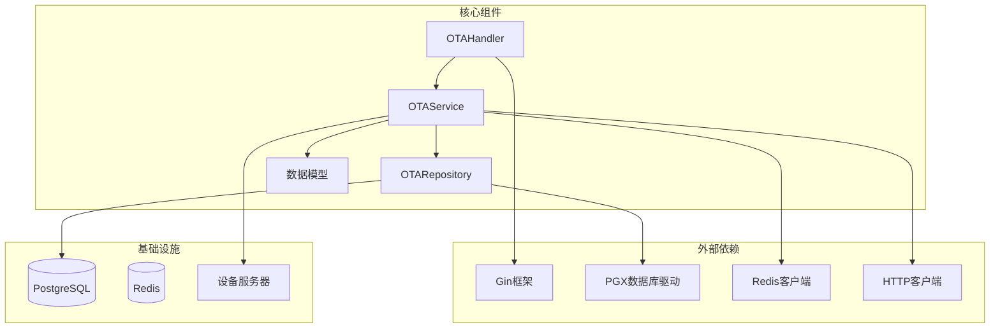
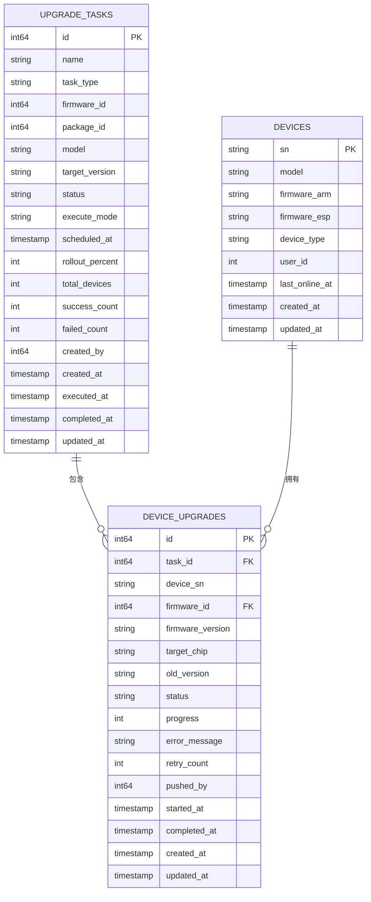

# OTA任务创建

<cite>
**本文档引用的文件**
- [README.md](file://README.md)
- [ota_handler.go](file://inv_api_server/internal/handler/ota_handler.go)
- [ota_service.go](file://inv_api_server/internal/service/ota_service.go)
- [ota_repository.go](file://inv_api_server/internal/repository/ota_repository.go)
- [models.go](file://inv_api_server/internal/model/models.go)
- [main.go](file://inv_api_server/cmd/main.go)
- [otaApi.ts](file://inv-admin-frontend/src/services/otaApi.ts)
- [ota.ts](file://inv-admin-frontend/src/locales/ota.ts)
- [schema.sql](file://database/schema.sql)
- [006_refactor_ota_to_device_upgrades.sql](file://database/migrations/006_refactor_ota_to_device_upgrades.sql)
- [009_upgrade_tasks.up.sql](file://database/migrations/009_upgrade_tasks.up.sql)
</cite>

## 目录
1. [简介](#简介)
2. [项目结构](#项目结构)
3. [核心组件](#核心组件)
4. [架构概览](#架构概览)
5. [详细组件分析](#详细组件分析)
6. [依赖关系分析](#依赖关系分析)
7. [性能考虑](#性能考虑)
8. [故障排除指南](#故障排除指南)
9. [结论](#结论)
10. [附录](#附录)

## 简介

本文档详细说明了OTA任务创建功能的技术实现，包括固件管理、设备升级推送、状态跟踪和错误处理机制。系统支持ARM和ESP芯片的固件升级，提供灵活的任务创建流程和多种推送策略。经过架构重构，系统从传统的任务驱动模式转向设备升级模式，采用统一的升级任务管理接口。

## 项目结构

OTA功能位于inv_api_server模块中，采用典型的三层架构设计：



**图表来源**
- [main.go:665](file://inv_api_server/cmd/main.go#L665)
- [ota_handler.go:765](file://inv_api_server/internal/handler/ota_handler.go#L765)
- [ota_service.go:840](file://inv_api_server/internal/service/ota_service.go#L840)

**章节来源**
- [main.go:665](file://inv_api_server/cmd/main.go#L665)

## 核心组件

### 数据模型

系统定义了完整的OTA相关数据模型，包括新的升级任务表：



**图表来源**
- [models.go:283-328](file://inv_api_server/internal/model/models.go#L283-L328)
- [models.go:335-382](file://inv_api_server/internal/model/models.go#L335-L382)
- [ota_repository.go:934](file://inv_api_server/internal/repository/ota_repository.go#L934)

### 接口路由

系统提供了完整的OTA管理接口，包括新的升级任务管理：

| 接口 | 方法 | 权限 | 描述 |
|------|------|------|------|
| `/ota/firmware` | GET/POST/DELETE | ota:view/create/delete | 固件管理 |
| `/ota/tasks` | GET/POST | ota:create | 升级任务管理 |
| `/ota/tasks/:id` | GET/PUT/DELETE | ota:view/control | 单个任务管理 |
| `/ota/tasks/:id/devices` | GET | ota:view | 任务设备列表 |
| `/ota/tasks/:id/execute` | POST | ota:control | 执行任务 |
| `/ota/tasks/:id/cancel` | POST | ota:control | 取消任务 |
| `/ota/tasks/:id/retry` | POST | ota:control | 重试任务 |
| `/ota/tasks/stats` | GET | ota:view | 任务统计信息 |
| `/ota/upgrades/dashboard` | GET | ota:view | 升级管理面板 |
| `/ota/upgrades/push` | POST | ota:create | 推送升级 |
| `/ota/upgrades/firmware/:firmwareId` | GET | ota:view | 固件升级详情 |
| `/ota/upgrades/retry` | POST | ota:control | 重试升级 |
| `/ota/upgrades/cancel` | POST | ota:control | 取消升级 |
| `/ota/check/:sn` | GET | 任意用户 | 检查设备更新 |
| `/ota/trigger` | POST | 任意用户 | 触发设备升级 |

**章节来源**
- [main.go:665](file://inv_api_server/cmd/main.go#L665)

## 架构概览

OTA任务创建采用事件驱动架构，支持异步处理和并发控制。经过重构后，系统采用统一的升级任务管理模式：



**图表来源**
- [ota_handler.go:765](file://inv_api_server/internal/handler/ota_handler.go#L765)
- [ota_service.go:840](file://inv_api_server/internal/service/ota_service.go#L840)
- [ota_repository.go:934](file://inv_api_server/internal/repository/ota_repository.go#L934)

## 详细组件分析

### 升级任务管理组件

#### 升级任务创建流程

新的升级任务创建支持两种模式：单芯片固件和升级包组合：



**图表来源**
- [ota_handler.go:765](file://inv_api_server/internal/handler/ota_handler.go#L765)
- [ota_service.go:840](file://inv_api_server/internal/service/ota_service.go#L840)

#### 升级任务参数验证

升级任务创建包含严格的参数验证机制：

| 参数 | 必填 | 验证规则 | 说明 |
|------|------|----------|------|
| name | 否 | 字符串，最大200字符 | 任务名称 |
| task_type | 是 | single/package | 任务类型：单芯片固件或升级包 |
| firmware_id | 当task_type=single时必填 | 正整数 | 固件ID |
| package_id | 当task_type=package时必填 | 正整数 | 升级包ID |
| device_sns | 是 | 字符串数组 | 设备序列号列表 |
| execute_mode | 否 | immediate/scheduled/manual | 执行模式，默认manual |
| scheduled_at | 当execute_mode=scheduled时必填 | ISO8601时间格式 | 定时执行时间 |
| rollout_percent | 否 | 1-100整数 | 灰度发布比例，默认100 |

**章节来源**
- [ota_handler.go:768](file://inv_api_server/internal/handler/ota_handler.go#L768)
- [ota_handler.go:779](file://inv_api_server/internal/handler/ota_handler.go#L779)

### 设备升级模式

#### 设备升级流程

系统采用设备升级模式，每个设备都有独立的升级记录：



**图表来源**
- [ota_service.go:988](file://inv_api_server/internal/service/ota_service.go#L988)
- [ota_repository.go:1009](file://inv_api_server/internal/repository/ota_repository.go#L1009)

#### 推送策略配置

系统支持灵活的推送策略配置：

| 策略类型 | 参数 | 作用 | 使用场景 |
|----------|------|------|----------|
| 立即执行 | execute_mode: immediate | 立即发送升级命令 | 紧急修复、测试环境 |
| 定时执行 | execute_mode: scheduled | 在指定时间自动开始执行 | 预约维护时间 |
| 手动确认 | execute_mode: manual | 创建后等待手动确认 | 生产环境谨慎升级 |
| 灰度发布 | rollout_percent: 1-100 | 随机选择部分设备进行升级 | 新功能验证 |

**章节来源**
- [ota_handler.go:787](file://inv_api_server/internal/handler/ota_handler.go#L787)
- [ota_handler.go:790](file://inv_api_server/internal/handler/ota_handler.go#L790)

### 设备目标选择机制

系统支持多种设备目标选择方式：

#### 按设备序列号选择
- 直接指定设备SN列表
- 支持单个或多个设备
- 最精确的目标选择方式

#### 按设备型号选择
- 通过设备型号过滤
- 自动获取该型号下的所有设备
- 适用于同型号设备的大规模升级

#### 按设备组选择
- 通过设备分组进行选择
- 支持复杂的设备组合条件
- 适用于多维度的设备管理场景

**章节来源**
- [ota_handler.go:774](file://inv_api_server/internal/handler/ota_handler.go#L774)

### 状态管理和跟踪

#### 升级任务状态流转



#### 状态字段说明

| 状态 | 描述 | 用途 |
|------|------|------|
| draft | 草稿 | 任务刚创建但未激活 |
| pending | 待执行 | 已设置执行计划但未开始 |
| scheduled | 已预约 | 定时执行中等待到达时间 |
| running | 执行中 | 正在向设备发送升级命令 |
| completed | 已完成 | 所有设备升级成功 |
| partial_success | 部分成功 | 部分设备成功，部分失败 |
| failed | 已失败 | 所有设备升级失败 |
| cancelled | 已取消 | 管理员主动取消任务 |

**章节来源**
- [ota_repository.go:1009](file://inv_api_server/internal/repository/ota_repository.go#L1009)

## 依赖关系分析

### 组件依赖图



**图表来源**
- [ota_handler.go:1-18](file://inv_api_server/internal/handler/ota_handler.go#L1-L18)
- [ota_service.go:3-20](file://inv_api_server/internal/service/ota_service.go#L3-L20)
- [ota_repository.go:3-11](file://inv_api_server/internal/repository/ota_repository.go#L3-L11)

### 数据库表结构

系统使用PostgreSQL存储OTA相关数据，新增升级任务表：



**图表来源**
- [schema.sql](file://database/schema.sql)
- [009_upgrade_tasks.up.sql:1](file://database/migrations/009_upgrade_tasks.up.sql#L1)
- [models.go:283-328](file://inv_api_server/internal/model/models.go#L283-L328)

**章节来源**
- [schema.sql](file://database/schema.sql)
- [009_upgrade_tasks.up.sql:1](file://database/migrations/009_upgrade_tasks.up.sql#L1)
- [models.go:283-328](file://inv_api_server/internal/model/models.go#L283-L328)

## 性能考虑

### 并发控制

系统采用信号量和WaitGroup实现并发控制：

- 默认并发数：10个设备同时处理
- 使用channel实现资源池管理
- 避免过度并发导致系统资源耗尽

### 缓存策略

- Redis用于临时状态存储
- 减少数据库查询压力
- 提高状态查询响应速度

### 数据库优化

- 使用UPSERT操作避免重复插入
- 合理的索引设计支持高频查询
- 连接池管理数据库连接

## 故障排除指南

### 常见错误及解决方案

#### 升级任务相关错误

| 错误类型 | 错误码 | 描述 | 解决方案 |
|----------|--------|------|----------|
| 任务不存在 | 404 | 指定的task_id不存在 | 检查任务ID是否正确 |
| 参数验证失败 | 400 | 请求参数不符合要求 | 按照API规范修正参数 |
| 执行模式不支持 | 400 | execute_mode值无效 | 使用immediate/scheduled/manual之一 |
| 灰度比例超出范围 | 400 | rollout_percent不在1-100范围内 | 设置有效的灰度比例 |

#### 设备相关错误

| 错误类型 | 错误码 | 描述 | 解决方案 |
|----------|--------|------|----------|
| 设备不存在 | 404 | 指定的设备SN不存在 | 检查设备是否在线 |
| 升级命令发送失败 | 500 | 设备服务器响应错误 | 检查设备服务器状态 |
| 升级状态更新失败 | 500 | 数据库更新失败 | 检查数据库连接 |

#### 并发处理错误

| 错误类型 | 描述 | 解决方案 |
|----------|------|----------|
| 并发超时 | 多个设备处理超时 | 调整并发数或增加超时时间 |
| 内存不足 | 处理大量设备时内存溢出 | 分批处理或增加服务器内存 |
| 数据库锁冲突 | UPSERT操作冲突 | 重试机制或优化事务隔离级别 |

**章节来源**
- [ota_handler.go:765](file://inv_api_server/internal/handler/ota_handler.go#L765)
- [ota_service.go:988](file://inv_api_server/internal/service/ota_service.go#L988)

### 日志监控

系统提供完整的日志记录机制：

- 请求级别的详细日志
- 错误堆栈跟踪
- 性能指标监控
- 异常告警机制

## 结论

OTA任务创建功能经过架构重构，从传统的任务驱动模式转向设备升级模式，提供了更灵活、更强大的固件管理和设备升级解决方案。系统采用统一的升级任务管理接口，支持多种执行模式和推送策略，完善的错误处理机制确保了系统的稳定性和可靠性。

## 附录

### API接口说明

#### 升级任务管理接口

**创建升级任务**
- 方法：POST `/api/v1/ota/tasks`
- 认证：需要`ota:create`权限
- 参数：
  - `name`: 任务名称（可选）
  - `task_type`: 任务类型，'single'或'package'
  - `firmware_id`: 固件ID（当task_type=single时必填）
  - `package_id`: 升级包ID（当task_type=package时必填）
  - `device_sns`: 设备SN数组（必填）
  - `execute_mode`: 执行模式，'immediate'/'scheduled'/'manual'
  - `scheduled_at`: 定时执行时间（当execute_mode=scheduled时必填）
  - `rollout_percent`: 灰度比例（1-100，默认100）

**查询升级任务列表**
- 方法：GET `/api/v1/ota/tasks`
- 认证：需要`ota:view`权限
- 参数：`page`、`page_size`、`status`、`task_type`

**查询升级任务详情**
- 方法：GET `/api/v1/ota/tasks/:id`
- 认证：需要`ota:view`权限

**查询任务设备列表**
- 方法：GET `/api/v1/ota/tasks/:id/devices`
- 认证：需要`ota:view`权限
- 参数：`page`、`page_size`、`status`

**执行升级任务**
- 方法：POST `/api/v1/ota/tasks/:id/execute`
- 认证：需要`ota:control`权限

**取消升级任务**
- 方法：POST `/api/v1/ota/tasks/:id/cancel`
- 认证：需要`ota:control`权限

**重试升级任务**
- 方法：POST `/api/v1/ota/tasks/:id/retry`
- 认证：需要`ota:control`权限

**删除升级任务**
- 方法：DELETE `/api/v1/ota/tasks/:id`
- 认证：需要`ota:control`权限

**获取任务统计信息**
- 方法：GET `/api/v1/ota/tasks/stats`
- 认证：需要`ota:view`权限

#### 固件管理接口

**创建固件（文件上传）**
- 方法：POST `/api/v1/ota/firmware`
- 认证：需要`ota:create`权限
- 内容类型：`multipart/form-data`
- 参数：固件文件、型号、目标芯片、版本号等

**创建固件（JSON参数）**
- 方法：POST `/api/v1/ota/firmware`
- 认证：需要`ota:create`权限
- 内容类型：`application/json`
- 参数：与文件上传相同，但通过JSON传递

**查询固件列表**
- 方法：GET `/api/v1/ota/firmware`
- 认证：需要`ota:view`权限
- 参数：`model`（可选）

**查询固件详情**
- 方法：GET `/api/v1/ota/firmware/:id`
- 认证：需要`ota:view`权限

**删除固件**
- 方法：DELETE `/api/v1/ota/firmware/:id`
- 认证：需要`ota:delete`权限

#### 升级管理接口

**推送升级**
- 方法：POST `/api/v1/ota/upgrades/push`
- 认证：需要`ota:create`权限
- 参数：
  - `firmware_id`: 目标固件ID
  - `device_sns`: 设备SN数组
  - `immediate`: 是否立即推送（可选，默认false）

**升级管理面板**
- 方法：GET `/api/v1/ota/upgrades/dashboard`
- 认证：需要`ota:view`权限
- 参数：`page`、`page_size`

**固件升级详情**
- 方法：GET `/api/v1/ota/upgrades/firmware/:firmwareId`
- 认证：需要`ota:view`权限

**重试升级**
- 方法：POST `/api/v1/ota/upgrades/retry`
- 认证：需要`ota:control`权限

**取消升级**
- 方法：POST `/api/v1/ota/upgrades/cancel`
- 认证：需要`ota:control`权限

#### 设备端接口

**检查设备更新**
- 方法：GET `/api/v1/ota/check/:sn`
- 认证：任意登录用户
- 返回：设备当前固件版本和可用更新信息

**触发设备升级**
- 方法：POST `/api/v1/ota/trigger`
- 认证：任意登录用户
- 参数：`sn`、`firmware_id`

**获取设备升级状态**
- 方法：GET `/api/v1/ota/devices/:sn/status`
- 认证：任意登录用户

**获取设备升级历史**
- 方法：GET `/api/v1/ota/devices/:sn/history`
- 认证：任意登录用户

### 前端集成示例

前端通过`otaApi.ts`服务集成OTA功能：

```typescript
// 创建升级任务示例
const createUpgradeTask = async (taskData: {
  name?: string
  task_type: 'single' | 'package'
  firmware_id?: number
  package_id?: number
  device_sns: string[]
  execute_mode?: string
  scheduled_at?: string
  rollout_percent?: number
}) => {
  try {
    const response = await api.post('/ota/tasks', taskData);
    return response.data;
  } catch (error) {
    console.error('创建升级任务失败:', error);
    throw error;
  }
};

// 执行升级任务示例
const executeTask = async (taskId: number | string) => {
  try {
    const response = await api.post(`/ota/tasks/${taskId}/execute`);
    return response.data;
  } catch (error) {
    console.error('执行升级任务失败:', error);
    throw error;
  }
};
```

**章节来源**
- [otaApi.ts:47](file://inv-admin-frontend/src/services/otaApi.ts#L47)
- [ota.ts:220](file://inv-admin-frontend/src/locales/ota.ts#L220)