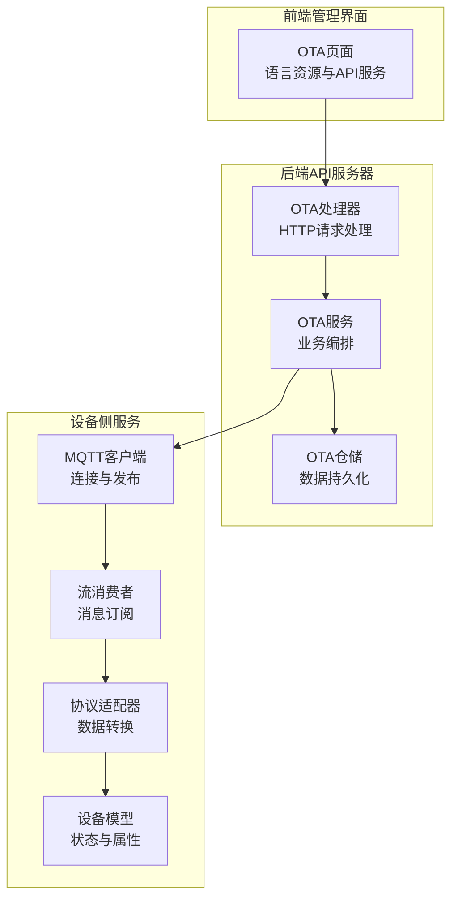
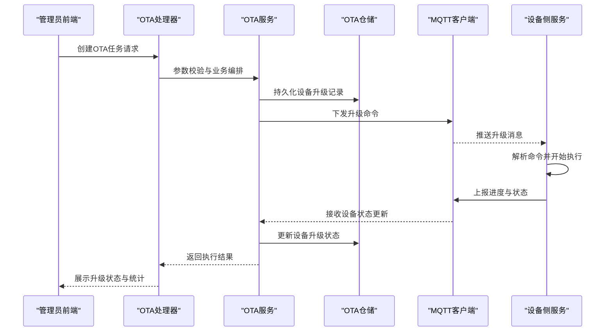
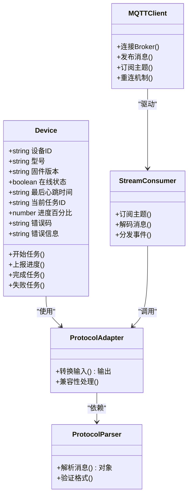
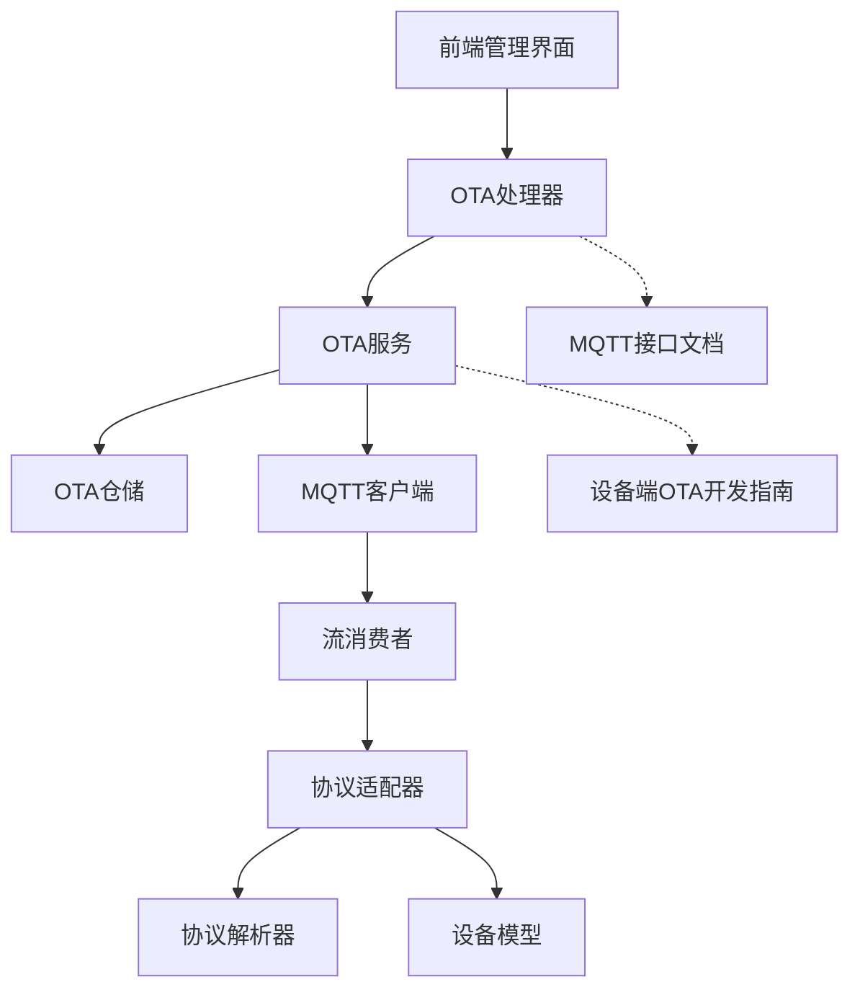

# OTA任务执行

<cite>
**本文档引用的文件**
- [006_refactor_ota_to_device_upgrades.sql](file://database/migrations/006_refactor_ota_to_device_upgrades.sql)
- [ota_handler.go](file://inv_api_server/internal/handler/ota_handler.go)
- [ota_service.go](file://inv_api_server/internal/service/ota_service.go)
- [ota_repository.go](file://inv_api_server/internal/repository/ota_repository.go)
- [device.go](file://inv_device_server/internal/model/device.go)
- [stream_consumer.go](file://inv_device_server/internal/mqtt/stream_consumer.go)
- [client.go](file://inv_device_server/internal/mqtt/client.go)
- [protocol_adapter.go](file://inv_device_server/internal/service/protocol_adapter.go)
- [protocol_parser.go](file://inv_device_server/internal/service/protocol_parser.go)
- [ota.ts](file://inv-admin-frontend/src/locales/ota.ts)
- [otaApi.ts](file://inv-admin-frontend/src/services/otaApi.ts)
- [MQTT接口文档.md](file://docs/MQTT接口文档.md)
- [设备端OTA程序开发指南.md](file://docs/设备端OTA程序开发指南.md)
</cite>

## 更新摘要
**所做更改**
- 更新了数据库架构变更，从 ota_tasks 和 ota_task_devices 迁移到 device_upgrades 表
- 重构了任务执行流程，从任务管理转向直接设备升级
- 更新了状态跟踪和进度管理方式
- 新增了升级包模式和链式升级机制
- 修改了状态管理机制和错误处理策略

## 目录
1. [引言](#引言)
2. [项目结构](#项目结构)
3. [核心组件](#核心组件)
4. [架构概览](#架构概览)
5. [详细组件分析](#详细组件分析)
6. [数据库架构变更](#数据库架构变更)
7. [依赖关系分析](#依赖关系分析)
8. [性能考虑](#性能考虑)
9. [故障排除指南](#故障排除指南)
10. [结论](#结论)
11. [附录](#附录)

## 引言

本文件针对OTA（Over-The-Air）任务执行机制进行全面技术文档化，涵盖从任务下发到执行完成的完整生命周期。OTA任务执行涉及多个系统组件的协同工作：后端API服务器负责任务创建与状态管理，设备侧服务负责接收任务并执行，前端管理界面提供用户交互与监控能力。

OTA任务执行的核心流程已从传统的任务管理方式重构为直接设备升级模式，涉及以下关键变更：

- **数据库架构重构**：从 ota_tasks 和 ota_task_devices 表迁移到 device_upgrades 表，简化了任务管理结构
- **执行流程重构**：从任务驱动转向设备驱动，设备直接接收升级指令并上报状态
- **状态管理优化**：统一的状态跟踪机制，支持单芯片和升级包两种模式
- **链式升级机制**：升级包模式下的自动链式升级，提升多芯片设备的升级效率
- **灰度发布支持**：支持按百分比的灰度发布策略
- **实时状态同步**：设备状态与服务端状态的实时同步机制

## 项目结构

该代码库采用多模块架构，OTA功能主要分布在以下模块中：

- 后端API服务器（inv_api_server）
  - 处理器层：负责HTTP请求处理与响应封装
  - 服务层：业务逻辑编排与协调
  - 仓储层：数据访问与持久化
- 设备侧服务（inv_device_server）
  - MQTT客户端与流消费者：接收来自网关的消息
  - 协议适配器与解析器：将原始数据转换为内部模型
  - 设备模型：设备属性与状态定义
- 前端管理界面（inv-admin-frontend）
  - OTA本地化资源与API服务封装
- 文档（docs）
  - MQTT接口文档与设备端OTA开发指南

**图表来源**
- [ota_handler.go:1-200](file://inv_api_server/internal/handler/ota_handler.go#L1-L200)
- [ota_service.go:1-300](file://inv_api_server/internal/service/ota_service.go#L1-L300)
- [ota_repository.go:1-250](file://inv_api_server/internal/repository/ota_repository.go#L1-L250)
- [client.go:1-200](file://inv_device_server/internal/mqtt/client.go#L1-L200)
- [stream_consumer.go:1-200](file://inv_device_server/internal/mqtt/stream_consumer.go#L1-L200)
- [protocol_adapter.go:1-200](file://inv_device_server/internal/service/protocol_adapter.go#L1-L200)
- [device.go:1-200](file://inv_device_server/internal/model/device.go#L1-L200)

**章节来源**
- [ota_handler.go:1-200](file://inv_api_server/internal/handler/ota_handler.go#L1-L200)
- [ota_service.go:1-300](file://inv_api_server/internal/service/ota_service.go#L1-L300)
- [ota_repository.go:1-250](file://inv_api_server/internal/repository/ota_repository.go#L1-L250)
- [client.go:1-200](file://inv_device_server/internal/mqtt/client.go#L1-L200)
- [stream_consumer.go:1-200](file://inv_device_server/internal/mqtt/stream_consumer.go#L1-L200)
- [protocol_adapter.go:1-200](file://inv_device_server/internal/service/protocol_adapter.go#L1-L200)
- [device.go:1-200](file://inv_device_server/internal/model/device.go#L1-L200)

## 核心组件

本节深入分析OTA任务执行的关键组件及其职责分工。

- OTA处理器（ota_handler.go）
  - 负责接收HTTP请求，校验参数，调用服务层执行业务逻辑，并返回标准化响应。
  - 关键职责：任务创建、查询、状态更新、批量操作等。
  - 典型调用链：HTTP请求 → 参数校验 → 服务层编排 → 仓储层持久化/查询 → MQTT发布 → 响应返回。

- OTA服务（ota_service.go）
  - 实现业务规则与流程编排，包括设备匹配、任务分发、状态机转换、并发控制与重试策略。
  - **更新**：重构为直接设备升级模式，支持单芯片和升级包两种推送方式
  - 关键职责：设备筛选、任务生成、状态管理、异常处理与恢复。
  - 依赖关系：调用仓储层进行数据操作，调用MQTT客户端进行消息下发。

- OTA仓储（ota_repository.go）
  - 提供任务与设备数据的持久化接口，支持查询、更新、分页与统计。
  - **更新**：迁移到 device_upgrades 表，支持升级包模式和链式升级
  - 关键职责：任务表CRUD、设备表查询、索引优化与事务保证。

- 设备模型（device.go）
  - 定义设备属性与状态字段，用于任务执行期间的状态存储与查询。
  - 关键字段：设备ID、固件版本、在线状态、最后心跳时间等。

- MQTT客户端与流消费者（client.go, stream_consumer.go）
  - 负责与MQTT Broker建立连接、订阅主题、发布任务指令与接收设备上报。
  - 关键职责：消息路由、重连机制、QoS保障、异常恢复。

- 协议适配器与解析器（protocol_adapter.go, protocol_parser.go）
  - 将设备上报的原始数据转换为内部可处理的结构，或将内部命令转换为设备可识别的格式。
  - 关键职责：数据格式转换、字段映射、错误解析与兼容性处理。

**章节来源**
- [ota_handler.go:1-200](file://inv_api_server/internal/handler/ota_handler.go#L1-L200)
- [ota_service.go:1-300](file://inv_api_server/internal/service/ota_service.go#L1-L300)
- [ota_repository.go:1-250](file://inv_api_server/internal/repository/ota_repository.go#L1-L250)
- [device.go:1-200](file://inv_device_server/internal/model/device.go#L1-L200)
- [client.go:1-200](file://inv_device_server/internal/mqtt/client.go#L1-L200)
- [stream_consumer.go:1-200](file://inv_device_server/internal/mqtt/stream_consumer.go#L1-L200)
- [protocol_adapter.go:1-200](file://inv_device_server/internal/service/protocol_adapter.go#L1-L200)
- [protocol_parser.go:1-200](file://inv_device_server/internal/service/protocol_parser.go#L1-L200)

## 架构概览

OTA任务执行的整体架构围绕"请求-编排-下发-执行-反馈"闭环展开。前端发起任务创建请求，后端服务层进行业务编排，仓储层持久化任务信息，MQTT通道下发任务指令至设备侧，设备侧解析并执行，周期性上报进度与状态，后端更新任务状态并持久化。

**更新**：架构已从任务驱动转向设备驱动，设备直接接收升级指令并上报状态。

**图表来源**
- [ota_handler.go:1-200](file://inv_api_server/internal/handler/ota_handler.go#L1-L200)
- [ota_service.go:1-300](file://inv_api_server/internal/service/ota_service.go#L1-L300)
- [ota_repository.go:1-250](file://inv_api_server/internal/repository/ota_repository.go#L1-L250)
- [client.go:1-200](file://inv_device_server/internal/mqtt/client.go#L1-L200)
- [stream_consumer.go:1-200](file://inv_device_server/internal/mqtt/stream_consumer.go#L1-L200)

## 详细组件分析

### OTA处理器（HTTP接口层）

- 职责边界
  - 接收HTTP请求，进行参数校验与权限检查。
  - 调用服务层执行具体业务，封装响应格式。
  - 统一错误处理与日志记录。

- 关键流程
  - **更新**：支持单芯片升级和升级包两种推送模式
  - 任务创建：接收任务元数据与设备筛选条件，调用服务层生成任务并下发。
  - 任务查询：支持按状态、时间范围、设备型号等条件查询任务列表与详情。
  - 状态更新：接收设备上报的状态变更，更新任务执行状态。

- 错误处理
  - 参数缺失或格式错误：返回明确的错误码与提示。
  - 权限不足：拒绝访问并记录审计日志。
  - 服务异常：捕获异常并返回统一错误响应。

**章节来源**
- [ota_handler.go:1-200](file://inv_api_server/internal/handler/ota_handler.go#L1-L200)

### OTA服务（业务编排层）

- **更新**：重构为直接设备升级模式

- 设备匹配算法
  - 基于设备属性（如型号、固件版本、区域）进行筛选。
  - 支持精确匹配与范围匹配，结合权重排序以确定优先级。
  - 输出目标设备集合与任务批次。

- **新增**：升级包模式支持
  - 升级包创建：支持多固件组合的升级包
  - 链式升级：设备升级完成后自动触发下一个芯片升级
  - 灰度发布：支持按百分比的渐进式发布

- **更新**：推送升级机制
  - 单芯片模式：直接推送固件升级
  - 升级包模式：按芯片顺序推送升级包中的固件
  - 立即执行：支持立即执行和通知模式

- 执行通知机制
  - 通过MQTT主题广播任务状态变化，订阅方实时更新UI与统计数据。
  - 支持回调通知（可选），向指定URL推送事件。

- 并发控制与资源管理
  - 任务池大小限制：防止过多任务同时执行导致系统过载。
  - 设备级并发：单设备任务队列长度限制，避免设备端处理不过来。
  - 资源配额：基于设备性能与网络状况动态调整下发速率。

- **更新**：状态管理机制
  - 状态类型：pending（待执行）、downloading（下载中）、upgrading（升级中）、success（成功）、failed（失败）、cancelled（已取消）
  - **新增**：升级包模式下的状态跟踪
  - 状态转换条件：
    - 待执行 → 下载中：设备确认接收并开始下载
    - 下载中 → 升级中：下载完成并开始升级
    - 升级中 → 成功：升级完成
    - 升级中 → 失败：升级过程中出现错误
    - 待执行 → 已取消：管理员取消升级

- **更新**：错误处理与重试机制
  - 网络异常：自动重连与消息重发，设置最大重试次数。
  - 设备离线：延长等待时间并定期轮询设备上线状态。
  - 执行失败：记录失败原因，支持手动重试或自动重试。
  - **新增**：升级包模式的链式重试机制

**章节来源**
- [ota_service.go:1-300](file://inv_api_server/internal/service/ota_service.go#L1-L300)

### OTA仓储（数据持久化层）

- **更新**：迁移到 device_upgrades 表

- **新增**：device_upgrades 表结构
  - 字段：id、device_sn、firmware_id、firmware_version、target_chip、old_version、status、progress、error_message、retry_count、pushed_by、started_at、completed_at、created_at、updated_at
  - **新增**：upgrade_package_id 字段支持升级包模式
  - 约束：device_sn + firmware_id + upgrade_package_id 唯一索引

- **更新**：查询与更新机制
  - UPSERT操作：支持同设备+同固件+同升级包的唯一记录
  - 状态更新：支持幂等的状态更新操作
  - **新增**：升级包模式的批量操作

- **新增**：升级包管理
  - 升级包表：upgrade_packages 和 upgrade_package_items
  - 链式升级：支持多芯片的顺序升级
  - 回滚机制：支持升级包的回滚操作

**章节来源**
- [ota_repository.go:1-250](file://inv_api_server/internal/repository/ota_repository.go#L1-L250)

### 设备侧服务（消息接收与执行层）

- MQTT客户端
  - 连接管理：自动重连、心跳检测、异常恢复。
  - 主题订阅：监听任务下发主题，接收新任务指令。
  - 消息发布：上报进度与状态，使用QoS保障消息可靠传递。

- 流消费者
  - 消息解码：将二进制或JSON消息解析为内部对象。
  - 事件分发：根据消息类型分发到相应处理函数。

- 协议适配器与解析器
  - 数据转换：将设备上报的原始数据映射为内部状态模型。
  - 兼容性处理：支持不同设备型号的协议差异。

- 设备模型
  - 状态字段：当前任务ID、进度百分比、错误码、错误信息等。
  - 行为方法：任务开始、进度更新、完成/失败上报等。

**图表来源**
- [device.go:1-200](file://inv_device_server/internal/model/device.go#L1-L200)
- [protocol_adapter.go:1-200](file://inv_device_server/internal/service/protocol_adapter.go#L1-L200)
- [protocol_parser.go:1-200](file://inv_device_server/internal/service/protocol_parser.go#L1-L200)
- [stream_consumer.go:1-200](file://inv_device_server/internal/mqtt/stream_consumer.go#L1-L200)
- [client.go:1-200](file://inv_device_server/internal/mqtt/client.go#L1-L200)

**章节来源**
- [device.go:1-200](file://inv_device_server/internal/model/device.go#L1-L200)
- [protocol_adapter.go:1-200](file://inv_device_server/internal/service/protocol_adapter.go#L1-L200)
- [protocol_parser.go:1-200](file://inv_device_server/internal/service/protocol_parser.go#L1-L200)
- [stream_consumer.go:1-200](file://inv_device_server/internal/mqtt/stream_consumer.go#L1-L200)
- [client.go:1-200](file://inv_device_server/internal/mqtt/client.go#L1-L200)

### 前端管理界面（用户交互层）

- OTA页面
  - 任务创建：填写任务名称、描述、目标设备筛选条件、固件包选择等。
  - 任务列表：展示任务状态、进度、设备分布与统计信息。
  - 实时监控：通过WebSocket或轮询获取最新状态更新。

- 语言资源与API服务
  - 本地化：支持多语言显示，包括任务状态、错误信息等。
  - API封装：统一封装HTTP请求，处理认证与错误。

**章节来源**
- [ota.ts:1-200](file://inv-admin-frontend/src/locales/ota.ts#L1-L200)
- [otaApi.ts:1-200](file://inv-admin-frontend/src/services/otaApi.ts#L1-L200)

## 数据库架构变更

**更新**：数据库架构已完全重构，从传统的任务管理表迁移到直接设备升级模式。

### 迁移概述

数据库迁移脚本 `006_refactor_ota_to_device_upgrades.sql` 完成了以下关键变更：

- **创建 device_upgrades 表**：替代原有的 ota_tasks 和 ota_task_devices 表
- **数据迁移**：从旧表迁移最近的升级记录到新表
- **索引优化**：为新表创建必要的索引以支持查询性能
- **表重命名**：保留旧表为备份表

### 新架构特点

#### device_upgrades 表
- **统一升级记录**：所有设备升级都记录在 device_upgrades 表中
- **升级包支持**：通过 upgrade_package_id 字段支持升级包模式
- **状态跟踪**：完整的升级状态跟踪机制
- **幂等操作**：UPSERT约束确保同设备+同固件+同升级包的唯一性

#### 升级包模式
- **升级包表**：upgrade_packages 和 upgrade_package_items 表
- **多固件组合**：支持一个升级包包含多个固件版本
- **链式升级**：设备升级完成后自动触发下一个芯片的升级
- **回滚机制**：支持升级包的回滚操作

#### 索引优化
- **设备索引**：按 device_sn 建立索引
- **状态索引**：按 status 建立索引
- **时间索引**：按 created_at 建立索引
- **组合索引**：device_sn + status 组合索引

**章节来源**
- [006_refactor_ota_to_device_upgrades.sql:1-76](file://database/migrations/006_refactor_ota_to_device_upgrades.sql#L1-L76)

## 依赖关系分析

OTA任务执行涉及前后端与设备侧的多层依赖关系。下图展示了各组件之间的耦合与协作方式。

**图表来源**
- [ota_handler.go:1-200](file://inv_api_server/internal/handler/ota_handler.go#L1-L200)
- [ota_service.go:1-300](file://inv_api_server/internal/service/ota_service.go#L1-L300)
- [ota_repository.go:1-250](file://inv_api_server/internal/repository/ota_repository.go#L1-L250)
- [client.go:1-200](file://inv_device_server/internal/mqtt/client.go#L1-L200)
- [stream_consumer.go:1-200](file://inv_device_server/internal/mqtt/stream_consumer.go#L1-L200)
- [protocol_adapter.go:1-200](file://inv_device_server/internal/service/protocol_adapter.go#L1-L200)
- [protocol_parser.go:1-200](file://inv_device_server/internal/service/protocol_parser.go#L1-L200)
- [device.go:1-200](file://inv_device_server/internal/model/device.go#L1-L200)
- [MQTT接口文档.md:1-200](file://docs/MQTT接口文档.md#L1-L200)
- [设备端OTA程序开发指南.md:1-200](file://docs/设备端OTA程序开发指南.md#L1-L200)

**章节来源**
- [ota_handler.go:1-200](file://inv_api_server/internal/handler/ota_handler.go#L1-L200)
- [ota_service.go:1-300](file://inv_api_server/internal/service/ota_service.go#L1-L300)
- [ota_repository.go:1-250](file://inv_api_server/internal/repository/ota_repository.go#L1-L250)
- [client.go:1-200](file://inv_device_server/internal/mqtt/client.go#L1-L200)
- [stream_consumer.go:1-200](file://inv_device_server/internal/mqtt/stream_consumer.go#L1-L200)
- [protocol_adapter.go:1-200](file://inv_device_server/internal/service/protocol_adapter.go#L1-L200)
- [protocol_parser.go:1-200](file://inv_device_server/internal/service/protocol_parser.go#L1-L200)
- [device.go:1-200](file://inv_device_server/internal/model/device.go#L1-L200)

## 性能考虑

- 并发控制
  - 任务池上限：限制同时执行的任务数量，避免系统过载。
  - 设备级并发：单设备任务队列长度限制，确保设备端处理能力不被压垮。
  - 速率控制：根据网络带宽与设备性能动态调整下发速率。

- 存储优化
  - **更新**：新表结构的索引优化
  - 索引优化：为常用查询字段建立复合索引，减少查询延迟。
  - 分页查询：大数据量场景下使用分页与游标，避免一次性加载过多数据。
  - 缓存策略：热点数据（如设备状态）使用内存缓存，降低数据库压力。

- 网络优化
  - MQTT QoS：合理设置QoS级别，在可靠性与性能之间平衡。
  - 批量下发：将多个小任务合并为批次，减少网络开销。
  - 心跳与保活：维持长连接稳定，减少断线重连带来的抖动。

- 任务调度
  - 优先级队列：高优先级任务优先下发，保障关键业务。
  - 时间窗口：避开网络高峰期，选择低负载时段执行大批量任务。
  - **新增**：灰度发布策略，支持按百分比的渐进式发布。

- 监控与告警
  - 指标采集：收集任务成功率、平均耗时、失败率等关键指标。
  - 告警阈值：设置合理的阈值，及时发现异常并干预。

## 故障排除指南

- 常见问题与排查步骤
  - **更新**：新增升级包模式相关问题
  - 任务未下发
    - 检查MQTT连接状态与主题订阅情况。
    - 验证设备是否在线且具备接收能力。
    - 查看服务日志是否存在网络异常或认证失败。
  - 设备离线
    - 确认设备网络连接正常，检查心跳机制是否生效。
    - 延长等待时间并定期轮询设备上线状态。
  - 执行失败
    - 查看设备上报的错误码与错误信息，定位具体原因。
    - 检查固件包完整性与兼容性。
    - 评估是否需要重试或降级处理。
  - **新增**：升级包模式问题
    - 检查升级包中的固件版本是否正确
    - 验证设备的芯片配置是否匹配
    - 查看链式升级是否正常执行

- 日志记录与调试
  - 统一日志格式：包含时间戳、请求ID、组件名、级别、消息体等。
  - 关键路径打点：在任务创建、下发、执行、上报、更新等节点添加日志。
  - 调试工具：提供日志检索与聚合分析工具，辅助快速定位问题。

**章节来源**
- [ota_service.go:1-300](file://inv_api_server/internal/service/ota_service.go#L1-L300)
- [stream_consumer.go:1-200](file://inv_device_server/internal/mqtt/stream_consumer.go#L1-L200)
- [protocol_adapter.go:1-200](file://inv_device_server/internal/service/protocol_adapter.go#L1-L200)

## 结论

OTA任务执行机制通过清晰的分层设计与严格的流程控制，实现了从任务创建到执行完成的全生命周期管理。**更新**：架构已从传统的任务管理方式重构为直接设备升级模式，具有以下优势：

- **简化架构**：从 ota_tasks 和 ota_task_devices 迁移到 device_upgrades 表，简化了数据结构
- **提升效率**：设备直接接收升级指令，减少了中间环节
- **增强功能**：支持升级包模式和链式升级，提升多芯片设备的升级效率
- **改进监控**：统一的状态跟踪机制，支持更精细的进度监控
- **优化体验**：灰度发布支持，提升升级的安全性和可控性

后端服务层承担业务编排与状态管理，设备侧服务负责可靠的消息接收与执行，前端提供直观的监控与操作界面。配合完善的并发控制、错误处理与性能优化策略，系统能够在复杂环境下保持高可用与高效率。

## 附录

- 相关文档
  - [MQTT接口文档.md:1-200](file://docs/MQTT接口文档.md#L1-L200)
  - [设备端OTA程序开发指南.md:1-200](file://docs/设备端OTA程序开发指南.md#L1-L200)

- 前端资源
  - [ota.ts:1-200](file://inv-admin-frontend/src/locales/ota.ts#L1-L200)
  - [otaApi.ts:1-200](file://inv-admin-frontend/src/services/otaApi.ts#L1-L200)

- **更新**：数据库迁移脚本
  - [006_refactor_ota_to_device_upgrades.sql:1-76](file://database/migrations/006_refactor_ota_to_device_upgrades.sql#L1-L76)