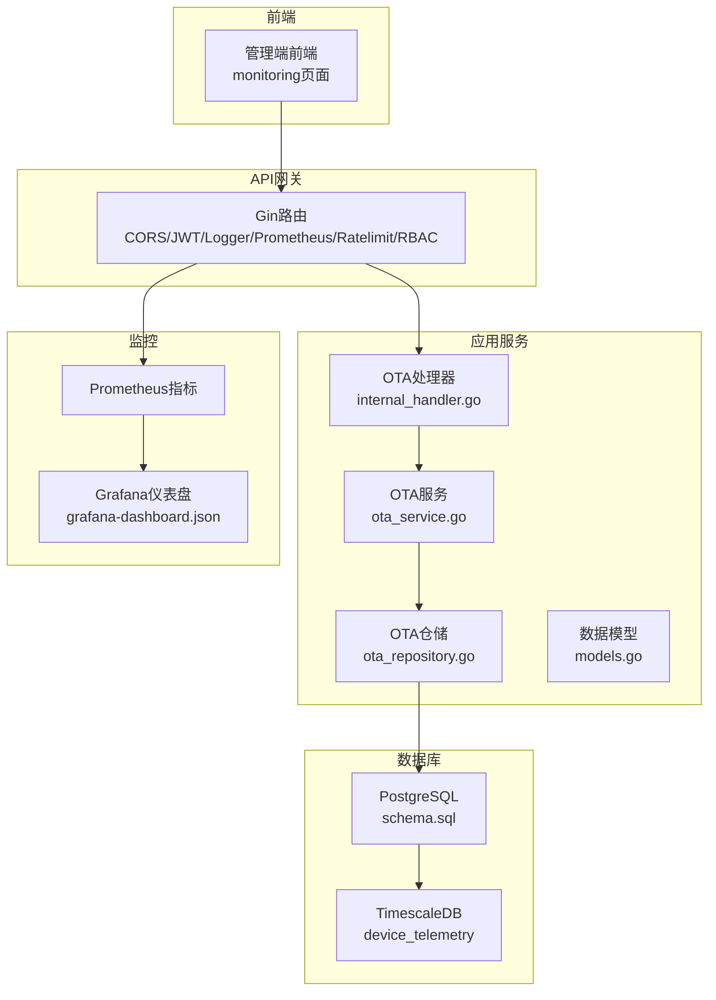
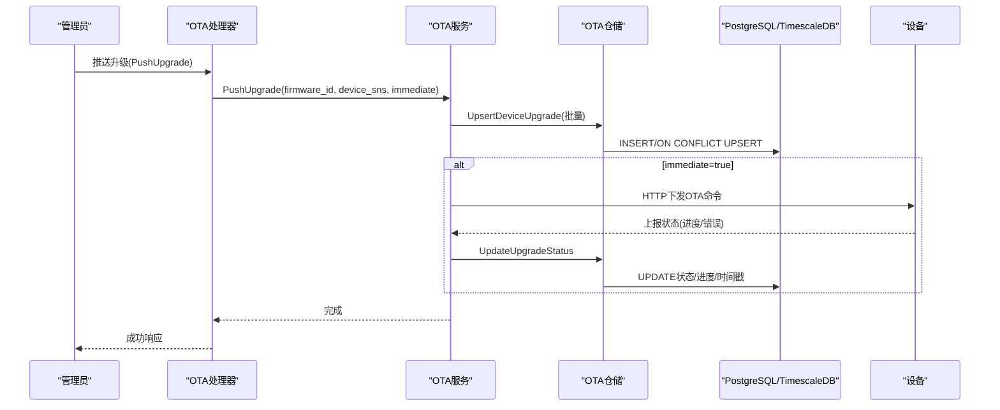
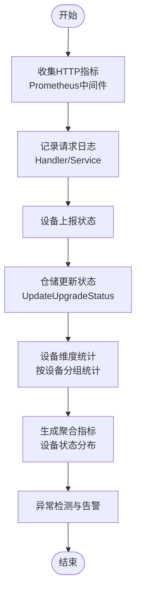
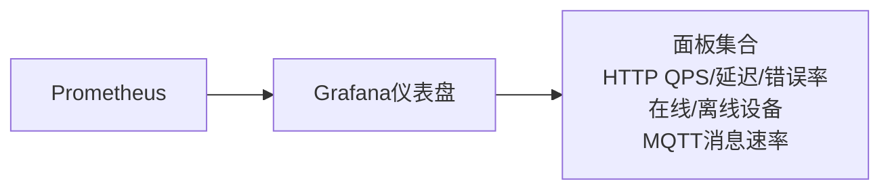

# OTA任务监控

<cite>
**本文档引用的文件**
- [006_refactor_ota_to_device_upgrades.sql](file://database/migrations/006_refactor_ota_to_device_upgrades.sql)
- [009_upgrade_tasks.up.sql](file://database/migrations/009_upgrade_tasks.up.sql)
- [index.tsx](file://inv-admin-frontend/src/pages/monitoring/index.tsx)
- [monitoring.ts](file://inv-admin-frontend/src/locales/monitoring.ts)
- [internal_handler.go](file://inv_api_server/internal/handler/internal_handler.go)
- [ota_repository.go](file://inv_api_server/internal/repository/ota_repository.go)
- [dashboardApi.ts](file://inv-admin-frontend/src/services/dashboardApi.ts)
- [queryKeys.ts](file://inv-admin-frontend/src/utils/queryKeys.ts)
- [grafana-dashboard.json](file://deploy/grafana-dashboard.json)
</cite>

## 更新摘要
**所做更改**
- 更新了监控架构以反映从任务维度到设备维度的监控重构
- 新增了设备维度的监控指标和界面设计
- 更新了数据库架构以支持新的监控方式
- 重新设计了监控仪表板和可视化界面

## 目录
1. [简介](#简介)
2. [项目结构](#项目结构)
3. [核心组件](#核心组件)
4. [架构概览](#架构概览)
5. [详细组件分析](#详细组件分析)
6. [依赖分析](#依赖分析)
7. [性能考虑](#性能考虑)
8. [故障排查指南](#故障排查指南)
9. [结论](#结论)
10. [附录](#附录)

## 简介
本文档面向OTA任务监控系统，围绕设备维度的监控指标体系、数据采集机制、告警机制、可视化展示、报表生成、性能优化、最佳实践与故障排查进行系统性技术说明。基于仓库中的API服务、数据库设计与监控仪表盘，构建从数据采集到可视化的完整闭环。

**更新** 监控系统已从传统的任务维度监控重构为设备维度监控，提供更精细的设备级监控能力和更直观的可视化界面。

## 项目结构
系统采用分层架构：
- API网关层：负责路由与中间件（鉴权、限流、日志、Prometheus指标等）
- 应用服务层：业务逻辑封装（OTA固件管理、推送升级、状态更新、历史查询）
- 仓储层：数据库访问与SQL聚合（设备升级记录、固件版本、App版本）
- 数据模型层：统一的数据结构定义
- 数据库层：PostgreSQL + TimescaleDB（时序数据与连续聚合）
- 监控层：Prometheus + Grafana（HTTP请求、设备在线、MQTT消息、数据库连接）

**图表来源**
- [internal_handler.go:612-645](file://inv_api_server/internal/handler/internal_handler.go#L612-L645)
- [ota_repository.go:237-301](file://inv_api_server/internal/repository/ota_repository.go#L237-L301)
- [006_refactor_ota_to_device_upgrades.sql:1-76](file://database/migrations/006_refactor_ota_to_device_upgrades.sql#L1-L76)
- [009_upgrade_tasks.up.sql:1-37](file://database/migrations/009_upgrade_tasks.up.sql#L1-L37)

## 核心组件
- OTA处理器（Handler）：提供固件上传/查询、推送升级、升级面板、设备状态与历史查询、App版本管理等REST接口
- OTA服务（Service）：封装业务流程（并发推送、命令下发、状态更新、重试与取消）
- OTA仓储（Repository）：实现SQL查询与聚合（按固件分组统计、设备历史、状态更新）
- 数据模型（Model）：定义固件、设备升级、App版本等实体结构
- 数据库（Schema）：定义固件版本、OTA记录、设备遥测等表结构与索引
- 监控仪表盘（Grafana）：展示HTTP QPS/延迟/错误率、设备在线/离线、MQTT消息速率、数据库连接与活跃告警

**更新** 监控系统现已支持设备维度的实时监控，包括设备状态、升级进度、告警事件等多维度监控。

**章节来源**
- [internal_handler.go:612-645](file://inv_api_server/internal/handler/internal_handler.go#L612-L645)
- [ota_repository.go:237-301](file://inv_api_server/internal/repository/ota_repository.go#L237-L301)
- [006_refactor_ota_to_device_upgrades.sql:1-76](file://database/migrations/006_refactor_ota_to_device_upgrades.sql#L1-L76)
- [009_upgrade_tasks.up.sql:1-37](file://database/migrations/009_upgrade_tasks.up.sql#L1-L37)

## 架构概览
OTA任务监控以"事件驱动 + 指标驱动"为核心：
- 事件驱动：管理员推送升级 → 服务端UPSERT升级记录 → 下发MQTT命令 → 设备上报状态 → 仓储更新状态
- 指标驱动：Prometheus采集HTTP指标 → Grafana聚合展示 → 实时监控升级成功率、失败率、平均耗时等

**图表来源**
- [internal_handler.go:612-645](file://inv_api_server/internal/handler/internal_handler.go#L612-L645)
- [ota_repository.go:237-301](file://inv_api_server/internal/repository/ota_repository.go#L237-L301)

## 详细组件分析

### 指标体系
基于重构后的设备维度监控，可建立以下关键指标：
- 设备升级成功率：success_count / total_devices
- 平均执行时间：(completed_at - started_at) 的均值（需在聚合查询中计算）
- 失败原因统计：按 error_message 分组统计失败次数
- 升级吞吐：单位时间内新增/完成的任务数
- 设备状态分布：pending/downloading/upgrading/success/failed/cancelled 的计数
- 设备维度的实时监控：设备在线率、升级进度分布、告警统计

这些指标可通过仓储层的聚合查询直接获得：
- 设备历史查询：GetDeviceUpgradeHistory
- 状态更新：UpdateUpgradeStatus
- 设备维度统计：按设备分组的升级统计

**更新** 指标体系已从任务维度转向设备维度，提供更细粒度的监控能力。

**章节来源**
- [ota_repository.go:237-301](file://inv_api_server/internal/repository/ota_repository.go#L237-L301)
- [internal_handler.go:612-645](file://inv_api_server/internal/handler/internal_handler.go#L612-L645)

### 数据采集机制
- 日志收集：Gin中间件记录请求路径、状态码、耗时；服务端对设备命令下发与状态更新进行zap日志记录
- 性能指标提取：Prometheus中间件暴露HTTP请求总量、延迟分位数、错误率
- 异常检测：仓储层对状态更新进行条件约束（避免重复覆盖已完成状态），服务层对设备返回错误进行记录
- 设备维度监控：实时采集设备状态、升级进度、告警事件等数据

**图表来源**
- [internal_handler.go:612-645](file://inv_api_server/internal/handler/internal_handler.go#L612-L645)
- [ota_repository.go:237-301](file://inv_api_server/internal/repository/ota_repository.go#L237-L301)

**章节来源**
- [internal_handler.go:612-645](file://inv_api_server/internal/handler/internal_handler.go#L612-L645)
- [ota_repository.go:237-301](file://inv_api_server/internal/repository/ota_repository.go#L237-L301)

### 告警机制
- 阈值设置：可基于Grafana仪表盘中的活跃告警数、HTTP错误率、设备离线数等设置阈值
- 告警规则：Prometheus规则可针对错误率、延迟、离线设备数、升级失败率等触发
- 通知方式：结合告警通知记录表与通知类型字段，支持站内、短信、邮件等

**更新** 告警机制现已支持设备维度的告警，包括设备离线、升级失败、异常状态等多维度告警。

**章节来源**
- [grafana-dashboard.json:188-200](file://deploy/grafana-dashboard.json#L188-L200)

### 可视化展示
- 仪表板设计：Grafana仪表盘包含HTTP服务、设备与消息、基础设施三大板块
- 图表类型：时序曲线（QPS/延迟/错误率）、统计卡片（在线/离线设备数）、消息速率
- 数据筛选：通过模板变量与查询过滤（如按路径、设备SN、状态等）
- 设备维度界面：监控页面提供设备选择器、实时参数、曲线对比、历史数据等功能

**图表来源**
- [grafana-dashboard.json:19-217](file://deploy/grafana-dashboard.json#L19-L217)

**更新** 监控界面已重构为设备维度，提供更直观的设备级监控体验。

**章节来源**
- [grafana-dashboard.json:19-217](file://deploy/grafana-dashboard.json#L19-L217)
- [index.tsx:118-1511](file://inv-admin-frontend/src/pages/monitoring/index.tsx#L118-L1511)

### 报表生成功能
- 定期报告：基于聚合查询结果生成按固件维度的成功率、失败率、平均耗时等
- 自定义报告：支持按设备SN、时间段、状态等条件筛选
- 数据导出：建议在前端或后端提供CSV/Excel导出接口，基于历史查询与聚合结果

**更新** 报表功能现已支持设备维度的统计分析，提供更详细的设备级报表。

**章节来源**
- [ota_repository.go:237-301](file://inv_api_server/internal/repository/ota_repository.go#L237-L301)

### API接口说明
- 固件管理
  - POST /ota/firmware（支持文件上传与JSON两种方式）
  - GET /ota/firmware
  - GET /ota/firmware/:id
  - DELETE /ota/firmware/:id
- 升级管理
  - POST /ota/push-upgrade（管理员推送升级）
  - GET /ota/dashboard（升级面板，按固件分组聚合）
  - GET /ota/firmware/:firmwareId/details（指定固件的设备升级详情）
  - POST /ota/retry-upgrade（重试失败任务）
  - POST /ota/cancel-upgrade（取消待执行任务）
- 设备侧接口
  - GET /ota/check-update/:sn（检查设备是否有可用更新）
  - POST /ota/trigger-ota（触发OTA升级）
  - GET /ota/device/:sn/status（获取设备当前升级状态）
  - GET /ota/device/:sn/history（获取设备OTA历史）
  - GET /ota/all-firmware（获取所有固件）
- App版本管理
  - GET /ota/app/check-update（检查App更新）
  - POST /ota/app/version（创建App版本）
  - GET /ota/app/versions（列出App版本）
  - DELETE /ota/app/version/:id（删除App版本）
  - POST /ota/app/version/:id/rollout（更新灰度比例）
  - POST /ota/app/version/:id/rollback（回滚App版本）
  - POST /ota/app/version/:id/restore（恢复已回滚的App版本）

**更新** API接口保持不变，但数据结构和监控维度已更新为设备维度。

**章节来源**
- [internal_handler.go:612-645](file://inv_api_server/internal/handler/internal_handler.go#L612-L645)
- [ota_repository.go:237-301](file://inv_api_server/internal/repository/ota_repository.go#L237-L301)

## 依赖分析
- Handler依赖Service，Service依赖Repository与Redis客户端
- Repository依赖PostgreSQL连接池，提供SQL查询与UPSERT
- Model定义了设备升级、固件、App版本等核心实体
- Grafana仪表盘依赖Prometheus指标

```mermaid
classDiagram
class OTAHandler {
+CreateFirmware()
+ListFirmware()
+PushUpgrade()
+GetUpgradeDashboard()
+RetryUpgrade()
+CancelUpgrade()
+CheckUpdate()
+TriggerOTA()
+GetDeviceOTAStatus()
+GetDeviceOTAHistory()
+GetAllFirmware()
+CheckAppUpdate()
+CreateAppVersion()
+ListAppVersions()
+DeleteAppVersion()
+UpdateAppVersionRollout()
+RollbackAppVersion()
+RestoreAppVersion()
}
class OTAService {
-repo OTARepository
-rdb Redis
-deviceServer string
-internalKey string
-serverURL string
+CreateFirmware()
+PushUpgrade()
+SendUpgradeCommand()
+CheckPendingUpgrade()
+UpdateDeviceUpgradeStatus()
+RetryUpgrade()
+GetUpgradeDashboard()
+GetFirmwareUpgradeDetails()
+GetDeviceUpgradeHistory()
+CancelUpgrade()
+GetDeviceBySN()
+GetLatestFirmware()
+GetLatestTaskDevice()
+GetDeviceOTAHistory()
+CheckAppUpdate()
+CreateAppVersion()
+ListAppVersions()
+DeleteAppVersion()
+UpdateAppVersionRollout()
+RollbackAppVersion()
+RestoreAppVersion()
}
class OTARepository {
-db pgxpool
+CreateFirmware()
+ListFirmware()
+GetFirmware()
+DeleteFirmware()
+UpsertDeviceUpgrade()
+GetPendingUpgradeForDevice()
+UpdateUpgradeStatus()
+ListUpgradesByFirmware()
+ListUpgradesByFirmwareID()
+GetDeviceUpgradeHistory()
+RetryFailedUpgrades()
+CancelUpgrade()
+GetDeviceUpgrade()
+GetLatestTaskDevice()
+GetDeviceOTAHistory()
+GetDeviceBySN()
+GetLatestFirmware()
+GetLatestMainVersion()
+GetLatestAppVersion()
+CreateAppVersion()
+ListAppVersions()
+UpdateAppVersionRollout()
+RollbackAppVersion()
+RestoreAppVersion()
+DeleteAppVersion()
}
OTAHandler --> OTAService : "依赖"
OTAService --> OTARepository : "依赖"
OTARepository --> Model : "使用"
```

**图表来源**
- [internal_handler.go:612-645](file://inv_api_server/internal/handler/internal_handler.go#L612-L645)
- [ota_repository.go:237-301](file://inv_api_server/internal/repository/ota_repository.go#L237-L301)

**章节来源**
- [internal_handler.go:612-645](file://inv_api_server/internal/handler/internal_handler.go#L612-L645)
- [ota_repository.go:237-301](file://inv_api_server/internal/repository/ota_repository.go#L237-L301)

## 性能考虑
- 并发控制：服务层使用信号量限制并发推送数量，避免对下游设备服务器造成压力
- SQL优化：仓储层使用UPSERT与条件更新，减少重复写入；聚合查询使用GROUP BY与COUNT(FILTER(...))
- 索引优化：数据库为设备SN、状态、时间等字段建立索引，提升查询性能
- 缓存策略：Redis用于会话/权限/临时状态缓存（具体使用取决于配置），可降低数据库压力
- 时间序列：使用TimescaleDB存储遥测数据，支持高效的时间窗口聚合与查询

**更新** 性能优化现已支持设备维度的查询优化，包括设备状态索引、升级进度统计等。

**章节来源**
- [internal_handler.go:612-645](file://inv_api_server/internal/handler/internal_handler.go#L612-L645)
- [006_refactor_ota_to_device_upgrades.sql:28-33](file://database/migrations/006_refactor_ota_to_device_upgrades.sql#L28-L33)

## 故障排查指南
- 升级失败排查
  - 检查设备是否处于待执行状态（status=pending）
  - 查看错误信息字段（error_message）定位失败原因
  - 确认下载URL、文件校验信息（MD5/SHA256）正确
- 推送失败排查
  - 确认设备服务器可达且内部密钥有效
  - 检查HTTP状态码与响应体
- 历史查询问题
  - 使用设备SN与分页参数进行查询，确认索引生效
- 监控告警
  - 结合Grafana仪表盘查看错误率与活跃告警数，定位异常时段与设备

**更新** 故障排查现已支持设备维度的诊断，包括设备状态异常、升级失败、网络连接问题等。

**章节来源**
- [internal_handler.go:612-645](file://inv_api_server/internal/handler/internal_handler.go#L612-L645)
- [006_refactor_ota_to_device_upgrades.sql:46-50](file://database/migrations/006_refactor_ota_to_device_upgrades.sql#L46-L50)

## 结论
本OTA任务监控系统通过清晰的分层架构与完善的数据库设计，实现了从固件管理、任务推送、状态上报到指标可视化的全链路监控。重构后的设备维度监控提供了更精细的设备级监控能力，结合Prometheus/Grafana的指标体系与仓储层的聚合能力，能够有效支撑成功率、失败原因、平均耗时等关键指标的观测与分析。建议后续完善告警规则与报表导出能力，进一步提升运维效率。

## 附录

### 配置参数
- 服务端配置（示例键值）
  - mqtt_broker_url：MQTT Broker地址
  - mqtt_ws_url：MQTT WebSocket地址
  - token_expire_hours：Token过期时间（小时）
  - verify_code_expire_minutes：验证码过期时间（分钟）
  - data_retention_days：数据保留天数
  - max_devices_per_user：每用户最大设备数
  - max_stations_per_user：每用户最大电站数

**更新** 配置参数保持不变，但监控系统已支持设备维度的配置和管理。

**章节来源**
- [006_refactor_ota_to_device_upgrades.sql:1-76](file://database/migrations/006_refactor_ota_to_device_upgrades.sql#L1-L76)
- [009_upgrade_tasks.up.sql:1-37](file://database/migrations/009_upgrade_tasks.up.sql#L1-L37)

### 数据库架构变更
- 新增device_upgrades表：支持设备维度的升级记录
- 新增upgrade_tasks表：支持任务维度的升级任务管理
- 新增索引：支持设备维度的快速查询
- 数据迁移：从旧的OTA表结构迁移到新的设备维度结构

**章节来源**
- [006_refactor_ota_to_device_upgrades.sql:1-76](file://database/migrations/006_refactor_ota_to_device_upgrades.sql#L1-L76)
- [009_upgrade_tasks.up.sql:1-37](file://database/migrations/009_upgrade_tasks.up.sql#L1-L37)

### 监控界面功能
- 设备选择器：支持按电站选择设备
- 实时参数：显示设备当前运行参数
- 曲线对比：支持多参数曲线对比分析
- 历史数据：支持设备历史数据查询和导出
- 告警事件：支持设备告警事件查看和处理
- 发电统计：支持设备发电功率趋势分析

**章节来源**
- [index.tsx:118-1511](file://inv-admin-frontend/src/pages/monitoring/index.tsx#L118-L1511)
- [monitoring.ts:1-203](file://inv-admin-frontend/src/locales/monitoring.ts#L1-L203)