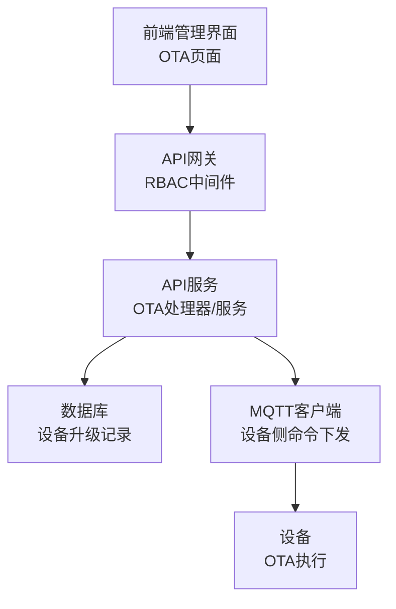
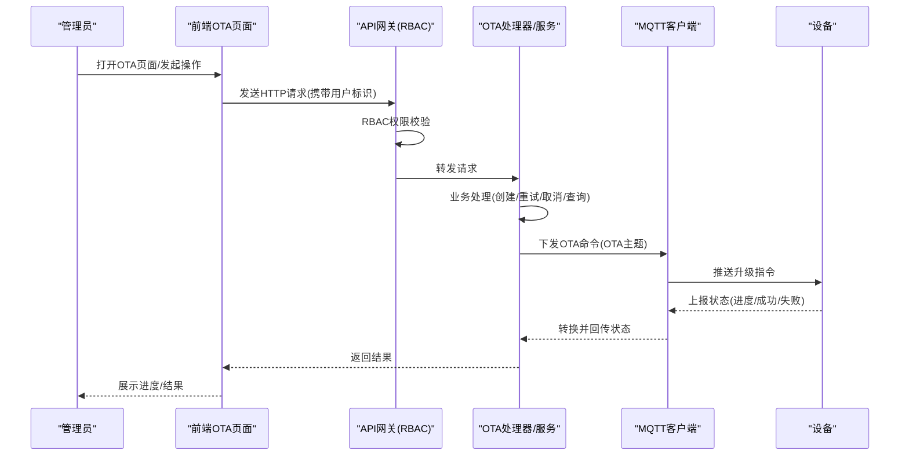
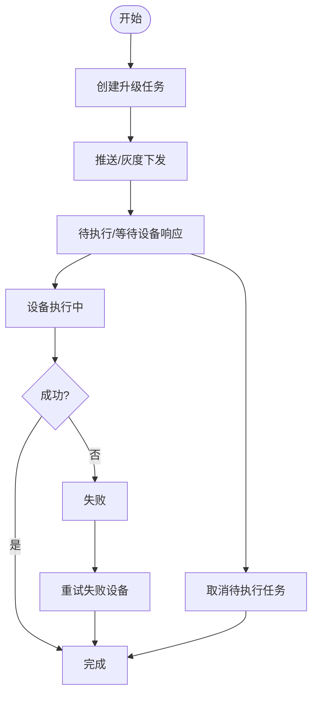
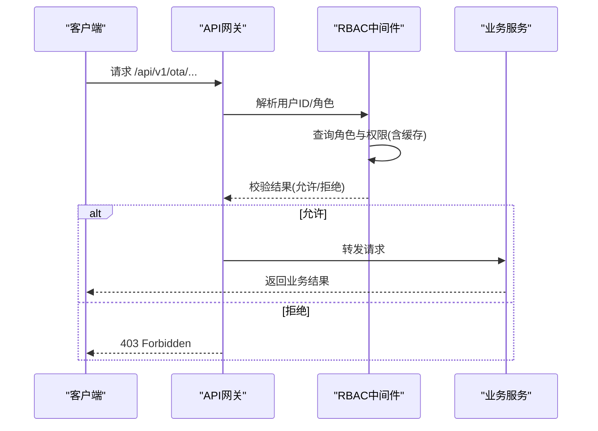
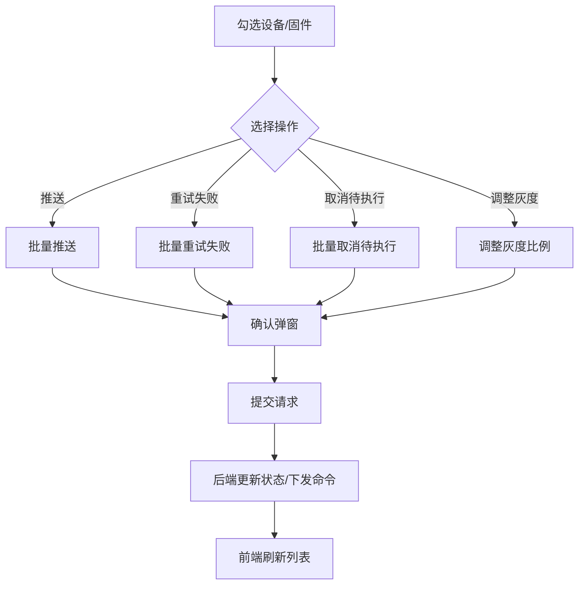
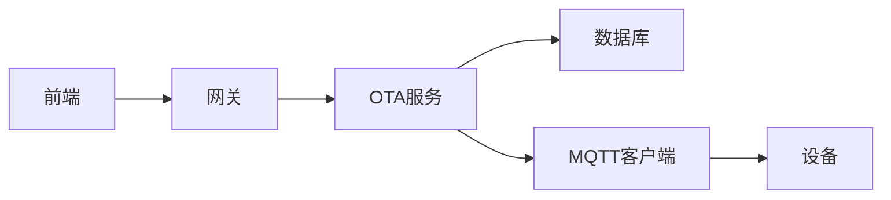

# OTA任务管理

<cite>
**本文引用的文件**
- [inv-admin-frontend/src/pages/ota/index.tsx](file://inv-admin-frontend/src/pages/ota/index.tsx)
- [inv_api_server/internal/handler/ota_handler.go](file://inv_api_server/internal/handler/ota_handler.go)
- [inv_api_server/internal/service/ota_service.go](file://inv_api_server/internal/service/ota_service.go)
- [inv_api_server/internal/repository/repositories.go](file://inv_api_server/internal/repository/repositories.go)
- [api-gateway/internal/middleware/rbac.go](file://api-gateway/internal/middleware/rbac.go)
- [api-gateway/internal/middleware/prometheus.go](file://api-gateway/internal/middleware/prometheus.go)
- [api-gateway/internal/routes/routes.go](file://api-gateway/internal/routes/routes.go)
- [inv_api_server/cmd/main.go](file://inv_api_server/cmd/main.go)
- [README.md](file://README.md)
- [inv_device_server/internal/mqtt/client.go](file://inv_device_server/internal/mqtt/client.go)
</cite>

## 目录
1. [简介](#简介)
2. [项目结构](#项目结构)
3. [核心组件](#核心组件)
4. [架构总览](#架构总览)
5. [详细组件分析](#详细组件分析)
6. [依赖关系分析](#依赖关系分析)
7. [性能考虑](#性能考虑)
8. [故障排查指南](#故障排查指南)
9. [结论](#结论)
10. [附录](#附录)

## 简介
本技术文档围绕OTA任务管理功能进行系统化梳理，覆盖任务生命周期（创建、修改、暂停、恢复、取消、删除）、权限控制、批量管理、搜索与过滤、排序与分页、批量操作优化策略、用户体验优化以及相关API接口与操作示例。文档基于实际代码实现，结合前端页面、后端服务、网关中间件与设备侧MQTT通道，形成从UI到设备的完整链路说明。

## 项目结构
OTA任务管理涉及以下关键模块：
- 前端管理界面：负责任务展示、筛选、批量操作、灰度发布、重试与取消等交互
- 后端API服务：提供固件管理、升级任务管理、设备升级详情、触发升级等接口
- 网关与权限控制：统一鉴权、权限校验与路由转发
- 设备侧MQTT通道：接收升级命令、上报状态
- 数据库与缓存：持久化任务状态、权限缓存

图表来源
- [inv-admin-frontend/src/pages/ota/index.tsx](file://inv-admin-frontend/src/pages/ota/index.tsx)
- [api-gateway/internal/middleware/rbac.go](file://api-gateway/internal/middleware/rbac.go)
- [inv_api_server/internal/handler/ota_handler.go](file://inv_api_server/internal/handler/ota_handler.go)
- [inv_device_server/internal/mqtt/client.go](file://inv_device_server/internal/mqtt/client.go)

章节来源
- [inv-admin-frontend/src/pages/ota/index.tsx](file://inv-admin-frontend/src/pages/ota/index.tsx)
- [api-gateway/internal/middleware/rbac.go](file://api-gateway/internal/middleware/rbac.go)
- [inv_api_server/internal/handler/ota_handler.go](file://inv_api_server/internal/handler/ota_handler.go)
- [inv_api_server/internal/service/ota_service.go](file://inv_api_server/internal/service/ota_service.go)
- [inv_device_server/internal/mqtt/client.go](file://inv_device_server/internal/mqtt/client.go)

## 核心组件
- 前端OTA页面：提供固件管理、升级任务看板、设备升级详情、灰度发布、重试失败与取消待执行任务等功能
- OTA处理器与服务：封装固件增删改查、升级任务查询、重试失败、取消待执行、触发升级等业务逻辑
- RBAC中间件：基于用户角色与权限表进行资源访问控制
- MQTT客户端：根据命令类型选择专用OTA主题下发命令
- 设备侧：订阅OTA命令主题，上报状态并回传至API服务

章节来源
- [inv-admin-frontend/src/pages/ota/index.tsx](file://inv-admin-frontend/src/pages/ota/index.tsx)
- [inv_api_server/internal/handler/ota_handler.go](file://inv_api_server/internal/handler/ota_handler.go)
- [inv_api_server/internal/service/ota_service.go](file://inv_api_server/internal/service/ota_service.go)
- [api-gateway/internal/middleware/rbac.go](file://api-gateway/internal/middleware/rbac.go)
- [inv_device_server/internal/mqtt/client.go](file://inv_device_server/internal/mqtt/client.go)

## 架构总览
OTA任务管理采用“前端-网关-后端-API-设备”的链路设计。前端通过API网关访问后端服务；后端服务通过MQTT向设备下发OTA命令，并在设备上报状态后更新数据库；权限控制贯穿请求全链路。

图表来源
- [inv-admin-frontend/src/pages/ota/index.tsx](file://inv-admin-frontend/src/pages/ota/index.tsx)
- [api-gateway/internal/middleware/rbac.go](file://api-gateway/internal/middleware/rbac.go)
- [inv_api_server/internal/handler/ota_handler.go](file://inv_api_server/internal/handler/ota_handler.go)
- [inv_api_server/internal/service/ota_service.go](file://inv_api_server/internal/service/ota_service.go)
- [inv_device_server/internal/mqtt/client.go](file://inv_device_server/internal/mqtt/client.go)

## 详细组件分析

### 任务生命周期管理
- 创建任务
  - 前端：选择固件与目标设备，可选立即推送或灰度策略
  - 后端：接收推送请求，校验参数，生成任务并下发命令
- 修改任务
  - 前端：支持调整灰度比例
  - 后端：更新灰度配置并下发相应命令
- 暂停/恢复任务
  - 当前实现以“取消待执行任务”和“重试失败任务”为主；暂停/恢复可通过扩展状态字段实现
- 取消任务
  - 前端：针对待执行任务弹出确认框
  - 后端：检查任务状态为待执行时执行取消
- 删除任务
  - 前端：提供删除固件/版本能力（非升级任务）
  - 后端：删除固件记录（软删除/物理删除取决于实现）

图表来源
- [inv-admin-frontend/src/pages/ota/index.tsx](file://inv-admin-frontend/src/pages/ota/index.tsx)
- [inv_api_server/internal/handler/ota_handler.go](file://inv_api_server/internal/handler/ota_handler.go)
- [inv_api_server/internal/service/ota_service.go](file://inv_api_server/internal/service/ota_service.go)

章节来源
- [inv-admin-frontend/src/pages/ota/index.tsx](file://inv-admin-frontend/src/pages/ota/index.tsx)
- [inv_api_server/internal/handler/ota_handler.go](file://inv_api_server/internal/handler/ota_handler.go)
- [inv_api_server/internal/service/ota_service.go](file://inv_api_server/internal/service/ota_service.go)

### 权限控制机制
- 资源映射
  - 网关将OTA相关路径映射到资源“ota”，并基于HTTP动词推导动作（GET视图、POST创建、PUT/PATCH编辑、DELETE删除）
- 用户角色与权限
  - RBAC中间件从数据库查询用户角色与权限，支持Redis缓存与内存缓存，避免重复查询
  - 管理员（角色=0）拥有全部权限；普通用户需具备对应资源的动作权限
- 中间件拦截
  - 在路由注册阶段对需要鉴权的路径启用权限校验，未授权返回403

图表来源
- [api-gateway/internal/middleware/rbac.go](file://api-gateway/internal/middleware/rbac.go)
- [api-gateway/internal/routes/routes.go](file://api-gateway/internal/routes/routes.go)
- [inv_api_server/cmd/main.go](file://inv_api_server/cmd/main.go)

章节来源
- [api-gateway/internal/middleware/rbac.go](file://api-gateway/internal/middleware/rbac.go)
- [api-gateway/internal/middleware/prometheus.go](file://api-gateway/internal/middleware/prometheus.go)
- [api-gateway/internal/routes/routes.go](file://api-gateway/internal/routes/routes.go)
- [inv_api_server/cmd/main.go](file://inv_api_server/cmd/main.go)

### 批量管理功能
- 批量操作
  - 前端支持勾选多个设备进行批量推送、批量重试失败、批量取消待执行
- 批量状态更新
  - 灰度发布：支持调整固件的灰度比例，后端更新并下发相应策略
- 批量删除
  - 前端提供删除固件能力；后端执行删除逻辑（依据具体实现）

图表来源
- [inv-admin-frontend/src/pages/ota/index.tsx](file://inv-admin-frontend/src/pages/ota/index.tsx)
- [inv_api_server/internal/handler/ota_handler.go](file://inv_api_server/internal/handler/ota_handler.go)

章节来源
- [inv-admin-frontend/src/pages/ota/index.tsx](file://inv-admin-frontend/src/pages/ota/index.tsx)
- [inv_api_server/internal/handler/ota_handler.go](file://inv_api_server/internal/handler/ota_handler.go)

### 搜索与过滤、排序与分页
- 搜索与过滤
  - 固件列表支持按型号、芯片等维度过滤
  - 升级看板支持按固件维度聚合统计
- 排序与分页
  - 后端接口限制最大页大小，防止过大请求
  - 前端表格组件支持分页控件与尺寸切换

章节来源
- [inv-admin-frontend/src/pages/ota/index.tsx](file://inv-admin-frontend/src/pages/ota/index.tsx)
- [inv_api_server/internal/handler/ota_handler.go](file://inv_api_server/internal/handler/ota_handler.go)

### 批量操作优化策略
- 并发控制
  - 服务层设置并发上限，避免大量命令同时下发导致MQTT/设备压力过大
- 事务与一致性
  - 建议在批量操作中使用数据库事务包裹状态更新与日志记录，确保原子性
- 缓存与降载
  - RBAC中间件与权限缓存减少重复查询；前端使用React Query缓存与失效策略降低请求频率

章节来源
- [inv_api_server/internal/service/ota_service.go](file://inv_api_server/internal/service/ota_service.go)
- [api-gateway/internal/middleware/rbac.go](file://api-gateway/internal/middleware/rbac.go)
- [inv-admin-frontend/src/pages/ota/index.tsx](file://inv-admin-frontend/src/pages/ota/index.tsx)

### 用户体验优化
- 操作反馈
  - 成功/失败消息提示；加载态与禁用按钮避免重复提交
- 错误提示
  - 对无效参数、网络异常、设备不在线等情况给出明确提示
- 实时刷新
  - 升级详情页定时轮询刷新，提升用户感知

章节来源
- [inv-admin-frontend/src/pages/ota/index.tsx](file://inv-admin-frontend/src/pages/ota/index.tsx)

### API接口与操作示例
- 固件管理
  - 列表/创建/删除固件接口由网关路由转发至OTA固件端点
- 升级任务
  - 升级看板、升级详情、重试失败、取消待执行、触发升级等接口
- 设备侧命令
  - 使用OTA专用主题下发升级命令，设备上报状态并回传至服务端

章节来源
- [api-gateway/internal/routes/routes.go](file://api-gateway/internal/routes/routes.go)
- [inv_api_server/cmd/main.go](file://inv_api_server/cmd/main.go)
- [inv_api_server/internal/handler/ota_handler.go](file://inv_api_server/internal/handler/ota_handler.go)
- [README.md](file://README.md)

## 依赖关系分析
- 组件耦合
  - 前端依赖API网关与后端服务；后端依赖数据库与MQTT客户端；网关依赖RBAC中间件
- 外部依赖
  - Redis用于权限缓存；PostgreSQL存储任务与设备信息；EMQX作为MQTT Broker
- 循环依赖
  - 代码结构清晰，未见循环导入

图表来源
- [inv_api_server/cmd/main.go](file://inv_api_server/cmd/main.go)
- [api-gateway/internal/middleware/rbac.go](file://api-gateway/internal/middleware/rbac.go)
- [inv_api_server/internal/service/ota_service.go](file://inv_api_server/internal/service/ota_service.go)
- [inv_device_server/internal/mqtt/client.go](file://inv_device_server/internal/mqtt/client.go)

章节来源
- [inv_api_server/cmd/main.go](file://inv_api_server/cmd/main.go)
- [api-gateway/internal/middleware/rbac.go](file://api-gateway/internal/middleware/rbac.go)
- [inv_api_server/internal/service/ota_service.go](file://inv_api_server/internal/service/ota_service.go)
- [inv_device_server/internal/mqtt/client.go](file://inv_device_server/internal/mqtt/client.go)

## 性能考虑
- 并发与限流
  - 服务端并发上限与网关限流中间件共同保障系统稳定性
- 缓存策略
  - RBAC与角色权限缓存显著降低鉴权成本
- 分页与查询
  - 后端限制最大页大小，前端合理分页减少一次性渲染压力

章节来源
- [api-gateway/internal/middleware/prometheus.go](file://api-gateway/internal/middleware/prometheus.go)
- [api-gateway/internal/middleware/rbac.go](file://api-gateway/internal/middleware/rbac.go)
- [inv_api_server/internal/handler/ota_handler.go](file://inv_api_server/internal/handler/ota_handler.go)

## 故障排查指南
- 权限问题
  - 确认用户角色与资源权限是否正确；必要时清理缓存后重试
- 命令未下发
  - 检查MQTT连接状态与主题匹配；确认设备在线且订阅了OTA命令主题
- 状态不同步
  - 检查设备状态上报是否正常；确认服务端转换与入库逻辑

章节来源
- [api-gateway/internal/middleware/rbac.go](file://api-gateway/internal/middleware/rbac.go)
- [inv_device_server/internal/mqtt/client.go](file://inv_device_server/internal/mqtt/client.go)
- [inv_api_server/internal/service/ota_service.go](file://inv_api_server/internal/service/ota_service.go)

## 结论
OTA任务管理通过前后端协同、权限中间件与MQTT通道实现了从任务创建到设备执行的闭环。现有实现覆盖了任务生命周期的关键节点与批量管理能力，建议后续在暂停/恢复、更细粒度的权限控制与事务一致性方面进一步增强，以提升系统的可控性与可靠性。

## 附录
- OTA升级流程概览与MQTT主题说明参见项目说明文档

章节来源
- [README.md](file://README.md)