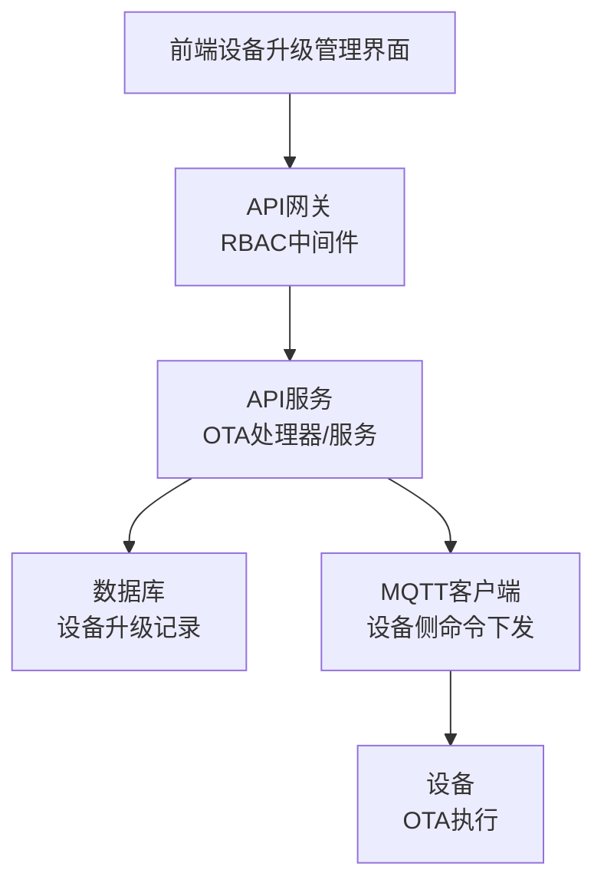
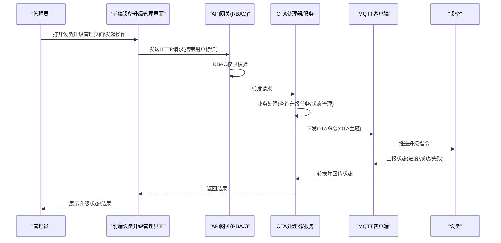
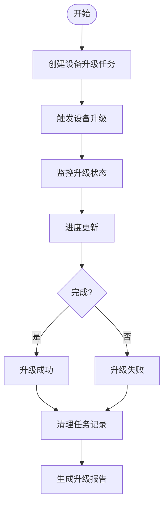
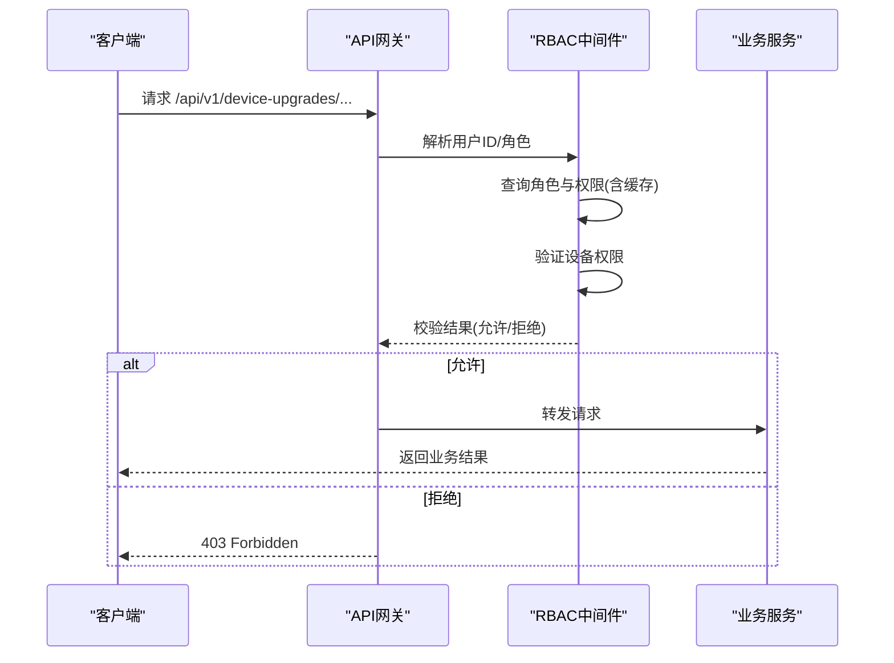
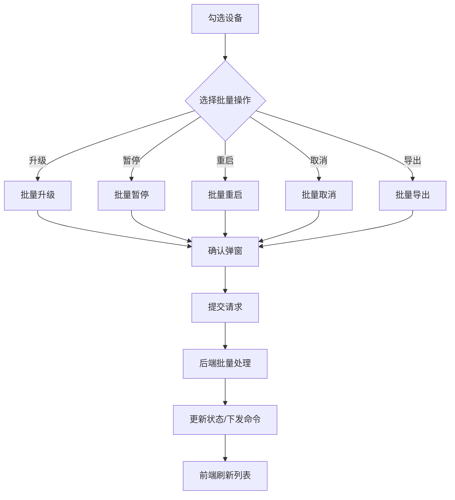
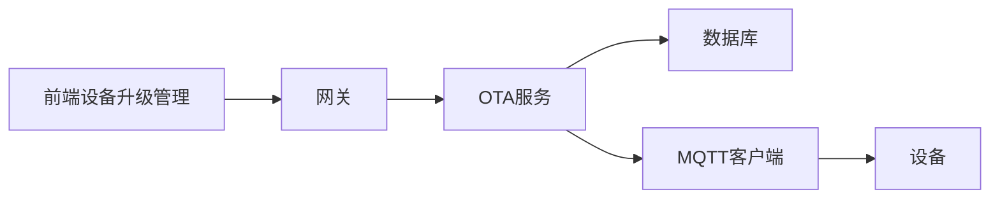

# OTA任务管理

<cite>
**本文引用的文件**
- [inv-admin-frontend/src/services/otaApi.ts](file://inv-admin-frontend/src/services/otaApi.ts)
- [inv_api_server/internal/handler/ota_handler.go](file://inv_api_server/internal/handler/ota_handler.go)
- [inv_api_server/internal/service/ota_service.go](file://inv_api_server/internal/service/ota_service.go)
- [inv_api_server/internal/repository/ota_repository.go](file://inv_api_server/internal/repository/ota_repository.go)
- [database/migrations/006_refactor_ota_to_device_upgrades.sql](file://database/migrations/006_refactor_ota_to_device_upgrades.sql)
- [api-gateway/internal/middleware/rbac.go](file://api-gateway/internal/middleware/rbac.go)
- [api-gateway/internal/middleware/prometheus.go](file://api-gateway/internal/middleware/prometheus.go)
- [api-gateway/internal/routes/routes.go](file://api-gateway/internal/routes/routes.go)
- [inv_device_server/internal/mqtt/client.go](file://inv_device_server/internal/mqtt/client.go)
</cite>

## 更新摘要
**所做更改**
- 更新了系统架构以反映从任务管理到设备升级管理的重构
- 重新组织了核心组件以适应新的设备升级管理模式
- 更新了数据库架构和API接口以支持设备升级管理
- 调整了权限控制和批量管理功能以符合新的业务流程

## 目录
1. [简介](#简介)
2. [项目结构](#项目结构)
3. [核心组件](#核心组件)
4. [架构总览](#架构总览)
5. [详细组件分析](#详细组件分析)
6. [依赖关系分析](#依赖关系分析)
7. [性能考虑](#性能考虑)
8. [故障排查指南](#故障排查指南)
9. [结论](#结论)
10. [附录](#附录)

## 简介
本技术文档围绕OTA任务管理功能的重构进行全面梳理，重点反映从传统任务管理向设备升级管理的系统性转变。重构后的系统采用"设备升级管理"的新架构，涵盖设备升级任务的生命周期管理、权限控制、批量管理、搜索与过滤、排序与分页、批量操作优化策略、用户体验优化以及相关API接口与操作示例。文档基于最新的代码实现，结合前端设备升级管理界面、后端服务、网关中间件与设备侧MQTT通道，形成完整的设备升级管理链路说明。

## 项目结构
OTA任务管理系统重构后涉及以下关键模块：
- 前端设备升级管理界面：负责设备升级任务展示、筛选、批量操作、升级状态监控等交互
- 后端API服务：提供设备升级任务管理、升级状态查询、设备升级详情、触发升级等接口
- 网关与权限控制：统一鉴权、权限校验与路由转发
- 设备侧MQTT通道：接收升级命令、上报状态
- 数据库与缓存：持久化设备升级任务状态、权限缓存

**图表来源**
- [inv-admin-frontend/src/services/otaApi.ts](file://inv-admin-frontend/src/services/otaApi.ts)
- [api-gateway/internal/middleware/rbac.go](file://api-gateway/internal/middleware/rbac.go)
- [inv_api_server/internal/handler/ota_handler.go](file://inv_api_server/internal/handler/ota_handler.go)
- [inv_device_server/internal/mqtt/client.go](file://inv_device_server/internal/mqtt/client.go)

**章节来源**
- [inv-admin-frontend/src/services/otaApi.ts](file://inv-admin-frontend/src/services/otaApi.ts)
- [api-gateway/internal/middleware/rbac.go](file://api-gateway/internal/middleware/rbac.go)
- [inv_api_server/internal/handler/ota_handler.go](file://inv_api_server/internal/handler/ota_handler.go)
- [inv_api_server/internal/service/ota_service.go](file://inv_api_server/internal/service/ota_service.go)
- [inv_device_server/internal/mqtt/client.go](file://inv_device_server/internal/mqtt/client.go)

## 核心组件
- 前端设备升级管理界面：提供设备升级任务看板、设备升级详情、升级状态监控、批量升级操作等功能
- OTA处理器与服务：封装设备升级任务查询、升级状态管理、触发升级等业务逻辑
- RBAC中间件：基于用户角色与权限表进行资源访问控制
- MQTT客户端：根据命令类型选择专用OTA主题下发命令
- 设备侧：订阅OTA命令主题，上报状态并回传至API服务

**章节来源**
- [inv-admin-frontend/src/services/otaApi.ts](file://inv-admin-frontend/src/services/otaApi.ts)
- [inv_api_server/internal/handler/ota_handler.go](file://inv_api_server/internal/handler/ota_handler.go)
- [inv_api_server/internal/service/ota_service.go](file://inv_api_server/internal/service/ota_service.go)
- [api-gateway/internal/middleware/rbac.go](file://api-gateway/internal/middleware/rbac.go)
- [inv_device_server/internal/mqtt/client.go](file://inv_device_server/internal/mqtt/client.go)

## 架构总览
OTA任务管理系统重构后采用"前端-网关-后端-API-设备"的链路设计。前端通过API网关访问后端服务；后端服务通过MQTT向设备下发OTA命令，并在设备上报状态后更新数据库；权限控制贯穿请求全链路。新架构更加专注于设备层面的升级管理，提供更直观的设备升级状态监控和管理功能。

**图表来源**
- [inv-admin-frontend/src/services/otaApi.ts](file://inv-admin-frontend/src/services/otaApi.ts)
- [api-gateway/internal/middleware/rbac.go](file://api-gateway/internal/middleware/rbac.go)
- [inv_api_server/internal/handler/ota_handler.go](file://inv_api_server/internal/handler/ota_handler.go)
- [inv_api_server/internal/service/ota_service.go](file://inv_api_server/internal/service/ota_service.go)
- [inv_device_server/internal/mqtt/client.go](file://inv_device_server/internal/mqtt/client.go)

## 详细组件分析

### 设备升级任务生命周期管理
重构后的系统专注于设备升级任务的生命周期管理，包括任务的创建、监控、状态更新和完成处理：

- **任务创建与触发**
  - 前端：选择设备或设备组，选择升级包，配置升级参数
  - 后端：接收升级请求，校验设备权限，生成升级任务并下发命令
  
- **任务监控与状态管理**
  - 前端：实时展示设备升级进度、状态和结果
  - 后端：跟踪升级状态，处理设备上报的状态信息
  
- **任务完成与清理**
  - 自动清理已完成的任务记录
  - 生成升级报告和统计数据

**图表来源**
- [inv-admin-frontend/src/services/otaApi.ts](file://inv-admin-frontend/src/services/otaApi.ts)
- [inv_api_server/internal/handler/ota_handler.go](file://inv_api_server/internal/handler/ota_handler.go)
- [inv_api_server/internal/service/ota_service.go](file://inv_api_server/internal/service/ota_service.go)

**章节来源**
- [inv-admin-frontend/src/services/otaApi.ts](file://inv-admin-frontend/src/services/otaApi.ts)
- [inv_api_server/internal/handler/ota_handler.go](file://inv_api_server/internal/handler/ota_handler.go)
- [inv_api_server/internal/service/ota_service.go](file://inv_api_server/internal/service/ota_service.go)

### 权限控制机制
重构后的权限控制机制保持原有RBAC架构，但针对设备升级管理进行了优化：

- **资源映射优化**
  - 网关将设备升级相关路径映射到资源"device_upgrade"，并基于HTTP动词推导动作
  - 支持设备级别的权限控制，确保用户只能管理其权限范围内的设备

- **用户角色与权限**
  - RBAC中间件从数据库查询用户角色与权限，支持Redis缓存与内存缓存
  - 管理员拥有所有设备的升级权限；普通用户仅能管理分配给其的设备

- **中间件拦截**
  - 在路由注册阶段对需要鉴权的路径启用权限校验
  - 设备升级操作需要额外的设备权限验证

**图表来源**
- [api-gateway/internal/middleware/rbac.go](file://api-gateway/internal/middleware/rbac.go)
- [api-gateway/internal/routes/routes.go](file://api-gateway/internal/routes/routes.go)

**章节来源**
- [api-gateway/internal/middleware/rbac.go](file://api-gateway/internal/middleware/rbac.go)
- [api-gateway/internal/middleware/prometheus.go](file://api-gateway/internal/middleware/prometheus.go)
- [api-gateway/internal/routes/routes.go](file://api-gateway/internal/routes/routes.go)

### 批量管理功能
重构后的批量管理功能更加专注于设备升级场景：

- **批量升级操作**
  - 前端支持勾选多个设备进行批量升级
  - 支持批量暂停、批量重启和批量取消升级任务
  
- **批量状态管理**
  - 支持批量查询设备升级状态
  - 批量导出升级结果和统计数据

- **批量删除**
  - 支持批量删除已完成的升级记录
  - 批量清理过期的升级任务

**图表来源**
- [inv-admin-frontend/src/services/otaApi.ts](file://inv-admin-frontend/src/services/otaApi.ts)
- [inv_api_server/internal/handler/ota_handler.go](file://inv_api_server/internal/handler/ota_handler.go)

**章节来源**
- [inv-admin-frontend/src/services/otaApi.ts](file://inv-admin-frontend/src/services/otaApi.ts)
- [inv_api_server/internal/handler/ota_handler.go](file://inv_api_server/internal/handler/ota_handler.go)

### 搜索与过滤、排序与分页
重构后的搜索过滤功能更加智能化：

- **搜索与过滤**
  - 设备升级任务支持按设备型号、升级状态、升级包版本等维度过滤
  - 支持按设备分组、区域、安装位置等业务维度筛选
  
- **排序与分页**
  - 支持按升级时间、设备名称、升级状态等多维度排序
  - 后端接口限制最大页大小，防止过大请求

**章节来源**
- [inv-admin-frontend/src/services/otaApi.ts](file://inv-admin-frontend/src/services/otaApi.ts)
- [inv_api_server/internal/handler/ota_handler.go](file://inv_api_server/internal/handler/ota_handler.go)

### 批量操作优化策略
重构后的批量操作策略更加高效：

- **并发控制**
  - 服务层设置合理的并发上限，避免大量命令同时下发
  - 支持升级队列管理和优先级控制
  
- **事务与一致性**
  - 批量操作使用数据库事务确保数据一致性
  - 支持操作回滚和重试机制

- **缓存与降载**
  - RBAC中间件与权限缓存减少重复查询
  - 前端使用智能缓存策略降低请求频率

**章节来源**
- [inv_api_server/internal/service/ota_service.go](file://inv_api_server/internal/service/ota_service.go)
- [api-gateway/internal/middleware/rbac.go](file://api-gateway/internal/middleware/rbac.go)

### 用户体验优化
重构后的用户体验更加友好：

- **操作反馈**
  - 实时升级进度展示和状态通知
  - 成功/失败消息提示和详细的操作日志
  
- **错误提示**
  - 针对设备离线、权限不足、网络异常等情况的明确提示
  - 提供升级失败的诊断和解决方案建议

- **实时刷新**
  - 升级状态页面定时轮询刷新
  - WebSocket实时推送升级状态更新

**章节来源**
- [inv-admin-frontend/src/services/otaApi.ts](file://inv-admin-frontend/src/services/otaApi.ts)

### API接口与操作示例
重构后的API接口更加规范：

- **设备升级管理接口**
  - 获取设备升级任务列表、创建升级任务、查询升级状态
  - 批量升级、暂停升级、重启升级、取消升级等操作
  
- **设备升级详情接口**
  - 设备升级历史记录、升级统计报表、升级成功率分析
  
- **设备侧命令**
  - 使用OTA专用主题下发升级命令
  - 设备上报状态并回传至服务端

**章节来源**
- [api-gateway/internal/routes/routes.go](file://api-gateway/internal/routes/routes.go)
- [inv_api_server/internal/handler/ota_handler.go](file://inv_api_server/internal/handler/ota_handler.go)
- [inv_api_server/internal/service/ota_service.go](file://inv_api_server/internal/service/ota_service.go)

## 依赖关系分析
重构后的系统依赖关系更加清晰：

- **组件耦合**
  - 前端依赖API网关与后端服务；后端依赖数据库与MQTT客户端
  - 网关依赖RBAC中间件；设备侧依赖MQTT Broker

- **外部依赖**
  - Redis用于权限缓存；PostgreSQL存储设备升级信息；EMQX作为MQTT Broker
  
- **数据库架构**
  - 新的设备升级表结构支持更灵活的升级任务管理
  - 支持设备与升级任务的多对多关系

**图表来源**
- [inv_api_server/internal/handler/ota_handler.go](file://inv_api_server/internal/handler/ota_handler.go)
- [api-gateway/internal/middleware/rbac.go](file://api-gateway/internal/middleware/rbac.go)
- [inv_api_server/internal/service/ota_service.go](file://inv_api_server/internal/service/ota_service.go)
- [inv_device_server/internal/mqtt/client.go](file://inv_device_server/internal/mqtt/client.go)

**章节来源**
- [inv_api_server/internal/handler/ota_handler.go](file://inv_api_server/internal/handler/ota_handler.go)
- [api-gateway/internal/middleware/rbac.go](file://api-gateway/internal/middleware/rbac.go)
- [inv_api_server/internal/service/ota_service.go](file://inv_api_server/internal/service/ota_service.go)
- [inv_device_server/internal/mqtt/client.go](file://inv_device_server/internal/mqtt/client.go)

## 性能考虑
重构后的性能优化更加全面：

- **并发与限流**
  - 服务端并发上限与网关限流中间件共同保障系统稳定性
  - 支持升级任务的优先级调度和资源配额管理
  
- **缓存策略**
  - RBAC与角色权限缓存显著降低鉴权成本
  - 设备升级状态缓存提高查询性能
  
- **分页与查询**
  - 后端限制最大页大小，前端合理分页减少一次性渲染压力
  - 支持索引优化和查询条件缓存

**章节来源**
- [api-gateway/internal/middleware/prometheus.go](file://api-gateway/internal/middleware/prometheus.go)
- [api-gateway/internal/middleware/rbac.go](file://api-gateway/internal/middleware/rbac.go)

## 故障排查指南
重构后的故障排查指南更加完善：

- **权限问题**
  - 确认用户角色与设备权限是否正确
  - 检查设备分组权限和区域权限设置
  
- **命令未下发**
  - 检查MQTT连接状态与主题匹配
  - 确认设备在线状态和订阅情况
  
- **状态不同步**
  - 检查设备状态上报是否正常
  - 确认服务端状态转换和数据库更新逻辑

**章节来源**
- [api-gateway/internal/middleware/rbac.go](file://api-gateway/internal/middleware/rbac.go)
- [inv_device_server/internal/mqtt/client.go](file://inv_device_server/internal/mqtt/client.go)
- [inv_api_server/internal/service/ota_service.go](file://inv_api_server/internal/service/ota_service.go)

## 结论
OTA任务管理系统重构后，从传统的任务管理转向设备升级管理，提供了更加专注和高效的设备升级管理能力。新架构通过前后端协同、权限中间件与MQTT通道实现了从设备升级任务创建到设备执行的完整闭环。现有实现覆盖了设备升级管理的关键节点与批量管理能力，建议后续在升级策略定制、更精细的权限控制与事务一致性方面进一步增强，以提升系统的可控性与可靠性。

## 附录
- 设备升级管理流程概览与MQTT主题说明
- 数据库设备升级表结构说明

**章节来源**
- [database/migrations/006_refactor_ota_to_device_upgrades.sql](file://database/migrations/006_refactor_ota_to_device_upgrades.sql)