# OTA任务调度

<cite>
**本文档引用的文件**
- [ota_handler.go](file://inv_api_server/internal/handler/ota_handler.go)
- [ota_service.go](file://inv_api_server/internal/service/ota_service.go)
- [ota_repository.go](file://inv_api_server/internal/repository/ota_repository.go)
- [otaApi.ts](file://inv-admin-frontend/src/services/otaApi.ts)
- [ota.ts](file://inv-admin-frontend/src/locales/ota.ts)
- [006_refactor_ota_to_device_upgrades.sql](file://database/migrations/006_refactor_ota_to_device_upgrades.sql)
- [009_upgrade_tasks.up.sql](file://database/migrations/009_upgrade_tasks.up.sql)
- [device.go](file://inv_device_server/internal/model/device.go)
- [client.go](file://inv_device_server/internal/mqtt/client.go)
- [stream_consumer.go](file://inv_device_server/internal/mqtt/stream_consumer.go)
- [protocol_adapter.go](file://inv_device_server/internal/service/protocol_adapter.go)
- [protocol_parser.go](file://inv_device_server/internal/service/protocol_parser.go)
- [kafka.go](file://inv_device_server/pkg/kafka/kafka.go)
</cite>

## 更新摘要
**所做更改**
- 更新了架构概览，反映从ota_tasks和ota_task_devices到device_upgrades的新架构
- 修订了核心组件分析，新增升级任务管理和设备升级记录的详细说明
- 更新了任务调度策略，增加升级任务表和任务ID关联机制
- 修改了任务状态管理，引入升级任务状态和设备升级状态的双重管理
- 更新了任务下发机制，说明任务ID和升级包ID的关联关系
- 增强了监控和进度跟踪，包括任务级别和设备级别的统计

## 目录
1. [引言](#引言)
2. [项目结构](#项目结构)
3. [核心组件](#核心组件)
4. [架构概览](#架构概览)
5. [详细组件分析](#详细组件分析)
6. [依赖关系分析](#依赖关系分析)
7. [性能考虑](#性能考虑)
8. [故障排除指南](#故障排除指南)
9. [结论](#结论)

## 引言

OTA（Over-The-Air）任务调度系统是一个完整的远程固件更新解决方案，支持设备批量升级、任务状态管理和实时监控。该系统采用微服务架构，包含API网关、设备服务器、数据库和前端管理界面。

**重要变更**: 系统已从原有的ota_tasks和ota_task_devices架构重构为基于device_upgrades的新架构，同时引入了upgrade_tasks表来管理升级任务。

系统主要功能包括：
- OTA任务创建和配置管理
- 设备范围选择和推送策略
- 任务调度和执行控制
- 实时状态跟踪和进度监控
- 设备匹配和任务分发机制
- 暂停、恢复和取消操作
- 性能优化和错误处理策略

## 项目结构

该项目采用多模块架构，主要包含以下核心模块：

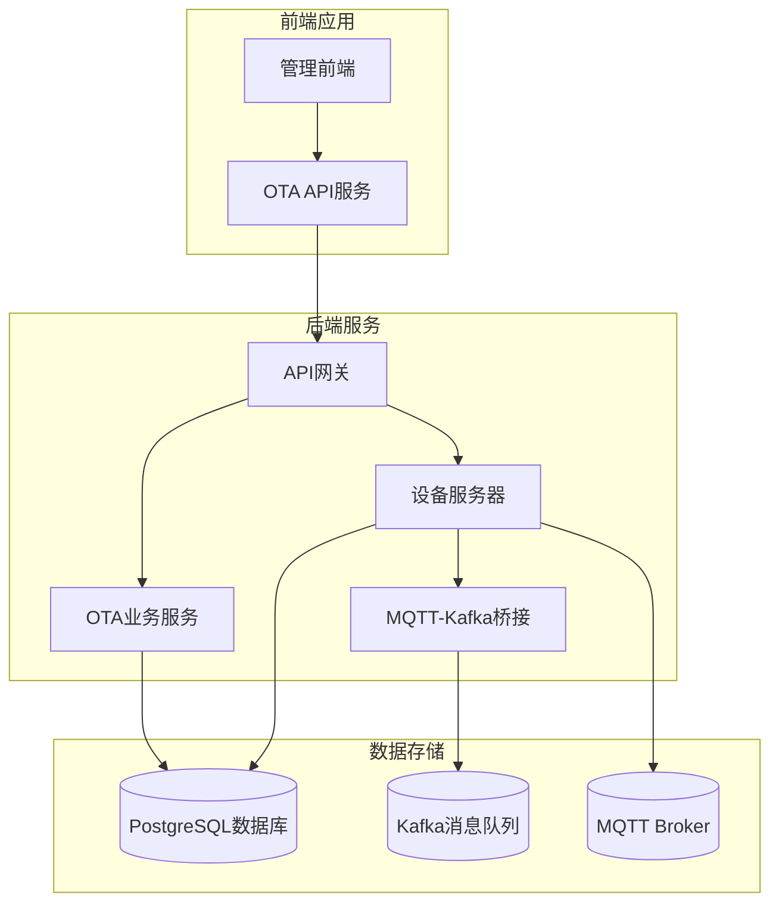

**图表来源**
- [ota_handler.go:1-200](file://inv_api_server/internal/handler/ota_handler.go#L1-L200)
- [client.go:1-150](file://inv_device_server/internal/mqtt/client.go#L1-L150)

**章节来源**
- [ota_handler.go:1-200](file://inv_api_server/internal/handler/ota_handler.go#L1-L200)
- [device.go:1-120](file://inv_device_server/internal/model/device.go#L1-L120)

## 核心组件

### OTA任务管理系统架构

系统采用分层架构设计，确保职责分离和可维护性：

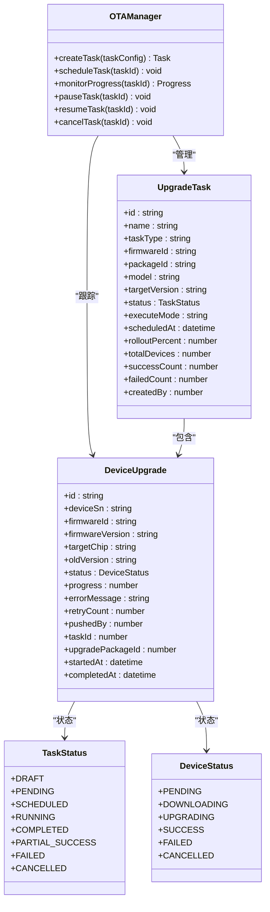

**图表来源**
- [ota_service.go:828-985](file://inv_api_server/internal/service/ota_service.go#L828-L985)
- [ota_repository.go:935-1100](file://inv_api_server/internal/repository/ota_repository.go#L935-L1100)

### 数据模型设计

系统的核心数据模型包括升级任务、设备升级和进度跟踪：

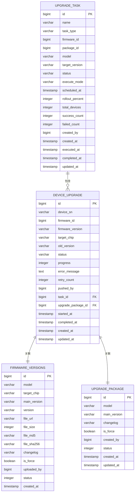

**图表来源**
- [006_refactor_ota_to_device_upgrades.sql:6-31](file://database/migrations/006_refactor_ota_to_device_upgrades.sql#L6-L31)
- [009_upgrade_tasks.up.sql:7-27](file://database/migrations/009_upgrade_tasks.up.sql#L7-L27)

**章节来源**
- [006_refactor_ota_to_device_upgrades.sql:6-31](file://database/migrations/006_refactor_ota_to_device_upgrades.sql#L6-L31)
- [009_upgrade_tasks.up.sql:7-27](file://database/migrations/009_upgrade_tasks.up.sql#L7-L27)
- [ota_service.go:828-985](file://inv_api_server/internal/service/ota_service.go#L828-L985)

## 架构概览

### 系统整体架构

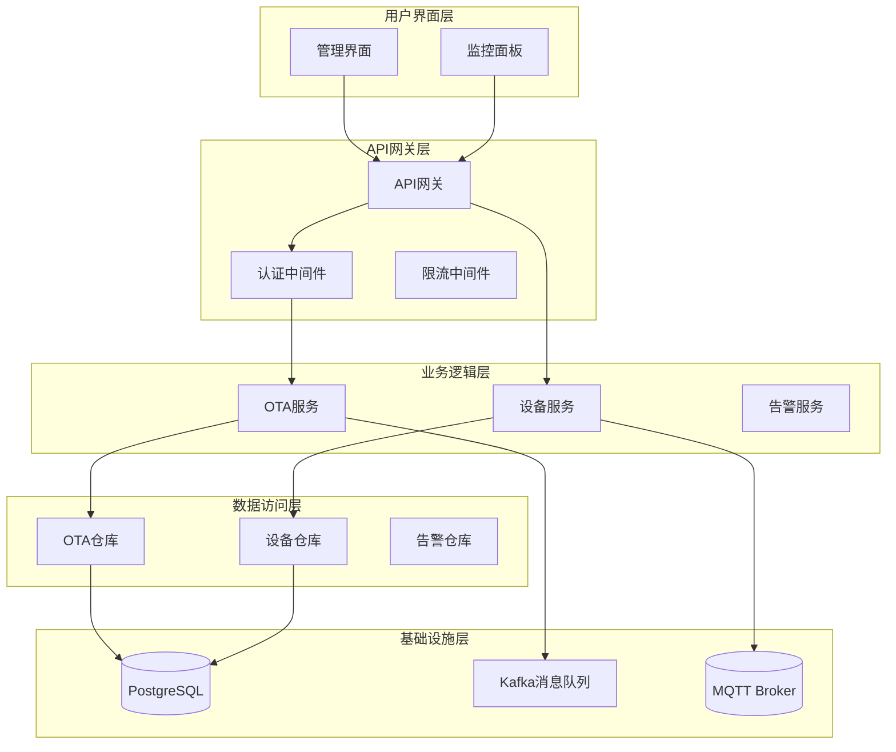

**图表来源**
- [ota_handler.go:1-200](file://inv_api_server/internal/handler/ota_handler.go#L1-L200)
- [ota_service.go:1-300](file://inv_api_server/internal/service/ota_service.go#L1-L300)

### 任务执行流程

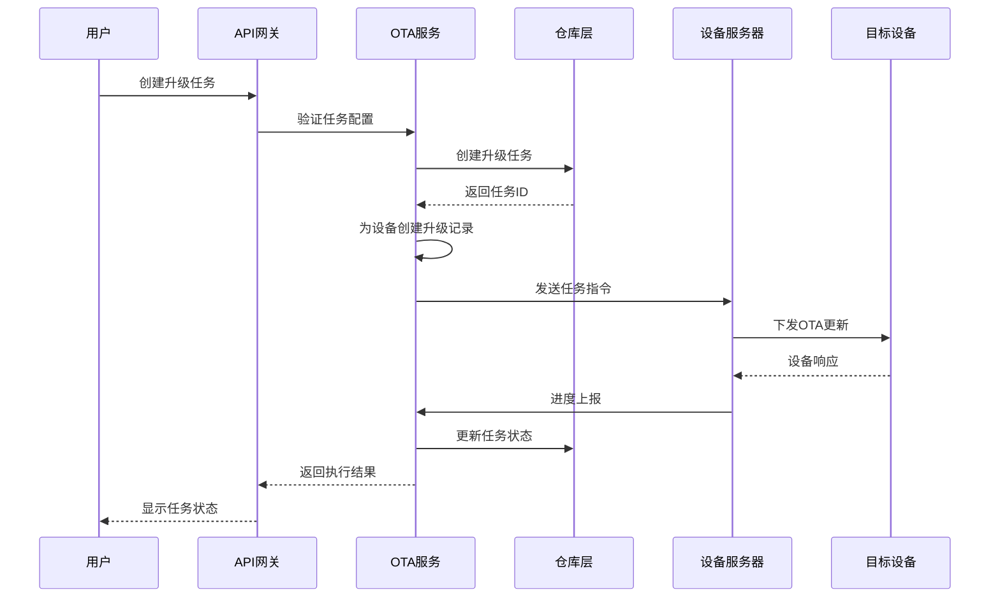

**图表来源**
- [ota_handler.go:766-824](file://inv_api_server/internal/handler/ota_handler.go#L766-L824)
- [ota_service.go:841-985](file://inv_api_server/internal/service/ota_service.go#L841-L985)

**章节来源**
- [ota_handler.go:766-824](file://inv_api_server/internal/handler/ota_handler.go#L766-L824)
- [ota_service.go:841-985](file://inv_api_server/internal/service/ota_service.go#L841-L985)

## 详细组件分析

### OTA任务创建和配置

#### 升级任务参数定义

系统支持两种任务类型：

**单芯片升级任务**
| 参数名称 | 类型 | 必填 | 描述 | 默认值 |
|---------|------|------|------|--------|
| 任务名称 | string | 否 | OTA任务的显示名称 | - |
| 任务类型 | string | 是 | 'single' | - |
| 固件ID | bigint | 是 | 要推送的固件版本标识 | - |
| 设备SN列表 | string[] | 是 | 目标设备序列号数组 | - |
| 执行模式 | string | 否 | 'immediate' | 'manual' |
| 定时执行 | datetime | 否 | 任务计划执行时间 | 立即执行 |
| 灰度比例 | integer | 否 | 设备总数的百分比 | 100 |

**升级包任务**
| 参数名称 | 类型 | 必填 | 描述 | 默认值 |
|---------|------|------|------|--------|
| 任务名称 | string | 否 | OTA任务的显示名称 | - |
| 任务类型 | string | 是 | 'package' | - |
| 升级包ID | bigint | 是 | 要推送的升级包标识 | - |
| 设备SN列表 | string[] | 是 | 目标设备序列号数组 | - |
| 执行模式 | string | 否 | 'immediate' | 'manual' |
| 定时执行 | datetime | 否 | 任务计划执行时间 | 立即执行 |
| 灰度比例 | integer | 否 | 设备总数的百分比 | 100 |

#### 设备范围选择策略

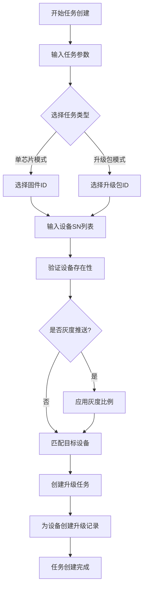

**图表来源**
- [ota_service.go:841-985](file://inv_api_server/internal/service/ota_service.go#L841-L985)
- [ota_repository.go:935-1100](file://inv_api_server/internal/repository/ota_repository.go#L935-L1100)

**章节来源**
- [ota_service.go:841-985](file://inv_api_server/internal/service/ota_service.go#L841-L985)
- [ota_repository.go:935-1100](file://inv_api_server/internal/repository/ota_repository.go#L935-L1100)

### 任务调度策略

#### 升级任务调度机制

系统支持三种执行模式：

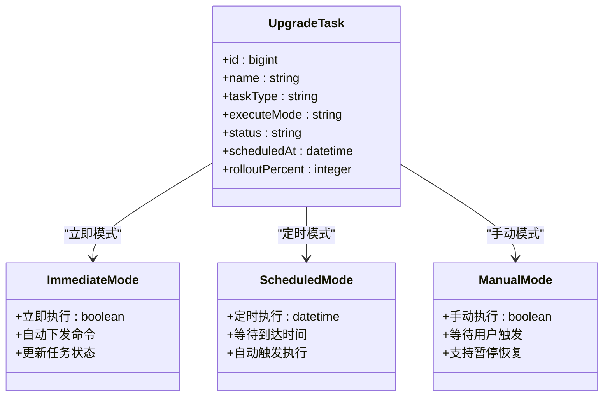

**图表来源**
- [ota_service.go:828-840](file://inv_api_server/internal/service/ota_service.go#L828-L840)

#### 灰度发布策略

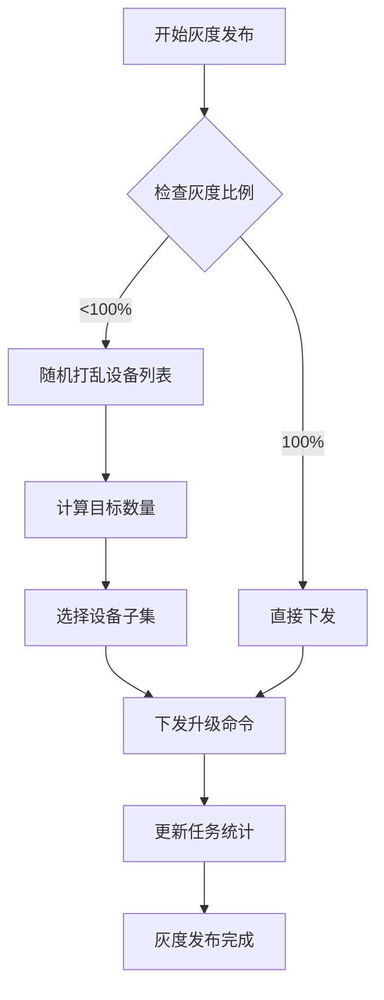

**图表来源**
- [ota_service.go:867-878](file://inv_api_server/internal/service/ota_service.go#L867-L878)

**章节来源**
- [ota_service.go:828-840](file://inv_api_server/internal/service/ota_service.go#L828-L840)
- [ota_service.go:867-878](file://inv_api_server/internal/service/ota_service.go#L867-L878)

### 任务状态管理

#### 升级任务状态转换

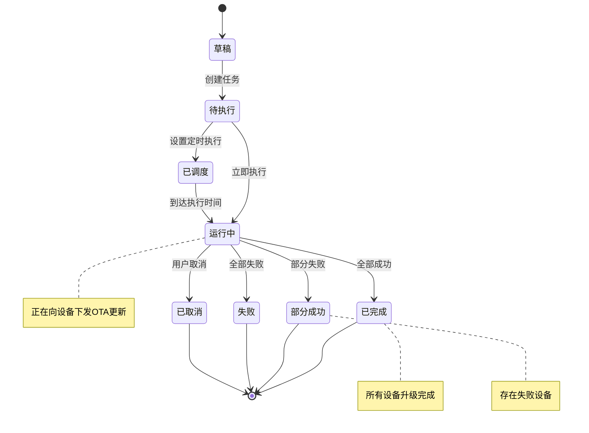

**图表来源**
- [ota_service.go:1009-1020](file://inv_api_server/internal/service/ota_service.go#L1009-L1020)

#### 设备升级状态管理

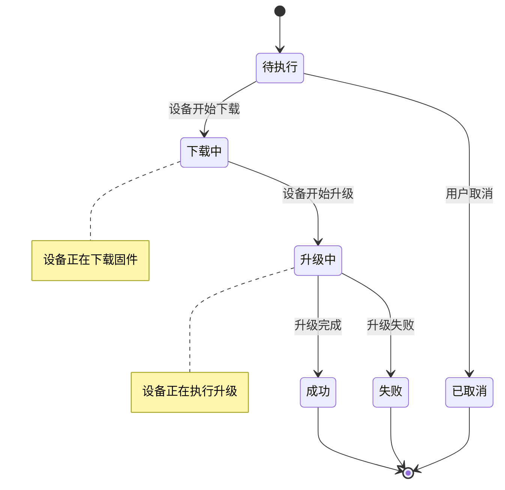

**图表来源**
- [ota_service.go:252-316](file://inv_api_server/internal/service/ota_service.go#L252-L316)

**章节来源**
- [ota_service.go:1009-1020](file://inv_api_server/internal/service/ota_service.go#L1009-L1020)
- [ota_service.go:252-316](file://inv_api_server/internal/service/ota_service.go#L252-L316)

### 任务下发机制

#### 设备升级记录创建

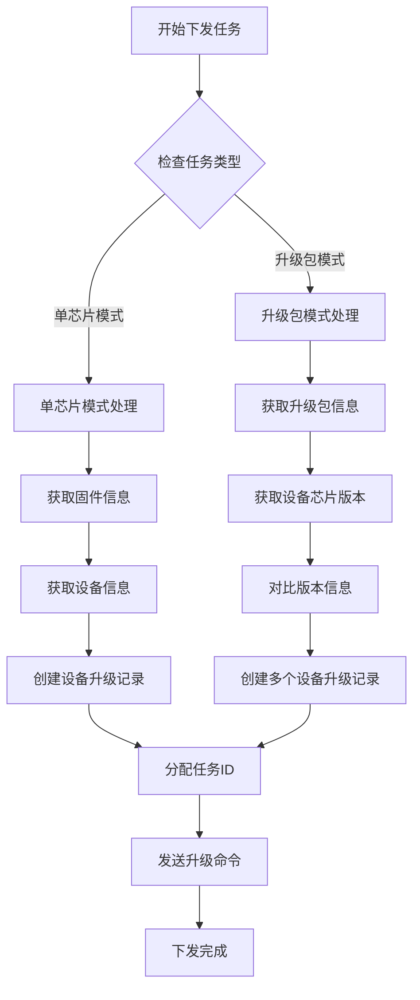

**图表来源**
- [ota_service.go:907-971](file://inv_api_server/internal/service/ota_service.go#L907-L971)

#### 任务ID关联机制

系统通过task_id字段实现任务与设备升级记录的关联：

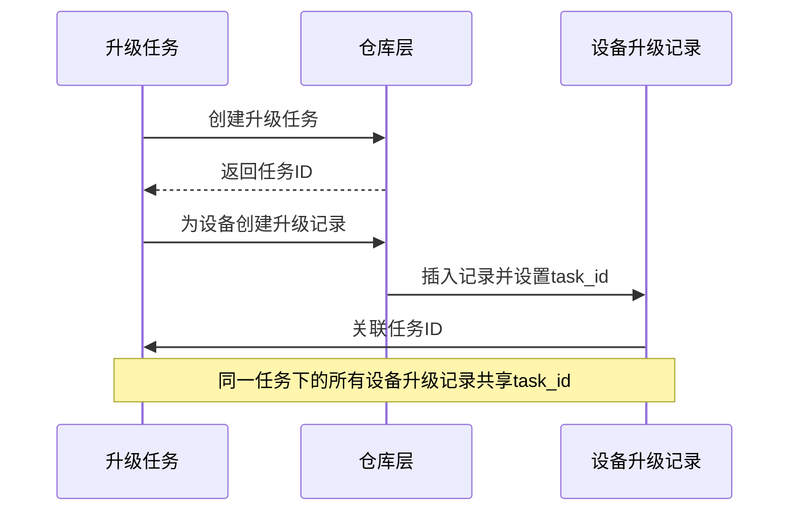

**图表来源**
- [ota_repository.go:1072-1100](file://inv_api_server/internal/repository/ota_repository.go#L1072-L1100)

**章节来源**
- [ota_service.go:907-971](file://inv_api_server/internal/service/ota_service.go#L907-L971)
- [ota_repository.go:1072-1100](file://inv_api_server/internal/repository/ota_repository.go#L1072-L1100)

### 任务监控和进度跟踪

#### 任务级进度统计

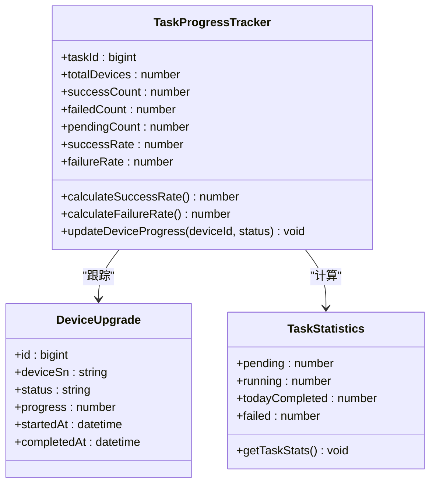

**图表来源**
- [ota_service.go:1177-1181](file://inv_api_server/internal/service/ota_service.go#L1177-L1181)
- [ota_repository.go:1022-1032](file://inv_api_server/internal/repository/ota_repository.go#L1022-L1032)

#### 实时监控面板

前端提供实时监控功能，包括：
- 任务状态统计（待执行、运行中、已完成、失败）
- 今日完成任务数
- 各任务的成功率和失败率
- 设备级别的进度详情
- 升级包模式的多芯片进度跟踪

**章节来源**
- [ota_service.go:1177-1181](file://inv_api_server/internal/service/ota_service.go#L1177-L1181)

### 任务控制操作

#### 升级任务控制流程

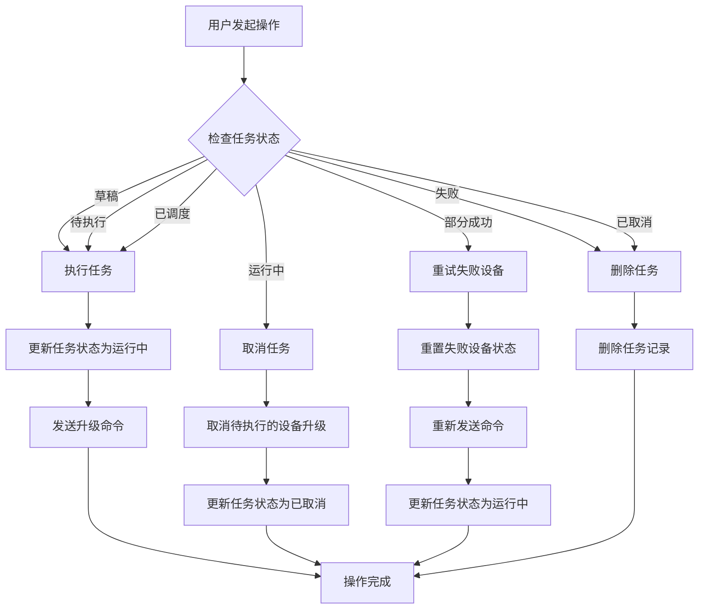

**图表来源**
- [ota_service.go:1148-1175](file://inv_api_server/internal/service/ota_service.go#L1148-L1175)

**章节来源**
- [ota_service.go:1148-1175](file://inv_api_server/internal/service/ota_service.go#L1148-L1175)

## 依赖关系分析

### 组件依赖图

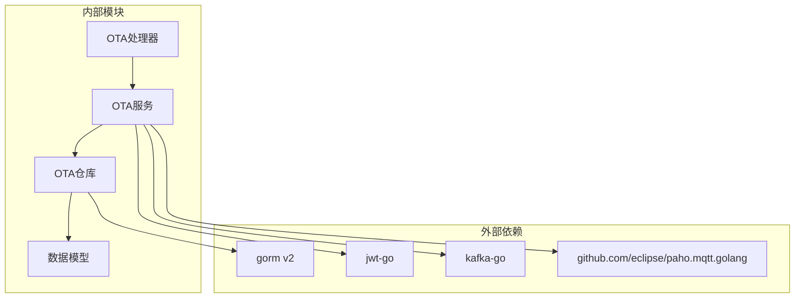

**图表来源**
- [ota_handler.go:1-200](file://inv_api_server/internal/handler/ota_handler.go#L1-L200)
- [ota_service.go:1-300](file://inv_api_server/internal/service/ota_service.go#L1-L300)

### 数据流分析

系统中的主要数据流向：

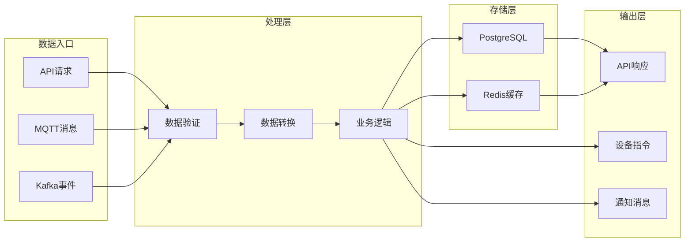

**图表来源**
- [ota_handler.go:1-200](file://inv_api_server/internal/handler/ota_handler.go#L1-L200)
- [ota_service.go:1-300](file://inv_api_server/internal/service/ota_service.go#L1-L300)

**章节来源**
- [ota_handler.go:1-200](file://inv_api_server/internal/handler/ota_handler.go#L1-L200)
- [ota_service.go:1-300](file://inv_api_server/internal/service/ota_service.go#L1-L300)

## 性能考虑

### 性能优化策略

#### 数据库优化

1. **索引优化**
   - 为device_upgrades表创建复合索引：device_sn、status、created_at
   - 为upgrade_tasks表创建状态索引：status、created_at
   - 为firmware_versions表创建版本索引：model、target_chip、created_at

2. **查询优化**
   - 实现分页查询避免大数据集加载
   - 使用连接池管理数据库连接
   - 实施查询缓存策略

#### 并发处理

系统采用并发处理模式提高响应性能：
- 升级任务执行使用goroutine池控制并发
- 设备升级状态更新异步化
- 通知发送异步化

### 错误处理策略

#### 错误分类和处理


**图表来源**
- [ota_service.go:1-300](file://inv_api_server/internal/service/ota_service.go#L1-L300)

#### 监控和告警

系统实施多层次监控：
- 应用性能监控（APM）
- 业务指标监控
- 设备状态监控
- 错误率监控

**章节来源**
- [ota_service.go:1-300](file://inv_api_server/internal/service/ota_service.go#L1-L300)

## 故障排除指南

### 常见问题诊断

#### 任务创建失败

**症状**: 任务创建接口返回错误
**可能原因**:
- 设备SN列表为空或无效
- 固件或升级包不存在
- 权限不足
- 参数验证失败

**解决步骤**:
1. 检查设备SN格式和有效性
2. 验证固件或升级包存在性
3. 确认用户权限
4. 查看详细的错误日志

#### 设备升级失败

**症状**: 设备长时间处于升级状态
**可能原因**:
- 网络连接不稳定
- 设备离线
- 固件包损坏
- 设备存储空间不足

**解决步骤**:
1. 检查设备在线状态
2. 验证固件完整性
3. 确认设备存储空间
4. 查看设备日志

#### 任务进度异常

**症状**: 任务进度统计与实际不符
**可能原因**:
- 设备上报延迟
- 网络传输问题
- 系统时间不同步
- 缓存数据不一致

**解决步骤**:
1. 检查系统时间同步
2. 清理缓存数据
3. 重新计算进度
4. 查看网络连接质量

### 调试工具和方法

#### 日志分析

系统提供详细的日志记录：
- 请求日志：记录所有API调用
- 业务日志：记录关键业务操作
- 错误日志：记录异常和错误信息
- 性能日志：记录性能指标

#### 性能分析

```mermaid
graph LR
subgraph "性能分析工具"
PPROF[pprof分析器]
PROMETHEUS[Prometheus监控]
GRAFANA[Grafana可视化]
end
subgraph "监控指标"
CPU[CPU使用率]
MEMORY[内存使用量]
REQUEST_RATE[请求速率]
ERROR_RATE[错误率]
RESPONSE_TIME[响应时间]
```

**章节来源**
- [ota_service.go:1-300](file://inv_api_server/internal/service/ota_service.go#L1-L300)

## 结论

OTA任务调度系统经过重构后，从原有的ota_tasks和ota_task_devices架构转变为基于device_upgrades的新架构，同时引入了upgrade_tasks表来管理升级任务。新架构通过任务ID和升级包ID的关联机制，实现了更精细的任务管理和设备升级跟踪。

### 主要优势

1. **架构设计合理**: 采用微服务架构，职责分离明确
2. **功能完善**: 支持复杂的任务配置和灵活的调度策略
3. **监控全面**: 提供实时的状态跟踪和进度监控
4. **扩展性强**: 模块化设计便于功能扩展和维护
5. **性能优化**: 实施多种性能优化策略确保系统稳定性
6. **任务管理**: 引入升级任务表实现任务级别的统一管理

### 改进方向

1. **增强安全机制**: 添加更细粒度的权限控制
2. **优化用户体验**: 改进前端交互和报表展示
3. **提升可靠性**: 增加更多容错和自愈能力
4. **扩展支持**: 支持更多类型的设备和固件格式

该系统为工业物联网场景下的设备固件管理提供了优秀的解决方案，具有良好的实用价值和推广前景。