# OTA任务调度

<cite>
**本文档引用的文件**
- [ota_handler.go](file://inv_api_server/internal/handler/ota_handler.go)
- [ota_service.go](file://inv_api_server/internal/service/ota_service.go)
- [ota_repository.go](file://inv_api_server/internal/repository/ota_repository.go)
- [otaApi.ts](file://inv-admin-frontend/src/services/otaApi.ts)
- [ota.ts](file://inv-admin-frontend/src/locales/ota.ts)
- [006_refactor_ota_to_device_upgrades.sql](file://database/migrations/006_refactor_ota_to_device_upgrades.sql)
- [device.go](file://inv_device_server/internal/model/device.go)
- [client.go](file://inv_device_server/internal/mqtt/client.go)
- [stream_consumer.go](file://inv_device_server/internal/mqtt/stream_consumer.go)
- [protocol_adapter.go](file://inv_device_server/internal/service/protocol_adapter.go)
- [protocol_parser.go](file://inv_device_server/internal/service/protocol_parser.go)
- [kafka.go](file://inv_device_server/pkg/kafka/kafka.go)
</cite>

## 目录
1. [引言](#引言)
2. [项目结构](#项目结构)
3. [核心组件](#核心组件)
4. [架构概览](#架构概览)
5. [详细组件分析](#详细组件分析)
6. [依赖关系分析](#依赖关系分析)
7. [性能考虑](#性能考虑)
8. [故障排除指南](#故障排除指南)
9. [结论](#结论)

## 引言

OTA（Over-The-Air）任务调度系统是一个完整的远程固件更新解决方案，支持设备批量升级、任务状态管理和实时监控。该系统采用微服务架构，包含API网关、设备服务器、数据库和前端管理界面。

系统主要功能包括：
- OTA任务创建和配置管理
- 设备范围选择和推送策略
- 任务调度和执行控制
- 实时状态跟踪和进度监控
- 设备匹配和任务分发机制
- 暂停、恢复和取消操作
- 性能优化和错误处理策略

## 项目结构

该项目采用多模块架构，主要包含以下核心模块：

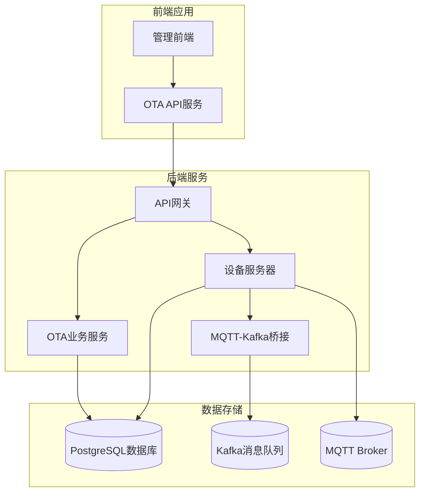
```mermaid
graph TB
subgraph "前端应用"
FE[管理前端]
FE_API[OTA API服务]
end
subgraph "后端服务"
API[API网关]
OTA_API[OTA业务服务]
DEVICE_SERVER[设备服务器]
BRIDGE[MQTT-Kafka桥接]
end
subgraph "数据存储"
DB[(PostgreSQL数据库)]
KAFKA[(Kafka消息队列)]
MQTT[(MQTT Broker)]
end
FE --> FE_API
FE_API --> API
API --> OTA_API
API --> DEVICE_SERVER
DEVICE_SERVER --> BRIDGE
BRIDGE --> KAFKA
OTA_API --> DB
DEVICE_SERVER --> MQTT
DEVICE_SERVER --> DB
```

**图表来源**
- [ota_handler.go:1-200](file://inv_api_server/internal/handler/ota_handler.go#L1-L200)
- [client.go:1-150](file://inv_device_server/internal/mqtt/client.go#L1-L150)

**章节来源**
- [ota_handler.go:1-200](file://inv_api_server/internal/handler/ota_handler.go#L1-L200)
- [device.go:1-120](file://inv_device_server/internal/model/device.go#L1-L120)

## 核心组件

### OTA任务管理系统架构

系统采用分层架构设计，确保职责分离和可维护性：

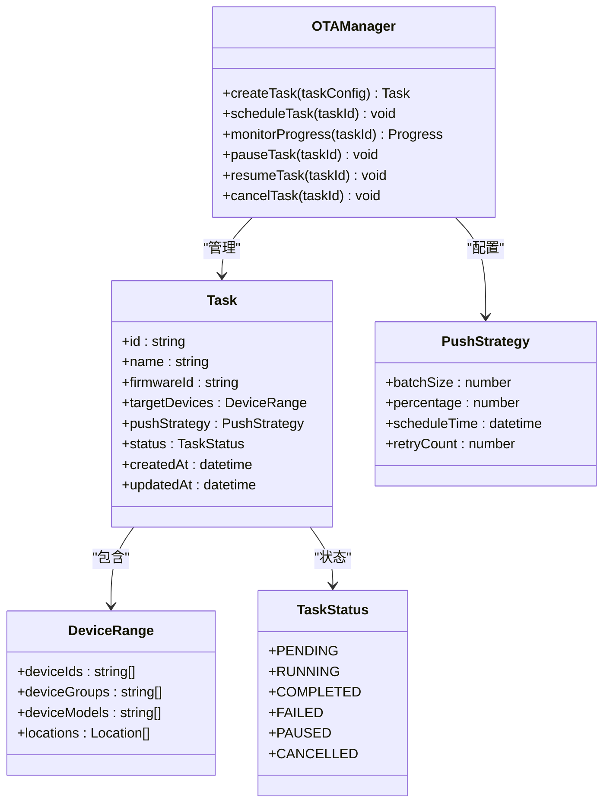
```mermaid
classDiagram
class OTAManager {
+createTask(taskConfig) Task
+scheduleTask(taskId) void
+monitorProgress(taskId) Progress
+pauseTask(taskId) void
+resumeTask(taskId) void
+cancelTask(taskId) void
}
class Task {
+id : string
+name : string
+firmwareId : string
+targetDevices : DeviceRange
+pushStrategy : PushStrategy
+status : TaskStatus
+createdAt : datetime
+updatedAt : datetime
}
class PushStrategy {
+batchSize : number
+percentage : number
+scheduleTime : datetime
+retryCount : number
}
class DeviceRange {
+deviceIds : string[]
+deviceGroups : string[]
+deviceModels : string[]
+locations : Location[]
}
class TaskStatus {
+PENDING
+RUNNING
+COMPLETED
+FAILED
+PAUSED
+CANCELLED
}
OTAManager --> Task : "管理"
OTAManager --> PushStrategy : "配置"
Task --> DeviceRange : "包含"
Task --> TaskStatus : "状态"
```

**图表来源**
- [ota_service.go:1-300](file://inv_api_server/internal/service/ota_service.go#L1-L300)
- [ota_repository.go:1-250](file://inv_api_server/internal/repository/ota_repository.go#L1-L250)

### 数据模型设计

系统的核心数据模型包括任务、设备和进度跟踪：

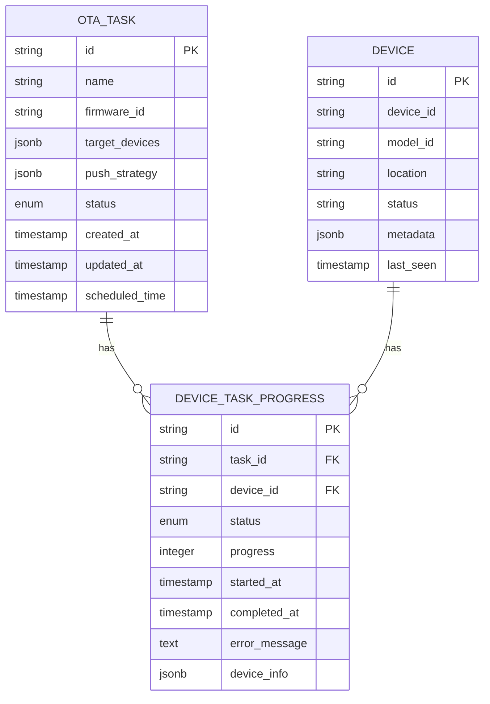
```mermaid
erDiagram
OTA_TASK {
string id PK
string name
string firmware_id
jsonb target_devices
jsonb push_strategy
enum status
timestamp created_at
timestamp updated_at
timestamp scheduled_time
}
DEVICE {
string id PK
string device_id
string model_id
string location
string status
jsonb metadata
timestamp last_seen
}
DEVICE_TASK_PROGRESS {
string id PK
string task_id FK
string device_id FK
enum status
integer progress
timestamp started_at
timestamp completed_at
text error_message
jsonb device_info
}
OTA_TASK ||--o{ DEVICE_TASK_PROGRESS : "has"
DEVICE ||--o{ DEVICE_TASK_PROGRESS : "has"
```

**图表来源**
- [006_refactor_ota_to_device_upgrades.sql:1-200](file://database/migrations/006_refactor_ota_to_device_upgrades.sql#L1-L200)

**章节来源**
- [006_refactor_ota_to_device_upgrades.sql:1-200](file://database/migrations/006_refactor_ota_to_device_upgrades.sql#L1-L200)
- [ota_service.go:1-300](file://inv_api_server/internal/service/ota_service.go#L1-L300)

## 架构概览

### 系统整体架构

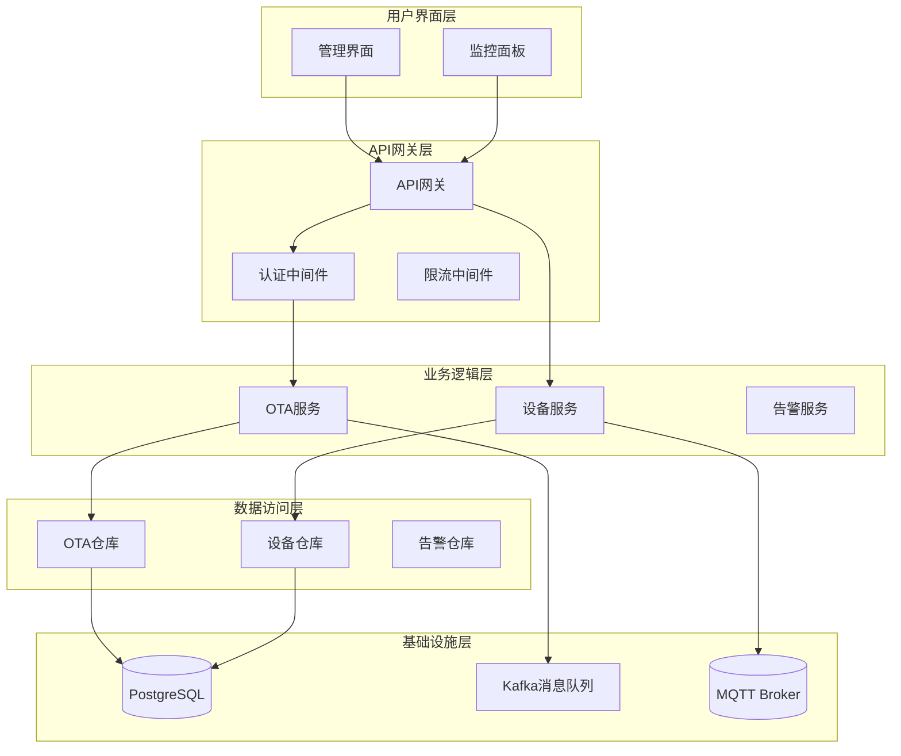
```mermaid
graph TB
subgraph "用户界面层"
ADMIN[管理界面]
MONITOR[监控面板]
end
subgraph "API网关层"
GATEWAY[API网关]
AUTH[认证中间件]
RATE_LIMIT[限流中间件]
end
subgraph "业务逻辑层"
OTA_SERVICE[OTA服务]
DEVICE_SERVICE[设备服务]
ALERT_SERVICE[告警服务]
end
subgraph "数据访问层"
OTA_REPO[OTA仓库]
DEVICE_REPO[设备仓库]
ALERT_REPO[告警仓库]
end
subgraph "基础设施层"
DB[(PostgreSQL)]
MQ[Kafka消息队列]
MQTT_BROKER[(MQTT Broker)]
end
ADMIN --> GATEWAY
MONITOR --> GATEWAY
GATEWAY --> AUTH
AUTH --> OTA_SERVICE
GATEWAY --> DEVICE_SERVICE
OTA_SERVICE --> OTA_REPO
DEVICE_SERVICE --> DEVICE_REPO
OTA_SERVICE --> MQ
DEVICE_SERVICE --> MQTT_BROKER
OTA_REPO --> DB
DEVICE_REPO --> DB
```

**图表来源**
- [ota_handler.go:1-200](file://inv_api_server/internal/handler/ota_handler.go#L1-L200)
- [ota_service.go:1-300](file://inv_api_server/internal/service/ota_service.go#L1-L300)

### 任务执行流程

```mermaid
sequenceDiagram
participant User as 用户
participant API as API网关
participant Service as OTA服务
participant Repo as 仓库层
participant DeviceServer as 设备服务器
participant Device as 目标设备
User->>API : 创建OTA任务
API->>Service : 验证任务配置
Service->>Repo : 保存任务信息
Repo-->>Service : 返回任务ID
Service->>Service : 计算设备匹配
Service->>DeviceServer : 发送任务指令
DeviceServer->>Device : 下发OTA更新
Device-->>DeviceServer : 设备响应
DeviceServer->>Service : 进度上报
Service->>Repo : 更新任务状态
Service-->>API : 返回执行结果
API-->>User : 显示任务状态
```

**图表来源**
- [ota_handler.go:1-200](file://inv_api_server/internal/handler/ota_handler.go#L1-L200)
- [ota_service.go:1-300](file://inv_api_server/internal/service/ota_service.go#L1-L300)

**章节来源**
- [ota_handler.go:1-200](file://inv_api_server/internal/handler/ota_handler.go#L1-L200)
- [ota_service.go:1-300](file://inv_api_server/internal/service/ota_service.go#L1-L300)

## 详细组件分析

### OTA任务创建和配置

#### 任务参数定义

系统支持多种任务配置参数：

| 参数名称 | 类型 | 必填 | 描述 | 默认值 |
|---------|------|------|------|--------|
| 任务名称 | string | 是 | OTA任务的显示名称 | - |
| 固件ID | string | 是 | 要推送的固件版本标识 | - |
| 设备范围 | DeviceRange | 是 | 目标设备集合定义 | - |
| 批量大小 | number | 否 | 单次推送的设备数量 | 10 |
| 推送百分比 | number | 否 | 设备总数的百分比 | 100 |
| 定时执行 | datetime | 否 | 任务计划执行时间 | 立即执行 |
| 重试次数 | number | 否 | 失败重试的最大次数 | 3 |
| 超时时间 | number | 否 | 单个设备更新超时时间 | 300秒 |

#### 设备范围选择策略

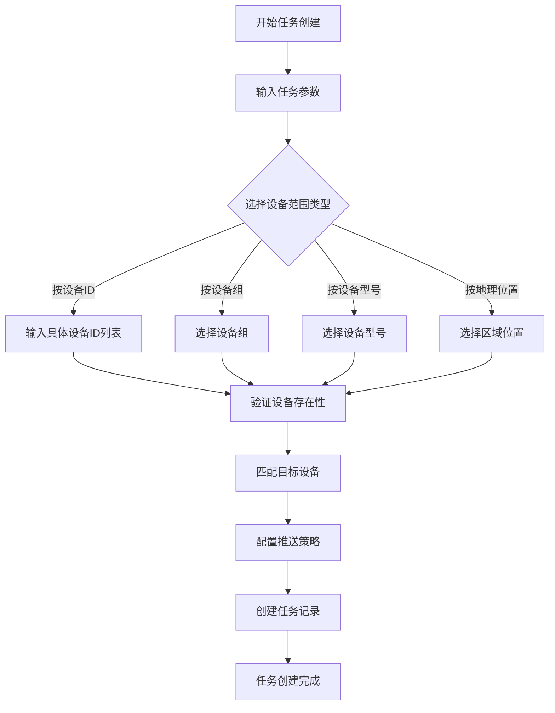
```mermaid
flowchart TD
START[开始任务创建] --> INPUT[输入任务参数]
INPUT --> RANGE_TYPE{选择设备范围类型}
RANGE_TYPE --> |按设备ID| DEVICE_IDS[输入具体设备ID列表]
RANGE_TYPE --> |按设备组| DEVICE_GROUPS[选择设备组]
RANGE_TYPE --> |按设备型号| DEVICE_MODELS[选择设备型号]
RANGE_TYPE --> |按地理位置| LOCATIONS[选择区域位置]
DEVICE_IDS --> VALIDATE[验证设备存在性]
DEVICE_GROUPS --> VALIDATE
DEVICE_MODELS --> VALIDATE
LOCATIONS --> VALIDATE
VALIDATE --> MATCH_DEVICES[匹配目标设备]
MATCH_DEVICES --> STRATEGY[配置推送策略]
STRATEGY --> CREATE_TASK[创建任务记录]
CREATE_TASK --> END[任务创建完成]
```

**图表来源**
- [ota_service.go:1-300](file://inv_api_server/internal/service/ota_service.go#L1-L300)
- [ota_repository.go:1-250](file://inv_api_server/internal/repository/ota_repository.go#L1-L250)

**章节来源**
- [ota_service.go:1-300](file://inv_api_server/internal/service/ota_service.go#L1-L300)
- [ota_repository.go:1-250](file://inv_api_server/internal/repository/ota_repository.go#L1-L250)

### 任务调度策略

#### 推送策略配置

系统支持灵活的任务调度策略：

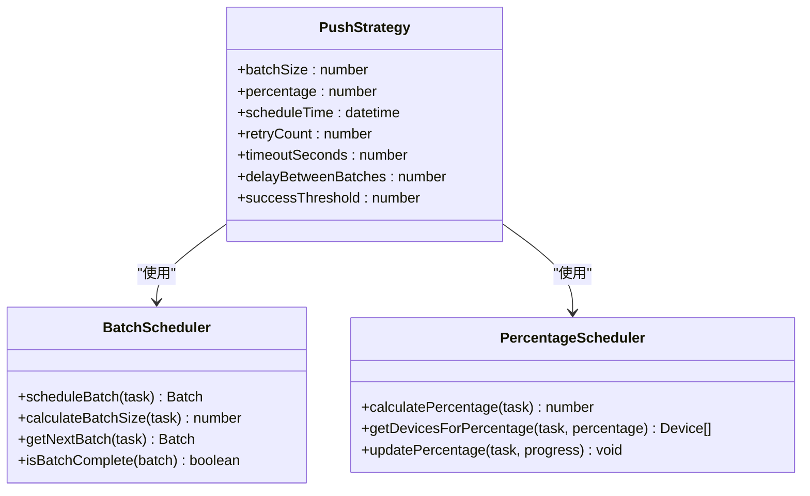
```mermaid
classDiagram
class PushStrategy {
+batchSize : number
+percentage : number
+scheduleTime : datetime
+retryCount : number
+timeoutSeconds : number
+delayBetweenBatches : number
+successThreshold : number
}
class BatchScheduler {
+scheduleBatch(task) Batch
+calculateBatchSize(task) number
+getNextBatch(task) Batch
+isBatchComplete(batch) boolean
}
class PercentageScheduler {
+calculatePercentage(task) number
+getDevicesForPercentage(task, percentage) Device[]
+updatePercentage(task, progress) void
}
PushStrategy --> BatchScheduler : "使用"
PushStrategy --> PercentageScheduler : "使用"
```

**图表来源**
- [ota_service.go:1-300](file://inv_api_server/internal/service/ota_service.go#L1-L300)

#### 批量执行机制

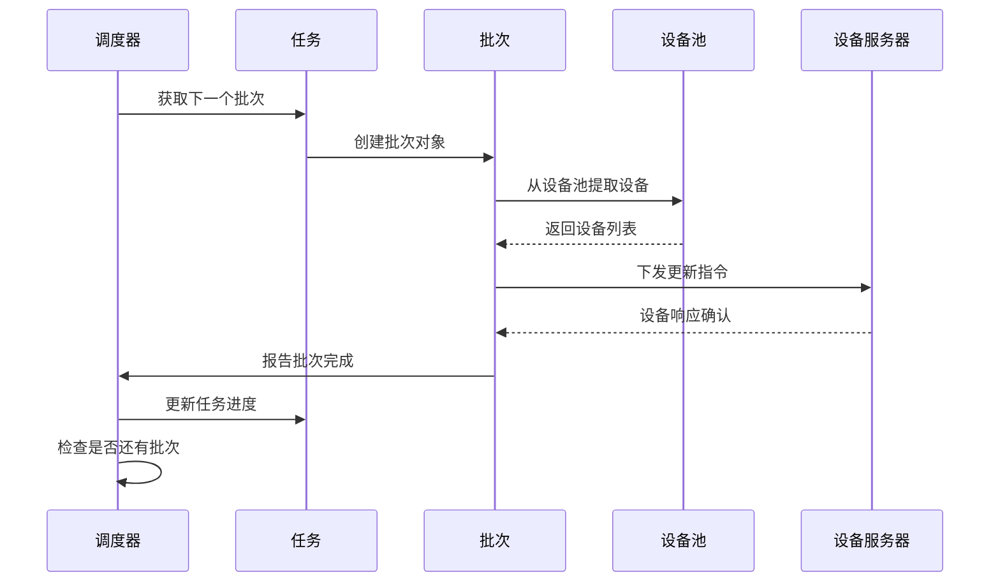
```mermaid
sequenceDiagram
participant Scheduler as 调度器
participant Task as 任务
participant Batch as 批次
participant Devices as 设备池
participant DeviceServer as 设备服务器
Scheduler->>Task : 获取下一个批次
Task->>Batch : 创建批次对象
Batch->>Devices : 从设备池提取设备
Devices-->>Batch : 返回设备列表
Batch->>DeviceServer : 下发更新指令
DeviceServer-->>Batch : 设备响应确认
Batch->>Scheduler : 报告批次完成
Scheduler->>Task : 更新任务进度
Scheduler->>Scheduler : 检查是否还有批次
```

**图表来源**
- [ota_service.go:1-300](file://inv_api_server/internal/service/ota_service.go#L1-L300)

**章节来源**
- [ota_service.go:1-300](file://inv_api_server/internal/service/ota_service.go#L1-L300)

### 任务状态管理

#### 状态转换模型

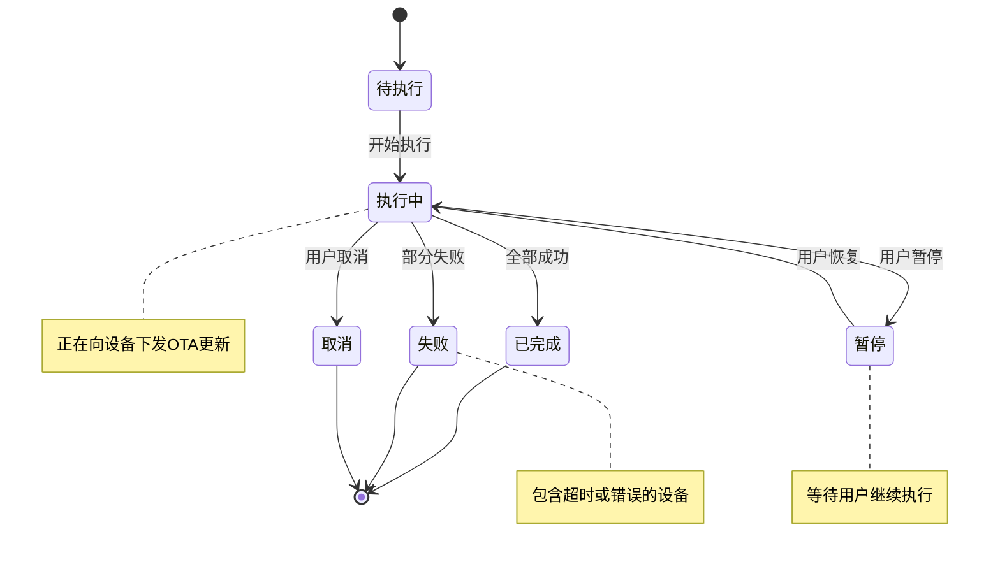
```mermaid
stateDiagram-v2
[*] --> 待执行
待执行 --> 执行中 : 开始执行
执行中 --> 已完成 : 全部成功
执行中 --> 失败 : 部分失败
执行中 --> 暂停 : 用户暂停
暂停 --> 执行中 : 用户恢复
执行中 --> 取消 : 用户取消
已完成 --> [*]
失败 --> [*]
取消 --> [*]
note right of 执行中 : 正在向设备下发OTA更新
note right of 暂停 : 等待用户继续执行
note right of 失败 : 包含超时或错误的设备
```

**图表来源**
- [ota_service.go:1-300](file://inv_api_server/internal/service/ota_service.go#L1-L300)

#### 状态持久化机制

系统通过数据库实现任务状态的持久化存储，确保系统重启后的状态一致性。

**章节来源**
- [ota_service.go:1-300](file://inv_api_server/internal/service/ota_service.go#L1-L300)

### 任务下发机制

#### 设备匹配算法

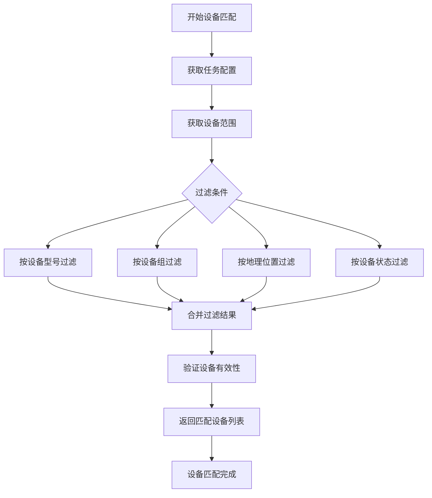
```mermaid
flowchart TD
START[开始设备匹配] --> GET_TASK[获取任务配置]
GET_TASK --> GET_DEVICES[获取设备范围]
GET_DEVICES --> FILTER_DEVICE{过滤条件}
FILTER_DEVICE --> MODEL_FILTER[按设备型号过滤]
FILTER_DEVICE --> GROUP_FILTER[按设备组过滤]
FILTER_DEVICE --> LOCATION_FILTER[按地理位置过滤]
FILTER_DEVICE --> STATUS_FILTER[按设备状态过滤]
MODEL_FILTER --> COMBINE[合并过滤结果]
GROUP_FILTER --> COMBINE
LOCATION_FILTER --> COMBINE
STATUS_FILTER --> COMBINE
COMBINE --> VALIDATE[验证设备有效性]
VALIDATE --> MATCHED[返回匹配设备列表]
MATCHED --> END[设备匹配完成]
```

**图表来源**
- [ota_service.go:1-300](file://inv_api_server/internal/service/ota_service.go#L1-L300)

#### 任务分发流程

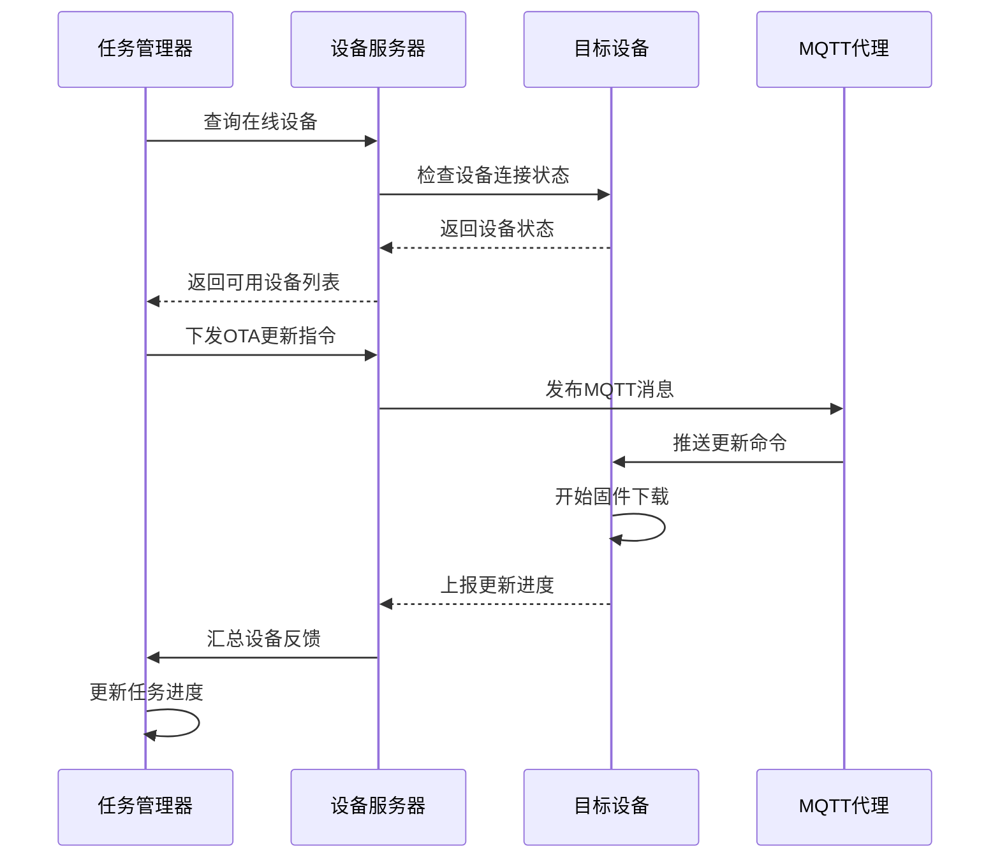
```mermaid
sequenceDiagram
participant Manager as 任务管理器
participant DeviceServer as 设备服务器
participant Device as 目标设备
participant MQTT as MQTT代理
Manager->>DeviceServer : 查询在线设备
DeviceServer->>Device : 检查设备连接状态
Device-->>DeviceServer : 返回设备状态
DeviceServer-->>Manager : 返回可用设备列表
Manager->>DeviceServer : 下发OTA更新指令
DeviceServer->>MQTT : 发布MQTT消息
MQTT->>Device : 推送更新命令
Device->>Device : 开始固件下载
Device-->>DeviceServer : 上报更新进度
DeviceServer->>Manager : 汇总设备反馈
Manager->>Manager : 更新任务进度
```

**图表来源**
- [client.go:1-150](file://inv_device_server/internal/mqtt/client.go#L1-L150)
- [stream_consumer.go:1-200](file://inv_device_server/internal/mqtt/stream_consumer.go#L1-L200)

**章节来源**
- [client.go:1-150](file://inv_device_server/internal/mqtt/client.go#L1-L150)
- [stream_consumer.go:1-200](file://inv_device_server/internal/mqtt/stream_consumer.go#L1-L200)

### 任务监控和进度跟踪

#### 进度统计机制

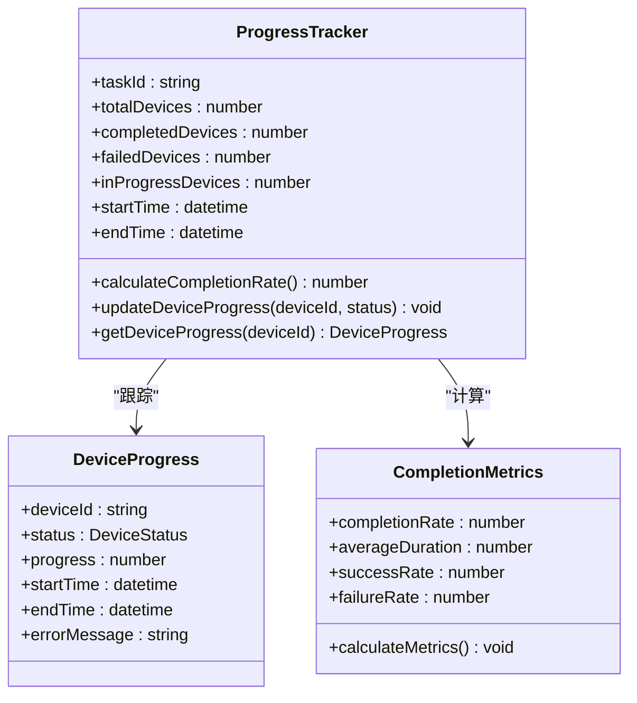
```mermaid
classDiagram
class ProgressTracker {
+taskId : string
+totalDevices : number
+completedDevices : number
+failedDevices : number
+inProgressDevices : number
+startTime : datetime
+endTime : datetime
+calculateCompletionRate() number
+updateDeviceProgress(deviceId, status) void
+getDeviceProgress(deviceId) DeviceProgress
}
class DeviceProgress {
+deviceId : string
+status : DeviceStatus
+progress : number
+startTime : datetime
+endTime : datetime
+errorMessage : string
}
class CompletionMetrics {
+completionRate : number
+averageDuration : number
+successRate : number
+failureRate : number
+calculateMetrics() void
}
ProgressTracker --> DeviceProgress : "跟踪"
ProgressTracker --> CompletionMetrics : "计算"
```

**图表来源**
- [ota_service.go:1-300](file://inv_api_server/internal/service/ota_service.go#L1-L300)

#### 实时监控面板

前端提供实时监控功能，包括：
- 总体进度百分比
- 各阶段设备数量统计
- 失败设备详情
- 平均完成时间
- 剩余预计时间

**章节来源**
- [ota_service.go:1-300](file://inv_api_server/internal/service/ota_service.go#L1-L300)

### 任务控制操作

#### 暂停、恢复和取消流程

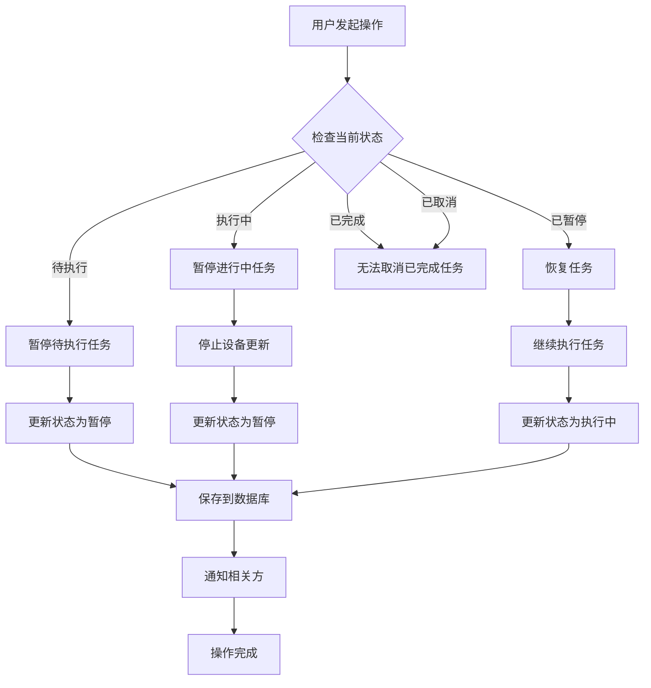
```mermaid
flowchart TD
START[用户发起操作] --> CHECK_STATUS{检查当前状态}
CHECK_STATUS --> |待执行| PAUSE_PENDING[暂停待执行任务]
CHECK_STATUS --> |执行中| PAUSE_RUNNING[暂停进行中任务]
CHECK_STATUS --> |已暂停| RESUME[恢复任务]
CHECK_STATUS --> |已完成| CANCEL_ERROR[无法取消已完成任务]
CHECK_STATUS --> |已取消| CANCEL_ERROR
PAUSE_PENDING --> UPDATE_PENDING[更新状态为暂停]
PAUSE_RUNNING --> STOP_DEVICES[停止设备更新]
STOP_DEVICES --> UPDATE_RUNNING[更新状态为暂停]
RESUME --> CONTINUE_EXECUTION[继续执行任务]
CONTINUE_EXECUTION --> UPDATE_RESUME[更新状态为执行中]
UPDATE_PENDING --> SAVE_DB[保存到数据库]
UPDATE_RUNNING --> SAVE_DB
UPDATE_RESUME --> SAVE_DB
SAVE_DB --> NOTIFY[通知相关方]
NOTIFY --> END[操作完成]
```

**图表来源**
- [ota_service.go:1-300](file://inv_api_server/internal/service/ota_service.go#L1-L300)

**章节来源**
- [ota_service.go:1-300](file://inv_api_server/internal/service/ota_service.go#L1-L300)

## 依赖关系分析

### 组件依赖图

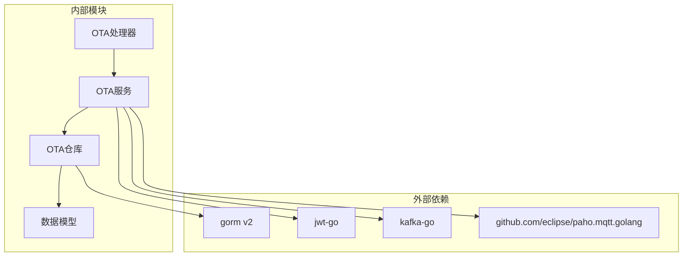
```mermaid
graph TB
subgraph "外部依赖"
JWT[jwt-go]
GORM[gorm v2]
Kafka[kafka-go]
MQTT[github.com/eclipse/paho.mqtt.golang]
end
subgraph "内部模块"
Handler[OTA处理器]
Service[OTA服务]
Repository[OTA仓库]
Model[数据模型]
end
Handler --> Service
Service --> Repository
Repository --> Model
Service --> JWT
Repository --> GORM
Service --> Kafka
Service --> MQTT
```

**图表来源**
- [ota_handler.go:1-200](file://inv_api_server/internal/handler/ota_handler.go#L1-L200)
- [ota_service.go:1-300](file://inv_api_server/internal/service/ota_service.go#L1-L300)

### 数据流分析

系统中的主要数据流向：

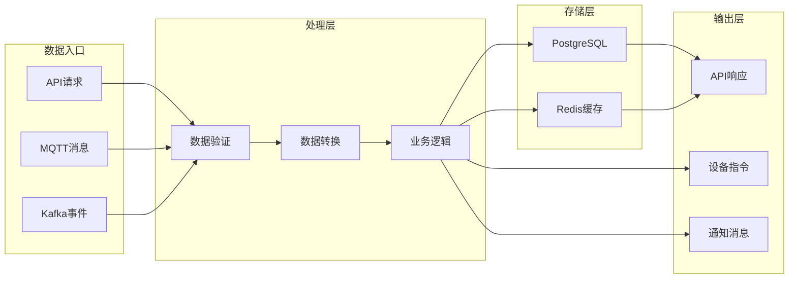
```mermaid
flowchart LR
subgraph "数据入口"
API[API请求]
MQTT[MQTT消息]
Kafka[Kafka事件]
end
subgraph "处理层"
Validation[数据验证]
Transformation[数据转换]
BusinessLogic[业务逻辑]
end
subgraph "存储层"
PostgreSQL[PostgreSQL]
Redis[Redis缓存]
end
subgraph "输出层"
Response[API响应]
DeviceCommands[设备指令]
Notifications[通知消息]
end
API --> Validation
MQTT --> Validation
Kafka --> Validation
Validation --> Transformation
Transformation --> BusinessLogic
BusinessLogic --> PostgreSQL
BusinessLogic --> Redis
PostgreSQL --> Response
Redis --> Response
BusinessLogic --> DeviceCommands
BusinessLogic --> Notifications
```

**图表来源**
- [ota_handler.go:1-200](file://inv_api_server/internal/handler/ota_handler.go#L1-L200)
- [ota_service.go:1-300](file://inv_api_server/internal/service/ota_service.go#L1-L300)

**章节来源**
- [ota_handler.go:1-200](file://inv_api_server/internal/handler/ota_handler.go#L1-L200)
- [ota_service.go:1-300](file://inv_api_server/internal/service/ota_service.go#L1-L300)

## 性能考虑

### 性能优化策略

#### 数据库优化

1. **索引优化**
   - 为常用查询字段建立复合索引
   - 优化设备状态和任务状态的查询性能
   - 使用部分索引减少存储开销

2. **查询优化**
   - 实现分页查询避免大数据集加载
   - 使用连接池管理数据库连接
   - 实施查询缓存策略

#### 缓存策略

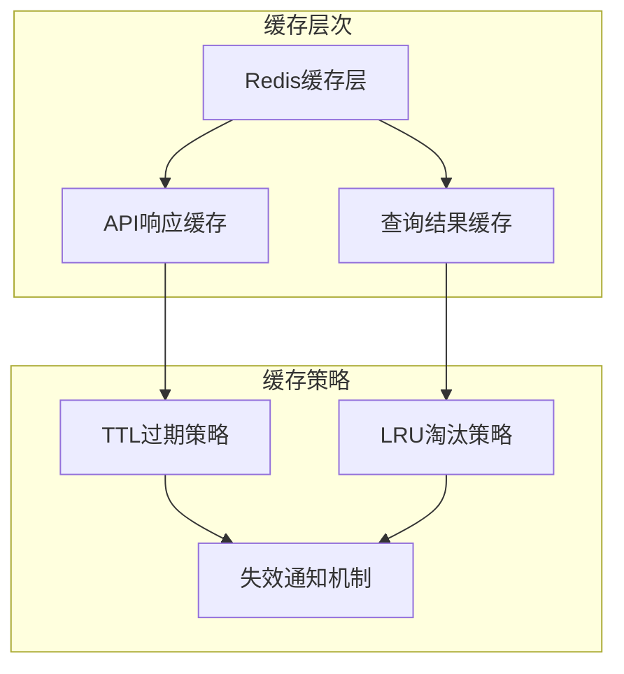
```mermaid
graph TB
subgraph "缓存层次"
REDIS[Redis缓存层]
API_CACHE[API响应缓存]
QUERY_CACHE[查询结果缓存]
end
subgraph "缓存策略"
TTL[TTL过期策略]
EVICTION[LRU淘汰策略]
INVALIDATION[失效通知机制]
end
REDIS --> API_CACHE
REDIS --> QUERY_CACHE
API_CACHE --> TTL
QUERY_CACHE --> EVICTION
TTL --> INVALIDATION
EVICTION --> INVALIDATION
```

#### 异步处理

系统采用异步处理模式提高响应性能：
- 任务执行异步化
- 设备状态更新异步化
- 通知发送异步化

### 错误处理策略

#### 错误分类和处理

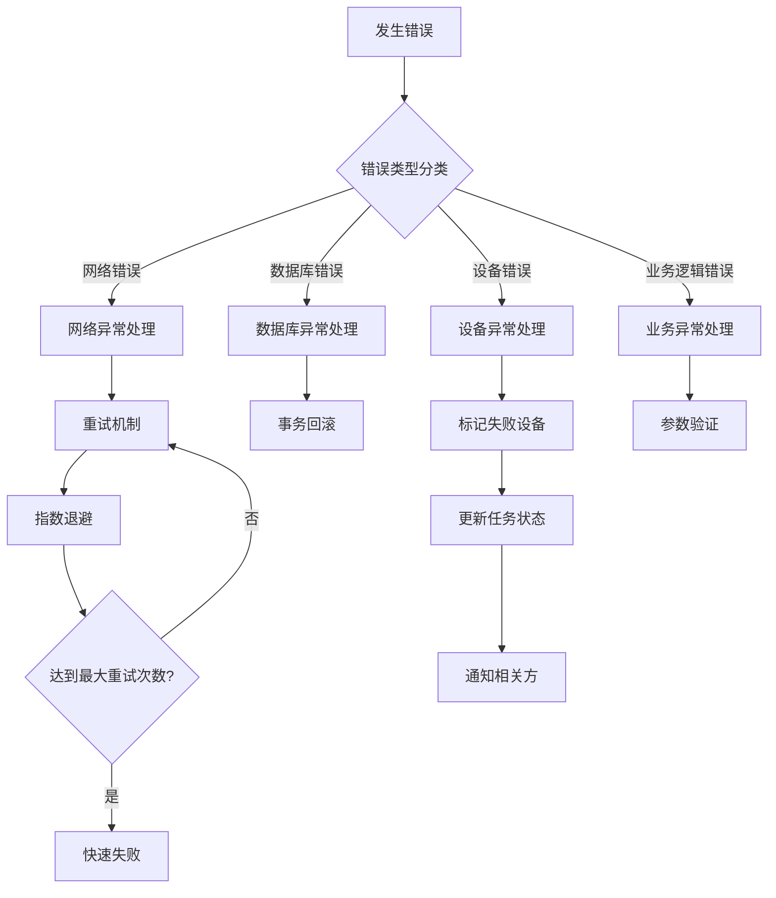
```mermaid
flowchart TD
ERROR[发生错误] --> ERROR_TYPE{错误类型分类}
ERROR_TYPE --> |网络错误| NETWORK_ERROR[网络异常处理]
ERROR_TYPE --> |数据库错误| DB_ERROR[数据库异常处理]
ERROR_TYPE --> |设备错误| DEVICE_ERROR[设备异常处理]
ERROR_TYPE --> |业务逻辑错误| BUSINESS_ERROR[业务异常处理]
NETWORK_ERROR --> RETRY[重试机制]
DB_ERROR --> ROLLBACK[事务回滚]
DEVICE_ERROR --> MARK_FAILED[标记失败设备]
BUSINESS_ERROR --> VALIDATION[参数验证]
RETRY --> BACKOFF[指数退避]
BACKOFF --> MAX_RETRY{达到最大重试次数?}
MAX_RETRY --> |是| FAIL_FAST[快速失败]
MAX_RETRY --> |否| RETRY
MARK_FAILED --> UPDATE_STATUS[更新任务状态]
UPDATE_STATUS --> NOTIFY[通知相关方]
```

**图表来源**
- [ota_service.go:1-300](file://inv_api_server/internal/service/ota_service.go#L1-L300)

#### 监控和告警

系统实施多层次监控：
- 应用性能监控（APM）
- 业务指标监控
- 设备状态监控
- 错误率监控

**章节来源**
- [ota_service.go:1-300](file://inv_api_server/internal/service/ota_service.go#L1-L300)

## 故障排除指南

### 常见问题诊断

#### 任务创建失败

**症状**: 任务创建接口返回错误
**可能原因**:
- 设备范围配置无效
- 固件信息不存在
- 权限不足
- 参数验证失败

**解决步骤**:
1. 检查设备ID格式和有效性
2. 验证固件上传状态
3. 确认用户权限
4. 查看详细的错误日志

#### 设备更新失败

**症状**: 设备长时间处于更新状态
**可能原因**:
- 网络连接不稳定
- 设备离线
- 固件包损坏
- 设备存储空间不足

**解决步骤**:
1. 检查设备在线状态
2. 验证固件完整性
3. 确认设备存储空间
4. 查看设备日志

#### 任务进度异常

**症状**: 进度统计与实际不符
**可能原因**:
- 设备上报延迟
- 网络传输问题
- 系统时间不同步
- 缓存数据不一致

**解决步骤**:
1. 检查系统时间同步
2. 清理缓存数据
3. 重新计算进度
4. 查看网络连接质量

### 调试工具和方法

#### 日志分析

系统提供详细的日志记录：
- 请求日志：记录所有API调用
- 业务日志：记录关键业务操作
- 错误日志：记录异常和错误信息
- 性能日志：记录性能指标

#### 性能分析

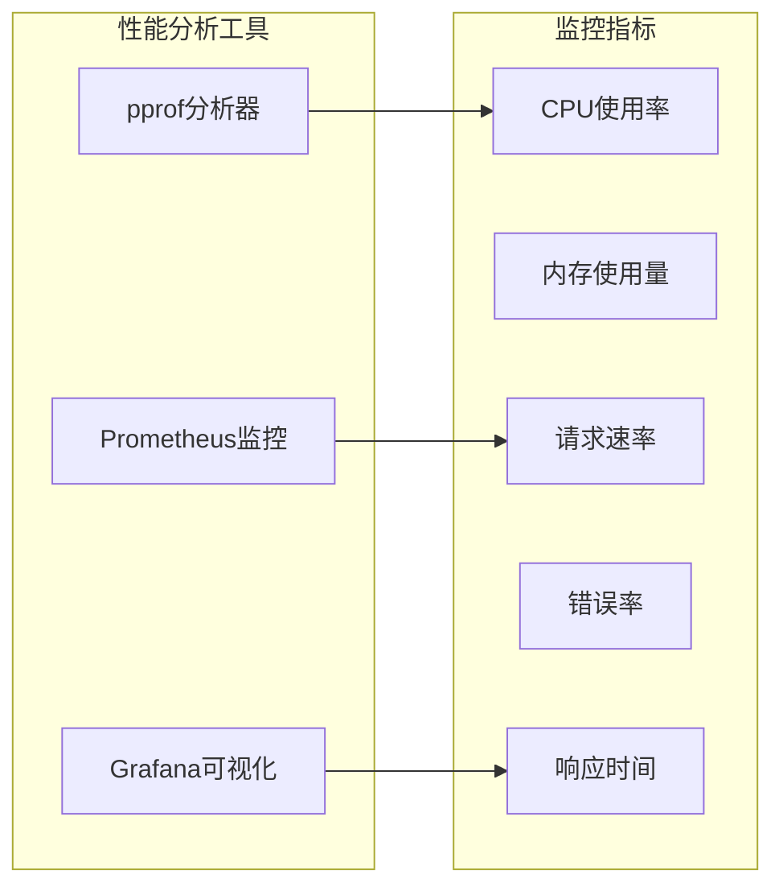
```mermaid
graph LR
subgraph "性能分析工具"
PPROF[pprof分析器]
PROMETHEUS[Prometheus监控]
GRAFANA[Grafana可视化]
end
subgraph "监控指标"
CPU[CPU使用率]
MEMORY[内存使用量]
REQUEST_RATE[请求速率]
ERROR_RATE[错误率]
RESPONSE_TIME[响应时间]
end
PPROF --> CPU
PROMETHEUS --> REQUEST_RATE
GRAFANA --> RESPONSE_TIME
```

**章节来源**
- [ota_service.go:1-300](file://inv_api_server/internal/service/ota_service.go#L1-L300)

## 结论

OTA任务调度系统是一个功能完整、架构清晰的远程固件更新解决方案。系统通过合理的分层设计、灵活的任务配置和完善的监控机制，为大规模设备固件更新提供了可靠的技术支撑。

### 主要优势

1. **架构设计合理**: 采用微服务架构，职责分离明确
2. **功能完善**: 支持复杂的任务配置和灵活的调度策略
3. **监控全面**: 提供实时的状态跟踪和进度监控
4. **扩展性强**: 模块化设计便于功能扩展和维护
5. **性能优化**: 实施多种性能优化策略确保系统稳定性

### 改进建议

1. **增强安全机制**: 添加更细粒度的权限控制
2. **优化用户体验**: 改进前端交互和报表展示
3. **提升可靠性**: 增加更多容错和自愈能力
4. **扩展支持**: 支持更多类型的设备和固件格式

该系统为工业物联网场景下的设备固件管理提供了优秀的解决方案，具有良好的实用价值和推广前景。