# OTA进度跟踪

<cite>
**本文档引用的文件**
- [README.md](file://README.md)
- [inv_api_server/internal/handler/ota_handler.go](file://inv_api_server/internal/handler/ota_handler.go)
- [inv_api_server/internal/service/ota_service.go](file://inv_api_server/internal/service/ota_service.go)
- [inv_api_server/internal/repository/ota_repository.go](file://inv_api_server/internal/repository/ota_repository.go)
- [inv_api_server/internal/repository/repositories.go](file://inv_api_server/internal/repository/repositories.go)
- [inv_api_server/internal/handler/ws_handler.go](file://inv_api_server/internal/handler/ws_handler.go)
- [inv_device_server/internal/mqtt/client.go](file://inv_device_server/internal/mqtt/client.go)
- [inv_device_server/internal/service/protocol_parser.go](file://inv_device_server/internal/service/protocol_parser.go)
- [inv_device_server/internal/model/device.go](file://inv_device_server/internal/model/device.go)
- [inv_device_server/internal/service/data_service.go](file://inv_device_server/internal/service/data_service.go)
- [inv-admin-frontend/src/pages/ota/index.tsx](file://inv-admin-frontend/src/pages/ota/index.tsx)
- [inv-admin-frontend/src/pages/portal/DeviceMonitorPage.tsx](file://inv-admin-frontend/src/pages/portal/DeviceMonitorPage.tsx)
- [tools/stress_test/main.go](file://tools/stress_test/main.go)
- [database/schema.sql](file://database/schema.sql)
- [database/migrations/006_refactor_ota_to_device_upgrades.sql](file://database/migrations/006_refactor_ota_to_device_upgrades.sql)
- [database/migrations/009_upgrade_tasks.up.sql](file://database/migrations/009_upgrade_tasks.up.sql)
- [inv-admin-frontend/src/services/otaApi.ts](file://inv-admin-frontend/src/services/otaApi.ts)
- [inv_app/lib/features/ota/presentation/bloc/ota_bloc.dart](file://inv_app/lib/features/ota/presentation/bloc/ota_bloc.dart)
- [inv_app/lib/features/ota/presentation/pages/local_ota_page.dart](file://inv_app/lib/features/ota/presentation/pages/local_ota_page.dart)
- [inv_app/lib/features/ota/presentation/bloc/ota_state.dart](file://inv_app/lib/features/ota/presentation/bloc/ota_state.dart)
- [inv_app/lib/features/ota/presentation/bloc/ota_event.dart](file://inv_app/lib/features/ota/presentation/bloc/ota_event.dart)
- [inv_app/lib/features/ota/data/repositories/ota_repository_impl.dart](file://inv_app/lib/features/ota/data/repositories/ota_repository_impl.dart)
- [inv_app/lib/features/ota/domain/repositories/ota_repository.dart](file://inv_app/lib/features/ota/domain/repositories/ota_repository.dart)
</cite>

## 更新摘要
**所做更改**
- 新增了自动升级任务状态管理的详细说明，包括后台goroutine驱动的任务生命周期推进机制
- 更新了任务状态自动提升逻辑，支持从pending/scheduled/draft到running的自动转换
- 增强了任务完成检测算法，实现了当所有设备完成升级时的自动任务完成判定
- 完善了进度统计计算的实时性保障，确保任务统计数据的准确性
- 新增了任务关联机制的详细说明，包括task_id与device_upgrades的关联关系

## 目录
1. [简介](#简介)
2. [项目结构](#项目结构)
3. [核心组件](#核心组件)
4. [架构总览](#架构总览)
5. [详细组件分析](#详细组件分析)
6. [依赖关系分析](#依赖关系分析)
7. [性能考虑](#性能考虑)
8. [故障排查指南](#故障排查指南)
9. [结论](#结论)
10. [附录](#附录)

## 简介
本文档面向OTA进度跟踪系统，系统化阐述重构后的设备级别进度跟踪算法与逻辑（总体进度、设备级别进度、完成率）、进度数据的采集与聚合机制、实时性保障（WebSocket推送与轮询）、进度数据存储结构与查询优化、异常处理策略（设备离线、进度丢失等）、可视化展示与数据导出、性能监控与优化建议，以及相关API接口与使用示例。

**更新** 系统新增了自动升级任务状态管理功能，通过后台goroutine实现任务生命周期的自动化推进，包括任务状态自动提升、进度统计实时更新和任务完成自动检测，大幅提升了系统的智能化水平和运维效率。

## 项目结构
系统采用前后端分离架构，主要模块包括：
- API网关与后端服务：负责认证、路由、OTA任务管理、进度聚合与推送
- 设备侧服务：负责MQTT连接、协议解析、OTA命令下发与状态接收
- 前端管理端：负责OTA任务管理、进度可视化与实时监控
- 数据库与缓存：持久化设备与遥测数据，支撑查询与聚合
- 工具链：压力测试、部署脚本、监控配置等

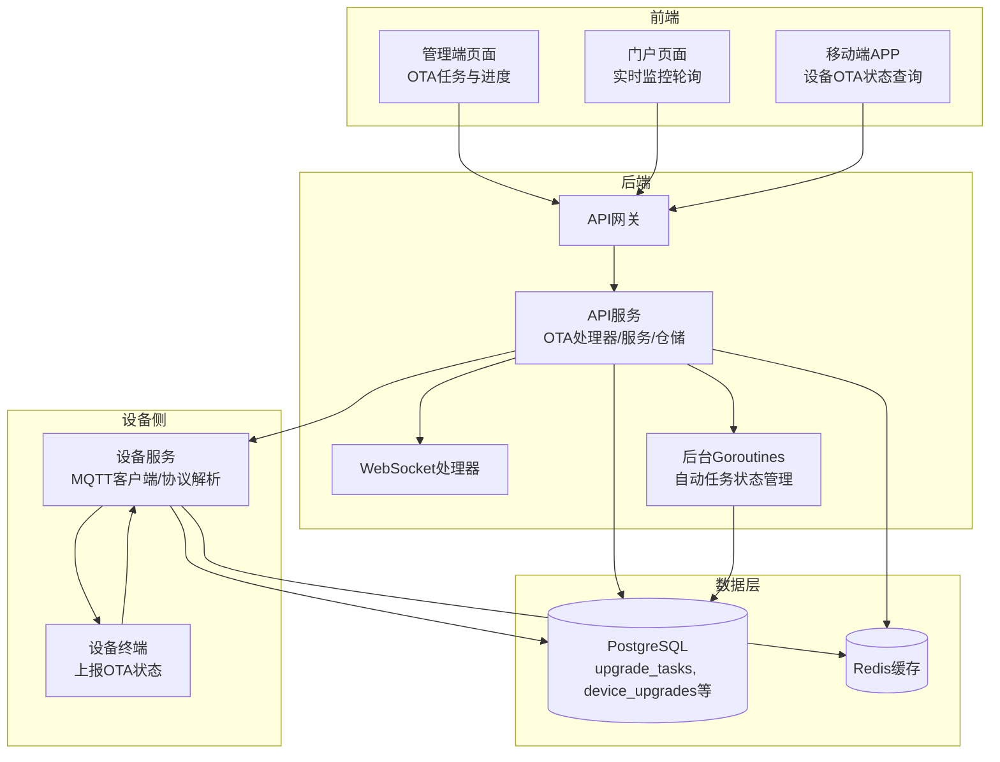

**图示来源**
- [README.md:253-342](file://README.md#L253-L342)
- [inv_api_server/internal/handler/ws_handler.go:1-61](file://inv_api_server/internal/handler/ws_handler.go#L1-L61)
- [inv_device_server/internal/mqtt/client.go:1-283](file://inv_device_server/internal/mqtt/client.go#L1-L283)
- [inv_api_server/internal/service/ota_service.go:265-307](file://inv_api_server/internal/service/ota_service.go#L265-L307)

**章节来源**
- [README.md:253-342](file://README.md#L253-L342)

## 核心组件
- OTA处理器（API层）：负责OTA任务的创建、推送、重试、取消与仪表盘查询
- OTA服务（业务层）：封装OTA命令构建、HTTP分发、并发控制与错误处理，支持版本检测和升级包管理
- OTA仓储（数据层）：负责OTA任务、设备升级记录与进度状态的持久化与查询，实现数据库事务处理
- 设备服务（设备侧）：负责MQTT连接、OTA命令下发、状态变更处理与在线状态维护
- 协议解析器（设备侧）：负责消息解包、payload解析与状态防抖，支持多种版本字段格式
- WebSocket处理器（后端）：负责实时推送与鉴权
- 后台任务管理器：负责自动任务状态管理和生命周期推进
- 前端页面：负责进度展示、操作按钮与轮询刷新
- 移动端APP：提供设备OTA状态查询和进度跟踪功能

**更新** 新增了后台任务管理器组件，专门负责自动任务状态管理，通过后台goroutine实现任务生命周期的自动化推进，包括状态提升、统计更新和完成检测等功能。

**章节来源**
- [inv_api_server/internal/handler/ota_handler.go](file://inv_api_server/internal/handler/ota_handler.go)
- [inv_api_server/internal/service/ota_service.go:1-800](file://inv_api_server/internal/service/ota_service.go#L1-L800)
- [inv_api_server/internal/repository/ota_repository.go](file://inv_api_server/internal/repository/ota_repository.go)
- [inv_device_server/internal/mqtt/client.go:1-283](file://inv_device_server/internal/mqtt/client.go#L1-L283)
- [inv_device_server/internal/service/protocol_parser.go:242-287](file://inv_device_server/internal/service/protocol_parser.go#L242-L287)
- [inv_api_server/internal/handler/ws_handler.go:1-61](file://inv_api_server/internal/handler/ws_handler.go#L1-L61)
- [inv-admin-frontend/src/pages/ota/index.tsx:674-705](file://inv-admin-frontend/src/pages/ota/index.tsx#L674-L705)
- [inv_app/lib/features/ota/presentation/bloc/ota_bloc.dart:78-120](file://inv_app/lib/features/ota/presentation/bloc/ota_bloc.dart#L78-L120)

## 架构总览
OTA进度跟踪的整体流程如下：
- 管理后台上传固件并创建升级任务
- API服务将OTA命令通过HTTP分发至设备服务
- 设备服务通过MQTT将命令推送到设备
- 设备执行升级并向设备服务上报进度状态
- 设备服务转换格式并写入数据库
- **新增** 后台goroutine自动处理任务状态管理和进度统计
- API服务聚合进度并可通过WebSocket或轮询向前端展示
- 移动端APP可直接查询设备的OTA状态

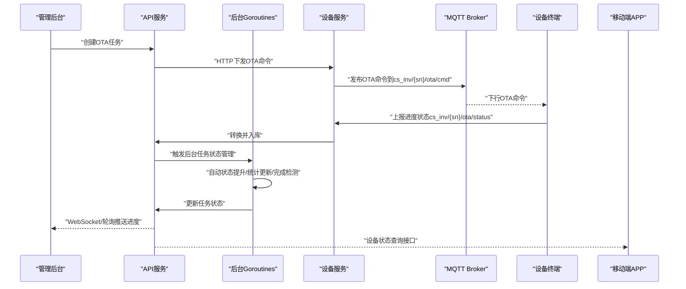

**图示来源**
- [README.md:253-342](file://README.md#L253-L342)
- [inv_api_server/internal/service/ota_service.go:185-231](file://inv_api_server/internal/service/ota_service.go#L185-L231)
- [inv_api_server/internal/service/ota_service.go:265-307](file://inv_api_server/internal/service/ota_service.go#L265-L307)
- [inv_device_server/internal/mqtt/client.go:270-283](file://inv_device_server/internal/mqtt/client.go#L270-L283)

## 详细组件分析

### 自动任务状态管理与生命周期推进
**新增** 系统实现了完整的自动任务状态管理机制，通过后台goroutine驱动任务生命周期的自动化推进：

- **任务状态自动提升**：当设备开始升级时，自动将pending/scheduled/draft状态的任务提升为running状态
- **后台goroutine处理**：使用`go func()`实现异步处理，避免阻塞主业务流程
- **任务完成自动检测**：当所有设备完成升级时，自动检测并设置任务状态为completed或partial_success
- **进度统计实时更新**：每次设备状态变化时，自动更新任务的success_count和failed_count统计

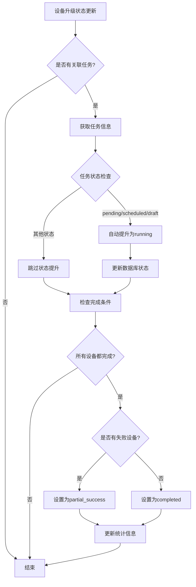

**图示来源**
- [inv_api_server/internal/service/ota_service.go:265-307](file://inv_api_server/internal/service/ota_service.go#L265-L307)
- [inv_api_server/internal/repository/ota_repository.go:1060-1095](file://inv_api_server/internal/repository/ota_repository.go#L1060-L1095)

**章节来源**
- [inv_api_server/internal/service/ota_service.go:265-307](file://inv_api_server/internal/service/ota_service.go#L265-L307)
- [inv_api_server/internal/repository/ota_repository.go:1060-1095](file://inv_api_server/internal/repository/ota_repository.go#L1060-L1095)

### 设备级别进度计算与完成率
- 总体进度：基于任务下设备总数与已完成（成功+失败）数量计算百分比
- 设备级别进度：由设备上报的progress字段反映，范围0-100
- 完成率：成功数占已处理（成功+失败）的比例
- 设备状态：pending/notifying/notified/pushing/upgrading/completed/failed/cancelled

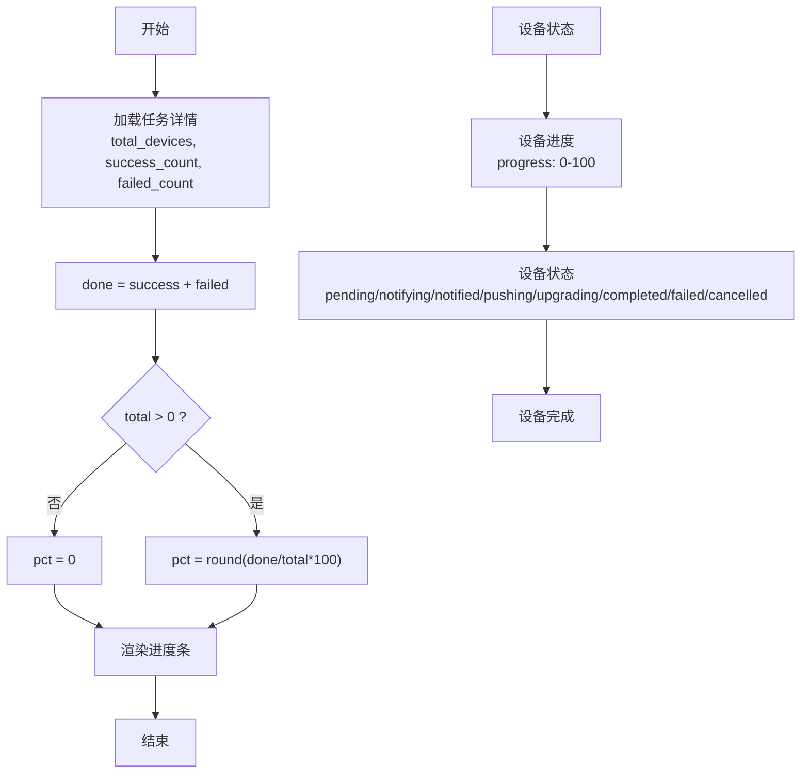

**图示来源**
- [inv-admin-frontend/src/pages/ota/index.tsx:674-705](file://inv-admin-frontend/src/pages/ota/index.tsx#L674-L705)
- [inv_app/lib/features/ota/presentation/bloc/ota_bloc.dart:78-120](file://inv_app/lib/features/ota/presentation/bloc/ota_bloc.dart#L78-L120)

**章节来源**
- [inv-admin-frontend/src/pages/ota/index.tsx:674-705](file://inv-admin-frontend/src/pages/ota/index.tsx#L674-L705)
- [inv_app/lib/features/ota/presentation/bloc/ota_bloc.dart:78-120](file://inv_app/lib/features/ota/presentation/bloc/ota_bloc.dart#L78-L120)

### 进度数据采集与聚合
- 设备上报：设备通过MQTT主题上报进度状态
- 设备服务解析：协议解析器处理payload并进行状态防抖
- 数据入库：设备服务将状态转换并写入数据库
- **新增** 后台goroutine处理：异步更新任务状态和统计信息
- API聚合：API服务从数据库聚合任务进度并提供查询接口
- 设备级别聚合：每个设备都有独立的升级记录和状态

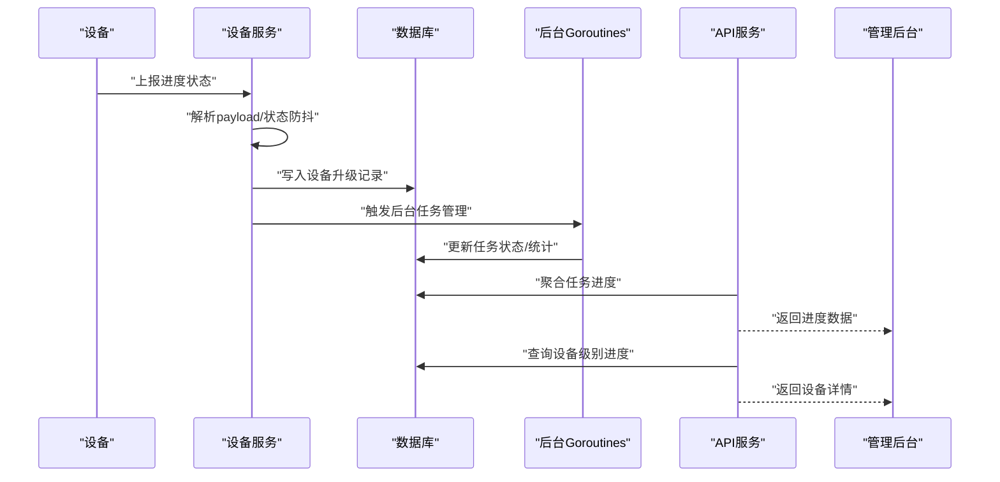

**图示来源**
- [inv_device_server/internal/service/protocol_parser.go:242-287](file://inv_device_server/internal/service/protocol_parser.go#L242-L287)
- [inv_device_server/internal/mqtt/client.go:270-283](file://inv_device_server/internal/mqtt/client.go#L270-L283)
- [inv_api_server/internal/repository/repositories.go:1111-1273](file://inv_api_server/internal/repository/repositories.go#L1111-L1273)
- [inv_api_server/internal/service/ota_service.go:265-307](file://inv_api_server/internal/service/ota_service.go#L265-L307)

**章节来源**
- [inv_device_server/internal/service/protocol_parser.go:242-287](file://inv_device_server/internal/service/protocol_parser.go#L242-L287)
- [inv_device_server/internal/mqtt/client.go:270-283](file://inv_device_server/internal/mqtt/client.go#L270-L283)
- [inv_api_server/internal/repository/repositories.go:1111-1273](file://inv_api_server/internal/repository/repositories.go#L1111-L1273)

### 实时性保障（WebSocket与轮询）
- WebSocket推送：后端建立长连接，前端订阅任务进度变化
- 轮询机制：前端定时请求后端接口以刷新进度
- 鉴权与限流：WebSocket接入需JWT校验，限制单用户并发连接数
- 设备状态轮询：移动端APP可定时轮询设备的OTA状态
- **新增** 后台异步处理：确保状态更新的实时性而不影响主流程响应

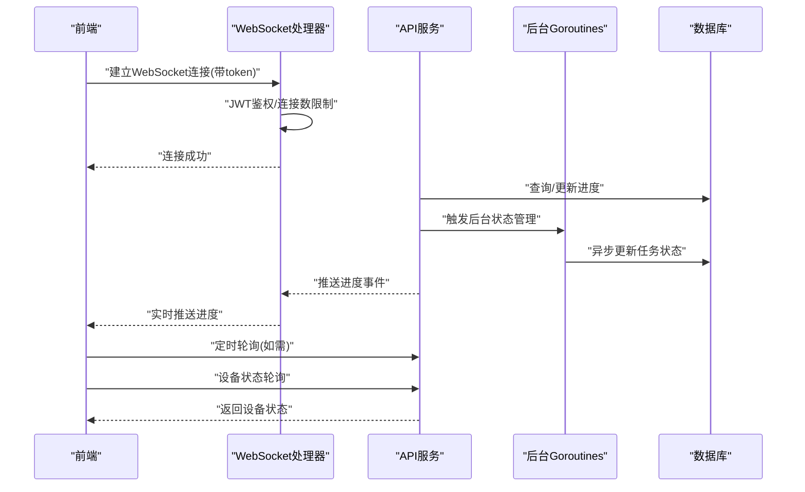

**图示来源**
- [inv_api_server/internal/handler/ws_handler.go:1-61](file://inv_api_server/internal/handler/ws_handler.go#L1-L61)
- [inv-admin-frontend/src/pages/portal/DeviceMonitorPage.tsx:61-103](file://inv-admin-frontend/src/pages/portal/DeviceMonitorPage.tsx#L61-L103)
- [inv_app/lib/features/ota/presentation/bloc/ota_bloc.dart:81-105](file://inv_app/lib/features/ota/presentation/bloc/ota_bloc.dart#L81-L105)
- [inv_api_server/internal/service/ota_service.go:265-307](file://inv_api_server/internal/service/ota_service.go#L265-L307)

**章节来源**
- [inv_api_server/internal/handler/ws_handler.go:1-61](file://inv_api_server/internal/handler/ws_handler.go#L1-L61)
- [inv-admin-frontend/src/pages/portal/DeviceMonitorPage.tsx:61-103](file://inv-admin-frontend/src/pages/portal/DeviceMonitorPage.tsx#L61-L103)
- [inv_app/lib/features/ota/presentation/bloc/ota_bloc.dart:81-105](file://inv_app/lib/features/ota/presentation/bloc/ota_bloc.dart#L81-L105)

### 存储结构与查询优化
- 关键表：upgrade_tasks（升级任务）、device_upgrades（设备升级记录）、ota_records（OTA记录）
- **新增** 任务关联：device_upgrades表新增task_id字段，支持与upgrade_tasks表的关联
- 查询优化点：按设备与时间分区、索引、按设备分组取最新记录、聚合查询
- JSON字段：支持灵活的数据结构，便于扩展

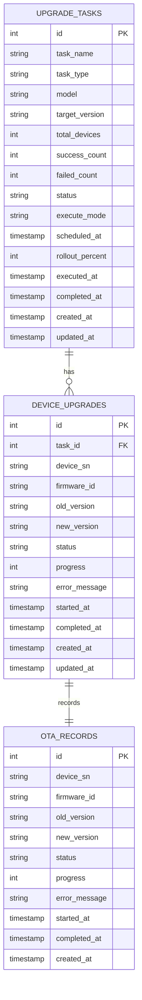

**图示来源**
- [database/migrations/006_refactor_ota_to_device_upgrades.sql](file://database/migrations/006_refactor_ota_to_device_upgrades.sql)
- [database/migrations/009_upgrade_tasks.up.sql](file://database/migrations/009_upgrade_tasks.up.sql)
- [database/数据库说明文档.html:295-325](file://database/数据库说明文档.html#L295-L325)

**章节来源**
- [database/migrations/006_refactor_ota_to_device_upgrades.sql](file://database/migrations/006_refactor_ota_to_device_upgrades.sql)
- [database/migrations/009_upgrade_tasks.up.sql](file://database/migrations/009_upgrade_tasks.up.sql)
- [database/数据库说明文档.html:295-325](file://database/数据库说明文档.html#L295-L325)
- [inv_api_server/internal/repository/repositories.go:1111-1273](file://inv_api_server/internal/repository/repositories.go#L1111-L1273)

### 异常处理与容错
- 设备离线：通过在线状态维护与超时检测，将离线设备标记为离线
- 进度丢失：通过增量上报与最终一致性保证，结合重试与取消机制
- 错误传播：设备服务在命令下发失败时记录错误并返回响应码
- 并发控制：OTA服务限制并发度，避免资源争用
- 设备状态异常：支持设备状态重置和重新上报机制
- **新增** 后台goroutine异常处理：确保后台任务管理不会阻塞主流程，异常被捕获并记录日志

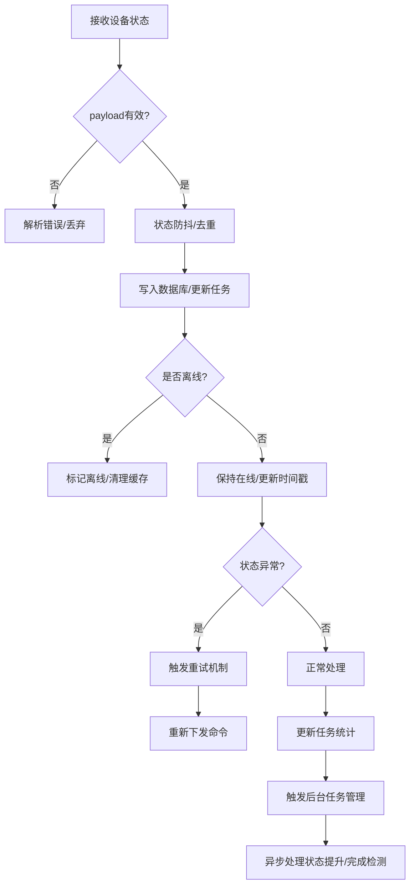

**图示来源**
- [inv_device_server/internal/service/protocol_parser.go:242-287](file://inv_device_server/internal/service/protocol_parser.go#L242-L287)
- [inv_api_server/internal/repository/repositories.go:1689-1694](file://inv_api_server/internal/repository/repositories.go#L1689-L1694)
- [inv_api_server/internal/service/ota_service.go:265-307](file://inv_api_server/internal/service/ota_service.go#L265-L307)

**章节来源**
- [inv_device_server/internal/service/protocol_parser.go:242-287](file://inv_device_server/internal/service/protocol_parser.go#L242-L287)
- [inv_api_server/internal/repository/repositories.go:1689-1694](file://inv_api_server/internal/repository/repositories.go#L1689-L1694)

### 版本检测与兼容性处理
**更新** 系统新增了增强的版本检测能力，支持多种版本字段格式的解析和兼容处理：

- **版本字段格式支持**：支持Vx.y.z格式、Va.b.c.YYYYMMDD格式等多种版本号格式
- **JSON字段解析**：通过getJSONInt和getJSONBool函数处理不同类型的JSON字段值
- **版本比较算法**：实现版本号的智能比较和升级包主版本号生成
- **设备版本查询**：支持查询设备当前各芯片版本并进行对比

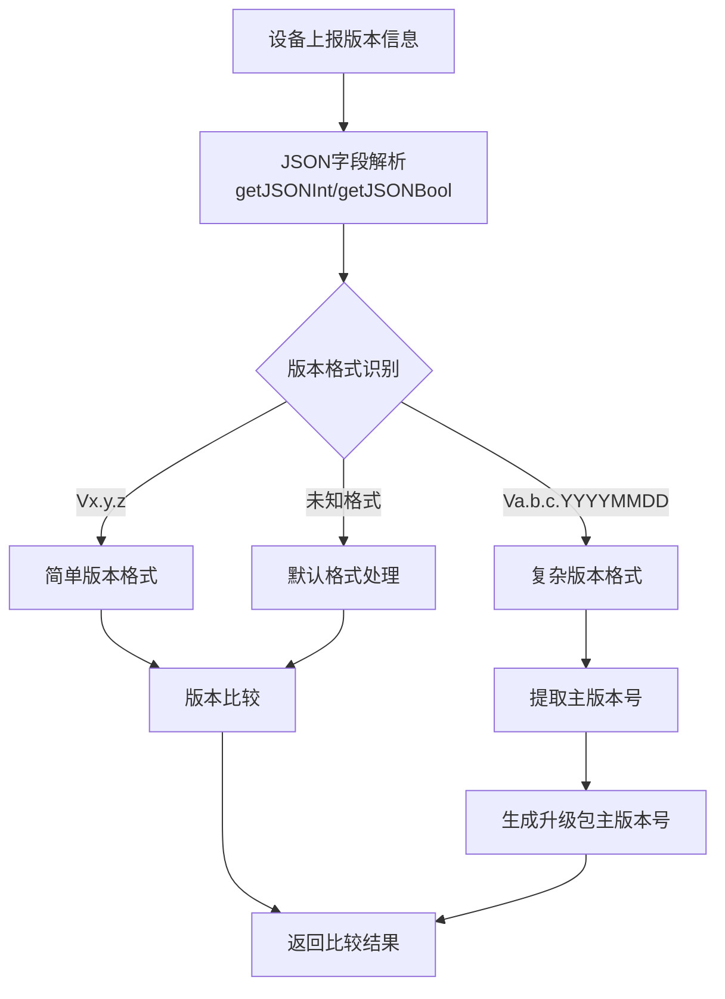

**图示来源**
- [inv_api_server/internal/repository/repositories.go:1990-2035](file://inv_api_server/internal/repository/repositories.go#L1990-L2035)
- [inv_api_server/internal/service/ota_service.go:754-793](file://inv_api_server/internal/service/ota_service.go#L754-L793)

**章节来源**
- [inv_api_server/internal/repository/repositories.go:1990-2035](file://inv_api_server/internal/repository/repositories.go#L1990-L2035)
- [inv_api_server/internal/service/ota_service.go:754-793](file://inv_api_server/internal/service/ota_service.go#L754-L793)

### 数据库事务处理增强
**更新** 系统改进了数据库事务处理机制，确保数据一致性和完整性：

- **升级包创建事务**：使用BEGIN/COMMIT/ROLLBACK确保升级包及其子项的一致性
- **应用版本管理事务**：支持应用版本的创建、回滚和恢复操作的事务保证
- **批量操作事务**：支持批量UPSERT操作的事务处理
- **错误回滚机制**：任何步骤失败都会自动回滚，保持数据一致性

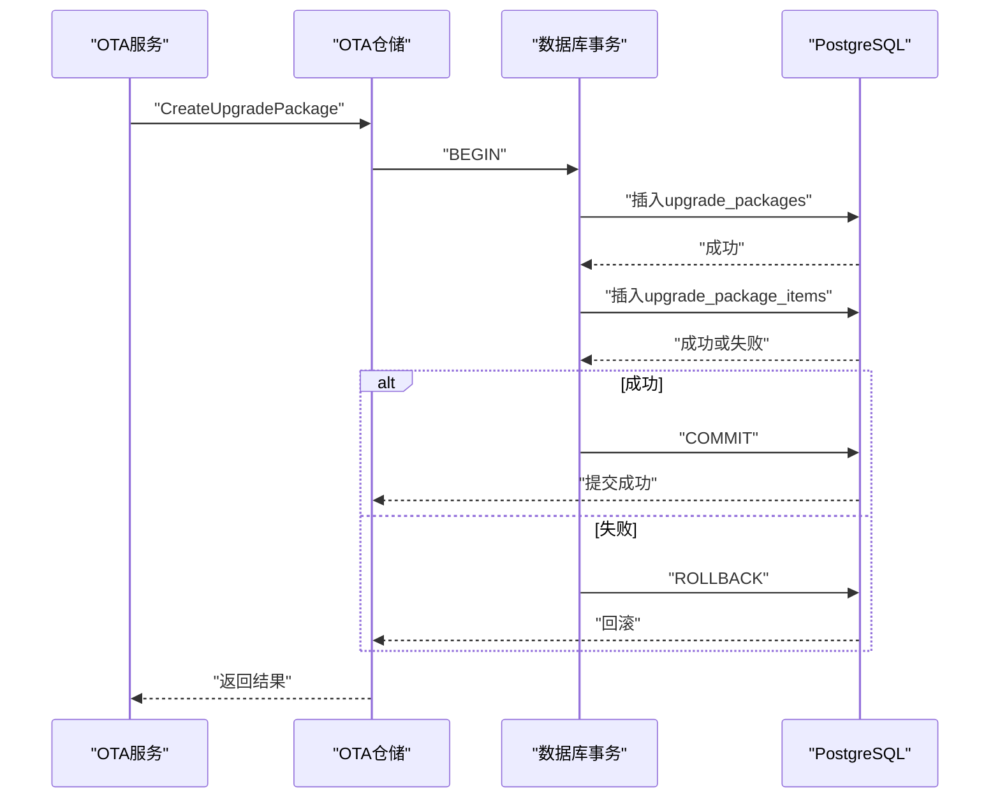

**图示来源**
- [inv_api_server/internal/repository/ota_repository.go:542-573](file://inv_api_server/internal/repository/ota_repository.go#L542-L573)
- [inv_api_server/internal/service/ota_service.go:423-431](file://inv_api_server/internal/service/ota_service.go#L423-431)

**章节来源**
- [inv_api_server/internal/repository/ota_repository.go:542-573](file://inv_api_server/internal/repository/ota_repository.go#L542-L573)
- [inv_api_server/internal/service/ota_service.go:423-431](file://inv_api_server/internal/service/ota_service.go#L423-431)

### 可视化展示与数据导出
- 管理后台：展示任务进度条、重试/取消操作入口、设备列表详情
- 门户页面：定时轮询实时数据，生成图表（如功率曲线）
- 移动端APP：提供设备OTA状态查询和进度跟踪功能
- 数据导出：可通过API接口批量拉取进度与事件数据
- **新增** 任务状态可视化：支持显示任务的自动状态变化和完成检测结果

**更新** 新增了任务状态可视化的支持，能够清晰展示任务的自动状态提升过程和完成检测结果的详细信息。

**章节来源**
- [inv-admin-frontend/src/pages/ota/index.tsx:674-705](file://inv-admin-frontend/src/pages/ota/index.tsx#L674-L705)
- [inv-admin-frontend/src/pages/portal/DeviceMonitorPage.tsx:61-103](file://inv-admin-frontend/src/pages/portal/DeviceMonitorPage.tsx#L61-L103)
- [inv_app/lib/features/ota/presentation/bloc/ota_bloc.dart:78-120](file://inv_app/lib/features/ota/presentation/bloc/ota_bloc.dart#L78-L120)

### API接口与使用示例
- OTA固件管理
  - GET /api/v1/ota/firmware
  - GET /api/v1/ota/firmware/:id
  - POST /api/v1/ota/firmware
  - DELETE /api/v1/ota/firmware/:id
- 升级任务管理
  - GET /api/v1/ota/upgrades/dashboard
  - POST /api/v1/ota/upgrades/push
  - GET /api/v1/ota/upgrades/firmware/:firmwareId
  - POST /api/v1/ota/upgrades/retry
  - POST /api/v1/ota/upgrades/cancel
  - **新增** POST /api/v1/ota/tasks（创建升级任务）
  - **新增** GET /api/v1/ota/tasks（任务列表）
  - **新增** GET /api/v1/ota/tasks/:id（任务详情）
  - **新增** POST /api/v1/ota/tasks/:id/execute（手动执行任务）
  - **新增** POST /api/v1/ota/tasks/:id/cancel（取消任务）
  - **新增** POST /api/v1/ota/tasks/:id/retry（重试失败设备）
- 设备升级管理
  - GET /api/v1/ota/upgrades/tasks/:taskId/devices
  - GET /api/v1/ota/upgrades/devices/:deviceId/status
  - POST /api/v1/ota/upgrades/devices/:deviceId/retry
- APP端接口（公开）
  - GET /api/v1/ota/tasks
  - GET /api/v1/ota/tasks/:id
  - GET /api/v1/ota/tasks/:id/devices
  - GET /api/v1/ota/devices/:deviceId/status

**更新** 新增了完整的升级任务管理API接口，支持任务的创建、执行、取消、重试等操作，以及任务状态和进度的查询功能。

**章节来源**
- [inv_api_server/cmd/main.go:548-563](file://inv_api_server/cmd/main.go#L548-L563)
- [inv-admin-frontend/src/services/otaApi.ts](file://inv-admin-frontend/src/services/otaApi.ts)
- [inv_api_server/internal/handler/ota_handler.go:800-976](file://inv_api_server/internal/handler/ota_handler.go#L800-L976)

## 依赖关系分析
- 组件耦合
  - API服务依赖仓储与Redis缓存
  - 设备服务依赖MQTT客户端与Redis
  - 前端依赖后端REST与WebSocket
  - 移动端APP依赖后端REST接口
  - **新增** 后台goroutine依赖数据库仓储进行异步状态管理
- 外部依赖
  - PostgreSQL/Redis/MQTT Broker
  - JWT鉴权与限流中间件

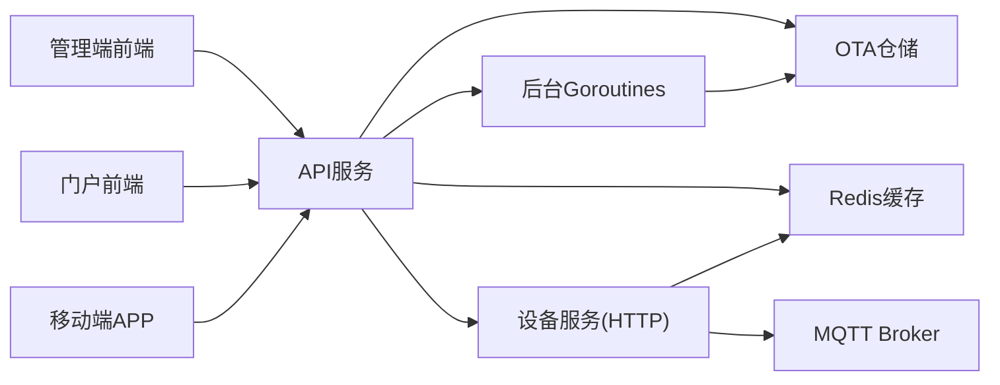

**图示来源**
- [inv_api_server/internal/service/ota_service.go:1-800](file://inv_api_server/internal/service/ota_service.go#L1-L800)
- [inv_device_server/internal/mqtt/client.go:1-283](file://inv_device_server/internal/mqtt/client.go#L1-283)
- [inv_api_server/internal/service/ota_service.go:265-307](file://inv_api_server/internal/service/ota_service.go#L265-L307)

## 性能考虑
- 并发控制：OTA服务限制并发度，避免对下游造成压力
- 缓存策略：Redis缓存在线状态与热点数据，降低数据库压力
- 查询优化：按设备与topic分组取最新记录，减少全表扫描
- 压力测试：提供压力测试工具模拟高并发上报场景
- 网络优化：WebSocket长连接减少轮询开销，必要时配合短周期轮询
- 设备级别查询：优化设备状态查询的索引和缓存策略
- **新增** 异步处理优化：后台goroutine避免阻塞主流程，提高系统响应性能
- **新增** 数据库优化：任务状态更新和统计计算的SQL查询优化

**更新** 新增了异步处理和数据库优化的性能考虑，确保后台任务管理不会影响系统的整体性能和响应速度。

**章节来源**
- [inv_api_server/internal/service/ota_service.go:32-42](file://inv_api_server/internal/service/ota_service.go#L32-L42)
- [tools/stress_test/main.go:1-97](file://tools/stress_test/main.go#L1-L97)
- [inv_api_server/internal/service/ota_service.go:265-307](file://inv_api_server/internal/service/ota_service.go#L265-L307)

## 故障排查指南
- 设备无进度：检查MQTT主题订阅、命令下发与状态上报路径
- 进度不更新：确认WebSocket连接状态与轮询间隔设置
- 离线判定异常：核查在线状态维护逻辑与超时阈值
- 数据库慢查询：审查索引与分区策略，关注按设备与topic的聚合查询
- 设备状态异常：检查设备升级记录表的状态字段和错误信息
- 移动端查询失败：验证设备状态查询接口的权限和参数
- **新增** 任务状态异常：检查后台goroutine的执行情况和数据库状态更新日志
- **新增** 自动状态提升失败：验证任务关联关系和状态提升逻辑的正确性
- **新增** 任务完成检测问题：检查设备状态汇总逻辑和完成条件判断

**更新** 新增了针对自动任务状态管理功能的故障排查指南，包括后台goroutine执行问题、任务状态提升失败和任务完成检测异常的诊断方法。

**章节来源**
- [inv_device_server/internal/service/protocol_parser.go:267-287](file://inv_device_server/internal/service/protocol_parser.go#L267-L287)
- [inv_api_server/internal/repository/repositories.go:1689-1694](file://inv_api_server/internal/repository/repositories.go#L1689-L1694)
- [inv_api_server/internal/service/ota_service.go:265-307](file://inv_api_server/internal/service/ota_service.go#L265-L307)

## 结论
本系统通过清晰的职责划分与成熟的中间件选型，实现了从任务创建、命令分发、状态上报、数据聚合到实时展示的完整闭环。重构后的设备级别跟踪提供了更精确的升级监控能力，通过合理的并发控制、缓存与查询优化，以及完善的异常处理与可视化能力，能够满足大规模设备OTA进度跟踪的需求。

**更新** 系统新增的自动任务状态管理功能进一步提升了系统的智能化水平，通过后台goroutine实现的自动化任务生命周期推进，减少了人工干预需求，提高了运维效率。自动状态提升、进度统计更新和任务完成检测等功能确保了任务状态的准确性和实时性，为大规模设备管理提供了强有力的技术支持。

## 附录
- MQTT主题规范与命令格式详见项目说明
- 前端页面与API接口路径见对应源文件
- 设备升级记录表结构和查询接口见数据库迁移文件
- **新增** 自动任务状态管理逻辑详见ota_service.go中的UpdateDeviceUpgradeStatus方法

**章节来源**
- [README.md:253-342](file://README.md#L253-L342)
- [database/migrations/006_refactor_ota_to_device_upgrades.sql](file://database/migrations/006_refactor_ota_to_device_upgrades.sql)
- [database/migrations/009_upgrade_tasks.up.sql](file://database/migrations/009_upgrade_tasks.up.sql)
- [inv_api_server/internal/service/ota_service.go:265-307](file://inv_api_server/internal/service/ota_service.go#L265-L307)