# OTA升级系统

<cite>
**本文档引用的文件**
- [ota_handler.go](file://inv_api_server/internal/handler/ota_handler.go)
- [ota_service.go](file://inv_api_server/internal/service/ota_service.go)
- [ota_repository.go](file://inv_api_server/internal/repository/ota_repository.go)
- [models.go](file://inv_api_server/internal/model/models.go)
- [ota_constants.go](file://inv_api_server/internal/model/ota_constants.go)
- [008_upgrade_packages.up.sql](file://database/migrations/008_upgrade_packages.up.sql)
- [009_upgrade_tasks.up.sql](file://database/migrations/009_upgrade_tasks.up.sql)
- [013_ota_source_and_package_enhance.up.sql](file://database/migrations/013_ota_source_and_package_enhance.up.sql)
- [client.go](file://inv_device_server/internal/mqtt/client.go)
- [data_service.go](file://inv_device_server/internal/service/data_service.go)
- [main.go](file://inv_api_server/cmd/main.go)
- [main.go](file://inv_device_server/cmd/main.go)
- [schema.sql](file://database/schema.sql)
- [ota.ts](file://inv-admin-frontend/src/locales/ota.ts)
- [local_ota_page.dart](file://inv_app/lib/features/ota/presentation/pages/local_ota_page.dart)
- [local_communication_service.dart](file://inv_app/lib/core/services/local_communication_service.dart)
- [local_firmware_service.dart](file://inv_app/lib/core/services/local_firmware_service.dart)
- [ota_error_types.dart](file://inv_app/lib/core/errors/ota_error_types.dart)
- [ota_bloc.dart](file://inv_app/lib/features/ota/presentation/bloc/ota_bloc.dart)
- [ota_state.dart](file://inv_app/lib/features/ota/presentation/bloc/ota_state.dart)
- [ota_repository.dart](file://inv_app/lib/features/ota/domain/repositories/ota_repository.dart)
- [ota_repository_impl.dart](file://inv_app/lib/features/ota/data/repositories/ota_repository_impl.dart)
- [app_router.dart](file://inv_app/lib/core/router/app_router.dart)
- [firmware_list_page.dart](file://inv_app/lib/features/ota/presentation/pages/firmware_list_page.dart)
</cite>

## 更新摘要
**所做更改**
- 新增三层OTA架构，包含升级包管理、任务跟踪和来源追踪功能
- 实现完整的升级包系统，支持用户版本化、发布策略和多芯片固件捆绑
- 增强升级任务管理系统，支持多种执行模式和灰度发布
- 完善设备端OTA程序开发指南，支持多芯片协同升级
- 优化移动端OTA升级流程，提供本地升级和进度跟踪功能

## 目录
1. [简介](#简介)
2. [项目结构](#项目结构)
3. [核心组件](#核心组件)
4. [架构概览](#架构概览)
5. [详细组件分析](#详细组件分析)
6. [三层OTA架构设计](#三层ota架构设计)
7. [升级包管理系统](#升级包管理系统)
8. [升级任务调度系统](#升级任务调度系统)
9. [来源追踪机制](#来源追踪机制)
10. [灰度发布策略](#灰度发布策略)
11. [多芯片固件捆绑](#多芯片固件捆绑)
12. [设备端OTA实现](#设备端ota实现)
13. [移动端OTA升级流程](#移动端ota升级流程)
14. [依赖关系分析](#依赖关系分析)
15. [性能考虑](#性能考虑)
16. [故障排查指南](#故障排查指南)
17. [结论](#结论)
18. [附录](#附录)

## 简介

OTA（Over-The-Air）升级系统是一个完整的固件远程升级解决方案，现已完成重大架构重构，从原有的任务驱动架构转变为三层架构：升级包管理、任务调度和来源追踪。新系统支持多设备、多固件版本的统一管理，并引入了升级包、升级任务和来源追踪等核心概念，实现了更灵活的升级策略和更强的业务控制能力。

**最新更新** 系统新增了完整的三层OTA架构，包括升级包管理系统、升级任务调度和来源追踪机制。升级包支持用户版本化、发布策略和多芯片固件捆绑，任务调度支持多种执行模式和灰度发布，来源追踪能够区分管理员推送、APP触发和本地升级等不同来源。

系统主要分为三个核心层次：
- **云端管理平台**：负责固件版本管理、升级包模板和升级任务调度
- **设备端固件**：支持ESP32、ARM、DSP、BMS四芯片架构的OTA升级
- **设备服务器**：作为MQTT代理，负责设备与云端的通信桥接

## 项目结构

该项目采用Go语言开发，采用分层架构设计，主要包含以下模块：

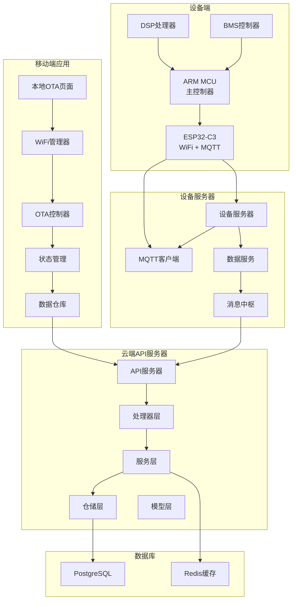

**图表来源**
- [main.go:111-193](file://inv_api_server/cmd/main.go#L111-L193)
- [main.go:300-381](file://inv_api_server/cmd/main.go#L300-L381)

## 核心组件

### 1. 三层OTA架构

系统采用三层架构设计，每层都有明确的职责分工：

#### 第一层：升级包管理
- **升级包创建**：支持多芯片固件组合打包
- **版本管理**：主版本号和用户版本号分离
- **发布策略**：支持全量、按型号、按用户、按设备的发布范围
- **内容管理**：支持用户可见的更新说明和技术变更日志

#### 第二层：任务调度
- **任务类型**：支持单固件升级和升级包升级两种模式
- **执行模式**：立即执行、定时执行、手动确认三种模式
- **灰度发布**：支持滚动百分比控制升级范围
- **状态跟踪**：完整的任务生命周期状态管理

#### 第三层：来源追踪
- **来源标识**：区分admin（管理员）、app（APP触发）、local（本地升级）
- **操作审计**：记录每个操作的发起者和时间戳
- **权限控制**：基于来源的不同权限验证
- **统计分析**：按来源统计升级成功率和失败率

**章节来源**
- [models.go:342-403](file://inv_api_server/internal/model/models.go#L342-L403)
- [ota_constants.go:1-52](file://inv_api_server/internal/model/ota_constants.go#L1-L52)

### 2. 升级包模型设计

升级包是三层架构的核心概念，支持多芯片固件的组合管理：

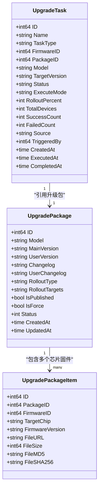

**图表来源**
- [models.go:373-403](file://inv_api_server/internal/model/models.go#L373-L403)
- [models.go:342-371](file://inv_api_server/internal/model/models.go#L342-L371)

**章节来源**
- [008_upgrade_packages.up.sql:1-50](file://database/migrations/008_upgrade_packages.up.sql#L1-L50)
- [009_upgrade_tasks.up.sql:1-37](file://database/migrations/009_upgrade_tasks.up.sql#L1-L37)

## 架构概览

### 系统整体架构

OTA系统采用微服务架构，通过MQTT协议实现设备与云端的实时通信。三层架构的设计使得系统具有更好的可扩展性和可维护性。

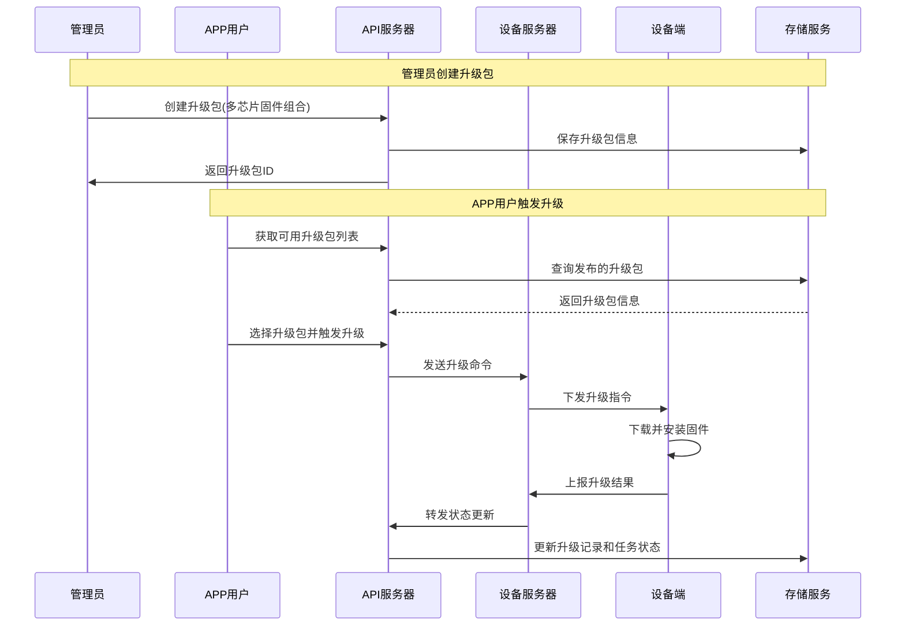

**图表来源**
- [ota_handler.go:650-789](file://inv_api_server/internal/handler/ota_handler.go#L650-L789)
- [ota_service.go:628-670](file://inv_api_server/internal/service/ota_service.go#L628-L670)

### 数据流架构

系统采用事件驱动的数据流架构，确保各组件间的松耦合和高内聚。三层架构支持升级包的完整生命周期管理和任务的精细化控制。

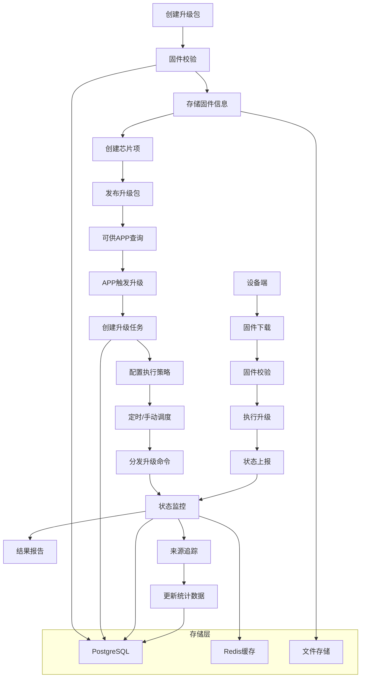

**图表来源**
- [ota_handler.go:650-789](file://inv_api_server/internal/handler/ota_handler.go#L650-L789)
- [ota_repository.go:739-789](file://inv_api_server/internal/repository/ota_repository.go#L739-L789)

## 详细组件分析

### 1. API服务器组件

API服务器是OTA系统的核心控制中心，负责业务逻辑处理和数据管理。三层架构提供了更完善的升级包、任务和来源管理接口。

#### 处理器层设计
处理器层采用职责分离原则，每个处理器专注于特定的业务领域：

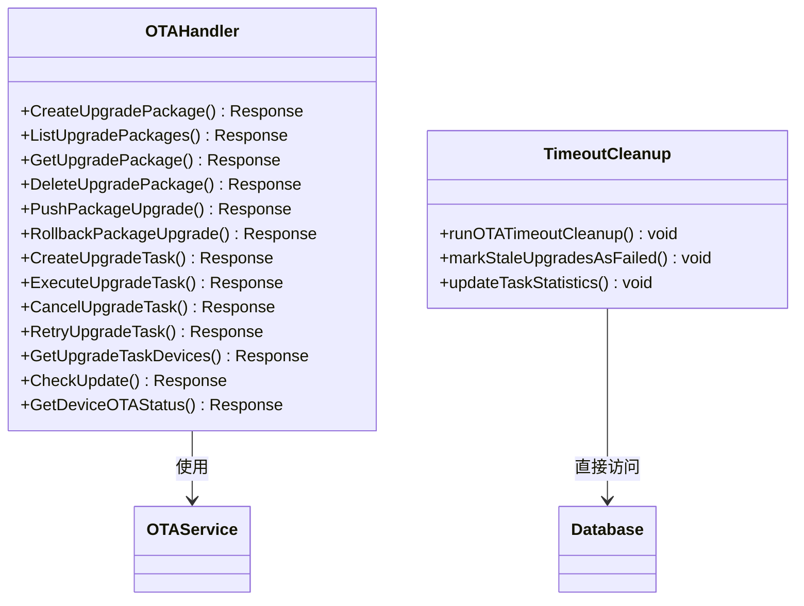

**图表来源**
- [ota_handler.go:649-839](file://inv_api_server/internal/handler/ota_handler.go#L649-L839)
- [main.go:300-381](file://inv_api_server/cmd/main.go#L300-L381)

**章节来源**
- [ota_handler.go:649-839](file://inv_api_server/internal/handler/ota_handler.go#L649-L839)

### 2. 设备服务器组件

设备服务器作为MQTT代理，负责设备与云端之间的消息路由和状态同步。三层架构增强了对升级任务状态的监控和处理能力。

#### MQTT客户端实现
设备服务器的MQTT客户端具有以下特性：
- **连接管理**：自动重连机制，确保连接稳定性
- **主题订阅**：动态订阅设备状态和OTA状态主题
- **消息转发**：将设备状态转换为API服务器可识别的格式

**章节来源**
- [client.go:136-235](file://inv_device_server/internal/mqtt/client.go#L136-L235)
- [data_service.go:204-300](file://inv_device_server/internal/service/data_service.go#L204-300)

## 三层OTA架构设计

### 1. 升级包管理层

升级包管理层是整个三层架构的基础，负责固件的组合管理和版本控制。

#### 升级包创建流程
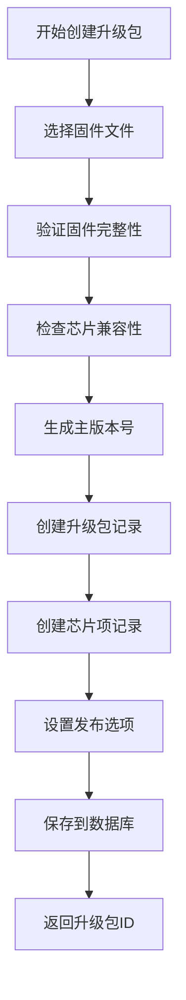

**图表来源**
- [ota_service.go:628-670](file://inv_api_server/internal/service/ota_service.go#L628-L670)

#### 版本管理策略
- **主版本号**：格式为 `Va.b.c.YYYYMMDD`，自动生成递增版本
- **用户版本号**：面向最终用户的友好版本显示
- **版本关联**：所有芯片的固件都关联到同一个主版本号

**章节来源**
- [ota_service.go:893-932](file://inv_api_server/internal/service/ota_service.go#L893-L932)

### 2. 任务调度层

任务调度层负责升级任务的创建、调度和执行控制。

#### 任务状态流转
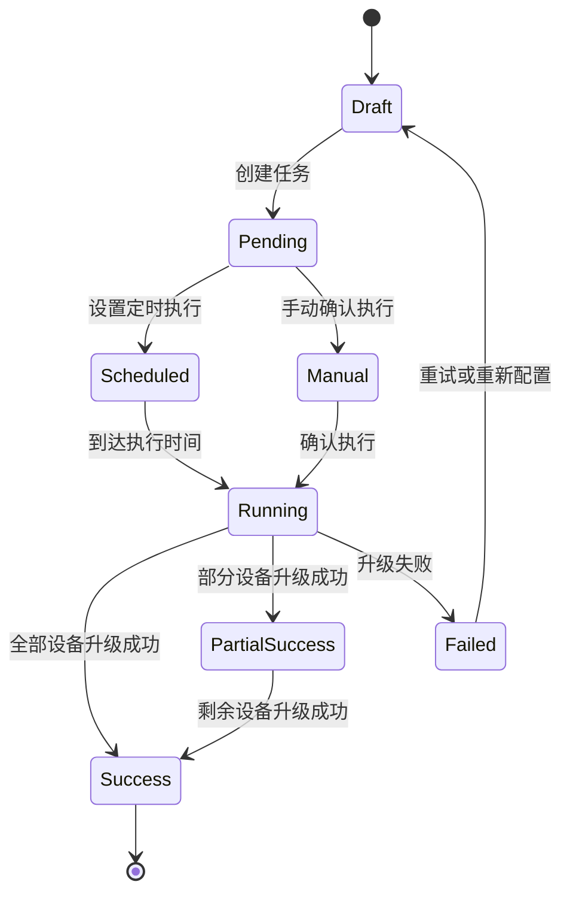

**图表来源**
- [009_upgrade_tasks.up.sql:15](file://database/migrations/009_upgrade_tasks.up.sql#L15)

**章节来源**
- [ota_handler.go:800-839](file://inv_api_server/internal/handler/ota_handler.go#L800-L839)

### 3. 来源追踪层

来源追踪层负责记录和管理不同来源的升级操作。

#### 来源类型定义
- **admin**：管理员通过后台管理系统触发的升级
- **app**：APP用户主动触发的升级
- **local**：设备本地进行的OTA升级

#### 追踪机制实现
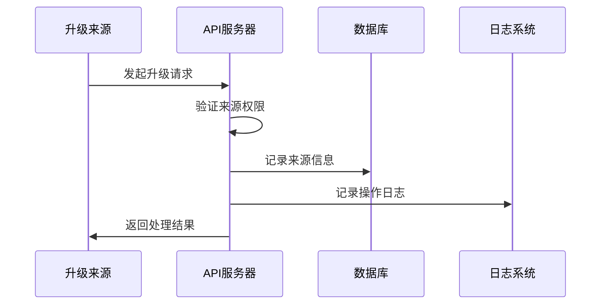

**图表来源**
- [ota_constants.go:4-8](file://inv_api_server/internal/model/ota_constants.go#L4-L8)

**章节来源**
- [ota_constants.go:1-52](file://inv_api_server/internal/model/ota_constants.go#L1-L52)

## 升级包管理系统

### 1. 升级包数据结构

升级包系统支持复杂的多芯片固件组合管理：

#### 核心字段说明
- **Model**：设备型号标识
- **MainVersion**：主版本号，系统自动生成
- **UserVersion**：用户版本号，面向最终用户显示
- **Changelog**：技术变更日志，开发者查看
- **UserChangelog**：用户更新说明，普通用户查看
- **RolloutType**：发布范围类型
- **RolloutTargets**：具体的发布目标列表
- **IsPublished**：是否已发布供APP查询

**章节来源**
- [models.go:373-390](file://inv_api_server/internal/model/models.go#L373-L390)

### 2. 芯片项管理

升级包可以包含多个芯片的固件项：

#### 芯片项结构
- **TargetChip**：目标芯片类型（arm/esp/dsp/bms）
- **FirmwareID**：关联的固件版本ID
- **FirmwareVersion**：固件版本号
- **文件信息**：包含下载URL、大小、校验值等

**章节来源**
- [models.go:392-403](file://inv_api_server/internal/model/models.go#L392-L403)

### 3. 升级包API接口

系统提供完整的RESTful API接口：

| 接口 | 方法 | 描述 | 权限 |
|------|------|------|------|
| /api/v1/ota/packages | POST | 创建升级包 | ota:create |
| /api/v1/ota/packages | GET | 获取升级包列表 | ota:view |
| /api/v1/ota/packages/:id | GET | 获取升级包详情 | ota:view |
| /api/v1/ota/packages/:id | DELETE | 删除升级包 | ota:delete |
| /api/v1/ota/tasks | POST | 创建升级任务 | ota:create |
| /api/v1/ota/tasks | GET | 获取任务列表 | ota:view |

**章节来源**
- [main.go:763-780](file://inv_api_server/cmd/main.go#L763-L780)

## 升级任务调度系统

### 1. 任务类型支持

系统支持两种任务类型：

#### 单固件升级任务
- 针对单一芯片固件的升级
- 适用于简单的固件更新场景
- 快速部署，操作简单

#### 升级包升级任务
- 支持多芯片固件的组合升级
- 保证多芯片版本的一致性
- 适合复杂的设备架构

**章节来源**
- [ota_constants.go:18-22](file://inv_api_server/internal/model/ota_constants.go#L18-L22)

### 2. 执行模式配置

系统支持三种执行模式：

#### 立即执行模式
- 任务创建后立即开始执行
- 适用于紧急修复和热更新
- 需要谨慎使用，避免影响用户体验

#### 定时执行模式
- 在指定时间自动开始执行
- 支持cron表达式配置
- 适合计划内的批量升级

#### 手动确认模式
- 等待管理员确认后执行
- 提供人工审核和控制点
- 适合重要版本的发布

**章节来源**
- [ota_constants.go:36-41](file://inv_api_server/internal/model/ota_constants.go#L36-L41)

### 3. 任务状态管理

任务状态机支持完整的生命周期管理：

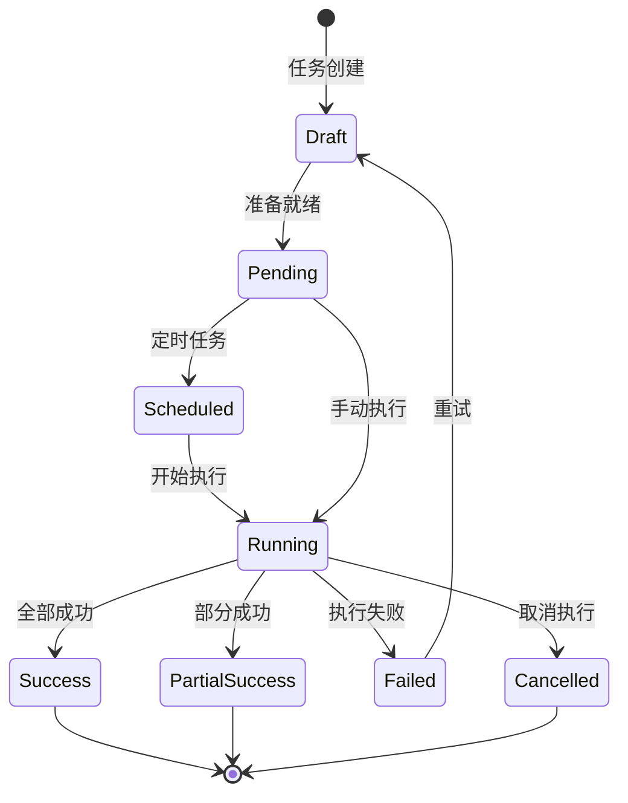

**图表来源**
- [ota_constants.go:24-34](file://inv_api_server/internal/model/ota_constants.go#L24-L34)

## 来源追踪机制

### 1. 来源类型定义

系统定义了三种不同的升级来源：

#### 管理员来源 (admin)
- 通过Web管理后台触发的升级
- 需要管理员权限验证
- 记录操作人和操作时间
- 用于审计和合规性要求

#### APP来源 (app)
- 通过移动应用触发的升级
- 支持用户主动升级
- 记录用户ID和设备信息
- 用于用户行为分析

#### 本地来源 (local)
- 设备本地进行的OTA升级
- 无需网络连接
- 主要用于调试和维护
- 限制访问范围和频率

**章节来源**
- [ota_constants.go:4-8](file://inv_api_server/internal/model/ota_constants.go#L4-L8)

### 2. 追踪实现机制

#### 数据库字段扩展
- **source**：记录升级来源类型
- **triggered_by**：记录触发者ID
- **pushed_by**：记录推送者ID
- **created_by**：记录创建者ID

#### 权限控制策略
- 管理员来源：需要admin角色权限
- APP来源：需要用户认证和授权
- 本地来源：需要设备物理接触

**章节来源**
- [models.go:316-322](file://inv_api_server/internal/model/models.go#L316-L322)

## 灰度发布策略

### 1. 发布范围控制

系统支持四种发布范围类型：

#### 全量发布 (all)
- 向所有匹配的设备发布
- 适用于稳定版本的大规模部署
- 风险较高，需谨慎使用

#### 按型号发布 (model)
- 仅向特定型号的设备发布
- 适用于型号特定的固件更新
- 提高版本管理的灵活性

#### 按用户发布 (user)
- 仅向特定用户组的设备发布
- 适用于内部测试和用户反馈收集
- 支持A/B测试场景

#### 按设备发布 (device)
- 精确控制单个设备的升级
- 适用于问题定位和个别修复
- 最精细的控制粒度

**章节来源**
- [ota_constants.go:11-16](file://inv_api_server/internal/model/ota_constants.go#L11-L16)

### 2. 滚动百分比控制

系统支持基于百分比的灰度发布：

#### 百分比计算逻辑
- 根据设备总数计算目标升级数量
- 随机选择设备进行升级
- 支持动态调整发布比例

#### 风险控制措施
- 设置最大失败率阈值
- 自动暂停失败的发布
- 支持回滚到上一个稳定版本

**章节来源**
- [models.go:353](file://inv_api_server/internal/model/models.go#L353)

## 多芯片固件捆绑

### 1. 芯片类型支持

系统支持四种芯片类型的固件管理：

#### ARM芯片
- 主控制器固件
- 负责系统管理和业务逻辑
- 通常包含操作系统和应用代码

#### ESP芯片
- WiFi通信模块固件
- 负责网络通信和MQTT协议
- 支持OTA下载和固件传输

#### DSP芯片
- 数字信号处理固件
- 负责信号处理和算法运算
- 提升设备性能和处理能力

#### BMS芯片
- 电池管理系统固件
- 负责电池监控和保护
- 确保设备安全和稳定运行

**章节来源**
- [models.go:48-51](file://inv_api_server/internal/model/models.go#L48-L51)

### 2. 固件捆绑策略

#### 版本一致性保证
- 所有芯片固件使用相同的主版本号
- 确保芯片间版本兼容性
- 支持向后兼容的版本策略

#### 升级顺序控制
- 按照依赖关系确定升级顺序
- 先升级基础芯片，再升级高级芯片
- 支持并行升级和串行升级

**章节来源**
- [008_upgrade_packages.up.sql:26-34](file://database/migrations/008_upgrade_packages.up.sql#L26-L34)

## 设备端OTA实现

### 1. 多芯片架构支持

设备端采用多芯片架构，支持独立的固件管理和升级：

#### 芯片通信协议
- **UART二进制帧协议**：芯片间通信
- **MQTT消息传输**：云端通信
- **HTTP固件下载**：大文件传输
- **I2C/SPI总线**：硬件级通信

#### 固件存储管理
- **Flash分区管理**：独立存储区
- **双备份机制**：防止升级失败
- **版本元数据**：版本信息和校验值

**章节来源**
- [设备端OTA程序开发指南.md:11-31](file://docs/设备端OTA程序开发指南.md#L11-L31)

### 2. 升级流程实现

#### 标准升级流程
1. **接收升级指令**：从云端获取升级任务
2. **固件下载**：从指定URL下载固件文件
3. **完整性校验**：验证固件文件的MD5/SHA256
4. **写入Flash**：将固件写入目标分区
5. **重启验证**：重启设备并验证新版本
6. **状态上报**：向云端上报升级结果

#### 错误处理机制
- **下载失败重试**：支持断点续传和自动重试
- **校验失败回滚**：自动恢复到旧版本
- **写入失败恢复**：使用备份分区恢复
- **超时保护**：防止长时间卡死

**章节来源**
- [设备端OTA程序开发指南.md:308-707](file://docs/设备端OTA程序开发指南.md#L308-L707)

## 移动端OTA升级流程

### 1. 本地OTA页面实现

移动端应用实现了完整的本地OTA升级功能：

#### 页面状态流程
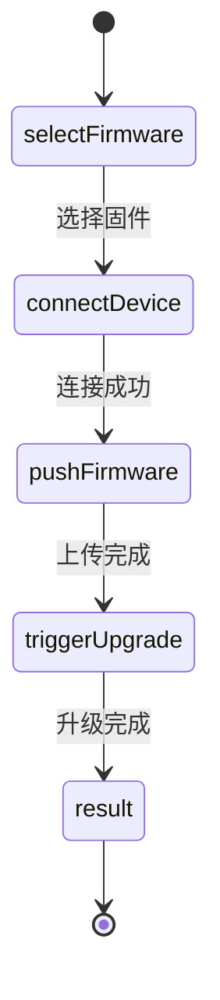

**图表来源**
- [local_ota_page.dart:18-24](file://inv_app/lib/features/ota/presentation/pages/local_ota_page.dart#L18-L24)

#### WiFi自动连接机制
- **自动扫描**：自动查找设备热点
- **权限管理**：位置权限和服务启用检查
- **连接重试**：失败时自动重试和错误提示
- **强制WiFi使用**：确保升级过程使用WiFi

**章节来源**
- [local_ota_page.dart:130-224](file://inv_app/lib/features/ota/presentation/pages/local_ota_page.dart#L130-L224)

### 2. 设备连接异常处理

#### 异常处理机制
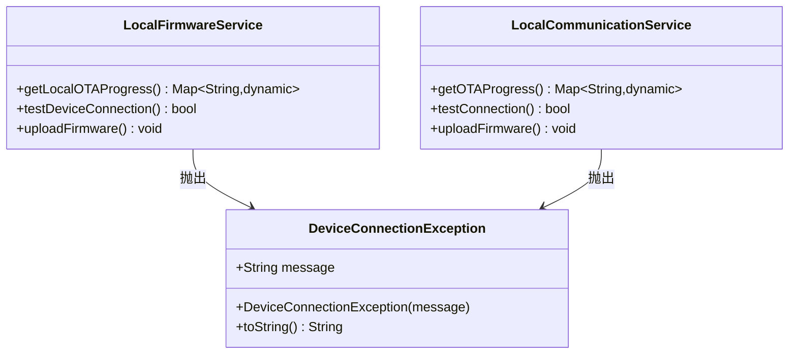

**图表来源**
- [ota_error_types.dart:2-7](file://inv_app/lib/core/errors/ota_error_types.dart#L2-L7)

**章节来源**
- [ota_error_types.dart:1-8](file://inv_app/lib/core/errors/ota_error_types.dart#L1-L8)

### 3. 统一的ESP/ARM升级逻辑

#### 升级方式对比
| 特性 | ESP升级 | ARM升级 |
|------|---------|---------|
| 上传方式 | octet-stream二进制 | multipart表单 |
| 目标标识 | 直接上传 | target=arm参数 |
| 重启行为 | 设备重启 | 不重启 |
| 进度获取 | NVS持久化 | 实时HTTP轮询 |
| 状态返回 | 重启后首次请求 | 实时状态 |

**章节来源**
- [local_communication_service.dart:138-157](file://inv_app/lib/core/services/local_communication_service.dart#L138-L157)

### 4. 改进的轮询机制

#### 轮询策略
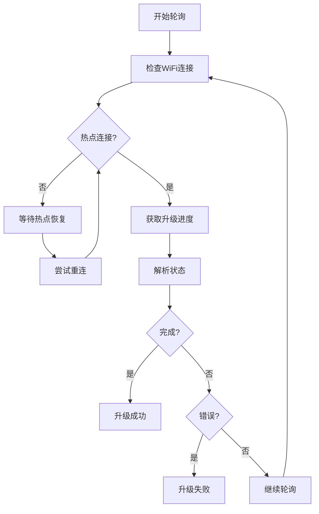

**图表来源**
- [local_ota_page.dart:459-585](file://inv_app/lib/features/ota/presentation/pages/local_ota_page.dart#L459-585)

**章节来源**
- [local_ota_page.dart:462-585](file://inv_app/lib/features/ota/presentation/pages/local_ota_page.dart#L462-585)

## 依赖关系分析

### 1. 技术栈依赖

系统采用现代化的技术栈，确保高性能和可维护性：

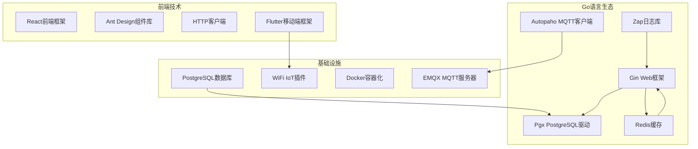

**图表来源**
- [main.go:24-27](file://inv_api_server/cmd/main.go#L24-L27)
- [main.go:22-26](file://inv_device_server/cmd/main.go#L22-L26)

### 2. 组件间依赖

系统采用清晰的依赖层次结构，避免循环依赖。三层架构增强了升级包、升级任务和来源追踪之间的关联关系。

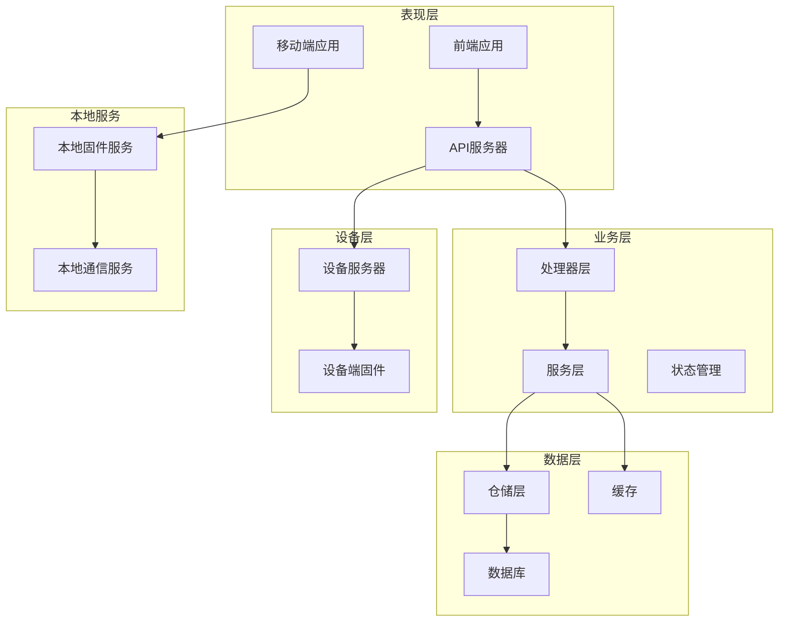

**图表来源**
- [main.go:121-133](file://inv_api_server/cmd/main.go#L121-L133)
- [main.go:112-127](file://inv_device_server/cmd/main.go#L112-127)

**章节来源**
- [main.go:121-133](file://inv_api_server/cmd/main.go#L121-L133)
- [main.go:112-127](file://inv_device_server/cmd/main.go#L112-127)

## 性能考虑

### 1. 并发控制

系统采用信号量机制控制并发升级数量，防止资源竞争。三层架构通过升级任务的执行策略更好地控制并发度。

**章节来源**
- [ota_service.go:134-142](file://inv_api_server/internal/service/ota_service.go#L134-L142)

### 2. 缓存策略

利用Redis缓存设备在线状态和实时数据，提高响应速度。升级包和任务的状态信息也通过缓存进行优化。

**章节来源**
- [client.go:69-94](file://inv_device_server/internal/mqtt/client.go#L69-L94)
- [data_service.go:77-91](file://inv_device_server/internal/service/data_service.go#L77-L91)

### 3. 数据库优化

通过合理的索引设计和查询优化，确保大规模设备场景下的性能表现。新增的升级包和任务表都包含了必要的索引优化。

**章节来源**
- [008_upgrade_packages.up.sql:21-23](file://database/migrations/008_upgrade_packages.up.sql#L21-L23)
- [009_upgrade_tasks.up.sql:29-32](file://database/migrations/009_upgrade_tasks.up.sql#L29-L32)

### 4. 移动端性能优化

移动端OTA升级实现了多项性能优化措施：
- **WiFi强制使用**：确保升级过程使用稳定的WiFi连接
- **智能重连**：自动检测和恢复WiFi连接
- **进度缓存**：避免频繁的HTTP请求
- **超时控制**：3分钟总超时保护
- **智能轮询**：优化轮询间隔和超时处理

**章节来源**
- [local_ota_page.dart:283-290](file://inv_app/lib/features/ota/presentation/pages/local_ota_page.dart#L283-L290)
- [local_ota_page.dart:467-470](file://inv_app/lib/features/ota/presentation/pages/local_ota_page.dart#L467-L470)

## 故障排查指南

### 1. 常见问题诊断

#### 升级包相关问题
- **创建失败**：检查固件文件完整性和芯片兼容性
- **发布失败**：验证发布策略和目标设备范围
- **查询失败**：确认数据库连接和权限配置

#### 任务调度问题
- **执行失败**：检查设备在线状态和网络连接
- **状态不同步**：验证MQTT连接和消息队列
- **超时问题**：调整超时配置和重试策略

#### 来源追踪问题
- **权限拒绝**：检查用户权限和来源验证
- **记录丢失**：确认数据库写入和事务处理
- **统计异常**：验证数据来源和计算逻辑

#### 多芯片升级问题
- **版本不一致**：检查芯片间版本兼容性
- **升级顺序错误**：验证依赖关系和升级策略
- **通信失败**：检查芯片间通信协议和连接

#### 移动端OTA问题
- **WiFi连接失败**：检查设备热点和权限配置
- **固件上传失败**：验证文件大小和格式
- **进度停滞**：检查轮询机制和超时设置

**章节来源**
- [ota_handler.go:649-839](file://inv_api_server/internal/handler/ota_handler.go#L649-L839)
- [local_ota_page.dart:587-613](file://inv_app/lib/features/ota/presentation/pages/local_ota_page.dart#L587-L613)

### 2. 日志分析

系统提供了详细的日志记录机制，便于问题定位和性能分析。三层架构增加了升级包、任务和来源相关的日志记录。

**章节来源**
- [client.go:152-214](file://inv_device_server/internal/mqtt/client.go#L152-L214)
- [data_service.go:272-299](file://inv_device_server/internal/service/data_service.go#L272-L299)

### 3. 移动端调试技巧

- **WiFi状态检查**：使用getSSID()确认当前连接的热点
- **连接测试**：通过/test接口验证设备可达性
- **进度监控**：观察OTA进度的实时变化
- **异常捕获**：注意DeviceConnectionException的特殊处理
- **轮询调试**：检查轮询间隔和超时设置

**章节来源**
- [local_ota_page.dart:265-281](file://inv_app/lib/features/ota/presentation/pages/local_ota_page.dart#L265-L281)
- [local_communication_service.dart:414-449](file://inv_app/lib/core/services/local_communication_service.dart#L414-L449)

## 结论

OTA升级系统经过重大架构重构，从原有的任务驱动架构转变为三层架构：升级包管理、任务调度和来源追踪。新系统支持多设备、多固件版本的统一管理，并引入了升级包、升级任务和来源追踪等核心概念，实现了更灵活的升级策略和更强的业务控制能力。

### 主要优势
- **完整的生命周期管理**：从升级包创建到任务执行的全流程自动化
- **灵活的执行策略**：支持立即、定时和手动三种执行模式
- **强大的监控能力**：实时状态跟踪和异常处理机制
- **高可用性设计**：自动重连、并发控制和故障恢复
- **灰度发布支持**：通过滚动百分比实现渐进式升级
- **移动端本地升级**：提供完整的本地OTA升级体验
- **智能WiFi管理**：自动热点扫描和连接重试机制
- **统一升级逻辑**：ESP和ARM的统一处理接口
- **WiFi断开处理**：完善的断网检测和恢复机制
- **性能优化**：智能轮询和超时控制
- **版本检测改进**：多源版本获取和兼容性处理
- **异常处理增强**：专门的异常类型和用户提示
- **自动状态协调**：无需设备主动上报即可完成升级状态验证
- **多芯片支持**：ARM、ESP、DSP、BMS四芯片协同升级
- **级联升级机制**：升级包模式下自动触发下一芯片升级
- **双层次超时检测**：周期性清理和实时检查相结合
- **资源管理优化**：适当的数据库连接处理和错误恢复
- **三层架构设计**：清晰的职责分离和模块化设计
- **来源追踪机制**：完整的操作审计和权限控制
- **用户版本管理**：面向最终用户的友好版本显示
- **发布策略控制**：灵活的目标设备选择和灰度发布

### 技术特点
- 基于MQTT协议的实时通信
- 响应式Web界面和RESTful API
- 完善的权限管理和审计日志
- 可扩展的微服务架构
- 支持升级包模板和任务级别的精细化控制
- 移动端原生应用支持
- 智能WiFi连接管理
- 统一的设备连接异常处理
- 智能轮询和超时控制
- 多源版本检测机制
- 自动升级状态协调和验证
- 多芯片类型版本匹配和级联升级
- 完善的错误处理和日志记录
- **双层次超时检测机制**：周期性清理和实时检查相结合
- **自动超时清理**：自动标记卡住的升级任务为失败状态
- **增强的资源管理**：适当的数据库连接处理和错误恢复
- **三层OTA架构**：升级包管理、任务调度和来源追踪
- **完整的来源追踪**：admin/app/local三种来源类型
- **灵活的发布策略**：全量、按型号、按用户、按设备发布
- **多芯片固件捆绑**：支持ARM、ESP、DSP、BMS协同升级
- **用户版本管理**：主版本号和用户版本号分离
- **灰度发布支持**：滚动百分比控制升级范围

该系统为设备厂商提供了标准化的OTA集成方案，支持快速部署和后续功能扩展，特别适合需要复杂升级策略和精细控制的企业级应用场景。三层架构的设计进一步提升了系统的可扩展性和可维护性，来源追踪机制增强了系统的可审计性和安全性，多芯片固件捆绑支持满足了复杂设备架构的需求，为用户版本管理提供了更好的用户体验。

## 附录

### 1. API接口文档

系统提供了完整的API接口，支持固件管理、升级包管理、升级任务控制和状态查询等功能。

### 2. 集成指南

设备厂商可以按照以下步骤集成OTA功能：
1. 部署API服务器和设备服务器
2. 配置MQTT服务器和数据库连接
3. 在设备端实现OTA升级逻辑
4. 集成到现有的设备管理系统中
5. 开发移动端应用支持本地OTA升级

### 3. 测试验证方法

建议采用以下测试方法验证系统功能：
- 单元测试：针对核心业务逻辑的单元测试
- 集成测试：验证组件间的交互和数据一致性
- 性能测试：模拟大量设备同时升级的场景
- 回归测试：确保功能变更不影响现有功能
- 灰度测试：验证滚动升级策略的有效性
- 移动端测试：验证WiFi连接和OTA升级流程
- 异常测试：验证设备连接异常和重连机制
- WiFi断开测试：验证断网检测和恢复机制
- 超时测试：验证超时控制和异常处理
- 自动协调测试：验证设备上报时的自动状态协调
- 多芯片测试：验证ARM、ESP、DSP、BMS的协同升级
- 级联升级测试：验证升级包模式的链式升级触发
- 三层架构测试：验证升级包、任务和来源追踪的完整性
- 发布策略测试：验证不同发布范围的准确性
- 来源追踪测试：验证操作审计和权限控制

### 4. 移动端开发指南

开发者可以参考以下步骤实现移动端OTA功能：
1. 集成WiFi IoT插件进行热点扫描和连接
2. 实现自动WiFi连接和重连逻辑
3. 开发固件下载和上传功能
4. 实现统一的升级进度轮询机制
5. 添加设备连接异常处理
6. 设计友好的用户界面和状态反馈
7. 实现智能轮询和超时控制
8. 集成版本检测和状态同步机制
9. 支持升级包选择和版本显示
10. 实现来源追踪和用户权限控制