# OTA升级系统

<cite>
**本文档引用的文件**
- [设备端OTA程序开发指南.md](file://docs/设备端OTA程序开发指南.md)
- [ota_handler.go](file://inv_api_server/internal/handler/ota_handler.go)
- [ota_service.go](file://inv_api_server/internal/service/ota_service.go)
- [ota_repository.go](file://inv_api_server/internal/repository/ota_repository.go)
- [models.go](file://inv_api_server/internal/model/models.go)
- [client.go](file://inv_device_server/internal/mqtt/client.go)
- [data_service.go](file://inv_device_server/internal/service/data_service.go)
- [main.go](file://inv_api_server/cmd/main.go)
- [main.go](file://inv_device_server/cmd/main.go)
- [schema.sql](file://database/schema.sql)
- [006_refactor_ota_to_device_upgrades.sql](file://database/migrations/006_refactor_ota_to_device_upgrades.sql)
- [008_upgrade_packages.up.sql](file://database/migrations/008_upgrade_packages.up.sql)
- [009_upgrade_tasks.up.sql](file://database/migrations/009_upgrade_tasks.up.sql)
- [ota.ts](file://inv-admin-frontend/src/locales/ota.ts)
</cite>

## 更新摘要
**所做更改**
- 更新了OTA系统架构，从任务驱动架构重构为设备升级架构
- 新增了upgrade_tasks、upgrade_packages等核心概念
- 更新了固件管理系统的数据模型和业务流程
- 增强了批量升级和灰度发布的功能支持
- 完善了升级任务的状态管理和执行策略

## 目录
1. [简介](#简介)
2. [项目结构](#项目结构)
3. [核心组件](#核心组件)
4. [架构概览](#架构概览)
5. [详细组件分析](#详细组件分析)
6. [依赖关系分析](#依赖关系分析)
7. [性能考虑](#性能考虑)
8. [故障排查指南](#故障排查指南)
9. [结论](#结论)
10. [附录](#附录)

## 简介

OTA（Over-The-Air）升级系统是一个完整的固件远程升级解决方案，现已完成重大架构重构，从原有的任务驱动架构转变为设备升级架构。新系统支持多设备、多固件版本的统一管理，并引入了升级包和升级任务等核心概念，实现了更灵活的升级策略和更强的业务控制能力。

系统主要分为三个核心部分：
- **云端管理平台**：负责固件版本管理、升级包模板和升级任务调度
- **设备端固件**：支持ESP32和ARM双芯片架构的OTA升级
- **设备服务器**：作为MQTT代理，负责设备与云端的通信桥接

**更新** 重大架构重构，引入升级包和升级任务概念，增强批量升级和灰度发布能力

## 项目结构

该项目采用Go语言开发，采用分层架构设计，主要包含以下模块：

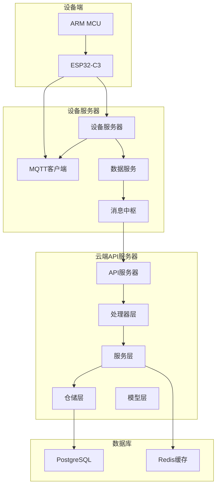

**图表来源**
- [main.go:88-163](file://inv_api_server/cmd/main.go#L88-L163)
- [main.go:34-127](file://inv_device_server/cmd/main.go#L34-L127)

**章节来源**
- [main.go:88-163](file://inv_api_server/cmd/main.go#L88-L163)
- [main.go:34-127](file://inv_device_server/cmd/main.go#L34-L127)

## 核心组件

### 1. 升级包管理系统

升级包管理是OTA系统重构后的新核心功能，负责固件包的创建、模板化和分发。

#### 升级包模型
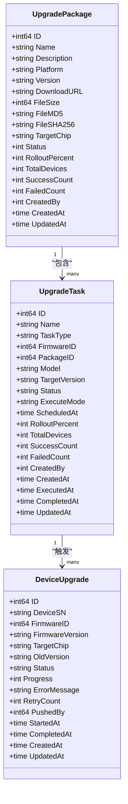

**图表来源**
- [008_upgrade_packages.up.sql:1-28](file://database/migrations/008_upgrade_packages.up.sql#L1-L28)
- [009_upgrade_tasks.up.sql:1-28](file://database/migrations/009_upgrade_tasks.up.sql#L1-L28)
- [006_refactor_ota_to_device_upgrades.sql:1-31](file://database/migrations/006_refactor_ota_to_device_upgrades.sql#L1-L31)

#### 升级包类型
系统支持两种升级包类型：
- **单固件升级包**：针对单一固件版本的升级包
- **多固件升级包**：包含多个固件版本的复合升级包

**章节来源**
- [008_upgrade_packages.up.sql:1-28](file://database/migrations/008_upgrade_packages.up.sql#L1-L28)
- [009_upgrade_tasks.up.sql:1-28](file://database/migrations/009_upgrade_tasks.up.sql#L1-L28)

### 2. 升级任务调度系统

升级任务调度系统实现了从任务创建到执行完成的全生命周期管理，支持多种执行模式。

#### 任务状态流转
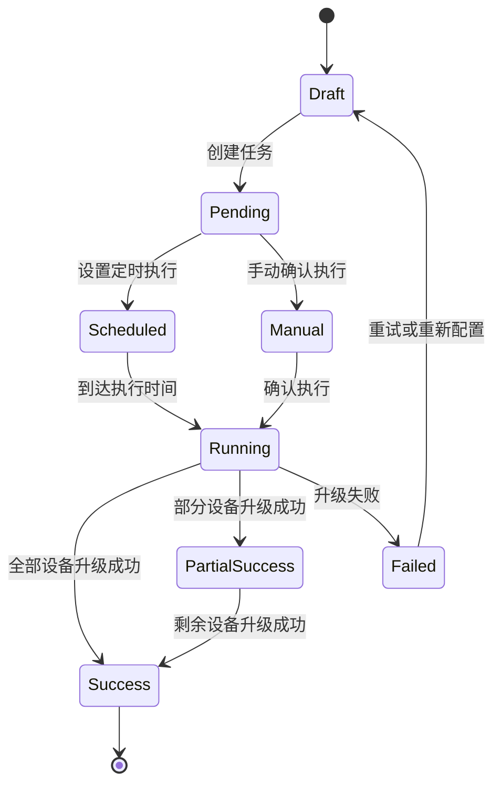

**图表来源**
- [009_upgrade_tasks.up.sql:15](file://database/migrations/009_upgrade_tasks.up.sql#L15)

#### 执行策略
系统支持三种执行模式：
- **立即执行**：创建任务后立即开始升级
- **定时执行**：在指定时间自动开始升级
- **手动确认**：等待管理员确认后再执行

**章节来源**
- [009_upgrade_tasks.up.sql:16](file://database/migrations/009_upgrade_tasks.up.sql#L16)
- [ota.ts:526-532](file://inv-admin-frontend/src/locales/ota.ts#L526-L532)

### 3. 设备端OTA实现

设备端采用双芯片架构，支持ESP32和ARM的独立升级。

#### 设备端架构
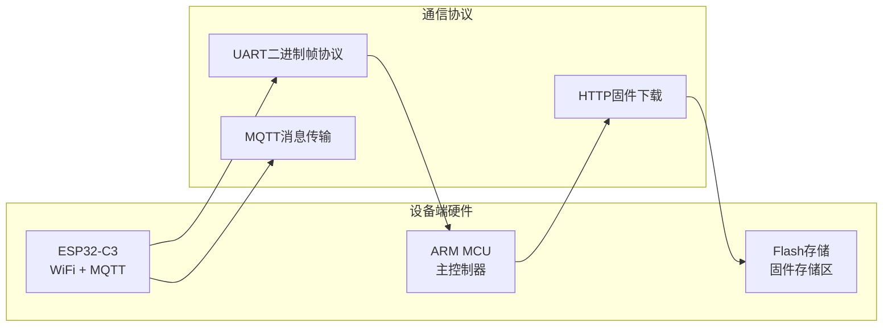

**图表来源**
- [设备端OTA程序开发指南.md:11-31](file://docs/设备端OTA程序开发指南.md#L11-L31)

**章节来源**
- [设备端OTA程序开发指南.md:1-800](file://docs/设备端OTA程序开发指南.md#L1-L800)

## 架构概览

### 系统整体架构

OTA系统采用微服务架构，通过MQTT协议实现设备与云端的实时通信。重构后的架构引入了升级包和升级任务的概念，实现了更灵活的升级管理。

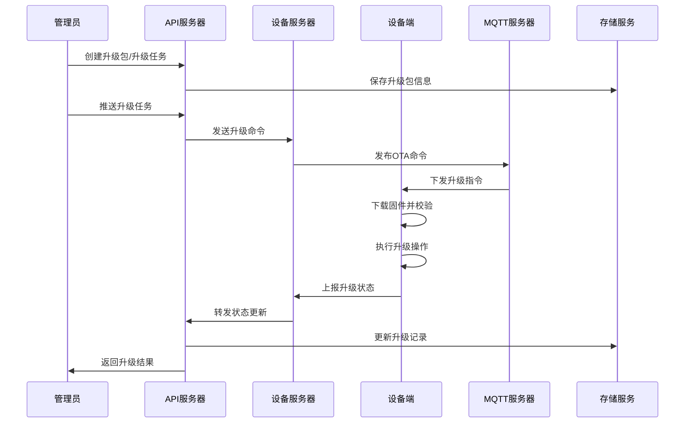

**图表来源**
- [ota_service.go:118-181](file://inv_api_server/internal/service/ota_service.go#L118-L181)
- [client.go:248-317](file://inv_device_server/internal/mqtt/client.go#L248-L317)

### 数据流架构

系统采用事件驱动的数据流架构，确保各组件间的松耦合和高内聚。重构后的架构支持升级包模板和任务级别的精细化控制。

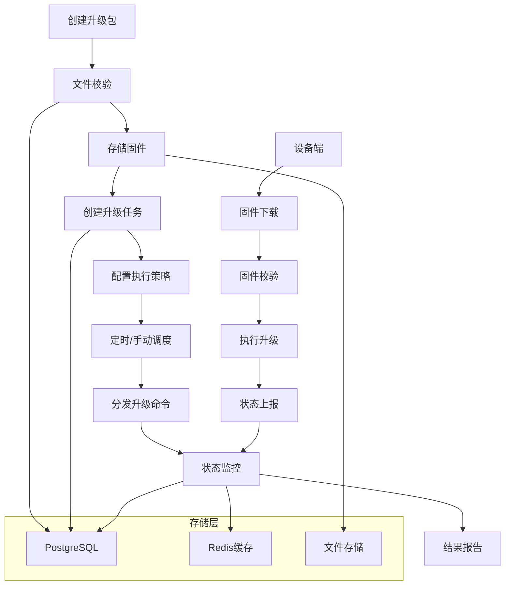

**图表来源**
- [ota_handler.go:40-149](file://inv_api_server/internal/handler/ota_handler.go#L40-L149)
- [ota_repository.go:20-78](file://inv_api_server/internal/repository/ota_repository.go#L20-L78)

## 详细组件分析

### 1. API服务器组件

API服务器是OTA系统的核心控制中心，负责业务逻辑处理和数据管理。重构后的架构提供了更完善的升级包和任务管理接口。

#### 处理器层设计
处理器层采用职责分离原则，每个处理器专注于特定的业务领域：

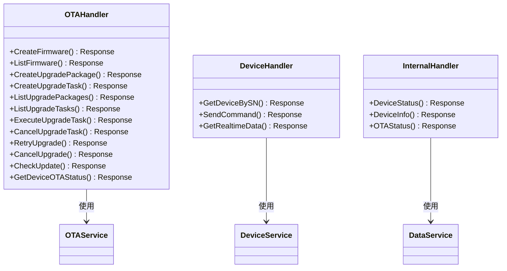

**图表来源**
- [ota_handler.go:20-26](file://inv_api_server/internal/handler/ota_handler.go#L20-L26)
- [main.go:121-133](file://inv_api_server/cmd/main.go#L121-L133)

#### 服务层架构
服务层封装了复杂的业务逻辑，提供了统一的服务接口。重构后的服务层支持升级包和任务的完整生命周期管理。

**章节来源**
- [ota_service.go:22-42](file://inv_api_server/internal/service/ota_service.go#L22-L42)
- [ota_handler.go:188-214](file://inv_api_server/internal/handler/ota_handler.go#L188-L214)

### 2. 设备服务器组件

设备服务器作为MQTT代理，负责设备与云端之间的消息路由和状态同步。重构后的架构增强了对升级任务状态的监控和处理能力。

#### MQTT客户端实现
设备服务器的MQTT客户端具有以下特性：
- **连接管理**：自动重连机制，确保连接稳定性
- **主题订阅**：动态订阅设备状态和OTA状态主题
- **消息转发**：将设备状态转换为API服务器可识别的格式

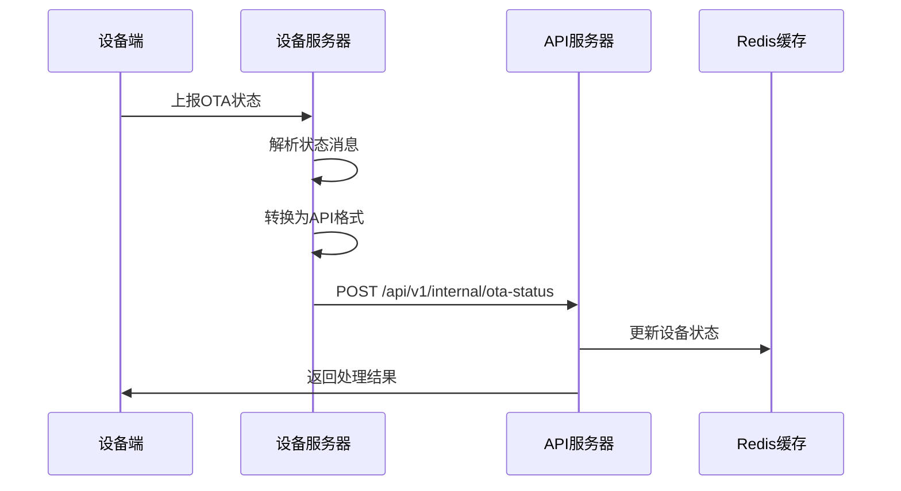

**图表来源**
- [data_service.go:204-300](file://inv_device_server/internal/service/data_service.go#L204-L300)

**章节来源**
- [client.go:136-235](file://inv_device_server/internal/mqtt/client.go#L136-L235)
- [data_service.go:204-300](file://inv_device_server/internal/service/data_service.go#L204-L300)

### 3. 设备端固件实现

设备端固件实现了完整的OTA升级流程，包括固件下载、校验和升级执行。重构后的架构要求设备端能够处理升级包和任务级别的升级指令。

#### ESP32端实现
ESP32作为WiFi网关，负责与云端的直接通信：

**章节来源**
- [设备端OTA程序开发指南.md:33-145](file://docs/设备端OTA程序开发指南.md#L33-L145)

#### ARM端实现
ARM作为主控制器，负责具体的升级操作：

**章节来源**
- [设备端OTA程序开发指南.md:308-707](file://docs/设备端OTA程序开发指南.md#L308-L707)

### 4. 数据存储设计

系统采用混合存储架构，结合关系型数据库和缓存系统的优势。重构后的架构引入了升级包和升级任务的专门表结构。

#### 数据库表结构
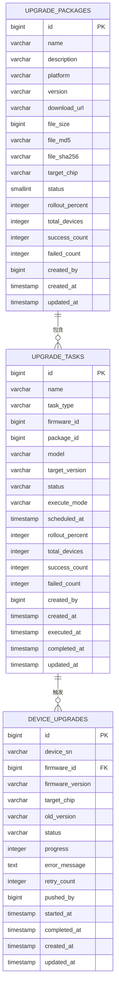

**图表来源**
- [008_upgrade_packages.up.sql:1-28](file://database/migrations/008_upgrade_packages.up.sql#L1-L28)
- [009_upgrade_tasks.up.sql:1-28](file://database/migrations/009_upgrade_tasks.up.sql#L1-L28)
- [006_refactor_ota_to_device_upgrades.sql:1-31](file://database/migrations/006_refactor_ota_to_device_upgrades.sql#L1-L31)

**章节来源**
- [008_upgrade_packages.up.sql:1-28](file://database/migrations/008_upgrade_packages.up.sql#L1-L28)
- [009_upgrade_tasks.up.sql:1-28](file://database/migrations/009_upgrade_tasks.up.sql#L1-L28)
- [006_refactor_ota_to_device_upgrades.sql:1-31](file://database/migrations/006_refactor_ota_to_device_upgrades.sql#L1-L31)

## 依赖关系分析

### 1. 技术栈依赖

系统采用现代化的技术栈，确保高性能和可维护性：

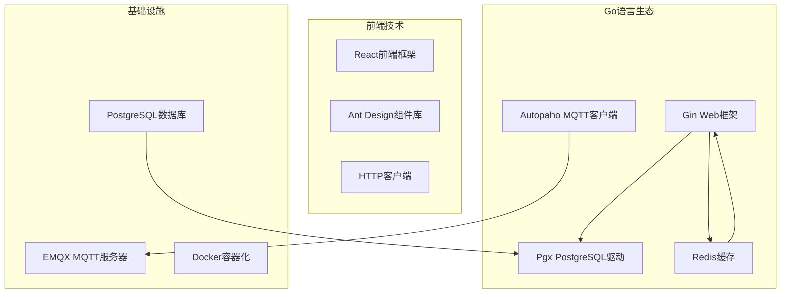

**图表来源**
- [main.go:24-27](file://inv_api_server/cmd/main.go#L24-L27)
- [main.go:22-26](file://inv_device_server/cmd/main.go#L22-L26)

### 2. 组件间依赖

系统采用清晰的依赖层次结构，避免循环依赖。重构后的架构增强了升级包、升级任务和设备升级之间的关联关系。

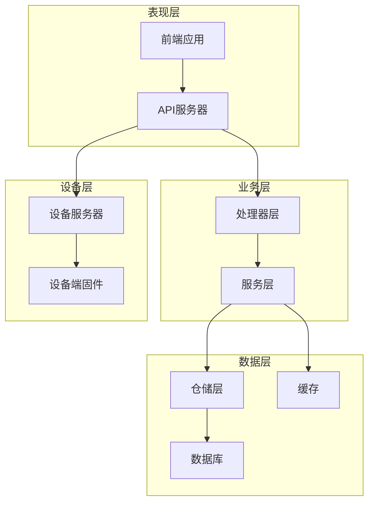

**图表来源**
- [main.go:121-133](file://inv_api_server/cmd/main.go#L121-L133)
- [main.go:112-127](file://inv_device_server/cmd/main.go#L112-L127)

**章节来源**
- [main.go:121-133](file://inv_api_server/cmd/main.go#L121-L133)
- [main.go:112-127](file://inv_device_server/cmd/main.go#L112-L127)

## 性能考虑

### 1. 并发控制

系统采用信号量机制控制并发升级数量，防止资源竞争。重构后的架构通过升级任务的执行策略更好地控制并发度。

**章节来源**
- [ota_service.go:134-142](file://inv_api_server/internal/service/ota_service.go#L134-L142)

### 2. 缓存策略

利用Redis缓存设备在线状态和实时数据，提高响应速度。升级包和任务的状态信息也通过缓存进行优化。

**章节来源**
- [client.go:69-94](file://inv_device_server/internal/mqtt/client.go#L69-L94)
- [data_service.go:77-91](file://inv_device_server/internal/service/data_service.go#L77-L91)

### 3. 数据库优化

通过合理的索引设计和查询优化，确保大规模设备场景下的性能表现。新增的升级包和任务表都包含了必要的索引优化。

**章节来源**
- [008_upgrade_packages.up.sql:28-34](file://database/migrations/008_upgrade_packages.up.sql#L28-L34)
- [009_upgrade_tasks.up.sql:28-34](file://database/migrations/009_upgrade_tasks.up.sql#L28-L34)
- [006_refactor_ota_to_device_upgrades.sql:28-31](file://database/migrations/006_refactor_ota_to_device_upgrades.sql#L28-L31)

## 故障排查指南

### 1. 常见问题诊断

#### MQTT连接问题
- 检查MQTT服务器地址和端口配置
- 验证用户名密码认证信息
- 确认网络连通性和防火墙设置

#### 升级包上传失败
- 检查升级包文件完整性（MD5/SHA256校验）
- 验证升级包格式和平台兼容性
- 确认升级包大小限制和存储空间

#### 升级任务执行异常
- 检查升级任务的执行策略配置
- 验证目标设备的兼容性和状态
- 确认升级包的有效性和可用性

#### 状态同步异常
- 检查Redis连接状态
- 验证设备在线检测机制
- 确认消息队列处理情况

### 2. 日志分析

系统提供了详细的日志记录机制，便于问题定位和性能分析。重构后的架构增加了升级包和任务相关的日志记录。

**章节来源**
- [client.go:152-214](file://inv_device_server/internal/mqtt/client.go#L152-L214)
- [data_service.go:272-299](file://inv_device_server/internal/service/data_service.go#L272-L299)

## 结论

OTA升级系统经过重大架构重构，从原有的任务驱动架构转变为设备升级架构，引入了升级包和升级任务等核心概念，实现了更灵活的升级管理和更强的业务控制能力。

### 主要优势
- **完整的生命周期管理**：从升级包创建到任务执行的全流程自动化
- **灵活的执行策略**：支持立即、定时和手动三种执行模式
- **强大的监控能力**：实时状态跟踪和异常处理机制
- **高可用性设计**：自动重连、并发控制和故障恢复
- **灰度发布支持**：通过滚动百分比实现渐进式升级

### 技术特点
- 基于MQTT协议的实时通信
- 响应式Web界面和RESTful API
- 完善的权限管理和审计日志
- 可扩展的微服务架构
- 支持升级包模板和任务级别的精细化控制

该系统为设备厂商提供了标准化的OTA集成方案，支持快速部署和后续功能扩展，特别适合需要复杂升级策略和精细控制的企业级应用场景。

## 附录

### 1. API接口文档

系统提供了完整的API接口，支持固件管理、升级包管理、升级任务控制和状态查询等功能。

### 2. 集成指南

设备厂商可以按照以下步骤集成OTA功能：
1. 部署API服务器和设备服务器
2. 配置MQTT服务器和数据库连接
3. 在设备端实现OTA升级逻辑
4. 集成到现有的设备管理系统中

### 3. 测试验证方法

建议采用以下测试方法验证系统功能：
- 单元测试：针对核心业务逻辑的单元测试
- 集成测试：验证组件间的交互和数据一致性
- 性能测试：模拟大量设备同时升级的场景
- 回归测试：确保功能变更不影响现有功能
- 灰度测试：验证滚动升级策略的有效性