# OTA升级系统

<cite>
**本文档引用的文件**
- [设备端OTA程序开发指南.md](file://docs/设备端OTA程序开发指南.md)
- [ota_handler.go](file://inv_api_server/internal/handler/ota_handler.go)
- [ota_service.go](file://inv_api_server/internal/service/ota_service.go)
- [ota_repository.go](file://inv_api_server/internal/repository/ota_repository.go)
- [models.go](file://inv_api_server/internal/model/models.go)
- [client.go](file://inv_device_server/internal/mqtt/client.go)
- [data_service.go](file://inv_device_server/internal/service/data_service.go)
- [main.go](file://inv_api_server/cmd/main.go)
- [main.go](file://inv_device_server/cmd/main.go)
- [schema.sql](file://database/schema.sql)
- [006_refactor_ota_to_device_upgrades.sql](file://database/migrations/006_refactor_ota_to_device_upgrades.sql)
</cite>

## 目录
1. [简介](#简介)
2. [项目结构](#项目结构)
3. [核心组件](#核心组件)
4. [架构概览](#架构概览)
5. [详细组件分析](#详细组件分析)
6. [依赖关系分析](#依赖关系分析)
7. [性能考虑](#性能考虑)
8. [故障排查指南](#故障排查指南)
9. [结论](#结论)
10. [附录](#附录)

## 简介

OTA（Over-The-Air）升级系统是一个完整的固件远程升级解决方案，支持多设备、多固件版本的统一管理。该系统采用MQTT通信协议，实现了从固件上传、版本验证到任务调度的全流程自动化管理。

系统主要分为三个核心部分：
- **云端管理平台**：负责固件版本管理、升级任务调度和状态监控
- **设备端固件**：支持ESP32和ARM双芯片架构的OTA升级
- **设备服务器**：作为MQTT代理，负责设备与云端的通信桥接

## 项目结构

该项目采用Go语言开发，采用分层架构设计，主要包含以下模块：

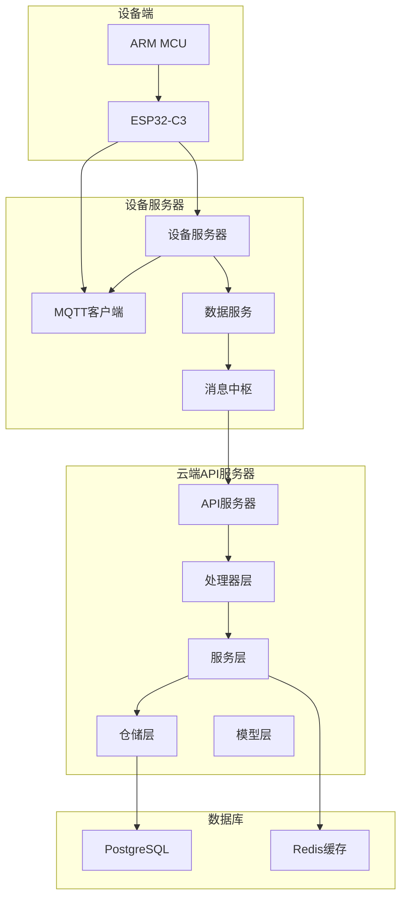

**图表来源**
- [main.go:88-163](file://inv_api_server/cmd/main.go#L88-L163)
- [main.go:34-127](file://inv_device_server/cmd/main.go#L34-L127)

**章节来源**
- [main.go:88-163](file://inv_api_server/cmd/main.go#L88-L163)
- [main.go:34-127](file://inv_device_server/cmd/main.go#L34-L127)

## 核心组件

### 1. 固件管理系统

固件管理是OTA系统的核心功能，负责固件版本的创建、验证和分发。

#### 固件版本模型
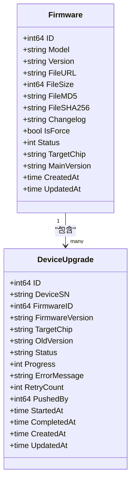

**图表来源**
- [models.go:283-324](file://inv_api_server/internal/model/models.go#L283-L324)

#### 固件上传流程
固件上传支持两种方式：
- **文件上传**：通过multipart/form-data上传固件文件
- **URL直传**：直接提供固件下载链接

上传过程中自动进行文件校验，包括MD5和SHA256哈希计算。

**章节来源**
- [ota_handler.go:40-149](file://inv_api_server/internal/handler/ota_handler.go#L40-L149)
- [models.go:283-299](file://inv_api_server/internal/model/models.go#L283-L299)

### 2. 升级任务调度系统

升级任务调度系统实现了从任务创建到执行完成的全生命周期管理。

#### 任务状态流转
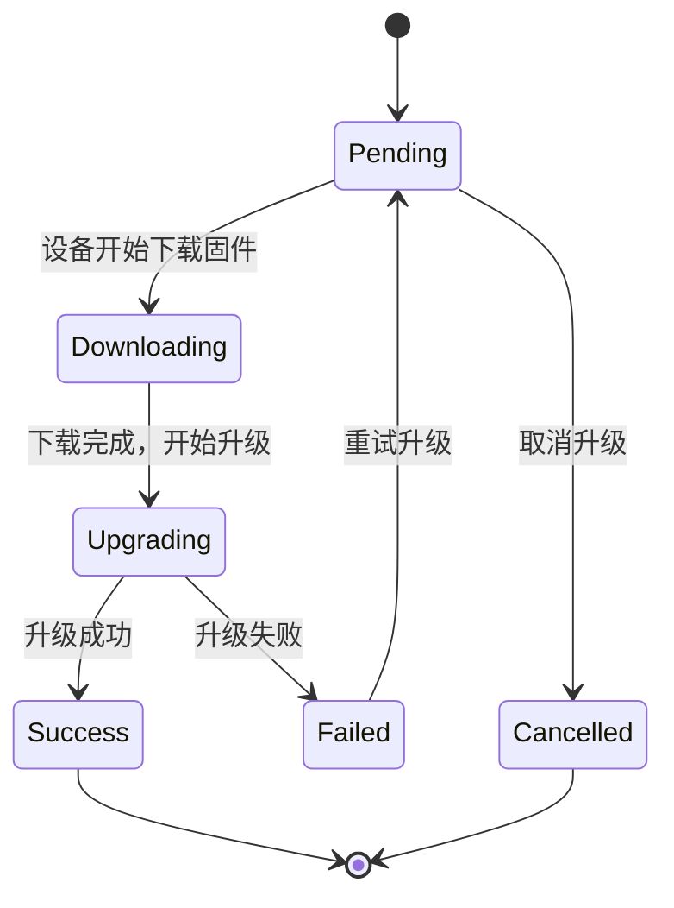

**图表来源**
- [models.go:301-324](file://inv_api_server/internal/model/models.go#L301-L324)

#### 批量升级支持
系统支持对多个设备同时推送升级任务，采用并发控制确保升级过程的稳定性。

**章节来源**
- [ota_service.go:118-181](file://inv_api_server/internal/service/ota_service.go#L118-L181)
- [ota_repository.go:80-107](file://inv_api_server/internal/repository/ota_repository.go#L80-L107)

### 3. 设备端OTA实现

设备端采用双芯片架构，支持ESP32和ARM的独立升级。

#### 设备端架构
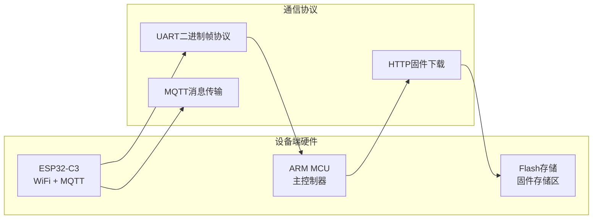

**图表来源**
- [设备端OTA程序开发指南.md:11-31](file://docs/设备端OTA程序开发指南.md#L11-L31)

**章节来源**
- [设备端OTA程序开发指南.md:1-800](file://docs/设备端OTA程序开发指南.md#L1-L800)

## 架构概览

### 系统整体架构

OTA系统采用微服务架构，通过MQTT协议实现设备与云端的实时通信。

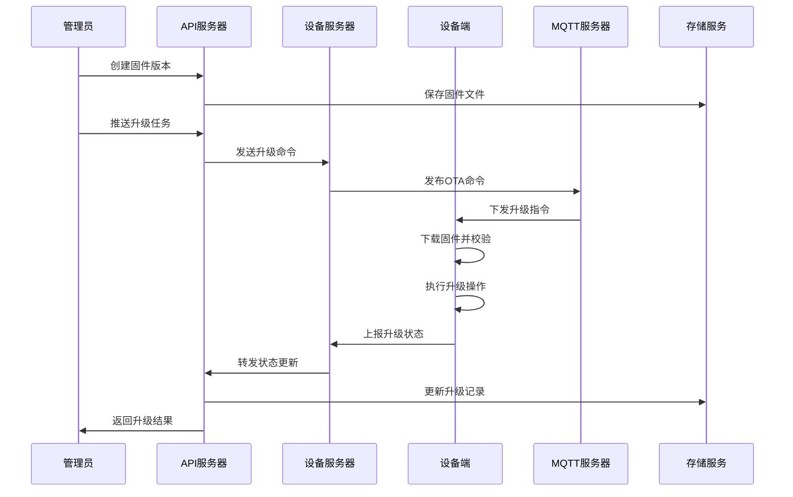

**图表来源**
- [ota_service.go:118-181](file://inv_api_server/internal/service/ota_service.go#L118-L181)
- [client.go:248-317](file://inv_device_server/internal/mqtt/client.go#L248-L317)

### 数据流架构

系统采用事件驱动的数据流架构，确保各组件间的松耦合和高内聚。

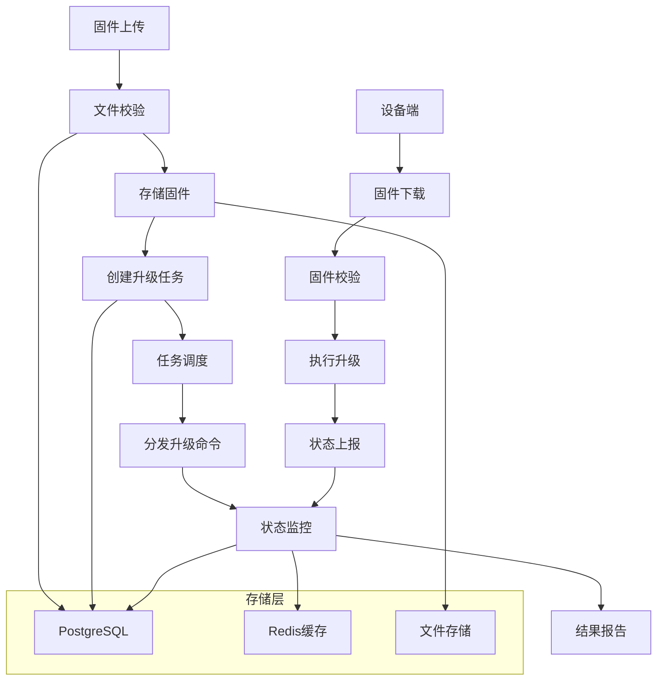

**图表来源**
- [ota_handler.go:40-149](file://inv_api_server/internal/handler/ota_handler.go#L40-L149)
- [ota_repository.go:20-78](file://inv_api_server/internal/repository/ota_repository.go#L20-L78)

## 详细组件分析

### 1. API服务器组件

API服务器是OTA系统的核心控制中心，负责业务逻辑处理和数据管理。

#### 处理器层设计
处理器层采用职责分离原则，每个处理器专注于特定的业务领域：

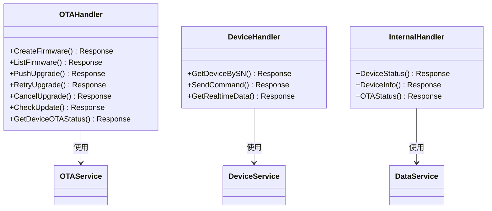

**图表来源**
- [ota_handler.go:20-26](file://inv_api_server/internal/handler/ota_handler.go#L20-L26)
- [main.go:121-133](file://inv_api_server/cmd/main.go#L121-L133)

#### 服务层架构
服务层封装了复杂的业务逻辑，提供了统一的服务接口：

**章节来源**
- [ota_service.go:22-42](file://inv_api_server/internal/service/ota_service.go#L22-L42)
- [ota_handler.go:188-214](file://inv_api_server/internal/handler/ota_handler.go#L188-L214)

### 2. 设备服务器组件

设备服务器作为MQTT代理，负责设备与云端之间的消息路由和状态同步。

#### MQTT客户端实现
设备服务器的MQTT客户端具有以下特性：
- **连接管理**：自动重连机制，确保连接稳定性
- **主题订阅**：动态订阅设备状态和OTA状态主题
- **消息转发**：将设备状态转换为API服务器可识别的格式

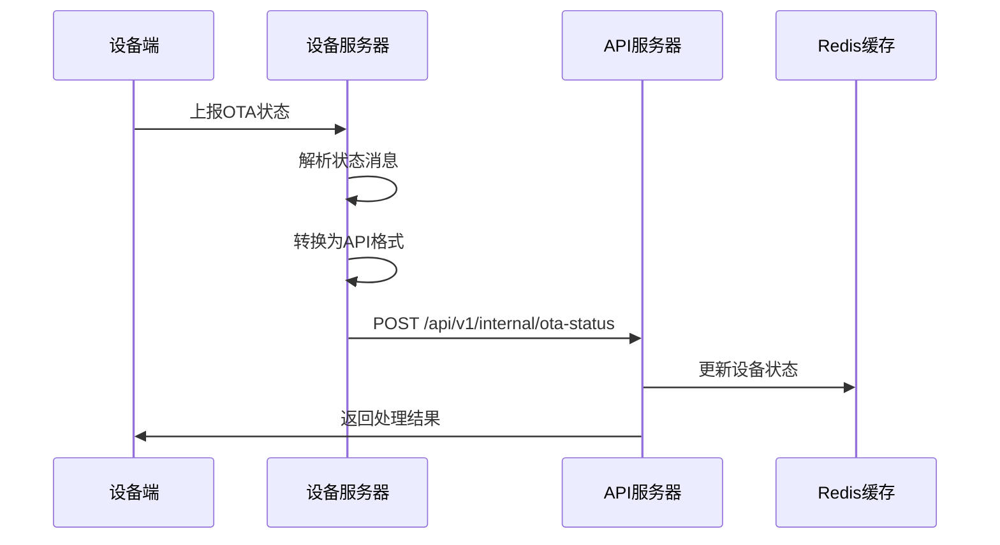

**图表来源**
- [data_service.go:204-300](file://inv_device_server/internal/service/data_service.go#L204-L300)

**章节来源**
- [client.go:136-235](file://inv_device_server/internal/mqtt/client.go#L136-L235)
- [data_service.go:204-300](file://inv_device_server/internal/service/data_service.go#L204-L300)

### 3. 设备端固件实现

设备端固件实现了完整的OTA升级流程，包括固件下载、校验和升级执行。

#### ESP32端实现
ESP32作为WiFi网关，负责与云端的直接通信：

**章节来源**
- [设备端OTA程序开发指南.md:33-145](file://docs/设备端OTA程序开发指南.md#L33-L145)

#### ARM端实现
ARM作为主控制器，负责具体的升级操作：

**章节来源**
- [设备端OTA程序开发指南.md:308-707](file://docs/设备端OTA程序开发指南.md#L308-L707)

### 4. 数据存储设计

系统采用混合存储架构，结合关系型数据库和缓存系统的优势。

#### 数据库表结构
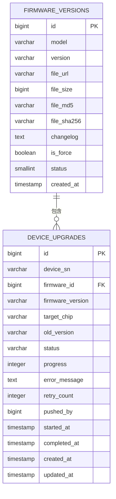

**图表来源**
- [schema.sql:236-270](file://database/schema.sql#L236-L270)
- [006_refactor_ota_to_device_upgrades.sql:6-26](file://database/migrations/006_refactor_ota_to_device_upgrades.sql#L6-L26)

**章节来源**
- [schema.sql:236-270](file://database/schema.sql#L236-L270)
- [006_refactor_ota_to_device_upgrades.sql:6-26](file://database/migrations/006_refactor_ota_to_device_upgrades.sql#L6-L26)

## 依赖关系分析

### 1. 技术栈依赖

系统采用现代化的技术栈，确保高性能和可维护性：

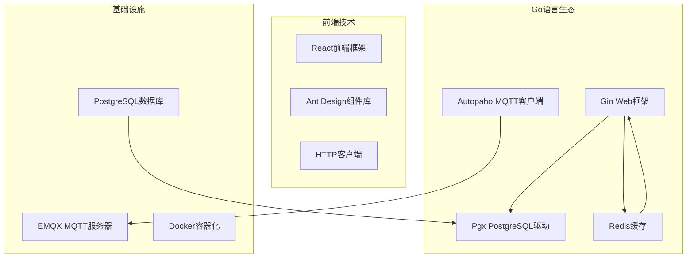

**图表来源**
- [main.go:24-27](file://inv_api_server/cmd/main.go#L24-L27)
- [main.go:22-26](file://inv_device_server/cmd/main.go#L22-L26)

### 2. 组件间依赖

系统采用清晰的依赖层次结构，避免循环依赖：

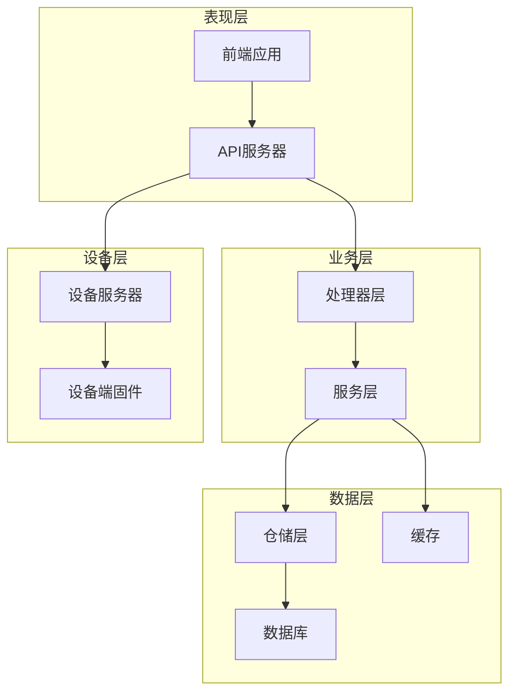

**图表来源**
- [main.go:121-133](file://inv_api_server/cmd/main.go#L121-L133)
- [main.go:112-127](file://inv_device_server/cmd/main.go#L112-L127)

**章节来源**
- [main.go:121-133](file://inv_api_server/cmd/main.go#L121-L133)
- [main.go:112-127](file://inv_device_server/cmd/main.go#L112-L127)

## 性能考虑

### 1. 并发控制

系统采用信号量机制控制并发升级数量，防止资源竞争：

**章节来源**
- [ota_service.go:134-142](file://inv_api_server/internal/service/ota_service.go#L134-L142)

### 2. 缓存策略

利用Redis缓存设备在线状态和实时数据，提高响应速度：

**章节来源**
- [client.go:69-94](file://inv_device_server/internal/mqtt/client.go#L69-L94)
- [data_service.go:77-91](file://inv_device_server/internal/service/data_service.go#L77-L91)

### 3. 数据库优化

通过合理的索引设计和查询优化，确保大规模设备场景下的性能表现：

**章节来源**
- [schema.sql:251-270](file://database/schema.sql#L251-L270)
- [006_refactor_ota_to_device_upgrades.sql:28-34](file://database/migrations/006_refactor_ota_to_device_upgrades.sql#L28-L34)

## 故障排查指南

### 1. 常见问题诊断

#### MQTT连接问题
- 检查MQTT服务器地址和端口配置
- 验证用户名密码认证信息
- 确认网络连通性和防火墙设置

#### 固件升级失败
- 检查固件文件完整性（MD5/SHA256校验）
- 验证设备存储空间是否充足
- 确认设备电源供应稳定

#### 状态同步异常
- 检查Redis连接状态
- 验证设备在线检测机制
- 确认消息队列处理情况

### 2. 日志分析

系统提供了详细的日志记录机制，便于问题定位和性能分析：

**章节来源**
- [client.go:152-214](file://inv_device_server/internal/mqtt/client.go#L152-L214)
- [data_service.go:272-299](file://inv_device_server/internal/service/data_service.go#L272-L299)

## 结论

OTA升级系统是一个功能完整、架构清晰的固件远程升级解决方案。系统采用微服务架构，支持多设备、多固件版本的统一管理，具备良好的扩展性和可靠性。

### 主要优势
- **完整的生命周期管理**：从固件上传到升级完成的全流程自动化
- **双芯片架构支持**：同时支持ESP32和ARM的独立升级
- **强大的监控能力**：实时状态跟踪和异常处理机制
- **高可用性设计**：自动重连、并发控制和故障恢复

### 技术特点
- 基于MQTT协议的实时通信
- 响应式Web界面和RESTful API
- 完善的权限管理和审计日志
- 可扩展的微服务架构

该系统为设备厂商提供了标准化的OTA集成方案，支持快速部署和后续功能扩展。

## 附录

### 1. API接口文档

系统提供了完整的API接口，支持固件管理、升级任务控制和状态查询等功能。

### 2. 集成指南

设备厂商可以按照以下步骤集成OTA功能：
1. 部署API服务器和设备服务器
2. 配置MQTT服务器和数据库连接
3. 在设备端实现OTA升级逻辑
4. 集成到现有的设备管理系统中

### 3. 测试验证方法

建议采用以下测试方法验证系统功能：
- 单元测试：针对核心业务逻辑的单元测试
- 集成测试：验证组件间的交互和数据一致性
- 性能测试：模拟大量设备同时升级的场景
- 回归测试：确保功能变更不影响现有功能