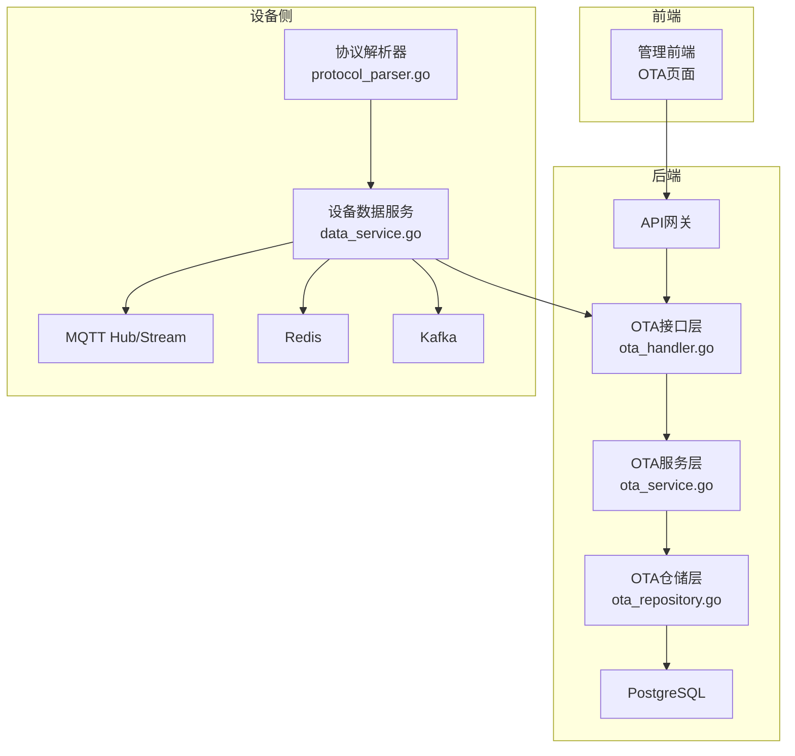
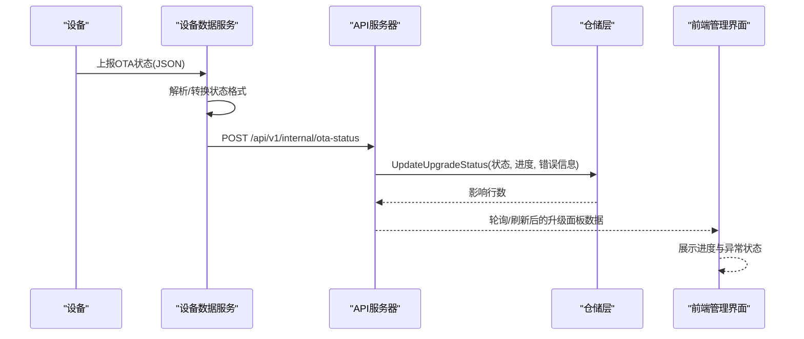
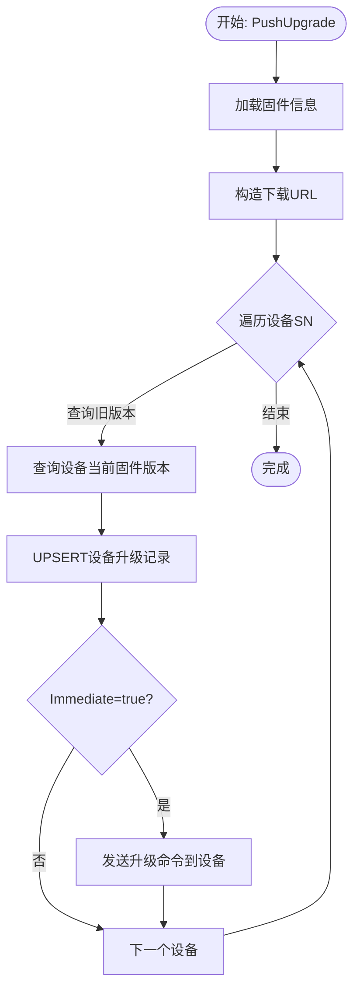
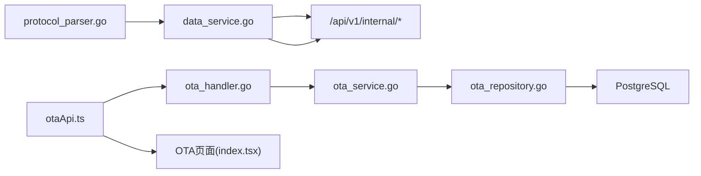

# OTA状态跟踪

<cite>
**本文档引用的文件**
- [inv_api_server/internal/handler/ota_handler.go](file://inv_api_server/internal/handler/ota_handler.go)
- [inv_api_server/internal/service/ota_service.go](file://inv_api_server/internal/service/ota_service.go)
- [inv_api_server/internal/repository/ota_repository.go](file://inv_api_server/internal/repository/ota_repository.go)
- [inv_device_server/internal/service/data_service.go](file://inv_device_server/internal/service/data_service.go)
- [inv_device_server/internal/service/protocol_parser.go](file://inv_device_server/internal/service/protocol_parser.go)
- [inv_device_server/internal/mqtt/stream_consumer.go](file://inv_device_server/internal/mqtt/stream_consumer.go)
- [inv-admin-frontend/src/services/otaApi.ts](file://inv-admin-frontend/src/services/otaApi.ts)
- [inv-admin-frontend/src/pages/ota/index.tsx](file://inv-admin-frontend/src/pages/ota/index.tsx)
</cite>

## 目录
1. [简介](#简介)
2. [项目结构](#项目结构)
3. [核心组件](#核心组件)
4. [架构总览](#架构总览)
5. [详细组件分析](#详细组件分析)
6. [依赖关系分析](#依赖关系分析)
7. [性能考虑](#性能考虑)
8. [故障排查指南](#故障排查指南)
9. [结论](#结论)
10. [附录](#附录)

## 简介
本文件为OTA状态跟踪系统的完整技术文档，围绕设备固件升级的状态实时跟踪机制展开，涵盖设备状态上报、任务进度汇总、异常状态检测、状态数据的采集与聚合、状态同步机制（WebSocket推送、轮询查询、事件通知）、异常处理（超时检测、失败重试、人工干预）、状态历史记录的存储与查询、状态监控与告警方案以及性能优化与数据一致性保障。

## 项目结构
系统采用前后端分离与微服务架构：
- API网关与后端服务：inv_api_server 提供OTA固件管理、升级任务管理、状态查询等REST接口。
- 设备侧服务：inv_device_server 负责协议解析、MQTT/Redis/Kafka集成、设备状态与OTA状态上报。
- 前端管理界面：inv-admin-frontend 提供OTA升级管理、固件管理、App版本管理等操作界面。
- 数据存储：PostgreSQL存储设备升级记录与固件元数据；Redis用于实时状态缓存与流式传输；Kafka用于设备消息桥接。

图表来源
- [inv_api_server/internal/handler/ota_handler.go:1-536](file://inv_api_server/internal/handler/ota_handler.go#L1-L536)
- [inv_api_server/internal/service/ota_service.go:1-355](file://inv_api_server/internal/service/ota_service.go#L1-L355)
- [inv_api_server/internal/repository/ota_repository.go:1-497](file://inv_api_server/internal/repository/ota_repository.go#L1-L497)
- [inv_device_server/internal/service/data_service.go:1-416](file://inv_device_server/internal/service/data_service.go#L1-L416)
- [inv_device_server/internal/service/protocol_parser.go:1-800](file://inv_device_server/internal/service/protocol_parser.go#L1-L800)
- [inv_device_server/internal/mqtt/stream_consumer.go:1-30](file://inv_device_server/internal/mqtt/stream_consumer.go#L1-L30)

章节来源
- [inv_api_server/internal/handler/ota_handler.go:1-536](file://inv_api_server/internal/handler/ota_handler.go#L1-L536)
- [inv_api_server/internal/service/ota_service.go:1-355](file://inv_api_server/internal/service/ota_service.go#L1-L355)
- [inv_api_server/internal/repository/ota_repository.go:1-497](file://inv_api_server/internal/repository/ota_repository.go#L1-L497)
- [inv_device_server/internal/service/data_service.go:1-416](file://inv_device_server/internal/service/data_service.go#L1-L416)
- [inv_device_server/internal/service/protocol_parser.go:1-800](file://inv_device_server/internal/service/protocol_parser.go#L1-L800)
- [inv_device_server/internal/mqtt/stream_consumer.go:1-30](file://inv_device_server/internal/mqtt/stream_consumer.go#L1-L30)

## 核心组件
- OTA接口层（Handler）：提供固件上传、升级推送、状态查询、历史查询、App版本管理等HTTP接口。
- OTA服务层（Service）：封装业务逻辑，协调仓储层与设备侧通信，负责并发控制与状态更新。
- OTA仓储层（Repository）：封装数据库访问，提供UPSERT、聚合统计、历史查询、重试与取消等能力。
- 设备数据服务（Device Service）：负责设备状态与OTA状态上报的转发、ACK处理、离线命令队列下发、Redis缓存与故障检测。
- 协议解析器（Protocol Parser）：消费Kafka消息，解析设备上报，处理故障状态、防抖、字段映射与缓存写入。
- MQTT流消费者（Stream Consumer）：向Redis Stream发布设备数据，支撑实时推送与事件通知。

章节来源
- [inv_api_server/internal/handler/ota_handler.go:20-536](file://inv_api_server/internal/handler/ota_handler.go#L20-L536)
- [inv_api_server/internal/service/ota_service.go:22-355](file://inv_api_server/internal/service/ota_service.go#L22-L355)
- [inv_api_server/internal/repository/ota_repository.go:12-497](file://inv_api_server/internal/repository/ota_repository.go#L12-L497)
- [inv_device_server/internal/service/data_service.go:23-416](file://inv_device_server/internal/service/data_service.go#L23-L416)
- [inv_device_server/internal/service/protocol_parser.go:29-800](file://inv_device_server/internal/service/protocol_parser.go#L29-L800)
- [inv_device_server/internal/mqtt/stream_consumer.go:10-30](file://inv_device_server/internal/mqtt/stream_consumer.go#L10-L30)

## 架构总览
OTA状态跟踪系统通过“设备上报—服务转发—仓储持久化—前端展示”的闭环实现：
- 设备侧通过MQTT/Kafka上报OTA状态，设备数据服务将其转换为API期望格式并转发至API服务器。
- API服务器更新数据库中的设备升级记录，同时提供REST接口供前端查询与管理。
- 前端通过React Query进行轮询与状态刷新，结合后台聚合接口展示升级仪表盘与历史记录。

图表来源
- [inv_device_server/internal/service/data_service.go:297-393](file://inv_device_server/internal/service/data_service.go#L297-L393)
- [inv_api_server/internal/service/ota_service.go:242-244](file://inv_api_server/internal/service/ota_service.go#L242-L244)
- [inv_api_server/internal/repository/ota_repository.go:137-153](file://inv_api_server/internal/repository/ota_repository.go#L137-L153)
- [inv-admin-frontend/src/pages/ota/index.tsx:561-569](file://inv-admin-frontend/src/pages/ota/index.tsx#L561-L569)

## 详细组件分析

### OTA接口层（Handler）
- 职责：接收HTTP请求，校验参数，调用服务层执行业务，返回统一响应。
- 关键接口：
  - 固件管理：创建/上传固件、列出固件、删除固件、获取全部固件。
  - 升级管理：推送升级、获取升级仪表盘、获取固件升级详情、重试失败升级、取消待执行升级。
  - 设备状态：检查更新、触发OTA、获取设备当前状态、获取设备历史。
  - App版本管理：查询、创建、删除、灰度更新、回滚与恢复。

章节来源
- [inv_api_server/internal/handler/ota_handler.go:40-149](file://inv_api_server/internal/handler/ota_handler.go#L40-L149)
- [inv_api_server/internal/handler/ota_handler.go:188-214](file://inv_api_server/internal/handler/ota_handler.go#L188-L214)
- [inv_api_server/internal/handler/ota_handler.go:216-244](file://inv_api_server/internal/handler/ota_handler.go#L216-L244)
- [inv_api_server/internal/handler/ota_handler.go:246-278](file://inv_api_server/internal/handler/ota_handler.go#L246-L278)
- [inv_api_server/internal/handler/ota_handler.go:280-367](file://inv_api_server/internal/handler/ota_handler.go#L280-L367)
- [inv_api_server/internal/handler/ota_handler.go:381-515](file://inv_api_server/internal/handler/ota_handler.go#L381-L515)

### OTA服务层（Service）
- 职责：编排业务流程，控制并发，构建下载URL，发送升级命令，更新状态，重试与取消。
- 并发控制：使用信号量限制同时向设备发送命令的数量，避免过载。
- 状态更新：提供UpdateDeviceUpgradeStatus接口，供仓储层更新状态与进度。
- 升级推送：PushUpgrade对每个设备执行UPSERT并根据Immediate参数决定是否立即下发命令。

图表来源
- [inv_api_server/internal/service/ota_service.go:118-181](file://inv_api_server/internal/service/ota_service.go#L118-L181)
- [inv_api_server/internal/service/ota_service.go:183-234](file://inv_api_server/internal/service/ota_service.go#L183-L234)

章节来源
- [inv_api_server/internal/service/ota_service.go:22-42](file://inv_api_server/internal/service/ota_service.go#L22-L42)
- [inv_api_server/internal/service/ota_service.go:118-181](file://inv_api_server/internal/service/ota_service.go#L118-L181)
- [inv_api_server/internal/service/ota_service.go:241-272](file://inv_api_server/internal/service/ota_service.go#L241-L272)

### OTA仓储层（Repository）
- 职责：数据库访问与聚合统计，提供UPSERT、状态更新、仪表盘聚合、历史查询、重试与取消。
- UPSERT策略：按设备+固件维度去重，失败重试时自动增加重试次数并更新时间戳。
- 聚合统计：按固件分组统计总数、成功数、失败数、待执行数，支持最后更新时间排序。
- 历史查询：支持按设备分页查询升级历史，包含状态、进度、错误信息、重试次数等。

章节来源
- [inv_api_server/internal/repository/ota_repository.go:80-107](file://inv_api_server/internal/repository/ota_repository.go#L80-L107)
- [inv_api_server/internal/repository/ota_repository.go:155-193](file://inv_api_server/internal/repository/ota_repository.go#L155-L193)
- [inv_api_server/internal/repository/ota_repository.go:223-253](file://inv_api_server/internal/repository/ota_repository.go#L223-L253)
- [inv_api_server/internal/repository/ota_repository.go:255-269](file://inv_api_server/internal/repository/ota_repository.go#L255-L269)
- [inv_api_server/internal/repository/ota_repository.go:271-278](file://inv_api_server/internal/repository/ota_repository.go#L271-L278)

### 设备数据服务（Device Service）
- 职责：处理OTA状态上报，转换为API期望格式并转发；处理命令结果；离线命令队列下发；设备状态与信息上报；故障检测与防抖。
- OTA状态处理：解析设备上报的OTA状态，转换为API格式，携带firmware_id与错误信息，失败时附带错误码。
- 重试机制：对内部API调用失败进行指数退避重试，最多3次。
- 故障检测：当payload中state=fault或fault_code!=0时，上报故障状态并设置Redis防抖键，避免被后续在线状态覆盖。

章节来源
- [inv_device_server/internal/service/data_service.go:297-393](file://inv_device_server/internal/service/data_service.go#L297-L393)
- [inv_device_server/internal/service/data_service.go:77-125](file://inv_device_server/internal/service/data_service.go#L77-L125)
- [inv_device_server/internal/service/data_service.go:127-168](file://inv_device_server/internal/service/data_service.go#L127-L168)
- [inv_device_server/internal/service/data_service.go:190-235](file://inv_device_server/internal/service/data_service.go#L190-L235)

### 协议解析器（Protocol Parser）
- 职责：消费Kafka消息，解析设备上报，处理故障状态、防抖、字段映射与缓存写入。
- 故障检测：识别data/status中的state=fault或fault_code!=0，上报故障状态并设置Redis防抖键。
- 防抖策略：对status=1与故障状态设置10秒防抖键，避免频繁重复上报。
- 字段映射：根据设备模型元数据应用解析规则与类型转换，确保入库字段规范。

章节来源
- [inv_device_server/internal/service/protocol_parser.go:267-309](file://inv_device_server/internal/service/protocol_parser.go#L267-L309)
- [inv_device_server/internal/service/protocol_parser.go:447-696](file://inv_device_server/internal/service/protocol_parser.go#L447-L696)
- [inv_device_server/internal/service/protocol_parser.go:698-741](file://inv_device_server/internal/service/protocol_parser.go#L698-L741)

### MQTT流消费者（Stream Consumer）
- 职责：将设备数据以流的形式写入Redis Stream，支持最大长度限制与近似裁剪，便于下游消费与事件通知。

章节来源
- [inv_device_server/internal/mqtt/stream_consumer.go:16-30](file://inv_device_server/internal/mqtt/stream_consumer.go#L16-L30)

### 前端管理界面（OTA页面）
- 职责：提供固件上传、升级推送、重试失败、取消待执行、查看升级详情与历史等功能；基于React Query进行轮询刷新。
- 轮询策略：升级详情页启用5秒轮询刷新，提升状态实时性。
- UI交互：按状态颜色标识进度，失败设备可一键重试，待执行设备可一键取消。

章节来源
- [inv-admin-frontend/src/services/otaApi.ts:1-33](file://inv-admin-frontend/src/services/otaApi.ts#L1-L33)
- [inv-admin-frontend/src/pages/ota/index.tsx:561-569](file://inv-admin-frontend/src/pages/ota/index.tsx#L561-L569)
- [inv-admin-frontend/src/pages/ota/index.tsx:575-598](file://inv-admin-frontend/src/pages/ota/index.tsx#L575-L598)
- [inv-admin-frontend/src/pages/ota/index.tsx:600-607](file://inv-admin-frontend/src/pages/ota/index.tsx#L600-L607)

## 依赖关系分析
- Handler依赖Service，Service依赖Repository，形成清晰的分层依赖。
- 设备侧服务依赖MQTT Hub、Redis与Kafka，通过内部HTTP接口与API服务器通信。
- 前端通过API服务调用后端接口，使用React Query进行状态管理与缓存。

图表来源
- [inv_api_server/internal/handler/ota_handler.go:20-26](file://inv_api_server/internal/handler/ota_handler.go#L20-L26)
- [inv_api_server/internal/service/ota_service.go:22-42](file://inv_api_server/internal/service/ota_service.go#L22-L42)
- [inv_api_server/internal/repository/ota_repository.go:12-18](file://inv_api_server/internal/repository/ota_repository.go#L12-L18)
- [inv_device_server/internal/service/data_service.go:33-50](file://inv_device_server/internal/service/data_service.go#L33-L50)
- [inv_device_server/internal/service/protocol_parser.go:55-91](file://inv_device_server/internal/service/protocol_parser.go#L55-L91)
- [inv-admin-frontend/src/services/otaApi.ts:1-33](file://inv-admin-frontend/src/services/otaApi.ts#L1-L33)
- [inv-admin-frontend/src/pages/ota/index.tsx:1-106](file://inv-admin-frontend/src/pages/ota/index.tsx#L1-L106)

## 性能考虑
- 并发控制：服务层使用信号量限制同时向设备发送命令的数量，避免网络拥塞与设备压力过大。
- 批量处理：推送升级时对每个设备独立goroutine处理，配合WaitGroup等待完成。
- 防抖与缓存：设备侧对状态与故障上报设置Redis防抖键，减少重复通知；实时数据写入Redis缓存，降低数据库压力。
- 聚合查询：仓储层使用SQL聚合统计，减少多次查询开销；前端对升级详情启用短周期轮询，兼顾实时性与性能。
- 超时与重试：HTTP客户端设置合理超时与指数退避重试，提高可靠性。

章节来源
- [inv_api_server/internal/service/ota_service.go:134-175](file://inv_api_server/internal/service/ota_service.go#L134-L175)
- [inv_device_server/internal/service/data_service.go:18-49](file://inv_device_server/internal/service/data_service.go#L18-L49)
- [inv_device_server/internal/service/protocol_parser.go:284-308](file://inv_device_server/internal/service/protocol_parser.go#L284-L308)
- [inv_device_server/internal/service/protocol_parser.go:40-85](file://inv_device_server/internal/service/protocol_parser.go#L40-L85)
- [inv_api_server/internal/repository/ota_repository.go:155-193](file://inv_api_server/internal/repository/ota_repository.go#L155-L193)

## 故障排查指南
- 设备无升级任务：接口返回空任务，前端显示“无升级任务”。
- 升级失败重试：通过“重试失败”按钮或接口触发，仓储层将失败记录重置为待执行并增加重试次数。
- 取消待执行升级：对状态为待执行的记录进行取消，更新完成时间与状态。
- 异常状态检测：设备上报故障时，服务层识别并上报故障状态，前端以红色标签展示失败设备。
- 超时与重试：内部API调用失败时进行最多3次指数退避重试，若仍失败，记录错误日志以便排查。

章节来源
- [inv_api_server/internal/handler/ota_handler.go:344-353](file://inv_api_server/internal/handler/ota_handler.go#L344-L353)
- [inv_api_server/internal/service/ota_service.go:246-272](file://inv_api_server/internal/service/ota_service.go#L246-L272)
- [inv_api_server/internal/repository/ota_repository.go:255-269](file://inv_api_server/internal/repository/ota_repository.go#L255-L269)
- [inv_api_server/internal/repository/ota_repository.go:271-278](file://inv_api_server/internal/repository/ota_repository.go#L271-L278)
- [inv_device_server/internal/service/data_service.go:324-328](file://inv_device_server/internal/service/data_service.go#L324-L328)
- [inv_device_server/internal/service/protocol_parser.go:577-606](file://inv_device_server/internal/service/protocol_parser.go#L577-L606)

## 结论
该OTA状态跟踪系统通过设备侧协议解析与状态上报、API侧业务编排与仓储聚合、前端轮询与可视化展示，实现了从固件管理到升级任务全生命周期的实时跟踪。系统具备良好的并发控制、防抖与重试机制，能够有效应对高并发场景下的稳定性与一致性挑战。建议持续完善监控告警与自动化运维能力，进一步提升系统的可观测性与可维护性。

## 附录
- 状态数据收集与聚合
  - 设备级别进度计算：仓储层按设备维度记录状态与进度，支持失败重试与错误信息。
  - 总体完成率统计：按固件分组聚合成功/失败/待执行数量，计算完成百分比。
- 状态同步机制
  - WebSocket推送：可通过MQTT/Redis Stream实现事件驱动推送。
  - 轮询查询：前端对升级详情启用5秒轮询，确保状态实时更新。
  - 事件通知：设备侧对故障与状态变化设置防抖键，避免重复通知。
- 状态历史记录
  - 存储：设备升级记录包含状态、进度、错误信息、重试次数、起止时间等字段。
  - 查询：支持按设备分页查询历史，便于审计与问题追溯。
- 监控与告警
  - 建议接入Prometheus/Grafana指标监控，关注升级成功率、失败率、平均耗时、并发数等关键指标。
  - 对异常状态与重试次数设置阈值告警，结合日志与链路追踪定位问题根因。