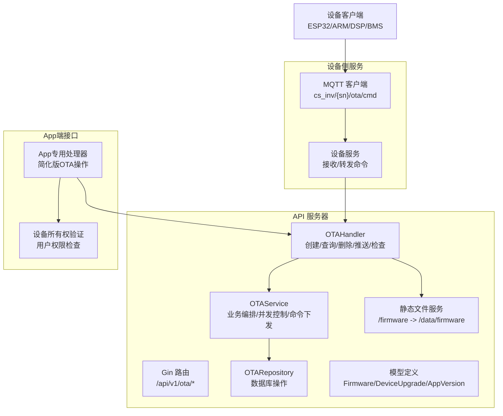
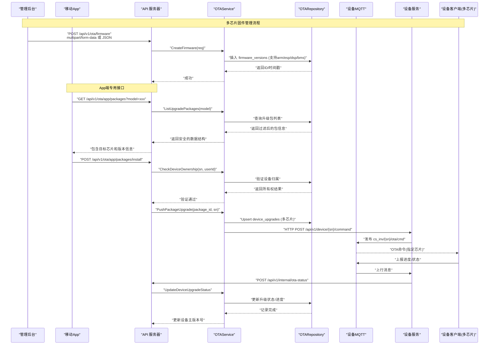
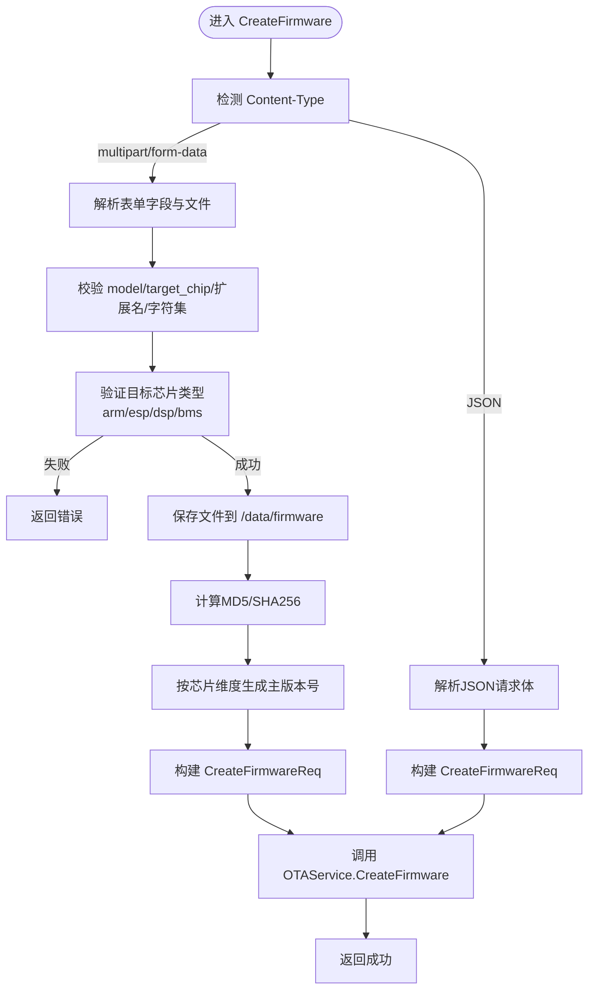
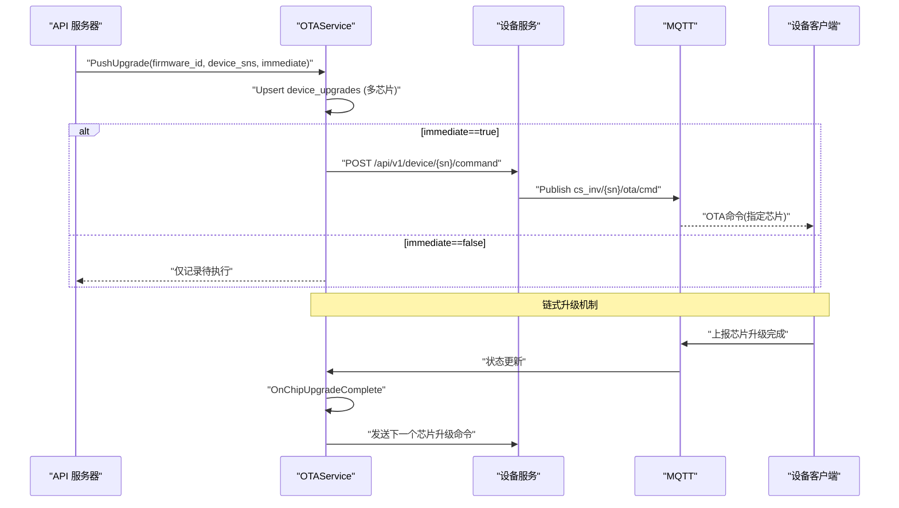
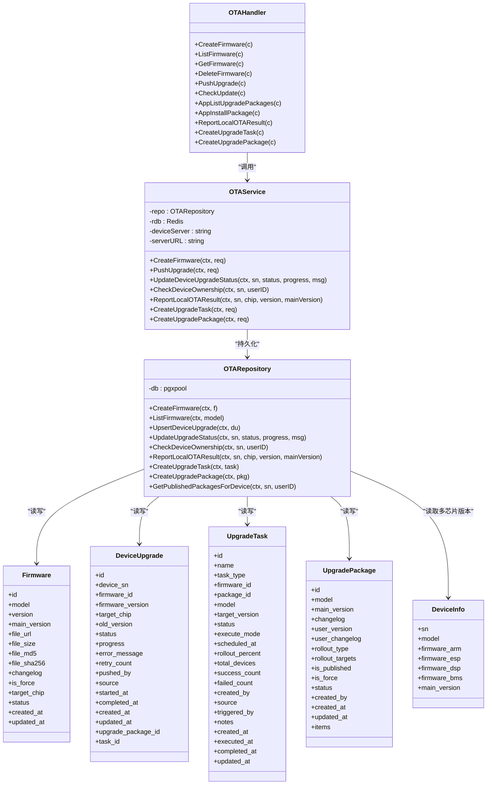

# 固件管理

<cite>
**本文引用的文件**
- [inv_api_server/cmd/main.go](file://inv_api_server/cmd/main.go)
- [inv_api_server/internal/handler/ota_handler.go](file://inv_api_server/internal/handler/ota_handler.go)
- [inv_api_server/internal/service/ota_service.go](file://inv_api_server/internal/service/ota_service.go)
- [inv_api_server/internal/repository/ota_repository.go](file://inv_api_server/internal/repository/ota_repository.go)
- [inv_api_server/internal/model/models.go](file://inv_api_server/internal/model/models.go)
- [inv_api_server/internal/handler/internal_handler.go](file://inv_api_server/internal/handler/internal_handler.go)
- [database/migrations/013_ota_source_and_package_enhance.up.sql](file://database/migrations/013_ota_source_and_package_enhance.up.sql)
- [inv_device_server/internal/mqtt/client.go](file://inv_device_server/internal/mqtt/client.go)
- [README.md](file://README.md)
</cite>

## 更新摘要
**变更内容**
- 增强数据库层以支持多芯片固件版本管理，新增 firmware_dsp、firmware_bms 和 main_version 字段
- 完善设备查询方法，支持四种芯片架构（ARM、ESP、DSP、BMS）的独立版本跟踪
- 改进仓储层方法，实现基于目标芯片类型的动态SQL查询
- 强化升级包管理模式，支持链式升级和自动触发下一芯片
- 优化本地OTA结果上报机制，支持多芯片版本同步更新
- **新增** 升级任务来源追踪功能，支持 admin/app/local 三种来源标识
- **新增** 升级包面向App的发布控制，支持用户版本号和灰度发布策略
- **新增** 审计日志字段，记录操作者信息和备注信息

## 目录
1. [简介](#简介)
2. [项目结构](#项目结构)
3. [核心组件](#核心组件)
4. [架构总览](#架构总览)
5. [详细组件分析](#详细组件分析)
6. [依赖关系分析](#依赖关系分析)
7. [性能考量](#性能考量)
8. [故障排查指南](#故障排查指南)
9. [结论](#结论)
10. [附录](#附录)

## 简介
本文件面向固件管理系统，围绕"创建、上传、验证、存储、查询、列表、删除"等关键能力进行技术说明，并覆盖版本控制策略、上传机制（multipart/form-data 与 JSON）、文件命名与安全校验、存储路径与扩展名过滤、以及升级下发与状态回传的完整流程。系统现已支持多芯片固件管理（ESP32、ARM、DSP、BMS），提供App端专用接口，并具备完善的设备所有权验证和安全控制机制。

**更新** 系统现已全面支持四种芯片架构的独立版本管理，包括DSP和BMS芯片的专门处理，实现了完整的链式升级机制和多芯片版本同步。同时增强了审计追踪和发布控制功能，提供更精细化的固件管理体验。

## 项目结构
固件管理相关代码主要分布在 API 服务器与设备侧服务之间：
- API 服务器负责固件元数据与升级任务的管理、路由与鉴权、静态文件服务与下载。
- 设备侧服务负责将升级命令通过 MQTT 下发至设备，并接收设备上报的状态。
- 新增App端接口层，为移动应用提供简化的OTA操作能力。

**图示来源**
- [inv_api_server/cmd/main.go:685-693](file://inv_api_server/cmd/main.go#L685-L693)
- [inv_api_server/internal/handler/ota_handler.go:1015-1101](file://inv_api_server/internal/handler/ota_handler.go#L1015-L1101)
- [inv_api_server/internal/handler/ota_handler.go:978-1013](file://inv_api_server/internal/handler/ota_handler.go#L978-L1013)

章节来源
- [inv_api_server/cmd/main.go:685-693](file://inv_api_server/cmd/main.go#L685-L693)
- [inv_api_server/internal/handler/ota_handler.go:1015-1101](file://inv_api_server/internal/handler/ota_handler.go#L1015-L1101)

## 核心组件
- 路由与鉴权：/api/v1/ota 下的固件与升级相关接口均受 JWT 鉴权保护，并按权限资源"ota"细分视图、创建、删除、控制等操作。新增App端接口无需额外权限但需要登录认证。
- 处理器（Handler）：负责请求解析、参数校验、文件上传与哈希计算、调用服务层并返回统一响应。新增App专用处理器处理移动端简化操作。
- 服务层（Service）：封装业务逻辑，如自动生成主版本号、并发推送升级、构造下载URL、发送 MQTT 命令、设备所有权验证等。
- 仓储层（Repository）：封装数据库访问，包括固件表与设备升级表的增删改查、聚合统计与状态更新、多芯片版本管理。
- 模型（Model）：定义固件、设备升级、应用版本、升级包等数据结构及序列化字段，支持多芯片版本字段。
- 静态文件服务：对外暴露 /firmware 路径，设备直接从该路径下载固件文件。

**章节来源**
- [inv_api_server/cmd/main.go:685-702](file://inv_api_server/cmd/main.go#L685-L702)
- [inv_api_server/internal/handler/ota_handler.go:22-28](file://inv_api_server/internal/handler/ota_handler.go#L22-L28)
- [inv_api_server/internal/service/ota_service.go:25-45](file://inv_api_server/internal/service/ota_service.go#L25-L45)
- [inv_api_server/internal/repository/ota_repository.go:14-20](file://inv_api_server/internal/repository/ota_repository.go#L14-L20)
- [inv_api_server/internal/model/models.go:286-302](file://inv_api_server/internal/model/models.go#L286-L302)

## 架构总览
固件管理的端到端流程现已支持多芯片管理和App端操作：
- 管理后台上传固件或通过 JSON 提交元数据，服务层生成主版本号并入库。
- App端可通过专用接口查询可用升级包并触发安装。
- 设备侧通过 /api/v1/ota/check/{sn} 接口查询是否有待执行的管理员推送升级；若有则返回升级所需信息。
- 管理员可通过 /api/v1/ota/upgrades/push 将升级任务推送给设备，服务层并发发送 MQTT 命令。
- 设备下载固件并上报升级状态，设备服务接收状态并通过内部接口回传给 API 服务器，服务层更新数据库。
- APP/管理后台可查看升级仪表盘、历史与详情，支持回滚操作。

**图示来源**
- [inv_api_server/internal/handler/ota_handler.go:1015-1101](file://inv_api_server/internal/handler/ota_handler.go#L1015-L1101)
- [inv_api_server/internal/service/ota_service.go:517-625](file://inv_api_server/internal/service/ota_service.go#L517-L625)
- [inv_api_server/internal/repository/ota_repository.go:750-793](file://inv_api_server/internal/repository/ota_repository.go#L750-793)
- [inv_device_server/internal/mqtt/client.go:248-278](file://inv_device_server/internal/mqtt/client.go#L248-L278)

## 详细组件分析

### 多芯片固件版本管理
**更新** 系统现已支持四种芯片类型的独立版本管理，并在所有设备查询方法中集成了新的字段：
- **ESP32**：通信和控制芯片，版本格式 Vx.y.z.YYYYMMDD
- **ARM**：主控制芯片，版本格式 Vx.y.z.YYYYMMDD  
- **DSP**：数字信号处理芯片，版本格式 Vx.y.z.YYYYMMDD
- **BMS**：电池管理系统芯片，版本格式 Vx.y.z.YYYYMMDD

每个芯片都有独立的固件文件和版本控制，支持按芯片维度查询最新主版本号，确保同一芯片族的主版本连续性。

**更新** 数据库层已增强，在 devices 表中新增了 firmware_dsp 和 firmware_bms 字段，并在所有设备查询方法中包含 main_version 字段，实现了完整的多芯片版本跟踪。

**图示来源**
- [inv_api_server/internal/handler/ota_handler.go:42-151](file://inv_api_server/internal/handler/ota_handler.go#L42-L151)
- [inv_api_server/internal/service/ota_service.go:59-100](file://inv_api_server/internal/service/ota_service.go#L59-L100)

**章节来源**
- [inv_api_server/internal/handler/ota_handler.go:42-151](file://inv_api_server/internal/handler/ota_handler.go#L42-L151)
- [inv_api_server/internal/service/ota_service.go:59-100](file://inv_api_server/internal/service/ota_service.go#L59-L100)
- [database/migrations/010_add_dsp_bms_versions.up.sql:1-4](file://database/migrations/010_add_dsp_bms_versions.up.sql#L1-L4)

### 设备查询方法增强
**新增** 所有设备查询方法现在都支持多芯片版本信息的完整获取：

#### GetDeviceBySN 方法增强
- **功能**：根据设备序列号获取完整设备信息
- **新增字段**：firmware_dsp、firmware_bms、main_version
- **返回值**：DeviceInfo 结构体，包含所有芯片版本信息

#### DeviceInfo 结构体增强
- **字段扩展**：新增 FirmwareDSP、FirmwareBMS、MainVersion 字段
- **版本汇总**：VersionSummary() 方法生成合并主版本号
- **芯片版本映射**：ChipVersions() 方法返回结构化版本映射

**章节来源**
- [inv_api_server/internal/repository/ota_repository.go:394-405](file://inv_api_server/internal/repository/ota_repository.go#L394-L405)
- [inv_api_server/internal/repository/ota_repository.go:344-391](file://inv_api_server/internal/repository/ota_repository.go#L344-L391)
- [inv_api_server/internal/model/models.go:43-69](file://inv_api_server/internal/model/models.go#L43-L69)

### 动态SQL查询优化
**新增** 仓储层实现了基于目标芯片类型的动态SQL查询：

#### 动态列选择
- **智能列更新**：根据 target_chip 字段动态选择更新的列名
- **SQL注入防护**：使用预编译语句和严格的白名单验证
- **性能优化**：避免不必要的列更新操作

#### 芯片版本同步
- **实时同步**：设备升级完成后自动更新对应芯片版本
- **主版本维护**：所有芯片升级完成后更新设备主版本号
- **版本一致性**：确保各芯片版本与主版本的协调一致

**章节来源**
- [inv_api_server/internal/handler/internal_handler.go:650-696](file://inv_api_server/internal/handler/internal_handler.go#L650-696)
- [inv_api_server/internal/repository/ota_repository.go:795-799](file://inv_api_server/internal/repository/ota_repository.go#L795-L799)

### App端专用OTA接口
**新增** 为移动应用提供简化的OTA操作接口：

#### AppListUpgradePackages - 查询升级包列表
- **接口**：`GET /api/v1/ota/app/packages?model={model}`
- **功能**：返回指定型号的可用升级包，过滤敏感字段
- **安全**：仅需登录认证，无需额外权限
- **返回**：包含目标芯片、固件版本、主版本号等基本信息

#### AppInstallPackage - 安装指定升级包  
- **接口**：`POST /api/v1/ota/app/packages/install`
- **功能**：为用户的设备安装指定的升级包
- **安全**：严格验证设备所有权，防止越权操作
- **流程**：验证用户→检查设备归属→推送升级包

#### ReportLocalOTAResult - 本地OTA结果上报
- **接口**：`POST /api/v1/ota/devices/{sn}/local-ota-result`
- **功能**：设备完成本地OTA后上报新版本号
- **支持**：四种芯片类型（arm/esp/dsp/bms）
- **处理**：更新对应芯片版本和设备主版本号

**章节来源**
- [inv_api_server/internal/handler/ota_handler.go:1015-1101](file://inv_api_server/internal/handler/ota_handler.go#L1015-L1101)
- [inv_api_server/internal/handler/ota_handler.go:978-1013](file://inv_api_server/internal/handler/ota_handler.go#L978-L1013)
- [inv_api_server/cmd/main.go:691-693](file://inv_api_server/cmd/main.go#L691-L693)

### 升级包管理模式
**新增** 支持多芯片固件的组合版本管理：

#### 升级包特性
- **组合版本**：一个升级包可包含多个芯片的固件
- **自动对比**：智能对比设备当前各芯片版本，只升级需要的芯片
- **链式升级**：单芯片升级完成后自动触发下一个芯片
- **回滚支持**：支持对整个升级包进行回滚操作

#### 升级包操作流程
1. **创建升级包**：选择多个芯片的固件，生成统一主版本号
2. **推送升级包**：对比设备版本，为需要升级的芯片创建升级记录
3. **链式执行**：第一个芯片升级完成后，自动触发下一个芯片
4. **版本同步**：所有芯片升级完成后，更新设备主版本号

**章节来源**
- [inv_api_server/internal/service/ota_service.go:452-492](file://inv_api_server/internal/service/ota_service.go#L452-492)
- [inv_api_server/internal/service/ota_service.go:517-625](file://inv_api_server/internal/service/ota_service.go#L517-L625)
- [inv_api_server/internal/service/ota_service.go:704-753](file://inv_api_server/internal/service/ota_service.go#L704-L753)

### 设备所有权安全验证
**增强** 系统现在提供严格的设备所有权验证机制：

#### 验证流程
1. **直接归属检查**：检查设备的 user_id 是否与当前用户匹配
2. **关联关系检查**：查询 user_device_rel 表确认用户与设备的关联关系
3. **权限控制**：只有设备所有者才能执行OTA操作

#### 应用场景
- **App端安装**：用户只能为自己拥有的设备触发升级
- **命令重发**：用户只能重新发送自己设备的升级命令
- **状态查询**：用户只能查看自己设备的升级状态和历史

**章节来源**
- [inv_api_server/internal/handler/ota_handler.go:1076-1087](file://inv_api_server/internal/handler/ota_handler.go#L1076-L1087)
- [inv_api_server/internal/repository/ota_repository.go:407-424](file://inv_api_server/internal/repository/ota_repository.go#L407-L424)

### 版本控制策略
- **主版本号生成**：按目标芯片维度查询最大主版本号，基于"Vx.y.z"的末位数字递增，确保同一芯片族的主版本连续性。
- **子版本**：由调用方提供 version 字段；若为空则由调用方自行决定。
- **强制升级**：is_force 字段用于标记是否强制升级，设备端可据此决定是否阻断用户操作。
- **变更日志**：changelog 字段随固件记录存储，便于展示与审计。
- **升级包主版本**：采用 Va.b.c.YYYYMMDD 格式，支持同一天多次发布的场景。

**更新** 主版本号生成逻辑已优化，支持按芯片类型分别管理，确保不同芯片的版本独立性。

**章节来源**
- [inv_api_server/internal/service/ota_service.go:59-100](file://inv_api_server/internal/service/ota_service.go#L59-L100)
- [inv_api_server/internal/service/ota_service.go:765-804](file://inv_api_server/internal/service/ota_service.go#L765-L804)
- [inv_api_server/internal/model/models.go:286-302](file://inv_api_server/internal/model/models.go#L286-L302)

### 元数据管理
- **关键字段**：model、target_chip、version、main_version、file_url、file_size、file_md5、file_sha256、changelog、is_force、uploaded_by、status、created_at、updated_at。
- **多芯片字段**：devices表新增 firmware_dsp 和 firmware_bms 字段，支持四种芯片的独立版本管理。
- **存储策略**：采用软删除（status=1/0），查询默认只返回有效记录。
- **设备升级关联**：device_upgrades 表记录每台设备的升级状态、进度、错误信息、重试次数等，支持升级包和任务关联。

**更新** 设备元数据管理现已完整支持四种芯片的独立版本跟踪，包括主版本号的统一管理。

**章节来源**
- [inv_api_server/internal/model/models.go:286-302](file://inv_api_server/internal/model/models.go#L286-L302)
- [inv_api_server/internal/model/models.go:304-338](file://inv_api_server/internal/model/models.go#L304-L338)
- [inv_api_server/internal/repository/ota_repository.go:20-78](file://inv_api_server/internal/repository/ota_repository.go#L20-L78)
- [database/migrations/010_add_dsp_bms_versions.up.sql:1-4](file://database/migrations/010_add_dsp_bms_versions.up.sql#L1-L4)

### 存储路径与命名规则
- **路径**：/data/firmware（容器内挂载目录），对外通过 /firmware 暴露。
- **命名**：model_version.ext，其中 ext 来源于上传文件扩展名；若未提供扩展名则仅以 model_version 命名。
- **安全校验**：仅允许字母、数字、点、下划线、连字符；禁止路径穿越与危险字符。

**章节来源**
- [inv_api_server/cmd/main.go:391-392](file://inv_api_server/cmd/main.go#L391-L392)
- [inv_api_server/internal/handler/ota_handler.go:72-87](file://inv_api_server/internal/handler/ota_handler.go#L72-L87)

### 查询、列表与删除
- **列表**：支持按 model 过滤，返回按创建时间倒序的有效固件列表。
- **查询**：按 ID 获取单条固件记录。
- **删除**：软删除（status=0），不影响历史升级记录。
- **升级包列表**：支持按型号过滤，返回包含芯片明细的完整升级包信息。

**更新** 查询方法现已支持按目标芯片类型进行精确筛选，提高了查询效率。

**章节来源**
- [inv_api_server/internal/handler/ota_handler.go:153-188](file://inv_api_server/internal/handler/ota_handler.go#L153-L188)
- [inv_api_server/internal/repository/ota_repository.go:31-80](file://inv_api_server/internal/repository/ota_repository.go#L31-L80)

### 升级推送与下发
- **批量推送**：支持对多个设备 SN 推送同一固件，内部通过并发限制与等待组控制吞吐。
- **多芯片支持**：升级命令包含 target 字段，明确指定要升级的目标芯片。
- **链式升级**：单芯片升级完成后自动触发下一个芯片的升级。
- **立即执行**：immediate=true 时直接下发命令，否则仅记录待执行状态。

**更新** 升级推送逻辑已优化，支持智能版本对比和链式升级机制。

**图示来源**
- [inv_api_server/internal/service/ota_service.go:120-181](file://inv_api_server/internal/service/ota_service.go#L120-L181)
- [inv_api_server/internal/service/ota_service.go:704-753](file://inv_api_server/internal/service/ota_service.go#L704-L753)
- [inv_device_server/internal/mqtt/client.go:248-278](file://inv_device_server/internal/mqtt/client.go#L248-L278)

**章节来源**
- [inv_api_server/internal/service/ota_service.go:120-181](file://inv_api_server/internal/service/ota_service.go#L120-L181)
- [inv_api_server/internal/service/ota_service.go:704-753](file://inv_api_server/internal/service/ota_service.go#L704-L753)
- [inv_device_server/internal/mqtt/client.go:248-278](file://inv_device_server/internal/mqtt/client.go#L248-L278)

### 状态回传与历史查询
- **设备上报**：设备通过 MQTT 主题 cs_inv/{sn}/ota/status 上报状态与进度，设备服务接收后调用内部接口 /api/v1/internal/ota-status，API 服务器更新数据库中的升级记录。
- **历史查询**：支持按设备 SN 分页查询升级历史，支持仪表盘按固件聚合统计。
- **多芯片历史**：升级历史记录包含目标芯片信息，便于追踪各芯片的升级情况。

**更新** 状态回传机制现已支持多芯片版本的实时更新和历史记录的完整追踪。

**章节来源**
- [README.md:281-313](file://README.md#L281-L313)
- [inv_api_server/internal/service/ota_service.go:256-320](file://inv_api_server/internal/service/ota_service.go#L256-L320)
- [inv_api_server/internal/repository/ota_repository.go:155-253](file://inv_api_server/internal/repository/ota_repository.go#L155-L253)

### 审计追踪与来源管理
**新增** 系统现已支持完整的审计追踪功能，记录所有升级操作的来源和详细信息：

#### 升级任务来源追踪
- **source 字段**：标识任务来源，支持 'admin'（管理员）、'app'（App端）、'local'（本地）三种类型
- **triggered_by 字段**：记录触发操作的用户ID，支持操作溯源
- **notes 字段**：支持添加备注信息，便于操作说明和问题追踪

#### 设备升级记录来源
- **device_upgrades.source 字段**：每条设备升级记录都包含来源标识
- **索引优化**：为 source 字段创建索引，提升查询性能

#### 审计日志优势
- **操作溯源**：清晰记录每次升级操作的发起者和来源
- **问题定位**：通过备注信息快速定位问题原因
- **合规性**：满足企业级应用的审计要求

**章节来源**
- [database/migrations/013_ota_source_and_package_enhance.up.sql:8-21](file://database/migrations/013_ota_source_and_package_enhance.up.sql#L8-L21)
- [inv_api_server/internal/model/models.go:315-316](file://inv_api_server/internal/model/models.go#L315-L316)
- [inv_api_server/internal/model/models.go:357-360](file://inv_api_server/internal/model/models.go#L357-L360)

### 升级包发布控制
**新增** 系统现已支持面向App端的精细化发布控制：

#### 用户版本管理
- **user_version 字段**：面向最终用户的版本号，可与内部版本号分离
- **user_changelog 字段**：面向用户的更新说明，简洁易懂
- **版本隔离**：内部开发版本与用户发布版本解耦

#### 灰度发布策略
- **rollout_type 字段**：支持 'all'（全部）、'model'（按型号）、'user'（按用户）、'device'（按设备）四种发布范围
- **rollout_targets 字段**：逗号分隔的目标列表，支持灵活的发布策略
- **is_published 字段**：发布状态控制，未发布的升级包不会向App端暴露

#### 发布控制流程
1. **创建升级包**：设置用户版本号和面向用户的更新说明
2. **配置发布范围**：选择发布类型和目标范围
3. **发布控制**：通过 is_published 字段控制可见性
4. **App端查询**：App端只能看到已发布且符合发布范围的升级包

**章节来源**
- [database/migrations/013_ota_source_and_package_enhance.up.sql:23-32](file://database/migrations/013_ota_source_and_package_enhance.up.sql#L23-L32)
- [inv_api_server/internal/model/models.go:378-383](file://inv_api_server/internal/model/models.go#L378-L383)
- [inv_api_server/internal/repository/ota_repository.go:715-738](file://inv_api_server/internal/repository/ota_repository.go#L715-L738)

### 升级任务管理
**新增** 统一的升级任务管理机制，支持更复杂的升级场景：

#### 任务类型支持
- **single 模式**：单芯片固件升级任务
- **package 模式**：多芯片升级包任务
- **任务状态**：draft（草稿）、pending（待执行）、scheduled（已计划）、running（运行中）、completed（已完成）、partial_success（部分成功）、failed（失败）、cancelled（已取消）

#### 执行模式控制
- **immediate 模式**：立即执行升级任务
- **scheduled 模式**：定时执行升级任务
- **manual 模式**：手动触发执行

#### 灰度发布支持
- **rollout_percent 字段**：支持百分比灰度发布
- **随机选择**：按百分比随机选择目标设备进行灰度测试
- **渐进式发布**：逐步扩大发布范围，降低风险

**章节来源**
- [inv_api_server/internal/service/ota_service.go:1009-1021](file://inv_api_server/internal/service/ota_service.go#L1009-L1021)
- [inv_api_server/internal/service/ota_service.go:1023-1173](file://inv_api_server/internal/service/ota_service.go#L1023-L1173)

## 依赖关系分析
- **组件耦合**
  - Handler 仅依赖 Service 的公开方法，职责清晰。
  - Service 依赖 Repository 与外部设备服务（HTTP）与 MQTT（设备服务）。
  - Repository 依赖数据库连接池，提供事务与并发安全。
- **外部依赖**
  - 数据库：PostgreSQL（PGX 连接池）。
  - 缓存：Redis（用于会话与限流等，此处用于 OTA 任务并发控制）。
  - 设备服务：通过 HTTP 与 MQTT 交互。

**图示来源**
- [inv_api_server/internal/handler/ota_handler.go:22-28](file://inv_api_server/internal/handler/ota_handler.go#L22-L28)
- [inv_api_server/internal/service/ota_service.go:25-45](file://inv_api_server/internal/service/ota_service.go#L25-L45)
- [inv_api_server/internal/repository/ota_repository.go:14-20](file://inv_api_server/internal/repository/ota_repository.go#L14-L20)
- [inv_api_server/internal/model/models.go:286-403](file://inv_api_server/internal/model/models.go#L286-L403)
- [inv_api_server/internal/repository/ota_repository.go:344-352](file://inv_api_server/internal/repository/ota_repository.go#L344-L352)

**章节来源**
- [inv_api_server/internal/handler/ota_handler.go:22-28](file://inv_api_server/internal/handler/ota_handler.go#L22-L28)
- [inv_api_server/internal/service/ota_service.go:25-45](file://inv_api_server/internal/service/ota_service.go#L25-L45)
- [inv_api_server/internal/repository/ota_repository.go:14-20](file://inv_api_server/internal/repository/ota_repository.go#L14-L20)
- [inv_api_server/internal/model/models.go:286-403](file://inv_api_server/internal/model/models.go#L286-L403)

## 性能考量
- **并发控制**：推送升级时使用信号量限制并发数，避免对设备服务与数据库造成瞬时压力。
- **批量处理**：UPSERT device_upgrades 时按设备+固件去重，减少重复任务与冗余状态。
- **聚合查询**：仪表盘按固件维度聚合统计，降低复杂联表查询成本。
- **静态文件**：/firmware 直接映射到 /data/firmware，减少中间层开销，适合高并发下载。
- **多芯片优化**：链式升级机制避免同时升级多个芯片造成的网络拥塞。
- **索引优化**：为新字段创建适当的数据库索引，提升查询性能。

**更新** 多芯片升级的性能优化包括智能版本对比和异步链式处理，显著提升了大规模部署的效率。新增的审计字段和发布控制字段也进行了相应的索引优化。

**章节来源**
- [inv_api_server/internal/service/ota_service.go:134-181](file://inv_api_server/internal/service/ota_service.go#L134-L181)
- [inv_api_server/internal/repository/ota_repository.go:80-107](file://inv_api_server/internal/repository/ota_repository.go#L80-L107)
- [inv_api_server/cmd/main.go:391-392](file://inv_api_server/cmd/main.go#L391-L392)
- [database/migrations/013_ota_source_and_package_enhance.up.sql:14-32](file://database/migrations/013_ota_source_and_package_enhance.up.sql#L14-L32)

## 故障排查指南
- **上传失败**
  - 检查文件保存目录权限与磁盘空间。
  - 确认扩展名与字符集校验是否通过。
  - 查看服务日志中"保存文件失败/读取文件失败/计算文件哈希失败"等错误。
- **下发失败**
  - 确认设备服务可达且内部密钥正确。
  - 检查 MQTT 主题是否为 cs_inv/{sn}/ota/cmd。
  - 查看设备侧日志与设备在线状态。
- **状态不同步**
  - 确认设备上报主题 cs_inv/{sn}/ota/status 是否正确。
  - 检查内部接口 /api/v1/internal/ota-status 是否被调用。
  - 核对 device_upgrades 表中状态流转是否符合预期。
- **多芯片升级问题**
  - 检查各芯片版本字段是否正确更新。
  - 确认链式升级机制是否正常工作。
  - 验证设备主版本号是否在所有芯片升级完成后更新。
- **App端接口问题**
  - 检查设备所有权验证是否通过。
  - 确认用户权限和设备关联关系。
  - 查看升级包列表过滤逻辑是否正常。
- **审计追踪问题**
  - 检查 source、triggered_by、notes 字段是否正确记录。
  - 确认升级任务的来源标识是否准确。
  - 验证发布控制逻辑是否按预期工作。
- **发布控制问题**
  - 检查 is_published 字段状态是否正确。
  - 确认 rollout_type 和 rollout_targets 配置是否合理。
  - 验证App端查询是否按发布范围正确过滤。

**更新** 新增审计追踪和发布控制相关的故障排查要点，帮助快速定位新功能的潜在问题。

**章节来源**
- [inv_api_server/internal/handler/ota_handler.go:84-103](file://inv_api_server/internal/handler/ota_handler.go#L84-L103)
- [inv_device_server/internal/mqtt/client.go:248-278](file://inv_device_server/internal/mqtt/client.go#L248-L278)
- [README.md:281-313](file://README.md#L281-L313)

## 结论
本固件管理系统以清晰的分层设计实现了从上传、校验、存储到推送、状态回传的完整闭环。通过严格的参数与扩展名校验、主版本号自动生成、并发控制与聚合统计，系统在保证安全性的同时具备良好的可维护性与扩展性。新增的多芯片支持、App端专用接口和增强的安全验证机制，使系统能够更好地满足现代物联网设备的固件管理需求。

**更新** 经过本次增强，系统现已完全支持四种芯片架构的独立版本管理，实现了完整的链式升级机制和多芯片版本同步。新增的审计追踪功能和发布控制机制，为企业级应用提供了更强的可追溯性和灵活性。建议在生产环境中配合完善的备份与监控策略，持续优化并发阈值与存储容量。

## 附录

### API 路由与权限对照
- **管理后台接口**（需要相应权限）
  - /api/v1/ota/firmware
    - GET：列出固件（权限：ota:view）
    - GET /:id：获取固件详情（权限：ota:view）
    - POST：创建固件（权限：ota:create）
    - DELETE /:id：删除固件（权限：ota:delete）
  - /api/v1/ota/upgrades/*
    - GET /dashboard：升级仪表盘（权限：ota:view）
    - POST /push：推送升级（权限：ota:create）
    - GET /firmware/:firmwareId：固件升级详情（权限：ota:view）
    - POST /retry：重试失败升级（权限：ota:control）
    - POST /cancel：取消待执行升级（权限：ota:control）
  - /api/v1/ota/tasks/*
    - POST /create：创建升级任务（权限：ota:create）
    - GET /list：查询任务列表（权限：ota:view）
    - POST /execute：执行升级任务（权限：ota:control）
  - /api/v1/ota/packages/*
    - POST /create：创建升级包（权限：ota:create）
    - GET /list：查询升级包列表（权限：ota:view）
    - GET /:id：获取升级包详情（权限：ota:view）
    - DELETE /:id：删除升级包（权限：ota:delete）

- **App端接口**（仅需登录认证）
  - /api/v1/ota/check/{sn}：检查设备更新
  - /api/v1/ota/trigger：触发设备升级
  - /api/v1/ota/resend/{sn}：重发升级命令
  - /api/v1/ota/devices/{sn}/status：获取设备升级状态
  - /api/v1/ota/devices/{sn}/history：获取设备升级历史
  - /api/v1/ota/devices/{sn}/local-ota-result：上报本地OTA结果
  - /api/v1/ota/app/packages：查询升级包列表
  - /api/v1/ota/app/packages/install：安装指定升级包

**章节来源**
- [inv_api_server/cmd/main.go:685-702](file://inv_api_server/cmd/main.go#L685-L702)

### 最佳实践与安全建议
- **上传安全**
  - 严格限制文件类型与扩展名，仅允许 .bin 等二进制固件扩展名。
  - 在网关层设置上传大小上限与速率限制。
  - 对 model 与 version 字段进行白名单校验。
- **存储安全**
  - 将 /data/firmware 挂载到受限卷，限制写权限。
  - 定期清理过期固件与空闲文件，控制存储占用。
- **下发安全**
  - 使用 HTTPS 与内部密钥（X-Internal-Key）保护设备服务接口。
  - 对 MQTT 主题进行最小权限订阅，避免泄露敏感通道。
- **版本治理**
  - 明确主版本号规则（如 V1.0.1），避免跨主版本的误推。
  - 强制升级需谨慎使用，建议配合变更日志与灰度策略。
  - 多芯片升级建议使用升级包模式，确保版本一致性。
- **设备安全**
  - 实施严格的设备所有权验证，防止越权操作。
  - 对用户设备进行权限隔离，确保数据安全。
- **可观测性**
  - 开启 Prometheus/Grafana 指标，监控 OTA 推送成功率与失败率。
  - 记录关键链路日志，便于问题定位与审计。
  - 监控多芯片升级的链式执行状态。
- **审计合规**
  - 充分利用 source、triggered_by、notes 字段进行完整审计。
  - 定期审查升级操作日志，发现异常行为。
  - 建立操作审批流程，确保重要升级的可控性。
- **发布管理**
  - 合理使用 rollout_type 和 rollout_targets 进行精准发布。
  - 通过 is_published 字段控制发布时机，避免意外曝光。
  - 建立灰度发布流程，降低大规模发布风险。

**更新** 新增审计追踪和发布控制的实践建议，帮助企业更好地利用新功能提升固件管理的规范性和安全性。