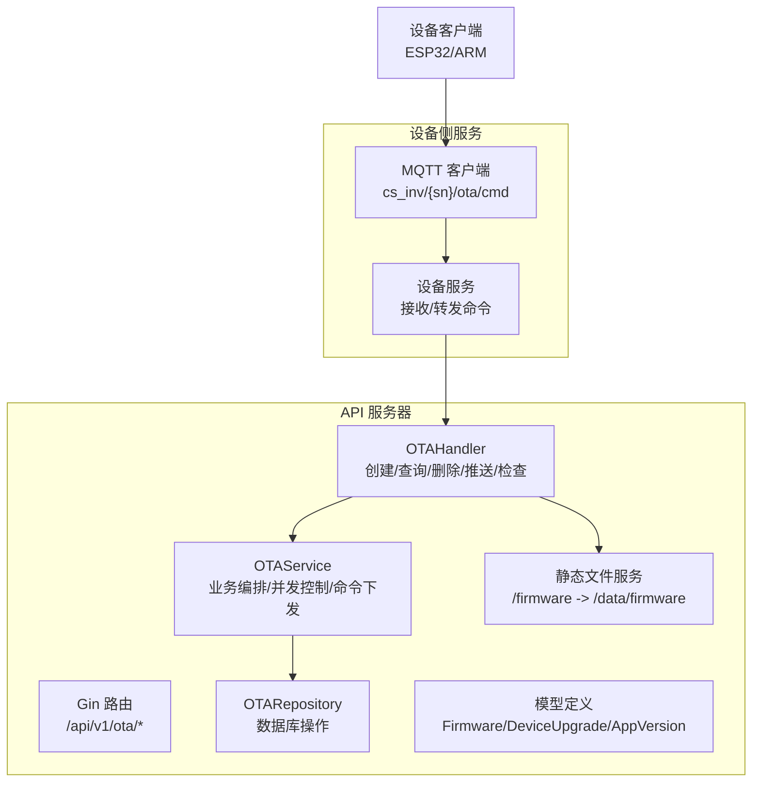
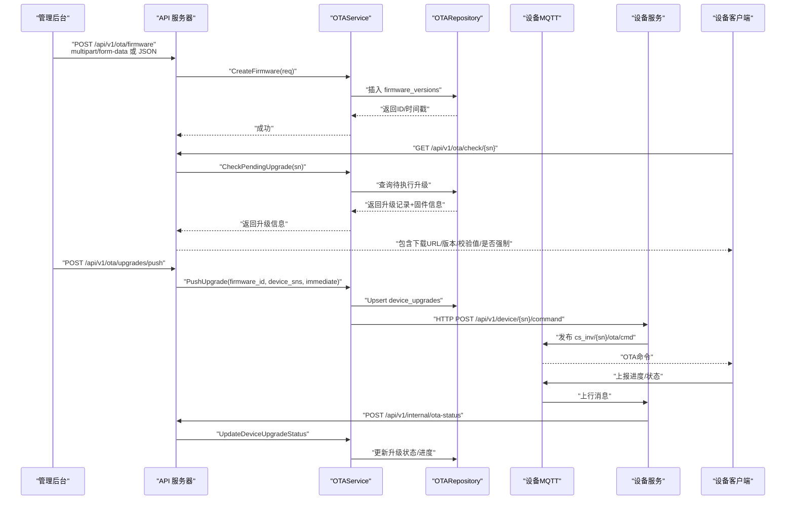
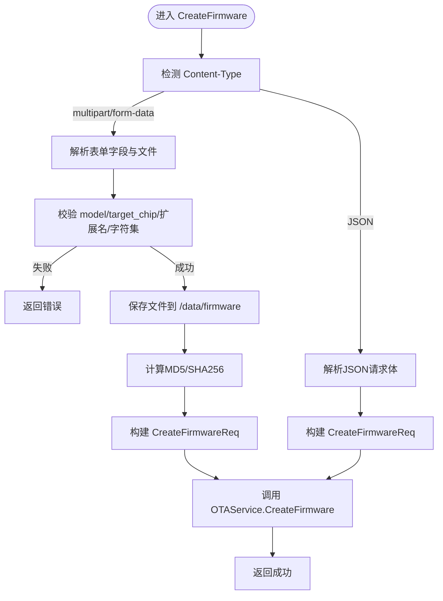
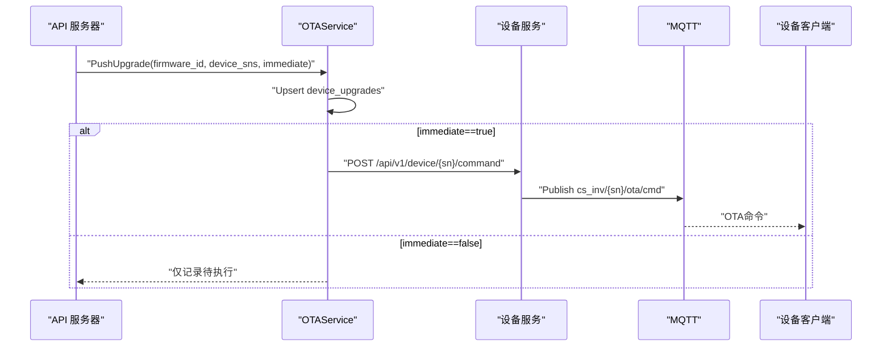
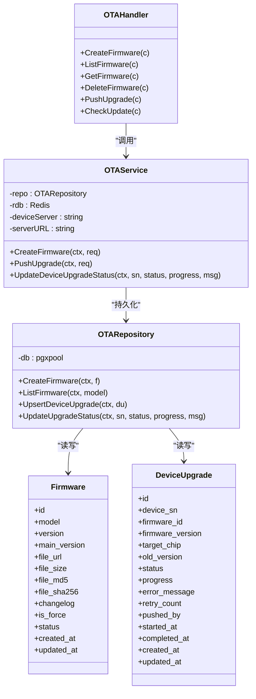

# 固件管理

<cite>
**本文引用的文件**
- [inv_api_server/cmd/main.go](file://inv_api_server/cmd/main.go)
- [inv_api_server/internal/handler/ota_handler.go](file://inv_api_server/internal/handler/ota_handler.go)
- [inv_api_server/internal/service/ota_service.go](file://inv_api_server/internal/service/ota_service.go)
- [inv_api_server/internal/repository/ota_repository.go](file://inv_api_server/internal/repository/ota_repository.go)
- [inv_api_server/internal/model/models.go](file://inv_api_server/internal/model/models.go)
- [inv_device_server/internal/mqtt/client.go](file://inv_device_server/internal/mqtt/client.go)
- [README.md](file://README.md)
</cite>

## 目录
1. [简介](#简介)
2. [项目结构](#项目结构)
3. [核心组件](#核心组件)
4. [架构总览](#架构总览)
5. [详细组件分析](#详细组件分析)
6. [依赖关系分析](#依赖关系分析)
7. [性能考量](#性能考量)
8. [故障排查指南](#故障排查指南)
9. [结论](#结论)
10. [附录](#附录)

## 简介
本文件面向固件管理系统，围绕“创建、上传、验证、存储、查询、列表、删除”等关键能力进行技术说明，并覆盖版本控制策略、上传机制（multipart/form-data 与 JSON）、文件命名与安全校验、存储路径与扩展名过滤、以及升级下发与状态回传的完整流程。文档同时给出最佳实践与安全建议，帮助开发者与运维人员高效、安全地维护固件版本与设备升级。

## 项目结构
固件管理相关代码主要分布在 API 服务器与设备侧服务之间：
- API 服务器负责固件元数据与升级任务的管理、路由与鉴权、静态文件服务与下载。
- 设备侧服务负责将升级命令通过 MQTT 下发至设备，并接收设备上报的状态。

图示来源
- [inv_api_server/cmd/main.go:391-392](file://inv_api_server/cmd/main.go#L391-L392)
- [inv_api_server/cmd/main.go:544-572](file://inv_api_server/cmd/main.go#L544-L572)
- [inv_api_server/internal/handler/ota_handler.go:40-149](file://inv_api_server/internal/handler/ota_handler.go#L40-L149)
- [inv_api_server/internal/service/ota_service.go:120-234](file://inv_api_server/internal/service/ota_service.go#L120-L234)
- [inv_device_server/internal/mqtt/client.go:248-278](file://inv_device_server/internal/mqtt/client.go#L248-L278)

章节来源
- [inv_api_server/cmd/main.go:391-392](file://inv_api_server/cmd/main.go#L391-L392)
- [inv_api_server/cmd/main.go:544-572](file://inv_api_server/cmd/main.go#L544-L572)

## 核心组件
- 路由与鉴权：/api/v1/ota 下的固件与升级相关接口均受 JWT 鉴权保护，并按权限资源“ota”细分视图、创建、删除、控制等操作。
- 处理器（Handler）：负责请求解析、参数校验、文件上传与哈希计算、调用服务层并返回统一响应。
- 服务层（Service）：封装业务逻辑，如自动生成主版本号、并发推送升级、构造下载 URL、发送 MQTT 命令等。
- 仓储层（Repository）：封装数据库访问，包括固件表与设备升级表的增删改查、聚合统计与状态更新。
- 模型（Model）：定义固件、设备升级、应用版本等数据结构及序列化字段。
- 静态文件服务：对外暴露 /firmware 路径，设备直接从该路径下载固件文件。

章节来源
- [inv_api_server/cmd/main.go:544-572](file://inv_api_server/cmd/main.go#L544-L572)
- [inv_api_server/internal/handler/ota_handler.go:28-149](file://inv_api_server/internal/handler/ota_handler.go#L28-L149)
- [inv_api_server/internal/service/ota_service.go:22-42](file://inv_api_server/internal/service/ota_service.go#L22-L42)
- [inv_api_server/internal/repository/ota_repository.go:12-18](file://inv_api_server/internal/repository/ota_repository.go#L12-L18)
- [inv_api_server/internal/model/models.go:283-324](file://inv_api_server/internal/model/models.go#L283-L324)

## 架构总览
固件管理的端到端流程如下：
- 管理后台上传固件或通过 JSON 提交元数据，服务层生成主版本号并入库。
- 设备侧通过 /api/v1/ota/check/{sn} 接口查询是否有待执行的管理员推送升级；若有则返回升级所需信息。
- 管理员可通过 /api/v1/ota/upgrades/push 将升级任务推送给设备，服务层并发发送 MQTT 命令。
- 设备下载固件并上报升级状态，设备服务接收状态并通过内部接口回传给 API 服务器，服务层更新数据库。
- APP/管理后台可查看升级仪表盘、历史与详情。

图示来源
- [inv_api_server/internal/handler/ota_handler.go:40-149](file://inv_api_server/internal/handler/ota_handler.go#L40-L149)
- [inv_api_server/internal/service/ota_service.go:120-234](file://inv_api_server/internal/service/ota_service.go#L120-L234)
- [inv_api_server/internal/repository/ota_repository.go:80-153](file://inv_api_server/internal/repository/ota_repository.go#L80-L153)
- [inv_device_server/internal/mqtt/client.go:248-278](file://inv_device_server/internal/mqtt/client.go#L248-L278)
- [README.md:253-342](file://README.md#L253-L342)

## 详细组件分析

### 上传与创建流程（multipart/form-data 与 JSON）
- multipart/form-data 上传
  - 字段：model、target_chip、version、changelog、is_force、file。
  - 安全校验：对 model、version 使用正则校验允许的字符集；对扩展名进行字符集校验；禁止危险字符。
  - 文件保存：写入 /data/firmware/<model>_<version>.<ext>；若目录不存在则创建。
  - 哈希计算：同时计算 MD5 与 SHA256 并存入元数据。
  - 元数据入库：调用服务层创建固件记录。
- JSON 方式
  - 请求体包含 model、target_chip、version、file_url、file_size、file_md5、file_sha256、changelog、is_force。
  - 适用于外部系统直传文件并提供校验值的场景。

图示来源
- [inv_api_server/internal/handler/ota_handler.go:40-149](file://inv_api_server/internal/handler/ota_handler.go#L40-L149)

章节来源
- [inv_api_server/internal/handler/ota_handler.go:40-149](file://inv_api_server/internal/handler/ota_handler.go#L40-L149)

### 版本控制策略
- 主版本号生成：按目标芯片维度查询最大主版本号，基于“Vx.y.z”的末位数字递增，确保同一芯片族的主版本连续性。
- 子版本：由调用方提供 version 字段；若为空则由调用方自行决定。
- 强制升级：is_force 字段用于标记是否强制升级，设备端可据此决定是否阻断用户操作。
- 变更日志：changelog 字段随固件记录存储，便于展示与审计。

章节来源
- [inv_api_server/internal/service/ota_service.go:56-97](file://inv_api_server/internal/service/ota_service.go#L56-L97)
- [inv_api_server/internal/model/models.go:283-299](file://inv_api_server/internal/model/models.go#L283-L299)

### 元数据管理
- 关键字段：model、target_chip、version、main_version、file_url、file_size、file_md5、file_sha256、changelog、is_force、uploaded_by、status、created_at、updated_at。
- 存储策略：采用软删除（status=1/0），查询默认只返回有效记录。
- 设备升级关联：device_upgrades 表记录每台设备的升级状态、进度、错误信息、重试次数等。

章节来源
- [inv_api_server/internal/model/models.go:283-324](file://inv_api_server/internal/model/models.go#L283-L324)
- [inv_api_server/internal/repository/ota_repository.go:20-78](file://inv_api_server/internal/repository/ota_repository.go#L20-L78)
- [inv_api_server/internal/repository/ota_repository.go:80-153](file://inv_api_server/internal/repository/ota_repository.go#L80-L153)

### 存储路径与命名规则
- 路径：/data/firmware（容器内挂载目录），对外通过 /firmware 暴露。
- 命名：model_version.ext，其中 ext 来源于上传文件扩展名；若未提供扩展名则仅以 model_version 命名。
- 安全校验：仅允许字母、数字、点、下划线、连字符；禁止路径穿越与危险字符。

章节来源
- [inv_api_server/cmd/main.go:391-392](file://inv_api_server/cmd/main.go#L391-L392)
- [inv_api_server/internal/handler/ota_handler.go:72-87](file://inv_api_server/internal/handler/ota_handler.go#L72-L87)

### 查询、列表与删除
- 列表：支持按 model 过滤，返回按创建时间倒序的有效固件列表。
- 查询：按 ID 获取单条固件记录。
- 删除：软删除（status=0），不影响历史升级记录。

章节来源
- [inv_api_server/internal/handler/ota_handler.go:151-186](file://inv_api_server/internal/handler/ota_handler.go#L151-L186)
- [inv_api_server/internal/repository/ota_repository.go:29-78](file://inv_api_server/internal/repository/ota_repository.go#L29-L78)

### 升级推送与下发
- 批量推送：支持对多个设备 SN 推送同一固件，内部通过并发限制与等待组控制吞吐。
- 下发命令：服务层构造 OTA 命令（包含 target、url、version、file_md5、file_sha256、file_size、upgrade_id），通过 HTTP 调用设备服务的命令接口，设备服务再将消息发布到 MQTT 主题 cs_inv/{sn}/ota/cmd。
- 立即执行：immediate=true 时直接下发命令，否则仅记录待执行状态。

图示来源
- [inv_api_server/internal/service/ota_service.go:120-181](file://inv_api_server/internal/service/ota_service.go#L120-L181)
- [inv_device_server/internal/mqtt/client.go:248-278](file://inv_device_server/internal/mqtt/client.go#L248-L278)

章节来源
- [inv_api_server/internal/service/ota_service.go:120-181](file://inv_api_server/internal/service/ota_service.go#L120-L181)
- [inv_device_server/internal/mqtt/client.go:248-278](file://inv_device_server/internal/mqtt/client.go#L248-L278)

### 状态回传与历史查询
- 设备上报：设备通过 MQTT 主题 cs_inv/{sn}/ota/status 上报状态与进度，设备服务接收后调用内部接口 /api/v1/internal/ota-status，API 服务器更新数据库中的升级记录。
- 历史查询：支持按设备 SN 分页查询升级历史，支持仪表盘按固件聚合统计。

章节来源
- [README.md:281-313](file://README.md#L281-L313)
- [inv_api_server/internal/service/ota_service.go:242-244](file://inv_api_server/internal/service/ota_service.go#L242-L244)
- [inv_api_server/internal/repository/ota_repository.go:155-253](file://inv_api_server/internal/repository/ota_repository.go#L155-L253)

## 依赖关系分析
- 组件耦合
  - Handler 仅依赖 Service 的公开方法，职责清晰。
  - Service 依赖 Repository 与外部设备服务（HTTP）与 MQTT（设备服务）。
  - Repository 依赖数据库连接池，提供事务与并发安全。
- 外部依赖
  - 数据库：PostgreSQL（PGX 连接池）。
  - 缓存：Redis（用于会话与限流等，此处用于 OTA 任务并发控制）。
  - 设备服务：通过 HTTP 与 MQTT 交互。

图示来源
- [inv_api_server/internal/handler/ota_handler.go:20-26](file://inv_api_server/internal/handler/ota_handler.go#L20-L26)
- [inv_api_server/internal/service/ota_service.go:22-42](file://inv_api_server/internal/service/ota_service.go#L22-L42)
- [inv_api_server/internal/repository/ota_repository.go:12-18](file://inv_api_server/internal/repository/ota_repository.go#L12-L18)
- [inv_api_server/internal/model/models.go:283-324](file://inv_api_server/internal/model/models.go#L283-L324)

章节来源
- [inv_api_server/internal/handler/ota_handler.go:20-26](file://inv_api_server/internal/handler/ota_handler.go#L20-L26)
- [inv_api_server/internal/service/ota_service.go:22-42](file://inv_api_server/internal/service/ota_service.go#L22-L42)
- [inv_api_server/internal/repository/ota_repository.go:12-18](file://inv_api_server/internal/repository/ota_repository.go#L12-L18)
- [inv_api_server/internal/model/models.go:283-324](file://inv_api_server/internal/model/models.go#L283-L324)

## 性能考量
- 并发控制：推送升级时使用信号量限制并发数，避免对设备服务与数据库造成瞬时压力。
- 批量处理：UPSERT device_upgrades 时按设备+固件去重，减少重复任务与冗余状态。
- 聚合查询：仪表盘按固件维度聚合统计，降低复杂联表查询成本。
- 静态文件：/firmware 直接映射到 /data/firmware，减少中间层开销，适合高并发下载。

章节来源
- [inv_api_server/internal/service/ota_service.go:134-181](file://inv_api_server/internal/service/ota_service.go#L134-L181)
- [inv_api_server/internal/repository/ota_repository.go:80-107](file://inv_api_server/internal/repository/ota_repository.go#L80-L107)
- [inv_api_server/cmd/main.go:391-392](file://inv_api_server/cmd/main.go#L391-L392)

## 故障排查指南
- 上传失败
  - 检查文件保存目录权限与磁盘空间。
  - 确认扩展名与字符集校验是否通过。
  - 查看服务日志中“保存文件失败/读取文件失败/计算文件哈希失败”等错误。
- 下发失败
  - 确认设备服务可达且内部密钥正确。
  - 检查 MQTT 主题是否为 cs_inv/{sn}/ota/cmd。
  - 查看设备侧日志与设备在线状态。
- 状态不同步
  - 确认设备上报主题 cs_inv/{sn}/ota/status 是否正确。
  - 检查内部接口 /api/v1/internal/ota-status 是否被调用。
  - 核对 device_upgrades 表中状态流转是否符合预期。

章节来源
- [inv_api_server/internal/handler/ota_handler.go:84-103](file://inv_api_server/internal/handler/ota_handler.go#L84-L103)
- [inv_device_server/internal/mqtt/client.go:248-278](file://inv_device_server/internal/mqtt/client.go#L248-L278)
- [README.md:281-313](file://README.md#L281-L313)

## 结论
本固件管理系统以清晰的分层设计实现了从上传、校验、存储到推送、状态回传的完整闭环。通过严格的参数与扩展名校验、主版本号自动生成、并发控制与聚合统计，系统在保证安全性的同时具备良好的可维护性与扩展性。建议在生产环境中配合完善的备份与监控策略，持续优化并发阈值与存储容量。

## 附录

### API 路由与权限对照
- /api/v1/ota/firmware
  - GET：列出固件（权限：ota:view）
  - GET /:id：获取固件详情（权限：ota:view）
  - POST：创建固件（权限：ota:create）
  - DELETE /:id：删除固件（权限：ota:delete）
- /api/v1/ota/upgrades/*
  - GET /dashboard：升级仪表盘（权限：ota:view）
  - POST /push：推送升级（权限：ota:create）
  - GET /firmware/:firmwareId：固件升级详情（权限：ota:view）
  - POST /retry：重试失败升级（权限：ota:control）
  - POST /cancel：取消待执行升级（权限：ota:control）

章节来源
- [inv_api_server/cmd/main.go:544-572](file://inv_api_server/cmd/main.go#L544-L572)

### 最佳实践与安全建议
- 上传安全
  - 严格限制文件类型与扩展名，仅允许 .bin 等二进制固件扩展名。
  - 在网关层设置上传大小上限与速率限制。
  - 对 model 与 version 字段进行白名单校验。
- 存储安全
  - 将 /data/firmware 挂载到受限卷，限制写权限。
  - 定期清理过期固件与空闲文件，控制存储占用。
- 下发安全
  - 使用 HTTPS 与内部密钥（X-Internal-Key）保护设备服务接口。
  - 对 MQTT 主题进行最小权限订阅，避免泄露敏感通道。
- 版本治理
  - 明确主版本号规则（如 V1.0.1），避免跨主版本的误推。
  - 强制升级需谨慎使用，建议配合变更日志与灰度策略。
- 可观测性
  - 开启 Prometheus/Grafana 指标，监控 OTA 推送成功率与失败率。
  - 记录关键链路日志，便于问题定位与审计。