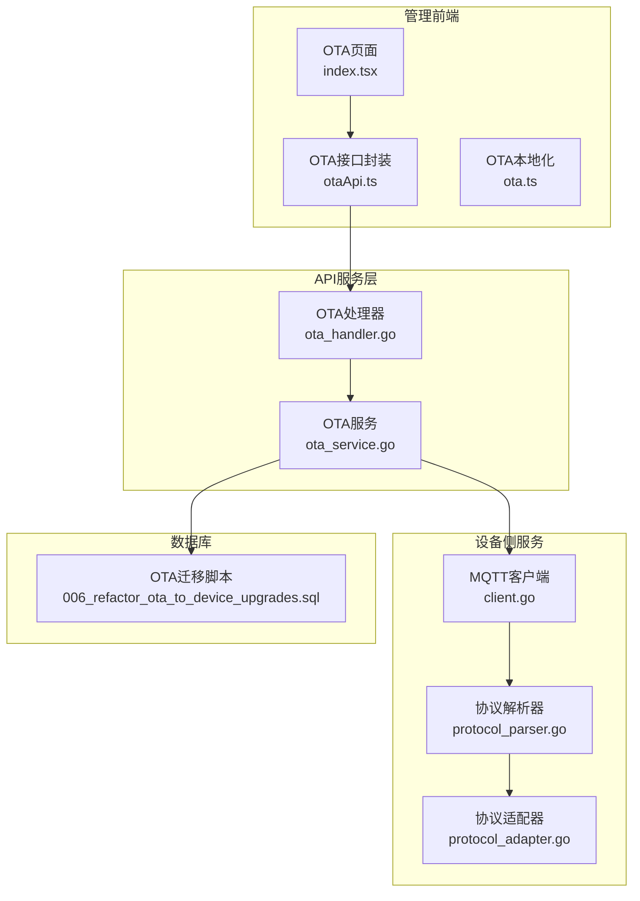
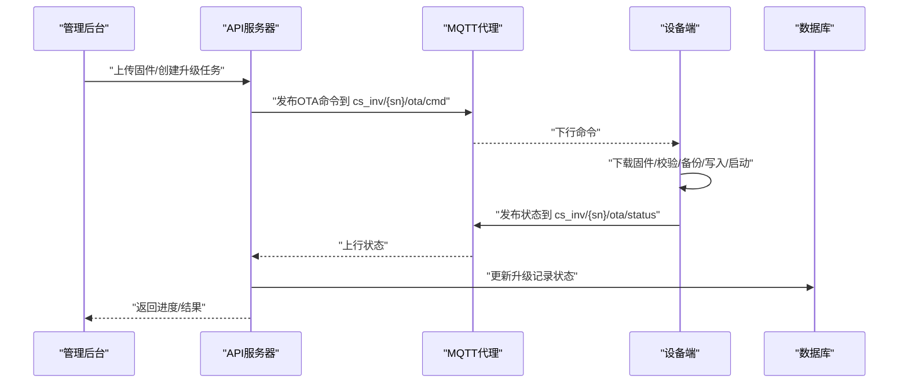
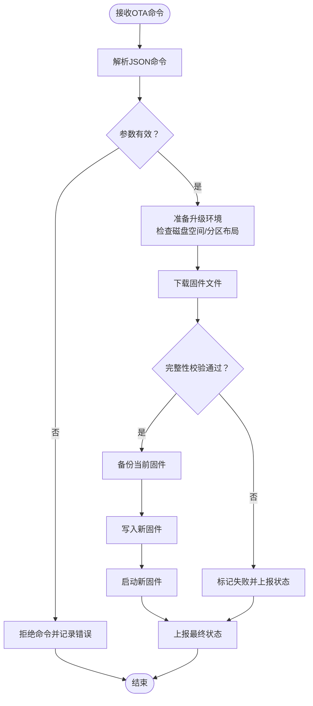
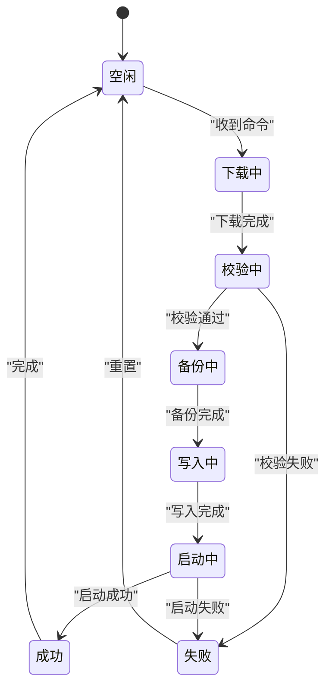
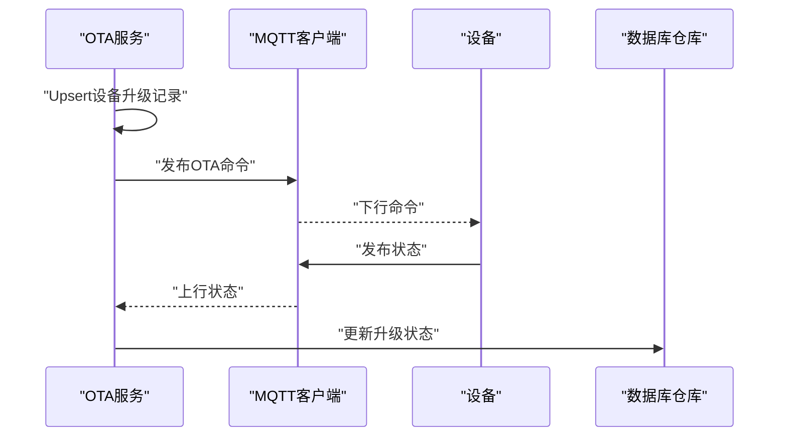
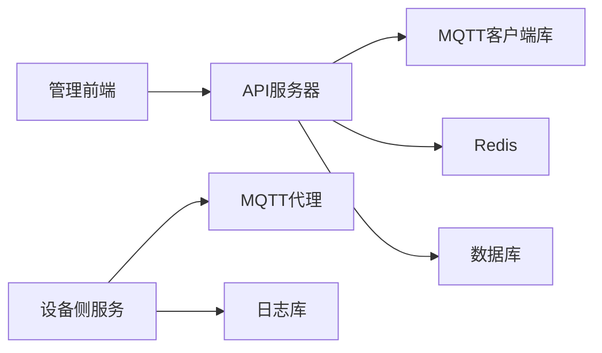

# 设备端OTA程序

<cite>
**本文引用的文件**
- [README.md](file://README.md)
- [client.go](file://inv_device_server/internal/mqtt/client.go)
- [ota_service.go](file://inv_api_server/internal/service/ota_service.go)
- [ota_handler.go](file://inv_api_server/internal/handler/ota_handler.go)
- [006_refactor_ota_to_device_upgrades.sql](file://database/migrations/006_refactor_ota_to_device_upgrades.sql)
- [ota.ts](file://inv-admin-frontend/src/locales/ota.ts)
- [index.tsx](file://inv-admin-frontend/src/pages/ota/index.tsx)
- [otaApi.ts](file://inv-admin-frontend/src/services/otaApi.ts)
</cite>

## 目录
1. [简介](#简介)
2. [项目结构](#项目结构)
3. [核心组件](#核心组件)
4. [架构总览](#架构总览)
5. [详细组件分析](#详细组件分析)
6. [依赖关系分析](#依赖关系分析)
7. [性能考虑](#性能考虑)
8. [故障排查指南](#故障排查指南)
9. [结论](#结论)
10. [附录](#附录)

## 简介
本文件面向设备端固件升级（OTA）程序开发，基于仓库中的现有实现，提供从下载固件、校验完整性、备份当前固件、写入新固件到启动新固件的完整流程指导；解释MQTT消息格式与OTA相关指令；梳理设备端状态管理（升级前准备、升级过程监控、升级后验证）；说明安全机制（固件签名验证与完整性检查）；并给出调试方法、常见问题解决方案以及不同芯片平台的适配与性能优化建议。

## 项目结构
本项目采用多模块架构，OTA能力由以下模块协同完成：
- API服务层：负责固件管理、升级任务创建与下发命令
- 设备侧服务：负责MQTT订阅与命令转发、状态上报解析
- 管理前端：提供OTA任务管理界面与数据展示
- 数据库：存储固件元数据与设备升级记录

**图示来源**
- [ota_handler.go:298-341](file://inv_api_server/internal/handler/ota_handler.go#L298-L341)
- [ota_service.go:142-187](file://inv_api_server/internal/service/ota_service.go#L142-L187)
- [client.go:1-59](file://inv_device_server/internal/mqtt/client.go#L1-L59)
- [006_refactor_ota_to_device_upgrades.sql](file://database/migrations/006_refactor_ota_to_device_upgrades.sql)

**章节来源**
- [README.md:253-342](file://README.md#L253-L342)

## 核心组件
- API服务器的OTA处理器与服务：负责判断是否有更新、构建升级命令并通过MQTT下发至设备；同时接收设备状态上报并更新数据库。
- 设备侧MQTT客户端：订阅OTA命令主题，设置回调以处理OTA状态与命令结果，并将原始payload透传。
- 管理前端：提供OTA页面、接口封装与本地化资源，用于展示升级进度与状态。
- 数据库迁移：重构OTA相关表结构，支持按设备维度的升级记录与状态管理。

**章节来源**
- [ota_handler.go:298-341](file://inv_api_server/internal/handler/ota_handler.go#L298-L341)
- [ota_service.go:142-187](file://inv_api_server/internal/service/ota_service.go#L142-L187)
- [client.go:1-59](file://inv_device_server/internal/mqtt/client.go#L1-L59)
- [006_refactor_ota_to_device_upgrades.sql](file://database/migrations/006_refactor_ota_to_device_upgrades.sql)

## 架构总览
OTA升级的端到端流程如下：
- 管理后台上传固件并创建升级任务
- API服务器生成升级命令并下发至设备侧MQTT主题
- 设备侧接收命令后执行下载、校验、备份、写入与启动流程
- 设备周期性上报状态（进度/成功/失败），API服务器转换并更新数据库
- 管理前端实时展示升级进度与结果

**图示来源**
- [README.md:253-342](file://README.md#L253-L342)
- [client.go:1-59](file://inv_device_server/internal/mqtt/client.go#L1-L59)
- [ota_service.go:184-187](file://inv_api_server/internal/service/ota_service.go#L184-L187)
- [ota_handler.go:298-341](file://inv_api_server/internal/handler/ota_handler.go#L298-L341)

## 详细组件分析

### MQTT协议与消息格式
- 命令主题：下行命令发布至“cs_inv/{sn}/ota/cmd”，设备侧订阅该主题接收升级指令。
- 状态主题：上行状态发布至“cs_inv/{sn}/ota/status”，设备侧周期性上报升级进度与结果。
- 命令格式字段：command（如start）、target（目标芯片类型）、url、version、file_size、file_md5、task_id等。
- 状态格式字段：device_id、current_version、state（如upgrading）、progress、status_message、error_message等。

**图示来源**
- [README.md:281-313](file://README.md#L281-L313)

**章节来源**
- [README.md:281-313](file://README.md#L281-L313)

### 设备端状态管理
设备端应维护如下状态机：
- 空闲（Idle）：等待命令
- 下载中（Downloading）：根据url下载固件
- 校验中（Verifying）：校验MD5/SHA256
- 备份中（BackingUp）：备份当前固件
- 写入中（Writing）：写入新固件
- 启动中（Booting）：重启并切换到新固件
- 成功（Success）：上报成功并进入空闲
- 失败（Failed）：上报失败并回滚或保留错误信息

[此图为概念性状态图，不对应具体源码文件]

### 安全机制
- 完整性校验：使用MD5与SHA256对下载的固件进行双重校验，确保文件未被篡改或损坏。
- 传输安全：建议在生产环境中启用TLS加密的MQTT连接，防止命令与状态被窃听或篡改。
- 认证与授权：API服务器使用JWT进行鉴权，确保只有授权用户可发起OTA任务。
- 回滚策略：若启动失败，应能自动回滚到旧版本固件，保障设备可用性。

**章节来源**
- [README.md:315-319](file://README.md#L315-L319)

### 设备侧MQTT集成要点
- 订阅主题：cs_inv/{sn}/ota/cmd
- 发布主题：cs_inv/{sn}/ota/status
- 原始payload透传：设备侧应直接将命令原始JSON作为MQTT payload转发，便于统一处理。
- 回调注册：设置OTA状态回调与命令结果回调，确保状态上报与命令确认及时可靠。

**章节来源**
- [client.go:1-59](file://inv_device_server/internal/mqtt/client.go#L1-L59)

### API服务器下发与接收流程
- 下发命令：API服务根据固件信息与设备列表生成命令体，调用MQTT发送函数。
- 接收状态：API服务接收设备上报的状态，转换格式并更新数据库中的升级记录。
- 并发控制：通过信号量限制并发数量，避免对MQTT与设备造成过大压力。

**图示来源**
- [ota_service.go:142-187](file://inv_api_server/internal/service/ota_service.go#L142-L187)
- [ota_handler.go:298-341](file://inv_api_server/internal/handler/ota_handler.go#L298-L341)

**章节来源**
- [ota_service.go:142-187](file://inv_api_server/internal/service/ota_service.go#L142-L187)
- [ota_handler.go:298-341](file://inv_api_server/internal/handler/ota_handler.go#L298-L341)

### 管理前端与OTA交互
- 页面：OTA页面展示设备升级任务列表、进度与状态。
- 接口：封装OTA相关API，包括查询是否有更新、触发升级等。
- 本地化：提供OTA相关文案的多语言支持。

**章节来源**
- [index.tsx](file://inv-admin-frontend/src/pages/ota/index.tsx)
- [otaApi.ts](file://inv-admin-frontend/src/services/otaApi.ts)
- [ota.ts](file://inv-admin-frontend/src/locales/ota.ts)

## 依赖关系分析
- API服务器依赖MQTT客户端库与Redis（用于Hub与统计），通过MQTT桥接设备侧命令与状态。
- 设备侧服务依赖MQTT连接管理器与日志库，负责命令解析与状态上报。
- 数据库迁移脚本定义了OTA升级记录的数据模型，支撑前后端展示与状态追踪。

**图示来源**
- [client.go:1-59](file://inv_device_server/internal/mqtt/client.go#L1-L59)
- [ota_service.go:142-187](file://inv_api_server/internal/service/ota_service.go#L142-L187)

**章节来源**
- [client.go:1-59](file://inv_device_server/internal/mqtt/client.go#L1-L59)
- [ota_service.go:142-187](file://inv_api_server/internal/service/ota_service.go#L142-L187)

## 性能考虑
- 并发控制：API服务通过信号量限制并发下发数量，避免MQTT拥塞与设备过载。
- 断点续传：设备端下载固件时建议支持断点续传，减少网络波动影响。
- 分块写入：写入固件时采用分块写入策略，降低单次写入时间与失败风险。
- 缓存与压缩：状态上报可采用批量缓存与压缩，减少MQTT流量。
- 超时与重试：为下载、写入与启动阶段设置合理超时与指数退避重试策略。

[本节为通用性能建议，不直接分析具体文件]

## 故障排查指南
- 命令未到达设备：检查MQTT代理配置、主题订阅与ACL权限。
- 状态未上报：确认设备是否正确发布状态主题，检查网络连通性与代理负载。
- 校验失败：核对file_md5与file_size是否与下发一致，检查存储空间与文件系统。
- 写入失败：检查目标分区容量与权限，确认写入流程是否中断。
- 启动失败：启用回滚策略，确保旧版本固件可用；记录error_message辅助定位。
- 并发过高：调整API服务的并发信号量，观察MQTT与设备响应情况。

**章节来源**
- [README.md:253-342](file://README.md#L253-L342)

## 结论
本项目提供了完整的OTA升级能力，涵盖命令下发、状态上报、进度追踪与数据库更新。设备端需重点实现下载、校验、备份、写入与启动流程，并配套完善的安全与容错机制。通过合理的性能优化与严格的故障排查，可确保OTA升级的可靠性与用户体验。

[本节为总结性内容，不直接分析具体文件]

## 附录

### 不同芯片平台适配指南
- ARM平台：注意分区布局与引导程序差异，确保写入流程与启动扇区正确。
- ESP平台：关注OTA分区与双镜像策略，确保升级后能正确切换与回滚。
- 通用建议：为每类芯片提供独立的校验算法与写入策略，保持命令格式一致。

[本节为通用适配建议，不直接分析具体文件]

### 关键流程与数据模型参考路径
- OTA命令与状态格式参考：[README.md:281-313](file://README.md#L281-L313)
- 设备侧MQTT回调与原始payload透传：[client.go:1-59](file://inv_device_server/internal/mqtt/client.go#L1-L59)
- API服务下发命令与并发控制：[ota_service.go:142-187](file://inv_api_server/internal/service/ota_service.go#L142-L187)
- 触发OTA升级接口：[ota_handler.go:298-341](file://inv_api_server/internal/handler/ota_handler.go#L298-L341)
- OTA升级记录数据模型：[006_refactor_ota_to_device_upgrades.sql](file://database/migrations/006_refactor_ota_to_device_upgrades.sql)