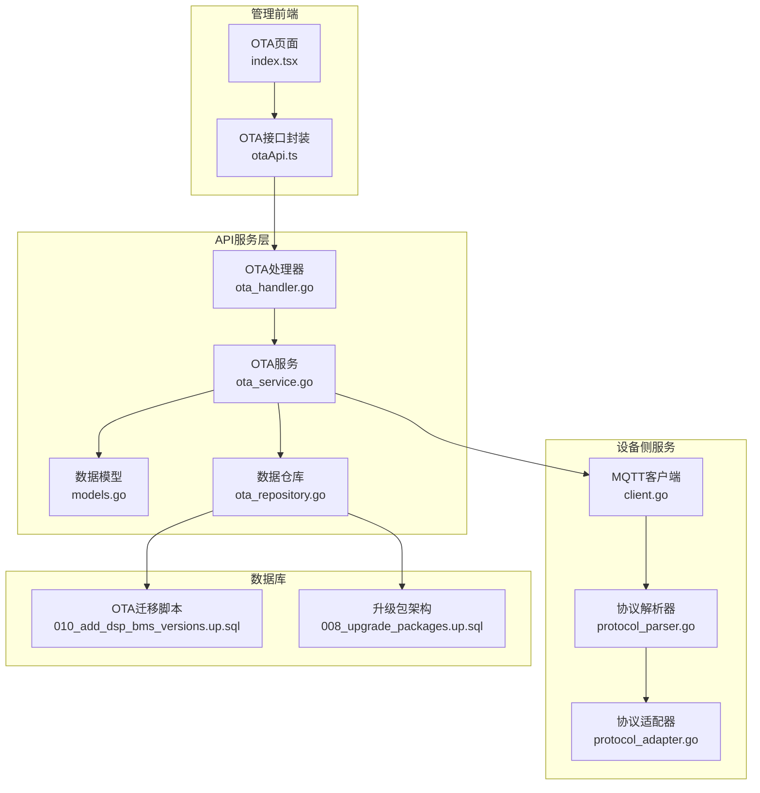
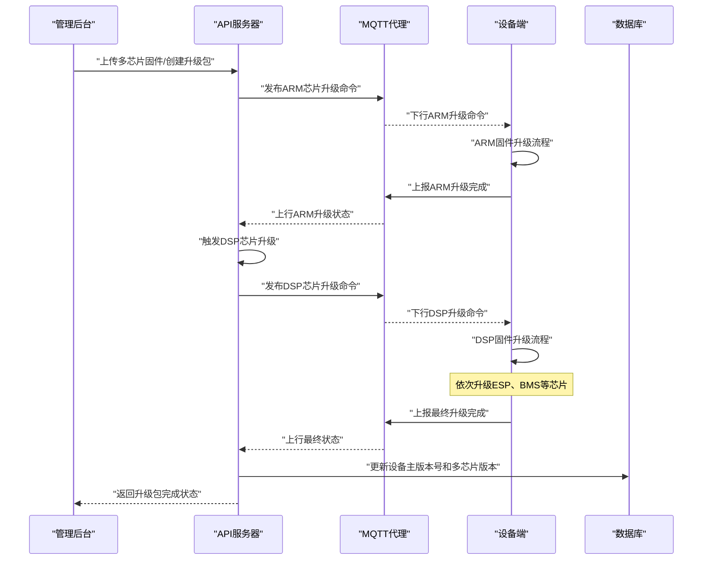
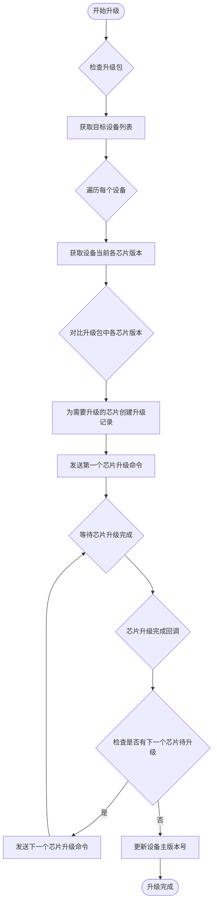
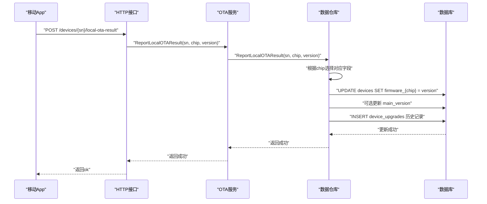
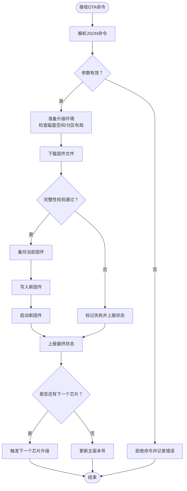
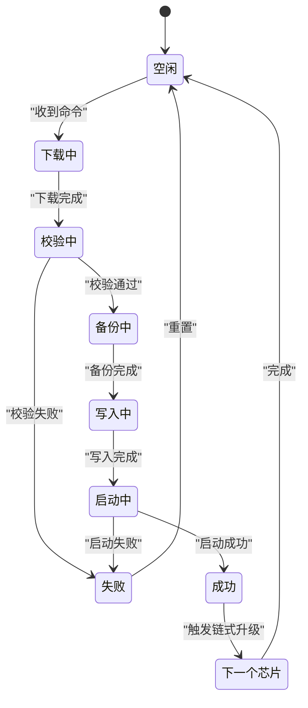
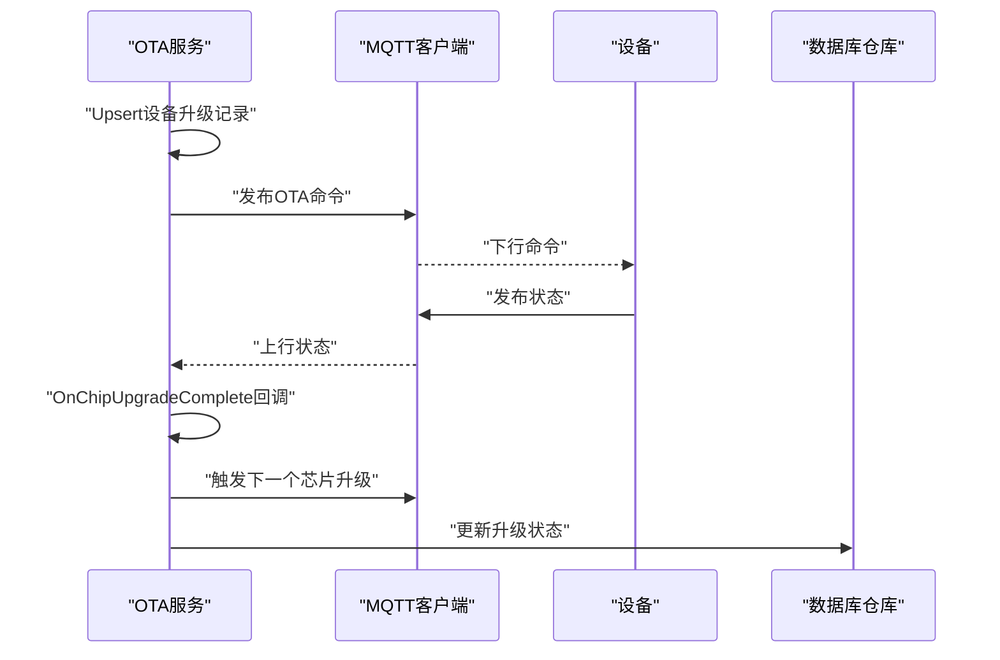
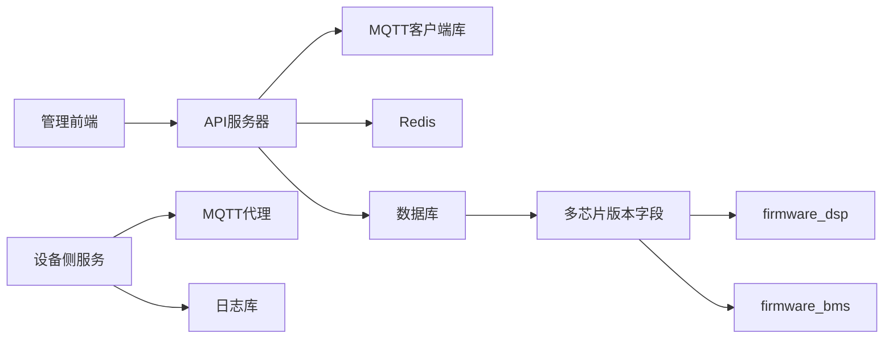

# 设备端OTA程序

<cite>
**本文引用的文件**
- [README.md](file://README.md)
- [client.go](file://inv_device_server/internal/mqtt/client.go)
- [ota_service.go](file://inv_api_server/internal/service/ota_service.go)
- [ota_handler.go](file://inv_api_server/internal/handler/ota_handler.go)
- [models.go](file://inv_api_server/internal/model/models.go)
- [ota_repository.go](file://inv_api_server/internal/repository/ota_repository.go)
- [010_add_dsp_bms_versions.up.sql](file://database/migrations/010_add_dsp_bms_versions.up.sql)
- [008_upgrade_packages.up.sql](file://database/migrations/008_upgrade_packages.up.sql)
- [index.tsx](file://inv-admin-frontend/src/pages/ota/index.tsx)
- [otaApi.ts](file://inv-admin-frontend/src/services/otaApi.ts)
- [设备端OTA程序开发指南.md](file://docs/设备端OTA程序开发指南.md)
</cite>

## 更新摘要
**变更内容**
- 新增多芯片固件结构支持，包含ESP、ARM、DSP、BMS四个芯片的独立版本管理
- 增强本地OTA结果上报机制，支持多芯片固件版本的统一更新
- 完善升级包架构，支持跨芯片的批量升级和链式升级流程
- 优化数据库模型，增加firmware_dsp和firmware_bms字段支持

## 目录
1. [简介](#简介)
2. [项目结构](#项目结构)
3. [核心组件](#核心组件)
4. [架构总览](#架构总览)
5. [详细组件分析](#详细组件分析)
6. [依赖关系分析](#依赖关系分析)
7. [性能考虑](#性能考虑)
8. [故障排查指南](#故障排查指南)
9. [结论](#结论)
10. [附录](#附录)

## 简介
本文件面向设备端固件升级（OTA）程序开发，基于仓库中的现有实现，提供从下载固件、校验完整性、备份当前固件、写入新固件到启动新固件的完整流程指导；解释MQTT消息格式与OTA相关指令；梳理设备端状态管理（升级前准备、升级过程监控、升级后验证）；说明安全机制（固件签名验证与完整性检查）；并给出调试方法、常见问题解决方案以及不同芯片平台的适配与性能优化建议。

**更新** 系统现已支持多芯片固件结构，可同时管理ESP32、ARM主控、DSP数字信号处理器和BMS电池管理系统的固件版本，并提供统一的升级包管理和链式升级机制。

## 项目结构
本项目采用多模块架构，OTA能力由以下模块协同完成：
- API服务层：负责固件管理、升级任务创建与下发命令、多芯片版本同步
- 设备侧服务：负责MQTT订阅与命令转发、状态上报解析
- 管理前端：提供OTA任务管理界面与数据展示
- 数据库：存储固件元数据与设备升级记录，支持多芯片版本追踪

**图示来源**
- [ota_handler.go:977-1013](file://inv_api_server/internal/handler/ota_handler.go#L977-L1013)
- [ota_service.go:1203-1206](file://inv_api_server/internal/service/ota_service.go#L1203-L1206)
- [models.go:43-69](file://inv_api_server/internal/model/models.go#L43-L69)
- [ota_repository.go:1196-1239](file://inv_api_server/internal/repository/ota_repository.go#L1196-L1239)
- [010_add_dsp_bms_versions.up.sql:1-4](file://database/migrations/010_add_dsp_bms_versions.up.sql#L1-L4)
- [008_upgrade_packages.up.sql:1-49](file://database/migrations/008_upgrade_packages.up.sql#L1-L49)

## 核心组件
- **多芯片固件管理器**：支持ESP32、ARM、DSP、BMS四个芯片的独立版本管理和统一升级
- **升级包架构**：将多个芯片固件组合成逻辑升级包，支持主版本号管理和链式升级
- **本地OTA结果上报**：App通过HTTP接口上报本地升级结果，自动更新对应芯片版本
- **链式升级机制**：单芯片升级完成后自动触发下一个芯片的升级流程
- **设备侧MQTT客户端**：订阅OTA命令主题，设置回调以处理OTA状态与命令结果

**章节来源**
- [models.go:43-69](file://inv_api_server/internal/model/models.go#L43-L69)
- [ota_service.go:704-753](file://inv_api_server/internal/service/ota_service.go#L704-L753)
- [ota_repository.go:1196-1239](file://inv_api_server/internal/repository/ota_repository.go#L1196-L1239)
- [client.go:1-59](file://inv_device_server/internal/mqtt/client.go#L1-L59)

## 架构总览
OTA升级的端到端流程现在支持多芯片固件结构：
- 管理后台上传多芯片固件并创建升级包
- API服务器生成升级命令并按顺序下发至各芯片
- 设备侧接收命令后执行下载、校验、备份、写入与启动流程
- 单芯片升级完成后自动触发下一芯片的升级
- 所有芯片升级完成后更新设备主版本号
- 设备周期性上报状态（进度/成功/失败），API服务器转换并更新数据库

**图示来源**
- [ota_service.go:704-753](file://inv_api_server/internal/service/ota_service.go#L704-L753)
- [ota_service.go:1203-1206](file://inv_api_server/internal/service/ota_service.go#L1203-L1206)
- [ota_repository.go:1196-1239](file://inv_api_server/internal/repository/ota_repository.go#L1196-L1239)

## 详细组件分析

### 多芯片固件结构
系统现在支持四种芯片类型的独立固件管理：
- **ESP32**：WiFi通信模块固件，负责MQTT连接和数据转发
- **ARM**：逆变器主控固件，核心控制逻辑
- **DSP**：数字信号处理器固件，逆变控制核心算法
- **BMS**：电池管理系统固件，电池充放电控制

**图示来源**
- [ota_service.go:517-625](file://inv_api_server/internal/service/ota_service.go#L517-L625)
- [ota_service.go:704-753](file://inv_api_server/internal/service/ota_service.go#L704-L753)

**章节来源**
- [models.go:43-69](file://inv_api_server/internal/model/models.go#L43-L69)
- [ota_repository.go:375-391](file://inv_api_server/internal/repository/ota_repository.go#L375-L391)
- [010_add_dsp_bms_versions.up.sql:1-4](file://database/migrations/010_add_dsp_bms_versions.up.sql#L1-L4)

### 本地OTA结果上报机制
设备在AP模式下通过HTTP接口向API服务器上报本地OTA升级结果，支持多芯片固件版本的统一更新：

**HTTP接口规范**：
- 接口路径：`POST /api/v1/devices/:sn/local-ota-result`
- 请求参数：target_chip（目标芯片）、new_version（新版本号）、main_version（主版本号）
- 响应格式：标准JSON响应

**多芯片版本更新逻辑**：
- 根据target_chip动态选择对应的数据库字段进行更新
- 支持arm、esp、dsp、bms四种芯片类型
- 可选更新main_version用于标识升级包版本

**图示来源**
- [ota_handler.go:977-1013](file://inv_api_server/internal/handler/ota_handler.go#L977-L1013)
- [ota_service.go:1203-1206](file://inv_api_server/internal/service/ota_service.go#L1203-L1206)
- [ota_repository.go:1196-1239](file://inv_api_server/internal/repository/ota_repository.go#L1196-L1239)

**章节来源**
- [ota_handler.go:977-1013](file://inv_api_server/internal/handler/ota_handler.go#L977-L1013)
- [ota_service.go:1203-1206](file://inv_api_server/internal/service/ota_service.go#L1203-L1206)
- [ota_repository.go:1196-1239](file://inv_api_server/internal/repository/ota_repository.go#L1196-L1239)

### MQTT协议与消息格式
- **命令主题**：下行命令发布至"cs_inv/{sn}/ota/cmd"，设备侧订阅该主题接收升级指令
- **状态主题**：上行状态发布至"cs_inv/{sn}/ota/status"，设备侧周期性上报升级进度与结果
- **命令格式字段**：command（如start）、target（目标芯片类型）、url、version、file_size、file_md5、task_id等
- **状态格式字段**：device_id、current_version、state（如upgrading）、progress、status_message、error_message等

**更新** 现在target字段支持"arm"、"esp"、"dsp"、"bms"四种芯片类型，系统会根据target字段自动路由到对应的升级流程。

**图示来源**
- [设备端OTA程序开发指南.md:1127-1196](file://docs/设备端OTA程序开发指南.md#L1127-L1196)

**章节来源**
- [设备端OTA程序开发指南.md:1127-1196](file://docs/设备端OTA程序开发指南.md#L1127-L1196)

### 设备端状态管理
设备端应维护如下状态机，支持多芯片升级流程：
- **空闲（Idle）**：等待命令
- **下载中（Downloading）**：根据url下载固件
- **校验中（Verifying）**：校验MD5/SHA256
- **备份中（BackingUp）**：备份当前固件
- **写入中（Writing）**：写入新固件
- **启动中（Booting）**：重启并切换到新固件
- **成功（Success）**：上报成功并触发下一个芯片升级
- **失败（Failed）**：上报失败并回滚或保留错误信息

[此图为概念性状态图，不对应具体源码文件]

### 安全机制
- **完整性校验**：使用MD5与SHA256对下载的固件进行双重校验，确保文件未被篡改或损坏
- **传输安全**：建议在生产环境中启用TLS加密的MQTT连接，防止命令与状态被窃听或篡改
- **认证与授权**：API服务器使用JWT进行鉴权，确保只有授权用户可发起OTA任务
- **回滚策略**：若启动失败，应能自动回滚到旧版本固件，保障设备可用性
- **版本一致性**：通过main_version字段确保所有芯片固件版本的一致性

**章节来源**
- [设备端OTA程序开发指南.md:1127-1196](file://docs/设备端OTA程序开发指南.md#L1127-L1196)

### 设备侧MQTT集成要点
- **订阅主题**：cs_inv/{sn}/ota/cmd
- **发布主题**：cs_inv/{sn}/ota/status
- **原始payload透传**：设备侧应直接将命令原始JSON作为MQTT payload转发，便于统一处理
- **回调注册**：设置OTA状态回调与命令结果回调，确保状态上报与命令确认及时可靠
- **多芯片支持**：根据target字段识别目标芯片类型，执行相应的升级流程

**章节来源**
- [client.go:1-59](file://inv_device_server/internal/mqtt/client.go#L1-L59)

### API服务器下发与接收流程
- **下发命令**：API服务根据固件信息与设备列表生成命令体，调用MQTT发送函数
- **接收状态**：API服务接收设备上报的状态，转换格式并更新数据库中的升级记录
- **并发控制**：通过信号量限制并发数量，避免对MQTT与设备造成过大压力
- **链式升级**：单芯片升级完成后自动触发下一个芯片的升级流程

**图示来源**
- [ota_service.go:704-753](file://inv_api_server/internal/service/ota_service.go#L704-L753)
- [ota_service.go:142-187](file://inv_api_server/internal/service/ota_service.go#L142-L187)

**章节来源**
- [ota_service.go:704-753](file://inv_api_server/internal/service/ota_service.go#L704-L753)
- [ota_service.go:142-187](file://inv_api_server/internal/service/ota_service.go#L142-L187)

### 管理前端与OTA交互
- **页面**：OTA页面展示设备升级任务列表、进度与状态，支持按芯片类型筛选
- **接口**：封装OTA相关API，包括查询是否有更新、触发升级等
- **本地化**：提供OTA相关文案的多语言支持
- **多芯片显示**：支持显示设备的多芯片固件版本信息

**章节来源**
- [index.tsx:813-825](file://inv-admin-frontend/src/pages/ota/index.tsx#L813-L825)
- [index.tsx:849-868](file://inv-admin-frontend/src/pages/ota/index.tsx#L849-L868)

## 依赖关系分析
- **API服务器**依赖MQTT客户端库与Redis（用于Hub与统计），通过MQTT桥接设备侧命令与状态
- **设备侧服务**依赖MQTT连接管理器与日志库，负责命令解析与状态上报
- **数据库迁移脚本**定义了OTA升级记录的数据模型，支撑前后端展示与状态追踪
- **多芯片支持**需要扩展数据库表结构，增加firmware_dsp和firmware_bms字段

**图示来源**
- [client.go:1-59](file://inv_device_server/internal/mqtt/client.go#L1-L59)
- [ota_service.go:142-187](file://inv_api_server/internal/service/ota_service.go#L142-L187)
- [010_add_dsp_bms_versions.up.sql:1-4](file://database/migrations/010_add_dsp_bms_versions.up.sql#L1-L4)

**章节来源**
- [client.go:1-59](file://inv_device_server/internal/mqtt/client.go#L1-L59)
- [ota_service.go:142-187](file://inv_api_server/internal/service/ota_service.go#L142-L187)
- [010_add_dsp_bms_versions.up.sql:1-4](file://database/migrations/010_add_dsp_bms_versions.up.sql#L1-L4)

## 性能考虑
- **并发控制**：API服务通过信号量限制并发下发数量，避免MQTT拥塞与设备过载
- **断点续传**：设备端下载固件时建议支持断点续传，减少网络波动影响
- **分块写入**：写入固件时采用分块写入策略，降低单次写入时间与失败风险
- **缓存与压缩**：状态上报可采用批量缓存与压缩，减少MQTT流量
- **超时与重试**：为下载、写入与启动阶段设置合理超时与指数退避重试策略
- **链式升级优化**：单芯片升级完成后异步触发下一个芯片，避免阻塞主流程

## 故障排查指南
- **命令未到达设备**：检查MQTT代理配置、主题订阅与ACL权限
- **状态未上报**：确认设备是否正确发布状态主题，检查网络连通性与代理负载
- **校验失败**：核对file_md5与file_size是否与下发一致，检查存储空间与文件系统
- **写入失败**：检查目标分区容量与权限，确认写入流程是否中断
- **启动失败**：启用回滚策略，确保旧版本固件可用；记录error_message辅助定位
- **并发过高**：调整API服务的并发信号量，观察MQTT与设备响应情况
- **链式升级中断**：检查OnChipUpgradeComplete回调是否正常触发，确认下一个芯片的升级记录是否存在

**章节来源**
- [设备端OTA程序开发指南.md:1089-1116](file://docs/设备端OTA程序开发指南.md#L1089-L1116)

## 结论
本项目提供了完整的OTA升级能力，涵盖命令下发、状态上报、进度追踪与数据库更新。新增的多芯片固件结构支持同时管理ESP32、ARM、DSP、BMS四个芯片的固件版本，并通过升级包和链式升级机制实现了复杂的跨芯片升级流程。设备端需重点实现下载、校验、备份、写入与启动流程，并配套完善的安全与容错机制。通过合理的性能优化与严格的故障排查，可确保OTA升级的可靠性与用户体验。

## 附录

### 不同芯片平台适配指南
- **ARM平台**：注意分区布局与引导程序差异，确保写入流程与启动扇区正确
- **ESP平台**：关注OTA分区与双镜像策略，确保升级后能正确切换与回滚
- **DSP平台**：数字信号处理器固件通常较小，但算法复杂度高，需要专门的加载器
- **BMS平台**：电池管理系统固件涉及安全关键功能，需要更严格的安全验证
- **通用建议**：为每类芯片提供独立的校验算法与写入策略，保持命令格式一致

### 关键流程与数据模型参考路径
- **多芯片固件结构定义**：[models.go:43-69](file://inv_api_server/internal/model/models.go#L43-L69)
- **本地OTA结果上报接口**：[ota_handler.go:977-1013](file://inv_api_server/internal/handler/ota_handler.go#L977-L1013)
- **链式升级机制实现**：[ota_service.go:704-753](file://inv_api_server/internal/service/ota_service.go#L704-L753)
- **多芯片版本更新逻辑**：[ota_repository.go:1196-1239](file://inv_api_server/internal/repository/ota_repository.go#L1196-L1239)
- **数据库迁移脚本**：[010_add_dsp_bms_versions.up.sql](file://database/migrations/010_add_dsp_bms_versions.up.sql)
- **升级包架构设计**：[008_upgrade_packages.up.sql](file://database/migrations/008_upgrade_packages.up.sql)
- **设备端OTA开发指南**：[设备端OTA程序开发指南.md](file://docs/设备端OTA程序开发指南.md)