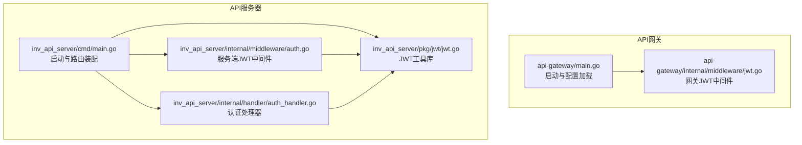
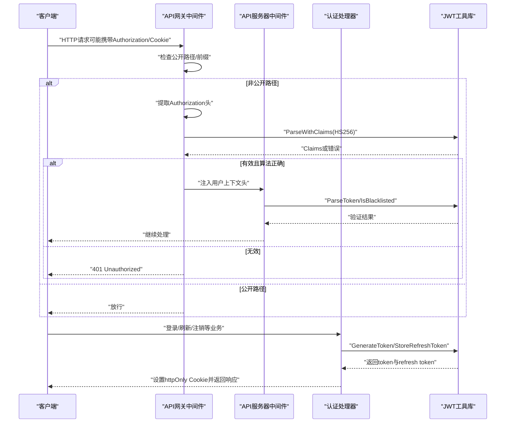
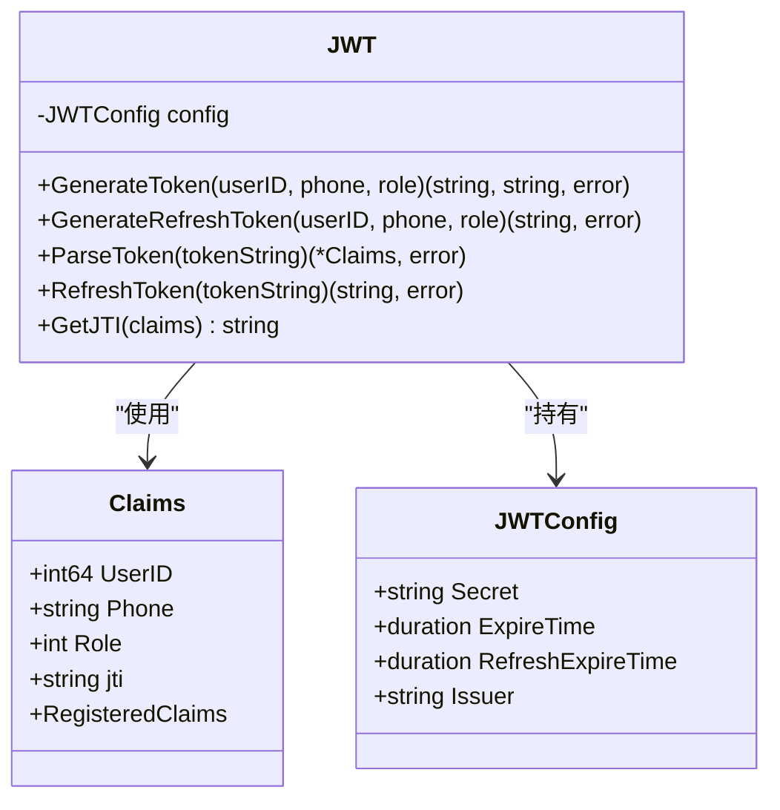
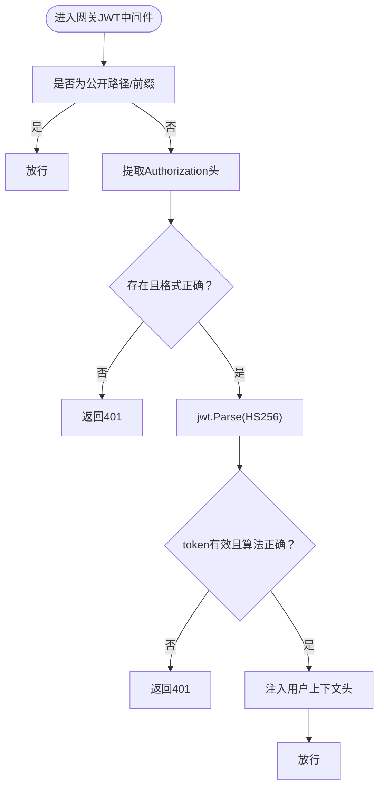
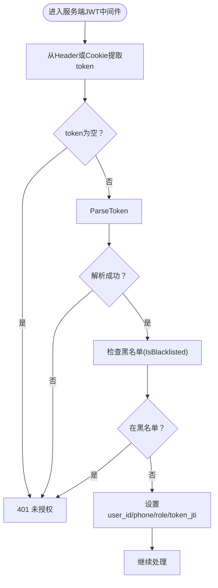
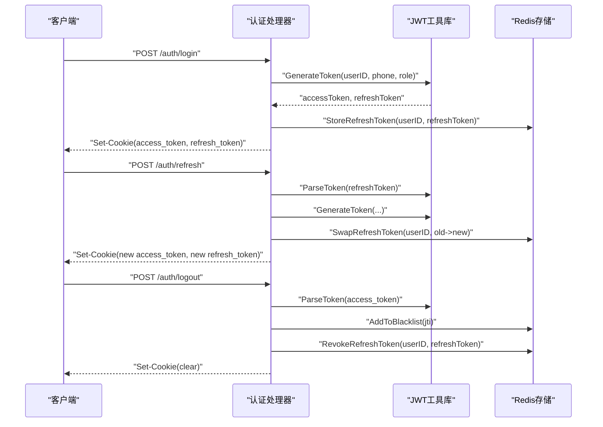
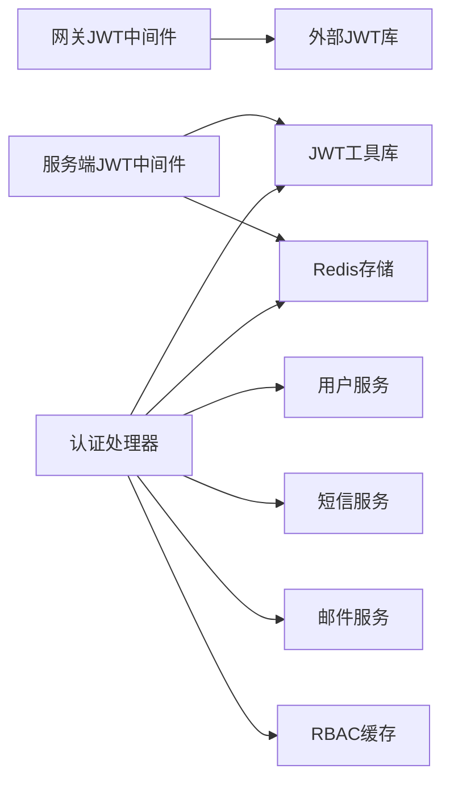

# JWT认证机制

<cite>
**本文档引用的文件**
- [api-gateway/main.go](file://api-gateway/main.go)
- [api-gateway/internal/middleware/jwt.go](file://api-gateway/internal/middleware/jwt.go)
- [inv_api_server/cmd/main.go](file://inv_api_server/cmd/main.go)
- [inv_api_server/pkg/jwt/jwt.go](file://inv_api_server/pkg/jwt/jwt.go)
- [inv_api_server/internal/middleware/auth.go](file://inv_api_server/internal/middleware/auth.go)
- [inv_api_server/internal/handler/auth_handler.go](file://inv_api_server/internal/handler/auth_handler.go)
</cite>

## 目录
1. [简介](#简介)
2. [项目结构](#项目结构)
3. [核心组件](#核心组件)
4. [架构总览](#架构总览)
5. [详细组件分析](#详细组件分析)
6. [依赖分析](#依赖分析)
7. [性能考虑](#性能考虑)
8. [故障排查指南](#故障排查指南)
9. [结论](#结论)
10. [附录](#附录)

## 简介
本文件面向开发者与运维人员，系统性阐述本项目的JWT认证机制设计与实现，涵盖以下要点：
- JWT工作原理与在系统中的落地：payload构建、HS256签名、过期时间设置
- token验证机制：签名验证、过期检查、token黑名单管理
- refresh token策略与轮换：刷新令牌生成、存储、吊销与替换
- API网关与API服务器中的JWT中间件：token提取、验证、用户上下文注入
- JWT配置参数：密钥管理、过期时间、算法选择、安全头设置
- 调试工具与常见问题排查
- 最佳实践与安全建议

## 项目结构
本项目采用前后端分离与多模块架构：
- API网关模块负责统一入口、路由转发与基础中间件（含JWT鉴权）
- API服务器模块负责业务处理、用户认证、JWT签发与刷新
- JWT核心逻辑封装于独立包，便于复用与测试

图表来源
- [api-gateway/main.go:1-129](file://api-gateway/main.go#L1-L129)
- [api-gateway/internal/middleware/jwt.go:1-122](file://api-gateway/internal/middleware/jwt.go#L1-L122)
- [inv_api_server/cmd/main.go:1-618](file://inv_api_server/cmd/main.go#L1-L618)
- [inv_api_server/pkg/jwt/jwt.go:1-137](file://inv_api_server/pkg/jwt/jwt.go#L1-L137)
- [inv_api_server/internal/middleware/auth.go:1-255](file://inv_api_server/internal/middleware/auth.go#L1-L255)
- [inv_api_server/internal/handler/auth_handler.go:1-814](file://inv_api_server/internal/handler/auth_handler.go#L1-L814)

章节来源
- [api-gateway/main.go:1-129](file://api-gateway/main.go#L1-L129)
- [inv_api_server/cmd/main.go:1-618](file://inv_api_server/cmd/main.go#L1-L618)

## 核心组件
- JWT工具库（服务端）：提供Claims结构、HS256签名、access token与refresh token生成、解析与刷新
- 服务端JWT中间件：从Header或Cookie提取token，解析并注入用户上下文，检查黑名单
- API网关JWT中间件：统一鉴权入口，支持公开路径白名单与前缀白名单
- 认证处理器：登录/注册/刷新/注销等业务流程，设置httpOnly Cookie，存储refresh token

章节来源
- [inv_api_server/pkg/jwt/jwt.go:1-137](file://inv_api_server/pkg/jwt/jwt.go#L1-L137)
- [inv_api_server/internal/middleware/auth.go:1-255](file://inv_api_server/internal/middleware/auth.go#L1-L255)
- [api-gateway/internal/middleware/jwt.go:1-122](file://api-gateway/internal/middleware/jwt.go#L1-L122)
- [inv_api_server/internal/handler/auth_handler.go:1-814](file://inv_api_server/internal/handler/auth_handler.go#L1-L814)

## 架构总览
下图展示JWT在系统中的整体调用链路：客户端发起请求，API网关进行基础鉴权，API服务器执行业务逻辑并返回结果。

图表来源
- [api-gateway/internal/middleware/jwt.go:44-122](file://api-gateway/internal/middleware/jwt.go#L44-L122)
- [inv_api_server/internal/middleware/auth.go:15-81](file://inv_api_server/internal/middleware/auth.go#L15-L81)
- [inv_api_server/internal/handler/auth_handler.go:65-153](file://inv_api_server/internal/handler/auth_handler.go#L65-L153)
- [inv_api_server/pkg/jwt/jwt.go:35-137](file://inv_api_server/pkg/jwt/jwt.go#L35-L137)

## 详细组件分析

### JWT工具库（HS256、Claims、过期时间）
- Claims结构：包含用户标识、手机号、角色、自定义jti以及标准声明（过期、签发、生效、发行者、ID）
- HS256签名：使用对称密钥进行签名与验证
- 过期时间：access token与refresh token分别配置过期时长
- JTI生成：随机十六进制字符串，用于唯一标识token，支持黑名单与刷新关联

图表来源
- [inv_api_server/pkg/jwt/jwt.go:12-29](file://inv_api_server/pkg/jwt/jwt.go#L12-L29)
- [inv_api_server/pkg/jwt/jwt.go:20-25](file://inv_api_server/pkg/jwt/jwt.go#L20-L25)
- [inv_api_server/pkg/jwt/jwt.go:27-33](file://inv_api_server/pkg/jwt/jwt.go#L27-L33)

章节来源
- [inv_api_server/pkg/jwt/jwt.go:12-137](file://inv_api_server/pkg/jwt/jwt.go#L12-L137)

### API网关JWT中间件（token提取、验证、注入）
- 公开路径白名单：健康检查、文档、登录/注册/验证码等无需鉴权
- 公开路径前缀：上传、WebSocket等
- Authorization头格式校验：必须为Bearer <token>
- 签名算法校验：仅允许HS256
- Claims注入：将用户ID、手机号、角色、sub写入请求头，便于下游使用

图表来源
- [api-gateway/internal/middleware/jwt.go:44-122](file://api-gateway/internal/middleware/jwt.go#L44-L122)

章节来源
- [api-gateway/internal/middleware/jwt.go:13-122](file://api-gateway/internal/middleware/jwt.go#L13-L122)

### API服务器JWT中间件（黑名单、上下文注入）
- 支持从Header或Cookie提取token
- 解析并校验黑名单：若jti在黑名单中则拒绝
- 将用户ID、手机号、角色、token jti注入Gin上下文，供后续处理器使用

图表来源
- [inv_api_server/internal/middleware/auth.go:15-81](file://inv_api_server/internal/middleware/auth.go#L15-L81)

章节来源
- [inv_api_server/internal/middleware/auth.go:15-81](file://inv_api_server/internal/middleware/auth.go#L15-L81)

### 认证处理器（登录/注册/刷新/注销）
- 登录/注册：生成access token与refresh token，设置httpOnly Cookie，持久化refresh token，记录审计日志与权限缓存
- 刷新：解析refresh token，生成新的access token与refresh token，交换或存储新refresh token，更新Cookie
- 注销：解析当前access token，加入黑名单；吊销refresh token；清除Cookie

图表来源
- [inv_api_server/internal/handler/auth_handler.go:65-153](file://inv_api_server/internal/handler/auth_handler.go#L65-L153)
- [inv_api_server/internal/handler/auth_handler.go:483-521](file://inv_api_server/internal/handler/auth_handler.go#L483-L521)
- [inv_api_server/internal/handler/auth_handler.go:527-573](file://inv_api_server/internal/handler/auth_handler.go#L527-L573)
- [inv_api_server/pkg/jwt/jwt.go:35-137](file://inv_api_server/pkg/jwt/jwt.go#L35-L137)

章节来源
- [inv_api_server/internal/handler/auth_handler.go:65-153](file://inv_api_server/internal/handler/auth_handler.go#L65-L153)
- [inv_api_server/internal/handler/auth_handler.go:483-521](file://inv_api_server/internal/handler/auth_handler.go#L483-L521)
- [inv_api_server/internal/handler/auth_handler.go:527-573](file://inv_api_server/internal/handler/auth_handler.go#L527-L573)

### 配置参数说明
- 密钥管理
  - 网关与API服务器均要求通过配置加载JWT密钥，禁止使用默认值
  - 建议使用强随机密钥，并定期轮换
- 过期时间
  - access token过期时间：通常较短（如2小时），降低泄露风险
  - refresh token过期时间：较长（如7天），提升用户体验
- 算法选择
  - 使用HS256对称签名，确保性能与安全性平衡
- 安全头设置
  - access token与refresh token通过httpOnly Cookie传输，防止XSS
  - 登录/注册/刷新接口返回明文token以兼容前端，但Cookie为首选

章节来源
- [api-gateway/main.go:30-32](file://api-gateway/main.go#L30-L32)
- [inv_api_server/cmd/main.go:45-48](file://inv_api_server/cmd/main.go#L45-L48)
- [inv_api_server/internal/handler/auth_handler.go:22-26](file://inv_api_server/internal/handler/auth_handler.go#L22-L26)
- [inv_api_server/internal/handler/auth_handler.go:142-143](file://inv_api_server/internal/handler/auth_handler.go#L142-L143)
- [inv_api_server/internal/handler/auth_handler.go:565-566](file://inv_api_server/internal/handler/auth_handler.go#L565-L566)

## 依赖分析
- API网关依赖外部JWT库进行token解析与验证
- API服务器内部中间件依赖JWT工具库与Redis存储进行黑名单与refresh token管理
- 认证处理器依赖用户服务、短信/邮件服务与RBAC缓存服务

图表来源
- [api-gateway/internal/middleware/jwt.go:10](file://api-gateway/internal/middleware/jwt.go#L10)
- [inv_api_server/internal/middleware/auth.go:9](file://inv_api_server/internal/middleware/auth.go#L9)
- [inv_api_server/internal/handler/auth_handler.go:10-19](file://inv_api_server/internal/handler/auth_handler.go#L10-L19)

章节来源
- [api-gateway/internal/middleware/jwt.go:1-122](file://api-gateway/internal/middleware/jwt.go#L1-L122)
- [inv_api_server/internal/middleware/auth.go:1-255](file://inv_api_server/internal/middleware/auth.go#L1-L255)
- [inv_api_server/internal/handler/auth_handler.go:1-814](file://inv_api_server/internal/handler/auth_handler.go#L1-L814)

## 性能考虑
- 中间件层尽量轻量：仅做必要校验与上下文注入
- 黑名单查询与refresh token存储使用Redis，注意键空间与TTL优化
- access token过期时间短、刷新频繁，减少长期有效令牌带来的风险与验证成本
- 对高并发场景，建议结合速率限制与分布式锁避免竞态

## 故障排查指南
- 缺少Authorization头或格式错误
  - 现象：网关返回401，提示缺少或格式错误
  - 排查：确认请求头为Bearer <token>，且未被代理层篡改
- 无效token或签名算法不支持
  - 现象：返回401，提示无效token
  - 排查：确认使用HS256签名；核对密钥一致；检查过期时间
- token已被吊销（黑名单）
  - 现象：服务端返回401，提示token已吊销
  - 排查：确认是否执行过注销；检查黑名单键是否存在；核对jti是否匹配
- 密钥未设置或使用默认值
  - 现象：启动即报错退出
  - 排查：通过环境变量设置安全密钥，避免硬编码
- Cookie未正确设置或跨域问题
  - 现象：前端无法读取token
  - 排查：确认SameSite、Domain、Path与Secure属性；检查CORS配置

章节来源
- [api-gateway/internal/middleware/jwt.go:52-71](file://api-gateway/internal/middleware/jwt.go#L52-L71)
- [api-gateway/internal/middleware/jwt.go:75-90](file://api-gateway/internal/middleware/jwt.go#L75-L90)
- [inv_api_server/internal/middleware/auth.go:43-48](file://inv_api_server/internal/middleware/auth.go#L43-L48)
- [api-gateway/main.go:30-32](file://api-gateway/main.go#L30-L32)
- [inv_api_server/cmd/main.go:45-48](file://inv_api_server/cmd/main.go#L45-L48)

## 结论
本项目通过明确的分层设计实现了完整的JWT认证闭环：网关负责入口鉴权，服务端负责业务鉴权与黑名单管理，JWT工具库提供标准化的签名与解析能力。配合httpOnly Cookie与合理的过期策略，兼顾了安全性与易用性。建议在生产环境中强化密钥轮换、监控告警与审计日志，持续优化Redis性能与网络延迟。

## 附录
- 最佳实践
  - 强制使用HS256对称密钥，定期轮换
  - access token短期有效，refresh token长期有效但需严格管控
  - 所有敏感接口均通过服务端中间件校验，避免前端直接暴露密钥
  - 使用黑名单与吊销机制应对泄露风险
  - 通过Cookie传输token，开启httpOnly与SameSite
- 安全建议
  - 禁止在日志中输出完整token
  - 对高频接口增加速率限制
  - 审计登录/登出/密码修改等关键操作
  - 使用HTTPS与安全的CORS策略