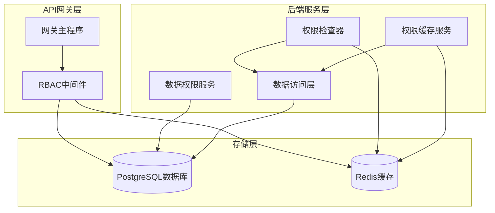
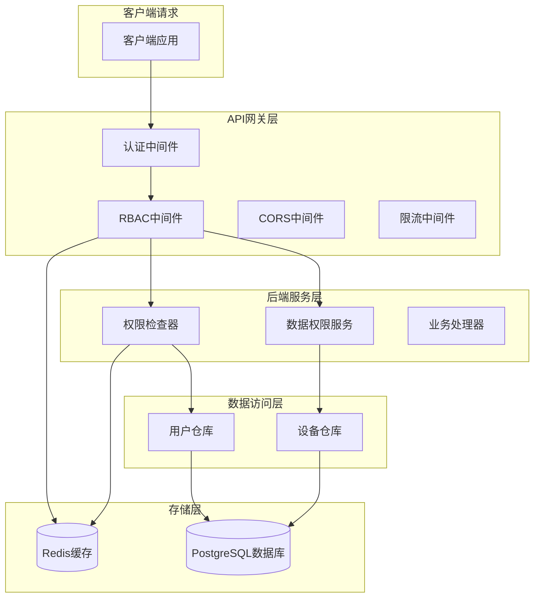
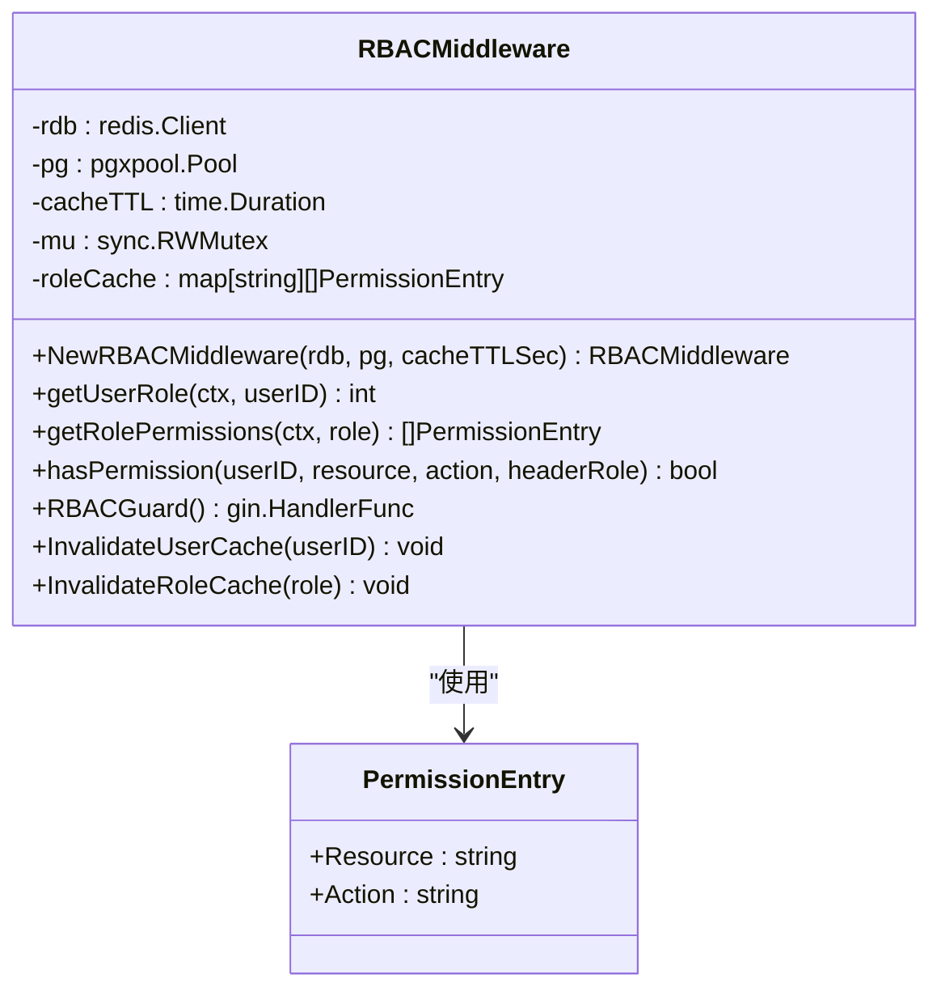
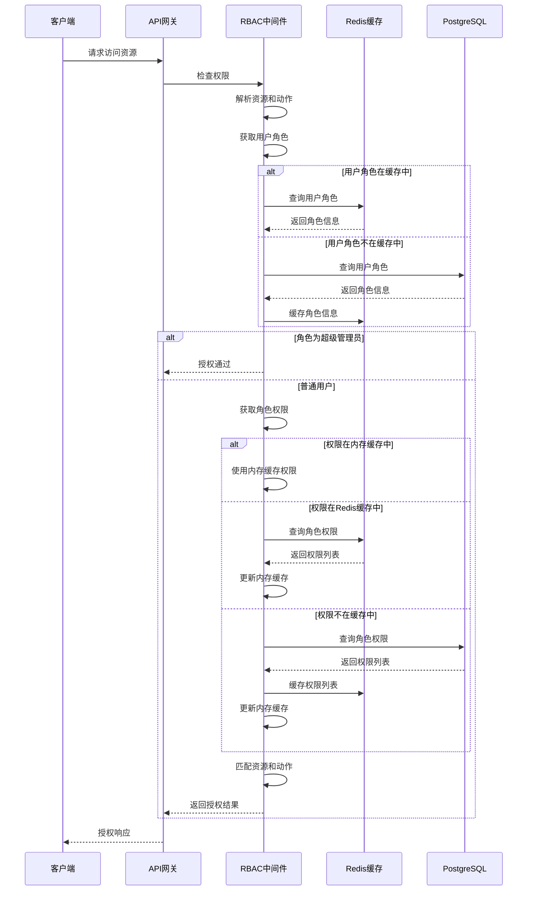
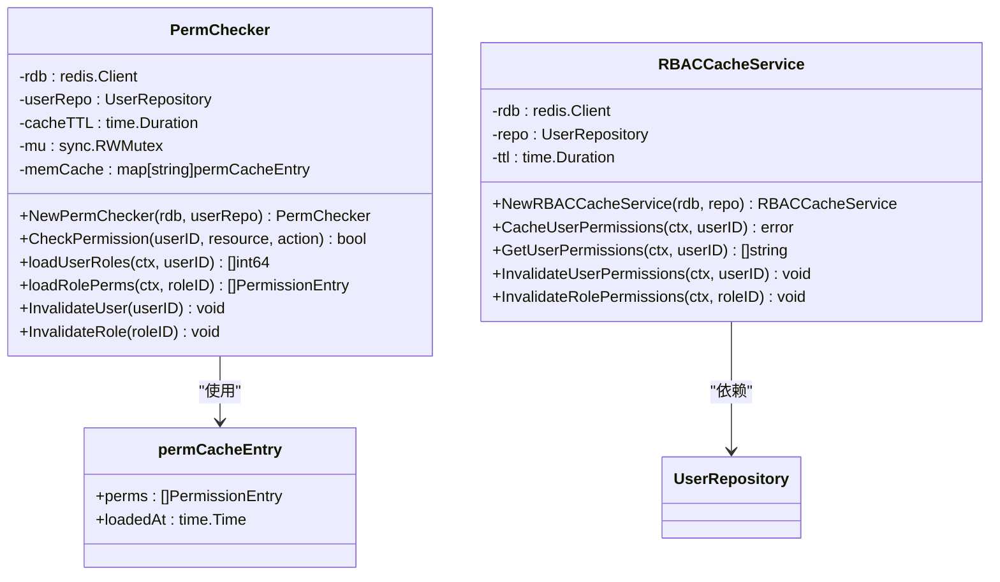
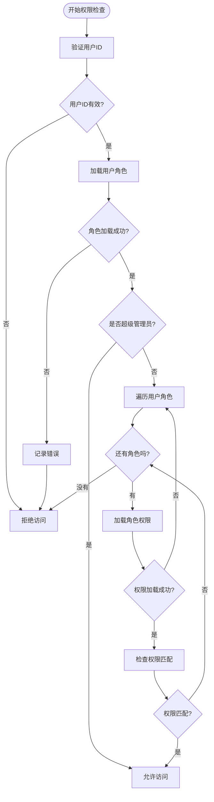
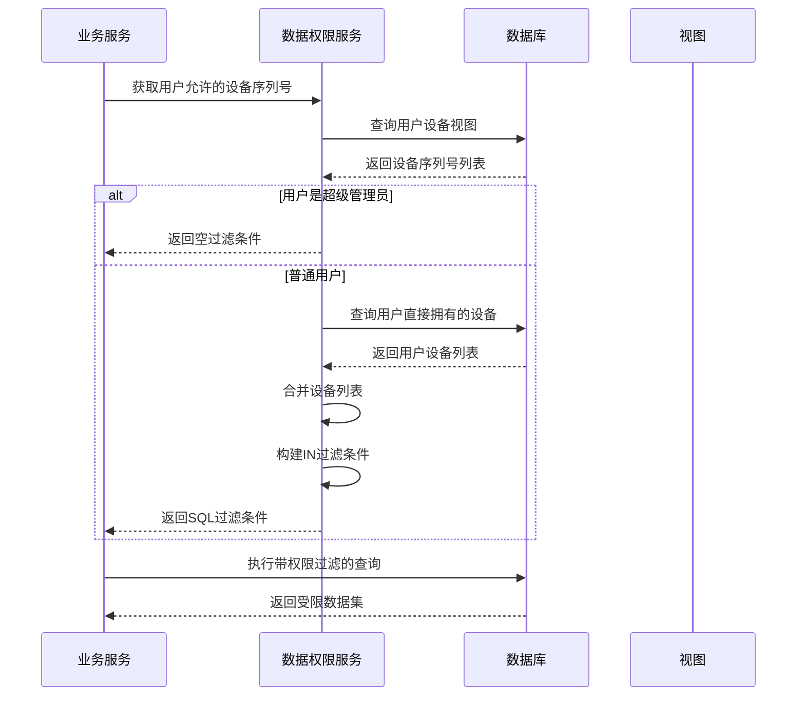
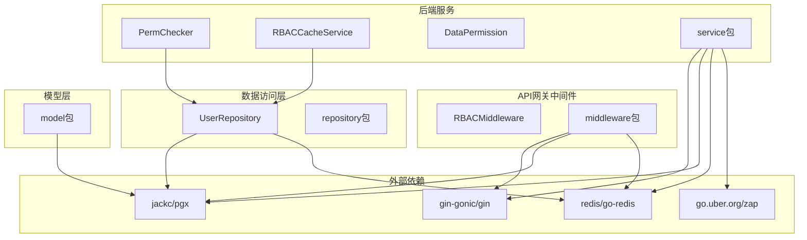
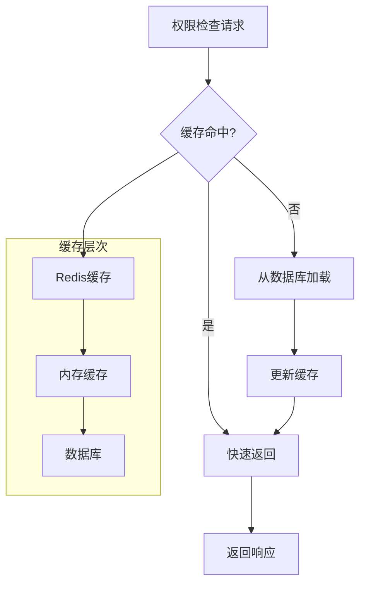

# RBAC权限控制

<cite>
**本文档引用的文件**
- [rbac.go](file://api-gateway/internal/middleware/rbac.go)
- [permission.go](file://inv_api_server/internal/middleware/permission.go)
- [rbac_cache.go](file://inv_api_server/internal/service/rbac_cache.go)
- [perm_checker.go](file://inv_api_server/internal/service/perm_checker.go)
- [data_permission.go](file://inv_api_server/internal/service/data_permission.go)
- [repositories.go](file://inv_api_server/internal/repository/repositories.go)
- [models.go](file://inv_api_server/internal/model/models.go)
- [main.go](file://api-gateway/main.go)
- [main.go](file://inv_api_server/cmd/main.go)
</cite>

## 目录
1. [引言](#引言)
2. [项目结构](#项目结构)
3. [核心组件](#核心组件)
4. [架构概览](#架构概览)
5. [详细组件分析](#详细组件分析)
6. [依赖关系分析](#依赖关系分析)
7. [性能考虑](#性能考虑)
8. [故障排除指南](#故障排除指南)
9. [结论](#结论)
10. [附录](#附录)

## 引言

本项目实现了完整的RBAC（基于角色的权限控制）系统，采用多层架构设计，在API网关和后端服务中分别实现了权限控制机制。系统支持用户、角色、权限和资源四个核心概念，通过静态权限配置和动态权限计算相结合的方式，提供了灵活而强大的权限管理能力。

RBAC系统的核心目标是确保用户只能访问其被授权的资源和执行相应的操作，同时提供高性能的权限检查机制和完善的审计功能。系统支持多种权限检查方式，包括API网关中间件、后端服务权限检查器和数据权限控制。

## 项目结构

RBAC权限控制系统分布在三个主要模块中：



**图表来源**
- [rbac.go:1-285](file://api-gateway/internal/middleware/rbac.go#L1-L285)
- [perm_checker.go:1-173](file://inv_api_server/internal/service/perm_checker.go#L1-L173)
- [rbac_cache.go:1-89](file://inv_api_server/internal/service/rbac_cache.go#L1-L89)

**章节来源**
- [main.go:1-129](file://api-gateway/main.go#L1-L129)
- [main.go:1-618](file://inv_api_server/cmd/main.go#L1-L618)

## 核心组件

### RBAC模型核心概念

RBAC系统基于以下四个核心概念构建：

1. **用户（User）**: 系统的使用者，具有唯一标识符
2. **角色（Role）**: 权限的集合，用户可以拥有一个或多个角色
3. **权限（Permission）**: 对特定资源执行特定操作的能力
4. **资源（Resource）**: 系统中受保护的对象或功能

### 权限映射机制

系统实现了两种权限映射机制：

**静态权限配置**:
- 通过配置文件定义资源与权限的映射关系
- 支持预定义的资源前缀和对应的操作类型
- 提供灵活的路径匹配机制

**动态权限计算**:
- 基于用户角色动态计算有效权限
- 支持角色继承和权限叠加
- 实时权限验证和缓存管理

**章节来源**
- [rbac.go:178-188](file://api-gateway/internal/middleware/rbac.go#L178-L188)
- [permission.go:12-18](file://inv_api_server/internal/middleware/permission.go#L12-L18)

## 架构概览

RBAC系统采用分层架构设计，确保权限控制的高效性和可维护性：



**图表来源**
- [rbac.go:190-239](file://api-gateway/internal/middleware/rbac.go#L190-L239)
- [perm_checker.go:41-74](file://inv_api_server/internal/service/perm_checker.go#L41-L74)
- [main.go:344-576](file://inv_api_server/cmd/main.go#L344-L576)

## 详细组件分析

### API网关RBAC中间件

API网关实现了轻量级的RBAC中间件，提供高效的权限控制：



**图表来源**
- [rbac.go:24-42](file://api-gateway/internal/middleware/rbac.go#L24-L42)
- [rbac.go:19-22](file://api-gateway/internal/middleware/rbac.go#L19-L22)

#### 权限检查流程



**图表来源**
- [rbac.go:135-176](file://api-gateway/internal/middleware/rbac.go#L135-L176)
- [rbac.go:44-75](file://api-gateway/internal/middleware/rbac.go#L44-L75)
- [rbac.go:77-133](file://api-gateway/internal/middleware/rbac.go#L77-L133)

**章节来源**
- [rbac.go:1-285](file://api-gateway/internal/middleware/rbac.go#L1-L285)

### 后端服务权限检查器

后端服务实现了更完善的权限检查机制：



**图表来源**
- [perm_checker.go:24-40](file://inv_api_server/internal/service/perm_checker.go#L24-L40)
- [rbac_cache.go:16-28](file://inv_api_server/internal/service/rbac_cache.go#L16-L28)

#### 权限检查算法



**图表来源**
- [perm_checker.go:41-74](file://inv_api_server/internal/service/perm_checker.go#L41-L74)
- [perm_checker.go:114-152](file://inv_api_server/internal/service/perm_checker.go#L114-L152)

**章节来源**
- [perm_checker.go:1-173](file://inv_api_server/internal/service/perm_checker.go#L1-L173)
- [rbac_cache.go:1-89](file://inv_api_server/internal/service/rbac_cache.go#L1-L89)

### 数据权限控制

系统实现了细粒度的数据权限控制，确保用户只能访问其有权访问的数据：

```mermaid
classDiagram
class DataPermission {
-pool : pgxpool.Pool
+GetAllowedDeviceSNs(ctx, userID) []string
+HasDeviceAccess(ctx, userID, deviceSN) bool
+BuildSNFilter(ctx, userID) (string, []interface{})
+getUserRole(ctx, userID) int
}
class DeviceRepository {
+GetUserDevices(ctx, userID) []Device
+HasDeviceAccess(ctx, userID, deviceSN) bool
+BuildDeviceFilter(ctx, userID) string
}
DataPermission --> DeviceRepository : "查询设备数据"
```

**图表来源**
- [data_permission.go:14-20](file://inv_api_server/internal/service/data_permission.go#L14-L20)

#### 数据权限检查流程



**图表来源**
- [data_permission.go:63-86](file://inv_api_server/internal/service/data_permission.go#L63-L86)
- [data_permission.go:22-46](file://inv_api_server/internal/service/data_permission.go#L22-L46)

**章节来源**
- [data_permission.go:1-96](file://inv_api_server/internal/service/data_permission.go#L1-L96)

### 权限配置和路由集成

系统通过中间件机制将权限控制集成到路由处理中：

```mermaid
graph LR
subgraph "路由定义"
ADMIN_ROUTE[管理员路由组]
USERS_ROUTE[用户路由组]
OTA_ROUTE[OTA路由组]
end
subgraph "权限中间件"
REQUIRE_ADMIN[RequirePermission(admin, manage)]
REQUIRE_USERS_VIEW[RequirePermission(users, view)]
REQUIRE_USERS_EDIT[RequirePermission(users, edit)]
REQUIRE_OTA_VIEW[RequirePermission(ota, view)]
REQUIRE_OTA_CREATE[RequirePermission(ota, create)]
end
subgraph "业务处理器"
ADMIN_HANDLER[管理员处理器]
USER_HANDLER[用户处理器]
OTA_HANDLER[OTA处理器]
end
ADMIN_ROUTE --> REQUIRE_ADMIN
USERS_ROUTE --> REQUIRE_USERS_VIEW
USERS_ROUTE --> REQUIRE_USERS_EDIT
OTA_ROUTE --> REQUIRE_OTA_VIEW
OTA_ROUTE --> REQUIRE_OTA_CREATE
REQUIRE_ADMIN --> ADMIN_HANDLER
REQUIRE_USERS_VIEW --> USER_HANDLER
REQUIRE_USERS_EDIT --> USER_HANDLER
REQUIRE_OTA_VIEW --> OTA_HANDLER
REQUIRE_OTA_CREATE --> OTA_HANDLER
```

**图表来源**
- [main.go:508-572](file://inv_api_server/cmd/main.go#L508-L572)

**章节来源**
- [main.go:508-572](file://inv_api_server/cmd/main.go#L508-L572)

## 依赖关系分析

RBAC系统的依赖关系体现了清晰的分层架构：



**图表来源**
- [rbac.go:3-17](file://api-gateway/internal/middleware/rbac.go#L3-L17)
- [perm_checker.go:3-15](file://inv_api_server/internal/service/perm_checker.go#L3-L15)
- [repositories.go:3-16](file://inv_api_server/internal/repository/repositories.go#L3-L16)

**章节来源**
- [repositories.go:1-800](file://inv_api_server/internal/repository/repositories.go#L1-L800)
- [models.go:1-379](file://inv_api_server/internal/model/models.go#L1-L379)

## 性能考虑

### 缓存策略

系统采用了多层次的缓存策略来优化性能：

1. **Redis缓存**:
   - 用户角色信息缓存
   - 角色权限列表缓存
   - 缓存TTL设置为5分钟

2. **内存缓存**:
   - API网关中间件的本地内存缓存
   - 最近使用的权限条目缓存

3. **数据库连接池**:
   - PostgreSQL连接池配置
   - 连接超时和重试机制

### 性能优化技术



**章节来源**
- [rbac_cache.go:22-28](file://inv_api_server/internal/service/rbac_cache.go#L22-L28)
- [perm_checker.go:32-39](file://inv_api_server/internal/service/perm_checker.go#L32-L39)

## 故障排除指南

### 常见问题诊断

1. **权限检查失败**:
   - 检查用户角色是否正确设置
   - 验证权限配置是否正确
   - 查看Redis缓存状态

2. **缓存失效问题**:
   - 确认缓存键格式正确
   - 检查TTL设置是否合理
   - 验证缓存清理逻辑

3. **数据库连接问题**:
   - 检查PostgreSQL连接参数
   - 验证连接池配置
   - 查看连接超时设置

### 错误处理机制

系统实现了完善的错误处理和日志记录机制：

**章节来源**
- [rbac.go:135-176](file://api-gateway/internal/middleware/rbac.go#L135-L176)
- [perm_checker.go:46-54](file://inv_api_server/internal/service/perm_checker.go#L46-L54)

## 结论

本RBAC权限控制系统通过分层架构设计，实现了高效、灵活且可扩展的权限管理机制。系统的主要特点包括：

1. **多层权限控制**: API网关和后端服务双重权限检查
2. **高性能缓存**: 多级缓存策略确保快速权限验证
3. **灵活配置**: 支持静态配置和动态权限计算
4. **完整审计**: 记录详细的权限访问日志
5. **数据隔离**: 细粒度的数据权限控制

系统为管理员提供了完整的权限管理界面，支持批量权限操作和实时权限验证，能够满足复杂的企业级权限管理需求。

## 附录

### 权限矩阵设计

系统支持的权限矩阵包括：

| 资源(Resource) | 动作(Action) | 描述 |
|---------------|-------------|------|
| admin | manage | 管理员管理权限 |
| users | view | 查看用户信息 |
| users | edit | 编辑用户信息 |
| ota | view | 查看固件信息 |
| ota | create | 创建固件 |
| ota | delete | 删除固件 |
| ota | control | 控制OTA操作 |
| devices | view | 查看设备信息 |
| devices | edit | 编辑设备信息 |
| alerts | view | 查看告警信息 |
| stations | view | 查看电站信息 |

### 权限配置示例

系统支持通过以下方式配置权限：

1. **数据库配置**: 直接在role_permissions表中配置
2. **API调用**: 通过管理员接口动态更新权限
3. **批量操作**: 支持批量分配和撤销权限

### 管理员界面功能

管理员可以通过以下界面进行权限管理：

- 用户角色管理
- 权限分配和撤销
- 批量权限操作
- 权限审计日志查看
- 系统健康监控