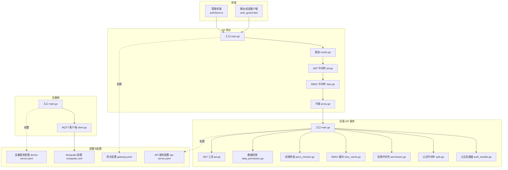
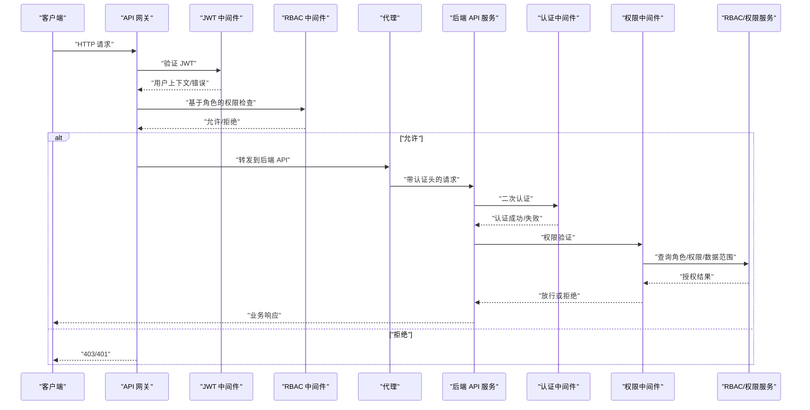
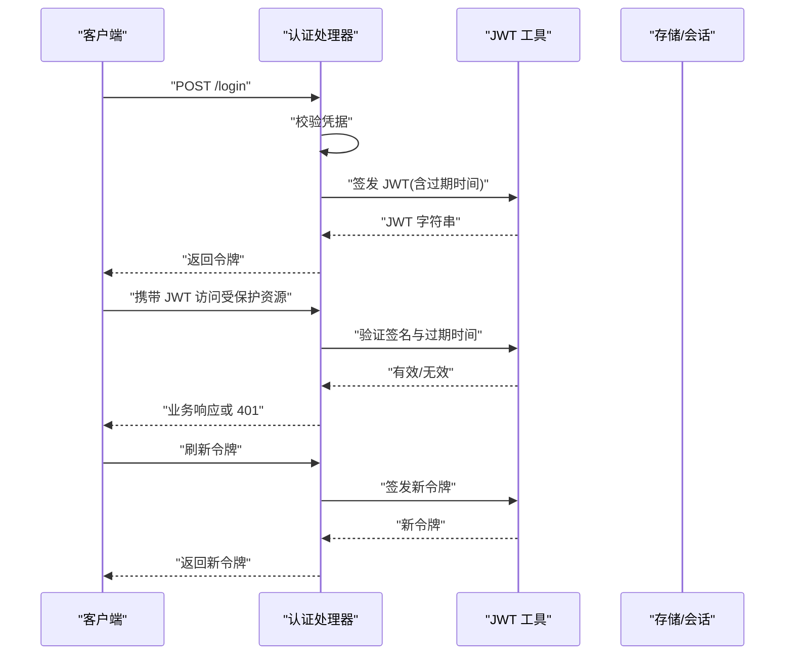
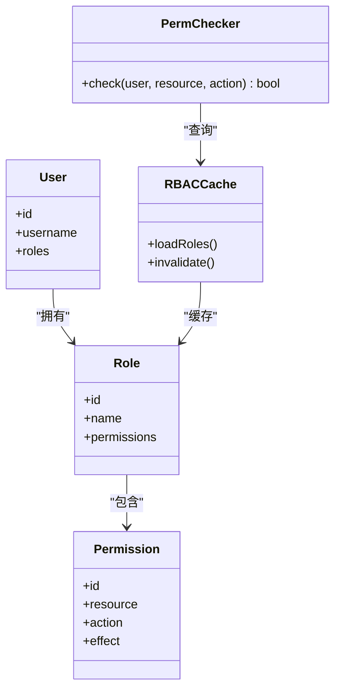
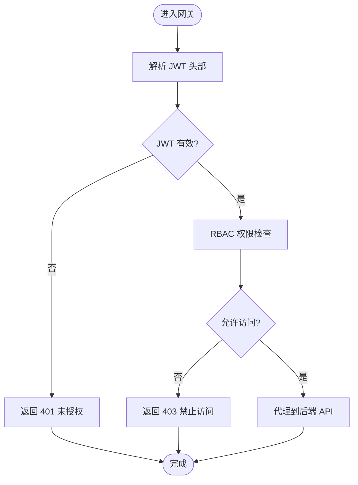
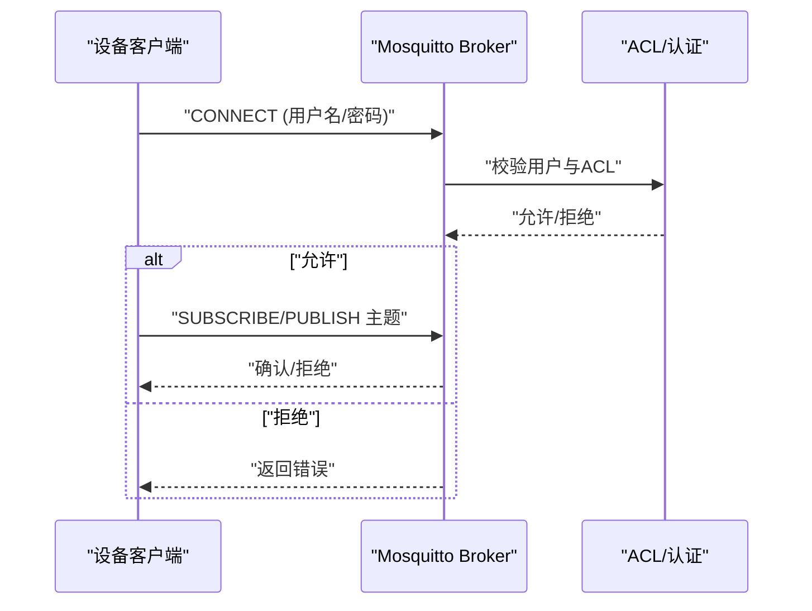
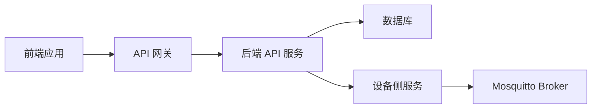

# 安全与权限

<cite>
**本文引用的文件**
- [api-gateway/main.go](file://api-gateway/main.go)
- [api-gateway/internal/config/config.go](file://api-gateway/internal/config/config.go)
- [api-gateway/internal/middleware/rbac.go](file://api-gateway/internal/middleware/rbac.go)
- [api-gateway/internal/middleware/jwt.go](file://api-gateway/internal/middleware/jwt.go)
- [api-gateway/internal/routes/routes.go](file://api-gateway/internal/routes/routes.go)
- [api-gateway/internal/proxy/proxy.go](file://api-gateway/internal/proxy/proxy.go)
- [inv_api_server/cmd/main.go](file://inv_api_server/cmd/main.go)
- [inv_api_server/internal/config/config.go](file://inv_api_server/internal/config/config.go)
- [inv_api_server/internal/handler/auth_handler.go](file://inv_api_server/internal/handler/auth_handler.go)
- [inv_api_server/internal/middleware/auth.go](file://inv_api_server/internal/middleware/auth.go)
- [inv_api_server/internal/middleware/permission.go](file://inv_api_server/internal/middleware/permission.go)
- [inv_api_server/internal/service/rbac_cache.go](file://inv_api_server/internal/service/rbac_cache.go)
- [inv_api_server/internal/service/data_permission.go](file://inv_api_server/internal/service/data_permission.go)
- [inv_api_server/internal/service/perm_checker.go](file://inv_api_server/internal/service/perm_checker.go)
- [inv_api_server/pkg/jwt/jwt.go](file://inv_api_server/pkg/jwt/jwt.go)
- [inv_api_server/internal/model/models.go](file://inv_api_server/internal/model/models.go)
- [inv_device_server/cmd/main.go](file://inv_device_server/cmd/main.go)
- [inv_device_server/internal/config/config.go](file://inv_device_server/internal/config/config.go)
- [inv_device_server/internal/mqtt/client.go](file://inv_device_server/internal/mqtt/client.go)
- [deploy/mosquitto/mosquitto.conf](file://deploy/mosquitto/mosquitto.conf)
- [deploy/configs/gateway.yaml](file://deploy/configs/gateway.yaml)
- [deploy/configs/device-server.yaml](file://deploy/configs/device-server.yaml)
- [deploy/configs/api-server.yaml](file://deploy/configs/api-server.yaml)
- [inv-admin-frontend/src/stores/authStore.ts](file://inv-admin-frontend/src/stores/authStore.ts)
- [inv-admin-frontend/src/pages/unauthorized.tsx](file://inv-admin-frontend/src/pages/unauthorized.tsx)
- [inv_app/lib/features/auth/presentation/pages/login_page.dart](file://inv_app/lib/features/auth/presentation/pages/login_page.dart)
- [inv_app/lib/features/auth/presentation/pages/forgot_password_page.dart](file://inv_app/lib/features/auth/presentation/pages/forgot_password_page.dart)
- [inv_app/lib/core/router/guards/auth_guard.dart](file://inv_app/lib/core/router/guards/auth_guard.dart)
</cite>

## 目录
1. [引言](#引言)
2. [项目结构](#项目结构)
3. [核心组件](#核心组件)
4. [架构总览](#架构总览)
5. [详细组件分析](#详细组件分析)
6. [依赖关系分析](#依赖关系分析)
7. [性能考虑](#性能考虑)
8. [故障排查指南](#故障排查指南)
9. [结论](#结论)
10. [附录](#附录)

## 引言
本文件面向安全与权限系统，围绕基于 RBAC 的权限控制模型与实现机制展开，覆盖 JWT 认证流程（签发、验证、刷新）、API 网关中间件的安全实现（认证拦截、权限验证、访问控制）、设备端安全机制（MQTT 连接认证与数据传输加密），并提供安全最佳实践、漏洞防护、渗透测试与应急响应方案，以及安全合规所需的审计日志与访问控制配置指南。

## 项目结构
该仓库采用多模块分层设计：前端应用、后端 API 服务、设备侧服务、API 网关、Mosquitto MQTT Broker 配置与部署脚本。安全相关能力主要分布在以下位置：
- API 网关：路由、CORS、限流、JWT 中间件、RBAC 中间件、代理转发
- 后端 API 服务：认证处理器、内部认证、权限中间件、RBAC 缓存与权限检查、JWT 工具
- 设备侧服务：MQTT 客户端与连接配置
- 前端应用：认证状态管理与登录页面
- 部署配置：Mosquitto 权限与 TLS 设置、各服务配置文件

图表来源
- [api-gateway/main.go:1-50](file://api-gateway/main.go#L1-L50)
- [api-gateway/internal/routes/routes.go:1-80](file://api-gateway/internal/routes/routes.go#L1-L80)
- [api-gateway/internal/middleware/jwt.go:1-120](file://api-gateway/internal/middleware/jwt.go#L1-L120)
- [api-gateway/internal/middleware/rbac.go:1-120](file://api-gateway/internal/middleware/rbac.go#L1-L120)
- [api-gateway/internal/proxy/proxy.go:1-120](file://api-gateway/internal/proxy/proxy.go#L1-L120)
- [inv_api_server/cmd/main.go:1-80](file://inv_api_server/cmd/main.go#L1-L80)
- [inv_api_server/internal/handler/auth_handler.go:1-120](file://inv_api_server/internal/handler/auth_handler.go#L1-L120)
- [inv_api_server/internal/middleware/auth.go:1-120](file://inv_api_server/internal/middleware/auth.go#L1-L120)
- [inv_api_server/internal/middleware/permission.go:1-120](file://inv_api_server/internal/middleware/permission.go#L1-L120)
- [inv_api_server/internal/service/rbac_cache.go:1-120](file://inv_api_server/internal/service/rbac_cache.go#L1-L120)
- [inv_api_server/internal/service/perm_checker.go:1-120](file://inv_api_server/internal/service/perm_checker.go#L1-L120)
- [inv_api_server/internal/service/data_permission.go:1-120](file://inv_api_server/internal/service/data_permission.go#L1-L120)
- [inv_api_server/pkg/jwt/jwt.go:1-120](file://inv_api_server/pkg/jwt/jwt.go#L1-L120)
- [inv_device_server/cmd/main.go:1-80](file://inv_device_server/cmd/main.go#L1-L80)
- [inv_device_server/internal/mqtt/client.go:1-120](file://inv_device_server/internal/mqtt/client.go#L1-L120)
- [deploy/mosquitto/mosquitto.conf:1-200](file://deploy/mosquitto/mosquitto.conf#L1-L200)
- [deploy/configs/gateway.yaml:1-200](file://deploy/configs/gateway.yaml#L1-L200)
- [deploy/configs/api-server.yaml:1-200](file://deploy/configs/api-server.yaml#L1-L200)
- [deploy/configs/device-server.yaml:1-200](file://deploy/configs/device-server.yaml#L1-L200)

章节来源
- [api-gateway/main.go:1-80](file://api-gateway/main.go#L1-L80)
- [inv_api_server/cmd/main.go:1-80](file://inv_api_server/cmd/main.go#L1-L80)
- [inv_device_server/cmd/main.go:1-80](file://inv_device_server/cmd/main.go#L1-L80)

## 核心组件
- API 网关中间件栈：CORS、限流、JWT 验证、RBAC 授权、请求代理
- 后端 API 服务：认证处理器、内部认证、权限中间件、RBAC 缓存与检查器、数据权限、JWT 工具
- 设备侧服务：MQTT 客户端与连接配置
- 前端应用：认证状态管理与登录页面
- 部署配置：Mosquitto 权限与 TLS 设置、各服务配置文件

章节来源
- [api-gateway/internal/middleware/jwt.go:1-120](file://api-gateway/internal/middleware/jwt.go#L1-L120)
- [api-gateway/internal/middleware/rbac.go:1-120](file://api-gateway/internal/middleware/rbac.go#L1-L120)
- [inv_api_server/internal/middleware/auth.go:1-120](file://inv_api_server/internal/middleware/auth.go#L1-L120)
- [inv_api_server/internal/middleware/permission.go:1-120](file://inv_api_server/internal/middleware/permission.go#L1-L120)
- [inv_api_server/internal/service/rbac_cache.go:1-120](file://inv_api_server/internal/service/rbac_cache.go#L1-L120)
- [inv_api_server/internal/service/perm_checker.go:1-120](file://inv_api_server/internal/service/perm_checker.go#L1-L120)
- [inv_api_server/internal/service/data_permission.go:1-120](file://inv_api_server/internal/service/data_permission.go#L1-L120)
- [inv_api_server/pkg/jwt/jwt.go:1-120](file://inv_api_server/pkg/jwt/jwt.go#L1-L120)
- [inv_device_server/internal/mqtt/client.go:1-120](file://inv_device_server/internal/mqtt/client.go#L1-L120)
- [deploy/mosquitto/mosquitto.conf:1-200](file://deploy/mosquitto/mosquitto.conf#L1-L200)

## 架构总览
下图展示从客户端到后端 API 的整体安全链路：前端通过网关进行认证与权限校验，网关将请求转发至后端 API；后端 API 内部也执行认证与权限检查，并通过缓存与检查器实现高效授权；设备侧通过 MQTT Broker 完成认证与加密传输。

图表来源
- [api-gateway/internal/middleware/jwt.go:1-120](file://api-gateway/internal/middleware/jwt.go#L1-L120)
- [api-gateway/internal/middleware/rbac.go:1-120](file://api-gateway/internal/middleware/rbac.go#L1-L120)
- [api-gateway/internal/proxy/proxy.go:1-120](file://api-gateway/internal/proxy/proxy.go#L1-L120)
- [inv_api_server/internal/middleware/auth.go:1-120](file://inv_api_server/internal/middleware/auth.go#L1-L120)
- [inv_api_server/internal/middleware/permission.go:1-120](file://inv_api_server/internal/middleware/permission.go#L1-L120)
- [inv_api_server/internal/service/rbac_cache.go:1-120](file://inv_api_server/internal/service/rbac_cache.go#L1-L120)
- [inv_api_server/internal/service/perm_checker.go:1-120](file://inv_api_server/internal/service/perm_checker.go#L1-L120)

## 详细组件分析

### JWT 认证流程
- 签发：后端认证处理器在用户登录成功后生成 JWT，包含用户标识、角色等声明，并设置过期时间。
- 验证：API 网关与后端均配置 JWT 中间件，解析并验证签名与有效期。
- 刷新：建议在前端或移动端定期刷新令牌，避免过期导致的频繁登录。

图表来源
- [inv_api_server/internal/handler/auth_handler.go:1-120](file://inv_api_server/internal/handler/auth_handler.go#L1-L120)
- [inv_api_server/pkg/jwt/jwt.go:1-120](file://inv_api_server/pkg/jwt/jwt.go#L1-L120)

章节来源
- [inv_api_server/internal/handler/auth_handler.go:1-120](file://inv_api_server/internal/handler/auth_handler.go#L1-L120)
- [inv_api_server/pkg/jwt/jwt.go:1-120](file://inv_api_server/pkg/jwt/jwt.go#L1-L120)

### RBAC 权限模型与实现
- 角色定义：用户关联角色，角色关联权限集合，支持资源维度的细粒度控制。
- 权限映射：通过缓存与检查器实现高性能权限判断，避免每次请求重复查询数据库。
- 资源访问控制：结合路径、方法、租户/组织范围等维度进行访问控制。

图表来源
- [inv_api_server/internal/service/rbac_cache.go:1-120](file://inv_api_server/internal/service/rbac_cache.go#L1-L120)
- [inv_api_server/internal/service/perm_checker.go:1-120](file://inv_api_server/internal/service/perm_checker.go#L1-L120)
- [inv_api_server/internal/model/models.go:1-200](file://inv_api_server/internal/model/models.go#L1-L200)

章节来源
- [inv_api_server/internal/service/rbac_cache.go:1-120](file://inv_api_server/internal/service/rbac_cache.go#L1-L120)
- [inv_api_server/internal/service/perm_checker.go:1-120](file://inv_api_server/internal/service/perm_checker.go#L1-L120)
- [inv_api_server/internal/model/models.go:1-200](file://inv_api_server/internal/model/models.go#L1-L200)

### API 网关中间件安全实现
- 认证拦截：JWT 中间件负责解析与验证请求中的令牌。
- 权限验证：RBAC 中间件根据用户角色与资源路径进行授权判断。
- 访问控制：结合路由规则与权限策略，统一处理跨域、限流与代理转发。

图表来源
- [api-gateway/internal/middleware/jwt.go:1-120](file://api-gateway/internal/middleware/jwt.go#L1-L120)
- [api-gateway/internal/middleware/rbac.go:1-120](file://api-gateway/internal/middleware/rbac.go#L1-L120)
- [api-gateway/internal/proxy/proxy.go:1-120](file://api-gateway/internal/proxy/proxy.go#L1-L120)

章节来源
- [api-gateway/internal/middleware/jwt.go:1-120](file://api-gateway/internal/middleware/jwt.go#L1-L120)
- [api-gateway/internal/middleware/rbac.go:1-120](file://api-gateway/internal/middleware/rbac.go#L1-L120)
- [api-gateway/internal/proxy/proxy.go:1-120](file://api-gateway/internal/proxy/proxy.go#L1-L120)

### 设备端安全机制（MQTT）
- 连接认证：Mosquitto 配置启用用户名/密码认证与 ACL 控制，限制主题订阅/发布权限。
- 数据传输加密：建议启用 TLS/SSL，确保设备与 Broker 之间的通信机密性与完整性。
- 主题命名规范：按设备 ID 或租户划分主题，配合 ACL 实现最小权限原则。

图表来源
- [deploy/mosquitto/mosquitto.conf:1-200](file://deploy/mosquitto/mosquitto.conf#L1-L200)
- [inv_device_server/internal/mqtt/client.go:1-120](file://inv_device_server/internal/mqtt/client.go#L1-L120)

章节来源
- [deploy/mosquitto/mosquitto.conf:1-200](file://deploy/mosquitto/mosquitto.conf#L1-L200)
- [inv_device_server/internal/mqtt/client.go:1-120](file://inv_device_server/internal/mqtt/client.go#L1-L120)

### 前端安全实现
- 认证状态管理：前端通过认证状态存储与路由守卫实现未登录跳转与受保护页面访问控制。
- 登录与忘记密码：提供登录与找回密码页面，结合后端认证接口完成身份验证。

章节来源
- [inv-admin-frontend/src/stores/authStore.ts:1-200](file://inv-admin-frontend/src/stores/authStore.ts#L1-L200)
- [inv-admin-frontend/src/pages/unauthorized.tsx:1-120](file://inv-admin-frontend/src/pages/unauthorized.tsx#L1-L120)
- [inv_app/lib/core/router/guards/auth_guard.dart:1-120](file://inv_app/lib/core/router/guards/auth_guard.dart#L1-L120)
- [inv_app/lib/features/auth/presentation/pages/login_page.dart:1-120](file://inv_app/lib/features/auth/presentation/pages/login_page.dart#L1-L120)
- [inv_app/lib/features/auth/presentation/pages/forgot_password_page.dart:1-120](file://inv_app/lib/features/auth/presentation/pages/forgot_password_page.dart#L1-L120)

## 依赖关系分析
- 网关依赖后端 API 提供的认证与权限服务，通过代理转发实现统一入口。
- 后端 API 依赖 RBAC 缓存与权限检查器，降低数据库压力并提升响应速度。
- 设备侧依赖 Mosquitto 的认证与 ACL，保障消息通道安全。
- 前端依赖后端提供的认证接口与受保护资源访问。

图表来源
- [api-gateway/internal/proxy/proxy.go:1-120](file://api-gateway/internal/proxy/proxy.go#L1-L120)
- [inv_api_server/internal/service/rbac_cache.go:1-120](file://inv_api_server/internal/service/rbac_cache.go#L1-L120)
- [inv_device_server/internal/mqtt/client.go:1-120](file://inv_device_server/internal/mqtt/client.go#L1-L120)
- [deploy/mosquitto/mosquitto.conf:1-200](file://deploy/mosquitto/mosquitto.conf#L1-L200)

章节来源
- [api-gateway/internal/proxy/proxy.go:1-120](file://api-gateway/internal/proxy/proxy.go#L1-L120)
- [inv_api_server/internal/service/rbac_cache.go:1-120](file://inv_api_server/internal/service/rbac_cache.go#L1-L120)
- [inv_device_server/internal/mqtt/client.go:1-120](file://inv_device_server/internal/mqtt/client.go#L1-L120)
- [deploy/mosquitto/mosquitto.conf:1-200](file://deploy/mosquitto/mosquitto.conf#L1-L200)

## 性能考虑
- JWT 验证：使用对称算法（如 HS256）时，注意密钥管理与轮换；避免过长的过期时间以减少长期风险暴露。
- RBAC 缓存：合理设置缓存失效策略与主动失效机制，平衡一致性与性能。
- 限流与熔断：在网关层实施速率限制与熔断策略，防止滥用与攻击放大。
- 数据权限：结合租户/组织维度进行数据权限过滤，避免全表扫描。

## 故障排查指南
- 401 未授权：检查 JWT 是否过期、签名是否正确、网关与后端的密钥是否一致。
- 403 禁止访问：核对用户角色与资源权限映射，确认 RBAC 缓存是否需要刷新。
- 设备无法连接：检查 Mosquitto 用户名/密码与 ACL 配置，确认 TLS 证书与端口开放。
- 前端无权限页面：确认路由守卫与认证状态同步，检查后端权限接口返回。

章节来源
- [api-gateway/internal/middleware/jwt.go:1-120](file://api-gateway/internal/middleware/jwt.go#L1-L120)
- [api-gateway/internal/middleware/rbac.go:1-120](file://api-gateway/internal/middleware/rbac.go#L1-L120)
- [inv_api_server/internal/middleware/auth.go:1-120](file://inv_api_server/internal/middleware/auth.go#L1-L120)
- [inv_api_server/internal/middleware/permission.go:1-120](file://inv_api_server/internal/middleware/permission.go#L1-L120)
- [deploy/mosquitto/mosquitto.conf:1-200](file://deploy/mosquitto/mosquitto.conf#L1-L200)

## 结论
本项目通过“网关 + 后端 + 设备侧”的多层安全设计，实现了基于 JWT 的认证与基于 RBAC 的权限控制，并在 Mosquitto 上落实了设备端的认证与访问控制。建议持续完善密钥轮换、审计日志与合规配置，强化安全运营与应急响应能力。

## 附录

### 安全最佳实践
- 密码策略：强密码、定期轮换、禁止明文存储与传输。
- 会话管理：短令牌生命周期、静默刷新、登出清理。
- 防暴力破解：登录失败计数、IP 限流、验证码。
- 安全审计：记录登录、权限变更、敏感操作日志，保留足够元数据用于追踪。

### 渗透测试与应急响应
- 渗透测试：模拟常见攻击（SQL 注入、XSS、CSRF、暴力破解），验证边界与修复。
- 应急响应：建立事件分级、快速隔离、回滚与修复流程，定期演练。

### 合规与审计配置
- 审计日志：记录主体、客体、操作、时间、结果与 IP，满足可追溯要求。
- 访问控制：最小权限原则、职责分离、定期权限复核。

### EMQX（Mosquitto）内置 JWT 认证配置要点
- 启用 JWT 插件与配置项，设置 HS256 加密与过期时间。
- 在 ACL 中基于主题前缀与用户属性进行细粒度控制。
- 生产环境启用 TLS/SSL 并配置证书吊销列表。

章节来源
- [deploy/mosquitto/mosquitto.conf:1-200](file://deploy/mosquitto/mosquitto.conf#L1-L200)