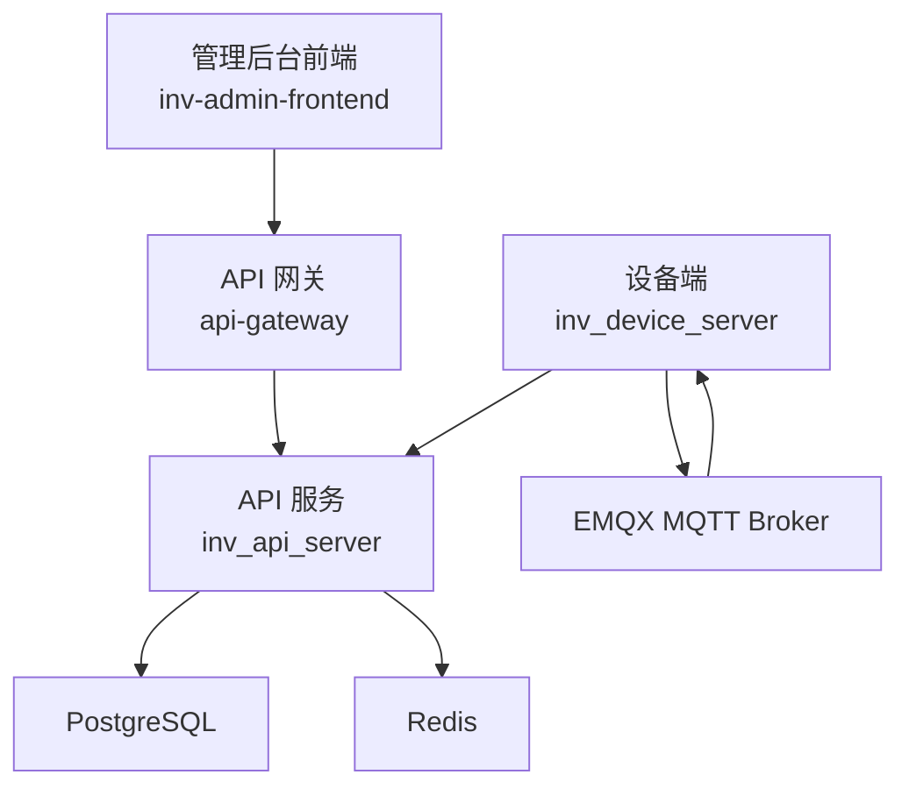
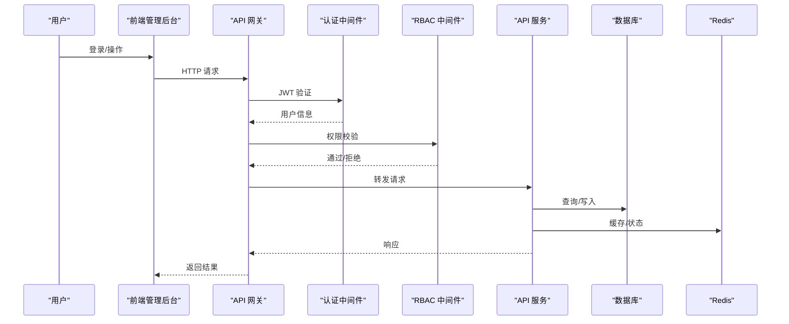
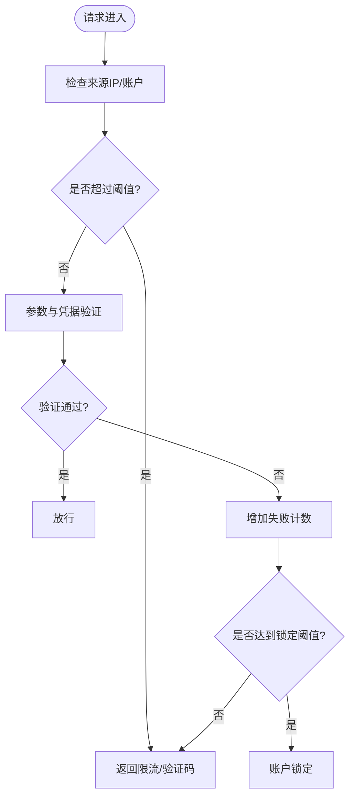
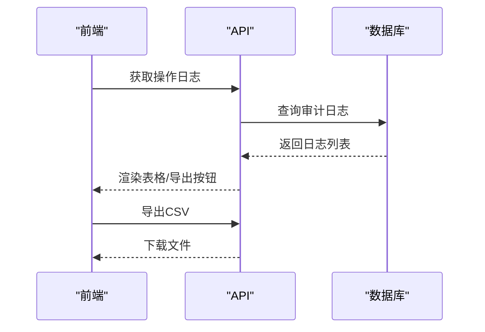
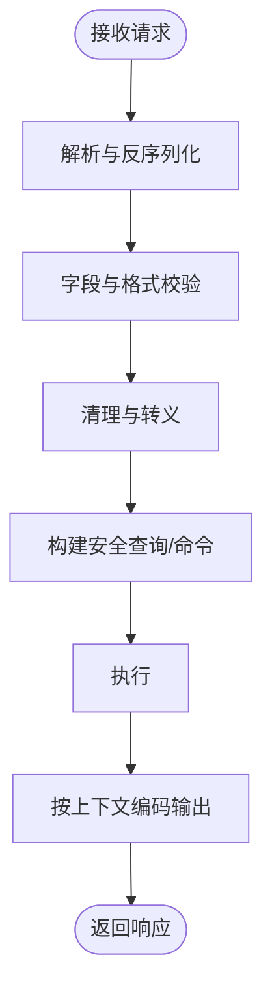
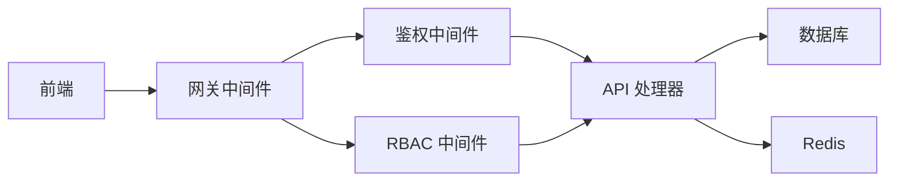

# 安全最佳实践

<cite>
**本文档引用的文件**
- [README.md](file://README.md)
- [main.go](file://inv_api_server/cmd/main.go)
- [auth_handler.go](file://inv_api_server/internal/handler/auth_handler.go)
- [auth.go](file://inv_api_server/internal/middleware/auth.go)
- [jwt.go](file://inv_api_server/pkg/jwt/jwt.go)
- [cors.go](file://api-gateway/internal/middleware/cors.go)
- [ratelimit.go](file://api-gateway/internal/middleware/ratelimit.go)
- [rbac.go](file://api-gateway/internal/middleware/rbac.go)
- [logger.go](file://api-gateway/internal/middleware/logger.go)
- [internal_handler_test.go](file://inv_api_server/internal/handler/internal_handler_test.go)
- [protocol_parser.go](file://inv_device_server/internal/service/protocol_parser.go)
- [index.tsx](file://inv-admin-frontend/src/pages/operation-logs/index.tsx)
- [models.go](file://inv_api_server/internal/model/models.go)
- [repositories.go](file://inv_api_server/internal/repository/repositories.go)
- [deploy.sh](file://deploy/deploy.sh)
- [nginx.conf](file://deploy/nginx.conf)
</cite>

## 目录
1. [引言](#引言)
2. [项目结构](#项目结构)
3. [核心组件](#核心组件)
4. [架构总览](#架构总览)
5. [详细组件分析](#详细组件分析)
6. [依赖关系分析](#依赖关系分析)
7. [性能考虑](#性能考虑)
8. [故障排除指南](#故障排除指南)
9. [结论](#结论)
10. [附录](#附录)

## 引言
本文件面向开发与运维团队，提供一套可落地的安全最佳实践指导，覆盖密码安全策略、会话管理、防暴力破解、安全审计、输入验证与输出编码、CSRF与CORS防护、安全配置检查清单、渗透测试指南、应急响应流程以及安全编码规范与代码审查要点。内容结合仓库现有实现进行分析，并给出改进建议与落地步骤。

## 项目结构
系统采用多层架构：前端管理后台负责操作与可视化；API 网关承担路由、鉴权、限流、跨域等网关职责；后端 API 服务提供业务能力；设备侧通过 MQTT 上报数据；数据库与缓存支撑数据持久化与实时状态。

图表来源
- [README.md:1-31](file://README.md#L1-L31)
- [main.go:102-150](file://inv_api_server/cmd/main.go#L102-L150)

章节来源
- [README.md:1-31](file://README.md#L1-L31)
- [main.go:102-150](file://inv_api_server/cmd/main.go#L102-L150)

## 核心组件
- API 网关中间件：鉴权、跨域、限流、RBAC、日志
- API 服务：认证、授权、业务处理、审计日志导出
- 设备服务：协议解析、内部接口调用、故障上报
- 前端：操作日志展示、导出 CSV
- 数据模型与仓储：审计日志、告警、设备状态

章节来源
- [auth_handler.go](file://inv_api_server/internal/handler/auth_handler.go)
- [auth.go](file://inv_api_server/internal/middleware/auth.go)
- [jwt.go](file://inv_api_server/pkg/jwt/jwt.go)
- [cors.go](file://api-gateway/internal/middleware/cors.go)
- [ratelimit.go](file://api-gateway/internal/middleware/ratelimit.go)
- [rbac.go](file://api-gateway/internal/middleware/rbac.go)
- [logger.go](file://api-gateway/internal/middleware/logger.go)
- [protocol_parser.go](file://inv_device_server/internal/service/protocol_parser.go)
- [index.tsx](file://inv-admin-frontend/src/pages/operation-logs/index.tsx)
- [models.go](file://inv_api_server/internal/model/models.go)
- [repositories.go](file://inv_api_server/internal/repository/repositories.go)

## 架构总览
系统安全边界与数据流如下：

图表来源
- [README.md:7-29](file://README.md#L7-L29)
- [main.go:504-548](file://inv_api_server/cmd/main.go#L504-L548)
- [auth.go:1-200](file://inv_api_server/internal/middleware/auth.go)
- [rbac.go:190-223](file://api-gateway/internal/middleware/rbac.go)

## 详细组件分析

### 密码安全策略
- 当前实现：系统通过 JWT（HS256）进行认证，密钥集中管理，避免弱口令问题。设备侧通过“密码=JWT”的方式连接 MQTT，降低明文口令风险。
- 建议增强：
  - 后端用户密码：若存在用户密码登录场景，建议引入强口令策略（长度、字符集、复杂度）、密码哈希（如 bcrypt/scrypt/argon2）、密码历史与轮换机制、强制定期更换策略。
  - 传输加密：确保所有敏感通信使用 TLS 1.2+/TLS 1.3，禁用弱加密套件。
  - 会话令牌：JWT 应设置合理有效期与刷新策略，启用“单点登录”与“吊销列表”，支持异地登录通知与设备管理。

章节来源
- [README.md:8-15](file://README.md#L8-L15)
- [jwt.go](file://inv_api_server/pkg/jwt/jwt.go)

### 会话安全管理
- 当前实现：使用 JWT 进行无状态认证，设备侧通过共享订阅与内置 JWT 验证保障连接安全。
- 建议增强：
  - 会话超时：为 Web 会话设置短生命周期，结合“静默续期”与“强制登出”机制。
  - 并发控制：限制同一账号同时登录数，启用“踢人下线”功能。
  - 会话固定防护：每次登录生成新会话 ID，清空旧会话；严格 SameSite/Cookie 属性；禁止通过 URL 传递会话标识。

章节来源
- [README.md:10-15](file://README.md#L10-L15)
- [jwt.go](file://inv_api_server/pkg/jwt/jwt.go)

### 防暴力破解
- 当前实现：API 网关提供基于令牌桶的全局与路径级限流中间件。
- 建议增强：
  - IP 级限流：对登录接口实施更细粒度的 IP 限速与熔断。
  - 账户锁定：连续失败阈值触发临时锁定与人工解锁。
  - 验证码：登录/高危操作引入图形/滑动验证码或短信/邮件二次确认。
  - 行为分析：结合设备指纹、地理位置与 UA 进行异常检测。

图表来源
- [ratelimit.go:48-93](file://api-gateway/internal/middleware/ratelimit.go#L48-L93)

章节来源
- [ratelimit.go](file://api-gateway/internal/middleware/ratelimit.go)

### 安全审计与日志记录
- 当前实现：前端提供操作日志页面与 CSV 导出；后端提供审计日志查询与导出接口。
- 建议增强：
  - 结构化日志：统一字段（时间戳、用户、IP、资源、动作、详情、结果）。
  - 日志脱敏：敏感字段（密码、令牌、手机号）脱敏显示。
  - 存储与保留：分级存储与合规保留周期；支持检索与聚合分析。
  - 实时告警：异常行为（批量导出、越权访问）触发告警。

图表来源
- [index.tsx:253-308](file://inv-admin-frontend/src/pages/operation-logs/index.tsx#L253-L308)
- [main.go:529-531](file://inv_api_server/cmd/main.go#L529-L531)

章节来源
- [index.tsx](file://inv-admin-frontend/src/pages/operation-logs/index.tsx)
- [main.go](file://inv_api_server/cmd/main.go)

### 输入验证与输出编码
- 当前实现：内部接口测试覆盖了必填字段校验（缺失 sn/topic/data 返回错误）。
- 建议增强：
  - 全面输入校验：类型、范围、长度、格式、白名单。
  - ORM/查询构建：统一使用参数化查询，避免字符串拼接。
  - 输出编码：HTML/JS/URL/属性上下文分别进行对应编码。
  - 协议解析：设备上报数据需做严格解码与校验，防止恶意 payload。

图表来源
- [internal_handler_test.go:114-156](file://inv_api_server/internal/handler/internal_handler_test.go#L114-L156)

章节来源
- [internal_handler_test.go](file://inv_api_server/internal/handler/internal_handler_test.go)

### CSRF 防护与 CORS 安全配置
- CSRF 防护：同源策略 + Token 校验（Synchronizer Token Pattern）；表单提交携带一次性 Token。
- CORS 安全：精确配置 AllowedOrigins/Methods/Headers；禁用通配符；最小权限暴露；预检缓存合理设置。

章节来源
- [cors.go](file://api-gateway/internal/middleware/cors.go)

### 设备侧安全与内部通信
- 内部接口调用：设备服务向 API 发起内部调用时设置超时与重试，失败时记录错误日志。
- 故障上报：使用 Redis 防抖与 TTL 控制，避免重复上报与覆盖。

章节来源
- [protocol_parser.go:406-445](file://inv_device_server/internal/service/protocol_parser.go#L406-L445)
- [protocol_parser.go:577-606](file://inv_device_server/internal/service/protocol_parser.go#L577-L606)

## 依赖关系分析
- 认证链路：前端 → 网关鉴权中间件 → API 鉴权中间件 → 业务处理器。
- 授权链路：网关 RBAC → API 权限检查 → 业务逻辑。
- 数据流：前端/设备 → 网关 → API → 数据库/缓存。

图表来源
- [main.go:504-548](file://inv_api_server/cmd/main.go#L504-L548)
- [auth.go:1-200](file://inv_api_server/internal/middleware/auth.go)
- [rbac.go:190-223](file://api-gateway/internal/middleware/rbac.go)

## 性能考虑
- 限流策略：根据接口特性设置不同速率与突发值，避免热点接口被压垮。
- 缓存命中：合理利用 Redis 缓存在线状态与实时数据，减少数据库压力。
- 日志异步：审计日志写入采用异步或批量方式，避免阻塞主流程。

## 故障排除指南
- 登录失败/限流：检查网关限流配置与 IP 白名单；确认验证码/二次验证是否开启。
- 权限不足：核对 RBAC 规则映射与用户角色头信息；确认资源前缀匹配。
- 设备离线：检查设备服务到 API 的内部调用日志；确认 Redis 在线标记与 TTL 设置。
- 日志缺失：确认审计日志接口权限与导出功能可用性。

章节来源
- [rbac.go:178-188](file://api-gateway/internal/middleware/rbac.go#L178-L188)
- [protocol_parser.go:406-445](file://inv_device_server/internal/service/protocol_parser.go#L406-L445)
- [index.tsx:163-198](file://inv-admin-frontend/src/pages/operation-logs/index.tsx#L163-L198)

## 结论
本项目在设备侧认证与网关层具备一定安全基础，建议围绕密码策略、会话管理、防暴力破解、审计日志、输入输出安全、CSRF/CORS 防护等方面补齐短板，形成闭环的安全体系。通过持续的渗透测试与应急演练，不断提升系统的整体安全性。

## 附录

### 安全配置检查清单
- [ ] 使用强口令策略与密码哈希
- [ ] 启用 HTTPS/TLS 与安全套件
- [ ] JWT 密钥集中管理与轮换
- [ ] 会话超时与并发控制
- [ ] 登录接口限流与验证码
- [ ] RBAC 规则与最小权限
- [ ] 结构化审计日志与脱敏
- [ ] 输入校验与参数化查询
- [ ] CSRF Token 与 CORS 最小暴露
- [ ] 设备内部通信鉴权与超时
- [ ] 日志与告警联动

### 渗透测试指南
- 身份认证：爆破、会话劫持、令牌泄露
- 权限绕过：越权访问、RBAC 绕过、路径遍历
- 注入攻击：SQL 注入、命令注入、脚本注入
- XSS/CSRF：反射型/存储型 XSS、CSRF 攻击
- 配置缺陷：CORS 滥用、敏感信息泄露、日志未脱敏
- 业务逻辑：批量导出、越权修改、异常流程

### 应急响应流程
- 快速隔离：封禁受影响账号/IP，暂停高危接口
- 影响评估：统计受影响用户与数据范围
- 修复与加固：修复漏洞、加强日志与告警
- 通告与复盘：发布安全公告，总结改进措施

### 安全编码规范与代码审查要点
- 输入校验：必填、类型、范围、长度、格式
- 输出编码：HTML/JS/URL/属性上下文
- 错误处理：不泄露内部细节，统一错误码
- 日志记录：含必要字段，脱敏敏感信息
- 权限控制：先鉴权再授权，最小权限原则
- 配置管理：密钥与证书集中管理，环境区分