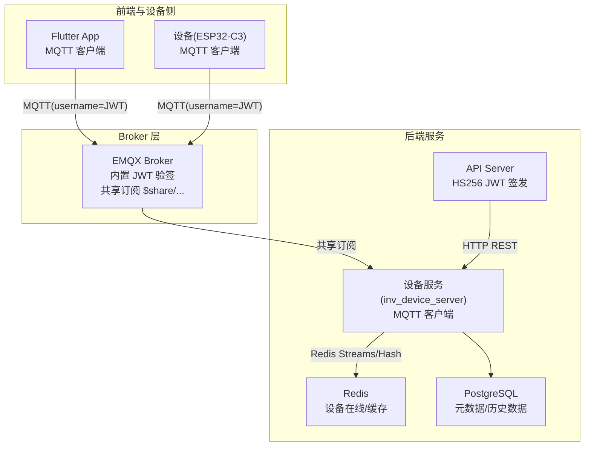
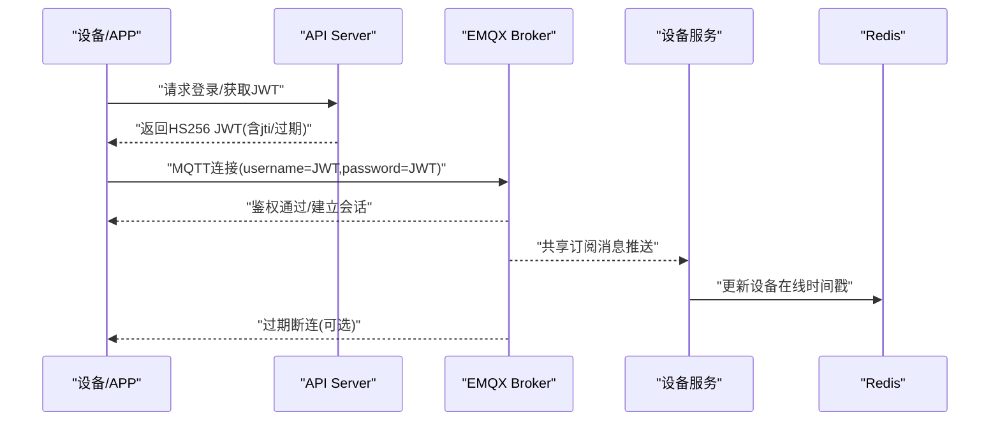
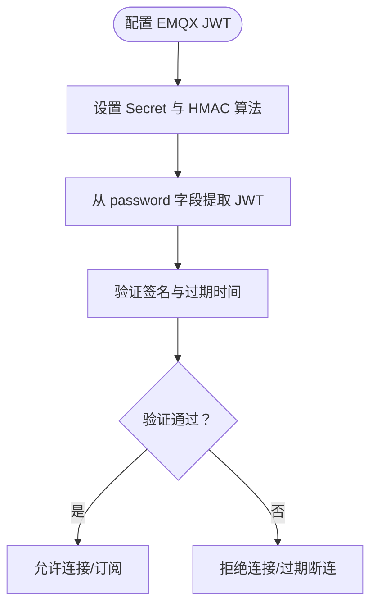
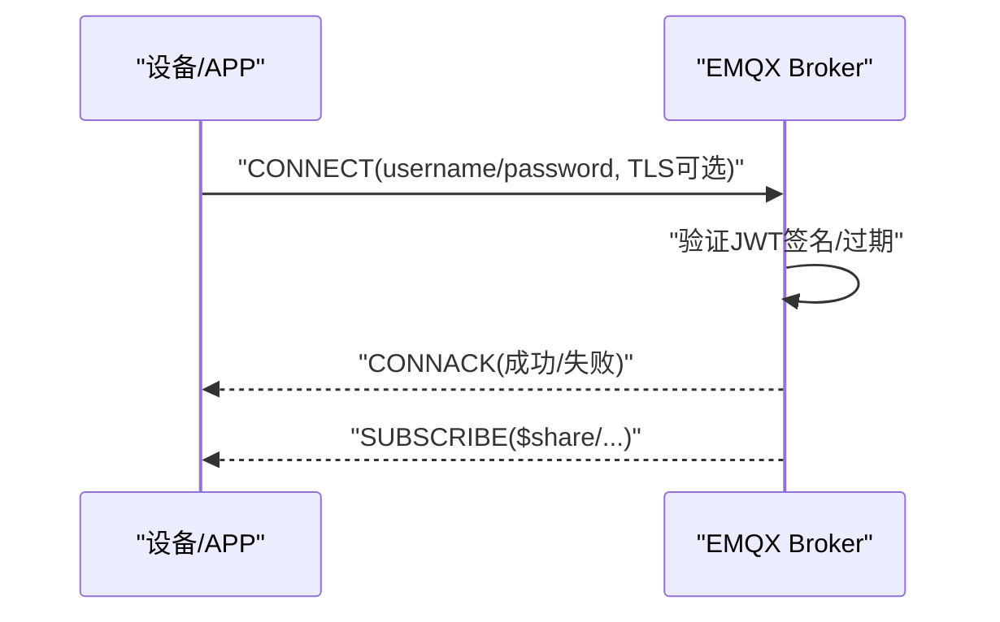
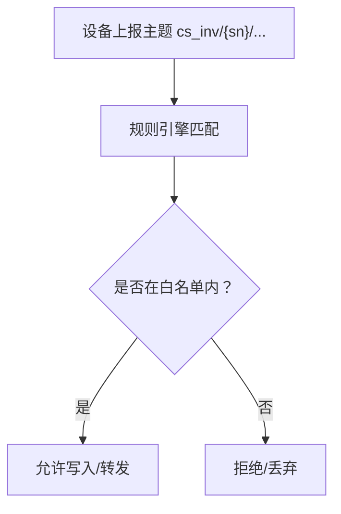
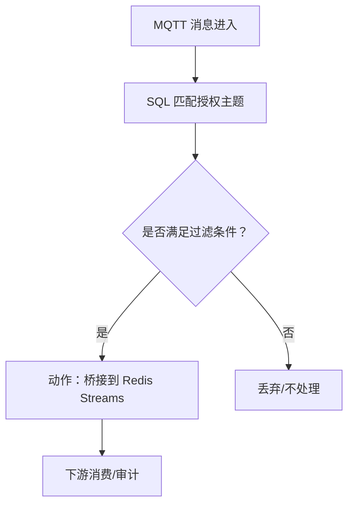
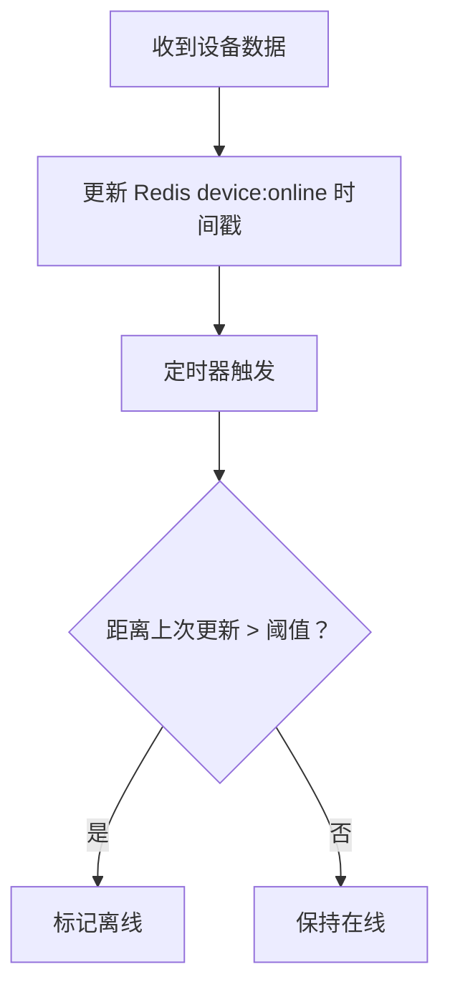
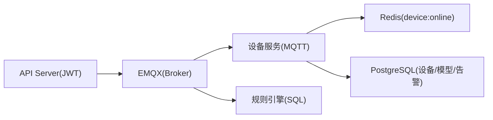

# 设备端安全

<cite>
**本文引用的文件**   
- [README.md](file://README.md)
- [emqx_rule_engine_sql.md](file://docs/emqx_rule_engine_sql.md)
- [mosquitto.conf](file://deploy/mosquitto/mosquitto.conf)
- [jwt.go](file://inv_api_server/pkg/jwt/jwt.go)
- [config.go](file://inv_device_server/internal/config/config.go)
- [client.go](file://inv_device_server/internal/mqtt/client.go)
- [ws_handler.go](file://inv_api_server/internal/handler/ws_handler.go)
- [repositories.go](file://inv_api_server/internal/repository/repositories.go)
- [rbac.go](file://api-gateway/internal/middleware/rbac.go)
- [internal_handler_test.go](file://inv_api_server/internal/handler/internal_handler_test.go)
- [db_maintenance.sh](file://deploy/scripts/db_maintenance.sh)
- [main.go](file://inv_device_server/cmd/main.go)
</cite>

## 目录
1. [引言](#引言)
2. [项目结构](#项目结构)
3. [核心组件](#核心组件)
4. [架构总览](#架构总览)
5. [详细组件分析](#详细组件分析)
6. [依赖关系分析](#依赖关系分析)
7. [性能考量](#性能考量)
8. [故障排除指南](#故障排除指南)
9. [结论](#结论)
10. [附录](#附录)

## 引言
本技术文档聚焦于设备端安全机制，围绕以下目标展开：
- 详解 EMQX 内置 JWT 认证的配置与使用，覆盖密钥统一、过期断连、共享订阅等特性
- 解释 MQTT 连接认证流程（用户名密码验证与 TLS 双向认证）
- 说明设备身份标识与设备白名单机制
- 介绍数据传输安全（消息加密、完整性校验、重放攻击防护）
- 详述 EMQX 规则引擎中的安全策略（ACL 访问控制与消息过滤）
- 说明设备心跳检测与异常连接处理机制
- 提供设备端 SDK 的安全使用指南（密钥管理与安全通信）
- 给出设备安全配置模板与故障排除方法
- 为设备厂商提供安全集成最佳实践与合规建议

## 项目结构
本项目采用多层架构，前端通过 MQTT 直连 EMQX，设备侧服务负责桥接与处理，后端 API 提供鉴权与业务能力。安全关键点集中在：
- API Server 使用 HS256 JWT 对移动端与设备侧进行统一鉴权
- EMQX 内置 JWT 验签，支持过期断连与共享订阅
- 设备心跳与离线判定通过 Redis 维护在线状态
- 规则引擎用于消息过滤与桥接，减少敏感数据泄露面

图示来源
- [README.md:11-29](file://README.md#L11-L29)
- [README.md:155-186](file://README.md#L155-L186)

章节来源
- [README.md:11-29](file://README.md#L11-L29)
- [README.md:155-186](file://README.md#L155-L186)

## 核心组件
- API Server JWT 签发与解析：统一签发 HS256 JWT，携带 jti、过期时间等，供移动端与设备侧直连 EMQX 使用
- EMQX 内置 JWT 验签：配置 Secret 与过期断连，确保令牌失效后自动断连
- 设备服务 MQTT 客户端：连接 EMQX，订阅共享订阅通道，消费设备数据
- 在线状态与心跳：通过 Redis Hash 维护设备在线时间戳，周期性心跳检测
- 规则引擎：对敏感主题进行过滤与桥接，降低风险面

章节来源
- [jwt.go:35-66](file://inv_api_server/pkg/jwt/jwt.go#L35-L66)
- [README.md:155-167](file://README.md#L155-L167)
- [client.go:141-155](file://inv_device_server/internal/mqtt/client.go#L141-L155)
- [ws_handler.go:102-121](file://inv_api_server/internal/handler/ws_handler.go#L102-L121)

## 架构总览
下图展示设备端安全的关键交互路径与安全控制点。

图示来源
- [README.md:11-29](file://README.md#L11-L29)
- [README.md:155-167](file://README.md#L155-L167)
- [client.go:141-155](file://inv_device_server/internal/mqtt/client.go#L141-L155)

## 详细组件分析

### 组件A：EMQX 内置 JWT 认证
- 配置要点
  - 认证方式：JWT
  - 密钥来源：password 字段
  - 加密方式：基于 HMAC（HS256）
  - Secret：统一密钥，与 API Server 保持一致
  - 过期断连：开启后令牌过期自动断连
- 作用
  - 统一移动端与设备侧的身份凭证来源
  - 通过过期断连降低长期有效凭证的风险
  - 与共享订阅配合，实现多实例负载均衡

图示来源
- [README.md:155-167](file://README.md#L155-L167)

章节来源
- [README.md:155-167](file://README.md#L155-L167)

### 组件B：MQTT 连接认证流程（用户名密码与 TLS）
- 用户名密码验证
  - username 与 clientid 可用于标识设备身份
  - password 使用 JWT，EMQX 内置验证
- TLS 双向认证
  - 支持 8883/TLS 端口
  - 可结合客户端证书与 CA 校验，实现双向认证
- 共享订阅
  - 使用 $share/inv-group/ 前缀，多实例自动负载均衡

图示来源
- [README.md:11-29](file://README.md#L11-L29)
- [client.go:141-155](file://inv_device_server/internal/mqtt/client.go#L141-L155)

章节来源
- [README.md:11-29](file://README.md#L11-L29)
- [client.go:141-155](file://inv_device_server/internal/mqtt/client.go#L141-L155)

### 组件C：设备身份标识与白名单机制
- 设备身份
  - 通过 clientid 与主题命名规范标识设备（如 cs_inv/{sn}/...）
  - API 层维护设备 SN 与用户/站点的关联关系
- 白名单
  - 通过规则引擎限制主题通配范围，仅允许授权 SN 主题
  - 通过 ACL 控制订阅/发布权限，避免越权访问

图示来源
- [emqx_rule_engine_sql.md:10-26](file://docs/emqx_rule_engine_sql.md#L10-L26)

章节来源
- [emqx_rule_engine_sql.md:10-26](file://docs/emqx_rule_engine_sql.md#L10-L26)
- [repositories.go:825-848](file://inv_api_server/internal/repository/repositories.go#L825-L848)

### 组件D：数据传输安全（加密、完整性、重放防护）
- 加密
  - 传输加密：TLS 1.2+（端口 8883）
  - 应用层加密：建议对敏感字段进行端到端加密（设备侧与 API Server 协商密钥）
- 完整性
  - 使用 HS256 JWT 保证令牌完整性；建议对消息体增加 MAC（如 HMAC-SHA256）
- 重放防护
  - 利用 jti（JWT ID）去重，服务端记录已消费 jti 集合
  - 时间戳校验，拒绝过期或未来时间戳

章节来源
- [jwt.go:12-18](file://inv_api_server/pkg/jwt/jwt.go#L12-L18)
- [jwt.go:35-66](file://inv_api_server/pkg/jwt/jwt.go#L35-L66)

### 组件E：EMQX 规则引擎中的安全策略
- 消息桥接与过滤
  - 将授权主题消息桥接到 Redis Streams，便于下游消费
  - 对告警阈值等敏感事件进行前置判断与转发
- 主题白名单
  - 通过 SQL 限定来源主题，避免任意设备越权订阅
- 动作参数
  - Redis Streams 的字段映射中可提取 sn，便于后续审计与追踪

图示来源
- [emqx_rule_engine_sql.md:10-26](file://docs/emqx_rule_engine_sql.md#L10-L26)
- [emqx_rule_engine_sql.md:62-75](file://docs/emqx_rule_engine_sql.md#L62-L75)

章节来源
- [emqx_rule_engine_sql.md:10-26](file://docs/emqx_rule_engine_sql.md#L10-L26)
- [emqx_rule_engine_sql.md:62-75](file://docs/emqx_rule_engine_sql.md#L62-L75)

### 组件F：设备心跳检测与异常连接处理
- 心跳机制
  - 设备服务定期更新 Redis 中设备在线时间戳
  - 心跳周期与离线阈值可配置，默认约 2 分钟离线
- 异常处理
  - 超时未更新标记为离线
  - WebSocket 管理端连接具备心跳与并发连接数限制

图示来源
- [client.go:74-99](file://inv_device_server/internal/mqtt/client.go#L74-L99)
- [ws_handler.go:102-121](file://inv_api_server/internal/handler/ws_handler.go#L102-L121)

章节来源
- [client.go:74-99](file://inv_device_server/internal/mqtt/client.go#L74-L99)
- [ws_handler.go:102-121](file://inv_api_server/internal/handler/ws_handler.go#L102-L121)

### 组件G：设备端 SDK 安全使用指南
- 密钥管理
  - Secret 仅在可信边界内存储，避免硬编码
  - 建议使用硬件安全模块（HSM）或安全容器（如 Android Keystore、iOS Keychain）
- 安全通信
  - 优先使用 TLS 1.2+，启用证书固定（Pinning）
  - 对敏感字段进行端到端加密
- 令牌生命周期
  - 定时刷新 JWT，避免过期导致断连
  - 记录 jti，防止重放
- 连接健壮性
  - 启用自动重连与退避策略
  - 订阅共享订阅以提升可用性

章节来源
- [README.md:155-167](file://README.md#L155-L167)
- [client.go:141-155](file://inv_device_server/internal/mqtt/client.go#L141-L155)

## 依赖关系分析
- API Server 与 EMQX 的耦合点在于 JWT Secret 一致性
- 设备服务依赖 Redis 与 PostgreSQL，用于在线状态与持久化
- 规则引擎与 ACL 控制主题通配与动作执行

图示来源
- [README.md:11-29](file://README.md#L11-L29)
- [config.go:50-58](file://inv_device_server/internal/config/config.go#L50-L58)

章节来源
- [README.md:11-29](file://README.md#L11-L29)
- [config.go:50-58](file://inv_device_server/internal/config/config.go#L50-L58)

## 性能考量
- 共享订阅与多实例
  - 使用 $share/inv-group/ 实现多实例负载均衡，避免单点瓶颈
- 心跳与离线判定
  - 合理设置心跳间隔与离线阈值，平衡实时性与资源消耗
- 规则引擎
  - 仅对必要主题进行过滤与桥接，避免过度计算
- 存储清理
  - 定期清理历史数据，维持数据库与 Redis 性能

章节来源
- [README.md:19-20](file://README.md#L19-L20)
- [db_maintenance.sh:23-41](file://deploy/scripts/db_maintenance.sh#L23-L41)

## 故障排除指南
- 连接被拒或频繁断连
  - 检查 JWT 是否过期，确认 Secret 与签发方一致
  - 确认 EMQX JWT 配置（HS256、过期断连）
- 主题无数据
  - 检查规则引擎 SQL 是否正确匹配主题
  - 确认设备上报主题命名与白名单一致
- 在线状态异常
  - 检查设备是否按时上报，Redis 键是否存在
  - 核对心跳间隔与离线阈值
- 并发连接过多
  - 管理端 WebSocket 连接具备限流保护，检查 jti 并发上限

章节来源
- [README.md:155-167](file://README.md#L155-L167)
- [emqx_rule_engine_sql.md:10-26](file://docs/emqx_rule_engine_sql.md#L10-L26)
- [client.go:74-99](file://inv_device_server/internal/mqtt/client.go#L74-L99)
- [ws_handler.go:58-73](file://inv_api_server/internal/handler/ws_handler.go#L58-L73)

## 结论
本方案通过“API Server 统一签发 + EMQX 内置 JWT 验签 + 规则引擎与 ACL 控制”的组合，构建了端到端的设备端安全体系。结合共享订阅、心跳检测与离线处理，既保障了实时性，也提升了系统的鲁棒性。建议在生产环境中进一步强化 TLS 证书管理、端到端加密与密钥轮换策略，并持续完善审计与告警机制。

## 附录

### 设备安全配置模板（EMQX）
- 认证方式：JWT
- JWT 来自：password
- 加密方式：hmac-based（HS256）
- Secret：与 API Server 一致
- 过期后断开连接：启用
- 端口：8883（推荐）

章节来源
- [README.md:155-167](file://README.md#L155-L167)

### 设备端连接参数（示例）
- Broker：EMQX 地址
- Port：8883（TLS）
- Username：设备标识（可选）
- Password：HS256 JWT
- QoS：1
- ClientID：设备 SN 或唯一标识

章节来源
- [config.go:50-58](file://inv_device_server/internal/config/config.go#L50-L58)
- [client.go:141-155](file://inv_device_server/internal/mqtt/client.go#L141-L155)

### 规则引擎安全策略（参考）
- 数据消息桥接至 Redis Streams，字段包含 sn 以便审计
- 告警阈值前置判断，仅转发异常事件
- 严格限制来源主题，避免越权订阅

章节来源
- [emqx_rule_engine_sql.md:10-26](file://docs/emqx_rule_engine_sql.md#L10-L26)
- [emqx_rule_engine_sql.md:62-75](file://docs/emqx_rule_engine_sql.md#L62-L75)

### 设备白名单与权限校验（后端）
- 设备 SN 与用户/站点的关联查询
- 获取允许访问的设备 SN 列表
- 通过 RBAC 中间件控制 API 访问

章节来源
- [repositories.go:825-848](file://inv_api_server/internal/repository/repositories.go#L825-L848)
- [rbac.go:44-61](file://api-gateway/internal/middleware/rbac.go#L44-L61)

### MQTT 代理匿名访问（仅本地测试）
- Mosquitto 默认允许匿名访问，生产环境应关闭
- 建议使用 EMQX 作为生产级 Broker

章节来源
- [mosquitto.conf:1-3](file://deploy/mosquitto/mosquitto.conf#L1-L3)