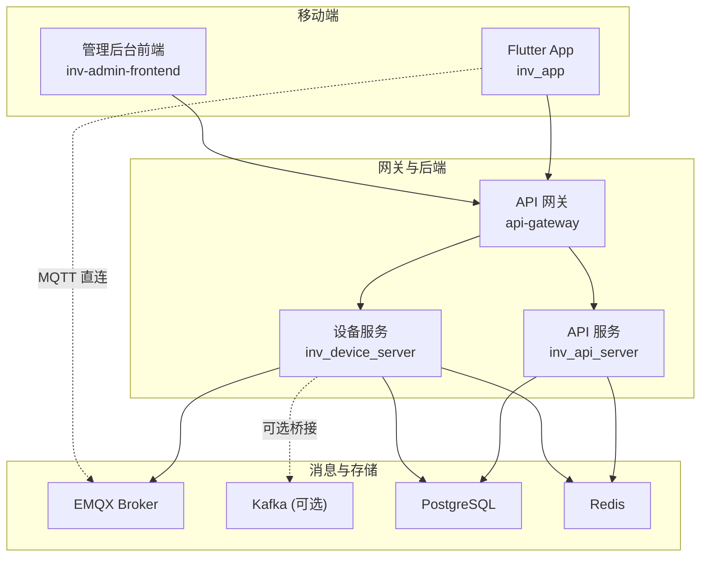
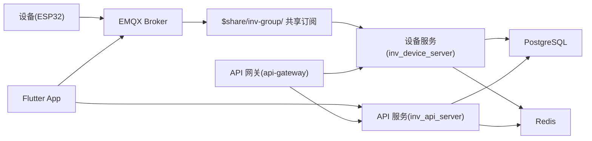
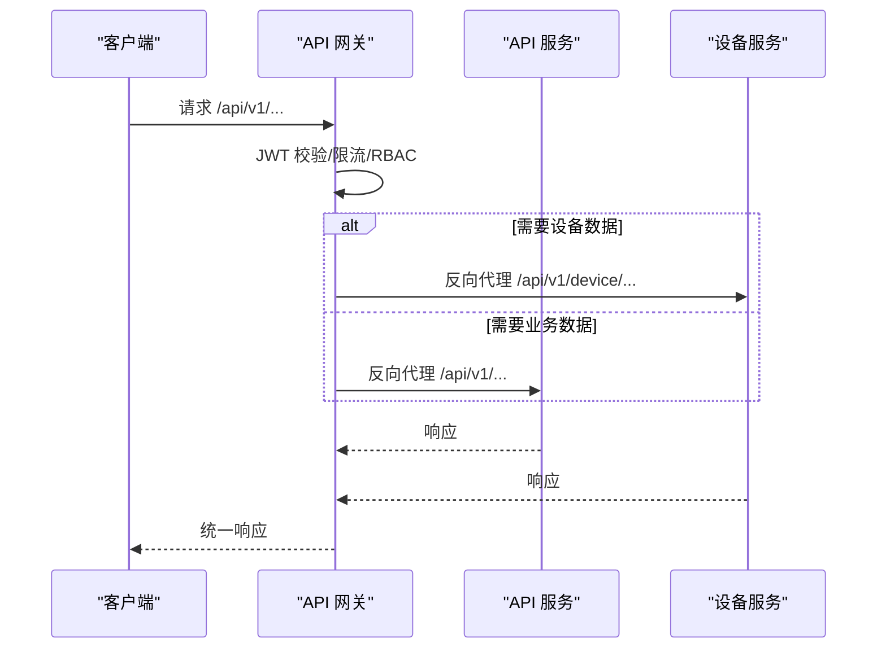
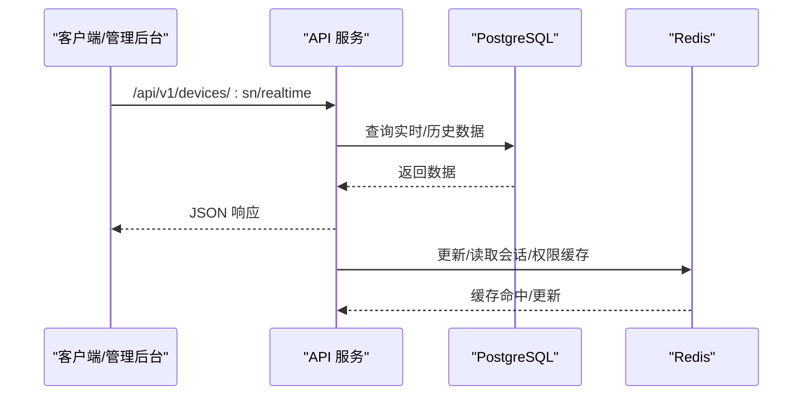
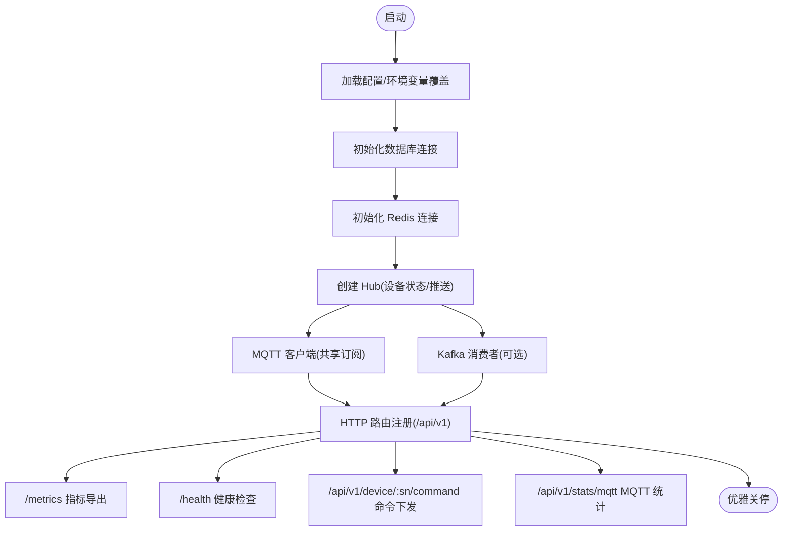
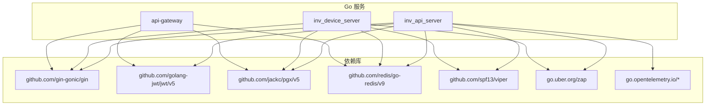
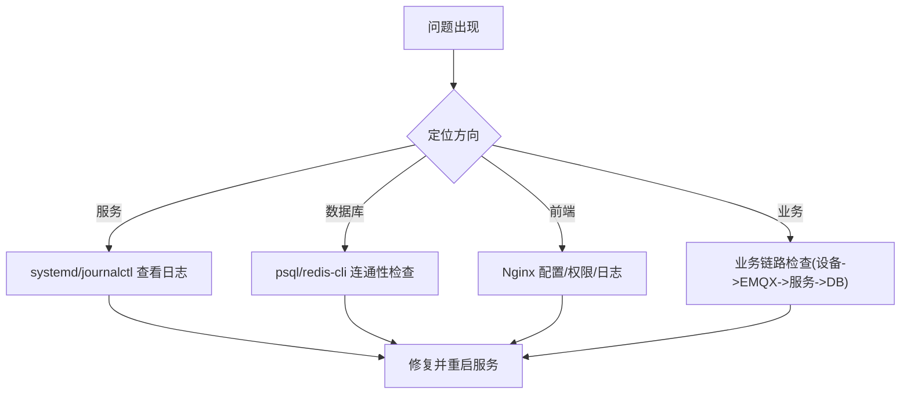

# 开发指南

<cite>
**本文引用的文件**
- [README.md](file://README.md)
- [deploy/README.md](file://deploy/README.md)
- [inv_api_server/cmd/main.go](file://inv_api_server/cmd/main.go)
- [inv_device_server/cmd/main.go](file://inv_device_server/cmd/main.go)
- [api-gateway/main.go](file://api-gateway/main.go)
- [tools/stress_test/main.go](file://tools/stress_test/main.go)
- [deploy/docker-compose.yml](file://deploy/docker-compose.yml)
- [deploy/deploy.sh](file://deploy/deploy.sh)
- [inv_api_server/go.mod](file://inv_api_server/go.mod)
- [api-gateway/go.mod](file://api-gateway/go.mod)
- [inv_device_server/go.mod](file://inv_device_server/go.mod)
- [inv_app/pubspec.yaml](file://inv_app/pubspec.yaml)
- [inv_app/analysis_options.yaml](file://inv_app/analysis_options.yaml)
- [inv-admin-frontend/package.json](file://inv-admin-frontend/package.json)
- [debug-alarm-not-displayed.md](file://debug-alarm-not-displayed.md)
</cite>

## 目录
1. [简介](#简介)
2. [项目结构](#项目结构)
3. [核心组件](#核心组件)
4. [架构总览](#架构总览)
5. [详细组件分析](#详细组件分析)
6. [依赖关系分析](#依赖关系分析)
7. [性能考虑](#性能考虑)
8. [故障排除指南](#故障排除指南)
9. [结论](#结论)
10. [附录](#附录)

## 简介
本指南面向新老开发者，提供从环境搭建、开发流程、代码规范、测试策略、调试与故障排除、压力测试、代码评审到版本管理与发布的全流程技术文档。系统采用“实时走 MQTT、历史走 HTTP”的双通道架构，核心组件包括 Flutter 移动端、Go API 网关与 API 服务、Go 设备通讯服务、EMQX、PostgreSQL、Redis、可选 Kafka 桥接等。

## 项目结构
项目采用多模块分层组织，前后端分离，服务容器化部署，辅以自动化运维脚本与监控告警。

**图表来源**
- [README.md: 35-110:35-110](file://README.md#L35-L110)
- [deploy/docker-compose.yml: 1-274:1-274](file://deploy/docker-compose.yml#L1-L274)

**章节来源**
- [README.md: 35-110:35-110](file://README.md#L35-L110)
- [deploy/docker-compose.yml: 1-274:1-274](file://deploy/docker-compose.yml#L1-L274)

## 核心组件
- Flutter App（inv_app）：跨平台移动客户端，采用 BLoC 状态管理、go_router 路由守卫、Dio HTTP 客户端、MQTT 客户端直连 EMQX。
- API 网关（api-gateway）：统一入口，负责鉴权、限流、RBAC、指标采集与反向代理至 API/设备服务。
- API 服务（inv_api_server）：REST API + 管理后台 + WebSocket 推送，提供用户、设备、告警、OTA 等能力。
- 设备服务（inv_device_server）：MQTT/Redis/Kafka 多通道接入，实时数据解析、兼容映射、状态同步、OTA 命令下发与状态回传。
- 存储与消息：PostgreSQL（关系数据）、Redis（缓存/会话/流）、可选 Kafka（桥接 EMQX 与设备数据）。
- 部署与运维：Docker Compose 一键部署、systemd 服务、Nginx 反代、监控与自动部署脚本。

**章节来源**
- [README.md: 112-133:112-133](file://README.md#L112-L133)
- [inv_api_server/cmd/main.go: 36-86:36-86](file://inv_api_server/cmd/main.go#L36-L86)
- [inv_device_server/cmd/main.go: 34-187:34-187](file://inv_device_server/cmd/main.go#L34-L187)
- [api-gateway/main.go: 21-94:21-94](file://api-gateway/main.go#L21-L94)

## 架构总览
系统遵循“实时走 MQTT、历史走 HTTP”的设计原则，EMQX 提供 JWT 内置认证与共享订阅，设备侧通过 $share/inv-group/ 实现多实例负载均衡；API 服务负责鉴权与业务逻辑，设备服务负责数据解析与桥接。

**图表来源**
- [README.md: 8-31:8-31](file://README.md#L8-L31)
- [README.md: 206-224:206-224](file://README.md#L206-L224)

**章节来源**
- [README.md: 8-31:8-31](file://README.md#L8-L31)
- [README.md: 206-224:206-224](file://README.md#L206-L224)

## 详细组件分析

### API 网关（api-gateway）
- 职责：统一鉴权（JWT）、全局/路由级限流、RBAC 权限控制、Prometheus 指标、反向代理。
- 关键点：支持 Redis 缓存的 RBAC 降级、路由级限流配置、优雅关停。
- 配置与运行：通过 -config 指定 YAML，监听端口由配置决定。

**图表来源**
- [api-gateway/main.go: 62-70:62-70](file://api-gateway/main.go#L62-L70)
- [api-gateway/main.go: 72-91:72-91](file://api-gateway/main.go#L72-L91)

**章节来源**
- [api-gateway/main.go: 21-94:21-94](file://api-gateway/main.go#L21-L94)
- [api-gateway/go.mod: 1-50:1-50](file://api-gateway/go.mod#L1-L50)

### API 服务（inv_api_server）
- 职责：REST API、管理后台、WebSocket 推送、鉴权与权限校验、心跳离线检测、OTA 管理。
- 关键点：Gin 路由分组、CORS/限流/Tracing 中间件、健康检查、内部接口用于设备服务回推数据。
- 运行：支持完整/受限模式（无数据库时降级）。

**图表来源**
- [inv_api_server/cmd/main.go: 344-576:344-576](file://inv_api_server/cmd/main.go#L344-L576)

**章节来源**
- [inv_api_server/cmd/main.go: 36-86:36-86](file://inv_api_server/cmd/main.go#L36-L86)
- [inv_api_server/cmd/main.go: 344-576:344-576](file://inv_api_server/cmd/main.go#L344-L576)
- [inv_api_server/go.mod: 1-79:1-79](file://inv_api_server/go.mod#L1-L79)

### 设备服务（inv_device_server）
- 职责：MQTT 共享订阅、Kafka 消费（可选）、数据解析与兼容映射、Redis 推送、OTA 命令下发与状态回传、Prometheus 指标。
- 关键点：支持 Kafka 模式与 EMQX 桥接模式切换；提供 /metrics 与 /health；设备在线状态同步。

**图表来源**
- [inv_device_server/cmd/main.go: 34-187:34-187](file://inv_device_server/cmd/main.go#L34-L187)
- [inv_device_server/cmd/main.go: 240-346:240-346](file://inv_device_server/cmd/main.go#L240-L346)

**章节来源**
- [inv_device_server/cmd/main.go: 34-187:34-187](file://inv_device_server/cmd/main.go#L34-L187)
- [inv_device_server/cmd/main.go: 240-346:240-346](file://inv_device_server/cmd/main.go#L240-L346)
- [inv_device_server/go.mod: 1-64:1-64](file://inv_device_server/go.mod#L1-L64)

### 移动端与管理后台前端
- Flutter App（inv_app）：BLoC 状态管理、go_router 路由守卫、MQTT 客户端直连、Dio HTTP 客户端、国际化与图表组件。
- 管理后台前端（inv-admin-frontend）：React + Ant Design Pro + React Query + ECharts 等生态。

**章节来源**
- [README.md: 116-132:116-132](file://README.md#L116-L132)
- [inv_app/pubspec.yaml: 1-91:1-91](file://inv_app/pubspec.yaml#L1-L91)
- [inv_app/analysis_options.yaml: 1-29:1-29](file://inv_app/analysis_options.yaml#L1-L29)
- [inv-admin-frontend/package.json: 1-37:1-37](file://inv-admin-frontend/package.json#L1-L37)

## 依赖关系分析
- Go 服务依赖：Gin、JWT、PGX、Redis、Viper、Zap、OpenTelemetry 等。
- 前端依赖：React、Ant Design、React Query、ECharts、Axios 等。
- 容器编排：PostgreSQL、Redis、EMQX、Kafka、Zookeeper、网关与服务镜像。

**图表来源**
- [inv_api_server/go.mod: 5-18:5-18](file://inv_api_server/go.mod#L5-L18)
- [inv_device_server/go.mod: 5-12:5-12](file://inv_device_server/go.mod#L5-L12)
- [api-gateway/go.mod: 5-11:5-11](file://api-gateway/go.mod#L5-L11)

**章节来源**
- [inv_api_server/go.mod: 1-79:1-79](file://inv_api_server/go.mod#L1-L79)
- [inv_device_server/go.mod: 1-64:1-64](file://inv_device_server/go.mod#L1-L64)
- [api-gateway/go.mod: 1-50:1-50](file://api-gateway/go.mod#L1-L50)

## 性能考虑
- 实时链路：设备数据通过 EMQX 共享订阅分发至多实例设备服务，结合 Redis Streams 缓冲与 Pub/Sub 实时推送，降低单点压力。
- 历史查询：历史/统计类请求走 HTTP API，避免长连接占用，提高吞吐。
- 指标与可观测：设备服务导出 Prometheus 指标，API 网关采集指标，便于容量规划与瓶颈定位。
- 压测工具：提供 Go 压测工具，支持并发设备数、持续时间、上报间隔等参数化配置。

**章节来源**
- [README.md: 206-224:206-224](file://README.md#L206-L224)
- [tools/stress_test/main.go: 21-153:21-153](file://tools/stress_test/main.go#L21-L153)

## 故障排除指南
- 服务无法启动：查看 systemd 日志与服务状态，必要时手动运行二进制定位错误。
- 数据库连接失败：检查 PostgreSQL/Redis 连通性与凭据。
- 前端白屏：检查 Nginx 配置与静态资源权限，查看 Nginx 错误日志。
- 告警不显示：参考告警修复案例，确认内部接口写入 alarms 表、Flutter 端订阅 alarmStream、设备端告警主题正确。

**图表来源**
- [deploy/README.md: 236-270:236-270](file://deploy/README.md#L236-L270)

**章节来源**
- [deploy/README.md: 236-270:236-270](file://deploy/README.md#L236-L270)
- [debug-alarm-not-displayed.md: 1-46:1-46](file://debug-alarm-not-displayed.md#L1-L46)

## 结论
本指南提供了从环境搭建到生产运维的完整路径，建议团队在开发中严格遵循统一的鉴权、限流、日志与可观测性标准，并结合压测与故障演练持续优化系统稳定性与性能。

## 附录

### 开发环境搭建与配置
- 环境要求：Flutter 3.x、Go 1.21+、PostgreSQL 15+、Redis 7、EMQX 5.x。
- 快速启动：使用 Docker Compose 一键启动全部服务，或分别启动各模块。
- 前端构建：使用 npm ci 与 vite build，部署至 Nginx。

**章节来源**
- [README.md: 136-194:136-194](file://README.md#L136-L194)
- [deploy/docker-compose.yml: 121-227:121-227](file://deploy/docker-compose.yml#L121-L227)
- [deploy/deploy.sh: 184-220:184-220](file://deploy/deploy.sh#L184-L220)

### 代码规范与最佳实践
- Go 服务：使用 Uber Zap 结构化日志、Gin 中间件统一处理 CORS/限流/追踪；按模块分层（config/handler/middleware/model/repository/service/pkg）。
- Flutter：遵循 Flutter Lints 推荐规则，使用 BLoC 管理复杂状态，组件化与国际化。
- 命名约定：变量与函数采用清晰语义命名，包名小写，文件按职责划分。

**章节来源**
- [inv_api_server/cmd/main.go: 344-576:344-576](file://inv_api_server/cmd/main.go#L344-L576)
- [inv_app/analysis_options.yaml: 8-29:8-29](file://inv_app/analysis_options.yaml#L8-L29)

### 测试策略与质量保证
- 单元测试：Go 服务使用标准 testing 包；前端使用 React Testing Library（参考现有测试文件）。
- 集成测试：通过 Docker Compose 启动全链路，验证设备数据上报、告警流转、OTA 命令下发与状态回传。
- 性能测试：使用 tools/stress_test 模拟大量设备并发上报，评估吞吐与延迟。

**章节来源**
- [tools/stress_test/main.go: 21-153:21-153](file://tools/stress_test/main.go#L21-L153)

### 调试技巧与故障排除
- 日志分析：统一使用结构化日志，结合服务端指标与前端网络面板定位问题。
- 断点调试：Go 使用 Delve，Flutter 使用 VS Code/Android Studio 断点调试。
- 性能分析：利用 OpenTelemetry 指标与火焰图工具进行热点分析。

**章节来源**
- [inv_api_server/cmd/main.go: 221-237:221-237](file://inv_api_server/cmd/main.go#L221-L237)
- [inv_device_server/cmd/main.go: 348-357:348-357](file://inv_device_server/cmd/main.go#L348-L357)

### 压力测试实施
- 负载模拟：通过工具参数控制设备数量、持续时间、上报间隔。
- 性能基准：关注成功率、平均延迟、吞吐量。
- 瓶颈识别：结合 Prometheus 指标与日志，定位数据库、缓存、MQTT/网络等环节。

**章节来源**
- [tools/stress_test/main.go: 21-153:21-153](file://tools/stress_test/main.go#L21-L153)

### 代码评审指南
- 审查清单：鉴权与敏感配置、数据库与缓存访问、错误处理与日志、性能与资源限制、可观测性与指标。
- 常见问题：JWT 密钥硬编码、未设置超时与重试、缺少健康检查、未处理环境变量覆盖。
- 改进建议：引入 CI 自动化测试与安全扫描，完善变更日志与发布说明。

**章节来源**
- [api-gateway/main.go: 30-32:30-32](file://api-gateway/main.go#L30-L32)
- [inv_api_server/cmd/main.go: 45-52:45-52](file://inv_api_server/cmd/main.go#L45-L52)

### 版本管理与发布流程
- 分支策略：主分支保护，功能在分支开发并通过 MR 合并。
- 版本控制：语义化版本，变更记录在 CHANGELOG 中维护。
- 发布计划：使用自动化脚本部署，支持选择性部署与回滚。

**章节来源**
- [deploy/deploy.sh: 1-229:1-229](file://deploy/deploy.sh#L1-L229)
- [deploy/README.md: 1-270:1-270](file://deploy/README.md#L1-L270)

### 开发工具推荐与效率提升
- IDE 插件：Go、Dart、TypeScript/JavaScript、JSON、YAML、Markdown。
- 效率工具：Docker Compose 快速联调、Postman/JMeter 辅助接口测试、VS Code Live Share 协作。
- 自动化：CI/CD 脚本、Git Hooks、PR 模板与检查清单。

**章节来源**
- [README.md: 136-194:136-194](file://README.md#L136-L194)
- [deploy/docker-compose.yml: 1-274:1-274](file://deploy/docker-compose.yml#L1-L274)

### 新人快速上手指南
- 第一步：安装依赖与环境变量，初始化数据库与 TimescaleDB（可选）。
- 第二步：启动 EMQX、PostgreSQL、Redis、Kafka（可选），再启动各服务。
- 第三步：运行 Flutter App 与管理后台前端，验证登录与设备列表。
- 第四步：阅读调试案例与故障排除章节，参与日常巡检与压测演练。

**章节来源**
- [README.md: 144-194:144-194](file://README.md#L144-L194)
- [debug-alarm-not-displayed.md: 1-46:1-46](file://debug-alarm-not-displayed.md#L1-L46)