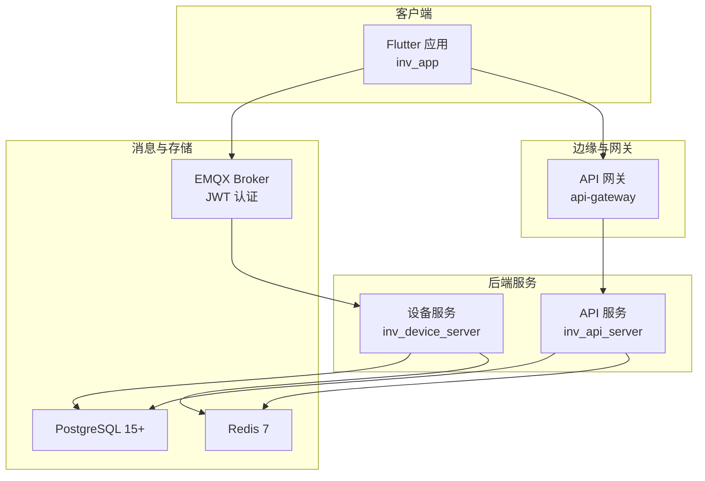
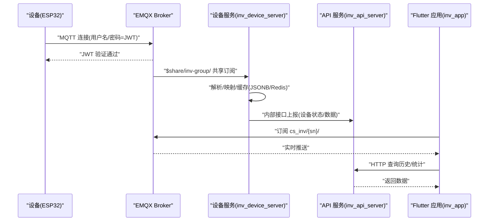
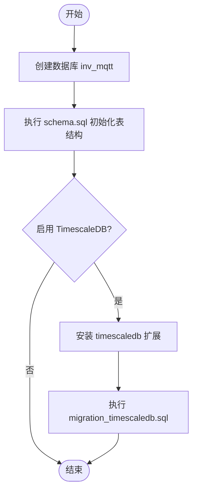
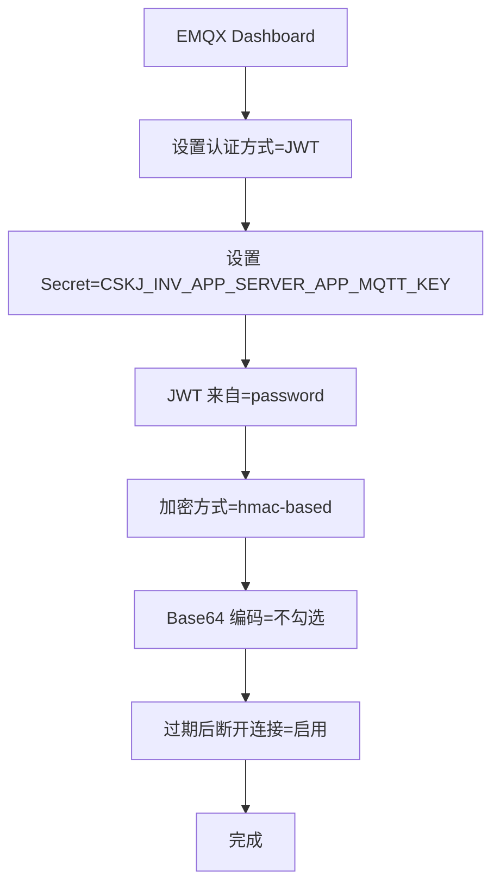
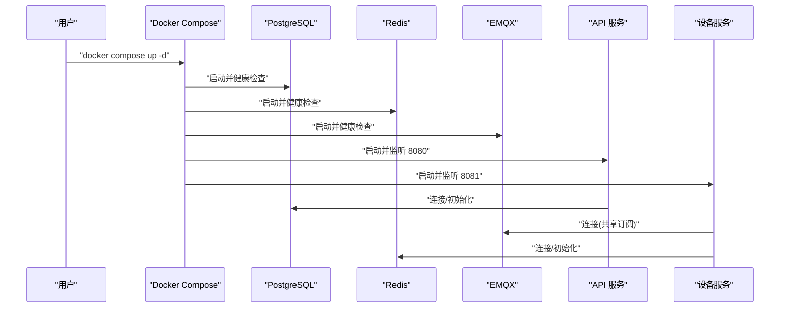
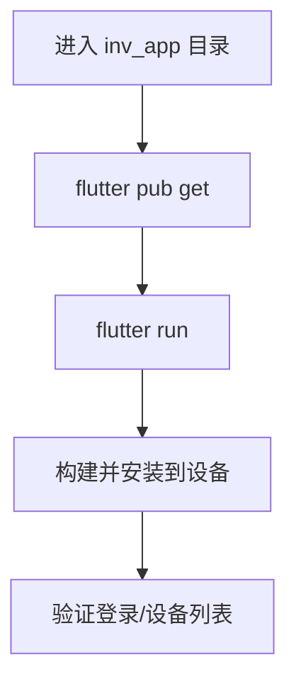
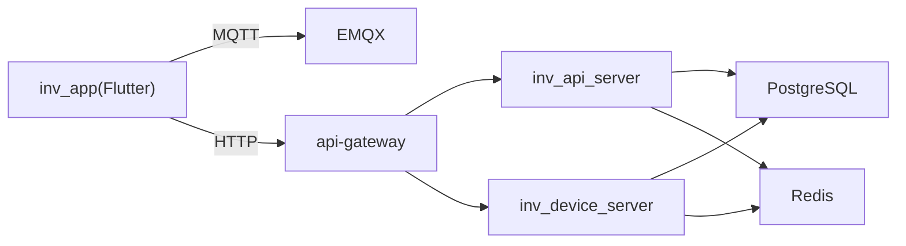
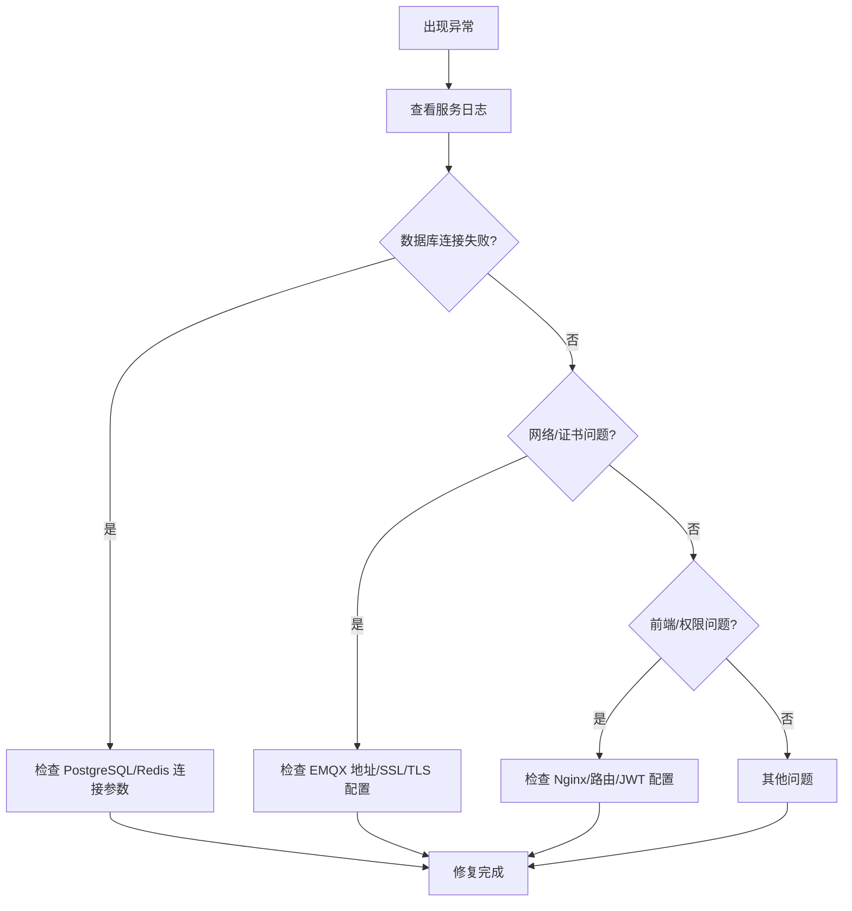
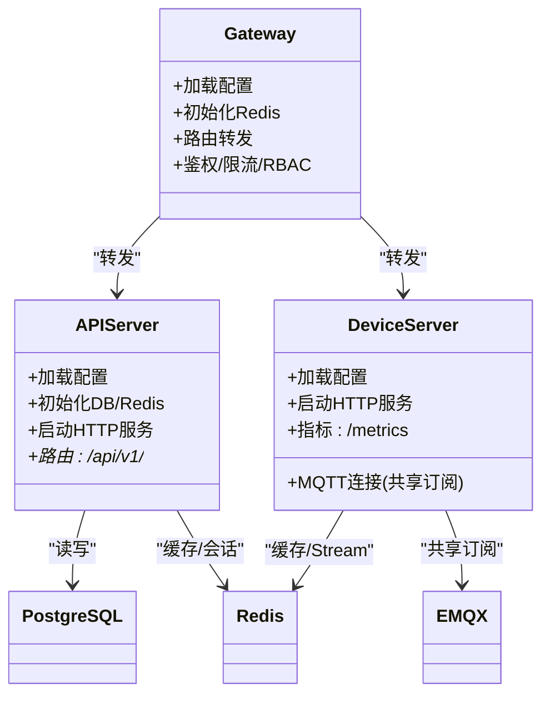

# 快速开始

<cite>
**本文引用的文件**
- [README.md](file://README.md)
- [docker-compose.yml](file://deploy/docker-compose.yml)
- [schema.sql](file://database/schema.sql)
- [migration_timescaledb.sql](file://database/migration_timescaledb.sql)
- [main.go（API服务入口）](file://inv_api_server/cmd/main.go)
- [main.go（设备服务入口）](file://inv_device_server/cmd/main.go)
- [main.go（网关入口）](file://api-gateway/main.go)
- [api-server.yaml（生产配置）](file://deploy/configs/api-server.yaml)
- [config.docker.yaml（API服务容器配置）](file://inv_api_server/config.docker.yaml)
- [config.docker.yaml（设备服务容器配置）](file://inv_device_server/config.docker.yaml)
- [config.docker.yaml（网关容器配置）](file://api-gateway/config.docker.yaml)
- [pubspec.yaml（Flutter依赖）](file://inv_app/pubspec.yaml)
- [MQTT接口文档.md](file://docs/MQTT接口文档.md)
- [部署说明.md](file://deploy/README.md)
</cite>

## 目录
1. [简介](#简介)
2. [项目结构](#项目结构)
3. [核心组件](#核心组件)
4. [架构总览](#架构总览)
5. [详细组件分析](#详细组件分析)
6. [依赖关系分析](#依赖关系分析)
7. [性能考虑](#性能考虑)
8. [故障排除指南](#故障排除指南)
9. [结论](#结论)
10. [附录](#附录)

## 简介
本指南面向首次接触 INV-MQTT 系统的新用户，帮助您在约 30 分钟内完成环境准备、数据库初始化、EMQX JWT 认证配置、后端服务与 Flutter 应用的启动，并完成基本功能验证。系统采用“实时直连 MQTT + 历史查询 HTTP”的混合架构，确保低延迟实时监控与灵活的历史数据分析。

## 项目结构
INV-MQTT 采用多模块分层组织，包含移动端 Flutter 应用、后端 Go 服务、消息桥接与存储层，以及部署编排文件。核心模块如下：
- inv_app：Flutter 移动端应用，跨平台支持 Android/iOS/Web/Desktop
- inv_api_server：Go REST API 服务，提供用户认证、设备管理、OTA 等能力
- inv_device_server：Go 设备通讯服务，负责 MQTT 共享订阅、数据解析与 Redis 缓存
- api-gateway：API 网关，统一鉴权、限流与路由转发
- deploy：Docker Compose 编排与部署脚本
- database：PostgreSQL 初始化脚本与 TimescaleDB 时序优化脚本
- docs：MQTT 协议与系统文档

**图表来源**
- [README.md:35-110](file://README.md#L35-L110)
- [docker-compose.yml:1-274](file://deploy/docker-compose.yml#L1-L274)

**章节来源**
- [README.md:35-110](file://README.md#L35-L110)

## 核心组件
- Flutter 应用（inv_app）：基于 Flutter 3.x，使用 mqtt_client 进行 MQTT 连接，Dio 进行 HTTP 请求，go_router 管理路由与鉴权守卫。
- API 服务（inv_api_server）：基于 Go 1.22，使用 Gin 框架，提供 REST API、WebSocket 推送与管理后台。
- 设备服务（inv_device_server）：基于 Go 1.21，负责 EMQX 共享订阅、设备数据解析、Redis 缓存与 Streams 消费。
- API 网关（api-gateway）：统一鉴权、限流与路由转发，对接 API 与设备服务。
- 存储与消息：PostgreSQL 15+、Redis 7、可选 TimescaleDB 时序优化。

**章节来源**
- [README.md:112-133](file://README.md#L112-L133)
- [pubspec.yaml:8-91](file://inv_app/pubspec.yaml#L8-L91)
- [config.docker.yaml（API服务容器配置）:1-57](file://inv_api_server/config.docker.yaml#L1-L57)
- [config.docker.yaml（设备服务容器配置）:1-54](file://inv_device_server/config.docker.yaml#L1-L54)
- [config.docker.yaml（网关容器配置）:1-39](file://api-gateway/config.docker.yaml#L1-L39)

## 架构总览
系统采用“EMQX 内置 JWT 认证 + 共享订阅 + Redis 缓存”的高可用架构。实时数据通过 MQTT 直连，历史/统计通过 HTTP API 查询；EMQX 与 API 服务共享同一 Secret，实现统一鉴权。

**图表来源**
- [README.md:206-225](file://README.md#L206-L225)
- [MQTT接口文档.md:1-647](file://docs/MQTT接口文档.md#L1-L647)

**章节来源**
- [README.md:206-225](file://README.md#L206-L225)

## 详细组件分析

### 环境要求与版本约束
- Flutter 3.x：移动端 SDK 版本要求
- Go 1.21+：后端服务版本要求（API 服务 1.22，设备服务 1.21）
- PostgreSQL 15+：关系型数据库
- Redis 7：缓存与消息队列
- EMQX 5.x：消息中间件，内置 JWT 认证

**章节来源**
- [README.md:136-142](file://README.md#L136-L142)

### 数据库初始化
- 创建数据库与初始化表结构
- 可选 TimescaleDB 时序优化（需先安装 timescaledb 扩展）

**图表来源**
- [schema.sql:1-463](file://database/schema.sql#L1-L463)
- [migration_timescaledb.sql:1-97](file://database/migration_timescaledb.sql#L1-L97)

**章节来源**
- [README.md:144-153](file://README.md#L144-L153)
- [schema.sql:1-463](file://database/schema.sql#L1-L463)
- [migration_timescaledb.sql:1-97](file://database/migration_timescaledb.sql#L1-L97)

### EMQX JWT 认证配置
- 认证方式：JWT
- Secret：与 API 服务一致（建议使用强随机密钥）
- 密钥来源：password 字段
- Base64 编码：不勾选
- 过期断连：启用

**图表来源**
- [README.md:155-167](file://README.md#L155-L167)

**章节来源**
- [README.md:155-167](file://README.md#L155-L167)

### 后端服务启动方式
- 手动启动：分别启动 API 服务与设备服务，设置 MQTT_PASSWORD 为有效 JWT Token
- Docker Compose 一键启动：使用 deploy/docker-compose.yml 启动全部服务

**图表来源**
- [docker-compose.yml:1-274](file://deploy/docker-compose.yml#L1-L274)

**章节来源**
- [README.md:168-186](file://README.md#L168-L186)
- [docker-compose.yml:1-274](file://deploy/docker-compose.yml#L1-L274)

### Flutter 应用启动流程
- 进入 inv_app 目录，安装依赖并运行
- 首次运行建议使用模拟器或真机调试模式

**图表来源**
- [README.md:187-193](file://README.md#L187-L193)
- [pubspec.yaml:8-91](file://inv_app/pubspec.yaml#L8-L91)

**章节来源**
- [README.md:187-193](file://README.md#L187-L193)
- [pubspec.yaml:8-91](file://inv_app/pubspec.yaml#L8-L91)

### 关键服务端口
- API 服务：8080
- 设备服务：8081
- EMQX MQTT：8883（SSL）
- EMQX Dashboard：18083
- PostgreSQL：5432
- Redis：6379

**章节来源**
- [README.md:195-205](file://README.md#L195-L205)

## 依赖关系分析

**图表来源**
- [README.md:35-110](file://README.md#L35-L110)
- [docker-compose.yml:1-274](file://deploy/docker-compose.yml#L1-L274)

**章节来源**
- [README.md:35-110](file://README.md#L35-L110)
- [docker-compose.yml:1-274](file://deploy/docker-compose.yml#L1-L274)

## 性能考虑
- 共享订阅：$share/inv-group/ 前缀，EMQX 轮询分发消息给多个 inv_device_server 实例，实现水平扩展
- Redis 缓存：设备影子数据、Pub/Sub 实时推送、Streams 缓冲，降低数据库压力
- TimescaleDB：可选时序优化，自动压缩与连续聚合，减少历史查询成本
- Prometheus 指标：设备服务提供 /metrics 端点，便于监控与告警

**章节来源**
- [README.md:246-251](file://README.md#L246-L251)
- [main.go（设备服务入口）:267-278](file://inv_device_server/cmd/main.go#L267-L278)

## 故障排除指南

### 常见问题定位
- 服务无法启动：查看 systemd 日志与服务状态
- 数据库连接失败：检查 PostgreSQL/Redis 连通性与凭据
- 前端白屏：检查 Nginx 配置与静态资源权限
- 设备不在线：确认 EMQX JWT 配置、Broker 地址与证书

**图表来源**
- [部署说明.md:236-270](file://deploy/README.md#L236-L270)

**章节来源**
- [部署说明.md:236-270](file://deploy/README.md#L236-L270)

### 服务端关键入口与职责
- API 服务入口：加载配置、初始化数据库/Redis、启动 Gin 路由与 HTTP 服务
- 设备服务入口：加载配置、建立 MQTT 连接（共享订阅）、启动 HTTP 服务与指标端点
- 网关入口：加载配置、初始化 Redis、构建路由与中间件（鉴权/限流/RBAC）

**图表来源**
- [main.go（API服务入口）:36-86](file://inv_api_server/cmd/main.go#L36-L86)
- [main.go（设备服务入口）:34-87](file://inv_device_server/cmd/main.go#L34-L87)
- [main.go（网关入口）:21-52](file://api-gateway/main.go#L21-L52)

**章节来源**
- [main.go（API服务入口）:36-86](file://inv_api_server/cmd/main.go#L36-L86)
- [main.go（设备服务入口）:34-87](file://inv_device_server/cmd/main.go#L34-L87)
- [main.go（网关入口）:21-52](file://api-gateway/main.go#L21-L52)

## 结论
通过本快速开始指南，您已完成 INV-MQTT 系统的环境准备、数据库初始化、EMQX JWT 配置、后端服务与 Flutter 应用的启动，并理解了系统的核心架构与关键组件。建议在完成基础验证后，进一步探索 MQTT 协议细节、OTA 升级流程与监控告警配置，以满足生产环境需求。

## 附录

### 端到端启动清单（约 30 分钟）
- 环境准备：安装 Flutter 3.x、Go 1.21+、PostgreSQL 15+、Redis 7、EMQX 5.x
- 数据库初始化：创建数据库、执行 schema.sql、可选 TimescaleDB
- EMQX 配置：设置 JWT Secret、认证来源、Base64 选项与过期断连
- 后端启动：手动或 Docker Compose 启动 API/设备服务
- Flutter 启动：安装依赖并运行应用
- 基本验证：登录、查看设备列表、订阅实时数据

**章节来源**
- [README.md:136-193](file://README.md#L136-L193)
- [docker-compose.yml:180-213](file://deploy/docker-compose.yml#L180-L213)