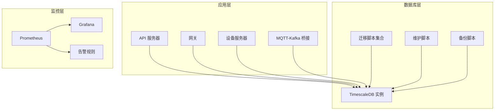
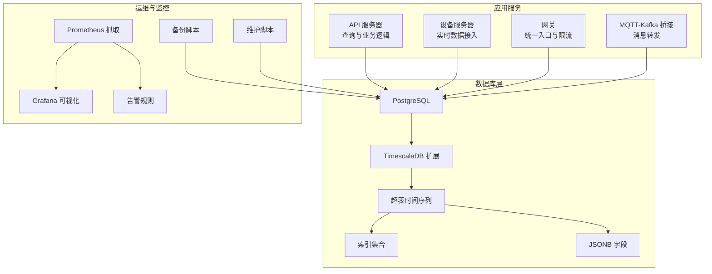
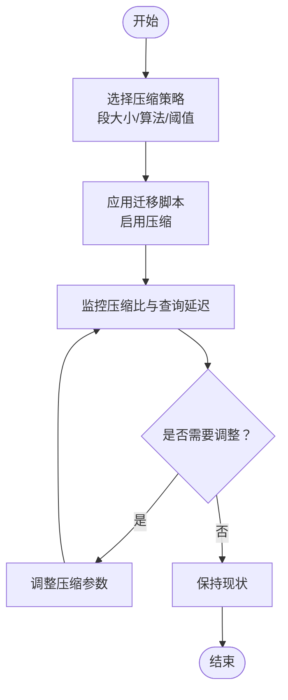
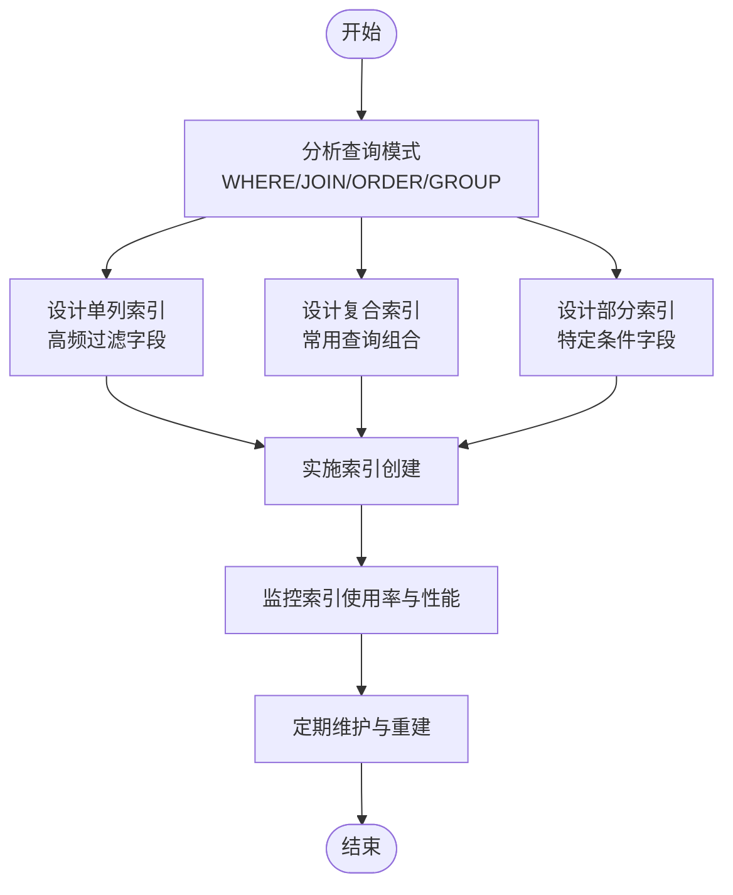
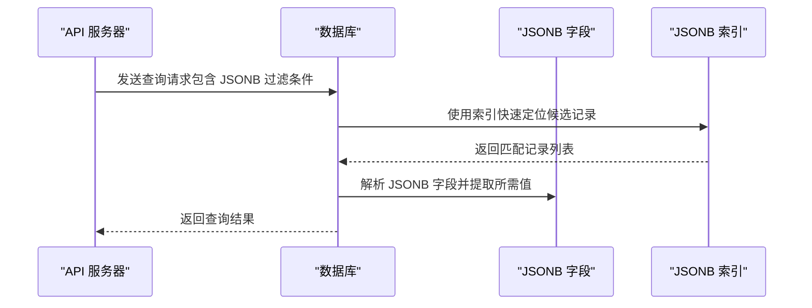
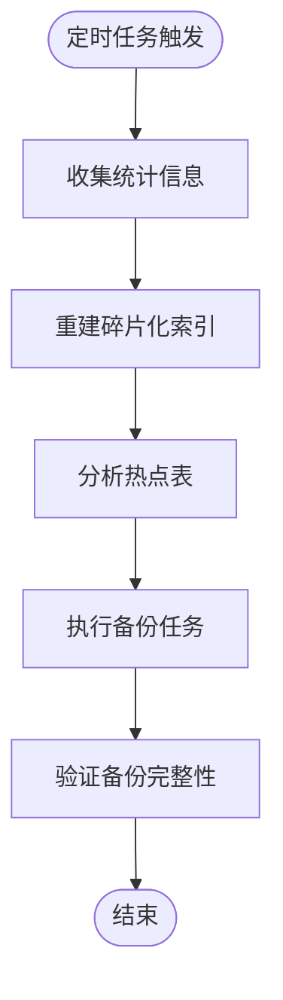
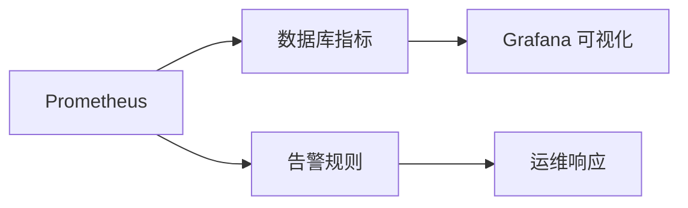
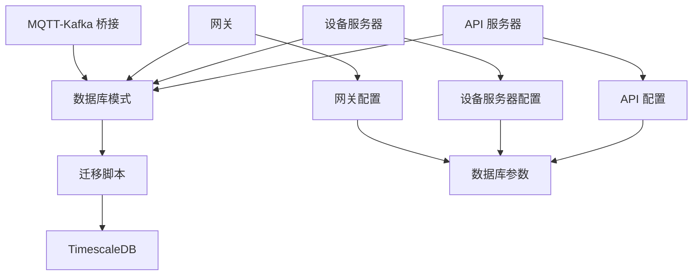

# 性能优化策略

<cite>
**本文档引用的文件**
- [database/schema.sql](file://database/schema.sql)
- [database/migration_timescaledb.sql](file://database/migration_timescaledb.sql)
- [database/migrations/001_init_schema.up.sql](file://database/migrations/001_init_schema.up.sql)
- [database/migrations/002_add_performance_indexes.up.sql](file://database/migrations/002_add_performance_indexes.up.sql)
- [database/migrations/003_timescaledb_compression.up.sql](file://database/migrations/003_timescaledb_compression.up.sql)
- [database/migrations/004_add_energy_columns.up.sql](file://database/migrations/004_add_energy_columns.up.sql)
- [database/migrations/005_device_day_data_jsonb.up.sql](file://database/migrations/005_device_day_data_jsonb.up.sql)
- [deploy/scripts/db_maintenance.sh](file://deploy/scripts/db_maintenance.sh)
- [deploy/scripts/backup.sh](file://deploy/scripts/backup.sh)
- [deploy/grafana-dashboard.json](file://deploy/grafana-dashboard.json)
- [deploy/prometheus.yml](file://deploy/prometheus.yml)
- [deploy/prometheus_alerts.yml](file://deploy/prometheus_alerts.yml)
- [inv_api_server/internal/config/config.go](file://inv_api_server/internal/config/config.go)
- [inv_device_server/internal/config/config.go](file://inv_device_server/internal/config/config.go)
- [api-gateway/internal/config/config.go](file://api-gateway/internal/config/config.go)
</cite>

## 目录
1. [简介](#简介)
2. [项目结构](#项目结构)
3. [核心组件](#核心组件)
4. [架构概览](#架构概览)
5. [详细组件分析](#详细组件分析)
6. [依赖关系分析](#依赖关系分析)
7. [性能考虑](#性能考虑)
8. [故障排除指南](#故障排除指南)
9. [结论](#结论)
10. [附录](#附录)

## 简介
本文件面向数据库性能优化策略，结合代码库中的数据库迁移脚本、维护脚本和监控配置，系统性地阐述索引设计原则、查询优化技术、参数调优、分区与分片策略、慢查询监控、自动化维护任务以及性能监控指标。文档旨在帮助开发者在大规模设备数据场景下构建高性能、可扩展的数据库解决方案。

## 项目结构
该项目采用多服务架构，数据库层通过一系列迁移脚本进行演进，并配套了备份与维护脚本、监控仪表盘与告警配置。数据库相关的核心文件分布如下：

- 数据库模式与迁移：位于 database 目录，包含初始化模式、性能索引、TimescaleDB 压缩、JSONB 字段等迁移脚本
- 维护与备份：位于 deploy/scripts 目录，提供数据库维护与备份自动化脚本
- 监控与告警：位于 deploy 目录，包含 Grafana 仪表盘、Prometheus 配置与告警规则
- 应用配置：各服务内部的配置文件中包含数据库连接参数与性能相关设置

**图表来源**
- [database/migration_timescaledb.sql](file://database/migration_timescaledb.sql)
- [deploy/scripts/db_maintenance.sh](file://deploy/scripts/db_maintenance.sh)
- [deploy/grafana-dashboard.json](file://deploy/grafana-dashboard.json)

**章节来源**
- [database/schema.sql](file://database/schema.sql)
- [database/migrations/001_init_schema.up.sql](file://database/migrations/001_init_schema.up.sql)
- [deploy/scripts/db_maintenance.sh](file://deploy/scripts/db_maintenance.sh)

## 核心组件
本节从数据库层面梳理与性能优化直接相关的组件与实现要点：

- TimescaleDB 扩展与压缩：通过专门的迁移脚本启用 TimescaleDB 功能并配置压缩策略，以降低存储成本并提升时间序列查询性能
- 性能索引：在关键查询路径上建立单列与复合索引，覆盖高频过滤、排序与连接字段
- JSONB 字段：对设备日统计数据使用 JSONB 存储，支持灵活的数据模型与高效查询
- 维护与备份：自动化脚本定期执行统计信息更新、索引重建与表分析，确保查询优化器具备准确的成本估算
- 监控与告警：通过 Prometheus 抓取数据库指标，Grafana 可视化展示，结合告警规则及时发现性能问题

**章节来源**
- [database/migrations/003_timescaledb_compression.up.sql](file://database/migrations/003_timescaledb_compression.up.sql)
- [database/migrations/002_add_performance_indexes.up.sql](file://database/migrations/002_add_performance_indexes.up.sql)
- [database/migrations/005_device_day_data_jsonb.up.sql](file://database/migrations/005_device_day_data_jsonb.up.sql)
- [deploy/scripts/db_maintenance.sh](file://deploy/scripts/db_maintenance.sh)

## 架构概览
下图展示了数据库层与各应用服务之间的交互关系，以及监控体系如何贯穿整个链路：

**图表来源**
- [database/migration_timescaledb.sql](file://database/migration_timescaledb.sql)
- [database/migrations/002_add_performance_indexes.up.sql](file://database/migrations/002_add_performance_indexes.up.sql)
- [database/migrations/005_device_day_data_jsonb.up.sql](file://database/migrations/005_device_day_data_jsonb.up.sql)
- [deploy/scripts/backup.sh](file://deploy/scripts/backup.sh)
- [deploy/scripts/db_maintenance.sh](file://deploy/scripts/db_maintenance.sh)
- [deploy/grafana-dashboard.json](file://deploy/grafana-dashboard.json)

## 详细组件分析

### TimescaleDB 压缩策略
- 目标：利用时间序列特性，自动压缩历史数据，减少存储空间并提升查询性能
- 关键点：选择合适的压缩段大小、压缩算法与触发阈值；定期检查压缩比与查询延迟
- 影响范围：所有基于时间维度的设备数据表（超表）

**图表来源**
- [database/migrations/003_timescaledb_compression.up.sql](file://database/migrations/003_timescaledb_compression.up.sql)

**章节来源**
- [database/migration_timescaledb.sql](file://database/migration_timescaledb.sql)
- [database/migrations/003_timescaledb_compression.up.sql](file://database/migrations/003_timescaledb_compression.up.sql)

### 索引设计与选择策略
- 单列索引：为高频过滤字段（如设备 ID、状态、时间戳）建立索引，加速 WHERE 条件匹配
- 复合索引：为常见查询组合（如设备 ID + 时间范围、状态 + 创建时间）建立联合索引，避免多次回表
- 部分索引：对高基数且有明确过滤条件的字段使用条件索引，减少索引体积与维护开销
- 维护策略：定期重建失效索引，清理孤立索引，确保查询优化器选择最优执行计划

**图表来源**
- [database/migrations/002_add_performance_indexes.up.sql](file://database/migrations/002_add_performance_indexes.up.sql)

**章节来源**
- [database/migrations/002_add_performance_indexes.up.sql](file://database/migrations/002_add_performance_indexes.up.sql)

### JSONB 字段与查询优化
- 目标：对设备日统计数据使用 JSONB 存储，支持灵活的数据结构与高效的键值查询
- 查询优化：利用 JSONB 索引与 GIN 索引，结合 @>、?、#> 等操作符，减少全表扫描
- 注意事项：避免在 JSONB 上进行频繁的字符串拼接与大对象更新，必要时拆分为关系型字段

**图表来源**
- [database/migrations/005_device_day_data_jsonb.up.sql](file://database/migrations/005_device_day_data_jsonb.up.sql)

**章节来源**
- [database/migrations/005_device_day_data_jsonb.up.sql](file://database/migrations/005_device_day_data_jsonb.up.sql)

### 自动化维护任务
- 统计信息更新：定期收集表与索引统计信息，确保查询优化器具备准确的成本估算
- 索引重建：对碎片化严重的索引进行重建，降低查询扫描成本
- 表分析：对热点表进行深度分析，识别潜在的性能瓶颈
- 备份策略：制定增量与全量备份计划，确保数据安全与快速恢复

**图表来源**
- [deploy/scripts/db_maintenance.sh](file://deploy/scripts/db_maintenance.sh)
- [deploy/scripts/backup.sh](file://deploy/scripts/backup.sh)

**章节来源**
- [deploy/scripts/db_maintenance.sh](file://deploy/scripts/db_maintenance.sh)
- [deploy/scripts/backup.sh](file://deploy/scripts/backup.sh)

### 监控与告警体系
- 指标采集：通过 Prometheus 抓取数据库关键指标（连接数、查询延迟、缓存命中率、压缩比等）
- 可视化：使用 Grafana 展示趋势与异常，便于快速定位问题
- 告警规则：设定阈值告警（如慢查询数量激增、连接池耗尽、磁盘空间不足），及时通知运维

**图表来源**
- [deploy/prometheus.yml](file://deploy/prometheus.yml)
- [deploy/grafana-dashboard.json](file://deploy/grafana-dashboard.json)
- [deploy/prometheus_alerts.yml](file://deploy/prometheus_alerts.yml)

**章节来源**
- [deploy/prometheus.yml](file://deploy/prometheus.yml)
- [deploy/grafana-dashboard.json](file://deploy/grafana-dashboard.json)
- [deploy/prometheus_alerts.yml](file://deploy/prometheus_alerts.yml)

## 依赖关系分析
- 应用服务依赖数据库层提供的超表与索引结构，确保查询路径高效
- 维护脚本依赖数据库连接参数与权限配置，保证自动化任务稳定运行
- 监控系统依赖数据库导出指标，形成闭环的性能治理流程

**图表来源**
- [database/schema.sql](file://database/schema.sql)
- [inv_api_server/internal/config/config.go](file://inv_api_server/internal/config/config.go)
- [inv_device_server/internal/config/config.go](file://inv_device_server/internal/config/config.go)
- [api-gateway/internal/config/config.go](file://api-gateway/internal/config/config.go)

**章节来源**
- [inv_api_server/internal/config/config.go](file://inv_api_server/internal/config/config.go)
- [inv_device_server/internal/config/config.go](file://inv_device_server/internal/config/config.go)
- [api-gateway/internal/config/config.go](file://api-gateway/internal/config/config.go)

## 性能考虑
- 内存配置：合理设置 shared_buffers、work_mem、effective_cache_size 等参数，平衡并发与缓存效率
- 连接池设置：根据应用并发需求配置最大连接数与空闲连接回收策略，避免连接争用
- 缓存策略：利用查询缓存与结果集缓存，减少重复计算；对热数据建立物化视图或分区裁剪
- 分区与分片：基于时间维度进行水平分割，结合设备 ID 进行分片，确保查询局部性与负载均衡
- 慢查询监控：开启慢查询日志与 pg_stat_statements，定期分析执行计划与热点 SQL

## 故障排除指南
- 索引未被使用：检查查询谓词是否与索引定义匹配，确认统计信息是否最新
- 查询性能下降：对比执行计划变化，排查新增索引或统计信息缺失的影响
- 维护任务失败：核对数据库连接参数与权限，检查脚本执行环境变量
- 监控告警：根据指标阈值定位异常，优先处理连接池耗尽与磁盘空间不足问题

**章节来源**
- [deploy/scripts/db_maintenance.sh](file://deploy/scripts/db_maintenance.sh)
- [deploy/prometheus_alerts.yml](file://deploy/prometheus_alerts.yml)

## 结论
通过合理的索引设计、TimescaleDB 压缩策略、JSONB 查询优化、自动化维护与完善的监控告警体系，可以在大规模设备数据场景下显著提升数据库性能与稳定性。建议持续关注查询模式变化，动态调整索引与分区策略，并结合监控指标进行基准测试与回归验证。

## 附录
- 基准测试方法：使用压力测试工具模拟高并发场景，记录吞吐量、延迟与资源占用，对比不同索引与分区方案的效果
- 参数调优清单：共享缓冲区、工作内存、有效缓存大小、连接池上限、压缩参数等，按硬件配置与业务特征逐步调优