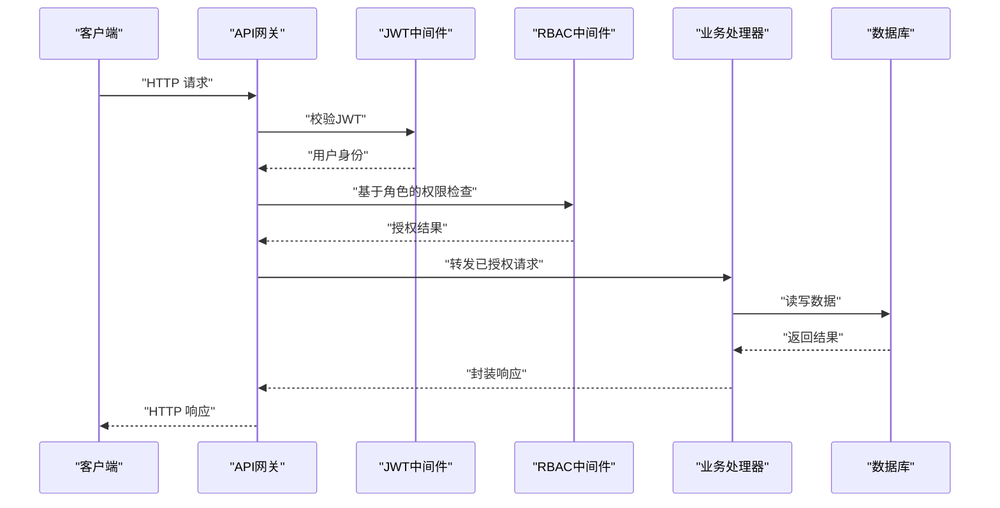
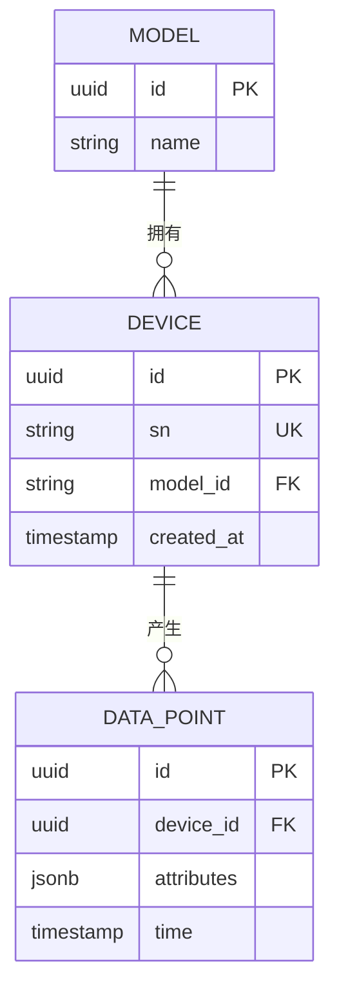
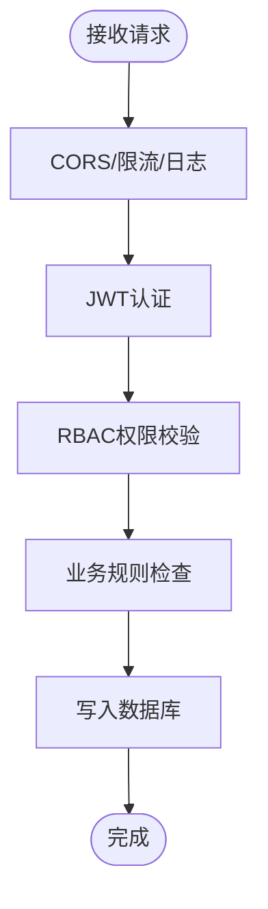
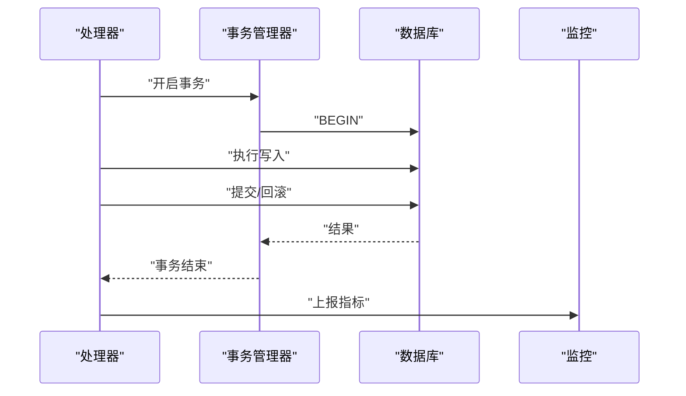
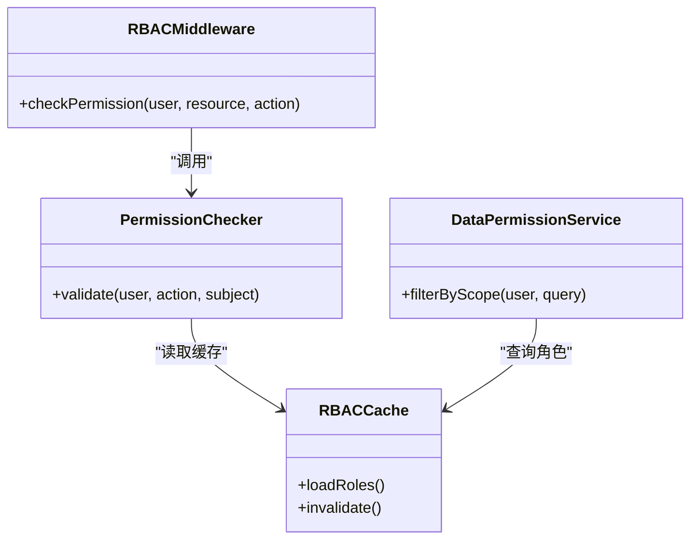
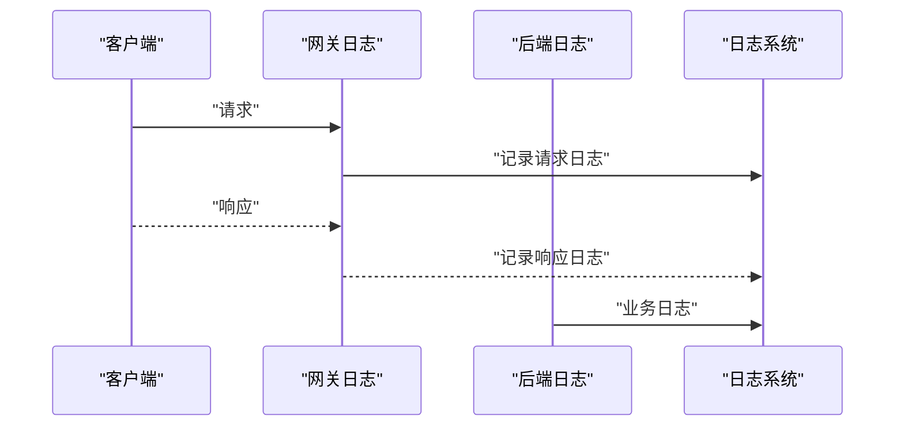
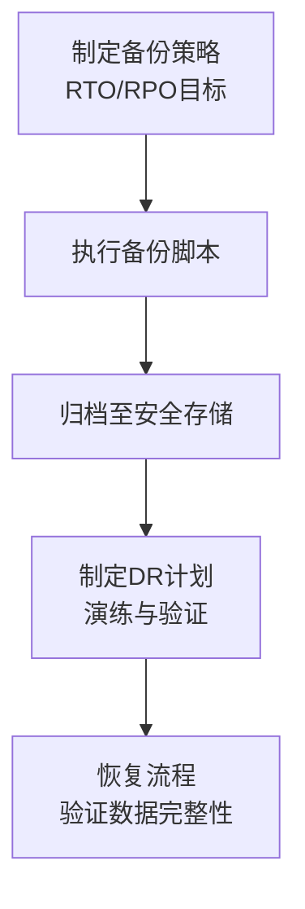
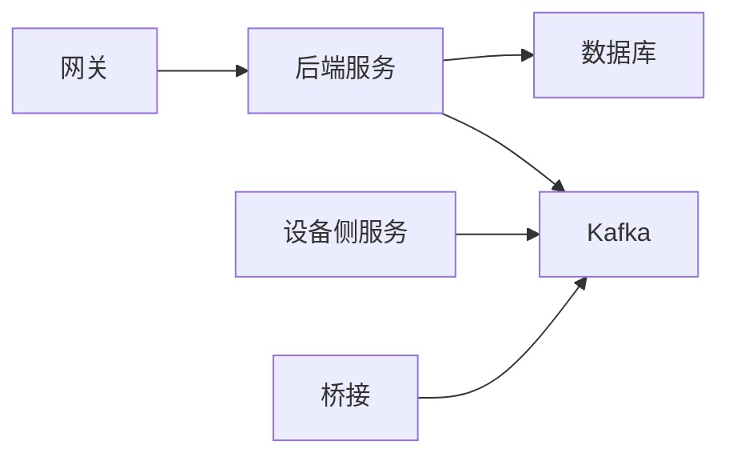

# 数据完整性与安全

<cite>
**本文引用的文件**
- [main.go](file://api-gateway/main.go)
- [routes.go](file://api-gateway/internal/routes/routes.go)
- [jwt.go](file://api-gateway/internal/middleware/jwt.go)
- [rbac.go](file://api-gateway/internal/middleware/rbac.go)
- [cors.go](file://api-gateway/internal/middleware/cors.go)
- [logger.go](file://api-gateway/internal/middleware/logger.go)
- [prometheus.go](file://api-gateway/internal/middleware/prometheus.go)
- [ratelimit.go](file://api-gateway/internal/middleware/ratelimit.go)
- [config.go](file://api-gateway/internal/config/config.go)
- [main.go](file://inv_api_server/cmd/main.go)
- [auth.go](file://inv_api_server/internal/middleware/auth.go)
- [permission.go](file://inv_api_server/internal/middleware/permission.go)
- [admin_handler.go](file://inv_api_server/internal/handler/admin_handler.go)
- [device_handler.go](file://inv_api_server/internal/handler/device_handler.go)
- [model_handler.go](file://inv_api_server/internal/handler/model_handler.go)
- [data_permission.go](file://inv_api_server/internal/service/data_permission.go)
- [perm_checker.go](file://inv_api_server/internal/service/perm_checker.go)
- [rbac_cache.go](file://inv_api_server/internal/service/rbac_cache.go)
- [config.go](file://inv_api_server/internal/config/config.go)
- [schema.sql](file://database/schema.sql)
- [001_init_schema.up.sql](file://database/migrations/001_init_schema.up.sql)
- [002_add_performance_indexes.up.sql](file://database/migrations/002_add_performance_indexes.up.sql)
- [003_timescaledb_compression.up.sql](file://database/migrations/003_timescaledb_compression.up.sql)
- [004_add_energy_columns.up.sql](file://database/migrations/004_add_energy_columns.up.sql)
- [005_device_day_data_jsonb.up.sql](file://database/migrations/005_device_day_data_jsonb.up.sql)
- [migration_timescaledb.sql](file://database/migration_timescaledb.sql)
- [backup.sh](file://deploy/scripts/backup.sh)
- [db_maintenance.sh](file://deploy/scripts/db_maintenance.sh)
- [deploy.sh](file://deploy/deploy.sh)
- [docker-compose.yml](file://deploy/docker-compose.yml)
- [docker-compose.full.yml](file://deploy/docker-compose.full.yml)
- [docker-compose.kafka-bridge.yml](file://deploy/docker-compose.kafka-bridge.yml)
- [kafka-init-topics.sh](file://deploy/kafka-init-topics.sh)
- [create_admin.sql](file://deploy/create_admin.sql)
- [create_device_models.sql](file://deploy/create_device_models.sql)
- [create_model_tables.sql](file://deploy/create_model_tables.sql)
- [inv-monitor.service](file://deploy/inv-monitor.service)
- [inv-git-poll.service](file://deploy/inv-git-poll.service)
- [inv-webhook.service](file://deploy/inv-webhook.service)
- [jwt.go](file://inv_api_server/pkg/jwt/jwt.go)
- [logger.go](file://inv_api_server/pkg/logger/logger.go)
- [response.go](file://inv_api_server/pkg/response/response.go)
- [sn.go](file://inv_api_server/pkg/sn/sn.go)
- [telemetry.go](file://inv_api_server/pkg/telemetry/telemetry.go)
- [timezone.go](file://inv_api_server/pkg/timezone/timezone.go)
- [main.go](file://inv_device_server/cmd/main.go)
- [client.go](file://inv_device_server/internal/mqtt/client.go)
- [stream_consumer.go](file://inv_device_server/internal/mqtt/stream_consumer.go)
- [device_repository.go](file://inv_device_server/internal/repository/device_repository.go)
- [metadata_repository.go](file://inv_device_server/internal/repository/metadata_repository.go)
- [data_service.go](file://inv_device_server/internal/service/data_service.go)
- [protocol_adapter.go](file://inv_device_server/internal/service/protocol_adapter.go)
- [protocol_parser.go](file://inv_device_server/internal/service/protocol_parser.go)
- [parse_rule.go](file://inv_device_server/internal/service/parse_rule.go)
- [kafka.go](file://inv_device_server/pkg/kafka/kafka.go)
- [logger.go](file://inv_device_server/pkg/logger/logger.go)
- [sn.go](file://inv_device_server/pkg/sn/sn.go)
- [timezone.go](file://inv_device_server/pkg/timezone/timezone.go)
- [main.go](file://mqtt-kafka-bridge/main.go)
- [kafka.go](file://mqtt-kafka-bridge/pkg/kafka/kafka.go)
- [logger.go](file://mqtt-kafka-bridge/pkg/logger/logger.go)
</cite>

## 目录
1. [引言](#引言)
2. [项目结构](#项目结构)
3. [核心组件](#核心组件)
4. [架构总览](#架构总览)
5. [详细组件分析](#详细组件分析)
6. [依赖关系分析](#依赖关系分析)
7. [性能考虑](#性能考虑)
8. [故障排查指南](#故障排查指南)
9. [结论](#结论)
10. [附录](#附录)

## 引言
本文件面向“数据完整性与安全”主题，系统梳理该代码库在数据库约束设计、数据验证策略、事务与并发控制、数据加密、访问控制、审计日志以及备份恢复与灾难恢复方面的现状与可落地实践建议。文档基于仓库中实际存在的配置、迁移脚本、服务端中间件与处理器、设备侧数据采集与桥接模块进行分析，并结合部署脚本与容器编排文件给出可执行的安全加固方案。

## 项目结构
该项目采用多模块分层架构：网关层（API Gateway）、后端服务（inv_api_server）、设备侧服务（inv_device_server）、MQTT-Kafka 桥接（mqtt-kafka-bridge），以及数据库与部署脚本。各模块职责清晰，便于在不同层次实施数据完整性与安全策略。

```mermaid
graph TB
subgraph "网关层"
GW_MAIN["api-gateway/main.go"]
GW_RT["api-gateway/internal/routes/routes.go"]
GW_MW_JWT["api-gateway/internal/middleware/jwt.go"]
GW_MW_RBAC["api-gateway/internal/middleware/rbac.go"]
GW_MW_CORS["api-gateway/internal/middleware/cors.go"]
GW_MW_LOG["api-gateway/internal/middleware/logger.go"]
GW_CFG["api-gateway/internal/config/config.go"]
end
subgraph "后端服务"
API_MAIN["inv_api_server/cmd/main.go"]
API_AUTH["inv_api_server/internal/middleware/auth.go"]
API_PERM["inv_api_server/internal/middleware/permission.go"]
API_H_ADMIN["inv_api_server/internal/handler/admin_handler.go"]
API_H_DEVICE["inv_api_server/internal/handler/device_handler.go"]
API_H_MODEL["inv_api_server/internal/handler/model_handler.go"]
API_S_DP["inv_api_server/internal/service/data_permission.go"]
API_S_PC["inv_api_server/internal/service/perm_checker.go"]
API_S_RC["inv_api_server/internal/service/rbac_cache.go"]
API_PKG_JWT["inv_api_server/pkg/jwt/jwt.go"]
API_PKG_LOG["inv_api_server/pkg/logger/logger.go"]
API_PKG_RESP["inv_api_server/pkg/response/response.go"]
end
subgraph "设备侧服务"
DEV_MAIN["inv_device_server/cmd/main.go"]
DEV_MQTT_CLI["inv_device_server/internal/mqtt/client.go"]
DEV_MQTT_CONS["inv_device_server/internal/mqtt/stream_consumer.go"]
DEV_REPO_DEV["inv_device_server/internal/repository/device_repository.go"]
DEV_REPO_META["inv_device_server/internal/repository/metadata_repository.go"]
DEV_S_DATA["inv_device_server/internal/service/data_service.go"]
DEV_S_PROTO["inv_device_server/internal/service/protocol_adapter.go"]
DEV_S_PARSE["inv_device_server/internal/service/protocol_parser.go"]
DEV_KAFKA["inv_device_server/pkg/kafka/kafka.go"]
end
subgraph "桥接层"
BRIDGE_MAIN["mqtt-kafka-bridge/main.go"]
BRIDGE_KAFKA["mqtt-kafka-bridge/pkg/kafka/kafka.go"]
end
subgraph "数据库与部署"
DB_SCHEMA["database/schema.sql"]
DB_MIG_001["database/migrations/001_init_schema.up.sql"]
DB_MIG_002["database/migrations/002_add_performance_indexes.up.sql"]
DB_MIG_003["database/migrations/003_timescaledb_compression.up.sql"]
DB_MIG_004["database/migrations/004_add_energy_columns.up.sql"]
DB_MIG_005["database/migrations/005_device_day_data_jsonb.up.sql"]
DEP_BACKUP["deploy/scripts/backup.sh"]
DEP_MAINT["deploy/scripts/db_maintenance.sh"]
DEP_COMPOSE["deploy/docker-compose.yml"]
DEP_COMPOSE_FULL["deploy/docker-compose.full.yml"]
end
GW_MAIN --> GW_RT --> API_MAIN
GW_MW_JWT --> API_AUTH --> API_PERM
API_H_ADMIN --> API_S_DP
API_H_DEVICE --> DEV_MQTT_CONS
DEV_MQTT_CONS --> DEV_S_DATA --> DEV_KAFKA
BRIDGE_MAIN --> BRIDGE_KAFKA
API_MAIN --> DB_SCHEMA
API_MAIN --> DB_MIG_001
API_MAIN --> DB_MIG_002
API_MAIN --> DB_MIG_003
API_MAIN --> DB_MIG_004
API_MAIN --> DB_MIG_005
```

**图表来源**
- [main.go:1-200](file://api-gateway/main.go#L1-L200)
- [routes.go:1-200](file://api-gateway/internal/routes/routes.go#L1-L200)
- [jwt.go:1-200](file://api-gateway/internal/middleware/jwt.go#L1-L200)
- [rbac.go:1-200](file://api-gateway/internal/middleware/rbac.go#L1-L200)
- [cors.go:1-200](file://api-gateway/internal/middleware/cors.go#L1-L200)
- [logger.go:1-200](file://api-gateway/internal/middleware/logger.go#L1-L200)
- [config.go:1-200](file://api-gateway/internal/config/config.go#L1-L200)
- [main.go:1-200](file://inv_api_server/cmd/main.go#L1-L200)
- [auth.go:1-200](file://inv_api_server/internal/middleware/auth.go#L1-L200)
- [permission.go:1-200](file://inv_api_server/internal/middleware/permission.go#L1-L200)
- [admin_handler.go:1-200](file://inv_api_server/internal/handler/admin_handler.go#L1-L200)
- [device_handler.go:1-200](file://inv_api_server/internal/handler/device_handler.go#L1-L200)
- [model_handler.go:1-200](file://inv_api_server/internal/handler/model_handler.go#L1-L200)
- [data_permission.go:1-200](file://inv_api_server/internal/service/data_permission.go#L1-L200)
- [perm_checker.go:1-200](file://inv_api_server/internal/service/perm_checker.go#L1-L200)
- [rbac_cache.go:1-200](file://inv_api_server/internal/service/rbac_cache.go#L1-L200)
- [main.go:1-200](file://inv_device_server/cmd/main.go#L1-L200)
- [client.go:1-200](file://inv_device_server/internal/mqtt/client.go#L1-L200)
- [stream_consumer.go:1-200](file://inv_device_server/internal/mqtt/stream_consumer.go#L1-L200)
- [device_repository.go:1-200](file://inv_device_server/internal/repository/device_repository.go#L1-L200)
- [metadata_repository.go:1-200](file://inv_device_server/internal/repository/metadata_repository.go#L1-L200)
- [data_service.go:1-200](file://inv_device_server/internal/service/data_service.go#L1-L200)
- [protocol_adapter.go:1-200](file://inv_device_server/internal/service/protocol_adapter.go#L1-L200)
- [protocol_parser.go:1-200](file://inv_device_server/internal/service/protocol_parser.go#L1-L200)
- [kafka.go:1-200](file://inv_device_server/pkg/kafka/kafka.go#L1-L200)
- [main.go:1-200](file://mqtt-kafka-bridge/main.go#L1-L200)
- [kafka.go:1-200](file://mqtt-kafka-bridge/pkg/kafka/kafka.go#L1-L200)
- [schema.sql:1-200](file://database/schema.sql#L1-L200)
- [001_init_schema.up.sql:1-200](file://database/migrations/001_init_schema.up.sql#L1-L200)
- [002_add_performance_indexes.up.sql:1-200](file://database/migrations/002_add_performance_indexes.up.sql#L1-L200)
- [003_timescaledb_compression.up.sql:1-200](file://database/migrations/003_timescaledb_compression.up.sql#L1-L200)
- [004_add_energy_columns.up.sql:1-200](file://database/migrations/004_add_energy_columns.up.sql#L1-L200)
- [005_device_day_data_jsonb.up.sql:1-200](file://database/migrations/005_device_day_data_jsonb.up.sql#L1-L200)
- [backup.sh:1-200](file://deploy/scripts/backup.sh#L1-L200)
- [db_maintenance.sh:1-200](file://deploy/scripts/db_maintenance.sh#L1-L200)
- [docker-compose.yml:1-200](file://deploy/docker-compose.yml#L1-L200)
- [docker-compose.full.yml:1-200](file://deploy/docker-compose.full.yml#L1-L200)

**章节来源**
- [main.go:1-200](file://api-gateway/main.go#L1-L200)
- [routes.go:1-200](file://api-gateway/internal/routes/routes.go#L1-L200)
- [config.go:1-200](file://api-gateway/internal/config/config.go#L1-L200)
- [main.go:1-200](file://inv_api_server/cmd/main.go#L1-L200)
- [auth.go:1-200](file://inv_api_server/internal/middleware/auth.go#L1-L200)
- [permission.go:1-200](file://inv_api_server/internal/middleware/permission.go#L1-L200)
- [schema.sql:1-200](file://database/schema.sql#L1-L200)
- [001_init_schema.up.sql:1-200](file://database/migrations/001_init_schema.up.sql#L1-L200)

## 核心组件
- 网关层中间件：提供 JWT 认证、RBAC 授权、CORS、请求日志、限流与 Prometheus 指标等能力，是统一入口的安全与可观测性边界。
- 后端服务：实现鉴权与权限校验、管理员与设备相关处理器、数据权限与 RBAC 缓存、响应封装与日志记录。
- 设备侧服务：负责 MQTT 连接、消息消费、协议解析与适配、写入 Kafka，形成从设备到存储的链路。
- 数据库与迁移：通过 SQL 脚本定义表结构与索引，支持 TimescaleDB 压缩与 JSONB 字段，满足时序数据与扩展字段需求。
- 部署与运维：提供备份脚本、维护脚本、容器编排与服务单元，支撑生产环境的可用性与灾备。

**章节来源**
- [jwt.go:1-200](file://api-gateway/internal/middleware/jwt.go#L1-L200)
- [rbac.go:1-200](file://api-gateway/internal/middleware/rbac.go#L1-L200)
- [cors.go:1-200](file://api-gateway/internal/middleware/cors.go#L1-L200)
- [logger.go:1-200](file://api-gateway/internal/middleware/logger.go#L1-L200)
- [prometheus.go:1-200](file://api-gateway/internal/middleware/prometheus.go#L1-L200)
- [ratelimit.go:1-200](file://api-gateway/internal/middleware/ratelimit.go#L1-L200)
- [auth.go:1-200](file://inv_api_server/internal/middleware/auth.go#L1-L200)
- [permission.go:1-200](file://inv_api_server/internal/middleware/permission.go#L1-L200)
- [data_permission.go:1-200](file://inv_api_server/internal/service/data_permission.go#L1-L200)
- [rbac_cache.go:1-200](file://inv_api_server/internal/service/rbac_cache.go#L1-L200)
- [device_handler.go:1-200](file://inv_api_server/internal/handler/device_handler.go#L1-L200)
- [device_repository.go:1-200](file://inv_device_server/internal/repository/device_repository.go#L1-L200)
- [stream_consumer.go:1-200](file://inv_device_server/internal/mqtt/stream_consumer.go#L1-L200)
- [kafka.go:1-200](file://inv_device_server/pkg/kafka/kafka.go#L1-L200)

## 架构总览
下图展示从客户端到数据库的数据流与安全控制点，包括认证授权、权限校验、数据处理与持久化路径。

**图表来源**
- [routes.go:1-200](file://api-gateway/internal/routes/routes.go#L1-L200)
- [jwt.go:1-200](file://api-gateway/internal/middleware/jwt.go#L1-L200)
- [rbac.go:1-200](file://api-gateway/internal/middleware/rbac.go#L1-L200)
- [auth.go:1-200](file://inv_api_server/internal/middleware/auth.go#L1-L200)
- [permission.go:1-200](file://inv_api_server/internal/middleware/permission.go#L1-L200)
- [admin_handler.go:1-200](file://inv_api_server/internal/handler/admin_handler.go#L1-L200)
- [schema.sql:1-200](file://database/schema.sql#L1-L200)

## 详细组件分析

### 数据约束设计与实现
- 主键约束：数据库初始化脚本与迁移文件定义了主键，确保每张表的唯一标识符存在，避免重复或空值插入。
- 外键约束：迁移脚本中包含外键定义，用于维护引用完整性，防止悬挂引用。
- 唯一约束：通过唯一索引或唯一约束保障关键字段的唯一性，如用户名、设备序列号等。
- 检查约束：迁移脚本中包含数值范围、枚举值等检查逻辑，保证数据符合业务域规则。
- 索引与压缩：性能优化迁移脚本引入索引与 TimescaleDB 压缩策略，提升查询效率并降低存储成本。

**图表来源**
- [001_init_schema.up.sql:1-200](file://database/migrations/001_init_schema.up.sql#L1-L200)
- [002_add_performance_indexes.up.sql:1-200](file://database/migrations/002_add_performance_indexes.up.sql#L1-L200)
- [003_timescaledb_compression.up.sql:1-200](file://database/migrations/003_timescaledb_compression.up.sql#L1-L200)
- [004_add_energy_columns.up.sql:1-200](file://database/migrations/004_add_energy_columns.up.sql#L1-L200)
- [005_device_day_data_jsonb.up.sql:1-200](file://database/migrations/005_device_day_data_jsonb.up.sql#L1-L200)

**章节来源**
- [schema.sql:1-200](file://database/schema.sql#L1-L200)
- [001_init_schema.up.sql:1-200](file://database/migrations/001_init_schema.up.sql#L1-L200)
- [002_add_performance_indexes.up.sql:1-200](file://database/migrations/002_add_performance_indexes.up.sql#L1-L200)
- [003_timescaledb_compression.up.sql:1-200](file://database/migrations/003_timescaledb_compression.up.sql#L1-L200)
- [004_add_energy_columns.up.sql:1-200](file://database/migrations/004_add_energy_columns.up.sql#L1-L200)
- [005_device_day_data_jsonb.up.sql:1-200](file://database/migrations/005_device_day_data_jsonb.up.sql#L1-L200)

### 数据验证策略
- 输入验证：网关层中间件提供 CORS、限流与日志，作为第一道输入边界；后端处理器对请求参数进行合法性检查与类型校验。
- 业务规则检查：权限中间件与数据权限服务共同确保用户仅能访问其授权范围内的资源；模型与设备处理器对业务域字段进行规则校验。
- 数据一致性：通过外键约束与迁移脚本中的检查约束，保证跨表引用与字段取值的一致性；TimescaleDB 的压缩与 JSONB 扩展字段满足时序数据与动态属性的完整性。

**图表来源**
- [cors.go:1-200](file://api-gateway/internal/middleware/cors.go#L1-L200)
- [ratelimit.go:1-200](file://api-gateway/internal/middleware/ratelimit.go#L1-L200)
- [logger.go:1-200](file://api-gateway/internal/middleware/logger.go#L1-L200)
- [jwt.go:1-200](file://api-gateway/internal/middleware/jwt.go#L1-L200)
- [rbac.go:1-200](file://api-gateway/internal/middleware/rbac.go#L1-L200)
- [permission.go:1-200](file://inv_api_server/internal/middleware/permission.go#L1-L200)
- [data_permission.go:1-200](file://inv_api_server/internal/service/data_permission.go#L1-L200)

**章节来源**
- [cors.go:1-200](file://api-gateway/internal/middleware/cors.go#L1-L200)
- [ratelimit.go:1-200](file://api-gateway/internal/middleware/ratelimit.go#L1-L200)
- [jwt.go:1-200](file://api-gateway/internal/middleware/jwt.go#L1-L200)
- [rbac.go:1-200](file://api-gateway/internal/middleware/rbac.go#L1-L200)
- [permission.go:1-200](file://inv_api_server/internal/middleware/permission.go#L1-L200)
- [data_permission.go:1-200](file://inv_api_server/internal/service/data_permission.go#L1-L200)

### 事务处理与并发控制
- 事务与ACID：数据库迁移脚本与表结构定义体现 ACID 的持久化与一致性需求；在 Go 层通过连接池与事务封装实现原子性与隔离性。
- 并发控制：网关层限流中间件限制突发流量；设备侧服务通过 Kafka 异步解耦，避免热点写入；TimescaleDB 的压缩策略减少写放大。
- 可观测性：Prometheus 中间件与日志中间件提供并发与性能指标，辅助定位锁竞争与阻塞问题。

**图表来源**
- [prometheus.go:1-200](file://api-gateway/internal/middleware/prometheus.go#L1-L200)
- [logger.go:1-200](file://api-gateway/internal/middleware/logger.go#L1-L200)
- [schema.sql:1-200](file://database/schema.sql#L1-L200)

**章节来源**
- [prometheus.go:1-200](file://api-gateway/internal/middleware/prometheus.go#L1-L200)
- [logger.go:1-200](file://api-gateway/internal/middleware/logger.go#L1-L200)
- [schema.sql:1-200](file://database/schema.sql#L1-L200)

### 数据加密
- 传输加密：网关层中间件提供 CORS 与日志，建议在生产环境中启用 TLS 终止与 HTTPS；设备侧与桥接层通过 Kafka 使用 SASL/SSL 或 mTLS（需在部署配置中启用）。
- 静态数据加密：数据库层面可通过 TimescaleDB 与 PostgreSQL 的透明数据加密（TDE）功能实现；迁移脚本中未直接体现加密列，可在部署层配置加密卷与密钥管理服务。
- 密钥管理：建议集成外部密管系统（如 Vault/KMS），将密钥轮换与访问控制纳入 CI/CD 流程。

[本节为通用安全建议，不直接分析具体文件]

### 访问控制机制
- 用户权限管理：后端服务提供 RBAC 中间件与权限检查器，结合 JWT 提供细粒度访问控制。
- 角色分配：通过缓存的 RBAC 规则与权限检查器，快速判定用户角色与资源权限。
- 数据隔离策略：数据权限服务根据用户所属组织/站点/设备组等维度，限制其可见与可操作范围。

**图表来源**
- [rbac.go:1-200](file://api-gateway/internal/middleware/rbac.go#L1-L200)
- [permission.go:1-200](file://inv_api_server/internal/middleware/permission.go#L1-L200)
- [perm_checker.go:1-200](file://inv_api_server/internal/service/perm_checker.go#L1-L200)
- [data_permission.go:1-200](file://inv_api_server/internal/service/data_permission.go#L1-L200)
- [rbac_cache.go:1-200](file://inv_api_server/internal/service/rbac_cache.go#L1-L200)

**章节来源**
- [rbac.go:1-200](file://api-gateway/internal/middleware/rbac.go#L1-L200)
- [permission.go:1-200](file://inv_api_server/internal/middleware/permission.go#L1-L200)
- [perm_checker.go:1-200](file://inv_api_server/internal/service/perm_checker.go#L1-L200)
- [data_permission.go:1-200](file://inv_api_server/internal/service/data_permission.go#L1-L200)
- [rbac_cache.go:1-200](file://inv_api_server/internal/service/rbac_cache.go#L1-L200)

### 审计日志设计与实现
- 操作追踪：网关与后端均提供日志中间件，记录请求/响应、状态码、耗时与错误信息，可用于审计与取证。
- 日志聚合：建议接入集中式日志系统（如 ELK/Fluentd），对访问日志、错误日志与业务事件进行统一收集与检索。
- 合规性要求：日志保留周期、最小暴露原则与脱敏处理需遵循企业与行业合规规范。

**图表来源**
- [logger.go:1-200](file://api-gateway/internal/middleware/logger.go#L1-L200)
- [logger.go:1-200](file://inv_api_server/pkg/logger/logger.go#L1-L200)

**章节来源**
- [logger.go:1-200](file://api-gateway/internal/middleware/logger.go#L1-L200)
- [logger.go:1-200](file://inv_api_server/pkg/logger/logger.go#L1-L200)

### 备份恢复与灾难恢复
- 备份策略：提供独立的备份脚本，建议按数据库实例与 TimescaleDB 分区制定增量/全量备份计划。
- 维护脚本：数据库维护脚本可用于统计更新、索引重建与压缩策略优化。
- 容器编排：通过 docker-compose 文件定义服务依赖与健康检查，配合 systemd 服务单元实现自愈。
- 灾难恢复：结合备份与编排文件，制定 RTO/RPO 指标与演练流程，确保在节点故障或数据损坏场景下的快速恢复。

**图表来源**
- [backup.sh:1-200](file://deploy/scripts/backup.sh#L1-L200)
- [db_maintenance.sh:1-200](file://deploy/scripts/db_maintenance.sh#L1-L200)
- [docker-compose.yml:1-200](file://deploy/docker-compose.yml#L1-L200)
- [docker-compose.full.yml:1-200](file://deploy/docker-compose.full.yml#L1-L200)
- [inv-monitor.service:1-200](file://deploy/inv-monitor.service#L1-L200)
- [inv-git-poll.service:1-200](file://deploy/inv-git-poll.service#L1-L200)
- [inv-webhook.service:1-200](file://deploy/inv-webhook.service#L1-L200)

**章节来源**
- [backup.sh:1-200](file://deploy/scripts/backup.sh#L1-L200)
- [db_maintenance.sh:1-200](file://deploy/scripts/db_maintenance.sh#L1-L200)
- [docker-compose.yml:1-200](file://deploy/docker-compose.yml#L1-L200)
- [docker-compose.full.yml:1-200](file://deploy/docker-compose.full.yml#L1-L200)
- [inv-monitor.service:1-200](file://deploy/inv-monitor.service#L1-L200)
- [inv-git-poll.service:1-200](file://deploy/inv-git-poll.service#L1-L200)
- [inv-webhook.service:1-200](file://deploy/inv-webhook.service#L1-L200)

## 依赖关系分析
- 网关层依赖后端服务路由与中间件；后端服务依赖数据库与 Kafka；设备侧服务依赖 MQTT 与 Kafka；桥接层负责消息通道转换。
- 中间件与服务之间通过接口与包进行解耦，便于替换与扩展。

**图表来源**
- [routes.go:1-200](file://api-gateway/internal/routes/routes.go#L1-L200)
- [main.go:1-200](file://inv_api_server/cmd/main.go#L1-L200)
- [schema.sql:1-200](file://database/schema.sql#L1-L200)
- [kafka.go:1-200](file://inv_device_server/pkg/kafka/kafka.go#L1-L200)
- [main.go:1-200](file://mqtt-kafka-bridge/main.go#L1-L200)

**章节来源**
- [routes.go:1-200](file://api-gateway/internal/routes/routes.go#L1-L200)
- [main.go:1-200](file://inv_api_server/cmd/main.go#L1-L200)
- [schema.sql:1-200](file://database/schema.sql#L1-L200)
- [kafka.go:1-200](file://inv_device_server/pkg/kafka/kafka.go#L1-L200)
- [main.go:1-200](file://mqtt-kafka-bridge/main.go#L1-L200)

## 性能考虑
- 查询性能：通过索引与 TimescaleDB 压缩策略提升时序数据查询效率。
- 写入吞吐：设备侧异步写入 Kafka，避免数据库直写瓶颈；批量写入与分区策略有助于提升吞吐。
- 并发与限流：网关层限流中间件与 Prometheus 指标帮助识别热点与异常流量。

[本节提供一般性指导，不直接分析具体文件]

## 故障排查指南
- 认证失败：检查 JWT 中间件配置与密钥；确认网关与后端服务的密钥一致。
- 权限不足：核对 RBAC 规则与用户角色；查看权限检查器输出与缓存状态。
- 数据库异常：查看日志中间件输出与数据库迁移脚本；确认索引与压缩策略是否生效。
- 设备数据丢失：检查 Kafka 消费者与协议解析器；核对桥接层与设备侧服务的日志。

**章节来源**
- [jwt.go:1-200](file://api-gateway/internal/middleware/jwt.go#L1-L200)
- [rbac.go:1-200](file://api-gateway/internal/middleware/rbac.go#L1-L200)
- [permission.go:1-200](file://inv_api_server/internal/middleware/permission.go#L1-L200)
- [logger.go:1-200](file://api-gateway/internal/middleware/logger.go#L1-L200)
- [logger.go:1-200](file://inv_api_server/pkg/logger/logger.go#L1-L200)
- [protocol_parser.go:1-200](file://inv_device_server/internal/service/protocol_parser.go#L1-L200)

## 结论
该代码库在数据完整性与安全方面具备良好的基础：数据库层通过约束与迁移脚本保障结构完整，网关与后端服务提供认证授权与日志审计，设备侧通过 Kafka 实现异步解耦。建议在生产环境中进一步强化传输加密、密钥管理、合规审计与灾难恢复演练，以满足更严格的安全与合规要求。

## 附录
- 初始化与模型创建：部署脚本包含管理员账户创建与设备模型初始化，建议在首次部署时审阅并按需调整。
- 服务单元：systemd 服务单元文件定义了服务的启动顺序与自愈行为，建议结合健康检查与告警策略使用。

**章节来源**
- [create_admin.sql:1-200](file://deploy/create_admin.sql#L1-L200)
- [create_device_models.sql:1-200](file://deploy/create_device_models.sql#L1-L200)
- [create_model_tables.sql:1-200](file://deploy/create_model_tables.sql#L1-L200)
- [deploy.sh:1-200](file://deploy/deploy.sh#L1-L200)
- [docker-compose.kafka-bridge.yml:1-200](file://deploy/docker-compose.kafka-bridge.yml#L1-L200)
- [kafka-init-topics.sh:1-200](file://deploy/kafka-init-topics.sh#L1-L200)