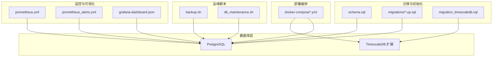
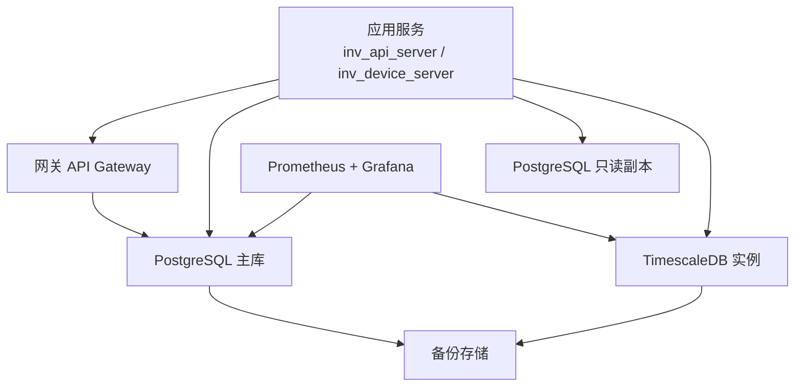
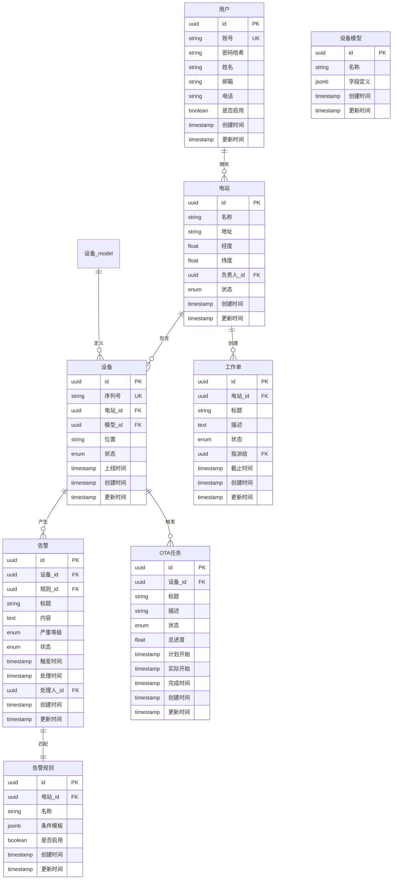
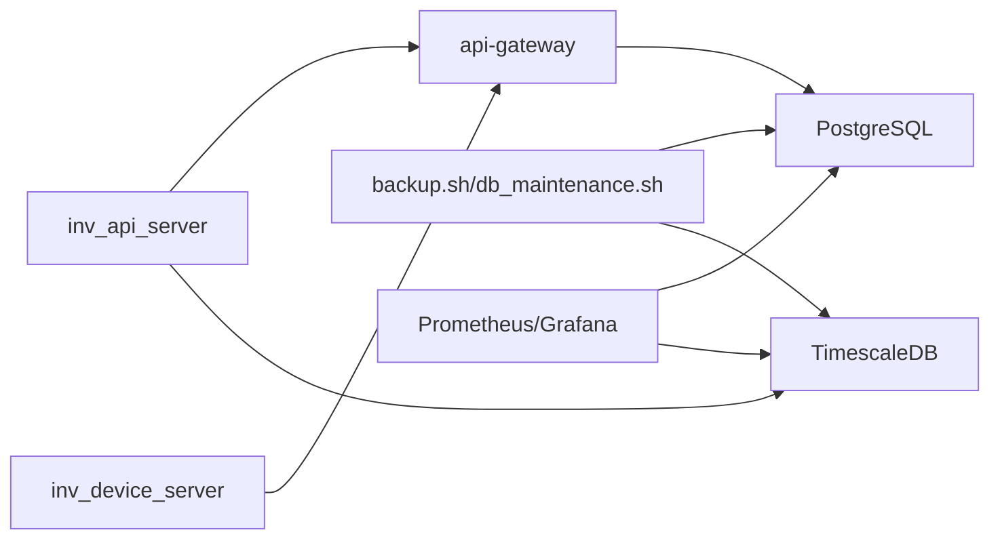

# 数据库设计

<cite>
**本文引用的文件**
- [schema.sql](file://database/schema.sql)
- [001_init_schema.up.sql](file://database/migrations/001_init_schema.up.sql)
- [002_add_performance_indexes.up.sql](file://database/migrations/002_add_performance_indexes.up.sql)
- [003_timescaledb_compression.up.sql](file://database/migrations/003_timescaledb_compression.up.sql)
- [004_add_energy_columns.up.sql](file://database/migrations/004_add_energy_columns.up.sql)
- [005_device_day_data_jsonb.up.sql](file://database/migrations/005_device_day_data_jsonb.up.sql)
- [006_refactor_ota_to_device_upgrades.sql](file://database/migrations/006_refactor_ota_to_device_upgrades.sql)
- [migration_timescaledb.sql](file://database/migration_timescaledb.sql)
- [backup.sh](file://deploy/scripts/backup.sh)
- [db_maintenance.sh](file://deploy/scripts/db_maintenance.sh)
- [create_admin.sql](file://deploy/create_admin.sql)
- [create_device_models.sql](file://deploy/create_device_models.sql)
- [create_model_tables.sql](file://deploy/create_model_tables.sql)
- [docker-compose.yml](file://deploy/docker-compose.yml)
- [docker-compose.full.yml](file://deploy/docker-compose.full.yml)
- [docker-compose.prod.yml](file://deploy/docker-compose.prod.yml)
- [grafana-dashboard.json](file://deploy/grafana-dashboard.json)
- [prometheus.yml](file://deploy/prometheus.yml)
- [prometheus_alerts.yml](file://deploy/prometheus_alerts.yml)
</cite>

## 目录
1. [简介](#简介)
2. [项目结构](#项目结构)
3. [核心组件](#核心组件)
4. [架构总览](#架构总览)
5. [详细组件分析](#详细组件分析)
6. [依赖分析](#依赖分析)
7. [性能考量](#性能考量)
8. [故障排查指南](#故障排查指南)
9. [结论](#结论)
10. [附录](#附录)

## 简介
本文件面向数据库设计与运维，围绕基于 PostgreSQL 的关系型数据库与 TimescaleDB 时序数据库的架构与实现进行系统化说明。内容涵盖核心数据模型（用户、设备、电站、告警、OTA 任务）、索引与查询优化策略、TimescaleDB 超表与压缩配置、数据库迁移管理（版本控制、增量迁移与回滚）、数据完整性约束、数据访问模式（读写分离、缓存与批量优化）、备份恢复与容量规划、以及数据安全与审计设计。

## 项目结构
数据库相关资源主要分布在以下位置：
- 关系型数据库初始化与迁移：database/schema.sql、database/migrations/*.up.sql
- TimescaleDB 集成脚本：database/migration_timescaledb.sql
- 运维脚本：deploy/scripts/backup.sh、deploy/scripts/db_maintenance.sh
- 初始化数据与模型：deploy/create_admin.sql、deploy/create_device_models.sql、deploy/create_model_tables.sql
- 部署编排：deploy/docker-compose*.yml
- 监控与可视化：deploy/grafana-dashboard.json、deploy/prometheus.yml、deploy/prometheus_alerts.yml

**图表来源**
- [schema.sql](file://database/schema.sql)
- [001_init_schema.up.sql](file://database/migrations/001_init_schema.up.sql)
- [migration_timescaledb.sql](file://database/migration_timescaledb.sql)
- [backup.sh](file://deploy/scripts/backup.sh)
- [db_maintenance.sh](file://deploy/scripts/db_maintenance.sh)
- [docker-compose.yml](file://deploy/docker-compose.yml)
- [prometheus.yml](file://deploy/prometheus.yml)
- [prometheus_alerts.yml](file://deploy/prometheus_alerts.yml)
- [grafana-dashboard.json](file://deploy/grafana-dashboard.json)

**章节来源**
- [schema.sql](file://database/schema.sql)
- [001_init_schema.up.sql](file://database/migrations/001_init_schema.up.sql)
- [migration_timescaledb.sql](file://database/migration_timescaledb.sql)
- [docker-compose.yml](file://deploy/docker-compose.yml)

## 核心组件
- 关系型数据库（PostgreSQL）：承载用户、设备、电站、告警规则、工作单、OTA 任务等核心业务实体及其关联关系。
- TimescaleDB（时序扩展）：用于高吞吐量时间序列数据存储（如设备遥测、日统计数据），支持超表、自动压缩与连续聚合。
- 迁移系统：采用版本化的 SQL 迁移，按顺序执行，支持增量演进与回滚。
- 运维工具：备份脚本、维护脚本、监控与告警配置，保障可用性与可观测性。
- 部署编排：通过 Docker Compose 启动数据库与 TimescaleDB 容器，并挂载持久化卷。

**章节来源**
- [schema.sql](file://database/schema.sql)
- [001_init_schema.up.sql](file://database/migrations/001_init_schema.up.sql)
- [002_add_performance_indexes.up.sql](file://database/migrations/002_add_performance_indexes.up.sql)
- [003_timescaledb_compression.up.sql](file://database/migrations/003_timescaledb_compression.up.sql)
- [004_add_energy_columns.up.sql](file://database/migrations/004_add_energy_columns.up.sql)
- [005_device_day_data_jsonb.up.sql](file://database/migrations/005_device_day_data_jsonb.up.sql)
- [006_refactor_ota_to_device_upgrades.sql](file://database/migrations/006_refactor_ota_to_device_upgrades.sql)
- [migration_timescaledb.sql](file://database/migration_timescaledb.sql)

## 架构总览
下图展示了数据库层的整体架构：关系型表负责结构化业务数据，TimescaleDB 负责高密度时间序列；迁移脚本确保数据库结构随版本演进；运维脚本与监控配置保障稳定性与可观察性。

**图表来源**
- [docker-compose.yml](file://deploy/docker-compose.yml)
- [docker-compose.full.yml](file://deploy/docker-compose.full.yml)
- [docker-compose.prod.yml](file://deploy/docker-compose.prod.yml)
- [prometheus.yml](file://deploy/prometheus.yml)
- [grafana-dashboard.json](file://deploy/grafana-dashboard.json)

## 详细组件分析

### 数据模型与表结构
核心实体包括：用户、设备、电站、告警、告警规则、工作单、OTA 任务、设备模型与动态字段表等。关系型表承担主业务逻辑，TimescaleDB 负责时间序列数据。

**图表来源**
- [schema.sql](file://database/schema.sql)
- [001_init_schema.up.sql](file://database/migrations/001_init_schema.up.sql)

**章节来源**
- [schema.sql](file://database/schema.sql)
- [001_init_schema.up.sql](file://database/migrations/001_init_schema.up.sql)

### 索引设计与查询优化
- 性能优化索引：在高频过滤与连接字段上建立单列索引，如用户账号、设备序列号、告警规则所属电站等。
- 复合索引：针对联合查询条件（如“电站+状态”、“设备+时间范围”）建立复合索引以提升扫描效率。
- 查询优化：避免 SELECT *，限定返回列；对时间范围查询使用覆盖索引；对 JSONB 字段使用 GIN/GIN(path_ops) 索引以加速条件检索。
- 统计信息与计划：定期更新统计信息，结合 EXPLAIN 分析执行计划，识别慢查询并针对性优化。

**章节来源**
- [002_add_performance_indexes.up.sql](file://database/migrations/002_add_performance_indexes.up.sql)

### TimescaleDB 集成
- 超表创建：将时间序列表转换为超表，设置时间维度与分区策略，提高大规模时间序列的写入与查询性能。
- 自动压缩：启用压缩政策，按时间窗口压缩旧数据，降低存储与 IO 开销。
- 连续聚合：对高频指标进行预聚合，减少实时查询计算成本，提升报表与仪表盘响应速度。
- 数据保留策略：结合业务需求设置数据保留期，自动清理过期数据。

**章节来源**
- [migration_timescaledb.sql](file://database/migration_timescaledb.sql)
- [003_timescaledb_compression.up.sql](file://database/migrations/003_timescaledb_compression.up.sql)

### 数据完整性约束
- 主键：所有表均定义主键，确保记录唯一性。
- 外键：设备、告警、工作单、OTA 任务等均通过外键关联到对应主表，保证参照完整性。
- 唯一约束：用户账号、设备序列号等关键字段设置唯一约束，防止重复。
- 检查约束：对枚举字段、数值范围、时间先后关系等设置检查约束，确保数据一致性。
- JSONB 结构校验：对动态字段定义与实例数据进行结构校验，避免脏数据进入系统。

**章节来源**
- [schema.sql](file://database/schema.sql)
- [001_init_schema.up.sql](file://database/migrations/001_init_schema.up.sql)
- [005_device_day_data_jsonb.up.sql](file://database/migrations/005_device_day_data_jsonb.up.sql)

### 数据访问模式
- 读写分离：主库负责写入（新增/更新/删除），只读副本用于查询，降低主库压力。
- 缓存策略：热点数据（如用户会话、静态配置、设备最新遥测）放入缓存，结合失效策略与缓存穿透防护。
- 批量操作优化：批量插入/更新采用事务包裹，分批处理，避免长事务锁表；对时间序列数据采用批量写入与压缩策略。

**章节来源**
- [docker-compose.yml](file://deploy/docker-compose.yml)
- [docker-compose.full.yml](file://deploy/docker-compose.full.yml)
- [docker-compose.prod.yml](file://deploy/docker-compose.prod.yml)

### 数据库迁移管理
- 版本控制：迁移文件按顺序编号，确保执行顺序与幂等性。
- 增量迁移：每次新增功能或结构调整时，添加新的 up.sql 文件，逐步演进。
- 回滚策略：提供 down.sql 或逆向迁移脚本，必要时可回退到上一个稳定版本；生产环境需谨慎评估风险。
- 迁移验证：在测试环境验证迁移后，再应用于生产；记录迁移日志与变更摘要。

**章节来源**
- [001_init_schema.up.sql](file://database/migrations/001_init_schema.up.sql)
- [002_add_performance_indexes.up.sql](file://database/migrations/002_add_performance_indexes.up.sql)
- [003_timescaledb_compression.up.sql](file://database/migrations/003_timescaledb_compression.up.sql)
- [004_add_energy_columns.up.sql](file://database/migrations/004_add_energy_columns.up.sql)
- [005_device_day_data_jsonb.up.sql](file://database/migrations/005_device_day_data_jsonb.up.sql)
- [006_refactor_ota_to_device_upgrades.sql](file://database/migrations/006_refactor_ota_to_device_upgrades.sql)

### 数据备份与恢复
- 备份策略：定期全量备份 + 增量/归档日志备份，确保可恢复到分钟级精度。
- 存储与加密：备份文件异地存储，传输与静态加密；限制访问权限。
- 恢复演练：定期进行恢复演练，验证备份文件完整性与恢复流程有效性。
- 时间点恢复：结合 WAL 归档与备份，实现时间点精确恢复。

**章节来源**
- [backup.sh](file://deploy/scripts/backup.sh)

### 性能监控与容量规划
- 指标采集：通过 Prometheus 抓取数据库关键指标（连接数、查询延迟、缓冲区命中率、压缩比、连续聚合刷新耗时等）。
- 可视化：Grafana 仪表盘展示数据库健康状况与趋势。
- 告警：基于阈值与异常检测设置告警，及时发现性能瓶颈与异常。
- 容量规划：根据数据增长速率、查询负载与压缩效果，规划存储扩容与硬件升级节奏。

**章节来源**
- [prometheus.yml](file://deploy/prometheus.yml)
- [prometheus_alerts.yml](file://deploy/prometheus_alerts.yml)
- [grafana-dashboard.json](file://deploy/grafana-dashboard.json)

### 数据安全与权限控制
- 最小权限原则：为不同角色（管理员、运营人员、设备侧）分配最小必要权限；禁用默认高权限账户。
- 访问控制：通过网络ACL与防火墙限制数据库访问来源；启用 TLS 加密传输。
- 审计日志：开启 SQL 审计与变更审计，记录敏感操作与数据修改轨迹。
- 敏感数据保护：对密码、密钥等敏感字段加密存储；脱敏展示与导出。

**章节来源**
- [create_admin.sql](file://deploy/create_admin.sql)
- [create_device_models.sql](file://deploy/create_device_models.sql)
- [create_model_tables.sql](file://deploy/create_model_tables.sql)

## 依赖分析
数据库层依赖关系如下：应用服务通过网关访问数据库；TimescaleDB 作为独立时序数据库与主库并行运行；运维脚本与监控配置贯穿整个生命周期。

**图表来源**
- [docker-compose.yml](file://deploy/docker-compose.yml)
- [prometheus.yml](file://deploy/prometheus.yml)
- [grafana-dashboard.json](file://deploy/grafana-dashboard.json)

**章节来源**
- [docker-compose.yml](file://deploy/docker-compose.yml)
- [prometheus.yml](file://deploy/prometheus.yml)
- [grafana-dashboard.json](file://deploy/grafana-dashboard.json)

## 性能考量
- 写入性能：批量写入、压缩策略、分区与分片；合理设置 WAL 参数与检查点间隔。
- 查询性能：索引策略、查询计划优化、只读副本分流；对热路径数据进行缓存。
- 存储成本：压缩比、数据保留期、冷热分层；定期清理无用历史数据。
- 可扩展性：水平扩展（分片/复制）与垂直扩展（硬件升级）结合；容器化部署便于弹性伸缩。

## 故障排查指南
- 连接问题：检查网络连通性、认证凭据与防火墙策略；确认只读副本同步状态。
- 性能问题：使用 EXPLAIN 分析慢查询，识别缺失索引或全表扫描；调整参数与分区策略。
- 备份恢复：验证备份文件完整性与可恢复性；演练恢复流程，缩短 RTO/RPO。
- 监控告警：关注连接数、查询延迟、缓冲区命中率、压缩比与连续聚合刷新异常。
- TimescaleDB 异常：检查压缩策略、数据保留期与超表分区配置；确认连续聚合是否正常刷新。

**章节来源**
- [db_maintenance.sh](file://deploy/scripts/db_maintenance.sh)
- [prometheus_alerts.yml](file://deploy/prometheus_alerts.yml)

## 结论
该数据库设计方案以 PostgreSQL 为核心，结合 TimescaleDB 的时序能力，形成关系型与时间序列协同的混合架构。通过规范的迁移管理、完善的索引与查询优化、严格的完整性约束、稳健的备份恢复与监控体系，以及安全与权限控制，能够支撑从设备遥测到业务报表的全链路数据需求。建议持续迭代索引策略、压缩与聚合配置，并完善自动化运维与应急演练，确保系统长期稳定高效运行。

## 附录
- 初始化数据：通过部署脚本创建管理员账户、设备模型与基础表结构。
- 部署参考：使用 Docker Compose 启动数据库与 TimescaleDB，挂载持久化卷与配置文件。
- 监控参考：Prometheus 抓取数据库指标，Grafana 展示关键面板，结合告警规则实现主动运维。

**章节来源**
- [create_admin.sql](file://deploy/create_admin.sql)
- [create_device_models.sql](file://deploy/create_device_models.sql)
- [create_model_tables.sql](file://deploy/create_model_tables.sql)
- [docker-compose.yml](file://deploy/docker-compose.yml)
- [docker-compose.full.yml](file://deploy/docker-compose.full.yml)
- [docker-compose.prod.yml](file://deploy/docker-compose.prod.yml)
- [prometheus.yml](file://deploy/prometheus.yml)
- [grafana-dashboard.json](file://deploy/grafana-dashboard.json)