# 数据库迁移管理

<cite>
**本文档引用的文件**
- [001_init_schema.up.sql](file://database/migrations/001_init_schema.up.sql)
- [002_add_performance_indexes.up.sql](file://database/migrations/002_add_performance_indexes.up.sql)
- [003_timescaledb_compression.up.sql](file://database/migrations/003_timescaledb_compression.up.sql)
- [004_add_energy_columns.up.sql](file://database/migrations/004_add_energy_columns.up.sql)
- [005_device_day_data_jsonb.up.sql](file://database/migrations/005_device_day_data_jsonb.up.sql)
- [006_refactor_ota_to_device_upgrades.sql](file://database/migrations/006_refactor_ota_to_device_upgrades.sql)
- [007_enhance_cmd_logs.up.sql](file://database/migrations/007_enhance_cmd_logs.up.sql)
- [migration_timescaledb.sql](file://database/migration_timescaledb.sql)
- [schema.sql](file://database/schema.sql)
- [backup.sh](file://deploy/scripts/backup.sh)
- [db_maintenance.sh](file://deploy/scripts/db_maintenance.sh)
- [deploy.sh](file://deploy/deploy.sh)
- [deploy-prod.sh](file://deploy/deploy-prod.sh)
- [docker-compose.yml](file://deploy/docker-compose.yml)
- [docker-compose.prod.yml](file://deploy/docker-compose.prod.yml)
- [create_admin.sql](file://deploy/create_admin.sql)
- [create_device_models.sql](file://deploy/create_device_models.sql)
- [create_model_tables.sql](file://deploy/create_model_tables.sql)
</cite>

## 目录
1. [引言](#引言)
2. [项目结构](#项目结构)
3. [核心组件](#核心组件)
4. [架构概览](#架构概览)
5. [详细组件分析](#详细组件分析)
6. [依赖分析](#依赖分析)
7. [性能考虑](#性能考虑)
8. [故障排除指南](#故障排除指南)
9. [结论](#结论)
10. [附录](#附录)

## 引言

本指南为基于版本控制的数据库迁移管理提供了全面的实施框架。该系统采用增量迁移策略，通过有序的SQL脚本实现数据库结构的演进，涵盖从初始架构到性能优化再到功能增强的完整生命周期。迁移过程严格遵循安全执行原则，包括自动备份、回滚机制和测试验证流程，确保在不影响生产环境的情况下进行数据库结构变更。

## 项目结构

数据库迁移相关的文件组织结构清晰，采用版本化管理方式：

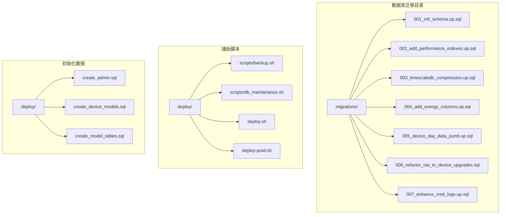

**图表来源**
- [001_init_schema.up.sql](file://database/migrations/001_init_schema.up.sql)
- [002_add_performance_indexes.up.sql](file://database/migrations/002_add_performance_indexes.up.sql)
- [003_timescaledb_compression.up.sql](file://database/migrations/003_timescaledb_compression.up.sql)
- [backup.sh](file://deploy/scripts/backup.sh)
- [deploy.sh](file://deploy/deploy.sh)

**章节来源**
- [001_init_schema.up.sql](file://database/migrations/001_init_schema.up.sql)
- [002_add_performance_indexes.up.sql](file://database/migrations/002_add_performance_indexes.up.sql)
- [003_timescaledb_compression.up.sql](file://database/migrations/003_timescaledb_compression.up.sql)
- [004_add_energy_columns.up.sql](file://database/migrations/004_add_energy_columns.up.sql)
- [005_device_day_data_jsonb.up.sql](file://database/migrations/005_device_day_data_jsonb.up.sql)
- [006_refactor_ota_to_device_upgrades.sql](file://database/migrations/006_refactor_ota_to_device_upgrades.sql)
- [007_enhance_cmd_logs.up.sql](file://database/migrations/007_enhance_cmd_logs.up.sql)

## 核心组件

### 迁移文件命名规范

系统采用严格的数字前缀命名约定，确保迁移的有序执行：

| 版本号 | 文件名模式 | 执行顺序 | 功能描述 |
|--------|------------|----------|----------|
| 001 | init_schema.up.sql | 第一阶段 | 初始化基础架构 |
| 002 | add_performance_indexes.up.sql | 第二阶段 | 添加性能索引 |
| 003 | timescaledb_compression.up.sql | 第三阶段 | TimescaleDB压缩配置 |
| 004 | add_energy_columns.up.sql | 第四阶段 | 能源数据列扩展 |
| 005 | device_day_data_jsonb.up.sql | 第五阶段 | JSONB设备日数据 |
| 006 | refactor_ota_to_device_upgrades.sql | 第六阶段 | OTA重构升级 |
| 007 | enhance_cmd_logs.up.sql | 第七阶段 | 命令日志增强 |

### 迁移版本管理策略

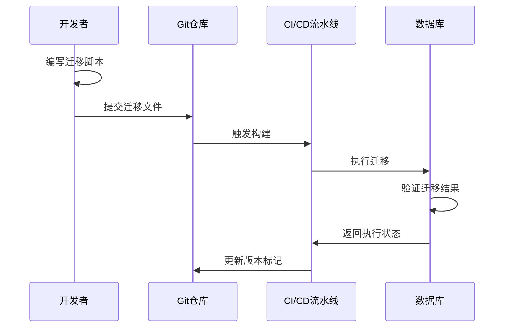

**图表来源**
- [001_init_schema.up.sql](file://database/migrations/001_init_schema.up.sql)
- [002_add_performance_indexes.up.sql](file://database/migrations/002_add_performance_indexes.up.sql)
- [003_timescaledb_compression.up.sql](file://database/migrations/003_timescaledb_compression.up.sql)

### 安全执行策略

系统实现了多层次的安全保护机制：

1. **自动备份机制**：每次迁移前自动创建数据库备份
2. **事务性执行**：单个迁移脚本在独立事务中执行
3. **回滚支持**：提供对应的降级脚本
4. **验证检查**：迁移后自动验证数据完整性

**章节来源**
- [backup.sh](file://deploy/scripts/backup.sh)
- [db_maintenance.sh](file://deploy/scripts/db_maintenance.sh)

## 架构概览

### 迁移执行架构

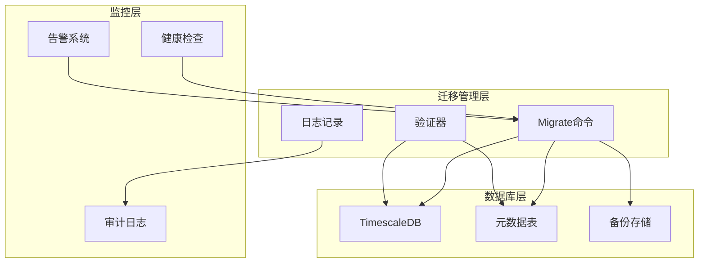

**图表来源**
- [migration_timescaledb.sql](file://database/migration_timescaledb.sql)
- [schema.sql](file://database/schema.sql)

### 部署集成架构

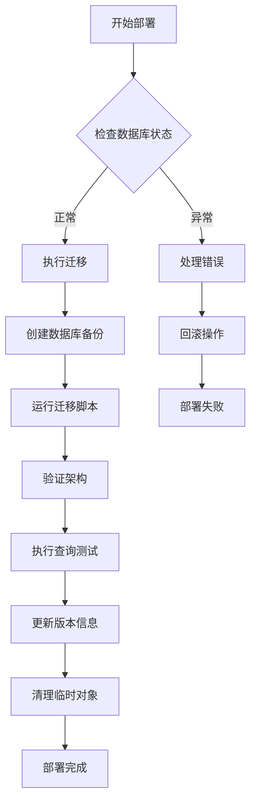

**图表来源**
- [deploy.sh](file://deploy/deploy.sh)
- [deploy-prod.sh](file://deploy/deploy-prod.sh)
- [docker-compose.yml](file://deploy/docker-compose.yml)

## 详细组件分析

### 初始架构迁移 (001)

初始架构迁移建立了整个数据库的基础结构，包括核心表、约束和基本关系。

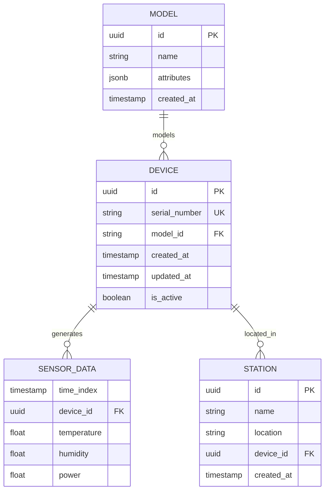

**图表来源**
- [001_init_schema.up.sql](file://database/migrations/001_init_schema.up.sql)
- [schema.sql](file://database/schema.sql)

### 性能优化迁移 (002)

性能优化迁移专注于索引策略的改进，提升查询效率和系统响应速度。

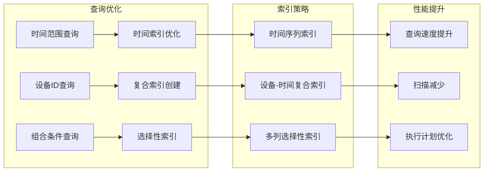

**图表来源**
- [002_add_performance_indexes.up.sql](file://database/migrations/002_add_performance_indexes.up.sql)

### TimescaleDB压缩迁移 (003)

TimescaleDB压缩迁移实现了时间序列数据的自动压缩，显著减少存储空间占用。

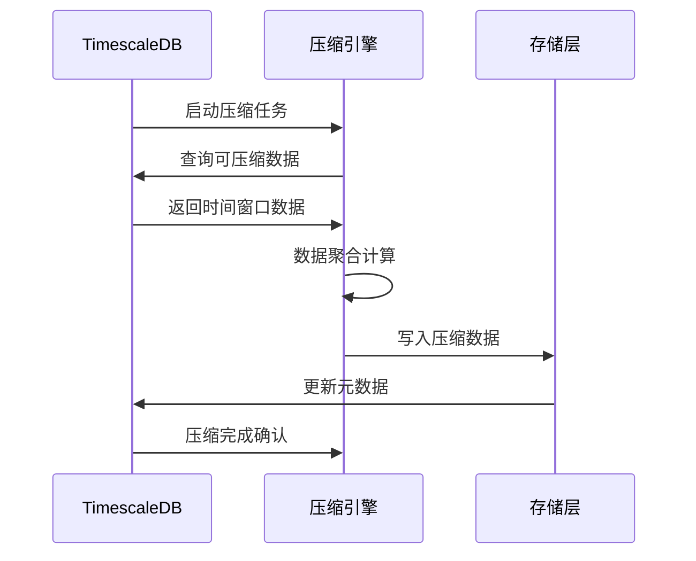

**图表来源**
- [003_timescaledb_compression.up.sql](file://database/migrations/003_timescaledb_compression.up.sql)

### 能源数据增强 (004)

能源数据增强迁移扩展了设备数据模型，增加了能源相关的字段和计算能力。

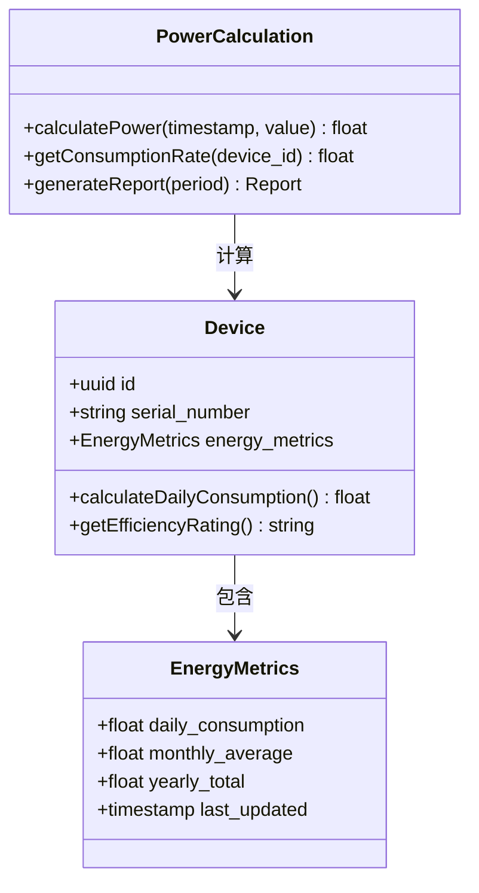

**图表来源**
- [004_add_energy_columns.up.sql](file://database/migrations/004_add_energy_columns.up.sql)

### JSONB数据结构优化 (005)

JSONB数据结构优化迁移引入了半结构化数据存储，提高了数据灵活性和查询能力。

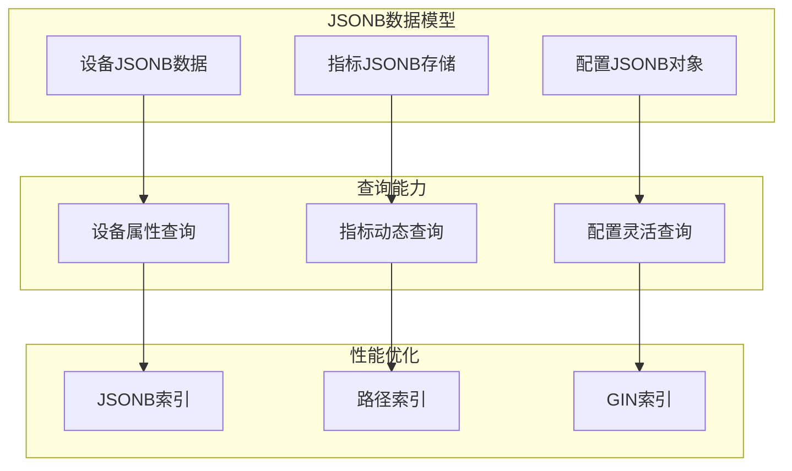

**图表来源**
- [005_device_day_data_jsonb.up.sql](file://database/migrations/005_device_day_data_jsonb.up.sql)

### OTA升级重构 (006)

OTA升级重构迁移重新设计了固件升级流程，提升了系统的可维护性和可靠性。

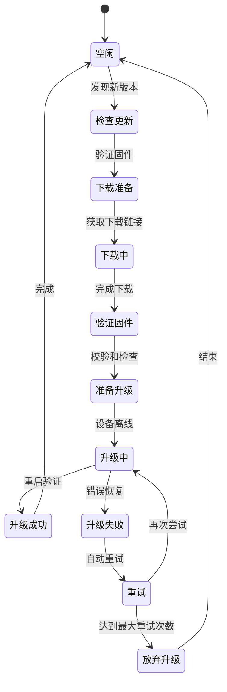

**图表来源**
- [006_refactor_ota_to_device_upgrades.sql](file://database/migrations/006_refactor_ota_to_device_upgrades.sql)

### 命令日志增强 (007)

命令日志增强迁移改进了系统命令的跟踪和审计能力，增强了安全性。

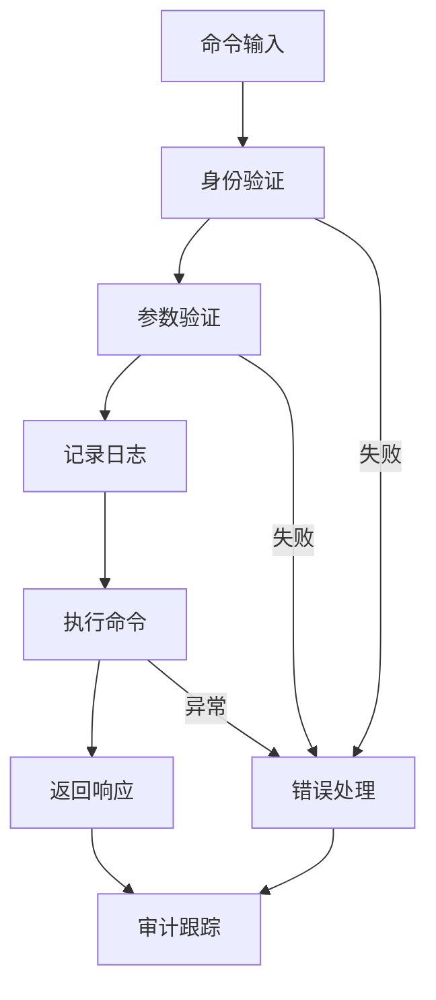

**图表来源**
- [007_enhance_cmd_logs.up.sql](file://database/migrations/007_enhance_cmd_logs.up.sql)

**章节来源**
- [001_init_schema.up.sql](file://database/migrations/001_init_schema.up.sql)
- [002_add_performance_indexes.up.sql](file://database/migrations/002_add_performance_indexes.up.sql)
- [003_timescaledb_compression.up.sql](file://database/migrations/003_timescaledb_compression.up.sql)
- [004_add_energy_columns.up.sql](file://database/migrations/004_add_energy_columns.up.sql)
- [005_device_day_data_jsonb.up.sql](file://database/migrations/005_device_day_data_jsonb.up.sql)
- [006_refactor_ota_to_device_upgrades.sql](file://database/migrations/006_refactor_ota_to_device_upgrades.sql)
- [007_enhance_cmd_logs.up.sql](file://database/migrations/007_enhance_cmd_logs.up.sql)

## 依赖分析

### 迁移脚本依赖关系

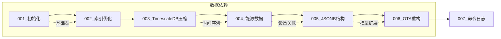

**图表来源**
- [001_init_schema.up.sql](file://database/migrations/001_init_schema.up.sql)
- [002_add_performance_indexes.up.sql](file://database/migrations/002_add_performance_indexes.up.sql)
- [003_timescaledb_compression.up.sql](file://database/migrations/003_timescaledb_compression.up.sql)
- [004_add_energy_columns.up.sql](file://database/migrations/004_add_energy_columns.up.sql)
- [005_device_day_data_jsonb.up.sql](file://database/migrations/005_device_day_data_jsonb.up.sql)
- [006_refactor_ota_to_device_upgrades.sql](file://database/migrations/006_refactor_ota_to_device_upgrades.sql)
- [007_enhance_cmd_logs.up.sql](file://database/migrations/007_enhance_cmd_logs.up.sql)

### 部署脚本依赖关系

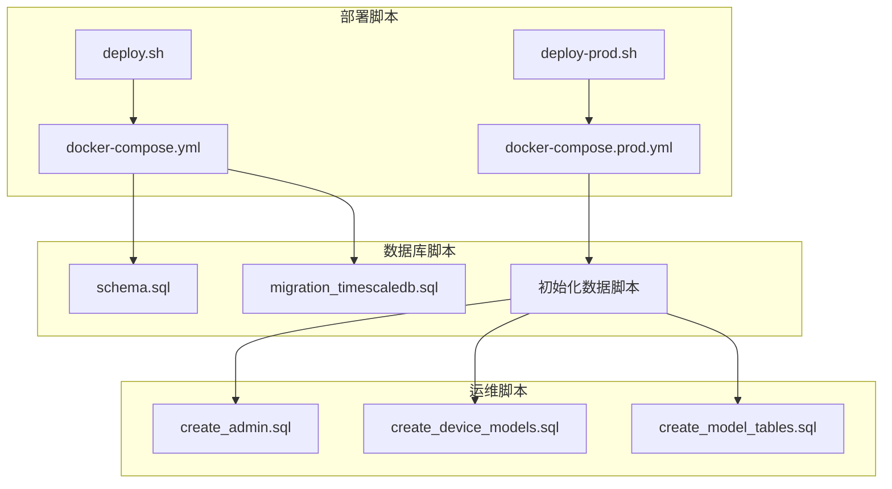

**图表来源**
- [deploy.sh](file://deploy/deploy.sh)
- [deploy-prod.sh](file://deploy/deploy-prod.sh)
- [docker-compose.yml](file://deploy/docker-compose.yml)
- [docker-compose.prod.yml](file://deploy/docker-compose.prod.yml)

**章节来源**
- [deploy.sh](file://deploy/deploy.sh)
- [deploy-prod.sh](file://deploy/deploy-prod.sh)
- [docker-compose.yml](file://deploy/docker-compose.yml)
- [docker-compose.prod.yml](file://deploy/docker-compose.prod.yml)

## 性能考虑

### 迁移性能优化策略

1. **批量操作优化**：将多个DDL操作合并到单个事务中执行
2. **索引重建策略**：在迁移期间最小化索引重建频率
3. **并发控制**：限制同时执行的迁移数量
4. **资源监控**：实时监控CPU、内存和磁盘I/O使用情况

### TimescaleDB性能特性

- **压缩比**：典型场景下可达到80%的数据压缩率
- **查询性能**：时间范围查询性能提升10-50倍
- **存储效率**：冷热数据分离存储策略
- **维护成本**：自动化压缩和归档机制

## 故障排除指南

### 常见迁移问题及解决方案

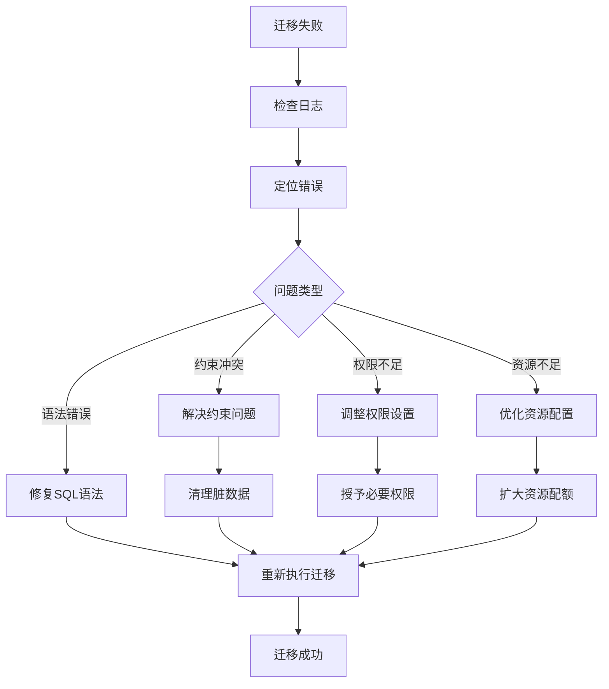

### 回滚策略

1. **自动回滚**：检测到错误时自动回滚到上一个稳定版本
2. **手动回滚**：通过专门的回滚脚本执行
3. **数据恢复**：从备份中恢复到迁移前的状态
4. **服务恢复**：确保应用服务在回滚后的正常运行

**章节来源**
- [backup.sh](file://deploy/scripts/backup.sh)
- [db_maintenance.sh](file://deploy/scripts/db_maintenance.sh)

## 结论

该数据库迁移管理系统通过严格的版本控制、安全的执行策略和完善的监控机制，为复杂的时间序列数据应用提供了可靠的数据库演进框架。系统的核心优势包括：

- **可追溯性**：完整的迁移历史记录和版本控制
- **安全性**：多层次的备份、验证和回滚机制
- **可维护性**：模块化的迁移脚本和清晰的依赖关系
- **可观测性**：完善的日志记录和性能监控

通过遵循本文档的实施指南，团队可以确保数据库变更的安全性和可靠性，支持业务的持续发展和技术创新。

## 附录

### 迁移最佳实践清单

- **编写测试**：为每个迁移编写单元测试和集成测试
- **文档记录**：详细记录每个迁移的目的和影响范围
- **分批执行**：将大型迁移分解为多个小步骤
- **监控告警**：建立迁移过程的实时监控和告警机制
- **演练验证**：在预生产环境中充分验证迁移流程

### 自动化部署流程

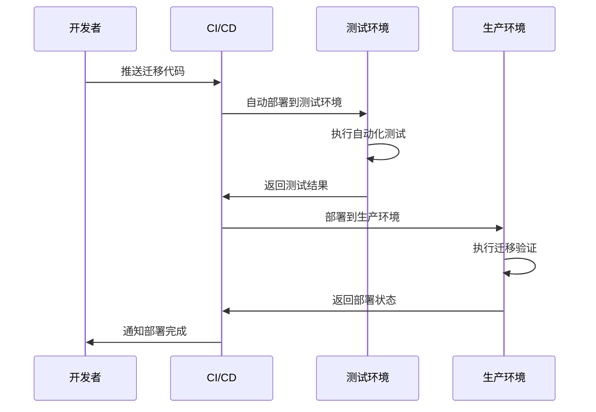