# 数据库迁移管理

<cite>
**本文引用的文件**
- [001_init_schema.up.sql](file://database/migrations/001_init_schema.up.sql)
- [002_add_performance_indexes.up.sql](file://database/migrations/002_add_performance_indexes.up.sql)
- [003_timescaledb_compression.up.sql](file://database/migrations/003_timescaledb_compression.up.sql)
- [004_add_energy_columns.up.sql](file://database/migrations/004_add_energy_columns.up.sql)
- [005_device_day_data_jsonb.up.sql](file://database/migrations/005_device_day_data_jsonb.up.sql)
- [006_refactor_ota_to_device_upgrades.sql](file://database/migrations/006_refactor_ota_to_device_upgrades.sql)
- [007_enhance_cmd_logs.up.sql](file://database/migrations/007_enhance_cmd_logs.up.sql)
- [008_upgrade_packages.up.sql](file://database/migrations/008_upgrade_packages.up.sql)
- [009_upgrade_tasks.up.sql](file://database/migrations/009_upgrade_tasks.up.sql)
- [010_add_dsp_bms_versions.up.sql](file://database/migrations/010_add_dsp_bms_versions.up.sql)
- [010_add_dsp_bms_versions.down.sql](file://database/migrations/010_add_dsp_bms_versions.down.sql)
- [011_add_group_name_and_control_params.up.sql](file://database/migrations/011_add_group_name_and_control_params.up.sql)
- [migration_timescaledb.sql](file://database/migration_timescaledb.sql)
- [schema.sql](file://database/schema.sql)
- [backup.sh](file://deploy/scripts/backup.sh)
- [db_maintenance.sh](file://deploy/scripts/db_maintenance.sh)
- [deploy.sh](file://deploy/deploy.sh)
- [deploy-prod.sh](file://deploy/deploy-prod.sh)
- [docker-compose.yml](file://deploy/docker-compose.yml)
- [docker-compose.prod.yml](file://deploy/docker-compose.prod.yml)
- [create_admin.sql](file://deploy/create_admin.sql)
- [create_device_models.sql](file://deploy/create_device_models.sql)
- [create_model_tables.sql](file://deploy/create_model_tables.sql)
</cite>

## 更新摘要
**所做更改**
- 新增迁移010：为设备表添加DSP和BMS固件版本字段支持
- 新增迁移011：为设备模型字段表添加分组名称和控制参数支持
- 更新了设备固件版本管理架构
- 增强了设备模型字段的分组和管理能力
- 完善了迁移版本序列和依赖关系

## 目录
1. [引言](#引言)
2. [项目结构](#项目结构)
3. [核心组件](#核心组件)
4. [架构概览](#架构概览)
5. [详细组件分析](#详细组件分析)
6. [依赖分析](#依赖分析)
7. [性能考虑](#性能考虑)
8. [故障排除指南](#故障排除指南)
9. [结论](#结论)
10. [附录](#附录)

## 引言

本指南为基于版本控制的数据库迁移管理提供了全面的实施框架。该系统采用增量迁移策略，通过有序的SQL脚本实现数据库结构的演进，涵盖从初始架构到性能优化再到功能增强的完整生命周期。迁移过程严格遵循安全执行原则，包括自动备份、回滚机制和测试验证流程，确保在不影响生产环境的情况下进行数据库结构变更。

**更新** 本次更新重点关注设备固件版本管理的增强和设备模型字段的分组管理能力，新增了DSP和BMS双固件版本跟踪以及设备模型字段的分组控制功能。

## 项目结构

数据库迁移相关的文件组织结构清晰，采用版本化管理方式：

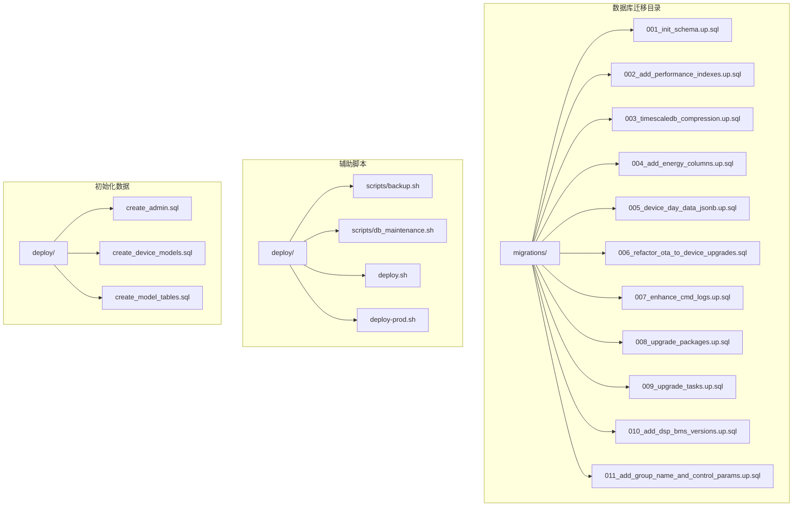

**图表来源**
- [001_init_schema.up.sql](file://database/migrations/001_init_schema.up.sql)
- [002_add_performance_indexes.up.sql](file://database/migrations/002_add_performance_indexes.up.sql)
- [003_timescaledb_compression.up.sql](file://database/migrations/003_timescaledb_compression.up.sql)
- [010_add_dsp_bms_versions.up.sql](file://database/migrations/010_add_dsp_bms_versions.up.sql)
- [011_add_group_name_and_control_params.up.sql](file://database/migrations/011_add_group_name_and_control_params.up.sql)
- [backup.sh](file://deploy/scripts/backup.sh)
- [deploy.sh](file://deploy/deploy.sh)

**章节来源**
- [001_init_schema.up.sql](file://database/migrations/001_init_schema.up.sql)
- [002_add_performance_indexes.up.sql](file://database/migrations/002_add_performance_indexes.up.sql)
- [003_timescaledb_compression.up.sql](file://database/migrations/003_timescaledb_compression.up.sql)
- [004_add_energy_columns.up.sql](file://database/migrations/004_add_energy_columns.up.sql)
- [005_device_day_data_jsonb.up.sql](file://database/migrations/005_device_day_data_jsonb.up.sql)
- [006_refactor_ota_to_device_upgrades.sql](file://database/migrations/006_refactor_ota_to_device_upgrades.sql)
- [007_enhance_cmd_logs.up.sql](file://database/migrations/007_enhance_cmd_logs.up.sql)
- [008_upgrade_packages.up.sql](file://database/migrations/008_upgrade_packages.up.sql)
- [009_upgrade_tasks.up.sql](file://database/migrations/009_upgrade_tasks.up.sql)
- [010_add_dsp_bms_versions.up.sql](file://database/migrations/010_add_dsp_bms_versions.up.sql)
- [011_add_group_name_and_control_params.up.sql](file://database/migrations/011_add_group_name_and_control_params.up.sql)

## 核心组件

### 迁移文件命名规范

系统采用严格的数字前缀命名约定，确保迁移的有序执行：

| 版本号 | 文件名模式 | 执行顺序 | 功能描述 |
|--------|------------|----------|----------|
| 001 | init_schema.up.sql | 第一阶段 | 初始化基础架构 |
| 002 | add_performance_indexes.up.sql | 第二阶段 | 添加性能索引 |
| 003 | timescaledb_compression.up.sql | 第三阶段 | TimescaleDB压缩配置 |
| 004 | add_energy_columns.up.sql | 第四阶段 | 能源数据列扩展 |
| 005 | device_day_data_jsonb.up.sql | 第五阶段 | JSONB设备日数据 |
| 006 | refactor_ota_to_device_upgrades.sql | 第六阶段 | OTA重构升级系统 |
| 007 | enhance_cmd_logs.up.sql | 第七阶段 | 命令日志增强 |
| 008 | upgrade_packages.up.sql | 第八阶段 | 升级包管理系统 |
| 009 | upgrade_tasks.up.sql | 第九阶段 | 升级任务调度系统 |
| 010 | add_dsp_bms_versions.up.sql | 第十阶段 | DSP/BMS固件版本管理 |
| 011 | add_group_name_and_control_params.up.sql | 第十一阶段 | 设备模型字段分组控制 |

### 设备固件版本管理架构

**更新** 新增的设备固件版本管理架构支持DSP和BMS双固件版本跟踪：

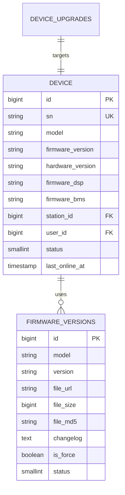

**图表来源**
- [010_add_dsp_bms_versions.up.sql](file://database/migrations/010_add_dsp_bms_versions.up.sql)
- [001_init_schema.up.sql](file://database/migrations/001_init_schema.up.sql)
- [006_refactor_ota_to_device_upgrades.sql](file://database/migrations/006_refactor_ota_to_device_upgrades.sql)

### 设备模型字段分组管理

**更新** 设备模型字段分组管理引入了更灵活的字段组织方式：

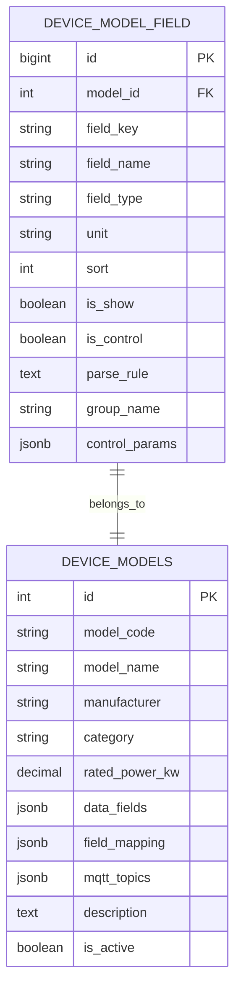

**图表来源**
- [011_add_group_name_and_control_params.up.sql](file://database/migrations/011_add_group_name_and_control_params.up.sql)
- [create_model_tables.sql](file://deploy/create_model_tables.sql)

### 迁移版本管理策略

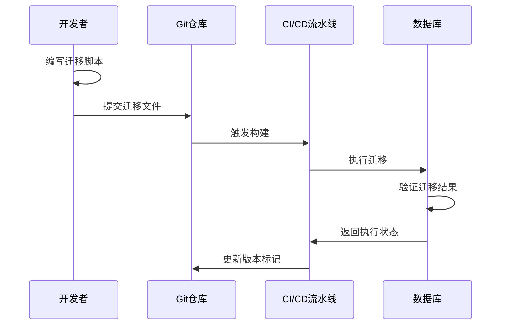

**图表来源**
- [001_init_schema.up.sql](file://database/migrations/001_init_schema.up.sql)
- [002_add_performance_indexes.up.sql](file://database/migrations/002_add_performance_indexes.up.sql)
- [003_timescaledb_compression.up.sql](file://database/migrations/003_timescaledb_compression.up.sql)

### 安全执行策略

系统实现了多层次的安全保护机制：

1. **自动备份机制**：每次迁移前自动创建数据库备份
2. **事务性执行**：单个迁移脚本在独立事务中执行
3. **回滚支持**：提供对应的降级脚本（如010版本的down.sql）
4. **验证检查**：迁移后自动验证数据完整性

**章节来源**
- [010_add_dsp_bms_versions.down.sql](file://database/migrations/010_add_dsp_bms_versions.down.sql)
- [backup.sh](file://deploy/scripts/backup.sh)
- [db_maintenance.sh](file://deploy/scripts/db_maintenance.sh)

## 架构概览

### 迁移执行架构

```mermaid
graph TB
subgraph "迁移管理层"
MIGRATE[Migrate命令]
VALIDATE[验证器]
LOGGING[日志记录]
END
subgraph "数据库层"
TIMESCALE[TimescaleDB]
METADATA[元数据表]
BACKUP[备份存储]
DEVICE_UPGRADES[设备升级表]
UPGRADE_PACKAGES[升级包表]
UPGRADE_TASKS[升级任务表]
DEVICE_FIRMWARE[设备固件版本表]
MODEL_FIELDS[设备模型字段表]
end
subgraph "监控层"
HEALTH[健康检查]
ALERT[告警系统]
AUDIT[审计日志]
end
MIGRATE --> TIMESCALE
MIGRATE --> METADATA
MIGRATE --> BACKUP
MIGRATE --> DEVICE_UPGRADES
MIGRATE --> UPGRADE_PACKAGES
MIGRATE --> UPGRADE_TASKS
MIGRATE --> DEVICE_FIRMWARE
MIGRATE --> MODEL_FIELDS
VALIDATE --> TIMESCALE
VALIDATE --> DEVICE_UPGRADES
VALIDATE --> UPGRADE_PACKAGES
VALIDATE --> UPGRADE_TASKS
VALIDATE --> DEVICE_FIRMWARE
VALIDATE --> MODEL_FIELDS
LOGGING --> AUDIT
HEALTH --> MIGRATE
ALERT --> MIGRATE
```

**图表来源**
- [migration_timescaledb.sql](file://database/migration_timescaledb.sql)
- [schema.sql](file://database/schema.sql)

### 部署集成架构

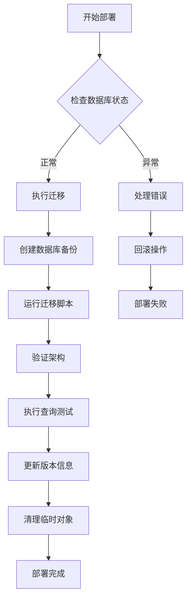

**图表来源**
- [deploy.sh](file://deploy/deploy.sh)
- [deploy-prod.sh](file://deploy/deploy-prod.sh)
- [docker-compose.yml](file://deploy/docker-compose.yml)

## 详细组件分析

### 初始架构迁移 (001)

初始架构迁移建立了整个数据库的基础结构，包括核心表、约束和基本关系。

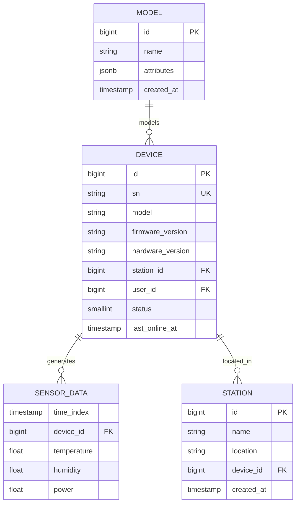

**图表来源**
- [001_init_schema.up.sql](file://database/migrations/001_init_schema.up.sql)
- [schema.sql](file://database/schema.sql)

### 性能优化迁移 (002)

性能优化迁移专注于索引策略的改进，提升查询效率和系统响应速度。

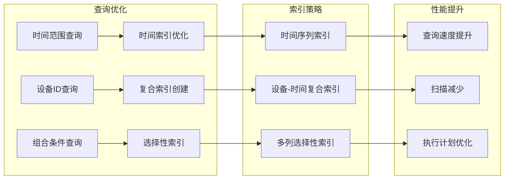

**图表来源**
- [002_add_performance_indexes.up.sql](file://database/migrations/002_add_performance_indexes.up.sql)

### TimescaleDB压缩迁移 (003)

TimescaleDB压缩迁移实现了时间序列数据的自动压缩，显著减少存储空间占用。

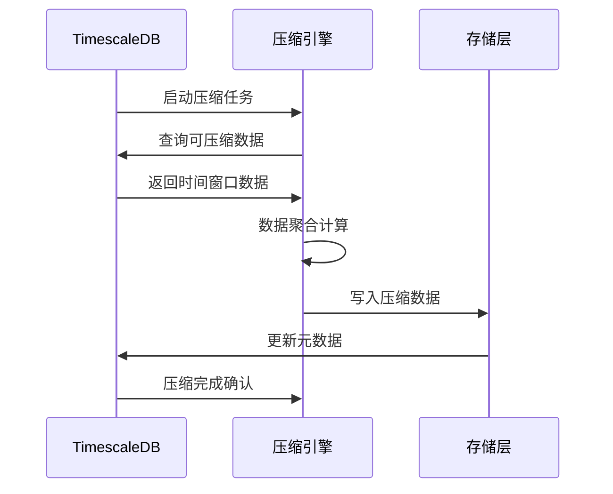

**图表来源**
- [003_timescaledb_compression.up.sql](file://database/migrations/003_timescaledb_compression.up.sql)

### 能源数据增强 (004)

能源数据增强迁移扩展了设备数据模型，增加了能源相关的字段和计算能力。

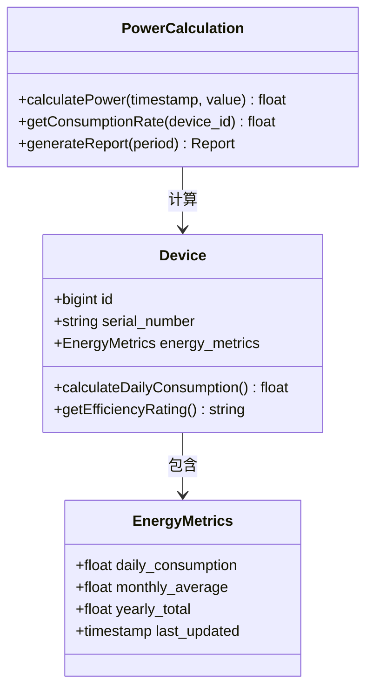

**图表来源**
- [004_add_energy_columns.up.sql](file://database/migrations/004_add_energy_columns.up.sql)

### JSONB数据结构优化 (005)

JSONB数据结构优化迁移引入了半结构化数据存储，提高了数据灵活性和查询能力。

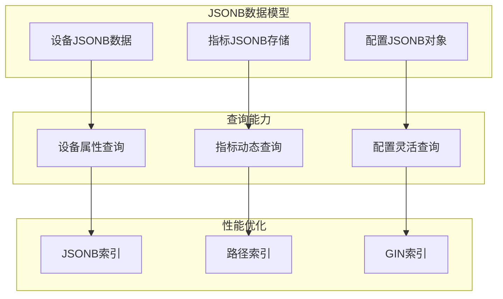

**图表来源**
- [005_device_day_data_jsonb.up.sql](file://database/migrations/005_device_day_data_jsonb.up.sql)

### OTA升级重构 (006)

OTA升级重构迁移重新设计了固件升级流程，引入了全新的设备升级系统架构，替代了原有的OTA任务表结构。

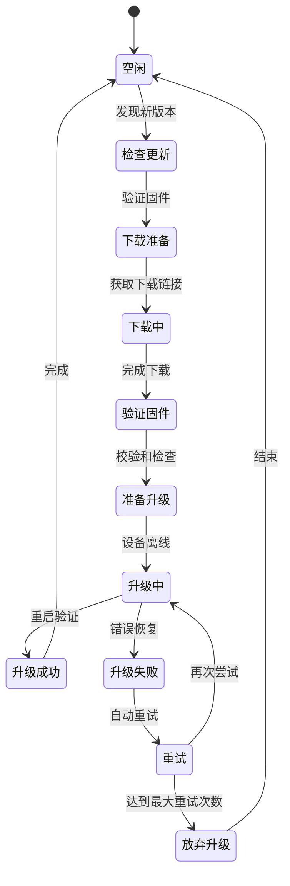

**图表来源**
- [006_refactor_ota_to_device_upgrades.sql](file://database/migrations/006_refactor_ota_to_device_upgrades.sql)

### 命令日志增强 (007)

命令日志增强迁移改进了系统命令的跟踪和审计能力，增强了安全性。

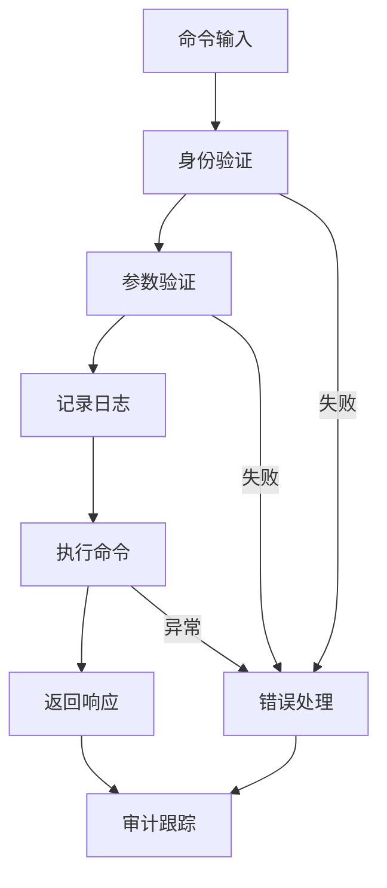

**图表来源**
- [007_enhance_cmd_logs.up.sql](file://database/migrations/007_enhance_cmd_logs.up.sql)

### 升级包管理系统 (008)

升级包管理系统迁移引入了完整的升级包管理机制，为设备升级提供了标准化的包管理能力。

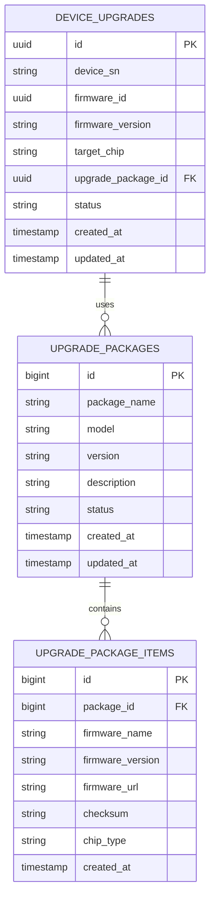

**图表来源**
- [008_upgrade_packages.up.sql](file://database/migrations/008_upgrade_packages.up.sql)

### 升级任务调度系统 (009)

升级任务调度系统迁移实现了智能化的升级任务调度和执行监控机制。

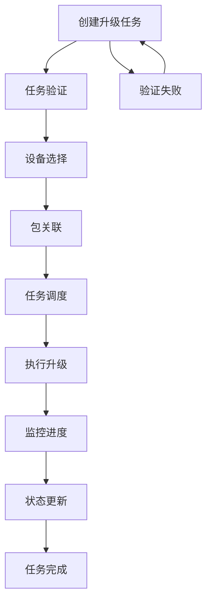

**图表来源**
- [009_upgrade_tasks.up.sql](file://database/migrations/009_upgrade_tasks.up.sql)

### DSP/BMS固件版本管理 (010)

**更新** DSP/BMS固件版本管理迁移为设备表添加了专门的DSP和BMS固件版本字段，支持逆变器设备的复杂固件管理需求。

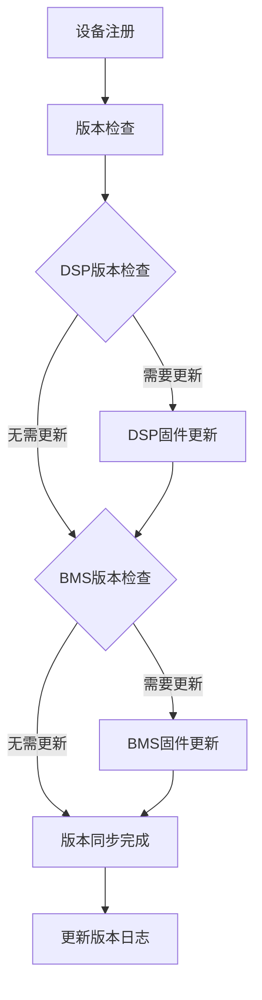

**图表来源**
- [010_add_dsp_bms_versions.up.sql](file://database/migrations/010_add_dsp_bms_versions.up.sql)

### 设备模型字段分组控制 (011)

**更新** 设备模型字段分组控制迁移为device_model_field表添加了分组名称和控制参数支持，提升了设备配置的灵活性。

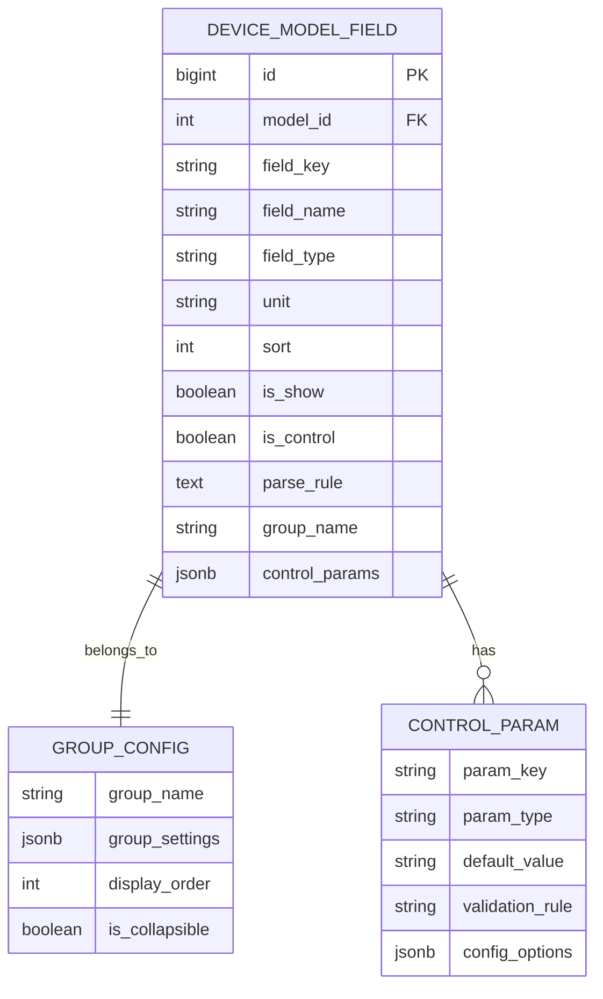

**图表来源**
- [011_add_group_name_and_control_params.up.sql](file://database/migrations/011_add_group_name_and_control_params.up.sql)
- [create_model_tables.sql](file://deploy/create_model_tables.sql)

**章节来源**
- [001_init_schema.up.sql](file://database/migrations/001_init_schema.up.sql)
- [002_add_performance_indexes.up.sql](file://database/migrations/002_add_performance_indexes.up.sql)
- [003_timescaledb_compression.up.sql](file://database/migrations/003_timescaledb_compression.up.sql)
- [004_add_energy_columns.up.sql](file://database/migrations/004_add_energy_columns.up.sql)
- [005_device_day_data_jsonb.up.sql](file://database/migrations/005_device_day_data_jsonb.up.sql)
- [006_refactor_ota_to_device_upgrades.sql](file://database/migrations/006_refactor_ota_to_device_upgrades.sql)
- [007_enhance_cmd_logs.up.sql](file://database/migrations/007_enhance_cmd_logs.up.sql)
- [008_upgrade_packages.up.sql](file://database/migrations/008_upgrade_packages.up.sql)
- [009_upgrade_tasks.up.sql](file://database/migrations/009_upgrade_tasks.up.sql)
- [010_add_dsp_bms_versions.up.sql](file://database/migrations/010_add_dsp_bms_versions.up.sql)
- [011_add_group_name_and_control_params.up.sql](file://database/migrations/011_add_group_name_and_control_params.up.sql)

## 依赖分析

### 迁移脚本依赖关系

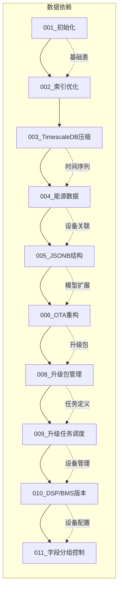

**图表来源**
- [001_init_schema.up.sql](file://database/migrations/001_init_schema.up.sql)
- [002_add_performance_indexes.up.sql](file://database/migrations/002_add_performance_indexes.up.sql)
- [003_timescaledb_compression.up.sql](file://database/migrations/003_timescaledb_compression.up.sql)
- [004_add_energy_columns.up.sql](file://database/migrations/004_add_energy_columns.up.sql)
- [005_device_day_data_jsonb.up.sql](file://database/migrations/005_device_day_data_jsonb.up.sql)
- [006_refactor_ota_to_device_upgrades.sql](file://database/migrations/006_refactor_ota_to_device_upgrades.sql)
- [007_enhance_cmd_logs.up.sql](file://database/migrations/007_enhance_cmd_logs.up.sql)
- [008_upgrade_packages.up.sql](file://database/migrations/008_upgrade_packages.up.sql)
- [009_upgrade_tasks.up.sql](file://database/migrations/009_upgrade_tasks.up.sql)
- [010_add_dsp_bms_versions.up.sql](file://database/migrations/010_add_dsp_bms_versions.up.sql)
- [011_add_group_name_and_control_params.up.sql](file://database/migrations/011_add_group_name_and_control_params.up.sql)

### 部署脚本依赖关系

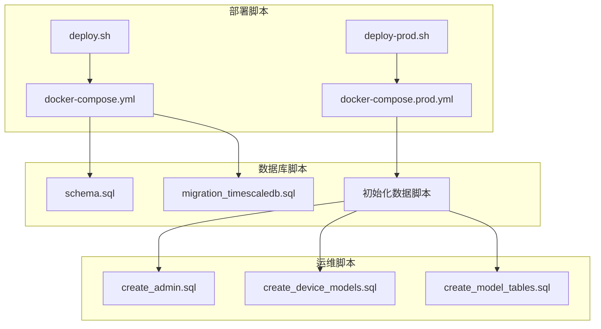

**图表来源**
- [deploy.sh](file://deploy/deploy.sh)
- [deploy-prod.sh](file://deploy/deploy-prod.sh)
- [docker-compose.yml](file://deploy/docker-compose.yml)
- [docker-compose.prod.yml](file://deploy/docker-compose.prod.yml)

**章节来源**
- [deploy.sh](file://deploy/deploy.sh)
- [deploy-prod.sh](file://deploy/deploy-prod.sh)
- [docker-compose.yml](file://deploy/docker-compose.yml)
- [docker-compose.prod.yml](file://deploy/docker-compose.prod.yml)

## 性能考虑

### 迁移性能优化策略

1. **批量操作优化**：将多个DDL操作合并到单个事务中执行
2. **索引重建策略**：在迁移期间最小化索引重建频率
3. **并发控制**：限制同时执行的迁移数量
4. **资源监控**：实时监控CPU、内存和磁盘I/O使用情况

### TimescaleDB性能特性

- **压缩比**：典型场景下可达到80%的数据压缩率
- **查询性能**：时间范围查询性能提升10-50倍
- **存储效率**：冷热数据分离存储策略
- **维护成本**：自动化压缩和归档机制

### 设备固件版本管理性能优化

**更新** 新的设备固件版本管理系统采用了多项性能优化措施：

- **索引优化**：为firmware_dsp和firmware_bms字段创建了适当的索引策略
- **查询优化**：针对双固件版本查询进行了专门的查询优化
- **缓存机制**：对常用的固件版本信息进行缓存
- **异步处理**：固件版本检查采用异步处理模式

### 设备模型字段分组性能优化

**更新** 设备模型字段分组管理引入了性能优化：

- **分组索引**：为group_name字段创建了索引以优化分组查询
- **JSONB优化**：对control_params字段使用了高效的JSONB操作
- **懒加载**：大字段内容采用懒加载策略
- **缓存策略**：对常用分组配置进行缓存

## 故障排除指南

### 常见迁移问题及解决方案

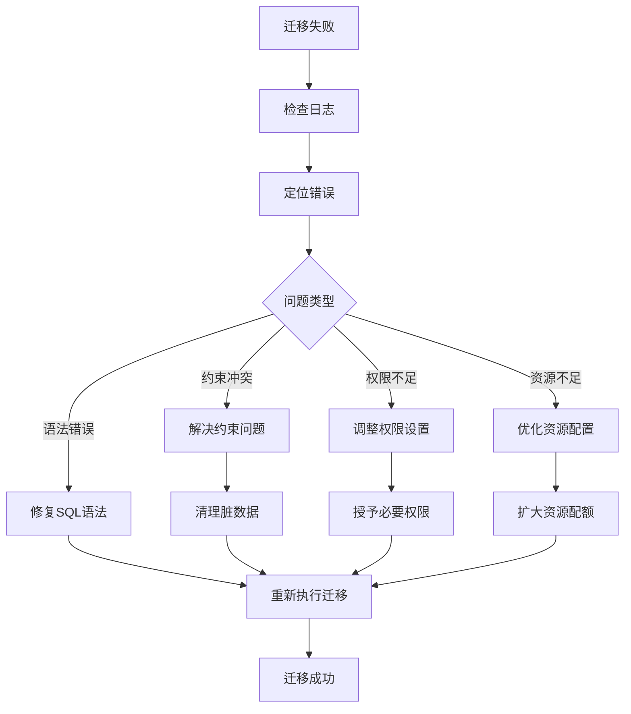

### 回滚策略

1. **自动回滚**：检测到错误时自动回滚到上一个稳定版本
2. **手动回滚**：通过专门的回滚脚本执行
3. **数据恢复**：从备份中恢复到迁移前的状态
4. **服务恢复**：确保应用服务在回滚后的正常运行

### 设备固件版本管理故障排除

**更新** 新增的设备固件版本管理故障排除指南：

- **DSP版本同步失败**：检查DSP固件文件的完整性和版本兼容性
- **BMS版本更新异常**：验证BMS固件的签名和校验和
- **双版本不一致**：检查设备固件版本同步逻辑和数据一致性
- **版本回滚问题**：验证固件回滚脚本的执行和状态恢复

### 设备模型字段分组故障排除

**更新** 设备模型字段分组管理故障排除指南：

- **分组显示异常**：检查group_name字段的配置和前端渲染逻辑
- **控制参数解析失败**：验证control_params JSONB格式和解析规则
- **字段排序问题**：检查sort字段和分组内的排序逻辑
- **权限控制失效**：验证is_control字段和相关权限配置

**章节来源**
- [010_add_dsp_bms_versions.down.sql](file://database/migrations/010_add_dsp_bms_versions.down.sql)
- [backup.sh](file://deploy/scripts/backup.sh)
- [db_maintenance.sh](file://deploy/scripts/db_maintenance.sh)

## 结论

该数据库迁移管理系统通过严格的版本控制、安全的执行策略和完善的监控机制，为复杂的时间序列数据应用提供了可靠的数据库演进框架。系统的核心优势包括：

- **可追溯性**：完整的迁移历史记录和版本控制
- **安全性**：多层次的备份、验证和回滚机制
- **可维护性**：模块化的迁移脚本和清晰的依赖关系
- **可观测性**：完善的日志记录和性能监控

**更新** 最新的设备固件版本管理和设备模型字段分组功能进一步增强了系统的可维护性和扩展性。通过引入DSP/BMS双固件版本跟踪和灵活的字段分组控制，系统能够更好地支持复杂的逆变器设备管理和配置需求。

通过遵循本文档的实施指南，团队可以确保数据库变更的安全性和可靠性，支持业务的持续发展和技术创新。

## 附录

### 迁移最佳实践清单

- **编写测试**：为每个迁移编写单元测试和集成测试
- **文档记录**：详细记录每个迁移的目的和影响范围
- **分批执行**：将大型迁移分解为多个小步骤
- **监控告警**：建立迁移过程的实时监控和告警机制
- **演练验证**：在预生产环境中充分验证迁移流程

### 自动化部署流程

```mermaid
sequenceDiagram
participant Dev as 开发者
participant CI as CI/CD
participant Test as 测试环境
participant Prod as 生产环境
Dev->>CI : 推送迁移代码
CI->>Test : 自动部署到测试环境
Test->>Test : 执行自动化测试
Test->>CI : 返回测试结果
CI->>Prod : 部署到生产环境
Prod->>Prod : 执行迁移验证
Prod->>CI : 返回部署状态
CI->>Dev : 通知部署完成
```

### 设备固件版本管理部署流程

**更新** 新增的设备固件版本管理部署流程：

```mermaid
sequenceDiagram
participant Dev as 开发者
participant CI as CI/CD
participant Test as 测试环境
participant Prod as 生产环境
Dev->>CI : 推送固件版本管理代码
CI->>Test : 部署固件版本管理
Test->>Test : 执行版本同步测试
Test->>Test : 验证DSP/BMS版本管理
Test->>CI : 返回测试结果
CI->>Prod : 部署到生产环境
Prod->>Prod : 初始化固件版本管理
Prod->>Prod : 配置版本同步策略
Prod->>Prod : 启动版本监控服务
Prod->>CI : 返回部署状态
CI->>Dev : 通知部署完成
```

### 设备模型字段分组部署流程

**更新** 设备模型字段分组管理部署流程：

```mermaid
sequenceDiagram
participant Dev as 开发者
participant CI as CI/CD
participant Test as 测试环境
participant Prod as 生产环境
Dev->>CI : 推送字段分组管理代码
CI->>Test : 部署字段分组功能
Test->>Test : 测试分组显示逻辑
Test->>Test : 验证控制参数解析
Test->>CI : 返回测试结果
CI->>Prod : 部署到生产环境
Prod->>Prod : 初始化分组配置
Prod->>Prod : 配置字段分组规则
Prod->>Prod : 启动分组管理服务
Prod->>CI : 返回部署状态
CI->>Dev : 通知部署完成
```