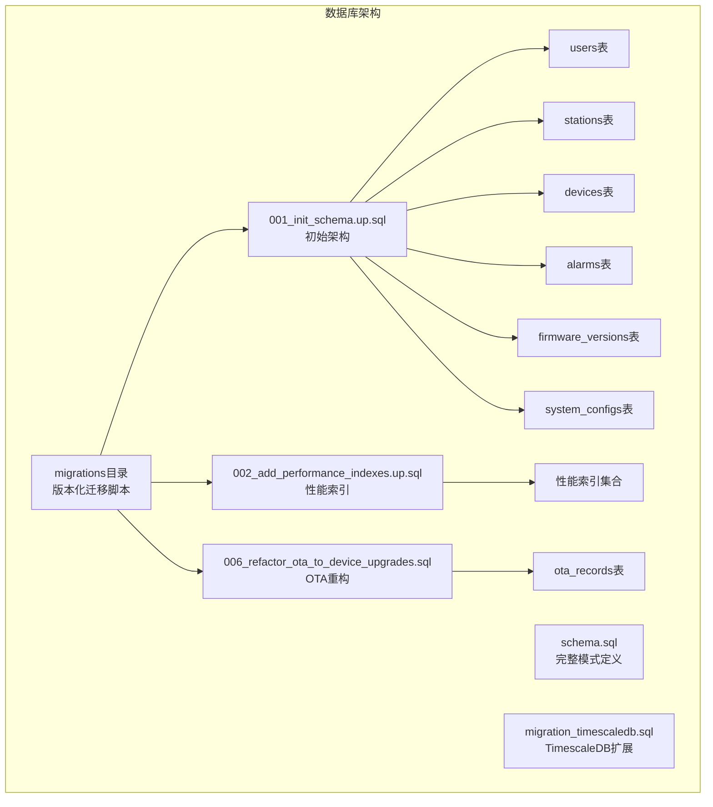
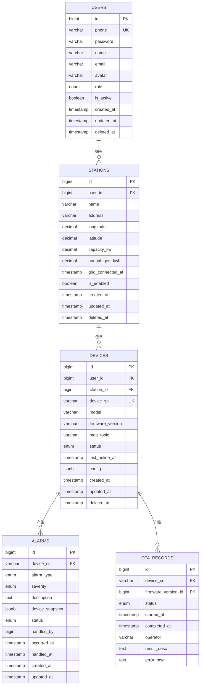
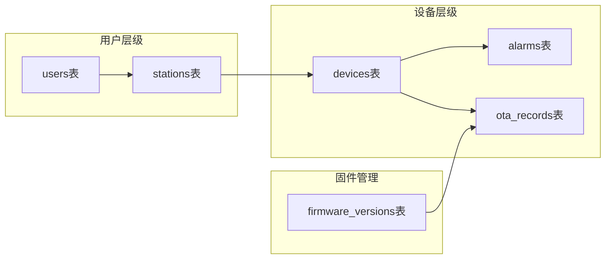
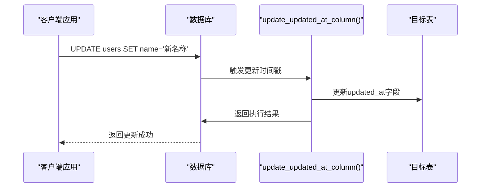
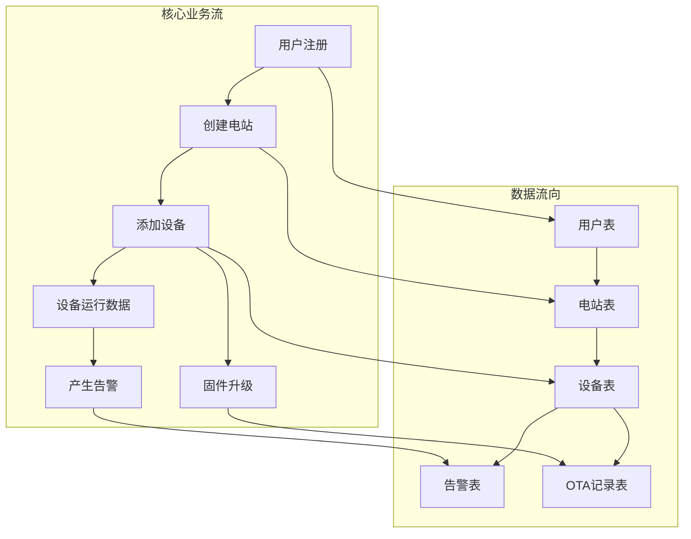

# 核心表结构设计

<cite>
**本文档中引用的文件**
- [001_init_schema.up.sql](file://database/migrations/001_init_schema.up.sql)
- [002_add_performance_indexes.up.sql](file://database/migrations/002_add_performance_indexes.up.sql)
- [006_refactor_ota_to_device_upgrades.sql](file://database/migrations/006_refactor_ota_to_device_upgrades.sql)
- [schema.sql](file://database/schema.sql)
- [migration_timescaledb.sql](file://database/migration_timescaledb.sql)
</cite>

## 目录
1. [简介](#简介)
2. [项目结构](#项目结构)
3. [核心组件](#核心组件)
4. [架构概览](#架构概览)
5. [详细组件分析](#详细组件分析)
6. [依赖分析](#依赖分析)
7. [性能考虑](#性能考虑)
8. [故障排除指南](#故障排除指南)
9. [结论](#结论)

## 简介

本文件针对分布式光伏监控系统的数据库核心表结构进行全面的技术文档化分析。重点涵盖用户表(users)、设备表(devices)、电站表(stations)、告警表(alarms)和OTA升级表(ota_records)等核心业务表的完整结构设计。文档将详细说明每个表的字段定义、数据类型、约束条件和业务含义，解释表之间的外键关系和引用完整性约束，介绍索引设计策略，说明触发器机制，并提供表结构变更的最佳实践和设计原则。

## 项目结构

基于代码库分析，数据库相关的核心文件主要位于`database`目录下，采用迁移脚本的方式管理数据库版本演进：



**图表来源**
- [001_init_schema.up.sql:1-120](file://database/migrations/001_init_schema.up.sql#L1-L120)
- [002_add_performance_indexes.up.sql:1-40](file://database/migrations/002_add_performance_indexes.up.sql#L1-L40)
- [006_refactor_ota_to_device_upgrades.sql:1-80](file://database/migrations/006_refactor_ota_to_device_upgrades.sql#L1-L80)

**章节来源**
- [001_init_schema.up.sql:1-120](file://database/migrations/001_init_schema.up.sql#L1-L120)
- [002_add_performance_indexes.up.sql:1-40](file://database/migrations/002_add_performance_indexes.up.sql#L1-L40)

## 核心组件

### 用户表(users)

用户表是系统的核心实体，负责存储平台用户的完整信息和认证授权数据。

**表结构特征：**
- 主键：自增ID标识符
- 唯一约束：手机号码唯一性保证
- 软删除支持：deleted_at时间戳实现逻辑删除
- 时间追踪：created_at和updated_at自动维护

**核心字段定义：**
- 用户标识：自增整数类型，主键
- 身份信息：手机号码作为用户名，唯一约束
- 认证凭据：密码哈希值存储
- 基本资料：姓名、邮箱、头像URL
- 权限状态：角色类型、启用状态
- 时间戳：创建和更新时间

**业务含义：**
- 支持多租户架构下的用户管理
- 提供RBAC权限控制基础
- 维护用户生命周期管理

### 电站表(stations)

电站表记录分布式光伏电站的基本信息和运行状态。

**表结构特征：**
- 外键关联：user_id关联用户表
- 地理信息：经纬度坐标存储
- 规模参数：装机容量、年发电量估算
- 运行状态：并网状态、启用状态
- 软删除支持：deleted_at实现逻辑删除

**核心字段定义：**
- 电站标识：自增ID，主键
- 关联用户：user_id外键引用用户表
- 基本信息：电站名称、地址、描述
- 地理位置：经度、纬度坐标
- 技术参数：装机容量、海拔高度
- 运行信息：并网日期、状态标志
- 时间追踪：创建和更新时间

**业务含义：**
- 支持多电站管理场景
- 提供地理信息系统集成
- 维护电站全生命周期数据

### 设备表(devices)

设备表管理光伏系统中的各类设备，包括逆变器、环境监测仪等。

**表结构特征：**
- 外键关联：user_id和station_id双重关联
- 设备识别：序列号作为唯一标识
- 在线状态：last_online_at时间戳
- 运行状态：status状态码管理
- 软删除支持：deleted_at逻辑删除

**核心字段定义：**
- 设备标识：自增ID，主键
- 关联关系：user_id、station_id外键
- 设备信息：设备型号、序列号、固件版本
- 通信参数：MQTT主题、连接状态
- 运行状态：在线时间、工作状态
- 配置参数：上报间隔、告警阈值
- 时间追踪：创建和更新时间

**业务含义：**
- 支持大规模设备接入管理
- 提供设备状态实时监控
- 维护设备配置和固件管理

### 告警表(alarms)

告警表记录设备产生的各类告警事件和处理状态。

**表结构特征：**
- 外键关联：device_sn关联设备表
- 时间排序：按创建时间降序排列
- 状态管理：status字段跟踪处理进度
- 性能优化：多字段复合索引

**核心字段定义：**
- 告警标识：自增ID，主键
- 设备关联：device_sn外键引用设备序列号
- 告警信息：告警类型、严重级别、描述
- 设备状态：相关设备参数快照
- 处理状态：状态码、处理人、处理时间
- 时间戳：告警发生时间和处理时间

**业务含义：**
- 提供设备异常检测和通知
- 支持告警流程管理和跟踪
- 维护历史告警数据分析

### OTA升级表(ota_records)

OTA升级表记录设备固件升级的历史和状态信息。

**表结构特征：**
- 外键关联：device_sn关联设备表
- 升级流程：status字段跟踪升级状态
- 版本管理：firmware_version关联固件版本表
- 时间追踪：完整的升级时间线

**核心字段定义：**
- 升级记录：自增ID，主键
- 设备关联：device_sn外键
- 固件版本：firmware_version外键
- 升级状态：状态码、开始时间、完成时间
- 操作信息：操作人、IP地址、UA信息
- 结果记录：结果描述、错误信息

**业务含义：**
- 支持远程固件升级管理
- 提供升级过程可视化监控
- 维护升级历史审计追踪

**章节来源**
- [001_init_schema.up.sql:13-103](file://database/migrations/001_init_schema.up.sql#L13-L103)
- [006_refactor_ota_to_device_upgrades.sql:1-80](file://database/migrations/006_refactor_ota_to_device_upgrades.sql#L1-L80)

## 架构概览

系统采用分层架构设计，核心业务表通过明确的外键关系建立数据关联：



**图表来源**
- [001_init_schema.up.sql:13-103](file://database/migrations/001_init_schema.up.sql#L13-L103)
- [006_refactor_ota_to_device_upgrades.sql:1-80](file://database/migrations/006_refactor_ota_to_device_upgrades.sql#L1-L80)

**章节来源**
- [001_init_schema.up.sql:13-103](file://database/migrations/001_init_schema.up.sql#L13-L103)

## 详细组件分析

### 外键关系分析

系统通过严格的外键约束确保数据引用完整性：



**图表来源**
- [001_init_schema.up.sql:13-103](file://database/migrations/001_init_schema.up.sql#L13-L103)
- [006_refactor_ota_to_device_upgrades.sql:1-80](file://database/migrations/006_refactor_ota_to_device_upgrades.sql#L1-L80)

### 索引设计策略

系统采用多层次索引策略优化查询性能：

**主键索引：**
- 所有表的自增ID字段自动创建主键索引
- 提供O(log n)级别的查询性能

**唯一索引：**
- users.phone：确保用户手机号唯一性
- devices.device_sn：确保设备序列号唯一性

**复合索引：**
- devices(user_id, station_id, deleted_at)：优化设备查询
- devices(status, last_online_at DESC)：支持设备状态统计
- alarms(device_sn, created_at DESC)：优化告警查询
- alarms(status, created_at DESC)：支持告警状态过滤
- stations(user_id, deleted_at)：优化电站查询
- users(phone)：支持用户登录查询（带条件）

**章节来源**
- [002_add_performance_indexes.up.sql:1-40](file://database/migrations/002_add_performance_indexes.up.sql#L1-L40)

### 触发器机制

系统采用触发器自动维护时间戳字段：



**图表来源**
- [001_init_schema.up.sql:1-120](file://database/migrations/001_init_schema.up.sql#L1-L120)

**章节来源**
- [001_init_schema.up.sql:1-120](file://database/migrations/001_init_schema.up.sql#L1-L120)

## 依赖分析

### 数据依赖关系



**图表来源**
- [001_init_schema.up.sql:13-103](file://database/migrations/001_init_schema.up.sql#L13-L103)
- [006_refactor_ota_to_device_upgrades.sql:1-80](file://database/migrations/006_refactor_ota_to_device_upgrades.sql#L1-L80)

### 外部依赖

系统依赖以下外部组件：
- TimescaleDB扩展：用于时序数据压缩和管理
- PostgreSQL JSONB类型：支持灵活的数据存储
- MQTT协议：设备通信和数据传输

**章节来源**
- [migration_timescaledb.sql:1-200](file://database/migration_timescaledb.sql#L1-L200)

## 性能考虑

### 查询优化策略

1. **索引选择性优化**
   - 高选择性字段优先建立索引
   - 复合索引遵循最左前缀原则
   - 定期分析查询计划调整索引策略

2. **分区策略**
   - 基于时间维度的表分区
   - TimescaleDB压缩策略减少存储空间
   - 历史数据归档降低查询负载

3. **缓存策略**
   - 频繁访问的配置信息缓存
   - 设备状态数据短期缓存
   - 用户权限信息本地缓存

### 存储优化

1. **数据类型优化**
   - 使用合适精度的数值类型
   - JSONB存储半结构化数据
   - 时间戳使用UTC统一存储

2. **压缩策略**
   - TimescaleDB自动压缩历史数据
   - 合理设置压缩间隔和阈值
   - 分区裁剪提高查询效率

## 故障排除指南

### 常见问题诊断

**索引失效排查：**
- 检查WHERE子句中的字段是否在索引中
- 避免在索引字段上使用函数转换
- 确保LIKE操作使用前缀匹配模式

**外键约束冲突：**
- 检查被引用记录是否存在
- 验证软删除记录的处理逻辑
- 确认级联删除规则设置

**性能问题定位：**
- 使用EXPLAIN ANALYZE分析查询计划
- 监控慢查询日志
- 检查索引使用情况

### 数据一致性检查

1. **参照完整性验证**
   ```sql
   -- 检查无效的外键引用
   SELECT * FROM devices WHERE user_id NOT IN (SELECT id FROM users);
   SELECT * FROM alarms WHERE device_sn NOT IN (SELECT device_sn FROM devices);
   ```

2. **数据质量监控**
   - 定期检查重复数据
   - 监控空值约束违反
   - 验证数据类型一致性

**章节来源**
- [001_init_schema.up.sql:1-120](file://database/migrations/001_init_schema.up.sql#L1-L120)

## 结论

本数据库设计方案通过合理的表结构设计、严格的外键约束和优化的索引策略，为分布式光伏监控系统提供了可靠的数据基础设施。核心表结构体现了以下设计优势：

1. **清晰的业务模型**：每个表都有明确的业务职责和边界
2. **强一致性的数据管理**：通过外键约束和触发器确保数据完整性
3. **高性能的查询支持**：多层次索引策略满足不同查询场景需求
4. **可扩展的架构设计**：支持大规模设备接入和数据增长

建议在实际部署中重点关注索引维护、数据备份和性能监控，确保系统长期稳定运行。同时，随着业务发展定期评估和优化表结构，保持数据库设计与业务需求的同步演进。