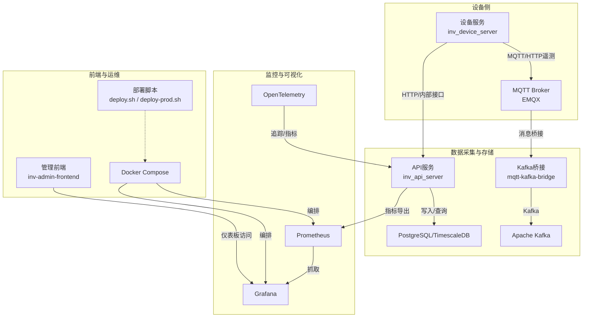
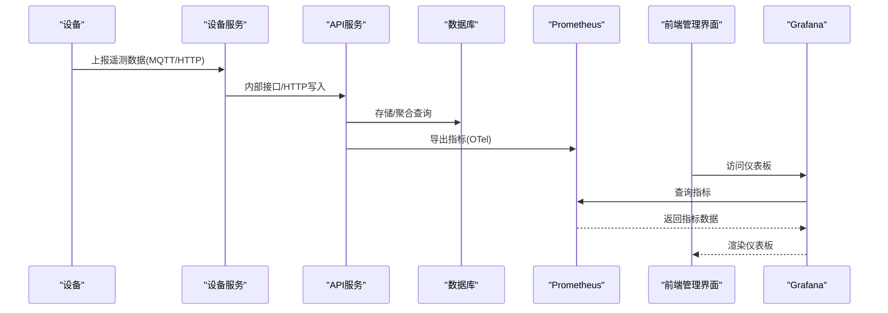
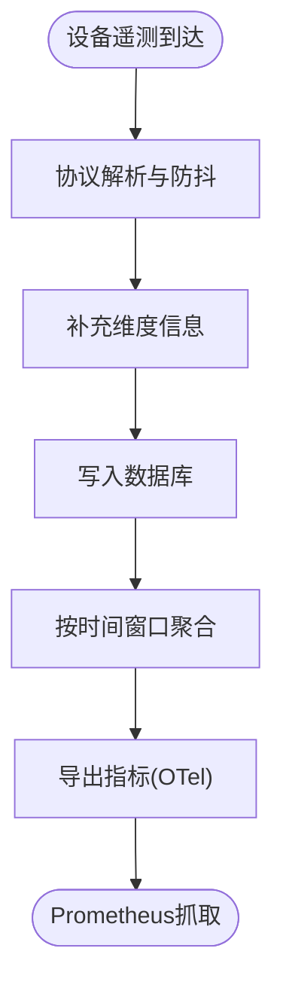
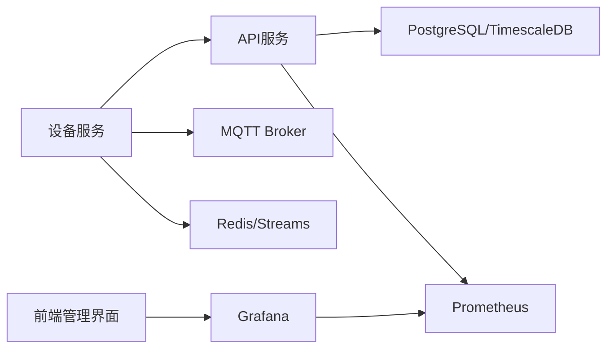

# Grafana仪表板

<cite>
**本文引用的文件**
- [README.md](file://README.md)
- [grafana-dashboard.json](file://deploy/grafana-dashboard.json)
- [prometheus.yml](file://deploy/prometheus.yml)
- [prometheus_alerts.yml](file://deploy/prometheus_alerts.yml)
- [docker-compose.yml](file://deploy/docker-compose.yml)
- [deploy.sh](file://deploy/deploy.sh)
- [deploy-prod.sh](file://deploy/deploy-prod.sh)
- [inv_device_server/main.go](file://inv_device_server/cmd/main.go)
- [inv_device_server/service/protocol_parser.go](file://inv_device_server/internal/service/protocol_parser.go)
- [inv_api_server/main.go](file://inv_api_server/cmd/main.go)
- [inv_api_server/handler/dashboard_handler.go](file://inv_api_server/internal/handler/dashboard_handler.go)
- [inv_api_server/repository/repositories.go](file://inv_api_server/internal/repository/repositories.go)
- [inv_api_server/pkg/telemetry/telemetry.go](file://inv_api_server/pkg/telemetry/telemetry.go)
- [inv-admin-frontend/pages/portal/DeviceMonitorPage.tsx](file://inv-admin-frontend/src/pages/portal/DeviceMonitorPage.tsx)
- [inv-admin-frontend/pages/parallel/index.tsx](file://inv-admin-frontend/src/pages/parallel/index.tsx)
- [inv-admin-frontend/components/dyna/DynamicStatCards.tsx](file://inv-admin-frontend/src/components/dyna/DynamicStatCards.tsx)
- [inv-admin-frontend/components/dyna/DynamicFieldRenderer.tsx](file://inv-admin-frontend/src/components/dyna/DynamicFieldRenderer.tsx)
- [inv-admin-frontend/pages/alerts/index.tsx](file://inv-admin-frontend/src/pages/alerts/index.tsx)
- [inv-admin-frontend/pages/operation-logs/index.tsx](file://inv-admin-frontend/src/pages/operation-logs/index.tsx)
- [tools/stress_test/main.go](file://tools/stress_test/main.go)
</cite>

## 目录
1. [简介](#简介)
2. [项目结构](#项目结构)
3. [核心组件](#核心组件)
4. [架构总览](#架构总览)
5. [详细组件分析](#详细组件分析)
6. [依赖关系分析](#依赖关系分析)
7. [性能考虑](#性能考虑)
8. [故障排查指南](#故障排查指南)
9. [结论](#结论)
10. [附录](#附录)

## 简介
本技术文档面向Grafana仪表板系统的使用者与维护者，围绕监控可视化的设计与实现进行系统性说明。文档覆盖以下方面：
- 仪表板结构与布局设计：实时监控面板、历史趋势图表、设备状态展示
- 数据源配置：Prometheus数据源连接、查询语句编写与数据映射
- 图表类型使用：时间序列图、状态指示器、热力图、表格视图
- 仪表板模板变量：设备筛选、时间范围选择、维度切换
- 仪表板JSON配置解析与定制
- 仪表板共享、权限管理与批量部署
- 管理员安装、配置与维护操作手册

本项目采用容器化编排与可观测性栈（Prometheus、Grafana、OpenTelemetry），通过MQTT/HTTP采集设备遥测数据，并以数据库与Kafka桥接实现数据汇聚与查询。

## 项目结构
项目采用多模块分层组织，包含设备侧服务、API网关、前端管理界面、数据库与部署脚本等。与Grafana仪表板直接相关的部分主要集中在部署配置与数据采集链路中。

**图表来源**
- [docker-compose.yml](file://deploy/docker-compose.yml)
- [prometheus.yml](file://deploy/prometheus.yml)
- [inv_device_server/main.go](file://inv_device_server/cmd/main.go)
- [inv_api_server/main.go](file://inv_api_server/cmd/main.go)

**章节来源**
- [README.md:33-110](file://README.md#L33-L110)
- [docker-compose.yml](file://deploy/docker-compose.yml)
- [prometheus.yml](file://deploy/prometheus.yml)

## 核心组件
- Prometheus：负责从API服务抓取指标，作为Grafana的数据源
- Grafana：提供仪表板可视化，支持模板变量、查询与面板组合
- OpenTelemetry：为API服务提供分布式追踪与指标导出能力
- 设备服务与API服务：负责设备遥测数据的接收、清洗、聚合与查询
- 前端管理界面：提供设备监控、告警与日志等可视化入口

**章节来源**
- [prometheus.yml](file://deploy/prometheus.yml)
- [inv_api_server/pkg/telemetry/telemetry.go:1-99](file://inv_api_server/pkg/telemetry/telemetry.go#L1-L99)
- [inv_device_server/main.go](file://inv_device_server/cmd/main.go)
- [inv_api_server/main.go](file://inv_api_server/cmd/main.go)

## 架构总览
下图展示了从设备遥测到Grafana可视化的完整链路，以及Prometheus与Grafana的交互方式。

**图表来源**
- [inv_device_server/service/protocol_parser.go:447-484](file://inv_device_server/internal/service/protocol_parser.go#L447-L484)
- [inv_api_server/pkg/telemetry/telemetry.go:22-60](file://inv_api_server/pkg/telemetry/telemetry.go#L22-L60)
- [prometheus.yml](file://deploy/prometheus.yml)
- [docker-compose.yml](file://deploy/docker-compose.yml)

## 详细组件分析

### 仪表板JSON配置与定制
- 仪表板JSON文件位于部署目录，包含面板、查询、模板变量等定义
- 定制建议：
  - 修改数据源名称与URL，确保与Prometheus实例一致
  - 调整模板变量选项，使其与设备SN或站点ID等维度匹配
  - 更新查询语句中的标签过滤条件，确保与数据库字段一致
  - 为不同图表类型设置合适的颜色、阈值与单位
  - 在面板标题与描述中加入中文说明，提升可读性

**章节来源**
- [grafana-dashboard.json](file://deploy/grafana-dashboard.json)

### Prometheus数据源配置与查询
- Prometheus配置文件定义了抓取目标与指标导出路由
- API服务通过OpenTelemetry导出指标，供Prometheus抓取
- 建议：
  - 在Prometheus中为API服务配置正确的抓取间隔与超时
  - 使用标签对设备SN、站点ID、主题(topic)等进行规范化
  - 在Grafana中编写PromQL查询时，优先使用标签过滤与聚合函数

**章节来源**
- [prometheus.yml](file://deploy/prometheus.yml)
- [inv_api_server/pkg/telemetry/telemetry.go:22-60](file://inv_api_server/pkg/telemetry/telemetry.go#L22-L60)

### 图表类型与面板设计
- 时间序列图：用于展示设备功率、电量、温度等随时间变化的趋势
- 状态指示器：用于显示设备在线/离线、告警等级等状态
- 热力图：用于展示站点或设备在时间维度上的聚合指标
- 表格视图：用于展示设备列表、告警明细与日志条目

前端组件示例：
- 实时监控面板：设备监控页集成动态卡片与图表，周期刷新遥测数据
- 并联组态拓扑与功率分布：并联页面使用ECharts渲染拓扑与功率分布
- 告警与操作日志：告警页与运营日志页提供筛选、分页与导出功能

**章节来源**
- [inv-admin-frontend/pages/portal/DeviceMonitorPage.tsx:61-281](file://inv-admin-frontend/src/pages/portal/DeviceMonitorPage.tsx#L61-L281)
- [inv-admin-frontend/pages/parallel/index.tsx:806-893](file://inv-admin-frontend/src/pages/parallel/index.tsx#L806-L893)
- [inv-admin-frontend/pages/alerts/index.tsx](file://inv-admin-frontend/src/pages/alerts/index.tsx)
- [inv-admin-frontend/pages/operation-logs/index.tsx:638-677](file://inv-admin-frontend/src/pages/operation-logs/index.tsx#L638-L677)

### 模板变量配置与使用
- 设备筛选：通过模板变量绑定设备SN列表，实现按设备维度筛选
- 时间范围：使用时间选择器模板变量，统一控制面板的时间窗口
- 维度切换：通过模板变量切换站点ID、主题(topic)等维度，动态更新查询

**章节来源**
- [grafana-dashboard.json](file://deploy/grafana-dashboard.json)

### 数据采集与聚合
- 设备服务接收设备遥测数据，进行解析与防抖处理
- API服务提供设备状态、遥测与聚合查询接口
- 数据库采用PostgreSQL/TimescaleDB，支持时间序列压缩与连续聚合

**图表来源**
- [inv_device_server/service/protocol_parser.go:447-484](file://inv_device_server/internal/service/protocol_parser.go#L447-L484)
- [inv_api_server/repository/repositories.go:1968-2020](file://inv_api_server/internal/repository/repositories.go#L1968-L2020)

**章节来源**
- [inv_device_server/service/protocol_parser.go:447-484](file://inv_device_server/internal/service/protocol_parser.go#L447-L484)
- [inv_api_server/repository/repositories.go:1968-2020](file://inv_api_server/internal/repository/repositories.go#L1968-L2020)

### 前端监控与图表渲染
- 设备监控页：定时拉取设备列表与实时数据，渲染动态卡片与功率趋势图
- 并联页面：根据拓扑与成员状态，渲染拓扑图、功率分布与环流监测
- 告警与日志：提供筛选、分页与导出，便于问题定位与审计

**章节来源**
- [inv-admin-frontend/pages/portal/DeviceMonitorPage.tsx:61-281](file://inv-admin-frontend/src/pages/portal/DeviceMonitorPage.tsx#L61-L281)
- [inv-admin-frontend/pages/parallel/index.tsx:806-893](file://inv-admin-frontend/src/pages/parallel/index.tsx#L806-L893)
- [inv-admin-frontend/pages/alerts/index.tsx](file://inv-admin-frontend/src/pages/alerts/index.tsx)
- [inv-admin-frontend/pages/operation-logs/index.tsx:638-677](file://inv-admin-frontend/src/pages/operation-logs/index.tsx#L638-L677)

## 依赖关系分析
- 设备服务依赖MQTT Broker与Redis/Streams进行消息处理与状态缓存
- API服务依赖数据库与Kafka桥接，提供REST接口与指标导出
- Prometheus依赖API服务暴露的指标端点
- Grafana依赖Prometheus作为数据源
- 前端管理界面依赖Grafana与API服务

**图表来源**
- [docker-compose.yml](file://deploy/docker-compose.yml)
- [inv_device_server/main.go](file://inv_device_server/cmd/main.go)
- [inv_api_server/main.go](file://inv_api_server/cmd/main.go)

**章节来源**
- [docker-compose.yml](file://deploy/docker-compose.yml)

## 性能考虑
- 指标导出：通过OpenTelemetry批量导出，减少抓取频率波动
- 数据聚合：数据库层面按小时/天聚合，降低Grafana查询压力
- 前端轮询：设备监控页对实时数据采用短周期轮询，历史趋势采用固定窗口，平衡刷新与性能
- 压测工具：提供压力测试脚本，可用于评估系统在高并发下的表现

**章节来源**
- [inv_api_server/pkg/telemetry/telemetry.go:45-60](file://inv_api_server/pkg/telemetry/telemetry.go#L45-L60)
- [inv_api_server/repository/repositories.go:680-763](file://inv_api_server/internal/repository/repositories.go#L680-L763)
- [tools/stress_test/main.go:45-97](file://tools/stress_test/main.go#L45-L97)

## 故障排查指南
- 仪表板无数据
  - 检查Prometheus是否成功抓取API服务指标
  - 确认Grafana数据源URL与凭证正确
  - 校验模板变量是否正确绑定设备SN或站点ID
- 设备状态异常
  - 查看设备服务日志，确认协议解析与防抖逻辑未误判
  - 检查API服务内部接口调用与数据库写入情况
- 前端图表空白
  - 检查前端轮询逻辑与图表配置项
  - 确认网络连通性与跨域配置

**章节来源**
- [prometheus.yml](file://deploy/prometheus.yml)
- [inv_device_server/service/protocol_parser.go:447-484](file://inv_device_server/internal/service/protocol_parser.go#L447-L484)
- [inv-api-server/handler/dashboard_handler.go](file://inv_api_server/internal/handler/dashboard_handler.go)

## 结论
本项目通过容器化与可观测性栈实现了从设备遥测到Grafana可视化的完整闭环。Grafana仪表板结合Prometheus数据源与模板变量，能够灵活地展示实时监控、历史趋势与设备状态；配合前端管理界面，形成统一的运维与监控体验。建议在生产环境中持续优化指标导出策略、完善告警规则与权限管理，并定期进行压测与巡检。

## 附录

### 仪表板共享、权限管理与批量部署
- 权限管理：在Grafana中为不同角色配置数据源访问与仪表板查看权限
- 仪表板共享：通过Grafana内置的共享机制或外部网关进行访问控制
- 批量部署：使用Docker Compose或Kubernetes配置文件统一部署Prometheus与Grafana实例

**章节来源**
- [docker-compose.yml](file://deploy/docker-compose.yml)
- [deploy.sh](file://deploy/deploy.sh)
- [deploy-prod.sh](file://deploy/deploy-prod.sh)

### 管理员操作手册
- 安装与启动
  - 使用提供的部署脚本一键启动所有服务
  - 验证Prometheus抓取状态与Grafana数据源连通性
- 配置与维护
  - 调整Prometheus抓取间隔与超时参数
  - 定期检查数据库索引与压缩策略
  - 通过OpenTelemetry观测API服务性能与错误率
- 告警规则
  - 在Prometheus中配置告警规则，结合Grafana告警面板进行可视化展示

**章节来源**
- [prometheus_alerts.yml](file://deploy/prometheus_alerts.yml)
- [inv_api_server/pkg/telemetry/telemetry.go:62-70](file://inv_api_server/pkg/telemetry/telemetry.go#L62-L70)