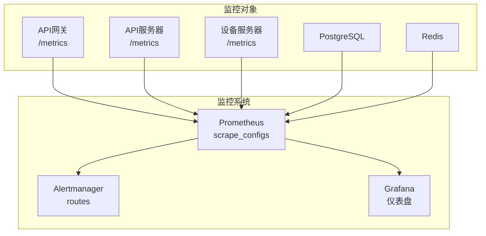
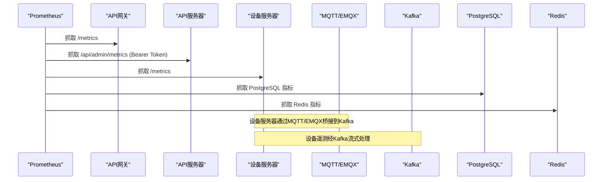
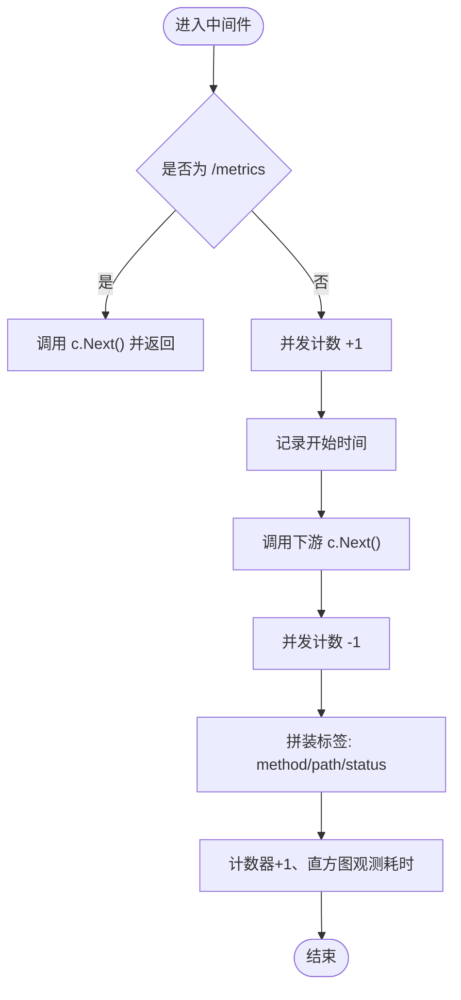
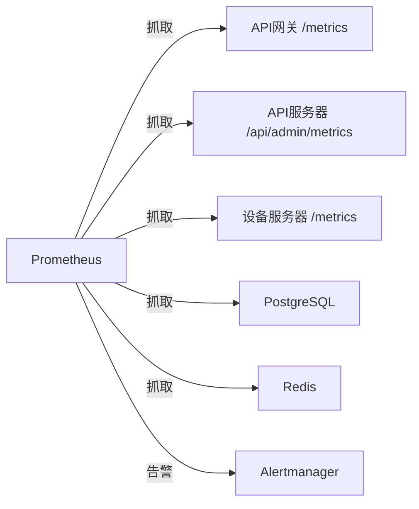

# Prometheus监控

<cite>
**本文引用的文件**
- [prometheus.yml](file://deploy/prometheus.yml)
- [prometheus_alerts.yml](file://deploy/prometheus_alerts.yml)
- [prometheus.go](file://api-gateway/internal/middleware/prometheus.go)
- [main.go](file://api-gateway/main.go)
- [main.go](file://inv_api_server/cmd/main.go)
- [main.go](file://inv_device_server/cmd/main.go)
- [config.go](file://api-gateway/internal/config/config.go)
- [config.go](file://inv_api_server/internal/config/config.go)
- [config.go](file://inv_device_server/internal/config/config.go)
- [docker-compose.yml](file://deploy/docker-compose.yml)
- [gateway.yaml](file://deploy/configs/gateway.yaml)
- [api-server.yaml](file://deploy/configs/api-server.yaml)
- [device-server.yaml](file://deploy/configs/device-server.yaml)
</cite>

## 目录
1. [引言](#引言)
2. [项目结构](#项目结构)
3. [核心组件](#核心组件)
4. [架构总览](#架构总览)
5. [组件详解](#组件详解)
6. [依赖关系分析](#依赖关系分析)
7. [性能考量](#性能考量)
8. [故障排除指南](#故障排除指南)
9. [结论](#结论)
10. [附录](#附录)

## 引言
本文件面向运维与开发人员，系统性阐述该物联网监控系统中Prometheus监控的设计与落地方式。内容涵盖：
- Prometheus在系统中的定位与职责
- 指标采集配置（自定义指标、服务端指标暴露、业务指标采集）
- Prometheus配置文件结构与参数
- 在API网关中集成Prometheus中间件（指标注册、数据收集、导出机制）
- 告警规则编写指南（阈值、条件、通知）
- PromQL使用示例与最佳实践
- 安装、配置与故障排除操作指南

## 项目结构
该仓库采用多服务架构，包含API网关、API服务器、设备服务器、MQTT、Kafka、PostgreSQL、Redis等组件。Prometheus通过静态配置抓取各服务的/metrics端点，结合告警规则实现异常检测与通知。

图表来源
- [prometheus.yml:13-33](file://deploy/prometheus.yml#L13-L33)
- [prometheus_alerts.yml:6-78](file://deploy/prometheus_alerts.yml#L6-L78)

章节来源
- [prometheus.yml:1-33](file://deploy/prometheus.yml#L1-L33)
- [docker-compose.yml:228-244](file://deploy/docker-compose.yml#L228-L244)

## 核心组件
- Prometheus配置文件：定义全局抓取与评估周期、告警路由、抓取目标（网关、设备服务器、数据库、缓存）。
- API网关中间件：初始化并注册Prometheus指标，统计请求总量、延迟直方图、并发请求数。
- 设备服务器：内置/metrics端点，输出MQTT在线客户端数、命令发送计数等业务指标。
- API服务器：提供/admin/metrics供外部抓取（需Bearer Token），用于统一暴露内部指标。
- 告警规则：基于PromQL表达式，覆盖MQTT丢包、实例宕机、数据库连接数、Redis内存、连接数变化、Stream积压等场景。

章节来源
- [prometheus.go:17-40](file://api-gateway/internal/middleware/prometheus.go#L17-L40)
- [prometheus.go:42-66](file://api-gateway/internal/middleware/prometheus.go#L42-L66)
- [main.go:267-278](file://inv_device_server/cmd/main.go#L267-L278)
- [prometheus.yml:14-32](file://deploy/prometheus.yml#L14-L32)
- [prometheus_alerts.yml:7-78](file://deploy/prometheus_alerts.yml#L7-L78)

## 架构总览
下图展示Prometheus在系统中的抓取链路与告警流转：

图表来源
- [prometheus.yml:14-32](file://deploy/prometheus.yml#L14-L32)
- [main.go:267-278](file://inv_device_server/cmd/main.go#L267-L278)
- [docker-compose.yml:96-119](file://deploy/docker-compose.yml#L96-L119)

## 组件详解

### Prometheus配置与抓取目标
- 全局参数
  - 抓取间隔：15s
  - 评估间隔：15s
- 抓取目标
  - API网关：job名为“inv-admin-backend”，metrics_path为“/api/admin/metrics”，使用Bearer Token进行鉴权。
  - 设备服务器：job名为“inv-device-server”，targets为多个实例。
  - PostgreSQL：job名为“postgresql”，targets为postgres:5432。
  - Redis：job名为“redis”，targets为redis:6379。
- 告警规则
  - rule_files指向部署目录下的告警规则文件。

章节来源
- [prometheus.yml:1-33](file://deploy/prometheus.yml#L1-L33)
- [prometheus.yml:10-11](file://deploy/prometheus.yml#L10-L11)

### API网关Prometheus中间件
- 指标定义
  - api_gateway_requests_total：按方法、路径、状态码计数的计数器
  - api_gateway_request_duration_seconds：按方法、路径、状态码的延迟直方图
  - api_gateway_requests_in_flight：当前并发请求数
- 中间件逻辑
  - 对“/metrics”路径放行，避免递归统计自身导出端点
  - 进入下游前自增并发计数，返回后记录状态码、方法、路径并观测耗时
  - 使用标准库注册器注册指标

图表来源
- [prometheus.go:42-66](file://api-gateway/internal/middleware/prometheus.go#L42-L66)

章节来源
- [prometheus.go:17-40](file://api-gateway/internal/middleware/prometheus.go#L17-L40)
- [prometheus.go:42-66](file://api-gateway/internal/middleware/prometheus.go#L42-L66)
- [main.go:34](file://api-gateway/main.go#L34)

### 设备服务器/metrics端点
- 提供两个业务指标：
  - inv_device_mqtt_online_clients：在线MQTT设备客户端数量
  - inv_device_mqtt_cmd_sent：发送的MQTT命令总数
- 输出格式遵循Prometheus文本协议，类型为gauge与counter

章节来源
- [main.go:267-278](file://inv_device_server/cmd/main.go#L267-L278)

### API服务器/admin/metrics端点
- 提供/admin/metrics用于集中暴露内部指标
- 抓取时需携带Bearer Token（来自环境变量）

章节来源
- [prometheus.yml:15](file://deploy/prometheus.yml#L15)
- [main.go](file://inv_api_server/cmd/main.go#L533)

### 告警规则编写指南
- 规则分组与命名
  - 分组名称：如inv-mqtt-alerts
  - 告警项：MQTTDataDropped、InvDeviceServerDown、PgConnectionHigh、RedisMemoryHigh、EMQXConnectionDrop、StreamPendingHigh、StreamConsumerLag
- 表达式与触发条件
  - MQTT消息丢弃：基于设备服务器丢弃计数指标
  - 实例宕机：基于up指标
  - 数据库连接数：基于pg_stat_database_numbackends
  - Redis内存使用率：基于redis_memory_used_bytes与redis_memory_max_bytes
  - EMQX连接数变化：基于rate计算
  - Stream积压：基于待消费消息数
- 标签与注解
  - severity：warning/critical
  - summary与description：用于通知模板渲染

章节来源
- [prometheus_alerts.yml:7-78](file://deploy/prometheus_alerts.yml#L7-L78)

### PromQL使用示例与最佳实践
- 常用函数
  - rate(): 计算瞬时速率，适合衡量事件发生频率
  - histogram_quantile(): 从直方图近似分位数
  - irate(): 更敏感的瞬时速率（短窗口）
- 最佳实践
  - 使用聚合函数（sum, avg, by, without）降低噪声
  - 结合label过滤与正则匹配（如$labels.job）
  - 利用offset进行时间对齐与对比
  - 为高基数指标设置合理分桶与采样策略

[本节为通用指导，不直接分析具体文件]

## 依赖关系分析
- 组件耦合
  - API网关中间件与Gin框架强耦合，通过中间件链路注入指标统计
  - 设备服务器与MQTT/EMQX桥接Kafka，指标来源于运行时统计
  - Prometheus与各服务通过静态配置建立抓取关系
- 外部依赖
  - PostgreSQL与Redis均提供官方exporter指标，便于统一抓取
  - Alertmanager负责接收告警并进行去重、分组与路由

图表来源
- [prometheus.yml:14-32](file://deploy/prometheus.yml#L14-L32)

章节来源
- [prometheus.yml:14-32](file://deploy/prometheus.yml#L14-L32)

## 性能考量
- 抓取频率与资源平衡
  - 当前15s抓取间隔适中；对于高流量网关建议适度拉长评估间隔以降低负载
- 指标基数控制
  - API网关直方图按method/path/status划分，注意路径参数导致的高基数；可考虑对动态路径做归一化
- 存储与保留
  - Prometheus默认存储于容器卷，生产环境建议持久化与容量规划
- 延迟与直方图分桶
  - 网关延迟直方图分桶已针对常见范围优化，可根据实际P95/P99需求调整

[本节提供通用建议，不直接分析具体文件]

## 故障排除指南
- Prometheus无法抓取
  - 检查目标服务可达性与端口开放
  - 确认Bearer Token正确配置（API服务器/admin/metrics）
  - 查看Prometheus日志与target状态
- 指标缺失
  - 确认中间件已初始化并注册指标（API网关）
  - 确认/metrics端点未被限流或CORS拦截
- 告警不触发
  - 检查规则表达式与标签匹配
  - 确认Alertmanager路由配置正确
- 性能问题
  - 降低抓取频率或减少高基数指标
  - 对直方图分桶进行收敛

章节来源
- [prometheus.yml:15](file://deploy/prometheus.yml#L15)
- [prometheus_alerts.yml:7-78](file://deploy/prometheus_alerts.yml#L7-L78)

## 结论
该系统通过明确的抓取目标、完善的业务指标与告警规则，构建了可观测性闭环。API网关中间件与设备服务器/metrics端点分别覆盖了通用层与业务层指标，配合Prometheus与Alertmanager实现自动化监控与告警。建议在生产环境中进一步完善指标治理、存储规划与告警收敛策略。

[本节为总结性内容，不直接分析具体文件]

## 附录

### Prometheus配置文件结构与参数
- global
  - scrape_interval：抓取周期
  - evaluation_interval：规则评估周期
- alerting
  - alertmanagers：告警接收端配置
- rule_files
  - 告警规则文件路径
- scrape_configs
  - job_name：抓取任务名
  - metrics_path：指标端点路径
  - bearer_token：Bearer Token（API服务器）
  - static_configs.targets：目标列表

章节来源
- [prometheus.yml:1-33](file://deploy/prometheus.yml#L1-L33)

### API网关配置要点
- 环境变量
  - JWT_SECRET：用于鉴权
  - REDIS_HOST/PORT：RBAC缓存
  - API_SERVER_URL/DEVICE_SERVER_URL：后端服务地址
- 指标暴露
  - 中间件初始化在main中完成
  - /metrics端点由中间件放行

章节来源
- [config.go:57-82](file://api-gateway/internal/config/config.go#L57-L82)
- [main.go:34](file://api-gateway/main.go#L34)

### API服务器配置要点
- 环境变量
  - DB_HOST/PORT/USER/PASSWORD/NAME：数据库连接
  - REDIS_HOST/PORT/PASSWORD：缓存连接
  - JWT_SECRET：令牌密钥
  - DEVICE_SERVER_URL/INTERNAL_KEY/SERVER_URL：后端通信参数
- 指标暴露
  - /admin/metrics：管理员指标端点（需Bearer Token）

章节来源
- [config.go:99-199](file://inv_api_server/internal/config/config.go#L99-L199)
- [main.go](file://inv_api_server/cmd/main.go#L533)

### 设备服务器配置要点
- 环境变量
  - DB_HOST/PORT/USER/PASSWORD/NAME：数据库连接
  - REDIS_HOST/PORT/PASSWORD：缓存连接
  - MQTT_BROKER/PORT/CLIENT_ID/USERNAME/PASSWORD：MQTT连接
  - KAFKA_BROKERS/ENABLED/TELEMETRY_TOPIC/ALARM_TOPIC/CMD_TOPIC：Kafka桥接
  - API_SERVER_URL/INTERNAL_KEY：后端通信参数
- 指标暴露
  - /metrics：业务指标端点

章节来源
- [config.go:82-162](file://inv_device_server/internal/config/config.go#L82-L162)
- [main.go:267-278](file://inv_device_server/cmd/main.go#L267-L278)

### Docker Compose与监控服务
- 当前compose文件中Prometheus与Grafana处于注释状态，便于按需启用
- 如启用，需挂载配置文件与数据卷，并开放端口

章节来源
- [docker-compose.yml:228-244](file://deploy/docker-compose.yml#L228-L244)