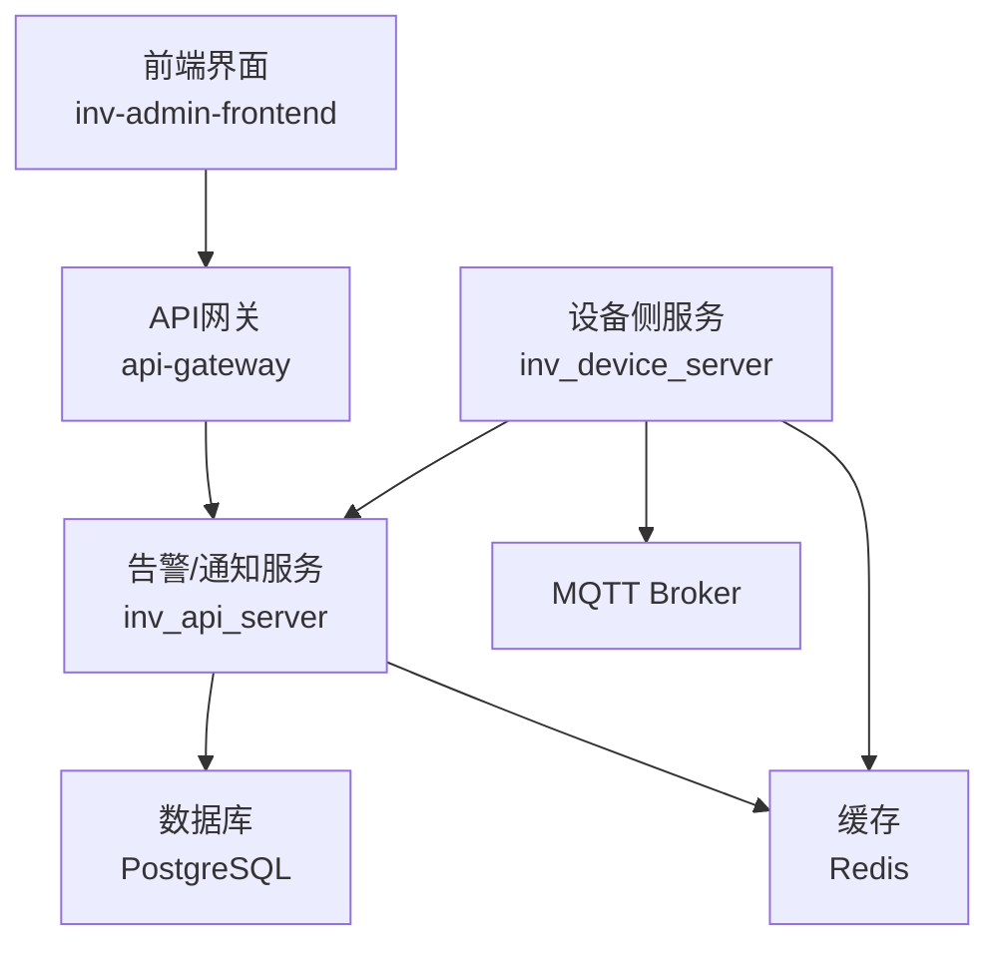
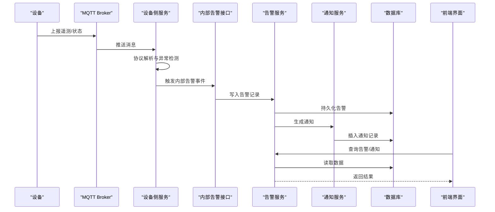
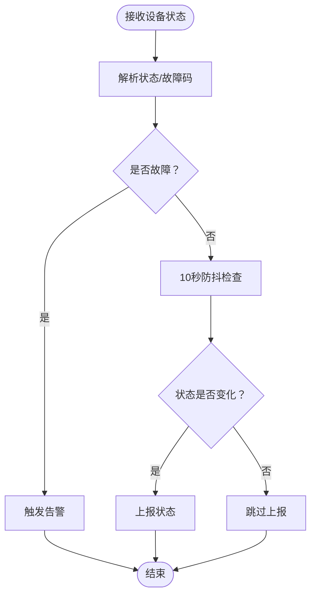
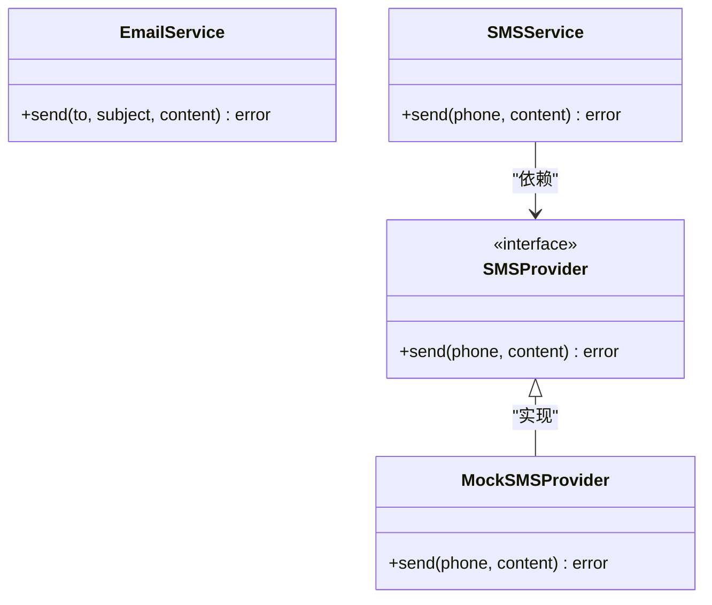
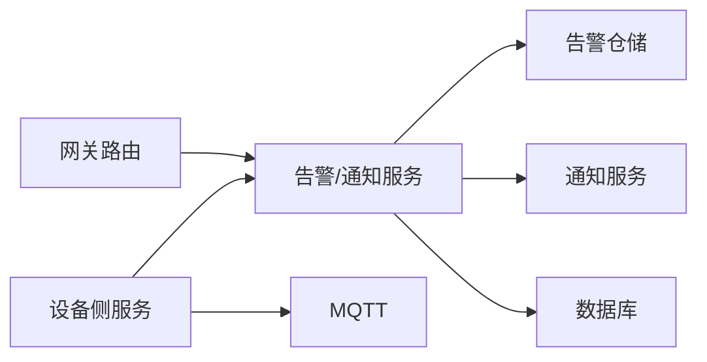

# 告警与通知

<cite>
**本文引用的文件**
- [inv_api_server/cmd/main.go](file://inv_api_server/cmd/main.go)
- [inv_api_server/internal/handler/alarm_handler.go](file://inv_api_server/internal/handler/alarm_handler.go)
- [inv_api_server/internal/handler/notification_handler.go](file://inv_api_server/internal/handler/notification_handler.go)
- [inv_api_server/internal/handler/internal_handler.go](file://inv_api_server/internal/handler/internal_handler.go)
- [inv_api_server/internal/repository/repositories.go](file://inv_api_server/internal/repository/repositories.go)
- [inv_api_server/internal/service/email_service.go](file://inv_api_server/internal/service/email_service.go)
- [inv_api_server/internal/service/sms_provider.go](file://inv_api_server/internal/service/sms_provider.go)
- [inv_device_server/internal/service/protocol_parser.go](file://inv_device_server/internal/service/protocol_parser.go)
- [inv_device_server/internal/mqtt/client.go](file://inv_device_server/internal/mqtt/client.go)
- [inv-admin-frontend/src/pages/portal/AlertsPage.tsx](file://inv-admin-frontend/src/pages/portal/AlertsPage.tsx)
- [inv-admin-frontend/src/pages/operation-logs/index.tsx](file://inv-admin-frontend/src/pages/operation-logs/index.tsx)
- [inv-admin-frontend/src/pages/parallel/index.tsx](file://inv-admin-frontend/src/pages/parallel/index.tsx)
- [api-gateway/internal/routes/routes.go](file://api-gateway/internal/routes/routes.go)
- [deploy/prometheus_alerts.yml](file://deploy/prometheus_alerts.yml)
- [deploy/grafana-dashboard.json](file://deploy/grafana-dashboard.json)
- [database/schema.sql](file://database/schema.sql)
- [database/migrations/001_init_schema.up.sql](file://database/migrations/001_init_schema.up.sql)
- [database/migrations/002_add_performance_indexes.up.sql](file://database/migrations/002_add_performance_indexes.up.sql)
- [database/migrations/003_timescaledb_compression.up.sql](file://database/migrations/003_timescaledb_compression.up.sql)
- [database/migrations/004_add_energy_columns.up.sql](file://database/migrations/004_add_energy_columns.up.sql)
- [database/migrations/005_device_day_data_jsonb.up.sql](file://database/migrations/005_device_day_data_jsonb.up.sql)
</cite>

## 目录
1. [简介](#简介)
2. [项目结构](#项目结构)
3. [核心组件](#核心组件)
4. [架构总览](#架构总览)
5. [详细组件分析](#详细组件分析)
6. [依赖关系分析](#依赖关系分析)
7. [性能考虑](#性能考虑)
8. [故障排除指南](#故障排除指南)
9. [结论](#结论)
10. [附录](#附录)

## 简介
本技术文档面向告警与通知系统，围绕阈值告警、异常检测、复合条件告警、告警级别与分类、通知渠道配置与集成、告警去重与抑制、历史与趋势分析、白名单与静默期、个性化与多语言支持，以及运维调优与故障排除等方面进行系统化说明。文档基于实际代码仓库进行分析，提供架构图、流程图与操作指南，帮助运维团队快速理解与高效维护系统。

## 项目结构
告警与通知系统由前端界面、网关路由、后端服务、设备侧解析与存储层构成，采用分层设计与模块化组织：

- 前端界面：提供告警列表、统计卡片、导出功能与多语言支持
- 网关路由：统一转发告警与通知相关请求到后端服务
- 后端服务：负责告警聚合、规则处理、通知下发、数据库访问与缓存
- 设备侧：负责协议解析、异常检测与状态上报
- 数据库：存储告警记录、通知记录与设备元数据

图表来源
- [api-gateway/internal/routes/routes.go:79-84](file://api-gateway/internal/routes/routes.go#L79-L84)
- [inv_api_server/cmd/main.go:440-484](file://inv_api_server/cmd/main.go#L440-L484)
- [inv_device_server/internal/mqtt/client.go:154-191](file://inv_device_server/internal/mqtt/client.go#L154-L191)

章节来源
- [api-gateway/internal/routes/routes.go:79-84](file://api-gateway/internal/routes/routes.go#L79-L84)
- [inv_api_server/cmd/main.go:440-484](file://inv_api_server/cmd/main.go#L440-L484)
- [inv_device_server/internal/mqtt/client.go:154-191](file://inv_device_server/internal/mqtt/client.go#L154-L191)

## 核心组件
- 告警处理器：提供告警查询、处理、忽略、清空等接口
- 通知处理器：提供通知查询、统计、清空等接口，并内置冷却期去重
- 设备协议解析器：负责从MQTT消息中提取遥测与状态，触发异常检测
- 告警仓储：封装告警数据的增删改查与分页统计
- 通知服务：集成邮件与短信提供商，支持Mock模式
- 前端页面：展示告警列表、统计信息与导出能力

章节来源
- [inv_api_server/internal/handler/alarm_handler.go](file://inv_api_server/internal/handler/alarm_handler.go)
- [inv_api_server/internal/handler/notification_handler.go](file://inv_api_server/internal/handler/notification_handler.go)
- [inv_api_server/internal/handler/internal_handler.go](file://inv_api_server/internal/handler/internal_handler.go)
- [inv_api_server/internal/repository/repositories.go](file://inv_api_server/internal/repository/repositories.go)
- [inv_api_server/internal/service/email_service.go](file://inv_api_server/internal/service/email_service.go)
- [inv_api_server/internal/service/sms_provider.go](file://inv_api_server/internal/service/sms_provider.go)
- [inv_device_server/internal/service/protocol_parser.go](file://inv_device_server/internal/service/protocol_parser.go)
- [inv-admin-frontend/src/pages/portal/AlertsPage.tsx](file://inv-admin-frontend/src/pages/portal/AlertsPage.tsx)
- [inv-admin-frontend/src/pages/operation-logs/index.tsx](file://inv-admin-frontend/src/pages/operation-logs/index.tsx)

## 架构总览
系统通过MQTT接收设备上报，设备侧解析器进行异常检测与状态判定；后端服务接收内部告警事件，写入数据库并触发通知；前端通过网关访问后端接口，展示告警与通知。

图表来源
- [inv_device_server/internal/mqtt/client.go:154-191](file://inv_device_server/internal/mqtt/client.go#L154-L191)
- [inv_device_server/internal/service/protocol_parser.go:528-571](file://inv_device_server/internal/service/protocol_parser.go#L528-L571)
- [inv_api_server/internal/handler/internal_handler.go:497-508](file://inv_api_server/internal/handler/internal_handler.go#L497-L508)
- [inv_api_server/internal/handler/alarm_handler.go](file://inv_api_server/internal/handler/alarm_handler.go)
- [inv_api_server/internal/handler/notification_handler.go](file://inv_api_server/internal/handler/notification_handler.go)

## 详细组件分析

### 告警规则与异常检测
- 异常检测触发点：当设备上报的状态字段或故障码非零时，判定为故障并触发告警
- 防抖策略：对设备状态变更进行10秒防抖，避免频繁上报导致的通知风暴
- 故障覆盖：若设备处于故障状态，不接受“恢复”状态覆盖

图表来源
- [inv_device_server/internal/service/protocol_parser.go:528-571](file://inv_device_server/internal/service/protocol_parser.go#L528-L571)
- [inv_device_server/internal/service/protocol_parser.go:284-308](file://inv_device_server/internal/service/protocol_parser.go#L284-L308)

章节来源
- [inv_device_server/internal/service/protocol_parser.go:284-308](file://inv_device_server/internal/service/protocol_parser.go#L284-L308)
- [inv_device_server/internal/service/protocol_parser.go:528-571](file://inv_device_server/internal/service/protocol_parser.go#L528-L571)

### 告警级别与分类
- 告警级别映射：前端通过映射表显示不同级别的标签颜色与文本
- 级别含义：包含严重级别、影响范围与处理优先级，用于筛选与统计
- 统计维度：总告警数、未处理数、严重告警数等

章节来源
- [inv-admin-frontend/src/pages/portal/AlertsPage.tsx:18-38](file://inv-admin-frontend/src/pages/portal/AlertsPage.tsx#L18-L38)
- [inv-admin-frontend/src/pages/operation-logs/index.tsx:347-397](file://inv-admin-frontend/src/pages/operation-logs/index.tsx#L347-L397)
- [inv-admin-frontend/src/pages/parallel/index.tsx:547-580](file://inv-admin-frontend/src/pages/parallel/index.tsx#L547-L580)

### 通知渠道配置与集成
- 邮件通知：通过邮件服务组件集成SMTP配置
- 短信通知：通过短信提供商组件集成，支持Mock模式降级
- 通知冷却期：针对同一设备与通知类型设置冷却窗口，避免重复通知

图表来源
- [inv_api_server/internal/service/email_service.go](file://inv_api_server/internal/service/email_service.go)
- [inv_api_server/internal/service/sms_provider.go](file://inv_api_server/internal/service/sms_provider.go)

章节来源
- [inv_api_server/internal/service/email_service.go](file://inv_api_server/internal/service/email_service.go)
- [inv_api_server/internal/service/sms_provider.go](file://inv_api_server/internal/service/sms_provider.go)
- [inv_api_server/internal/handler/internal_handler.go:184-197](file://inv_api_server/internal/handler/internal_handler.go#L184-L197)
- [inv_api_server/internal/handler/internal_handler.go:497-508](file://inv_api_server/internal/handler/internal_handler.go#L497-L508)

### 告警去重与抑制机制
- 通知冷却期：按设备与通知类型设置冷却窗口，插入前查询是否存在近期重复
- 状态防抖：对设备状态变更进行短期防抖，避免抖动引发的重复上报
- 故障覆盖保护：故障状态下不被“正常”状态覆盖

章节来源
- [inv_api_server/internal/handler/internal_handler.go:184-197](file://inv_api_server/internal/handler/internal_handler.go#L184-L197)
- [inv_api_server/internal/handler/internal_handler.go:497-508](file://inv_api_server/internal/handler/internal_handler.go#L497-L508)
- [inv_device_server/internal/service/protocol_parser.go:284-308](file://inv_device_server/internal/service/protocol_parser.go#L284-L308)

### 告警历史与趋势分析
- 历史查询：支持按设备、时间、级别、关键字等条件分页查询
- 统计接口：提供告警统计与状态分布
- 导出能力：支持将告警记录导出为CSV

章节来源
- [inv_api_server/internal/handler/alarm_handler.go](file://inv_api_server/internal/handler/alarm_handler.go)
- [inv_api_server/internal/repository/repositories.go:2504-2668](file://inv_api_server/internal/repository/repositories.go#L2504-L2668)
- [inv-admin-frontend/src/pages/operation-logs/index.tsx:333-345](file://inv-admin-frontend/src/pages/operation-logs/index.tsx#L333-L345)

### 白名单与静默期
- 白名单：可通过关键字过滤或设备序列号过滤，仅展示关注设备的告警
- 静默期：通过冷却期与防抖机制实现，减少重复通知
- 前端筛选：支持按级别筛选与定时刷新

章节来源
- [inv-admin-frontend/src/pages/portal/AlertsPage.tsx:18-38](file://inv-admin-frontend/src/pages/portal/AlertsPage.tsx#L18-L38)
- [inv-admin-frontend/src/pages/operation-logs/index.tsx:311-316](file://inv-admin-frontend/src/pages/operation-logs/index.tsx#L311-L316)
- [inv_device_server/internal/service/protocol_parser.go:284-308](file://inv_device_server/internal/service/protocol_parser.go#L284-L308)

### 个性化定制与多语言支持
- 多语言：前端通过国际化资源文件提供多语言支持
- 个性化：支持按用户筛选通知、按设备导出告警、按级别高亮显示

章节来源
- [inv-admin-frontend/src/pages/portal/AlertsPage.tsx:63-67](file://inv-admin-frontend/src/pages/portal/AlertsPage.tsx#L63-L67)
- [inv-admin-frontend/src/pages/operation-logs/index.tsx:333-345](file://inv-admin-frontend/src/pages/operation-logs/index.tsx#L333-L345)

## 依赖关系分析
- 网关路由：将告警与通知相关路径转发至后端服务
- 服务注册：在主程序中注册告警与通知处理器，并注入依赖
- 设备侧：订阅MQTT主题，解析消息并触发内部告警接口

图表来源
- [api-gateway/internal/routes/routes.go:79-84](file://api-gateway/internal/routes/routes.go#L79-L84)
- [inv_api_server/cmd/main.go:440-484](file://inv_api_server/cmd/main.go#L440-L484)
- [inv_device_server/internal/mqtt/client.go:154-191](file://inv_device_server/internal/mqtt/client.go#L154-L191)

章节来源
- [api-gateway/internal/routes/routes.go:79-84](file://api-gateway/internal/routes/routes.go#L79-L84)
- [inv_api_server/cmd/main.go:440-484](file://inv_api_server/cmd/main.go#L440-L484)
- [inv_device_server/internal/mqtt/client.go:154-191](file://inv_device_server/internal/mqtt/client.go#L154-L191)

## 性能考虑
- 查询优化：数据库迁移包含索引与压缩策略，提升历史数据查询性能
- 缓存利用：设备在线状态与防抖键使用Redis，降低重复计算与网络开销
- 分页与统计：告警列表与通知列表均支持分页与统计，减轻前端渲染压力
- 告警风暴防护：冷却期与防抖机制有效抑制高频重复通知

章节来源
- [database/migrations/002_add_performance_indexes.up.sql](file://database/migrations/002_add_performance_indexes.up.sql)
- [database/migrations/003_timescaledb_compression.up.sql](file://database/migrations/003_timescaledb_compression.up.sql)
- [inv_device_server/internal/service/protocol_parser.go:284-308](file://inv_device_server/internal/service/protocol_parser.go#L284-L308)
- [inv_api_server/internal/handler/internal_handler.go:184-197](file://inv_api_server/internal/handler/internal_handler.go#L184-L197)

## 故障排除指南
- 告警未显示：检查设备MQTT连接与订阅状态、协议解析是否成功、内部告警接口是否被正确调用
- 通知风暴：确认冷却期与防抖配置是否生效，检查设备状态上报频率
- 通知失败：验证邮件/短信配置与提供商可用性，必要时启用Mock模式进行隔离测试
- 历史查询异常：核对分页参数与过滤条件，检查数据库索引与查询计划

章节来源
- [inv_device_server/internal/mqtt/client.go:154-191](file://inv_device_server/internal/mqtt/client.go#L154-L191)
- [inv_device_server/internal/service/protocol_parser.go:528-571](file://inv_device_server/internal/service/protocol_parser.go#L528-L571)
- [inv_api_server/internal/handler/internal_handler.go:497-508](file://inv_api_server/internal/handler/internal_handler.go#L497-L508)
- [inv_api_server/internal/repository/repositories.go:2504-2668](file://inv_api_server/internal/repository/repositories.go#L2504-L2668)

## 结论
本告警与通知系统通过设备侧异常检测、后端冷却期与防抖机制、多渠道通知与前端可视化，实现了稳定高效的告警闭环。结合数据库索引与缓存策略，系统具备良好的可扩展性与可维护性。建议在生产环境中持续优化规则阈值、完善白名单与静默期策略，并定期进行通知测试与性能评估。

## 附录
- Prometheus告警配置示例：参考部署目录中的Prometheus告警规则文件
- Grafana仪表盘：参考部署目录中的Grafana仪表盘JSON文件
- 数据库Schema与迁移：参考database目录下的SQL文件

章节来源
- [deploy/prometheus_alerts.yml](file://deploy/prometheus_alerts.yml)
- [deploy/grafana-dashboard.json](file://deploy/grafana-dashboard.json)
- [database/schema.sql](file://database/schema.sql)
- [database/migrations/001_init_schema.up.sql](file://database/migrations/001_init_schema.up.sql)