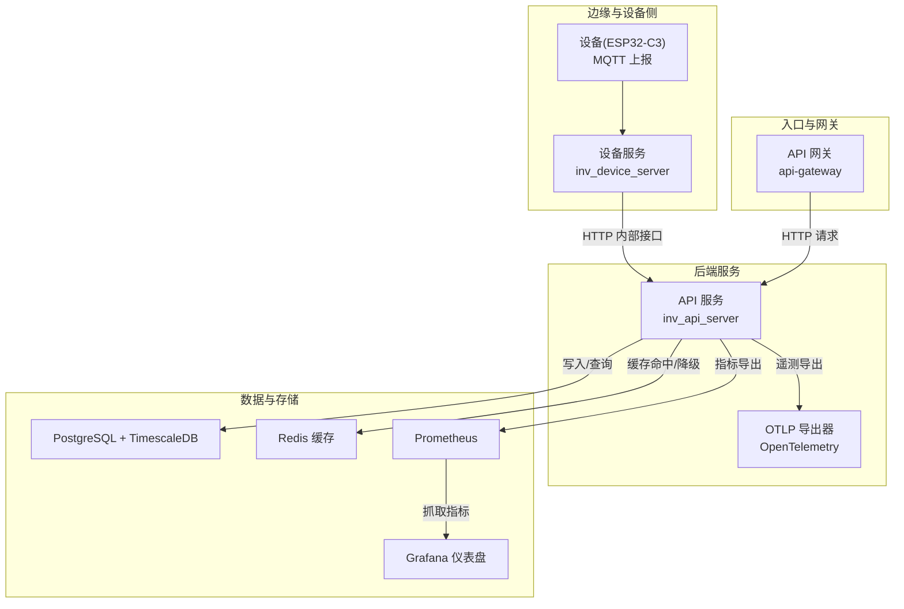
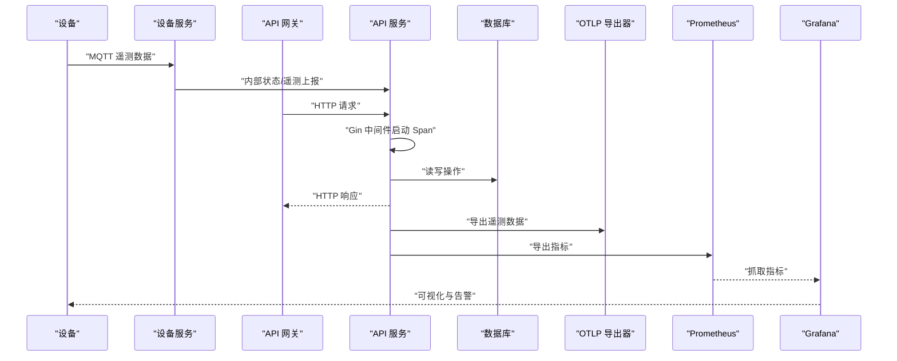
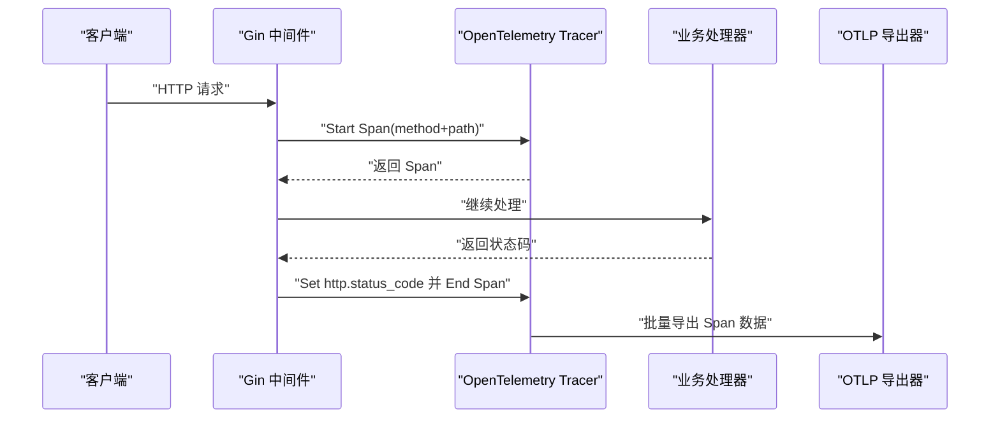
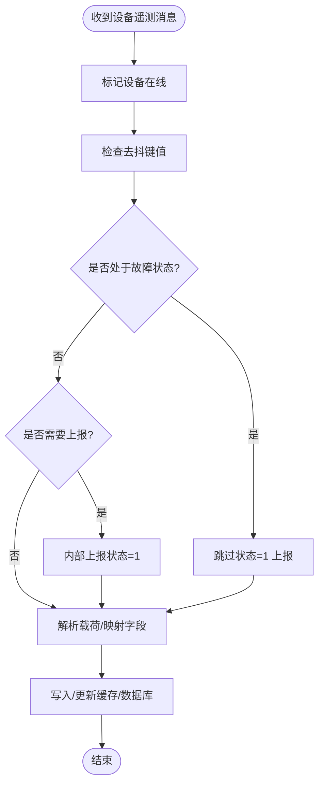
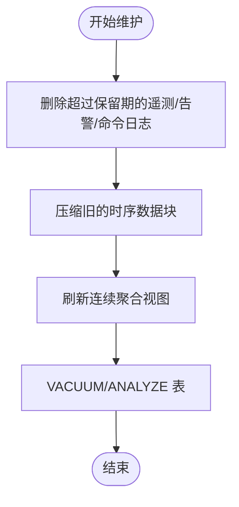
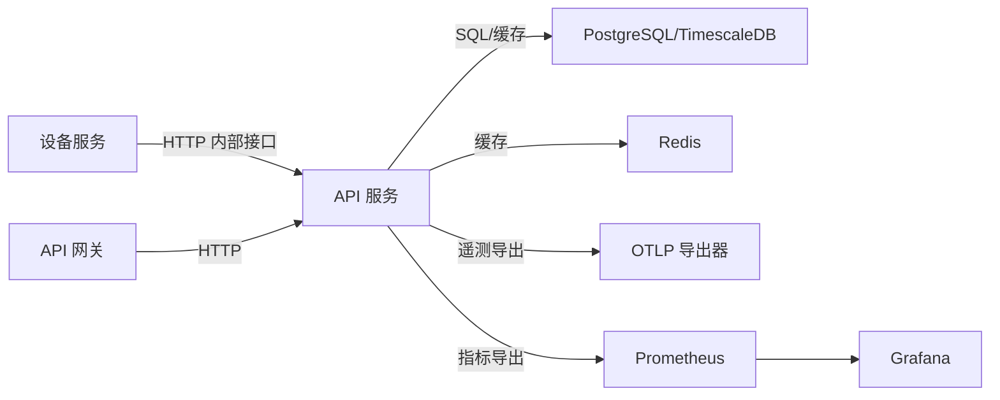

# 性能遥测

<cite>
**本文引用的文件**
- [inv_api_server/pkg/telemetry/telemetry.go](file://inv_api_server/pkg/telemetry/telemetry.go)
- [api-gateway/internal/middleware/prometheus.go](file://api-gateway/internal/middleware/prometheus.go)
- [deploy/prometheus.yml](file://deploy/prometheus.yml)
- [deploy/grafana-dashboard.json](file://deploy/grafana-dashboard.json)
- [deploy/scripts/db_maintenance.sh](file://deploy/scripts/db_maintenance.sh)
- [database/schema.sql](file://database/schema.sql)
- [database/migrations/002_add_performance_indexes.up.sql](file://database/migrations/002_add_performance_indexes.up.sql)
- [database/migrations/003_timescaledb_compression.up.sql](file://database/migrations/003_timescaledb_compression.up.sql)
- [inv_device_server/internal/service/protocol_parser.go](file://inv_device_server/internal/service/protocol_parser.go)
- [inv_api_server/internal/repository/repositories.go](file://inv_api_server/internal/repository/repositories.go)
- [tools/stress_test/main.go](file://tools/stress_test/main.go)
- [README.md](file://README.md)
</cite>

## 目录
1. [引言](#引言)
2. [项目结构](#项目结构)
3. [核心组件](#核心组件)
4. [架构总览](#架构总览)
5. [详细组件分析](#详细组件分析)
6. [依赖分析](#依赖分析)
7. [性能考量](#性能考量)
8. [故障排查指南](#故障排查指南)
9. [结论](#结论)
10. [附录](#附录)

## 引言
本技术文档面向开发与运维团队，系统化阐述本项目的性能遥测体系与集成方案。重点覆盖以下方面：
- 基于 OpenTelemetry 的分布式追踪与遥测采集
- 分布式追踪的实现细节：Span 创建、Trace ID 生成与链路追踪
- 性能指标的定义与采集：响应时间、吞吐量、错误率与服务依赖
- 性能基线与监控：SLA 指标、容量规划与瓶颈识别
- 性能分析工具使用：慢查询分析、资源使用监控与并发压力测试
- 性能数据存储与查询：时序数据库优化与历史趋势分析
- 最佳实践与常见问题解决方案

## 项目结构
本项目采用多服务架构，围绕“设备遥测数据采集—网关—API 服务—数据库—可视化”的链路组织。与性能遥测相关的关键模块如下：
- API 网关：负责请求路由、限流、认证与 Prometheus 指标采集中间件
- API 服务：业务处理、OpenTelemetry 初始化与 Gin 中间件、数据库与缓存交互
- 设备服务：MQTT 消息解析、遥测数据处理与内部状态上报
- 数据层：PostgreSQL + TimescaleDB 扩展、Redis 缓存与索引优化
- 可观测性：Prometheus 指标导出、Grafana 可视化仪表盘
- 运维脚本：TimescaleDB 维护策略（保留、压缩、连续聚合刷新）

图表来源
- [README.md:1-31](file://README.md#L1-L31)
- [deploy/prometheus.yml](file://deploy/prometheus.yml)
- [deploy/grafana-dashboard.json](file://deploy/grafana-dashboard.json)

章节来源
- [README.md:1-31](file://README.md#L1-L31)

## 核心组件
- OpenTelemetry 遥测初始化与 Gin 中间件：在 API 服务中完成 TracerProvider 初始化、上下文传播配置与 HTTP 请求 Span 生命周期管理
- Prometheus 指标中间件：在网关层对请求进行计数、耗时与状态码统计
- 数据层优化：索引、TimescaleDB 压缩与连续聚合、维护脚本
- 可视化与告警：Grafana 仪表盘与 Prometheus 报警规则
- 压力测试工具：独立的 Go 压测程序，便于并发与吞吐验证

章节来源
- [inv_api_server/pkg/telemetry/telemetry.go:1-99](file://inv_api_server/pkg/telemetry/telemetry.go#L1-L99)
- [api-gateway/internal/middleware/prometheus.go](file://api-gateway/internal/middleware/prometheus.go)
- [deploy/prometheus.yml](file://deploy/prometheus.yml)
- [deploy/grafana-dashboard.json](file://deploy/grafana-dashboard.json)
- [deploy/scripts/db_maintenance.sh:1-42](file://deploy/scripts/db_maintenance.sh#L1-L42)
- [database/migrations/002_add_performance_indexes.up.sql](file://database/migrations/002_add_performance_indexes.up.sql)
- [database/migrations/003_timescaledb_compression.up.sql](file://database/migrations/003_timescaledb_compression.up.sql)

## 架构总览
下图展示从设备到可视化与可观测性的完整链路，突出性能遥测的关键节点与数据流。

图表来源
- [README.md:1-31](file://README.md#L1-L31)
- [inv_api_server/pkg/telemetry/telemetry.go:72-92](file://inv_api_server/pkg/telemetry/telemetry.go#L72-L92)
- [deploy/prometheus.yml](file://deploy/prometheus.yml)
- [deploy/grafana-dashboard.json](file://deploy/grafana-dashboard.json)

## 详细组件分析

### OpenTelemetry 分布式追踪
- 初始化流程：设置 OTLP HTTP 导出器、资源属性（服务名）、批处理器、采样策略，并注册 TextMap Propagator
- Gin 中间件：为每个 HTTP 请求创建服务器端 Span，注入 http.method、http.target、http.status_code 等标准属性
- 上下文传播：通过 TraceContext/Baggage 在服务间传递 Trace ID 与上下文
- 关闭流程：优雅关闭 TracerProvider，确保缓冲数据导出

图表来源
- [inv_api_server/pkg/telemetry/telemetry.go:22-60](file://inv_api_server/pkg/telemetry/telemetry.go#L22-L60)
- [inv_api_server/pkg/telemetry/telemetry.go:72-92](file://inv_api_server/pkg/telemetry/telemetry.go#L72-L92)

章节来源
- [inv_api_server/pkg/telemetry/telemetry.go:1-99](file://inv_api_server/pkg/telemetry/telemetry.go#L1-L99)

### Prometheus 指标中间件（网关层）
- 功能：对每个请求进行计数、耗时直方图与状态码分类统计
- 作用：提供高吞吐场景下的轻量级指标采集，辅助 SLA 与容量规划
- 配置：通过 Prometheus 抓取目标暴露指标端点

章节来源
- [api-gateway/internal/middleware/prometheus.go](file://api-gateway/internal/middleware/prometheus.go)
- [deploy/prometheus.yml](file://deploy/prometheus.yml)

### 设备服务遥测处理与内部上报
- 遥测入口：接收设备 MQTT 消息，标记设备在线、去抖与故障状态保护
- 内部上报：当设备从离线恢复在线时，向 API 服务上报状态，避免频繁上报造成压力
- 解析与映射：根据设备模型协议适配器解析主题与载荷，进行字段映射与清洗

图表来源
- [inv_device_server/internal/service/protocol_parser.go:447-529](file://inv_device_server/internal/service/protocol_parser.go#L447-L529)

章节来源
- [inv_device_server/internal/service/protocol_parser.go:447-529](file://inv_device_server/internal/service/protocol_parser.go#L447-L529)

### 数据层性能优化与维护
- 索引优化：为高频查询字段添加索引，降低查询延迟
- TimescaleDB 压缩与连续聚合：对时序数据启用压缩与预聚合，减少存储与查询成本
- 维护脚本：定时清理历史数据、Vacuum/Analyze 以保持查询计划质量

图表来源
- [deploy/scripts/db_maintenance.sh:23-41](file://deploy/scripts/db_maintenance.sh#L23-L41)
- [database/migrations/002_add_performance_indexes.up.sql](file://database/migrations/002_add_performance_indexes.up.sql)
- [database/migrations/003_timescaledb_compression.up.sql](file://database/migrations/003_timescaledb_compression.up.sql)

章节来源
- [deploy/scripts/db_maintenance.sh:1-42](file://deploy/scripts/db_maintenance.sh#L1-L42)
- [database/schema.sql](file://database/schema.sql)
- [database/migrations/002_add_performance_indexes.up.sql](file://database/migrations/002_add_performance_indexes.up.sql)
- [database/migrations/003_timescaledb_compression.up.sql](file://database/migrations/003_timescaledb_compression.up.sql)

### 性能指标定义与采集
- 响应时间：HTTP 请求耗时直方图与 P95/P99；Span 级别的服务端耗时
- 吞吐量：每秒请求数（RPS）、每秒事件数（设备上报速率）
- 错误率：HTTP 5xx 比例、设备离线/故障比率、内部上报失败率
- 服务依赖：跨服务调用链路（设备服务 → API 服务 → 数据库/缓存）

章节来源
- [api-gateway/internal/middleware/prometheus.go](file://api-gateway/internal/middleware/prometheus.go)
- [inv_api_server/pkg/telemetry/telemetry.go:72-92](file://inv_api_server/pkg/telemetry/telemetry.go#L72-L92)

### 性能基线与监控
- SLA 指标：设定 P95 响应时间阈值、RPS 下限、错误率上限
- 容量规划：结合 Prometheus 历史趋势与设备数量增长预测，评估 CPU/内存/网络/数据库容量
- 瓶颈识别：通过链路追踪定位慢 Span、通过指标与仪表盘识别异常峰值

章节来源
- [deploy/grafana-dashboard.json](file://deploy/grafana-dashboard.json)
- [deploy/prometheus.yml](file://deploy/prometheus.yml)

### 性能分析工具使用指南
- 慢查询分析：结合数据库执行计划与 TimescaleDB 连续聚合视图，定位热点表与索引缺失
- 资源使用监控：Prometheus 抓取 CPU/内存/磁盘/网络/数据库连接池指标，Grafana 可视化
- 并发性能测试：使用独立压测工具模拟高并发请求，验证系统在峰值下的稳定性与延迟表现

章节来源
- [tools/stress_test/main.go](file://tools/stress_test/main.go)
- [deploy/prometheus.yml](file://deploy/prometheus.yml)
- [deploy/grafana-dashboard.json](file://deploy/grafana-dashboard.json)

## 依赖分析
- 服务间耦合：设备服务通过内部 HTTP 接口向 API 服务上报状态，降低耦合度
- 外部依赖：OpenTelemetry OTLP 导出器、Prometheus、Grafana、PostgreSQL/TimescaleDB、Redis
- 指标与追踪：网关层提供基础指标，API 层提供细粒度追踪，二者互补

图表来源
- [README.md:1-31](file://README.md#L1-L31)
- [deploy/prometheus.yml](file://deploy/prometheus.yml)
- [deploy/grafana-dashboard.json](file://deploy/grafana-dashboard.json)

## 性能考量
- 采样策略：默认全量采样，生产环境建议根据流量调整采样率以平衡开销与可观测性
- 批处理与背压：合理配置导出器批大小与超时，避免阻塞业务线程
- 索引与分区：为高频过滤字段建立索引，利用 TimescaleDB 时间分区与压缩提升查询效率
- 缓存命中：优先使用 Redis 缓存热点数据，降低数据库压力
- 维护自动化：通过定时脚本清理历史数据与统计表，保持查询性能稳定

## 故障排查指南
- 追踪未生效：确认 OTLP 导出端点、TracerProvider 是否正确初始化与关闭
- 指标缺失：检查 Prometheus 抓取配置与端点可达性
- 查询缓慢：审查执行计划、索引使用情况与连续聚合视图是否及时刷新
- 设备上报异常：核查设备服务内部上报逻辑、去抖与故障保护策略

章节来源
- [inv_api_server/pkg/telemetry/telemetry.go:22-60](file://inv_api_server/pkg/telemetry/telemetry.go#L22-L60)
- [deploy/scripts/db_maintenance.sh:23-41](file://deploy/scripts/db_maintenance.sh#L23-L41)

## 结论
本项目通过 OpenTelemetry 实现了端到端的分布式追踪，结合 Prometheus 指标与 Grafana 可视化，形成了完整的性能遥测闭环。配合 TimescaleDB 时序优化与自动化维护脚本，能够在高并发与海量设备接入场景下保持稳定的性能表现。建议在生产环境中持续完善采样策略、容量规划与告警阈值，以实现更精准的性能治理与故障快速定位。

## 附录
- 可视化仪表盘：参考 Grafana 仪表盘配置，统一展示关键性能指标与趋势
- 报警规则：结合 Prometheus 报警规则，对延迟、错误率、资源使用等进行告警
- 压测工具：使用独立压测程序进行并发与吞吐验证，形成性能基线

章节来源
- [deploy/grafana-dashboard.json](file://deploy/grafana-dashboard.json)
- [deploy/prometheus.yml](file://deploy/prometheus.yml)
- [tools/stress_test/main.go](file://tools/stress_test/main.go)