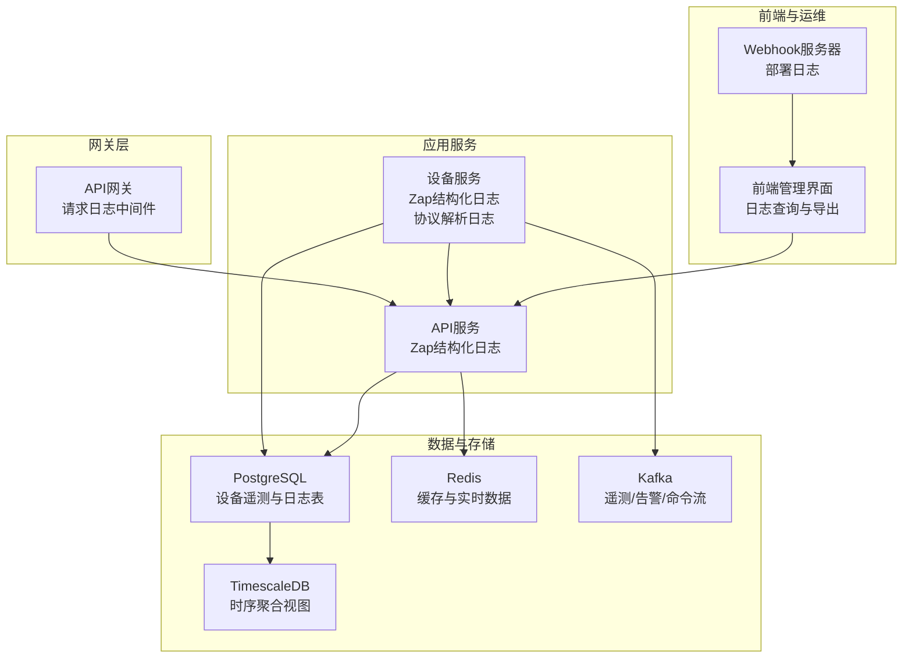
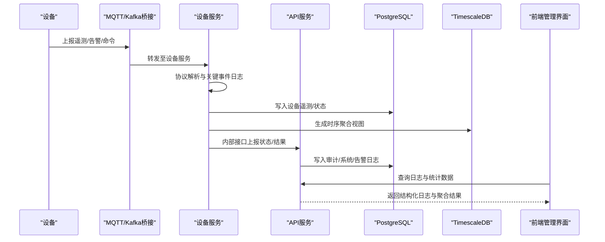
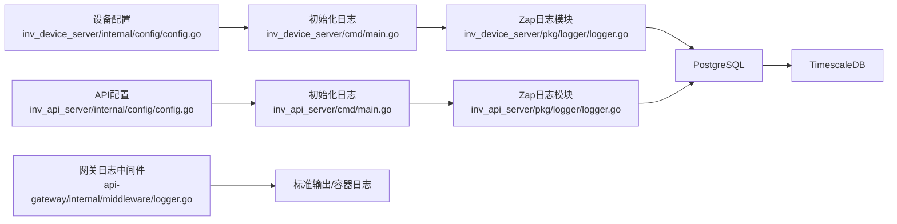

# 日志系统

<cite>
**本文引用的文件**
- [inv_api_server/pkg/logger/logger.go](file://inv_api_server/pkg/logger/logger.go)
- [inv_device_server/pkg/logger/logger.go](file://inv_device_server/pkg/logger/logger.go)
- [api-gateway/internal/middleware/logger.go](file://api-gateway/internal/middleware/logger.go)
- [inv_api_server/internal/config/config.go](file://inv_api_server/internal/config/config.go)
- [inv_device_server/internal/config/config.go](file://inv_device_server/internal/config/config.go)
- [inv_api_server/cmd/main.go](file://inv_api_server/cmd/main.go)
- [inv_device_server/cmd/main.go](file://inv_device_server/cmd/main.go)
- [inv_device_server/internal/service/protocol_parser.go](file://inv_device_server/internal/service/protocol_parser.go)
- [inv_api_server/internal/repository/repositories.go](file://inv_api_server/internal/repository/repositories.go)
- [inv-admin-frontend/src/pages/operation-logs/index.tsx](file://inv-admin-frontend/src/pages/operation-logs/index.tsx)
- [deploy/webhook_server.py](file://deploy/webhook_server.py)
</cite>

## 目录
1. [简介](#简介)
2. [项目结构](#项目结构)
3. [核心组件](#核心组件)
4. [架构总览](#架构总览)
5. [组件详解](#组件详解)
6. [依赖关系分析](#依赖关系分析)
7. [性能与容量](#性能与容量)
8. [故障排查指南](#故障排查指南)
9. [结论](#结论)
10. [附录](#附录)

## 简介
本文件面向开发与运维团队，系统性阐述该分布式日志体系的设计与实现，覆盖以下主题：
- 结构化日志在分布式系统中的重要性与实践
- 日志中间件的配置与使用（日志级别、格式化、输出目标）
- 多服务日志采集与聚合（统一格式、标签与元数据）
- 日志轮转与归档策略（大小限制、时间保留、压缩）
- 日志搜索与分析（前端界面、后端接口与数据库）
- 错误日志分类与处理流程（异常捕获、堆栈跟踪、上下文）
- 日志安全与隐私保护
- 开发与运维操作指南（配置、调试、故障排除）

## 项目结构
该项目由多个Go微服务组成，并辅以前端管理界面与部署脚本。日志相关能力主要分布在：
- API网关：HTTP请求级访问日志中间件
- API服务：基于Zap的结构化应用日志
- 设备服务：基于Zap的结构化应用日志与协议解析过程中的关键事件日志
- 前端：审计与系统日志的可视化与检索
- 部署：Webhook触发器的运行日志

图表来源
- [api-gateway/internal/middleware/logger.go:1-31](file://api-gateway/internal/middleware/logger.go#L1-L31)
- [inv_api_server/pkg/logger/logger.go:1-43](file://inv_api_server/pkg/logger/logger.go#L1-L43)
- [inv_device_server/pkg/logger/logger.go:1-134](file://inv_device_server/pkg/logger/logger.go#L1-L134)
- [inv_api_server/internal/config/config.go:90-97](file://inv_api_server/internal/config/config.go#L90-L97)
- [inv_device_server/internal/config/config.go:73-80](file://inv_device_server/internal/config/config.go#L73-L80)
- [inv_api_server/cmd/main.go:235-235](file://inv_api_server/cmd/main.go#L235-L235)
- [inv_device_server/cmd/main.go:1-200](file://inv_device_server/cmd/main.go#L1-L200)

章节来源
- [api-gateway/internal/middleware/logger.go:1-31](file://api-gateway/internal/middleware/logger.go#L1-L31)
- [inv_api_server/pkg/logger/logger.go:1-43](file://inv_api_server/pkg/logger/logger.go#L1-L43)
- [inv_device_server/pkg/logger/logger.go:1-134](file://inv_device_server/pkg/logger/logger.go#L1-L134)
- [inv_api_server/internal/config/config.go:90-97](file://inv_api_server/internal/config/config.go#L90-L97)
- [inv_device_server/internal/config/config.go:73-80](file://inv_device_server/internal/config/config.go#L73-L80)

## 核心组件
- 日志中间件（网关层）：对HTTP请求进行统一记录，便于入口流量观测与排障。
- 应用日志（API/设备服务）：采用Zap结构化日志，支持多种编码器与输出目标，可按需启用文件轮转。
- 配置中心：通过YAML配置项控制日志级别、输出文件、轮转参数等。
- 数据持久化：设备遥测与日志写入PostgreSQL，结合TimescaleDB进行时序聚合；Redis用于缓存与实时数据。
- 前端界面：提供审计日志、系统事件、告警日志与命令日志的查询、筛选与导出。

章节来源
- [inv_api_server/pkg/logger/logger.go:1-43](file://inv_api_server/pkg/logger/logger.go#L1-L43)
- [inv_device_server/pkg/logger/logger.go:1-134](file://inv_device_server/pkg/logger/logger.go#L1-L134)
- [inv_api_server/internal/config/config.go:90-97](file://inv_api_server/internal/config/config.go#L90-L97)
- [inv_device_server/internal/config/config.go:73-80](file://inv_device_server/internal/config/config.go#L73-L80)
- [inv_api_server/internal/repository/repositories.go:1351-1368](file://inv_api_server/internal/repository/repositories.go#L1351-L1368)

## 架构总览
下图展示了从设备上报到日志采集、存储与可视化的整体流程。

图表来源
- [inv_device_server/internal/service/protocol_parser.go:285-792](file://inv_device_server/internal/service/protocol_parser.go#L285-L792)
- [inv_api_server/internal/repository/repositories.go:1351-1368](file://inv_api_server/internal/repository/repositories.go#L1351-L1368)
- [inv-admin-frontend/src/pages/operation-logs/index.tsx:747-847](file://inv-admin-frontend/src/pages/operation-logs/index.tsx#L747-L847)

## 组件详解

### 网关请求日志中间件
- 功能：记录HTTP状态码、耗时、客户端IP、方法与路径，便于入口流量与异常定位。
- 输出：标准库日志打印，适合容器stdout/stderr采集。
- 适用场景：快速观测网关层请求行为，配合日志收集系统统一归档。

章节来源
- [api-gateway/internal/middleware/logger.go:1-31](file://api-gateway/internal/middleware/logger.go#L1-L31)

### API服务日志模块（Zap）
- 初始化：通过全局初始化函数构建Zap Logger，支持同步刷新。
- 日志级别：提供Debug/Info/Warn/Error/Fatal等常用级别。
- 输出目标：支持控制台或文件；文件模式下可配置JSON编码器。
- 使用方式：在各业务模块中调用相应级别函数记录结构化日志。

章节来源
- [inv_api_server/pkg/logger/logger.go:1-43](file://inv_api_server/pkg/logger/logger.go#L1-L43)
- [inv_api_server/cmd/main.go:235-235](file://inv_api_server/cmd/main.go#L235-L235)

### 设备服务日志模块（Zap）
- 初始化：根据配置动态选择编码器（JSON或Console）、输出目标（文件或stdout），并设置日志级别。
- 文件轮转：支持按大小轮转、最大备份数与保留天数、压缩开关。
- 关键事件日志：在协议解析、状态上报、命令响应等关键路径记录结构化日志，便于问题复盘。

章节来源
- [inv_device_server/pkg/logger/logger.go:1-134](file://inv_device_server/pkg/logger/logger.go#L1-L134)
- [inv_device_server/internal/config/config.go:73-80](file://inv_device_server/internal/config/config.go#L73-L80)
- [inv_device_server/internal/service/protocol_parser.go:567-592](file://inv_device_server/internal/service/protocol_parser.go#L567-L592)

### 日志配置与使用
- API服务配置项（YAML）：包含日志级别、输出文件、轮转大小、保留天数、备份数量与压缩开关。
- 设备服务配置项（YAML）：包含日志级别、输出文件、轮转大小、保留天数、备份数量与压缩开关。
- 初始化时机：在服务启动阶段加载配置并初始化日志模块。

章节来源
- [inv_api_server/internal/config/config.go:90-97](file://inv_api_server/internal/config/config.go#L90-L97)
- [inv_device_server/internal/config/config.go:73-80](file://inv_device_server/internal/config/config.go#L73-L80)
- [inv_api_server/cmd/main.go:235-235](file://inv_api_server/cmd/main.go#L235-L235)

### 多服务日志采集与聚合
- 统一格式：设备服务采用JSON编码器，API服务亦可配置为JSON输出，保证跨服务一致性。
- 标签与元数据：日志字段包含时间戳、级别、消息、调用者位置、堆栈等，便于检索与关联。
- 输出目标：容器stdout/stderr，结合日志收集系统集中采集；也可落盘文件并启用轮转。
- 数据库落地：审计日志、系统事件、告警日志与命令日志写入PostgreSQL，支持分页、筛选与导出。

章节来源
- [inv_device_server/pkg/logger/logger.go:30-66](file://inv_device_server/pkg/logger/logger.go#L30-L66)
- [inv_api_server/pkg/logger/logger.go:1-43](file://inv_api_server/pkg/logger/logger.go#L1-L43)
- [inv_api_server/internal/repository/repositories.go:2508-2514](file://inv_api_server/internal/repository/repositories.go#L2508-L2514)
- [inv-admin-frontend/src/pages/operation-logs/index.tsx:747-847](file://inv-admin-frontend/src/pages/operation-logs/index.tsx#L747-L847)

### 日志轮转与归档策略
- API服务：通过配置项控制轮转大小、保留天数、最大备份数与压缩开关。
- 设备服务：同样支持轮转大小、保留天数、最大备份数与压缩开关。
- 归档建议：结合日志收集系统进行集中归档与索引；生产环境建议开启压缩并定期清理过期日志。

章节来源
- [inv_api_server/internal/config/config.go:90-97](file://inv_api_server/internal/config/config.go#L90-L97)
- [inv_device_server/internal/config/config.go:73-80](file://inv_device_server/internal/config/config.go#L73-L80)

### 日志搜索与分析
- 前端界面：提供时间范围、日志类型、用户/IP等筛选条件，支持列表与时间线视图，以及CSV导出。
- 后端接口：提供审计日志、系统事件、告警日志与命令日志的分页查询与导出。
- 数据库查询：针对设备遥测与聚合视图进行统计查询，支撑运营与分析需求。

章节来源
- [inv-admin-frontend/src/pages/operation-logs/index.tsx:747-847](file://inv-admin-frontend/src/pages/operation-logs/index.tsx#L747-L847)
- [inv-admin-frontend/src/pages/operation-logs/index.tsx:220-308](file://inv-admin-frontend/src/pages/operation-logs/index.tsx#L220-L308)
- [inv_api_server/internal/repository/repositories.go:1351-1368](file://inv_api_server/internal/repository/repositories.go#L1351-L1368)

### 错误日志分类与处理流程
- 分类维度：操作审计、系统事件、告警日志、命令日志。
- 关键路径日志：设备服务在状态上报、故障上报、命令响应等关键节点记录结构化日志，包含SN、状态、结果、消息与时间戳。
- 异常捕获与堆栈：Zap支持堆栈跟踪字段，便于定位异常上下文。
- 处理流程：前端筛选与导出，后端接口查询与统计，数据库落盘便于长期留存与分析。

章节来源
- [inv_device_server/internal/service/protocol_parser.go:567-592](file://inv_device_server/internal/service/protocol_parser.go#L567-L592)
- [inv_device_server/internal/service/protocol_parser.go:743-775](file://inv_device_server/internal/service/protocol_parser.go#L743-L775)
- [inv-admin-frontend/src/pages/operation-logs/index.tsx:112-136](file://inv-admin-frontend/src/pages/operation-logs/index.tsx#L112-L136)

### 日志安全与隐私保护
- 访问控制：Webhook服务器对来源IP进行白名单校验，避免未授权触发。
- 签名验证：Webhook请求头包含签名字段，服务端进行签名验证后再执行部署。
- 最小暴露：日志中避免记录敏感信息（如密码、密钥、令牌），必要时进行脱敏处理。
- 存储加密：建议对日志文件与数据库进行访问控制与传输加密。

章节来源
- [deploy/webhook_server.py:124-192](file://deploy/webhook_server.py#L124-L192)

### 开发与运维操作指南
- 配置步骤
  - 在服务配置文件中设置日志级别、输出文件、轮转参数。
  - 启动时加载配置并初始化日志模块。
- 调试技巧
  - 临时提升日志级别（如从info调整为debug）以获取更细粒度信息。
  - 利用前端界面的时间范围与筛选条件快速定位问题。
- 故障排除
  - 网关层：检查请求日志中间件输出，确认异常状态码与耗时。
  - 应用层：查看Zap日志文件或容器日志，关注错误级别与堆栈字段。
  - 数据层：核对PostgreSQL写入情况与TimescaleDB聚合视图生成。

章节来源
- [inv_api_server/internal/config/config.go:90-97](file://inv_api_server/internal/config/config.go#L90-L97)
- [inv_device_server/internal/config/config.go:73-80](file://inv_device_server/internal/config/config.go#L73-L80)
- [api-gateway/internal/middleware/logger.go:1-31](file://api-gateway/internal/middleware/logger.go#L1-L31)
- [inv_api_server/pkg/logger/logger.go:1-43](file://inv_api_server/pkg/logger/logger.go#L1-L43)
- [inv_device_server/pkg/logger/logger.go:1-134](file://inv_device_server/pkg/logger/logger.go#L1-L134)

## 依赖关系分析

图表来源
- [inv_api_server/internal/config/config.go:90-97](file://inv_api_server/internal/config/config.go#L90-L97)
- [inv_device_server/internal/config/config.go:73-80](file://inv_device_server/internal/config/config.go#L73-L80)
- [inv_api_server/cmd/main.go:235-235](file://inv_api_server/cmd/main.go#L235-L235)
- [inv_device_server/cmd/main.go:1-200](file://inv_device_server/cmd/main.go#L1-L200)
- [inv_api_server/pkg/logger/logger.go:1-43](file://inv_api_server/pkg/logger/logger.go#L1-L43)
- [inv_device_server/pkg/logger/logger.go:1-134](file://inv_device_server/pkg/logger/logger.go#L1-L134)
- [api-gateway/internal/middleware/logger.go:1-31](file://api-gateway/internal/middleware/logger.go#L1-L31)

章节来源
- [inv_api_server/internal/config/config.go:90-97](file://inv_api_server/internal/config/config.go#L90-L97)
- [inv_device_server/internal/config/config.go:73-80](file://inv_device_server/internal/config/config.go#L73-L80)
- [inv_api_server/cmd/main.go:235-235](file://inv_api_server/cmd/main.go#L235-L235)
- [inv_device_server/cmd/main.go:1-200](file://inv_device_server/cmd/main.go#L1-L200)
- [inv_api_server/pkg/logger/logger.go:1-43](file://inv_api_server/pkg/logger/logger.go#L1-L43)
- [inv_device_server/pkg/logger/logger.go:1-134](file://inv_device_server/pkg/logger/logger.go#L1-L134)
- [api-gateway/internal/middleware/logger.go:1-31](file://api-gateway/internal/middleware/logger.go#L1-L31)

## 性能与容量
- 日志级别：生产环境建议使用info或更高级别，避免过多debug日志影响I/O。
- 编码器：JSON编码器便于结构化检索，但会增加日志体积；控制台编码器更轻量。
- 输出目标：容器stdout/stderr由日志收集系统统一采集，减少磁盘IO压力。
- 轮转策略：合理设置最大大小、保留天数与备份数量，平衡磁盘占用与历史保留。
- 数据库写入：审计与系统日志写入PostgreSQL，建议对高频写入场景进行批量或异步优化。

## 故障排查指南
- 网关层
  - 现象：请求异常或高延迟
  - 措施：检查网关中间件输出，确认状态码与耗时；核对上游服务可用性
- 应用层
  - 现象：服务启动失败或运行异常
  - 措施：查看Zap日志文件或容器日志，定位错误级别与堆栈；核对配置项是否正确
- 数据层
  - 现象：日志缺失或查询异常
  - 措施：检查PostgreSQL连接与权限；核对TimescaleDB视图生成；确认前端筛选条件与分页参数

章节来源
- [api-gateway/internal/middleware/logger.go:1-31](file://api-gateway/internal/middleware/logger.go#L1-L31)
- [inv_api_server/pkg/logger/logger.go:1-43](file://inv_api_server/pkg/logger/logger.go#L1-L43)
- [inv_device_server/pkg/logger/logger.go:1-134](file://inv_device_server/pkg/logger/logger.go#L1-L134)
- [inv_api_server/internal/repository/repositories.go:1351-1368](file://inv_api_server/internal/repository/repositories.go#L1351-L1368)

## 结论
本项目通过Zap实现统一的结构化日志体系，结合网关中间件与前端界面，形成从设备上报到日志采集、存储与可视化的完整闭环。通过合理的配置与轮转策略，既能满足生产环境的可观测性需求，又能兼顾性能与成本。建议在实际部署中持续优化日志级别、输出目标与归档策略，并加强安全与隐私保护措施。

## 附录

### 配置项速查
- API服务日志配置
  - 日志级别：用于控制日志输出严格程度
  - 输出文件：支持stdout或指定文件路径
  - 轮转大小（MB）：单文件最大大小
  - 最大备份数：保留的历史文件数量
  - 保留天数：日志文件保留时间
  - 压缩：是否启用压缩
- 设备服务日志配置
  - 日志级别：用于控制日志输出严格程度
  - 输出文件：支持stdout或指定文件路径
  - 轮转大小（MB）：单文件最大大小
  - 最大备份数：保留的历史文件数量
  - 保留天数：日志文件保留时间
  - 压缩：是否启用压缩

章节来源
- [inv_api_server/internal/config/config.go:90-97](file://inv_api_server/internal/config/config.go#L90-L97)
- [inv_device_server/internal/config/config.go:73-80](file://inv_device_server/internal/config/config.go#L73-L80)