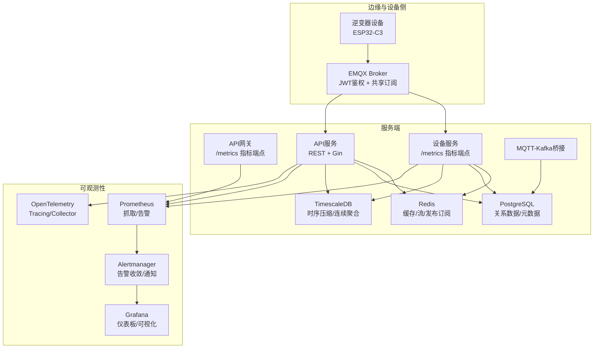
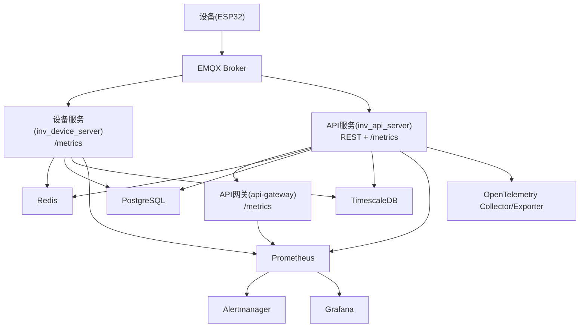
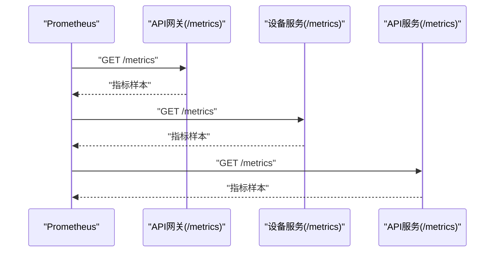
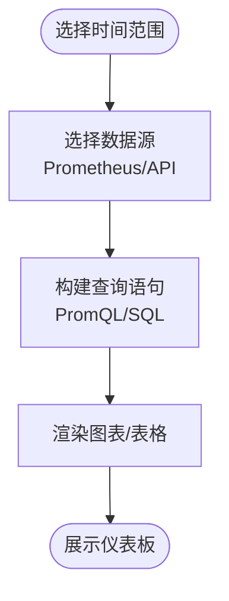
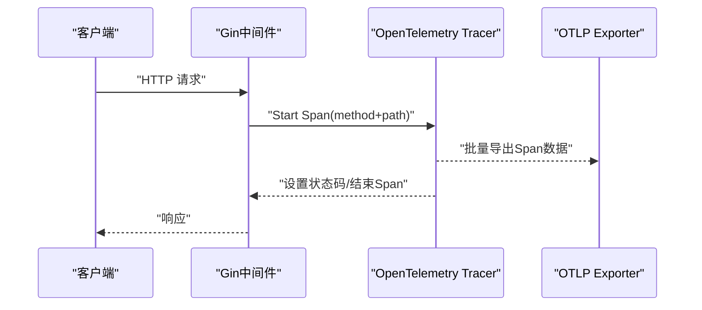
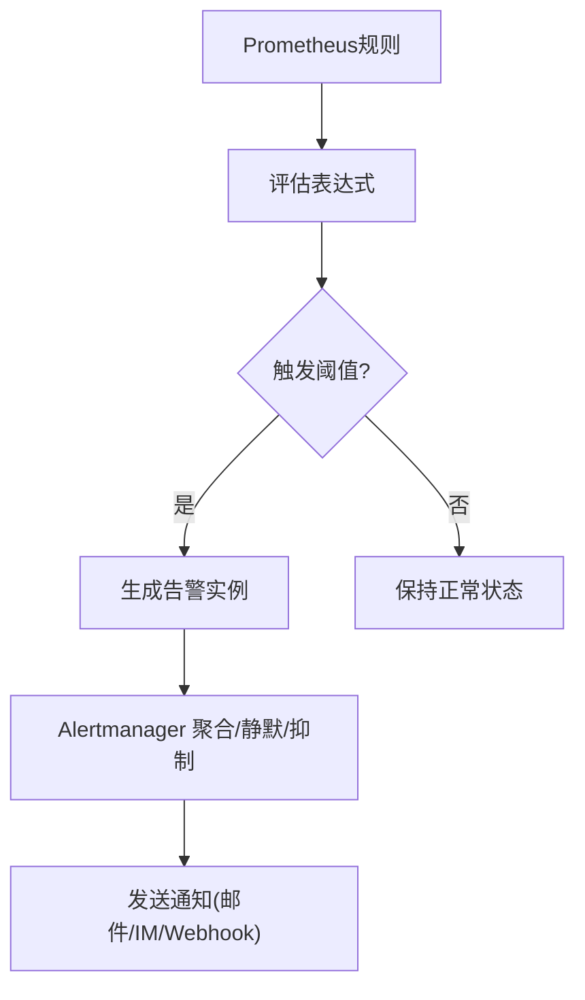
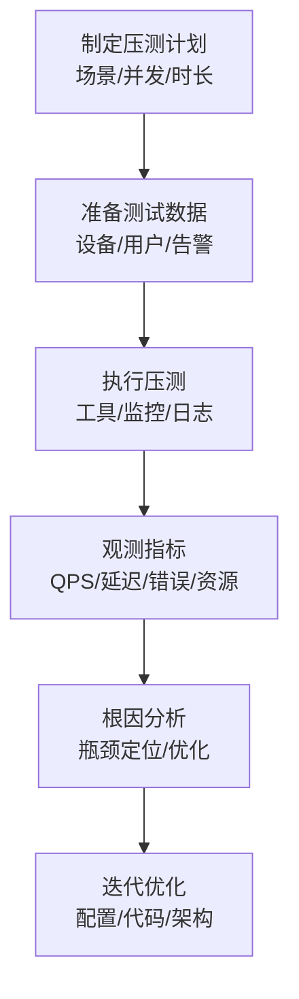
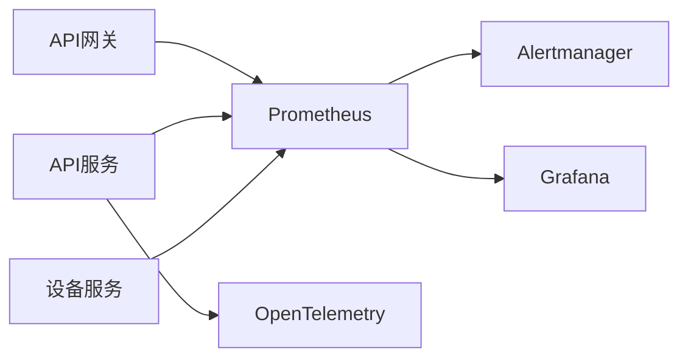

# 监控与可观测性

<cite>
**本文引用的文件**
- [README.md](file://README.md)
- [prometheus.yml](file://deploy/prometheus.yml)
- [prometheus_alerts.yml](file://deploy/prometheus_alerts.yml)
- [grafana-dashboard.json](file://deploy/grafana-dashboard.json)
- [prometheus.go](file://api-gateway/internal/middleware/prometheus.go)
- [main.go](file://api-gateway/main.go)
- [main.go](file://inv_api_server/cmd/main.go)
- [telemetry.go](file://inv_api_server/pkg/telemetry/telemetry.go)
- [protocol_parser.go](file://inv_device_server/internal/service/protocol_parser.go)
- [repositories.go](file://inv_api_server/internal/repository/repositories.go)
- [AlertsPage.tsx](file://inv-admin-frontend/src/pages/portal/AlertsPage.tsx)
- [DeviceMonitorPage.tsx](file://inv-admin-frontend/src/pages/portal/DeviceMonitorPage.tsx)
- [db_maintenance.sh](file://deploy/scripts/db_maintenance.sh)
- [main.go](file://tools/stress_test/main.go)
</cite>

## 目录
1. [引言](#引言)
2. [项目结构](#项目结构)
3. [核心组件](#核心组件)
4. [架构总览](#架构总览)
5. [详细组件分析](#详细组件分析)
6. [依赖关系分析](#依赖关系分析)
7. [性能考量](#性能考量)
8. [故障排查指南](#故障排查指南)
9. [结论](#结论)
10. [附录](#附录)

## 引言
本文件面向运维与开发团队，系统化阐述基于 Prometheus、Grafana、OpenTelemetry 的监控与可观测性体系设计与实现。内容覆盖指标采集配置（自定义指标、服务端指标、业务指标）、Grafana 仪表板设计与告警可视化、OpenTelemetry 分布式追踪与性能监控、告警规则配置、日志系统（结构化日志、日志聚合与搜索分析）、性能监控最佳实践、故障诊断与根因分析、以及运维操作手册。

## 项目结构
系统采用“实时直连 + 历史查询”的双通道架构：设备通过 MQTT 直连 Broker 实时推送，移动端与管理后台通过 HTTP API 获取历史/统计；Prometheus/Grafana 负责服务端与业务指标的采集与可视化；OpenTelemetry 提供跨服务链路追踪；数据库层采用 PostgreSQL + TimescaleDB 以支撑时序数据与长期归档。

**图表来源**
- [README.md:206-251](file://README.md#L206-L251)
- [prometheus.yml](file://deploy/prometheus.yml)
- [prometheus_alerts.yml](file://deploy/prometheus_alerts.yml)
- [grafana-dashboard.json](file://deploy/grafana-dashboard.json)

**章节来源**
- [README.md:1-367](file://README.md#L1-L367)

## 核心组件
- Prometheus 指标采集：API 网关与设备服务均暴露 /metrics 端点，Prometheus 通过静态配置抓取。
- Grafana 仪表板：提供实时监控面板、历史趋势图表、告警可视化与告警规则管理界面。
- OpenTelemetry：API 服务集成 Tracer 中间件，统一链路追踪与采样策略。
- 日志系统：服务端使用结构化日志（Zap），结合日志聚合与搜索分析能力。
- 告警规则：基于 Prometheus 规则文件定义阈值、级别与通知渠道。
- 性能监控：结合压力测试工具与数据库维护脚本，形成完整的性能基线与容量规划闭环。

**章节来源**
- [prometheus.go](file://api-gateway/internal/middleware/prometheus.go)
- [telemetry.go](file://inv_api_server/pkg/telemetry/telemetry.go)
- [prometheus.yml](file://deploy/prometheus.yml)
- [prometheus_alerts.yml](file://deploy/prometheus_alerts.yml)
- [grafana-dashboard.json](file://deploy/grafana-dashboard.json)

## 架构总览
下图展示监控与可观测性在整体系统中的位置与交互：

**图表来源**
- [README.md:206-251](file://README.md#L206-L251)
- [prometheus.yml](file://deploy/prometheus.yml)
- [telemetry.go](file://inv_api_server/pkg/telemetry/telemetry.go)

## 详细组件分析

### Prometheus 指标采集与配置
- 抓取目标
  - API 网关：/metrics 端点，用于服务端指标（请求总量、耗时、错误数等）。
  - 设备服务：/metrics 端点，用于设备通讯与处理指标（消息吞吐、解析耗时、在线设备数等）。
  - API 服务：/metrics 端点，用于业务指标（告警数量、设备状态、统计聚合等）。
- 抓取策略
  - 使用静态配置文件定义 job 与目标，周期性抓取。
  - 对不同服务设置独立的 scrape_interval 与超时参数，平衡实时性与资源消耗。
- 指标分类
  - 自定义指标：服务内部计数器、直方图、摘要，用于衡量吞吐、延迟与错误。
  - 服务端指标：HTTP 请求指标、Go runtime 指标、第三方库导出指标。
  - 业务指标：告警统计、设备在线率、历史数据聚合结果等。

**图表来源**
- [prometheus.go](file://api-gateway/internal/middleware/prometheus.go)
- [prometheus.yml](file://deploy/prometheus.yml)

**章节来源**
- [prometheus.yml](file://deploy/prometheus.yml)
- [prometheus.go](file://api-gateway/internal/middleware/prometheus.go)
- [main.go](file://inv_device_server/cmd/main.go)
- [main.go](file://inv_api_server/cmd/main.go)

### Grafana 仪表板设计与配置
- 实时监控面板
  - 设备在线状态、实时遥测数据（功率、电压、电流、温度等）。
  - 通过 MQTT 主题订阅与 Redis 缓存实现低延迟展示。
- 历史趋势图表
  - 基于 PostgreSQL/TimescaleDB 的聚合查询，支持日/周/月粒度。
  - 通过 API 服务提供的历史接口获取数据，避免直接访问时序库。
- 告警可视化
  - 展示当前未处理告警、按级别统计与分布。
  - 与 Prometheus Alertmanager 集成，支持告警状态与通知渠道可视化。
- 仪表板数据源
  - Prometheus 查询语言 PromQL 作为主要数据源。
  - API 服务提供补充的历史与统计接口。

**图表来源**
- [grafana-dashboard.json](file://deploy/grafana-dashboard.json)
- [AlertsPage.tsx](file://inv-admin-frontend/src/pages/portal/AlertsPage.tsx)
- [DeviceMonitorPage.tsx](file://inv-admin-frontend/src/pages/portal/DeviceMonitorPage.tsx)

**章节来源**
- [grafana-dashboard.json](file://deploy/grafana-dashboard.json)
- [AlertsPage.tsx](file://inv-admin-frontend/src/pages/portal/AlertsPage.tsx)
- [DeviceMonitorPage.tsx](file://inv-admin-frontend/src/pages/portal/DeviceMonitorPage.tsx)

### OpenTelemetry 集成与分布式追踪
- 初始化
  - 通过环境变量配置 OTLP 导出端点，默认本地回环地址。
  - 注册 TracerProvider，启用批量导出与 AlwaysSample 采样策略。
- Gin 中间件
  - 在 HTTP 请求生命周期内创建 Span，记录方法、路径与状态码。
  - 自动传播 TraceContext/Baggage，保证跨服务链路连贯。
- 使用建议
  - 对关键业务流程（如设备状态上报、告警处理）显式开启/结束 Span。
  - 与 Prometheus 指标互补，用于定位慢调用与异常路径。

**图表来源**
- [telemetry.go](file://inv_api_server/pkg/telemetry/telemetry.go)

**章节来源**
- [telemetry.go](file://inv_api_server/pkg/telemetry/telemetry.go)

### 告警规则配置与通知
- 规则定义
  - 基于 Prometheus 规则文件，定义阈值类与稳定性类告警。
  - 包含服务可用性、设备在线率、API 响应延迟、错误率等指标。
- 告警级别
  - 严重（Critical）、警告（Warning）、提示（Info）三级分级。
- 通知渠道
  - 通过 Alertmanager 聚合与去重，对接邮件、IM、Webhook 等通知方式。
- 告警可视化
  - Grafana 展示未处理告警列表与统计卡片，便于快速处置。

**图表来源**
- [prometheus_alerts.yml](file://deploy/prometheus_alerts.yml)
- [grafana-dashboard.json](file://deploy/grafana-dashboard.json)

**章节来源**
- [prometheus_alerts.yml](file://deploy/prometheus_alerts.yml)
- [grafana-dashboard.json](file://deploy/grafana-dashboard.json)

### 日志系统实现
- 结构化日志
  - 服务端使用 Uber Zap 输出结构化日志，包含时间戳、级别、消息体与键值对字段。
  - 设备服务在关键路径（如遥测解析、故障检测）输出诊断日志，便于问题定位。
- 日志聚合与搜索
  - 建议配合日志收集系统（如 ELK/OpenSearch）进行集中存储与检索。
  - 通过日志标签（服务名、SN、设备状态）实现高效过滤与关联分析。
- 与监控联动
  - 将日志与指标、追踪结合，形成“日志-指标-追踪”三位一体的可观测闭环。

**章节来源**
- [protocol_parser.go](file://inv_device_server/internal/service/protocol_parser.go)

### 性能监控最佳实践
- 关键指标定义
  - 服务端：请求 QPS、P95/P99 延迟、错误率、并发连接数、GC 次数与暂停时间。
  - 业务端：设备在线率、告警触发频率、历史数据聚合耗时、缓存命中率。
- 性能基线与容量规划
  - 基于压力测试工具生成吞吐、延迟与错误率基线，识别瓶颈。
  - 结合数据库维护脚本（保留策略、压缩与连续聚合）保障长期内存与查询性能。
- 压力测试
  - 使用内置压力测试工具模拟高并发场景，持续观察指标变化与系统行为。

**图表来源**
- [db_maintenance.sh](file://deploy/scripts/db_maintenance.sh)
- [main.go](file://tools/stress_test/main.go)

**章节来源**
- [db_maintenance.sh](file://deploy/scripts/db_maintenance.sh)
- [main.go](file://tools/stress_test/main.go)

### 故障诊断与根因分析
- 诊断步骤
  - 从 Grafana 查看异常趋势与告警状态，确认影响范围。
  - 结合 OpenTelemetry 追踪，定位慢调用与异常 Span。
  - 查看服务日志，提取关键错误与异常堆栈。
  - 检查数据库与缓存状态，核对保留策略与压缩效果。
- 常见问题
  - 设备长时间无数据：检查 MQTT 连接、共享订阅分发、设备在线状态。
  - 告警未显示：检查告警规则、静默/抑制配置与通知渠道。
  - 历史数据缺失：核查 TimescaleDB 压缩与连续聚合是否生效。

**章节来源**
- [README.md:1-367](file://README.md#L1-L367)
- [protocol_parser.go](file://inv_device_server/internal/service/protocol_parser.go)

## 依赖关系分析
- 服务耦合
  - 设备服务与 API 服务通过 MQTT/HTTP 双向协作，Prometheus 与 Alertmanager 作为外部依赖。
  - API 网关承担统一指标暴露职责，降低各服务重复实现成本。
- 外部依赖
  - Prometheus 与 Grafana 作为核心可视化与告警平台。
  - OpenTelemetry 提供跨服务链路追踪能力。
  - PostgreSQL/TimescaleDB 作为数据存储与时序分析基础。

**图表来源**
- [prometheus.yml](file://deploy/prometheus.yml)
- [telemetry.go](file://inv_api_server/pkg/telemetry/telemetry.go)

**章节来源**
- [prometheus.yml](file://deploy/prometheus.yml)
- [telemetry.go](file://inv_api_server/pkg/telemetry/telemetry.go)

## 性能考量
- 指标抓取频率与资源平衡：根据服务负载调整 scrape_interval，避免过度抓取导致资源紧张。
- 时序数据保留策略：通过维护脚本定期清理过期数据，保持查询性能与存储效率。
- 缓存与流处理：合理利用 Redis 缓存与 Streams，降低数据库压力并提升实时性。
- 压测与基线：持续进行压测，建立性能基线，指导容量规划与优化方向。

[本节为通用指导，无需具体文件分析]

## 故障排查指南
- 告警未显示
  - 检查告警规则与静默/抑制配置，确认通知渠道可用。
  - 参考告警页面与管理后台的告警列表，定位未处理告警。
- 设备无数据
  - 核查 MQTT 连接状态与共享订阅分发情况。
  - 检查设备服务的日志与在线状态标记，确认遥测解析流程正常。
- 历史数据异常
  - 检查 TimescaleDB 压缩与连续聚合任务是否运行正常。
  - 确认维护脚本的保留策略与执行时间。

**章节来源**
- [prometheus_alerts.yml](file://deploy/prometheus_alerts.yml)
- [AlertsPage.tsx](file://inv-admin-frontend/src/pages/portal/AlertsPage.tsx)
- [protocol_parser.go](file://inv_device_server/internal/service/protocol_parser.go)
- [db_maintenance.sh](file://deploy/scripts/db_maintenance.sh)

## 结论
本监控与可观测性体系通过 Prometheus/Grafana 实现服务端与业务指标的全面采集与可视化，借助 OpenTelemetry 提供跨服务链路追踪，结合结构化日志与告警规则，形成“指标-追踪-日志-告警”的闭环。配合压力测试与数据库维护脚本，可实现性能基线与容量规划的持续优化，为运维团队提供高效的故障诊断与根因分析能力。

[本节为总结，无需具体文件分析]

## 附录
- 运维操作手册
  - 启停与部署：使用部署脚本与容器编排文件，确保各组件按顺序启动。
  - 指标与告警：定期检查 /metrics 端点可达性与指标完整性，核对告警规则有效性。
  - 日志与审计：启用结构化日志，定期轮转与归档，保留审计日志以便追溯。
  - 数据维护：按计划执行数据库维护脚本，确保时序数据的健康与查询性能。

[本节为通用指导，无需具体文件分析]