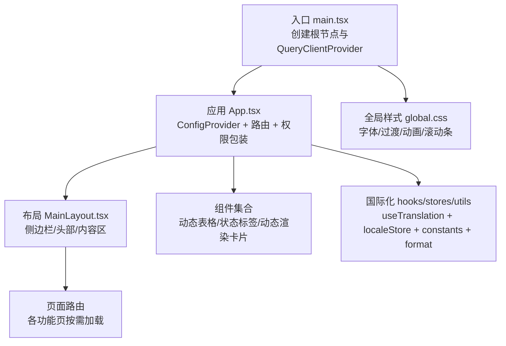
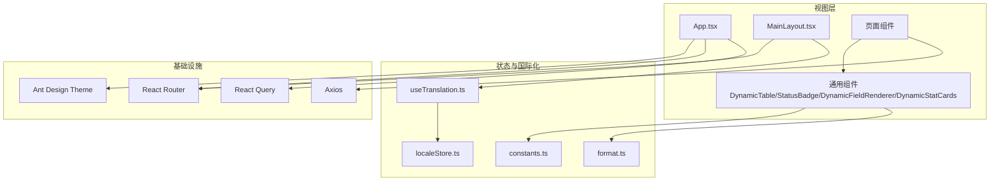
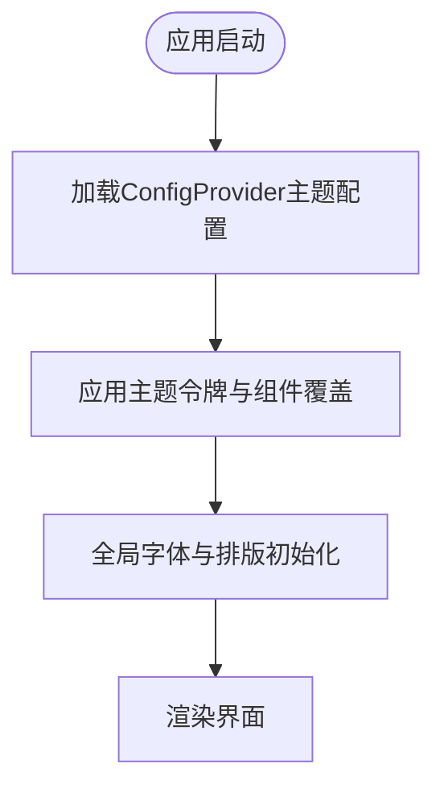
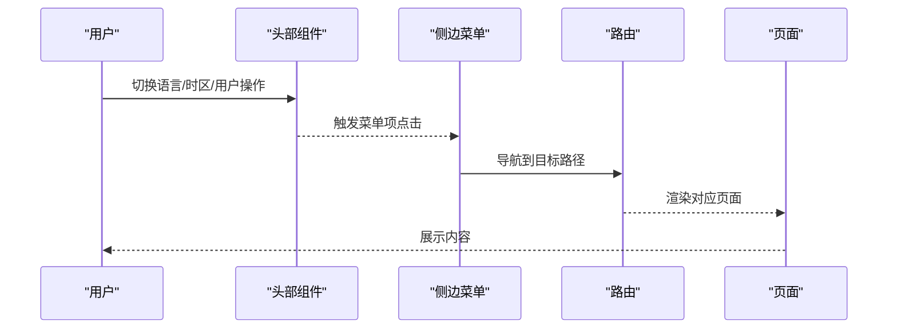
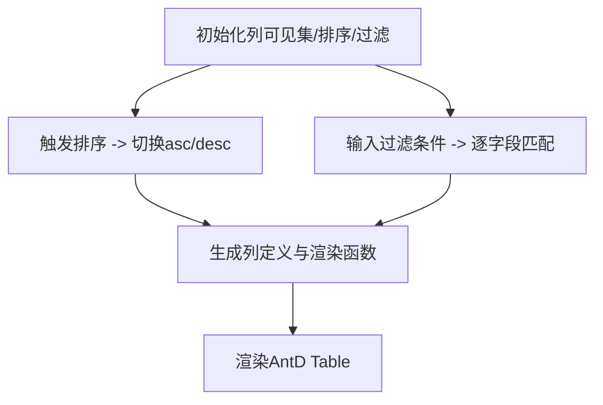
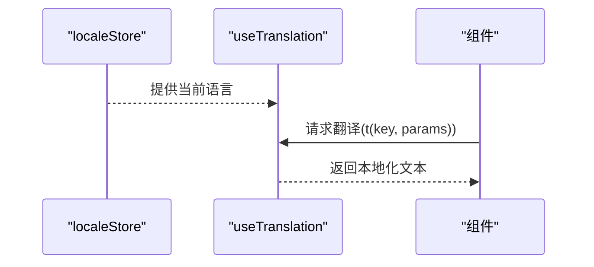
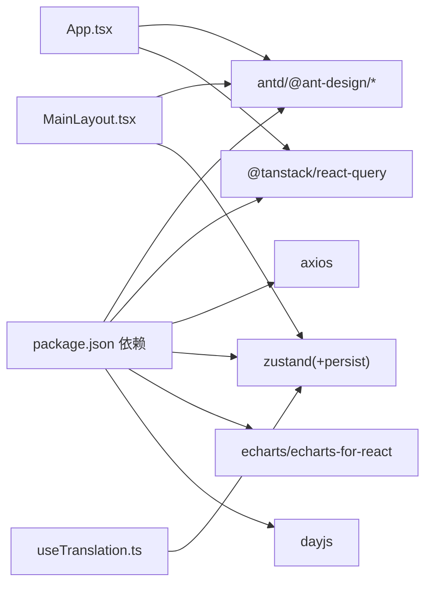

# UI组件库

<cite>
**本文引用的文件**
- [App.tsx](file://inv-admin-frontend/src/App.tsx)
- [main.tsx](file://inv-admin-frontend/src/main.tsx)
- [global.css](file://inv-admin-frontend/src/global.css)
- [package.json](file://inv-admin-frontend/package.json)
- [vite.config.ts](file://inv-admin-frontend/vite.config.ts)
- [MainLayout.tsx](file://inv-admin-frontend/src/layouts/MainLayout.tsx)
- [DynamicTable.tsx](file://inv-admin-frontend/src/components/DynamicTable.tsx)
- [StatusBadge.tsx](file://inv-admin-frontend/src/components/StatusBadge.tsx)
- [DynamicFieldRenderer.tsx](file://inv-admin-frontend/src/components/dyna/DynamicFieldRenderer.tsx)
- [DynamicStatCards.tsx](file://inv-admin-frontend/src/components/dyna/DynamicStatCards.tsx)
- [useTranslation.ts](file://inv-admin-frontend/src/hooks/useTranslation.ts)
- [localeStore.ts](file://inv-admin-frontend/src/stores/localeStore.ts)
- [constants.ts](file://inv-admin-frontend/src/utils/constants.ts)
- [format.ts](file://inv-admin-frontend/src/utils/format.ts)
</cite>

## 目录
1. [引言](#引言)
2. [项目结构](#项目结构)
3. [核心组件](#核心组件)
4. [架构总览](#架构总览)
5. [详细组件分析](#详细组件分析)
6. [依赖关系分析](#依赖关系分析)
7. [性能考虑](#性能考虑)
8. [故障排查指南](#故障排查指南)
9. [结论](#结论)
10. [附录](#附录)

## 引言
本文件面向UI组件库的实现与使用，聚焦以下目标：  
- 自定义组件设计与实现：图表组件、数据表格、表单控件、导航组件  
- 主题系统：深色/浅色主题切换、颜色方案定制、字体管理  
- 响应式设计：屏幕适配、布局调整、触摸交互优化  
- 动画与过渡：页面切换动画、加载动画、状态变化动画  
- 国际化：文本本地化、日期/数字格式化  
- 组件复用策略、样式管理与性能优化最佳实践  

## 项目结构
前端采用React + TypeScript + Vite构建，UI基础库为Ant Design，辅以Zustand状态管理、React Router路由、React Query数据请求缓存等。

图示来源
- [main.tsx:1-27](file://inv-admin-frontend/src/main.tsx#L1-L27)
- [App.tsx:46-155](file://inv-admin-frontend/src/App.tsx#L46-L155)
- [MainLayout.tsx:65-384](file://inv-admin-frontend/src/layouts/MainLayout.tsx#L65-L384)
- [global.css:1-135](file://inv-admin-frontend/src/global.css#L1-L135)

章节来源
- [main.tsx:1-27](file://inv-admin-frontend/src/main.tsx#L1-L27)
- [App.tsx:46-155](file://inv-admin-frontend/src/App.tsx#L46-L155)
- [vite.config.ts:1-22](file://inv-admin-frontend/vite.config.ts#L1-L22)
- [package.json:1-38](file://inv-admin-frontend/package.json#L1-L38)

## 核心组件
- 应用根配置：通过Ant Design ConfigProvider集中注入主题、语言与组件级样式覆盖，统一全局外观与行为。  
- 布局容器：MainLayout负责侧边菜单、头部操作区（语言/时区/用户下拉）、内容区Outlet与移动端折叠逻辑。  
- 动态表格：DynamicTable支持列显隐、排序、过滤、分页与横向滚动，适配多字段模型数据展示。  
- 状态标签：StatusBadge根据设备状态映射生成彩色标签，便于快速识别。  
- 动态渲染：DynamicFieldRenderer将设备模型字段动态渲染为描述列表；DynamicStatCards以卡片形式展示统计数据。  
- 国际化：useTranslation提供键值翻译与参数插值；localeStore持久化语言偏好；常量与格式化工具支撑多场景展示。

章节来源
- [App.tsx:54-100](file://inv-admin-frontend/src/App.tsx#L54-L100)
- [MainLayout.tsx:65-384](file://inv-admin-frontend/src/layouts/MainLayout.tsx#L65-L384)
- [DynamicTable.tsx:33-195](file://inv-admin-frontend/src/components/DynamicTable.tsx#L33-L195)
- [StatusBadge.tsx:14-18](file://inv-admin-frontend/src/components/StatusBadge.tsx#L14-L18)
- [DynamicFieldRenderer.tsx:16-60](file://inv-admin-frontend/src/components/dyna/DynamicFieldRenderer.tsx#L16-L60)
- [DynamicStatCards.tsx:16-58](file://inv-admin-frontend/src/components/dyna/DynamicStatCards.tsx#L16-L58)
- [useTranslation.ts:4-16](file://inv-admin-frontend/src/hooks/useTranslation.ts#L4-L16)
- [localeStore.ts:11-19](file://inv-admin-frontend/src/stores/localeStore.ts#L11-L19)
- [constants.ts:1-128](file://inv-admin-frontend/src/utils/constants.ts#L1-L128)
- [format.ts:1-13](file://inv-admin-frontend/src/utils/format.ts#L1-L13)

## 架构总览
整体采用“配置驱动 + 组件复用”的架构：  
- 配置驱动：ConfigProvider集中主题与组件样式；localeStore集中语言偏好；常量与格式化工具集中业务语义。  
- 组件复用：动态表格、动态渲染卡片、状态标签等通用组件在多页面复用，降低重复开发成本。  
- 数据层：React Query统一处理查询/缓存/重试；Axios封装API调用；权限守卫ProtectedRoute保障路由安全。

图示来源
- [App.tsx:46-155](file://inv-admin-frontend/src/App.tsx#L46-L155)
- [MainLayout.tsx:65-384](file://inv-admin-frontend/src/layouts/MainLayout.tsx#L65-L384)
- [DynamicTable.tsx:33-195](file://inv-admin-frontend/src/components/DynamicTable.tsx#L33-L195)
- [DynamicFieldRenderer.tsx:16-60](file://inv-admin-frontend/src/components/dyna/DynamicFieldRenderer.tsx#L16-L60)
- [DynamicStatCards.tsx:16-58](file://inv-admin-frontend/src/components/dyna/DynamicStatCards.tsx#L16-L58)
- [useTranslation.ts:4-16](file://inv-admin-frontend/src/hooks/useTranslation.ts#L4-L16)
- [localeStore.ts:11-19](file://inv-admin-frontend/src/stores/localeStore.ts#L11-L19)
- [constants.ts:1-128](file://inv-admin-frontend/src/utils/constants.ts#L1-L128)
- [format.ts:1-13](file://inv-admin-frontend/src/utils/format.ts#L1-L13)

## 详细组件分析

### 主题系统与字体管理
- 主题注入：ConfigProvider在应用根部注入Ant Design主题令牌与组件级覆盖，统一主色、圆角、字号、阴影、容器背景等。  
- 字体管理：全局CSS引入Inter字体，并在body与AntD组件字体链路中统一字体族，提升可读性与一致性。  
- 深色/浅色：侧边栏使用暗色主题，头部与内容区采用亮色容器，形成对比明确的视觉层次。

图示来源
- [App.tsx:54-100](file://inv-admin-frontend/src/App.tsx#L54-L100)
- [global.css:9-13](file://inv-admin-frontend/src/global.css#L9-L13)

章节来源
- [App.tsx:54-100](file://inv-admin-frontend/src/App.tsx#L54-L100)
- [global.css:1-135](file://inv-admin-frontend/src/global.css#L1-L135)

### 导航组件与布局
- 侧边菜单：根据角色动态生成菜单项，支持权限过滤与图标/文案本地化；支持移动端断点折叠。  
- 头部区域：语言切换（中文/英文）、时区选择、用户信息与下拉菜单（修改密码/个人资料/登出）。  
- 内容区：Outlet承载页面内容，配合面包屑与栅格布局实现响应式展示。

图示来源
- [MainLayout.tsx:65-384](file://inv-admin-frontend/src/layouts/MainLayout.tsx#L65-L384)

章节来源
- [MainLayout.tsx:65-384](file://inv-admin-frontend/src/layouts/MainLayout.tsx#L65-L384)

### 数据表格组件（DynamicTable）
- 功能特性：列显隐控制、排序（升/降序）、多字段过滤、分页、横向滚动、单元格单位显示、空态提示。  
- 性能要点：排序/过滤/列选择均使用memoized计算，避免不必要的重渲染；默认分页pageSize与滚动阈值可配置。  
- 使用建议：结合后端分页与查询缓存，减少大数据量下的渲染压力。

图示来源
- [DynamicTable.tsx:33-195](file://inv-admin-frontend/src/components/DynamicTable.tsx#L33-L195)

章节来源
- [DynamicTable.tsx:33-195](file://inv-admin-frontend/src/components/DynamicTable.tsx#L33-L195)

### 表单控件与交互
- 表单封装：在弹窗中集成AntD Form，结合受控组件与校验规则，实现修改密码与更新个人资料。  
- 交互反馈：统一使用message提示；按钮loading状态避免重复提交；销毁策略destroyOnClose降低内存占用。  
- 时区选择：基于预设时区列表，支持搜索与选中高亮。

章节来源
- [MainLayout.tsx:149-200](file://inv-admin-frontend/src/layouts/MainLayout.tsx#L149-L200)
- [MainLayout.tsx:268-381](file://inv-admin-frontend/src/layouts/MainLayout.tsx#L268-L381)

### 状态标签组件（StatusBadge）
- 映射策略：设备状态映射表支持数字与字符串键，统一返回标签文案与颜色。  
- 复用方式：在表格/卡片/详情中直接复用，保证状态表达一致。

章节来源
- [StatusBadge.tsx:8-18](file://inv-admin-frontend/src/components/StatusBadge.tsx#L8-L18)
- [constants.ts:9-16](file://inv-admin-frontend/src/utils/constants.ts#L9-L16)

### 动态字段渲染与统计卡片
- 描述列表渲染：根据字段类型自动格式化布尔/整数/浮点/字符串，并追加单位；空值统一占位。  
- 统计卡片：按字段顺序切片展示，支持颜色数组循环与精度控制；栅格自适应列宽。

章节来源
- [DynamicFieldRenderer.tsx:28-49](file://inv-admin-frontend/src/components/dyna/DynamicFieldRenderer.tsx#L28-L49)
- [DynamicStatCards.tsx:34-55](file://inv-admin-frontend/src/components/dyna/DynamicStatCards.tsx#L34-L55)

### 图表组件（ECharts）
- 技术栈：使用ECharts与ECharts for React进行可视化集成，支持折线图、柱状图、仪表盘等。  
- 最佳实践：按需引入模块、开启懒加载、合理设置resize防抖、在卸载时清理实例，避免内存泄漏。  
- 与动态表格联动：可将表格筛选结果映射为图表过滤条件，实现“所见即所得”的联动分析。

章节来源
- [package.json:20-21](file://inv-admin-frontend/package.json#L20-L21)

### 国际化组件支持
- 文本本地化：useTranslation提供键值翻译与参数插值；未命中时回退键名，确保开发期可追踪。  
- 语言持久化：localeStore使用持久化中间件，浏览器语言检测作为初始值。  
- 日期/数字格式化：format工具提供安全数字转换与格式化；结合Day.js可扩展日期格式化能力。

图示来源
- [localeStore.ts:11-19](file://inv-admin-frontend/src/stores/localeStore.ts#L11-L19)
- [useTranslation.ts:4-16](file://inv-admin-frontend/src/hooks/useTranslation.ts#L4-L16)
- [format.ts:1-13](file://inv-admin-frontend/src/utils/format.ts#L1-L13)

章节来源
- [useTranslation.ts:4-16](file://inv-admin-frontend/src/hooks/useTranslation.ts#L4-L16)
- [localeStore.ts:11-19](file://inv-admin-frontend/src/stores/localeStore.ts#L11-L19)
- [format.ts:1-13](file://inv-admin-frontend/src/utils/format.ts#L1-L13)

### 动画与过渡效果
- 页面切换：全局CSS定义页面进入动画，平滑过渡提升体验。  
- 交互反馈：卡片悬停、按钮按下、菜单项过渡、侧边栏折叠、标签与模态框动画等，增强可用性。  
- 加载动画：表格/卡片/按钮loading状态，避免误操作与信息闪烁。

章节来源
- [global.css:15-135](file://inv-admin-frontend/src/global.css#L15-L135)

### 响应式设计
- 断点与折叠：使用AntD Grid断点与Sider breakpoint属性，在小屏自动折叠侧边栏，头部紧凑布局。  
- 布局调整：侧边宽度与内容边距动态计算，保证在不同屏幕尺寸下内容不被遮挡。  
- 触摸优化：按钮与菜单项尺寸与间距适配移动端触控，折叠/展开手势友好。

章节来源
- [MainLayout.tsx:83-89](file://inv-admin-frontend/src/layouts/MainLayout.tsx#L83-L89)
- [MainLayout.tsx:209-226](file://inv-admin-frontend/src/layouts/MainLayout.tsx#L209-L226)

## 依赖关系分析
- 组件耦合：通用组件与页面解耦，通过props传参与事件回调交互；布局与国际化通过hooks注入，降低耦合度。  
- 外部依赖：Ant Design提供UI原子能力；React Query负责数据层；Axios封装HTTP；Zustand管理轻量状态；Vite提供开发与构建能力。  
- 可能风险：动态表格在超大数据量时需结合虚拟滚动或服务端分页；国际化键名变更需同步校验。

图示来源
- [package.json:12-28](file://inv-admin-frontend/package.json#L12-L28)
- [App.tsx:3-100](file://inv-admin-frontend/src/App.tsx#L3-L100)
- [MainLayout.tsx:15-81](file://inv-admin-frontend/src/layouts/MainLayout.tsx#L15-L81)

章节来源
- [package.json:12-28](file://inv-admin-frontend/package.json#L12-L28)

## 性能考虑
- 渲染优化：大量使用memo与useMemo避免重复计算；动态表格列选择与排序仅在必要时重算。  
- 网络优化：QueryClient默认配置减少重复请求与窗口焦点重取；失败重试次数按操作类型区分。  
- 样式优化：全局CSS集中管理过渡与动画，避免分散定义导致的重复计算。  
- 资源优化：按需引入图表模块，避免打包体积膨胀；图片与字体资源CDN化（如外部引入）。  
- 交互优化：按钮与菜单过渡使用贝塞尔曲线，提升感知流畅度；滚动条自定义减少默认样式差异。

章节来源
- [main.tsx:7-18](file://inv-admin-frontend/src/main.tsx#L7-L18)
- [global.css:15-87](file://inv-admin-frontend/src/global.css#L15-L87)

## 故障排查指南
- 国际化键缺失：useTranslation会回退键名，便于定位未翻译键；检查locales目录与键名拼写。  
- 语言切换无效：确认localeStore持久化是否生效；检查ConfigProvider locale绑定逻辑。  
- 动态表格无数据：检查fields元数据是否为空；确认dataSource结构与field_key一致。  
- 侧边栏折叠异常：检查breakpoint与onBreakpoint回调；确认移动端断点状态。  
- 表单提交失败：查看message错误提示；核对后端返回code与message字段。  
- 图表渲染异常：确认容器尺寸与resize时机；避免在隐藏状态下初始化图表。

章节来源
- [useTranslation.ts:6-14](file://inv-admin-frontend/src/hooks/useTranslation.ts#L6-L14)
- [localeStore.ts:11-19](file://inv-admin-frontend/src/stores/localeStore.ts#L11-L19)
- [DynamicTable.tsx:175-177](file://inv-admin-frontend/src/components/DynamicTable.tsx#L175-L177)
- [MainLayout.tsx:209-226](file://inv-admin-frontend/src/layouts/MainLayout.tsx#L209-L226)
- [MainLayout.tsx:149-169](file://inv-admin-frontend/src/layouts/MainLayout.tsx#L149-L169)

## 结论
该UI组件库以Ant Design为基础，结合Zustand、React Query与React Router，实现了主题统一、国际化完善、组件复用与性能优化的平衡。通过动态表格、动态渲染与状态标签等通用组件，有效支撑了多页面的数据展示与交互需求；同时，完善的响应式与动画体系提升了用户体验。后续可在大数据量场景引入虚拟滚动与服务端分页、进一步扩展图表组件能力，并完善国际化词条与测试覆盖。

## 附录
- 开发与构建：Vite别名@指向src，代理/api转发至后端；开发端口5173。  
- 代码规范：TypeScript强类型约束；组件以函数式与Hooks为主；样式集中于global.css与组件内联。  
- 扩展建议：新增组件遵循“配置驱动 + 可组合”原则；国际化键名统一管理；性能指标监控与埋点完善。

章节来源
- [vite.config.ts:5-21](file://inv-admin-frontend/vite.config.ts#L5-L21)
- [App.tsx:54-100](file://inv-admin-frontend/src/App.tsx#L54-L100)