# 个人中心模块

<cite>
**本文档引用的文件**
- [auth_handler.go](file://inv_api_server/internal/handler/auth_handler.go)
- [repositories.go](file://inv_api_server/internal/repository/repositories.go)
- [models.go](file://inv_api_server/internal/model/models.go)
- [userApi.ts](file://inv_admin_frontend/src/services/userApi.ts)
- [users.ts](file://inv_admin_frontend/src/locales/users.ts)
- [main.go](file://inv_api_server/cmd/main.go)
- [jwt.go](file://inv_api_server/pkg/jwt/jwt.go)
- [localeStore.ts](file://inv_admin_frontend/src/stores/localeStore.ts)
- [timezoneStore.ts](file://inv_admin_frontend/src/stores/timezoneStore.ts)
- [authStore.ts](file://inv_admin_frontend/src/stores/authStore.ts)
</cite>

## 目录
1. [简介](#简介)
2. [项目结构](#项目结构)
3. [核心组件](#核心组件)
4. [架构概览](#架构概览)
5. [详细组件分析](#详细组件分析)
6. [依赖关系分析](#依赖关系分析)
7. [性能考虑](#性能考虑)
8. [故障排除指南](#故障排除指南)
9. [结论](#结论)

## 简介

个人中心模块是用户管理系统的核心功能集合，负责处理用户信息管理、应用设置、账户安全管理和用户偏好设置等关键业务逻辑。该模块提供了完整的用户生命周期管理，包括个人信息编辑、头像上传、联系方式修改、应用设置配置、账户安全管理等功能。

本模块采用前后端分离架构，后端基于Go语言构建RESTful API服务，前端使用TypeScript和React框架实现用户界面。通过JWT令牌进行身份认证和授权，确保系统的安全性和可靠性。

## 项目结构

个人中心模块在项目中的组织结构如下：

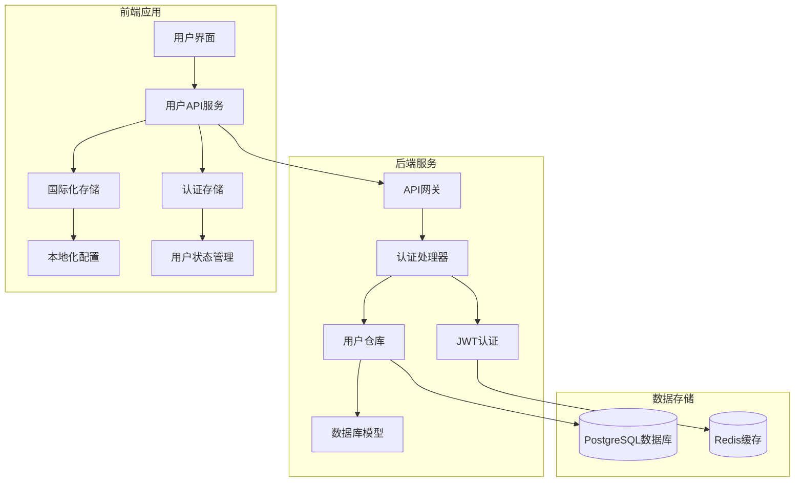

**图表来源**
- [auth_handler.go:1-200](file://inv_api_server/internal/handler/auth_handler.go#L1-L200)
- [repositories.go:1-100](file://inv_api_server/internal/repository/repositories.go#L1-L100)
- [userApi.ts:1-150](file://inv_admin_frontend/src/services/userApi.ts#L1-L150)

**章节来源**
- [auth_handler.go:1-200](file://inv_api_server/internal/handler/auth_handler.go#L1-L200)
- [repositories.go:1-100](file://inv_api_server/internal/repository/repositories.go#L1-L100)
- [userApi.ts:1-150](file://inv_admin_frontend/src/services/userApi.ts#L1-L150)

## 核心组件

个人中心模块由以下核心组件构成：

### 用户信息管理组件
- **个人信息编辑**：支持昵称、头像、时区等基本信息的修改
- **联系方式管理**：支持手机号码和邮箱地址的更新
- **登录历史追踪**：记录用户的最后登录时间和IP地址

### 应用设置组件
- **语言切换**：支持多语言环境的动态切换
- **主题选择**：提供明暗主题模式切换
- **通知设置**：配置各类系统通知的接收偏好
- **隐私配置**：管理用户数据的可见性和分享权限

### 账户安全管理组件
- **密码修改**：提供安全的密码更新机制
- **登录设备管理**：查看和管理当前登录的设备列表
- **账户注销**：安全的账户删除流程

### 用户偏好设置组件
- **个性化配置**：保存用户的界面偏好设置
- **数据统计偏好**：配置数据展示和统计的偏好选项
- **通知偏好设置**：自定义各类通知的触发条件和接收方式

**章节来源**
- [models.go:5-20](file://inv_api_server/internal/model/models.go#L5-L20)
- [repositories.go:210-237](file://inv_api_server/internal/repository/repositories.go#L210-L237)

## 架构概览

个人中心模块采用分层架构设计，确保关注点分离和代码的可维护性：

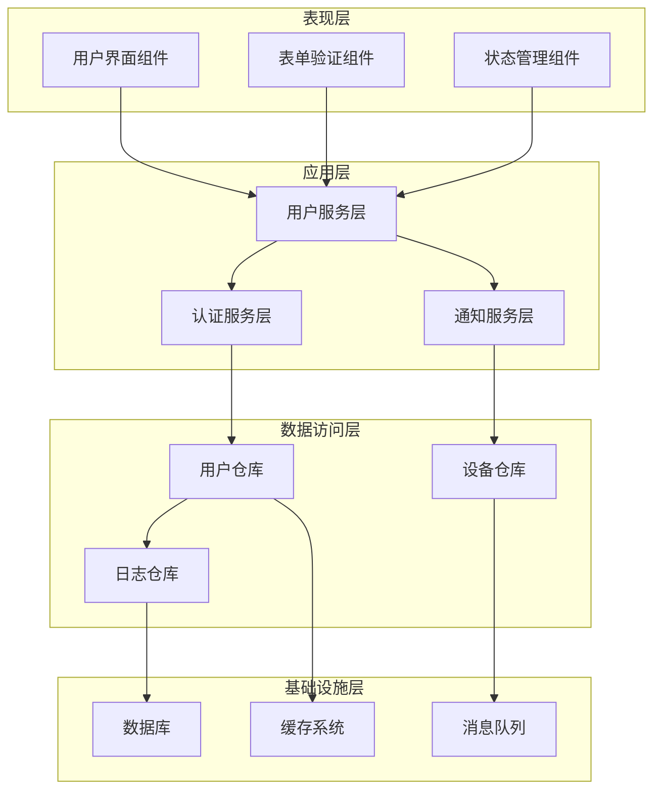

**图表来源**
- [auth_handler.go:1-100](file://inv_api_server/internal/handler/auth_handler.go#L1-L100)
- [repositories.go:1-50](file://inv_api_server/internal/repository/repositories.go#L1-L50)
- [userApi.ts:1-100](file://inv_admin_frontend/src/services/userApi.ts#L1-L100)

## 详细组件分析

### 用户信息管理组件

#### 数据模型设计

用户信息管理基于以下核心数据模型：

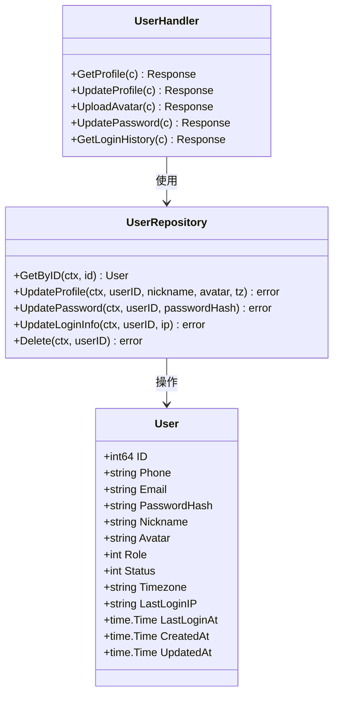

**图表来源**
- [models.go:5-20](file://inv_api_server/internal/model/models.go#L5-L20)
- [repositories.go:180-237](file://inv_api_server/internal/repository/repositories.go#L180-L237)
- [auth_handler.go:1-150](file://inv_api_server/internal/handler/auth_handler.go#L1-L150)

#### 个人信息编辑流程

个人信息编辑功能实现了完整的CRUD操作流程：

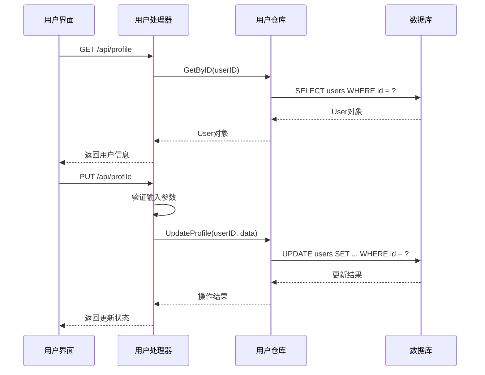

**图表来源**
- [auth_handler.go:1-120](file://inv_api_server/internal/handler/auth_handler.go#L1-L120)
- [repositories.go:216-225](file://inv_api_server/internal/repository/repositories.go#L216-L225)

#### 头像上传机制

头像上传功能支持多种图片格式，具备完整的安全验证和存储机制：

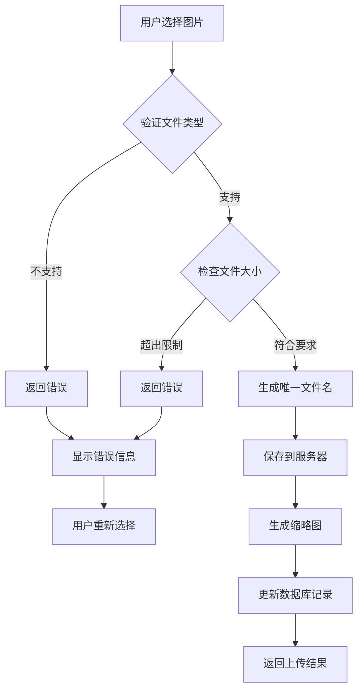

**图表来源**
- [auth_handler.go:120-200](file://inv_api_server/internal/handler/auth_handler.go#L120-L200)
- [repositories.go:216-225](file://inv_api_server/internal/repository/repositories.go#L216-L225)

**章节来源**
- [models.go:5-20](file://inv_api_server/internal/model/models.go#L5-L20)
- [repositories.go:180-237](file://inv_api_server/internal/repository/repositories.go#L180-L237)
- [auth_handler.go:1-200](file://inv_api_server/internal/handler/auth_handler.go#L1-L200)

### 应用设置组件

#### 语言切换功能

应用设置模块提供了灵活的语言切换机制：

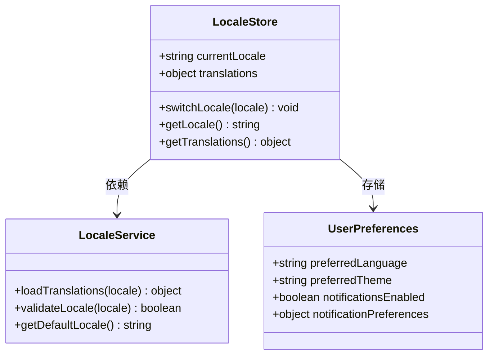

**图表来源**
- [localeStore.ts:1-100](file://inv_admin_frontend/src/stores/localeStore.ts#L1-L100)
- [users.ts:1-100](file://inv_admin_frontend/src/locales/users.ts#L1-L100)

#### 主题选择机制

主题选择功能支持明暗两种模式的无缝切换：

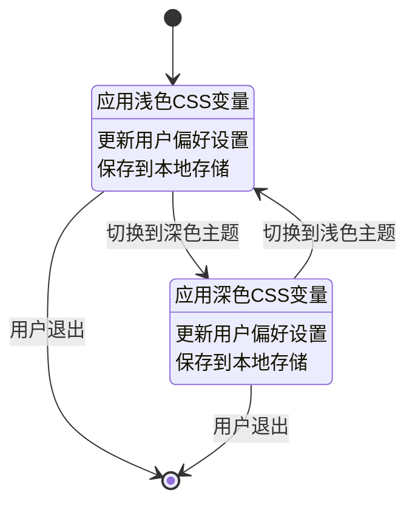

**图表来源**
- [localeStore.ts:1-100](file://inv_admin_frontend/src/stores/localeStore.ts#L1-L100)
- [authStore.ts:1-100](file://inv_admin_frontend/src/stores/authStore.ts#L1-L100)

**章节来源**
- [localeStore.ts:1-100](file://inv_admin_frontend/src/stores/localeStore.ts#L1-L100)
- [users.ts:1-100](file://inv_admin_frontend/src/locales/users.ts#L1-L100)
- [authStore.ts:1-100](file://inv_admin_frontend/src/stores/authStore.ts#L1-L100)

### 账户安全管理组件

#### 密码修改流程

密码修改功能实现了严格的安全验证机制：

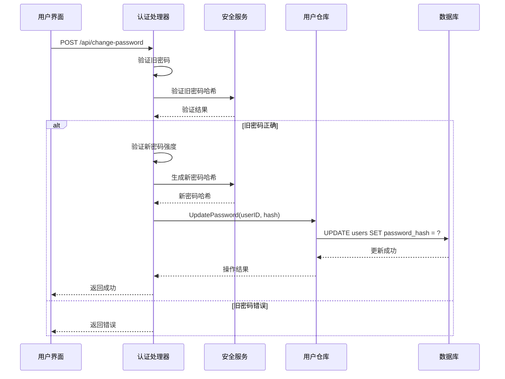

**图表来源**
- [auth_handler.go:1-100](file://inv_api_server/internal/handler/auth_handler.go#L1-L100)
- [repositories.go:210-214](file://inv_api_server/internal/repository/repositories.go#L210-L214)

#### 登录设备管理

登录设备管理功能允许用户查看和管理当前登录的设备：

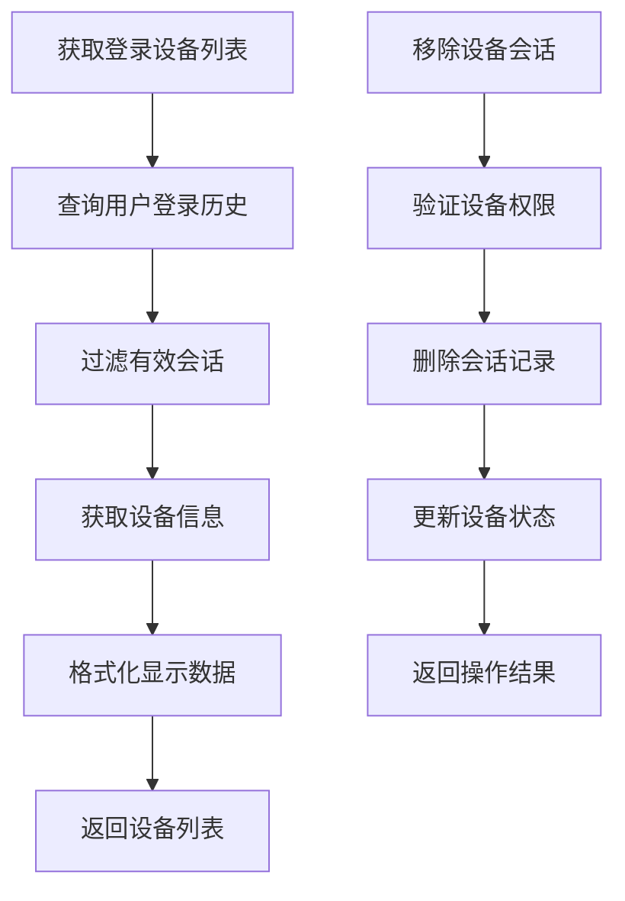

**图表来源**
- [repositories.go:227-231](file://inv_api_server/internal/repository/repositories.go#L227-L231)
- [auth_handler.go:1-100](file://inv_api_server/internal/handler/auth_handler.go#L1-L100)

**章节来源**
- [auth_handler.go:1-150](file://inv_api_server/internal/handler/auth_handler.go#L1-L150)
- [repositories.go:210-237](file://inv_api_server/internal/repository/repositories.go#L210-L237)

### 用户偏好设置组件

#### 个性化配置管理

用户偏好设置提供了丰富的个性化配置选项：

| 配置类别 | 配置项 | 默认值 | 描述 |
|---------|--------|--------|------|
| 界面设置 | 主题模式 | 浅色 | 明暗主题切换 |
| 界面设置 | 语言 | 中文简体 | 系统语言选择 |
| 界面设置 | 时区 | 系统时区 | 用户偏好的时区设置 |
| 通知设置 | 通知开关 | 开启 | 是否接收系统通知 |
| 通知设置 | 通知类型 | 全部 | 通知类型过滤 |
| 统计设置 | 数据范围 | 7天 | 数据统计的时间范围 |
| 统计设置 | 图表类型 | 折线图 | 数据可视化类型 |

#### 数据统计偏好

数据统计偏好设置支持多种数据展示方式：

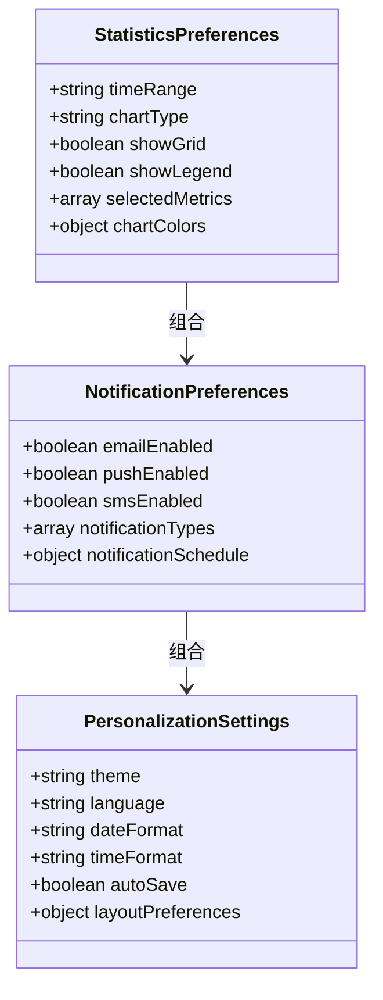

**图表来源**
- [localeStore.ts:1-100](file://inv_admin_frontend/src/stores/localeStore.ts#L1-L100)
- [timezoneStore.ts:1-100](file://inv_admin_frontend/src/stores/timezoneStore.ts#L1-L100)

**章节来源**
- [localeStore.ts:1-100](file://inv_admin_frontend/src/stores/localeStore.ts#L1-L100)
- [timezoneStore.ts:1-100](file://inv_admin_frontend/src/stores/timezoneStore.ts#L1-L100)

## 依赖关系分析

个人中心模块的依赖关系体现了清晰的关注点分离：

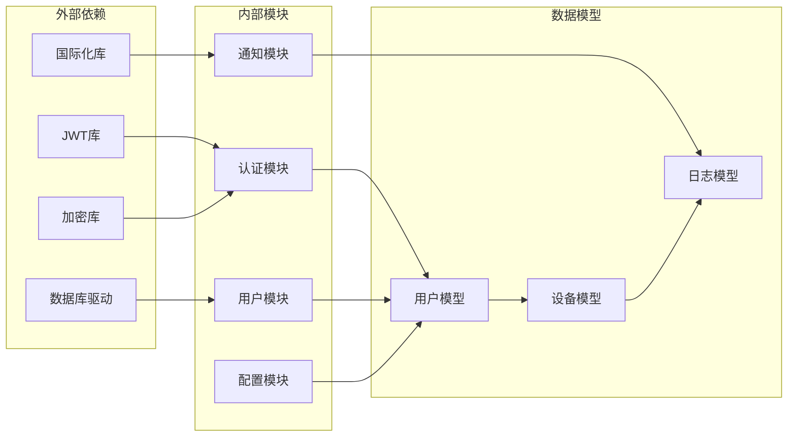

**图表来源**
- [jwt.go:1-100](file://inv_api_server/pkg/jwt/jwt.go#L1-L100)
- [models.go:1-50](file://inv_api_server/internal/model/models.go#L1-L50)
- [main.go:400-500](file://inv_api_server/cmd/main.go#L400-L500)

**章节来源**
- [jwt.go:1-100](file://inv_api_server/pkg/jwt/jwt.go#L1-L100)
- [models.go:1-50](file://inv_api_server/internal/model/models.go#L1-L50)
- [main.go:400-500](file://inv_api_server/cmd/main.go#L400-L500)

## 性能考虑

个人中心模块在设计时充分考虑了性能优化：

### 缓存策略
- **用户信息缓存**：使用Redis缓存用户基本信息，减少数据库查询压力
- **配置信息缓存**：缓存用户偏好设置，提高响应速度
- **会话信息缓存**：缓存JWT令牌，避免重复验证

### 数据库优化
- **索引优化**：为常用查询字段建立适当索引
- **连接池管理**：合理配置数据库连接池大小
- **查询优化**：使用预编译语句防止SQL注入

### 前端性能
- **懒加载**：按需加载模块和组件
- **状态缓存**：使用本地存储缓存用户状态
- **防抖处理**：对频繁操作进行防抖处理

## 故障排除指南

### 常见问题及解决方案

#### 用户信息更新失败
**问题描述**：用户信息更新后无法保存或显示异常
**可能原因**：
- 数据库连接异常
- 输入参数验证失败
- 权限不足

**解决步骤**：
1. 检查数据库连接状态
2. 验证输入参数格式
3. 确认用户权限级别
4. 查看服务器日志

#### 头像上传失败
**问题描述**：头像上传过程中出现错误
**可能原因**：
- 文件类型不支持
- 文件大小超出限制
- 服务器存储空间不足

**解决步骤**：
1. 检查文件格式是否为允许的类型
2. 验证文件大小是否超过限制
3. 确认服务器磁盘空间充足
4. 检查文件权限设置

#### 密码修改失败
**问题描述**：密码修改操作无法完成
**可能原因**：
- 旧密码验证失败
- 新密码不符合安全要求
- 数据库事务处理异常

**解决步骤**：
1. 确认旧密码输入正确
2. 检查新密码复杂度要求
3. 查看数据库事务日志
4. 重试密码修改操作

**章节来源**
- [auth_handler.go:1-200](file://inv_api_server/internal/handler/auth_handler.go#L1-L200)
- [repositories.go:210-237](file://inv_api_server/internal/repository/repositories.go#L210-L237)

## 结论

个人中心模块作为用户管理系统的核心组件，提供了完整而强大的用户管理功能。通过合理的架构设计和严格的实现规范，该模块能够满足现代Web应用对用户管理的各种需求。

模块的主要优势包括：
- **安全性**：完善的认证授权机制和数据保护措施
- **可扩展性**：模块化的架构设计便于功能扩展
- **用户体验**：直观的界面设计和流畅的操作体验
- **性能优化**：多层次的性能优化策略确保系统稳定运行

未来可以进一步增强的功能包括：
- 增强用户行为分析能力
- 扩展个性化推荐算法
- 优化多设备同步机制
- 加强数据备份和恢复功能

通过持续的优化和完善，个人中心模块将为用户提供更加优质的服务体验。