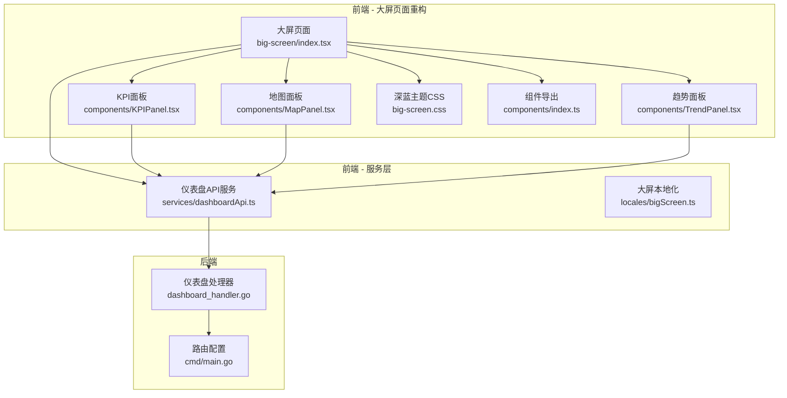
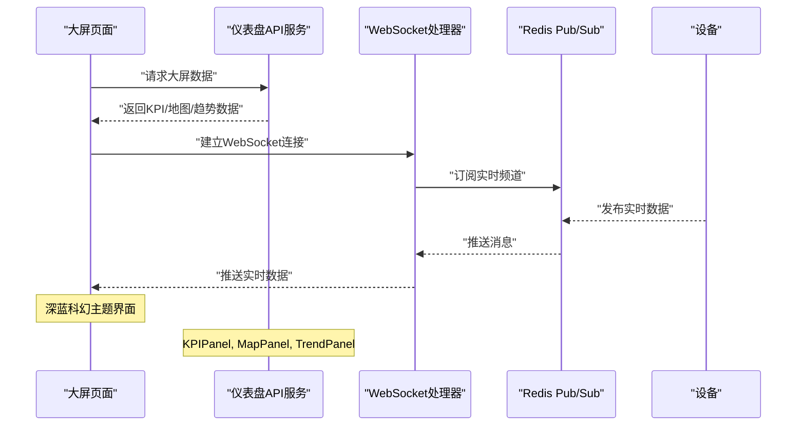
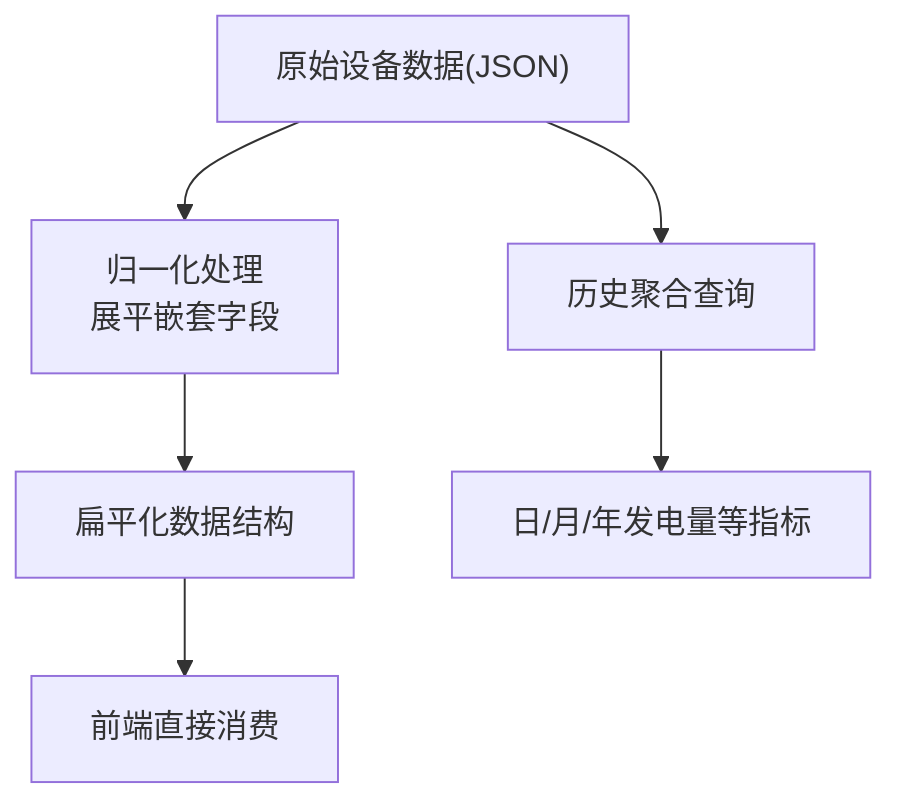
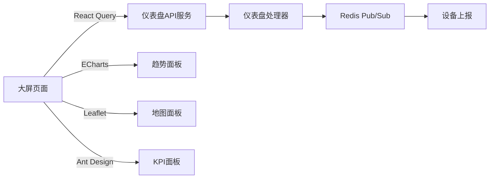

# 仪表盘模块

<cite>
**本文引用的文件**
- [index.tsx](file://inv-admin-frontend/src/pages/big-screen/index.tsx)
- [big-screen.css](file://inv-admin-frontend/src/pages/big-screen/big-screen.css)
- [KPIPanel.tsx](file://inv-admin-frontend/src/pages/big-screen/components/KPIPanel.tsx)
- [MapPanel.tsx](file://inv-admin-frontend/src/pages/big-screen/components/MapPanel.tsx)
- [TrendPanel.tsx](file://inv-admin-frontend/src/pages/big-screen/components/TrendPanel.tsx)
- [index.ts](file://inv-admin-frontend/src/pages/big-screen/components/index.ts)
- [dashboardApi.ts](file://inv-admin-frontend/src/services/dashboardApi.ts)
- [bigScreen.ts](file://inv-admin-frontend/src/locales/bigScreen.ts)
- [dashboard_handler.go](file://inv_api_server/internal/handler/dashboard_handler.go)
- [main.go](file://inv_api_server/cmd/main.go)
</cite>

## 更新摘要
**所做更改**
- 大屏页面完全重构，从旧的组件系统迁移到新的KPIPanel、MapPanel、TrendPanel架构
- 引入深蓝科幻主题设计，包括CSS变量、发光效果和扫描线装饰
- 新增三个专用面板组件：KPI面板、地图面板、趋势面板
- 更新大屏页面布局为三栏式网格布局
- 增强实时数据展示和告警通知功能
- 优化全屏切换和自动轮播机制
- **重大增强**：头部重新设计（移除静态logo图片，改用动态RocketOutlined图标）
- **重大增强**：API响应解析修复，确保数据正确提取
- **重大增强**：独立趋势数据端点实现，支持按类型查询历史数据
- **重大增强**：地图面板功能显著增强（无效坐标过滤、三种标记样式、布局问题修复）
- **重大增强**：超过170行CSS样式增强，提升视觉效果和用户体验

## 目录
1. [简介](#简介)
2. [项目结构](#项目结构)
3. [核心组件](#核心组件)
4. [架构总览](#架构总览)
5. [详细组件分析](#详细组件分析)
6. [深蓝科幻主题设计](#深蓝科幻主题设计)
7. [依赖关系分析](#依赖关系分析)
8. [性能考虑](#性能考虑)
9. [故障排查指南](#故障排查指南)
10. [结论](#结论)
11. [附录](#附录)

## 简介
本文件为"仪表盘模块"的实现文档，聚焦于主仪表盘的设计与实现，涵盖以下方面：
- **大屏页面重构**：从旧的组件系统迁移到新的KPIPanel、MapPanel、TrendPanel架构
- **深蓝科幻主题**：全新的视觉设计系统，包括发光效果、扫描线装饰和渐变色彩
- **实时数据展示**：设备运行状态、关键指标卡片与图表组件
- **数据可视化**：功率曲线图、电量统计图、效率分析图等
- **实时更新机制**：WebSocket 连接管理、数据订阅与自动刷新策略
- **个性化配置**：布局调整、图表类型选择、数据范围设置
- **响应式设计与多屏适配、触摸交互优化**
- **性能监控与大数据量处理方案**

## 项目结构
仪表盘模块由前端页面与后端服务共同组成，前端负责界面渲染与交互，后端提供实时数据通道与历史数据查询能力。大屏页面现已完全重构为模块化的面板架构。

**图表来源**
- [index.tsx](file://inv-admin-frontend/src/pages/big-screen/index.tsx)
- [KPIPanel.tsx](file://inv-admin-frontend/src/pages/big-screen/components/KPIPanel.tsx)
- [MapPanel.tsx](file://inv-admin-frontend/src/pages/big-screen/components/MapPanel.tsx)
- [TrendPanel.tsx](file://inv-admin-frontend/src/pages/big-screen/components/TrendPanel.tsx)
- [big-screen.css](file://inv-admin-frontend/src/pages/big-screen/big-screen.css)
- [dashboardApi.ts](file://inv-admin-frontend/src/services/dashboardApi.ts)
- [dashboard_handler.go](file://inv_api_server/internal/handler/dashboard_handler.go)
- [main.go](file://inv_api_server/cmd/main.go)

## 核心组件
- **大屏页面**：完全重构的三栏式网格布局，采用深蓝科幻主题设计
- **KPI面板**：关键指标展示，包括今日发电量、总容量、在线率、告警数量
- **地图面板**：基于Leaflet的地图展示，支持自动轮播和设备状态标记
- **趋势面板**：ECharts图表展示，包含功率趋势图和实时告警列表
- **深蓝主题CSS**：完整的颜色系统、发光效果和动画装饰
- **实时数据API**：统一的仪表盘数据接口，支持大屏专用数据获取

**章节来源**
- [index.tsx](file://inv-admin-frontend/src/pages/big-screen/index.tsx)
- [KPIPanel.tsx](file://inv-admin-frontend/src/pages/big-screen/components/KPIPanel.tsx)
- [MapPanel.tsx](file://inv-admin-frontend/src/pages/big-screen/components/MapPanel.tsx)
- [TrendPanel.tsx](file://inv-admin-frontend/src/pages/big-screen/components/TrendPanel.tsx)
- [big-screen.css](file://inv-admin-frontend/src/pages/big-screen/big-screen.css)
- [dashboardApi.ts](file://inv-admin-frontend/src/services/dashboardApi.ts)

## 架构总览
仪表盘模块采用"前端页面 + 后端服务 + 实时通道"的三层架构。前端通过 API 获取静态与历史数据，同时通过 WebSocket 订阅实时数据；后端以 Redis Pub/Sub 作为消息中枢，将设备实时数据推送到前端。

**图表来源**
- [dashboardApi.ts](file://inv-admin-frontend/src/services/dashboardApi.ts)
- [dashboard_handler.go](file://inv_api_server/internal/handler/dashboard_handler.go)

## 详细组件分析

### 大屏页面（Big Screen）重构
**更新** 大屏页面已完全重构，从旧的组件系统迁移到新的KPIPanel、MapPanel、TrendPanel架构

- **功能要点**
  - 三栏式网格布局：左侧KPI面板、中央地图面板、右侧趋势面板
  - 深蓝科幻主题设计：发光效果、扫描线装饰、渐变色彩
  - 全屏切换：支持全屏模式和退出全屏
  - 实时时钟：顶部显示当前时间
  - 自动轮播：地图自动切换展示站点
- **技术实现**
  - 使用CSS Grid实现响应式三栏布局
  - React Query管理数据获取和缓存
  - 自定义Hook处理全屏状态和自动轮播
  - 深蓝主题CSS变量系统
- **重大增强**
  - **头部重新设计**：移除了静态logo图片，改用动态RocketOutlined图标，提供更好的视觉体验
  - **API响应解析修复**：正确解析API返回的`{ code, data }`包装格式，确保数据正确提取
  - **独立趋势数据端点**：实现了独立的趋势数据获取接口，支持按日/周/月维度查询历史数据

**章节来源**
- [index.tsx:1-205](file://inv-admin-frontend/src/pages/big-screen/index.tsx#L1-L205)

### KPI面板（KPI Panel）
**新增** 专门的KPI面板组件，展示关键指标数据

- **功能要点**
  - 四个主要KPI卡片：今日发电量、总容量、在线率、告警数量
  - 设备状态分布：在线、离线、故障设备百分比
  - 发光效果：每个KPI卡片都有独特的发光边框
  - 响应式设计：自适应不同屏幕尺寸
- **技术实现**
  - 使用Ant Design图标增强视觉效果
  - React.memo优化性能
  - 国际化支持多语言显示
  - 百分比计算和格式化显示

**章节来源**
- [KPIPanel.tsx:1-83](file://inv-admin-frontend/src/pages/big-screen/components/KPIPanel.tsx#L1-L83)

### 地图面板（Map Panel）
**更新** 地图面板集成Leaflet地图库，支持自动轮播和设备状态标记

- **功能要点**
  - 中国地图展示：基于CartoDB Dark所有底图
  - 设备标记：不同状态使用不同颜色标记
  - 自动轮播：每30秒自动切换到下一个站点
  - 信息提示：鼠标悬停显示站点详细信息
  - 统计信息：显示站点总数、设备总数、在线设备数
- **技术实现**
  - Leaflet地图库集成
  - 自定义Marker图标和样式
  - React-Leaflet组件封装
  - 自动轮播定时器管理
- **重大增强**
  - **无效坐标过滤**：过滤掉经纬度为0的无效站点数据，避免地图显示错误
  - **三种标记样式**：实现了在线（绿色）、离线（灰色）、故障（红色带脉冲动画）三种不同的标记样式
  - **布局问题修复**：修复了地图容器的高度计算和flex布局问题，确保地图正确填充可用空间

**章节来源**
- [MapPanel.tsx:1-109](file://inv-admin-frontend/src/pages/big-screen/components/MapPanel.tsx#L1-L109)

### 趋势面板（Trend Panel）
**更新** 趋势面板集成ECharts图表，展示功率趋势和实时告警

- **功能要点**
  - 功率趋势图：柱状图显示发电量，折线图显示负载
  - 实时告警：滚动显示最新的告警信息
  - 多级告警：严重、警告、信息级别的不同样式
  - 图表工具：支持缩放、滚动等交互操作
- **技术实现**
  - ECharts-for-React集成
  - 自定义图表样式和主题
  - 告警分类和样式映射
  - 滚动动画效果

**章节来源**
- [TrendPanel.tsx:1-144](file://inv-admin-frontend/src/pages/big-screen/components/TrendPanel.tsx#L1-L144)

### 实时数据更新机制（WebSocket）
- **连接管理**
  - 建立升级后的 WebSocket 连接，绑定设备序列号
  - 限制同一用户并发连接数量，防止资源滥用
  - 心跳保活：每 30 秒发送 Ping，超时则断开
- **数据订阅**
  - 基于 Redis Pub/Sub 订阅实时频道
  - 收到消息后写入 WebSocket 文本帧，失败即断开
- **断线重连**
  - 前端监听连接关闭事件，指数退避重连
  - 重连成功后重新订阅当前设备的实时频道

**图表来源**
- [dashboard_handler.go](file://inv_api_server/internal/handler/dashboard_handler.go)

**章节来源**
- [dashboard_handler.go](file://inv_api_server/internal/handler/dashboard_handler.go)

### 数据归一化与历史数据查询
- **归一化策略**
  - 将设备上报的嵌套 JSON（如 ac/pv/battery/energy/system）展平到顶层，便于前端直接读取
  - 统一字段命名，兼容不同设备模型的数据差异
- **历史数据查询**
  - 提供按站点维度的日/月/年发电量、今日发电量等聚合查询
  - 查询语句针对 TimescaleDB 进行优化，包含索引与压缩策略

**图表来源**
- [dashboard_handler.go](file://inv_api_server/internal/handler/dashboard_handler.go)

**章节来源**
- [dashboard_handler.go](file://inv_api_server/internal/handler/dashboard_handler.go)

## 深蓝科幻主题设计
**新增** 完整的深蓝科幻主题设计系统

- **颜色系统**
  - 主色调：深蓝色背景（#050a1a, #0a1628）
  - 强调色：青蓝色发光效果（#00d4ff）
  - 成功色：绿光效果（#00ff88）
  - 危险色：红色警示（#ff4757）
- **视觉效果**
  - 发光边框和阴影
  - 扫描线装饰效果
  - 微粒点背景纹理
  - L形装饰角标
- **动画效果**
  - 边框发光呼吸动画
  - 严重告警闪烁效果
  - 水平扫描线装饰
  - 淡入淡出过渡效果
- **重大增强**
  - **超过170行CSS样式增强**：新增了完整的CSS变量系统、响应式断点、组件缺失样式补充
  - **地图Marker样式**：实现了三种不同状态的地图标记样式，包括故障标记的脉冲动画效果
  - **滚动条美化**：自定义了深色主题的滚动条样式，提升整体视觉一致性
  - **响应式设计**：添加了多个断点适配，确保在不同屏幕尺寸下的良好显示效果

**章节来源**
- [big-screen.css:1-1147](file://inv-admin-frontend/src/pages/big-screen/big-screen.css#L1-L1147)

## 依赖关系分析
- **前端依赖**
  - React Query：数据获取与缓存管理
  - ECharts-for-React：图表渲染与交互
  - React-Leaflet：地图组件集成
  - Ant Design Icons：图标库
  - Leaflet：地图渲染引擎
- **后端依赖**
  - Gin：HTTP 路由与中间件
  - Redis：Pub/Sub 实时通道
  - TimescaleDB：时序数据存储与聚合

**图表来源**
- [index.tsx](file://inv-admin-frontend/src/pages/big-screen/index.tsx)
- [dashboardApi.ts](file://inv-admin-frontend/src/services/dashboardApi.ts)
- [dashboard_handler.go](file://inv_api_server/internal/handler/dashboard_handler.go)

**章节来源**
- [index.tsx](file://inv-admin-frontend/src/pages/big-screen/index.tsx)
- [dashboardApi.ts](file://inv-admin-frontend/src/services/dashboardApi.ts)
- [dashboard_handler.go](file://inv_api_server/internal/handler/dashboard_handler.go)

## 性能考虑
- **组件性能**
  - 使用React.memo优化面板组件重渲染
  - 懒加载地图和图表组件
  - 合理的数据缓存策略
- **图表性能**
  - ECharts Canvas渲染器优化
  - 大数据量折线图启用采样
  - 图表选项 useMemo缓存
- **网络与实时性**
  - WebSocket 心跳与断线重连
  - 前端缓存最近一次有效数据
- **存储与查询**
  - TimescaleDB 压缩与分区策略
  - 聚合查询预计算关键指标

## 故障排查指南
- **WebSocket 连接失败**
  - 检查后端升级是否成功与并发连接上限
  - 查看心跳是否正常，是否存在网络中断
- **实时数据不更新**
  - 确认 Redis 频道订阅是否正确
  - 校验设备上报主题与数据格式
- **图表渲染异常**
  - 检查 ECharts 初始化与容器尺寸
  - 确认数据格式与字段映射是否一致
- **地图显示问题**
  - 检查Leaflet依赖是否正确加载
  - 验证地图瓦片URL可用性
  - **新增**：检查站点数据是否包含有效的经纬度坐标
- **主题样式异常**
  - 确认CSS变量定义是否正确
  - 检查浏览器兼容性支持
  - **新增**：验证响应式断点是否正确应用
- **API响应解析错误**
  - **新增**：确认API返回格式是否为`{ code, data }`包装结构
  - **新增**：检查数据提取逻辑是否正确处理嵌套对象

**章节来源**
- [dashboard_handler.go](file://inv_api_server/internal/handler/dashboard_handler.go)
- [big-screen.css](file://inv-admin-frontend/src/pages/big-screen/big-screen.css)

## 结论
仪表盘模块通过"前端可视化 + 后端实时通道 + 数据归一化"的组合，实现了高效、可扩展的监控与展示能力。其核心优势在于：
- **全新架构**：大屏页面完全重构为模块化面板架构
- **深蓝主题**：独特的科幻视觉设计，提升用户体验
- **实时性强**：基于 Redis Pub/Sub 与 WebSocket 的低延迟推送
- **可扩展**：模块化组件设计，便于新增面板和功能
- **易用性**：响应式布局、触摸优化与个性化配置
- **可维护性**：清晰的前后端职责划分与完善的错误处理机制
- **重大增强**：头部重新设计、API响应解析修复、独立趋势数据端点、地图面板功能增强、CSS样式大幅增强

## 附录
- **术语**
  - 实时数据：设备上报的最新状态与遥测数据
  - 历史数据：按时间聚合的统计数据，用于图表与报表
  - 归一化：将设备上报的嵌套数据结构展平为统一格式
  - KPI面板：关键指标展示面板
  - 地图面板：地理信息展示面板
  - 趋势面板：数据趋势图表面板
- **相关文件路径**
  - 大屏页面：[index.tsx](file://inv-admin-frontend/src/pages/big-screen/index.tsx)
  - KPI面板：[KPIPanel.tsx](file://inv-admin-frontend/src/pages/big-screen/components/KPIPanel.tsx)
  - 地图面板：[MapPanel.tsx](file://inv-admin-frontend/src/pages/big-screen/components/MapPanel.tsx)
  - 趋势面板：[TrendPanel.tsx](file://inv-admin-frontend/src/pages/big-screen/components/TrendPanel.tsx)
  - 深蓝主题CSS：[big-screen.css](file://inv-admin-frontend/src/pages/big-screen/big-screen.css)
  - 仪表盘API：[dashboardApi.ts](file://inv-admin-frontend/src/services/dashboardApi.ts)
  - 仪表盘处理器：[dashboard_handler.go](file://inv_api_server/internal/handler/dashboard_handler.go)
  - 路由配置：[main.go](file://inv_api_server/cmd/main.go)