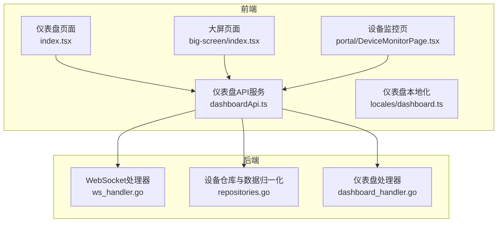
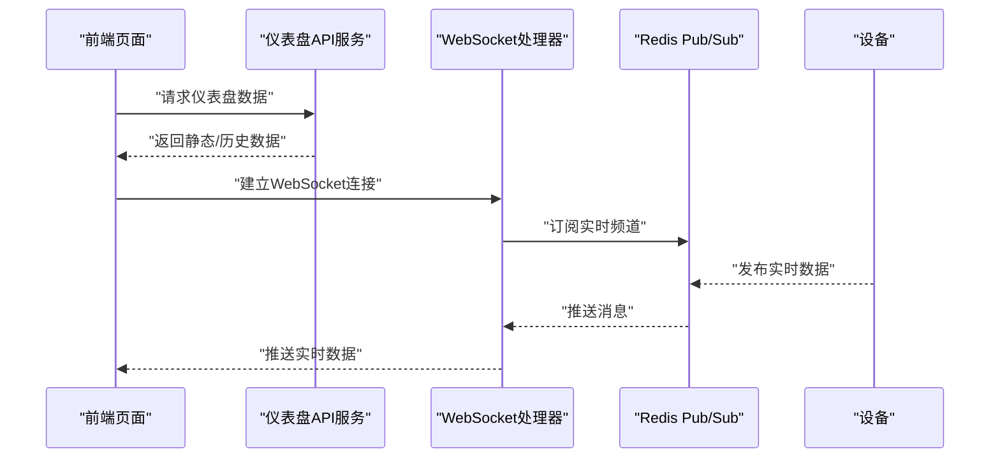
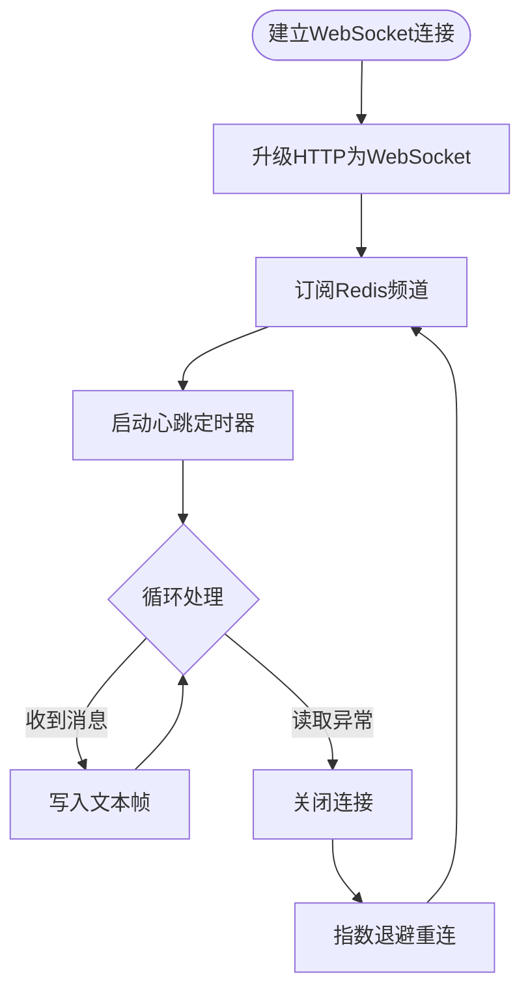
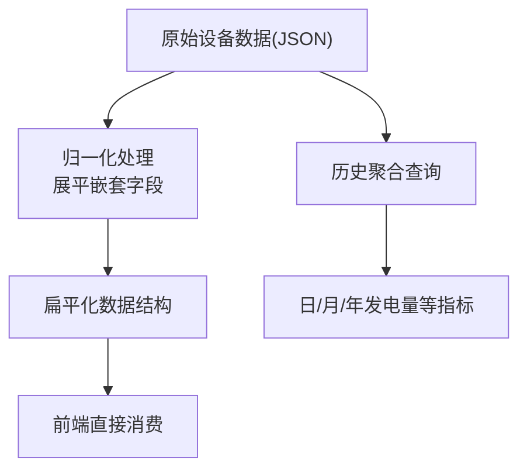
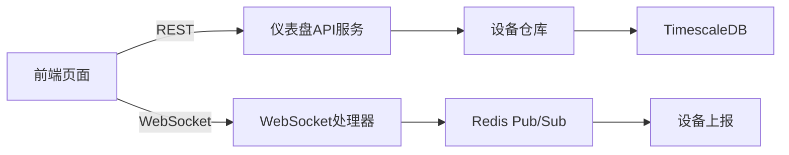

# 仪表盘模块

<cite>
**本文引用的文件**
- [dashboard.ts](file://inv-admin-frontend/src/locales/dashboard.ts)
- [dashboardApi.ts](file://inv-admin-frontend/src/services/dashboardApi.ts)
- [index.tsx](file://inv-admin-frontend/src/pages/dashboard/index.tsx)
- [index.tsx](file://inv-admin-frontend/src/pages/big-screen/index.tsx)
- [DeviceMonitorPage.tsx](file://inv-admin-frontend/src/pages/portal/DeviceMonitorPage.tsx)
- [ws_handler.go](file://inv_api_server/internal/handler/ws_handler.go)
- [repositories.go](file://inv_api_server/internal/repository/repositories.go)
- [dashboard_handler.go](file://inv_api_server/internal/handler/dashboard_handler.go)
</cite>

## 目录
1. [简介](#简介)
2. [项目结构](#项目结构)
3. [核心组件](#核心组件)
4. [架构总览](#架构总览)
5. [详细组件分析](#详细组件分析)
6. [依赖关系分析](#依赖关系分析)
7. [性能考虑](#性能考虑)
8. [故障排查指南](#故障排查指南)
9. [结论](#结论)
10. [附录](#附录)

## 简介
本文件为“仪表盘模块”的实现文档，聚焦于主仪表盘的设计与实现，涵盖以下方面：
- 实时数据展示：设备运行状态、关键指标卡片与图表组件
- 数据可视化：功率曲线图、电量统计图、效率分析图等
- 实时更新机制：WebSocket 连接管理、数据订阅与自动刷新策略
- 个性化配置：布局调整、图表类型选择、数据范围设置
- 响应式设计与多屏适配、触摸交互优化
- 性能监控与大数据量处理方案

## 项目结构
仪表盘模块由前端页面与后端服务共同组成，前端负责界面渲染与交互，后端提供实时数据通道与历史数据查询能力。

**图表来源**
- [index.tsx](file://inv-admin-frontend/src/pages/dashboard/index.tsx)
- [index.tsx](file://inv-admin-frontend/src/pages/big-screen/index.tsx)
- [DeviceMonitorPage.tsx](file://inv-admin-frontend/src/pages/portal/DeviceMonitorPage.tsx)
- [dashboardApi.ts](file://inv-admin-frontend/src/services/dashboardApi.ts)
- [dashboard.ts](file://inv-admin-frontend/src/locales/dashboard.ts)
- [ws_handler.go](file://inv_api_server/internal/handler/ws_handler.go)
- [repositories.go](file://inv_api_server/internal/repository/repositories.go)
- [dashboard_handler.go](file://inv_api_server/internal/handler/dashboard_handler.go)

**章节来源**
- [index.tsx](file://inv-admin-frontend/src/pages/dashboard/index.tsx)
- [index.tsx](file://inv-admin-frontend/src/pages/big-screen/index.tsx)
- [DeviceMonitorPage.tsx](file://inv-admin-frontend/src/pages/portal/DeviceMonitorPage.tsx)
- [dashboardApi.ts](file://inv-admin-frontend/src/services/dashboardApi.ts)
- [dashboard.ts](file://inv-admin-frontend/src/locales/dashboard.ts)
- [ws_handler.go](file://inv_api_server/internal/handler/ws_handler.go)
- [repositories.go](file://inv_api_server/internal/repository/repositories.go)
- [dashboard_handler.go](file://inv_api_server/internal/handler/dashboard_handler.go)

## 核心组件
- 仪表盘页面：聚合关键指标、实时图表与设备概览，支持个性化布局与图表类型切换
- 大屏页面：面向集中控制中心的全屏展示，强调可视化密度与信息层级
- 设备监控页：单体设备详情与功率趋势图，支撑实时诊断与运维
- WebSocket 实时通道：基于 Redis Pub/Sub 的消息分发，保障低延迟推送
- 数据归一化层：统一设备上报数据结构，便于前端直读
- 仪表盘 API 服务：封装前端请求、参数校验与数据聚合逻辑

**章节来源**
- [index.tsx](file://inv-admin-frontend/src/pages/dashboard/index.tsx)
- [index.tsx](file://inv-admin-frontend/src/pages/big-screen/index.tsx)
- [DeviceMonitorPage.tsx](file://inv-admin-frontend/src/pages/portal/DeviceMonitorPage.tsx)
- [dashboardApi.ts](file://inv-admin-frontend/src/services/dashboardApi.ts)
- [repositories.go](file://inv_api_server/internal/repository/repositories.go)
- [ws_handler.go](file://inv_api_server/internal/handler/ws_handler.go)

## 架构总览
仪表盘模块采用“前端页面 + 后端服务 + 实时通道”的三层架构。前端通过 API 获取静态与历史数据，同时通过 WebSocket 订阅实时数据；后端以 Redis Pub/Sub 作为消息中枢，将设备实时数据推送到前端。

**图表来源**
- [dashboardApi.ts](file://inv-admin-frontend/src/services/dashboardApi.ts)
- [ws_handler.go](file://inv_api_server/internal/handler/ws_handler.go)
- [repositories.go](file://inv_api_server/internal/repository/repositories.go)

## 详细组件分析

### 仪表盘页面（Dashboard）
- 功能要点
  - 关键指标卡片：日发电量、累计发电量、设备在线率、效率等
  - 图表组件：功率曲线图、电量统计图、效率分析图
  - 个性化配置：布局调整、图表类型切换、时间范围设置
  - 响应式布局：自适应不同屏幕尺寸，移动端触摸优化
- 技术实现
  - 使用 ECharts 渲染图表，按需加载与懒初始化减少首屏压力
  - 指标卡片采用轻量组件，避免复杂计算与重绘
  - 时间范围与图表类型通过本地状态管理，支持快速切换
  - 响应式断点使用 Ant Design 的栅格系统与媒体查询

**章节来源**
- [index.tsx](file://inv-admin-frontend/src/pages/dashboard/index.tsx)
- [dashboardApi.ts](file://inv-admin-frontend/src/services/dashboardApi.ts)
- [dashboard.ts](file://inv-admin-frontend/src/locales/dashboard.ts)

### 大屏页面（Big Screen）
- 功能要点
  - 全屏可视化：集中展示多个站点或设备的关键指标
  - 高密度图表：在有限空间内最大化信息承载
  - 自动轮播与定时刷新：提升信息时效性
- 技术实现
  - 使用 Ant Design 的 Card 与 Grid 组件进行布局
  - 图表采用紧凑样式与高对比度配色，确保远距离可读性
  - 刷新策略与仪表盘一致，避免频繁全量拉取

**章节来源**
- [index.tsx](file://inv-admin-frontend/src/pages/big-screen/index.tsx)

### 设备监控页（Device Monitor）
- 功能要点
  - 单体设备详情：实时功率、电流、电压、频率、功率因数、今日/累计发电量、电池状态、逆变器温度、工作状态
  - 功率趋势图：基于 ECharts 的折线图，展示近实时功率变化
  - 自动刷新：内置刷新标签与定时器，支持手动刷新
- 技术实现
  - 使用动态卡片与字段渲染组件，根据设备模型字段灵活展示
  - 功率趋势图通过 ECharts Core 渲染，支持交互缩放与工具栏
  - 实时数据来自 WebSocket 推送，结合本地缓存与防抖策略

**章节来源**
- [DeviceMonitorPage.tsx](file://inv-admin-frontend/src/pages/portal/DeviceMonitorPage.tsx)

### 实时数据更新机制（WebSocket）
- 连接管理
  - 建立升级后的 WebSocket 连接，绑定设备序列号
  - 限制同一用户并发连接数量，防止资源滥用
  - 心跳保活：每 30 秒发送 Ping，超时则断开
- 数据订阅
  - 基于 Redis Pub/Sub 订阅实时频道
  - 收到消息后写入 WebSocket 文本帧，失败即断开
- 断线重连
  - 前端监听连接关闭事件，指数退避重连
  - 重连成功后重新订阅当前设备的实时频道

**图表来源**
- [ws_handler.go](file://inv_api_server/internal/handler/ws_handler.go)

**章节来源**
- [ws_handler.go](file://inv_api_server/internal/handler/ws_handler.go)

### 数据归一化与历史数据查询
- 归一化策略
  - 将设备上报的嵌套 JSON（如 ac/pv/battery/energy/system）展平到顶层，便于前端直接读取
  - 统一字段命名，兼容不同设备模型的数据差异
- 历史数据查询
  - 提供按站点维度的日/月/年发电量、今日发电量等聚合查询
  - 查询语句针对 TimescaleDB 进行优化，包含索引与压缩策略

**图表来源**
- [repositories.go](file://inv_api_server/internal/repository/repositories.go)

**章节来源**
- [repositories.go](file://inv_api_server/internal/repository/repositories.go)

### 个性化配置与交互优化
- 布局调整
  - 使用拖拽排序与栅格系统，支持卡片位置与大小自定义
- 图表类型选择
  - 支持折线图、柱状图、面积图等切换，按需渲染
- 数据范围设置
  - 支持小时、日、周、月等时间粒度切换，动态刷新图表
- 响应式与触摸优化
  - 使用媒体查询与 Ant Design 响应式断点
  - 图表启用缩放与手势交互，移动端滚动优化

**章节来源**
- [index.tsx](file://inv-admin-frontend/src/pages/dashboard/index.tsx)
- [dashboardApi.ts](file://inv-admin-frontend/src/services/dashboardApi.ts)

## 依赖关系分析
- 前端依赖
  - ECharts：图表渲染与交互
  - Ant Design：UI 组件与栅格系统
  - React Query：数据获取与缓存
  - WebSocket 客户端：实时通信
- 后端依赖
  - Redis：Pub/Sub 实时通道
  - TimescaleDB：时序数据存储与聚合
  - Gin：HTTP 路由与中间件

**图表来源**
- [dashboardApi.ts](file://inv-admin-frontend/src/services/dashboardApi.ts)
- [ws_handler.go](file://inv_api_server/internal/handler/ws_handler.go)
- [repositories.go](file://inv_api_server/internal/repository/repositories.go)

**章节来源**
- [dashboardApi.ts](file://inv-admin-frontend/src/services/dashboardApi.ts)
- [ws_handler.go](file://inv_api_server/internal/handler/ws_handler.go)
- [repositories.go](file://inv_api_server/internal/repository/repositories.go)

## 性能考虑
- 图表性能
  - 懒加载与按需渲染，避免一次性渲染过多图表
  - 对大数据量折线图启用采样与阈值过滤
  - 使用 ECharts 的大数据优化选项（如大数据量折线图的采样）
- 网络与实时性
  - WebSocket 心跳与断线重连，保证长连接稳定性
  - 前端缓存最近一次有效数据，降低闪烁与空窗期
- 存储与查询
  - TimescaleDB 压缩与分区策略，减少扫描范围
  - 聚合查询预计算关键指标，缩短响应时间
- 前端渲染
  - 使用虚拟滚动与分页，避免一次性渲染大量表格项
  - 合理拆分组件，启用 React.memo 与 useMemo 降低重渲染

[本节为通用性能建议，不直接分析具体文件]

## 故障排查指南
- WebSocket 连接失败
  - 检查后端升级是否成功与并发连接上限
  - 查看心跳是否正常，是否存在网络中断
- 实时数据不更新
  - 确认 Redis 频道订阅是否正确
  - 校验设备上报主题与数据格式
- 图表渲染异常
  - 检查 ECharts 初始化与容器尺寸
  - 确认数据格式与字段映射是否一致
- 性能问题
  - 分析前端重渲染热点，优化依赖与缓存
  - 后端查询是否命中索引，必要时增加索引或分区

**章节来源**
- [ws_handler.go](file://inv_api_server/internal/handler/ws_handler.go)
- [repositories.go](file://inv_api_server/internal/repository/repositories.go)

## 结论
仪表盘模块通过“前端可视化 + 后端实时通道 + 数据归一化”的组合，实现了高效、可扩展的监控与展示能力。其核心优势在于：
- 实时性强：基于 Redis Pub/Sub 与 WebSocket 的低延迟推送
- 可扩展：数据归一化与模块化组件，便于新增指标与图表
- 易用性：响应式布局、触摸优化与个性化配置，满足多场景需求
- 可维护性：清晰的前后端职责划分与完善的错误处理机制

[本节为总结性内容，不直接分析具体文件]

## 附录
- 术语
  - 实时数据：设备上报的最新状态与遥测数据
  - 历史数据：按时间聚合的统计数据，用于图表与报表
  - 归一化：将设备上报的嵌套数据结构展平为统一格式
- 相关文件路径
  - 仪表盘页面：[index.tsx](file://inv-admin-frontend/src/pages/dashboard/index.tsx)
  - 大屏页面：[index.tsx](file://inv-admin-frontend/src/pages/big-screen/index.tsx)
  - 设备监控页：[DeviceMonitorPage.tsx](file://inv-admin-frontend/src/pages/portal/DeviceMonitorPage.tsx)
  - 仪表盘 API 服务：[dashboardApi.ts](file://inv-admin-frontend/src/services/dashboardApi.ts)
  - WebSocket 处理器：[ws_handler.go](file://inv_api_server/internal/handler/ws_handler.go)
  - 数据归一化与历史查询：[repositories.go](file://inv_api_server/internal/repository/repositories.go)