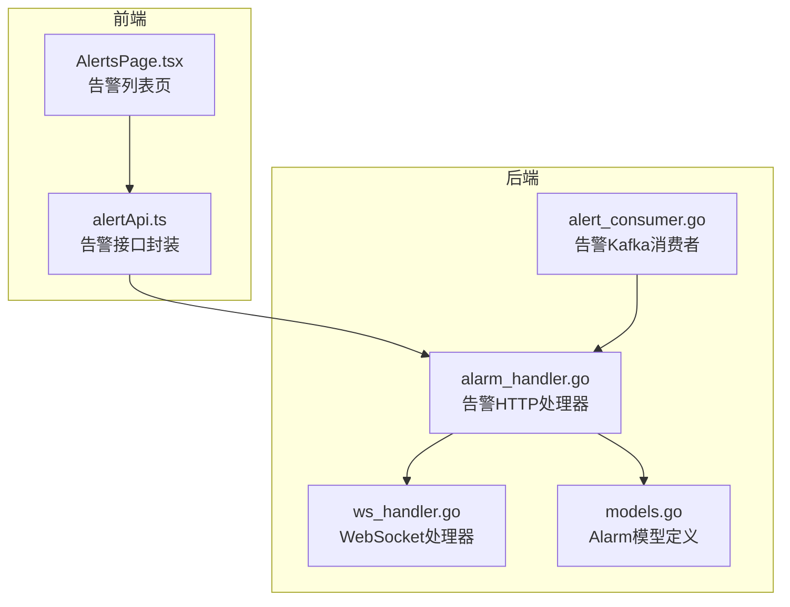
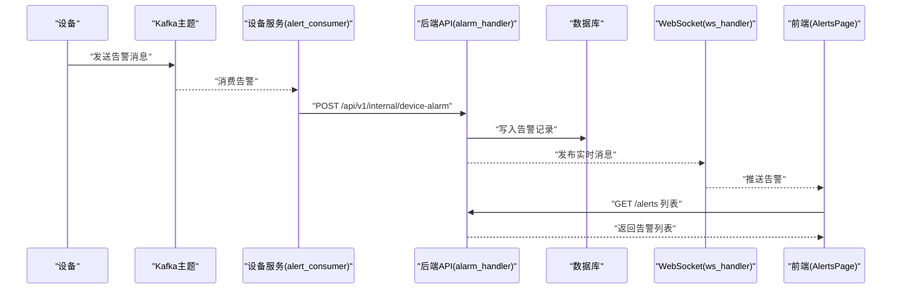
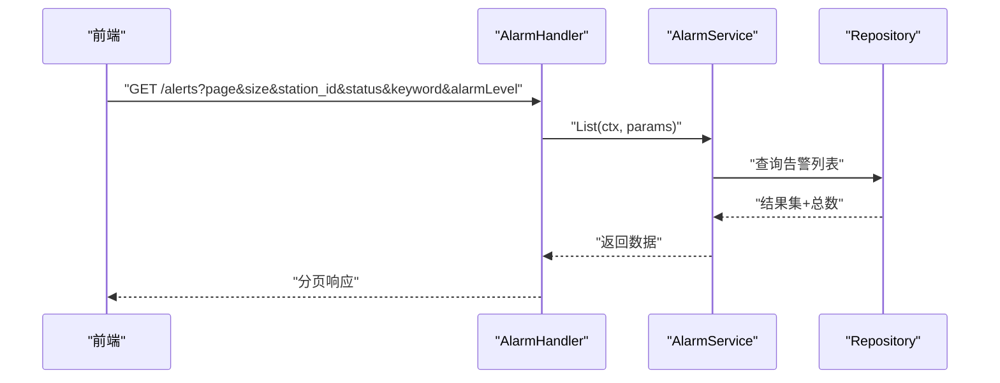
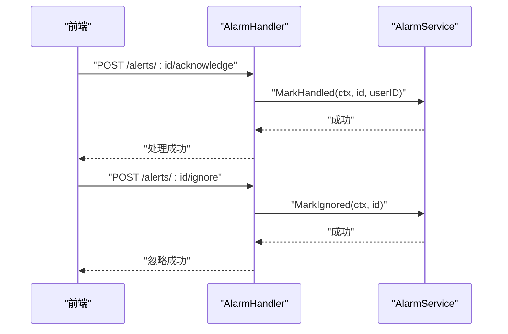
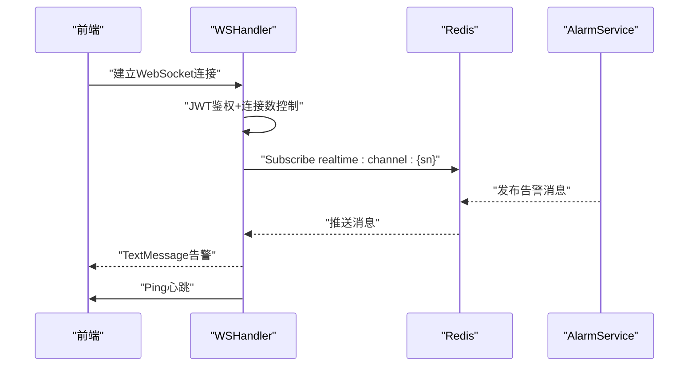
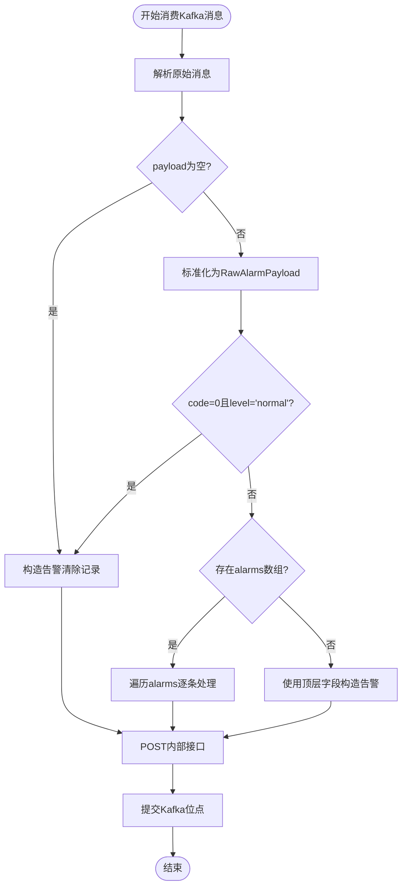
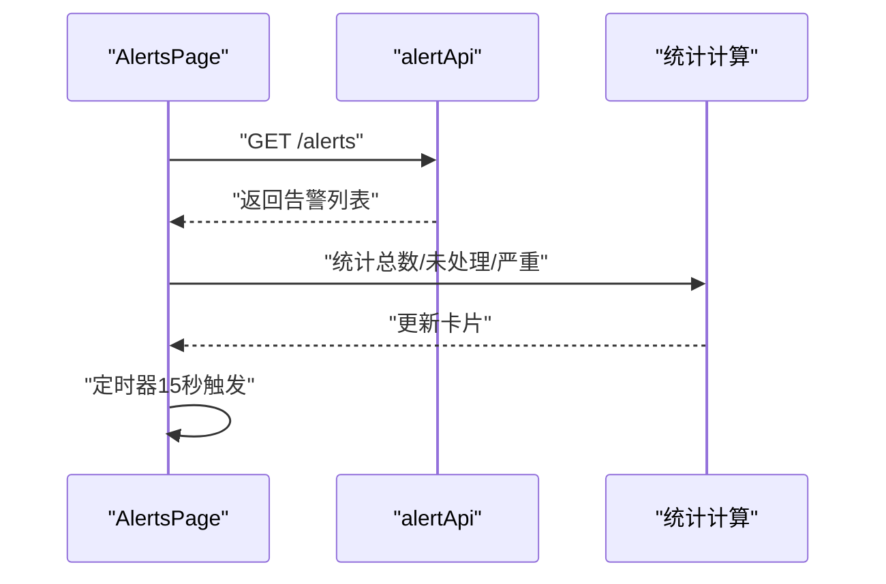
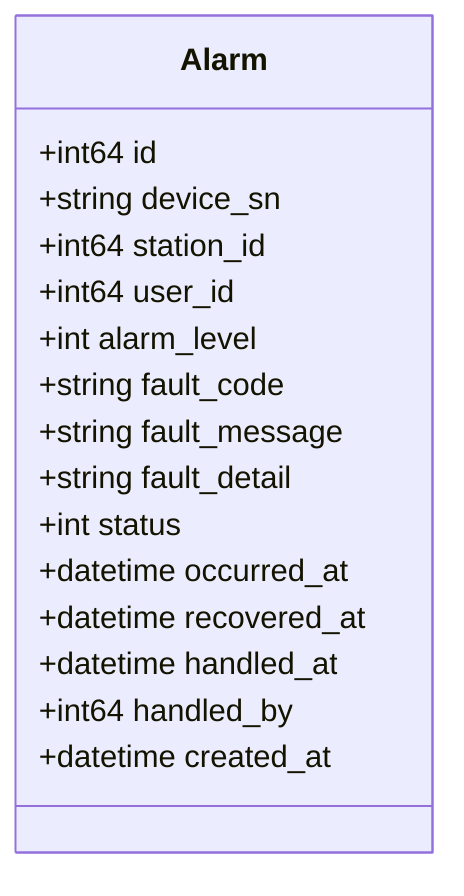
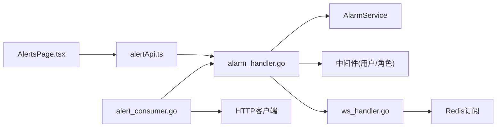

# 告警管理模块

<cite>
**本文档引用的文件**
- [inv_api_server/internal/handler/alarm_handler.go](file://inv_api_server/internal/handler/alarm_handler.go)
- [inv_api_server/internal/handler/ws_handler.go](file://inv_api_server/internal/handler/ws_handler.go)
- [inv_device_server/internal/service/alert_consumer.go](file://inv_device_server/internal/service/alert_consumer.go)
- [inv-admin-frontend/src/services/alertApi.ts](file://inv-admin-frontend/src/services/alertApi.ts)
- [inv-admin-frontend/src/pages/portal/AlertsPage.tsx](file://inv-admin-frontend/src/pages/portal/AlertsPage.tsx)
- [inv_api_server/internal/model/models.go](file://inv_api_server/internal/model/models.go)
- [inv_api_server/internal/handler/alert_rule_handler.go](file://inv_api_server/internal/handler/alert_rule_handler.go)
</cite>

## 目录
1. [简介](#简介)
2. [项目结构](#项目结构)
3. [核心组件](#核心组件)
4. [架构总览](#架构总览)
5. [详细组件分析](#详细组件分析)
6. [依赖关系分析](#依赖关系分析)
7. [性能考虑](#性能考虑)
8. [故障排除指南](#故障排除指南)
9. [结论](#结论)
10. [附录](#附录)

## 简介
本文件为告警管理模块的全面实现文档，覆盖告警列表与详情、实时推送、处理流程、过滤与搜索、统计分析等能力。后端采用 Go 微服务，前端基于 React+Ant Design，通过 Kafka 接收设备告警，经内部接口入库并通过 WebSocket 实时推送到前端。

## 项目结构
告警管理涉及以下关键位置：
- 后端 API 层：告警列表、详情、处理、统计、WebSocket 推送
- 设备侧服务：Kafka 告警消费、清洗与转发
- 前端页面：告警列表页、API 调用封装

**图表来源**
- [inv-admin-frontend/src/pages/portal/AlertsPage.tsx:1-154](file://inv-admin-frontend/src/pages/portal/AlertsPage.tsx#L1-L154)
- [inv-admin-frontend/src/services/alertApi.ts:1-18](file://inv-admin-frontend/src/services/alertApi.ts#L1-L18)
- [inv_api_server/internal/handler/alarm_handler.go:1-256](file://inv_api_server/internal/handler/alarm_handler.go#L1-L256)
- [inv_api_server/internal/handler/ws_handler.go:1-122](file://inv_api_server/internal/handler/ws_handler.go#L1-L122)
- [inv_device_server/internal/service/alert_consumer.go:1-329](file://inv_device_server/internal/service/alert_consumer.go#L1-L329)
- [inv_api_server/internal/model/models.go:130-145](file://inv_api_server/internal/model/models.go#L130-L145)

**章节来源**
- [inv-admin-frontend/src/pages/portal/AlertsPage.tsx:1-154](file://inv-admin-frontend/src/pages/portal/AlertsPage.tsx#L1-L154)
- [inv-admin-frontend/src/services/alertApi.ts:1-18](file://inv-admin-frontend/src/services/alertApi.ts#L1-L18)
- [inv_api_server/internal/handler/alarm_handler.go:1-256](file://inv_api_server/internal/handler/alarm_handler.go#L1-L256)
- [inv_api_server/internal/handler/ws_handler.go:1-122](file://inv_api_server/internal/handler/ws_handler.go#L1-L122)
- [inv_device_server/internal/service/alert_consumer.go:1-329](file://inv_device_server/internal/service/alert_consumer.go#L1-L329)
- [inv_api_server/internal/model/models.go:130-145](file://inv_api_server/internal/model/models.go#L130-L145)

## 核心组件
- 告警模型：包含设备序列号、告警级别、故障码、故障描述、状态、发生时间、处理时间等字段
- 告警处理器：提供列表、详情、标记已读、标记已处理、忽略、删除、清空等接口
- WebSocket 处理器：设备实时通道的认证、连接数限制、心跳与消息推送
- Kafka 告警消费者：解析设备告警消息、清洗与转发至内部接口
- 前端告警页面：轮询拉取、统计卡片、按级别筛选、自动刷新

**章节来源**
- [inv_api_server/internal/model/models.go:130-145](file://inv_api_server/internal/model/models.go#L130-L145)
- [inv_api_server/internal/handler/alarm_handler.go:22-256](file://inv_api_server/internal/handler/alarm_handler.go#L22-L256)
- [inv_api_server/internal/handler/ws_handler.go:39-122](file://inv_api_server/internal/handler/ws_handler.go#L39-L122)
- [inv_device_server/internal/service/alert_consumer.go:118-268](file://inv_device_server/internal/service/alert_consumer.go#L118-L268)
- [inv-admin-frontend/src/pages/portal/AlertsPage.tsx:18-38](file://inv-admin-frontend/src/pages/portal/AlertsPage.tsx#L18-L38)

## 架构总览
整体流程：设备侧通过 Kafka 发送告警，设备服务消费后清洗并调用后端内部接口写入；前端轮询或通过 WebSocket 接收实时告警。

**图表来源**
- [inv_device_server/internal/service/alert_consumer.go:270-300](file://inv_device_server/internal/service/alert_consumer.go#L270-L300)
- [inv_api_server/internal/handler/alarm_handler.go:22-72](file://inv_api_server/internal/handler/alarm_handler.go#L22-L72)
- [inv_api_server/internal/handler/ws_handler.go:87-121](file://inv_api_server/internal/handler/ws_handler.go#L87-L121)
- [inv-admin-frontend/src/pages/portal/AlertsPage.tsx:18-38](file://inv-admin-frontend/src/pages/portal/AlertsPage.tsx#L18-L38)

## 详细组件分析

### 告警列表与详情
- 列表接口支持分页、关键词、站点、状态、告警级别等参数，返回分页结果
- 详情接口校验权限，管理员可查看所有，普通用户仅限本人告警
- 统计接口返回告警总数、未处理数等

**图表来源**
- [inv_api_server/internal/handler/alarm_handler.go:22-72](file://inv_api_server/internal/handler/alarm_handler.go#L22-L72)
- [inv_api_server/internal/model/models.go:130-145](file://inv_api_server/internal/model/models.go#L130-L145)

**章节来源**
- [inv_api_server/internal/handler/alarm_handler.go:22-101](file://inv_api_server/internal/handler/alarm_handler.go#L22-L101)
- [inv_api_server/internal/model/models.go:130-145](file://inv_api_server/internal/model/models.go#L130-L145)

### 告警处理流程
- 确认/忽略/删除/清空等操作均进行权限校验
- 已处理与忽略会更新状态及处理人信息
- 前端通过 alertApi 调用对应接口

**图表来源**
- [inv_api_server/internal/handler/alarm_handler.go:169-231](file://inv_api_server/internal/handler/alarm_handler.go#L169-L231)
- [inv-admin-frontend/src/services/alertApi.ts:6-10](file://inv-admin-frontend/src/services/alertApi.ts#L6-L10)

**章节来源**
- [inv_api_server/internal/handler/alarm_handler.go:103-231](file://inv_api_server/internal/handler/alarm_handler.go#L103-L231)
- [inv-admin-frontend/src/services/alertApi.ts:1-18](file://inv-admin-frontend/src/services/alertApi.ts#L1-L18)

### 实时告警推送
- WebSocket 认证：使用 JWT 解析并限制单 JTI 最大连接数
- 心跳：每 30 秒发送 Ping，超时写入保护
- 订阅：按设备 SN 订阅 Redis 通道，收到消息即推送

**图表来源**
- [inv_api_server/internal/handler/ws_handler.go:39-122](file://inv_api_server/internal/handler/ws_handler.go#L39-L122)

**章节来源**
- [inv_api_server/internal/handler/ws_handler.go:18-122](file://inv_api_server/internal/handler/ws_handler.go#L18-L122)

### 设备告警接收与清洗
- Kafka 消费：多工作线程并发处理
- 清洗逻辑：支持多种 payload 结构，空 payload 或 code=0 且 level="normal" 视为告警清除
- 批量告警：当 alarms 数组存在时逐条上报
- 内部接口转发：调用后端内部接口写入

**图表来源**
- [inv_device_server/internal/service/alert_consumer.go:118-268](file://inv_device_server/internal/service/alert_consumer.go#L118-L268)

**章节来源**
- [inv_device_server/internal/service/alert_consumer.go:118-268](file://inv_device_server/internal/service/alert_consumer.go#L118-L268)

### 前端告警页面与交互
- 自动刷新：每 15 秒轮询一次
- 统计卡片：总告警、未处理、严重告警
- 筛选：按告警级别筛选
- 字段映射：时间、设备SN、告警级别、故障码、故障信息、状态

**图表来源**
- [inv-admin-frontend/src/pages/portal/AlertsPage.tsx:18-38](file://inv-admin-frontend/src/pages/portal/AlertsPage.tsx#L18-L38)

**章节来源**
- [inv-admin-frontend/src/pages/portal/AlertsPage.tsx:11-154](file://inv-admin-frontend/src/pages/portal/AlertsPage.tsx#L11-L154)
- [inv-admin-frontend/src/services/alertApi.ts:1-18](file://inv-admin-frontend/src/services/alertApi.ts#L1-L18)

### 告警类型分类、严重程度分级与状态管理
- 告警级别：前端常量中定义级别映射与颜色，后端模型包含 alarm_level 字段
- 故障码/消息：fault_code 与 fault_message 字段用于标识具体故障
- 状态：status 字段区分未处理、已处理、忽略等

**图表来源**
- [inv_api_server/internal/model/models.go:130-145](file://inv_api_server/internal/model/models.go#L130-L145)

**章节来源**
- [inv_api_server/internal/model/models.go:130-145](file://inv_api_server/internal/model/models.go#L130-L145)

### 过滤与搜索实现
- 后端：支持 station_id、status、keyword、alarmLevel 参数
- 前端：按 alarmLevel 下拉筛选，轮询时附加参数

**章节来源**
- [inv_api_server/internal/handler/alarm_handler.go:22-72](file://inv_api_server/internal/handler/alarm_handler.go#L22-L72)
- [inv-admin-frontend/src/pages/portal/AlertsPage.tsx:18-32](file://inv-admin-frontend/src/pages/portal/AlertsPage.tsx#L18-L32)

### 告警规则与策略
- 告警规则处理器：提供规则的增删改查与执行策略
- 与告警处理解耦，规则驱动告警生成

**章节来源**
- [inv_api_server/internal/handler/alert_rule_handler.go](file://inv_api_server/internal/handler/alert_rule_handler.go)

## 依赖关系分析
- 前端依赖 alertApi 封装 HTTP 请求
- 告警处理器依赖 AlarmService 与中间件（用户ID、角色）
- WebSocket 处理器依赖 Redis 订阅与 JWT 解析
- 设备告警消费者依赖 Kafka 消费与 HTTP 客户端

**图表来源**
- [inv-admin-frontend/src/pages/portal/AlertsPage.tsx:1-154](file://inv-admin-frontend/src/pages/portal/AlertsPage.tsx#L1-L154)
- [inv-admin-frontend/src/services/alertApi.ts:1-18](file://inv-admin-frontend/src/services/alertApi.ts#L1-L18)
- [inv_api_server/internal/handler/alarm_handler.go:1-256](file://inv_api_server/internal/handler/alarm_handler.go#L1-L256)
- [inv_api_server/internal/handler/ws_handler.go:1-122](file://inv_api_server/internal/handler/ws_handler.go#L1-L122)
- [inv_device_server/internal/service/alert_consumer.go:1-329](file://inv_device_server/internal/service/alert_consumer.go#L1-L329)

**章节来源**
- [inv-admin-frontend/src/pages/portal/AlertsPage.tsx:1-154](file://inv-admin-frontend/src/pages/portal/AlertsPage.tsx#L1-L154)
- [inv-admin-frontend/src/services/alertApi.ts:1-18](file://inv-admin-frontend/src/services/alertApi.ts#L1-L18)
- [inv_api_server/internal/handler/alarm_handler.go:1-256](file://inv_api_server/internal/handler/alarm_handler.go#L1-L256)
- [inv_api_server/internal/handler/ws_handler.go:1-122](file://inv_api_server/internal/handler/ws_handler.go#L1-L122)
- [inv_device_server/internal/service/alert_consumer.go:1-329](file://inv_device_server/internal/service/alert_consumer.go#L1-L329)

## 性能考虑
- Kafka 消费：多工作线程 + 缓冲队列，避免阻塞
- HTTP 客户端：设置超时与连接池参数，降低延迟
- WebSocket：心跳保活与写入超时，防止资源泄露
- 分页与筛选：后端分页与参数校验，避免大数据量查询
- 前端轮询：固定周期刷新，避免过于频繁请求

[本节为通用指导，无需特定文件引用]

## 故障排除指南
- WebSocket 连接失败：检查令牌有效性、连接数上限、Redis 订阅通道
- 告警未显示：确认 Kafka 消费是否正常、内部接口是否可达、前端轮询是否启用
- 权限错误：确认用户角色与告警归属关系，管理员可查看所有告警
- 处理状态异常：检查 MarkHandled/MarkIgnored 是否正确调用并返回成功

**章节来源**
- [inv_api_server/internal/handler/ws_handler.go:48-73](file://inv_api_server/internal/handler/ws_handler.go#L48-L73)
- [inv_api_server/internal/handler/alarm_handler.go:94-127](file://inv_api_server/internal/handler/alarm_handler.go#L94-L127)
- [inv_device_server/internal/service/alert_consumer.go:270-300](file://inv_device_server/internal/service/alert_consumer.go#L270-L300)

## 结论
告警管理模块通过清晰的前后端分工与稳定的中间件链路，实现了从设备告警接收、清洗入库、实时推送，到前端列表展示与处理的完整闭环。后续可在统计分析与趋势预测方面扩展算法与可视化组件。

[本节为总结性内容，无需特定文件引用]

## 附录
- 前端接口封装：alertApi 提供列表、统计、处理、忽略、删除、清空等方法
- 前端页面：AlertsPage 实现自动刷新、统计卡片、级别筛选与表格展示

**章节来源**
- [inv-admin-frontend/src/services/alertApi.ts:1-18](file://inv-admin-frontend/src/services/alertApi.ts#L1-L18)
- [inv-admin-frontend/src/pages/portal/AlertsPage.tsx:1-154](file://inv-admin-frontend/src/pages/portal/AlertsPage.tsx#L1-L154)