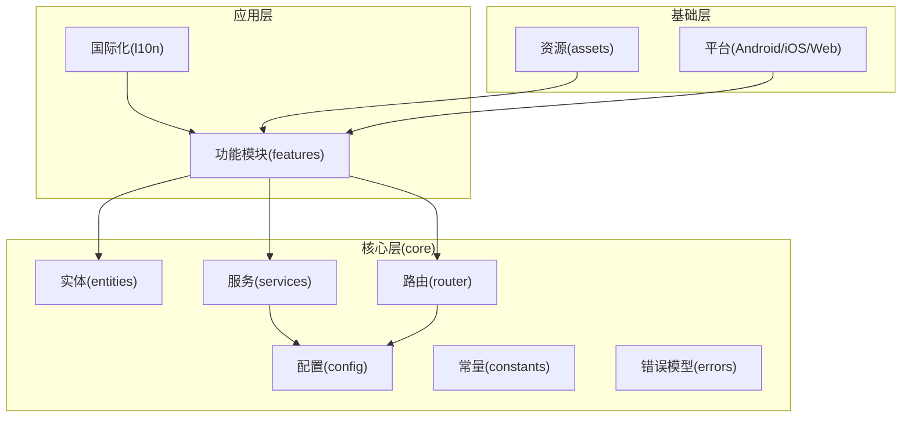
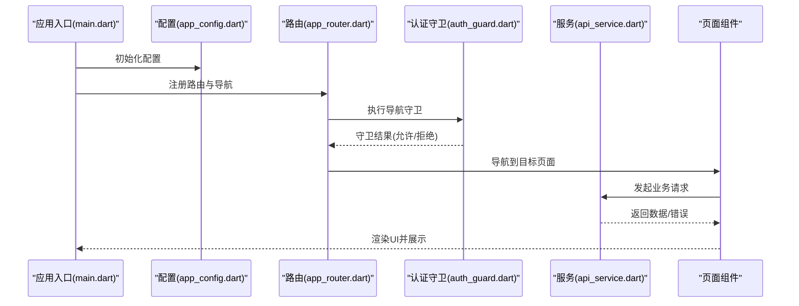
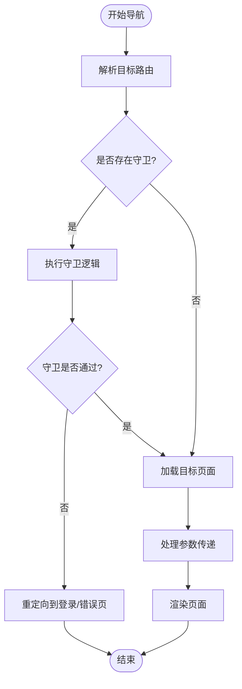
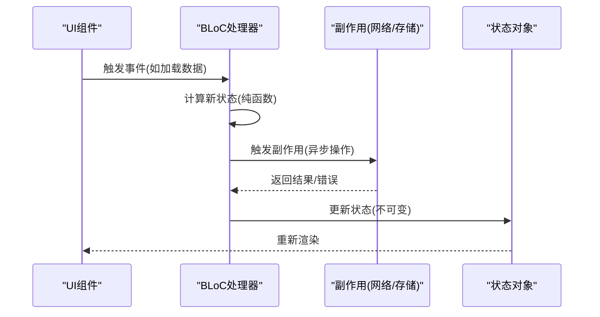
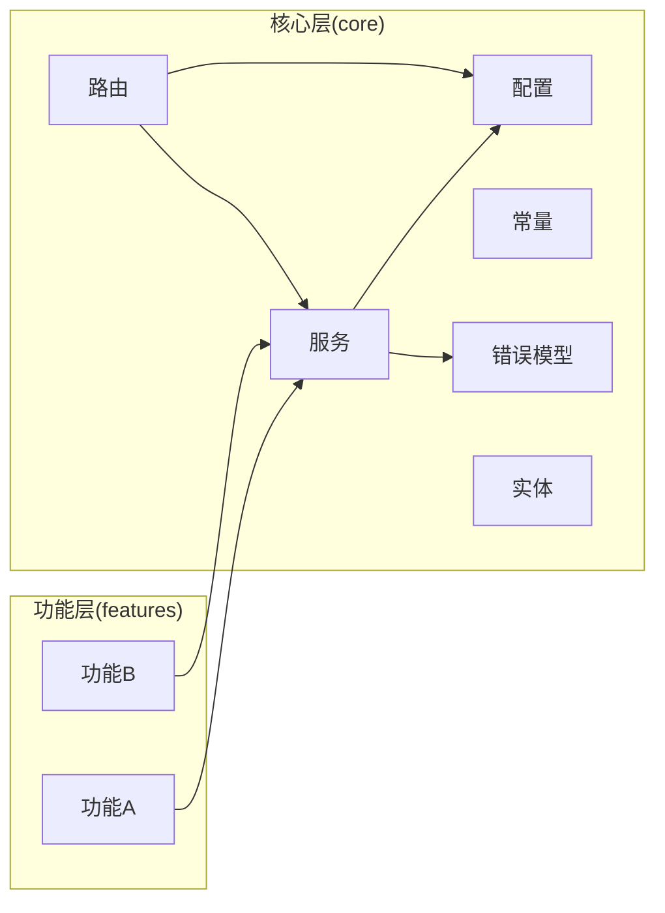

# 应用架构设计

<cite>
**本文档引用的文件**
- [app_config.dart](file://inv_app/lib/core/config/app_config.dart)
- [app_constants.dart](file://inv_app/lib/core/constants/app_constants.dart)
- [exceptions.dart](file://inv_app/lib/core/errors/exceptions.dart)
- [failures.dart](file://inv_app/lib/core/errors/failures.dart)
- [app_router.dart](file://inv_app/lib/core/router/app_router.dart)
- [auth_guard.dart](file://inv_app/lib/core/router/guards/auth_guard.dart)
- [api_service.dart](file://inv_app/lib/core/services/api_service.dart)
- [main.dart](file://inv_app/lib/main.dart)
- [pubspec.yaml](file://inv_app/pubspec.yaml)
</cite>

## 目录
1. [引言](#引言)
2. [项目结构](#项目结构)
3. [核心组件](#核心组件)
4. [架构总览](#架构总览)
5. [详细组件分析](#详细组件分析)
6. [依赖关系分析](#依赖关系分析)
7. [性能考虑](#性能考虑)
8. [故障排除指南](#故障排除指南)
9. [结论](#结论)

## 引言
本文件面向Flutter 3.x移动端应用的架构设计，聚焦于跨平台应用的整体架构、目录结构组织原则、模块化设计理念与依赖注入模式。文档同时覆盖配置管理、环境变量处理、日志系统与错误处理机制，深入解析BLoC状态管理模式在事件处理、状态管理与副作用管理方面的实现要点，并对路由系统（基于go_router）的配置、页面导航策略与参数传递进行系统性说明。最后，提供架构决策的技术考量与性能优化策略，帮助开发者在保证可维护性的同时提升运行效率。

## 项目结构
应用采用按“核心能力(core) + 功能特性(features) + 国际化(l10n)”分层的目录组织方式，结合领域驱动的模块化理念，确保各层职责清晰、边界明确、可测试性强。

- 核心层(core)：包含配置、常量、实体、错误模型、路由与服务等通用基础设施，为上层功能提供稳定支撑。
- 功能层(features)：按业务域划分具体功能模块，复用核心层能力，避免重复造轮子。
- 国际化(l10n)：集中管理多语言资源，支持动态切换与本地化渲染。
- 资源层(assets)：存放图标、图片与数据文件，统一由应用入口加载与分发。

图表来源
- [app_config.dart](file://inv_app/lib/core/config/app_config.dart)
- [app_router.dart](file://inv_app/lib/core/router/app_router.dart)
- [api_service.dart](file://inv_app/lib/core/services/api_service.dart)

章节来源
- [app_config.dart](file://inv_app/lib/core/config/app_config.dart)
- [app_constants.dart](file://inv_app/lib/core/constants/app_constants.dart)
- [app_router.dart](file://inv_app/lib/core/router/app_router.dart)
- [api_service.dart](file://inv_app/lib/core/services/api_service.dart)

## 核心组件
本节从架构视角梳理核心组件及其职责边界，强调模块内聚与模块间解耦的设计原则。

- 配置管理：集中式配置加载与环境变量处理，支持开发/生产差异化配置，保障敏感信息安全存储与访问。
- 错误处理：定义异常与失败类型，规范错误传播路径与用户提示策略，统一日志记录与上报机制。
- 日志系统：通过统一的日志适配器输出到控制台或外部系统，支持级别过滤与上下文追踪。
- 路由系统：基于go_router的声明式路由配置，支持命名路由、参数传递、导航守卫与深度链接。
- 状态管理：采用BLoC模式，事件驱动的状态更新与副作用分离，便于测试与调试。
- 服务层：封装网络请求、缓存、设备通信等横切关注点，提供稳定的抽象接口。

章节来源
- [exceptions.dart](file://inv_app/lib/core/errors/exceptions.dart)
- [failures.dart](file://inv_app/lib/core/errors/failures.dart)
- [app_router.dart](file://inv_app/lib/core/router/app_router.dart)
- [api_service.dart](file://inv_app/lib/core/services/api_service.dart)

## 架构总览
下图展示了应用启动到页面渲染的关键流程，以及核心组件之间的交互关系。

图表来源
- [main.dart](file://inv_app/lib/main.dart)
- [app_config.dart](file://inv_app/lib/core/config/app_config.dart)
- [app_router.dart](file://inv_app/lib/core/router/app_router.dart)
- [auth_guard.dart](file://inv_app/lib/core/router/guards/auth_guard.dart)
- [api_service.dart](file://inv_app/lib/core/services/api_service.dart)

## 详细组件分析

### 配置管理与环境变量处理
- 统一配置加载：通过配置类集中加载应用所需参数，支持从环境变量、配置文件或默认值中读取。
- 环境隔离：区分开发、测试、生产环境，确保不同环境下的URL、日志级别、调试开关等参数正确生效。
- 安全存储：敏感信息（如密钥、令牌）不直接硬编码在代码中，通过安全通道或加密存储访问。
- 可测试性：配置对外暴露只读接口，便于在单元测试中替换为模拟配置。

章节来源
- [app_config.dart](file://inv_app/lib/core/config/app_config.dart)
- [app_constants.dart](file://inv_app/lib/core/constants/app_constants.dart)

### 错误处理机制
- 异常与失败模型：定义异常类型用于捕获不可恢复错误，定义失败类型用于表达可恢复的业务失败场景。
- 错误传播：在服务层捕获底层异常后转换为失败对象，向上抛出；在页面层根据失败类型决定用户提示与重试策略。
- 用户反馈：统一的消息映射与本地化，确保错误信息清晰易懂且符合用户体验。
- 日志记录：错误发生时记录上下文信息（如时间戳、调用栈、用户标识），便于问题定位与追踪。

章节来源
- [exceptions.dart](file://inv_app/lib/core/errors/exceptions.dart)
- [failures.dart](file://inv_app/lib/core/errors/failures.dart)

### 日志系统
- 统一日志适配器：提供统一接口输出日志，支持不同级别（调试、信息、警告、错误）。
- 上下文追踪：在关键操作前后记录上下文信息，便于串联用户行为与系统响应。
- 外部集成：可选地将日志转发至远程监控系统，支持告警与聚合分析。

章节来源
- [app_config.dart](file://inv_app/lib/core/config/app_config.dart)

### 路由系统与导航策略
- 路由注册：在路由配置中声明所有页面与命名路由，定义默认路由与404处理。
- 参数传递：支持路径参数、查询参数与状态传递，确保页面间数据一致性。
- 导航守卫：通过认证守卫拦截未授权访问，必要时重定向至登录页。
- 深度链接：支持外部应用或系统通知触发的深度链接，提升用户体验。

图表来源
- [app_router.dart](file://inv_app/lib/core/router/app_router.dart)
- [auth_guard.dart](file://inv_app/lib/core/router/guards/auth_guard.dart)

章节来源
- [app_router.dart](file://inv_app/lib/core/router/app_router.dart)
- [auth_guard.dart](file://inv_app/lib/core/router/guards/auth_guard.dart)

### BLoC状态管理模式
- 事件驱动：页面触发事件，BLoC内部处理事件并计算新状态，避免直接修改共享状态。
- 状态管理：状态对象不可变，每次变更返回新的状态实例，便于调试与回放。
- 副作用管理：将网络请求、本地存储等副作用与状态更新分离，便于测试与隔离。
- 测试友好：通过事件输入与状态断言验证BLoC行为，降低集成测试成本。

图表来源
- [api_service.dart](file://inv_app/lib/core/services/api_service.dart)

章节来源
- [api_service.dart](file://inv_app/lib/core/services/api_service.dart)

### 服务层与依赖注入
- 服务抽象：将网络请求、缓存、设备通信等封装为服务接口，屏蔽实现细节。
- 依赖注入：通过构造函数注入或容器注入，确保服务可替换与可测试。
- 生命周期管理：合理管理服务生命周期，避免内存泄漏与资源浪费。

章节来源
- [api_service.dart](file://inv_app/lib/core/services/api_service.dart)

## 依赖关系分析
应用采用分层依赖与模块化设计，核心层对上层开放稳定接口，上层仅依赖核心层提供的抽象，避免反向依赖导致的耦合。

图表来源
- [app_config.dart](file://inv_app/lib/core/config/app_config.dart)
- [app_router.dart](file://inv_app/lib/core/router/app_router.dart)
- [api_service.dart](file://inv_app/lib/core/services/api_service.dart)
- [exceptions.dart](file://inv_app/lib/core/errors/exceptions.dart)
- [failures.dart](file://inv_app/lib/core/errors/failures.dart)

章节来源
- [app_config.dart](file://inv_app/lib/core/config/app_config.dart)
- [app_router.dart](file://inv_app/lib/core/router/app_router.dart)
- [api_service.dart](file://inv_app/lib/core/services/api_service.dart)
- [exceptions.dart](file://inv_app/lib/core/errors/exceptions.dart)
- [failures.dart](file://inv_app/lib/core/errors/failures.dart)

## 性能考虑
- 启动优化：延迟初始化非关键服务，减少首屏阻塞；预热常用资源，缩短首次渲染时间。
- 网络优化：启用连接池与超时重试，合并频繁请求，缓存热点数据；对大图与媒体资源进行懒加载与压缩。
- 内存管理：避免持有长生命周期引用，及时释放监听器与定时器；使用不可变数据结构降低拷贝成本。
- UI渲染：减少不必要的重建，使用Key与局部刷新；避免在构建方法中执行耗时操作。
- 状态同步：BLoC中批量处理事件，避免频繁状态更新；对副作用进行去抖与节流。

## 故障排除指南
- 配置问题：检查配置加载顺序与环境变量是否正确；确认开发/生产配置差异项。
- 路由问题：核对路由注册与命名是否一致；验证导航守卫逻辑与参数传递。
- 网络问题：查看请求日志与响应码；确认服务端地址与证书；排查代理与防火墙设置。
- 状态异常：通过BLoC日志回放事件序列；检查副作用是否正确完成与清理。
- 错误上报：确保错误捕获与上报链路完整；核对日志级别与上下文字段。

章节来源
- [exceptions.dart](file://inv_app/lib/core/errors/exceptions.dart)
- [failures.dart](file://inv_app/lib/core/errors/failures.dart)
- [app_router.dart](file://inv_app/lib/core/router/app_router.dart)
- [api_service.dart](file://inv_app/lib/core/services/api_service.dart)

## 结论
该Flutter应用以核心层为核心、功能层为扩展、国际化为辅助的三层架构为基础，结合go_router路由体系与BLoC状态管理模式，实现了高内聚、低耦合、可测试与可维护的跨平台应用。通过统一的配置管理、错误处理与日志系统，以及清晰的模块化与依赖注入实践，应用在复杂业务场景下仍能保持良好的扩展性与稳定性。建议持续完善测试覆盖、性能监控与自动化部署流程，进一步提升交付质量与运维效率。