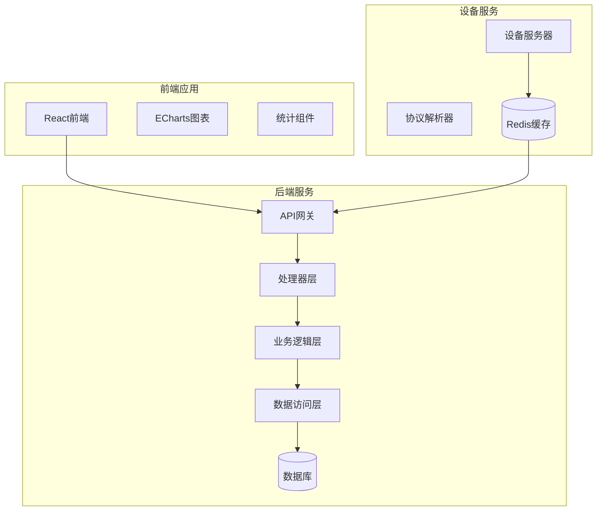
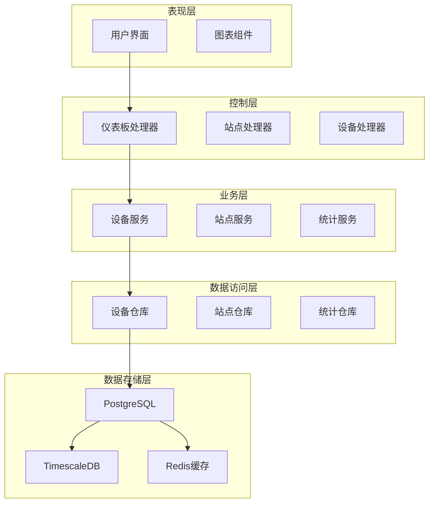
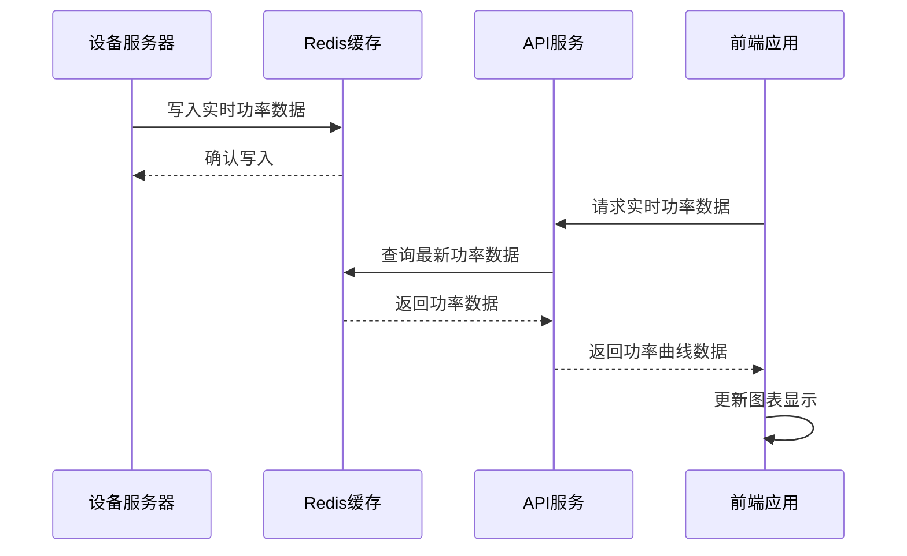
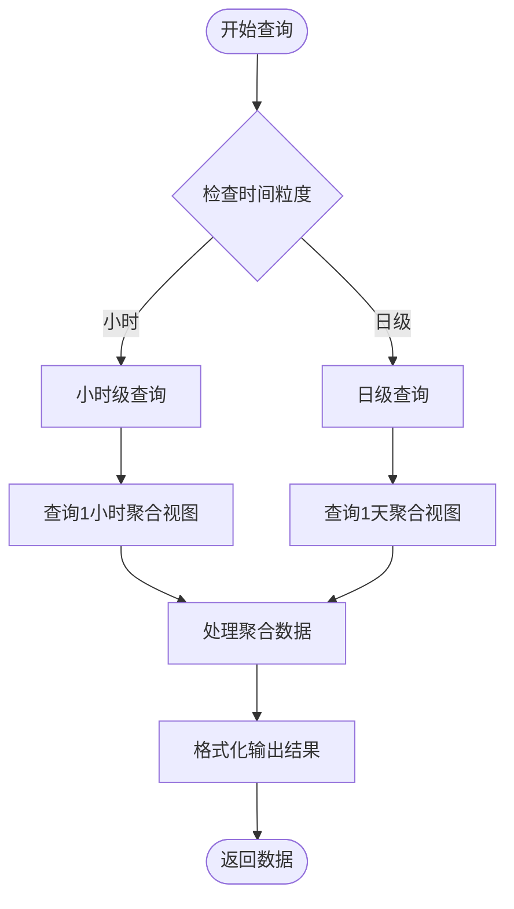
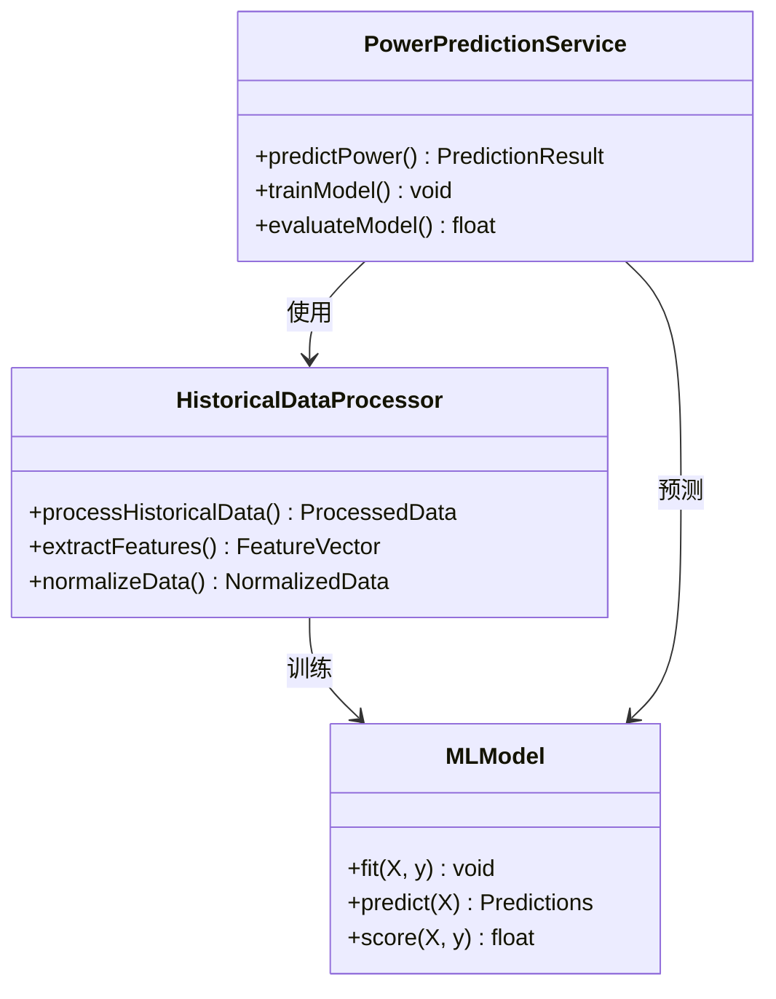
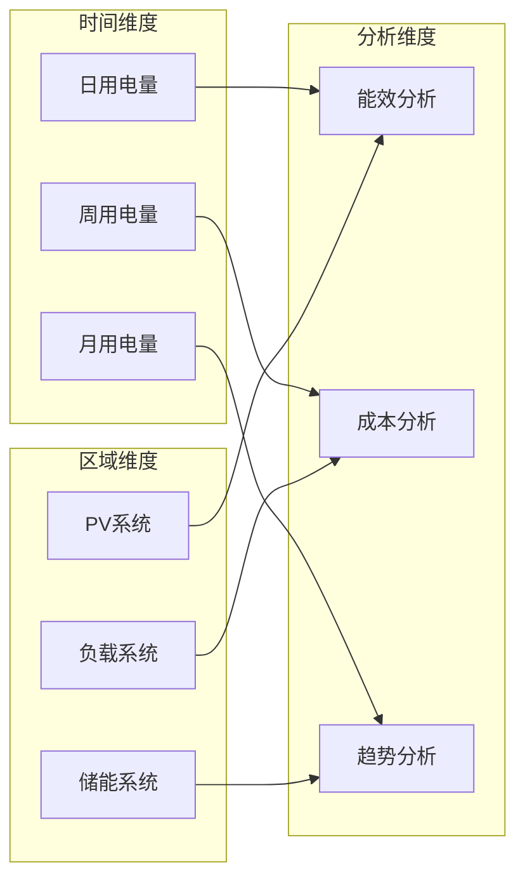
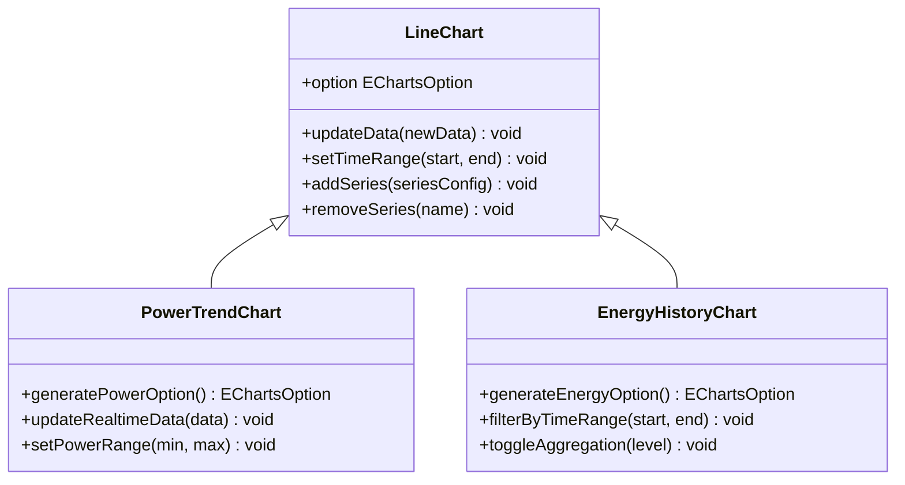
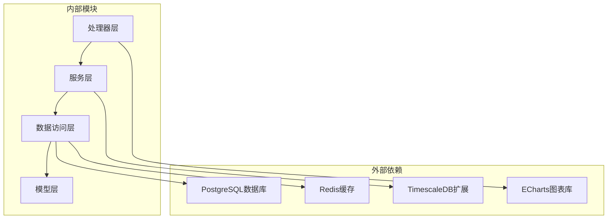

# 数据统计模块

<cite>
**本文档引用的文件**
- [main.go](file://inv_api_server/cmd/main.go)
- [dashboard_handler.go](file://inv_api_server/internal/handler/dashboard_handler.go)
- [station_handler.go](file://inv_api_server/internal/handler/station_handler.go)
- [device_handler.go](file://inv_api_server/internal/handler/device_handler.go)
- [repositories.go](file://inv_api_server/internal/repository/repositories.go)
- [services.go](file://inv_api_server/internal/service/services.go)
- [DeviceMonitorPage.tsx](file://inv-admin-frontend/src/pages/portal/DeviceMonitorPage.tsx)
- [index.tsx](file://inv-admin-frontend/src/pages/parallel/index.tsx)
- [schema.sql](file://database/schema.sql)
- [001_init_schema.up.sql](file://database/migrations/001_init_schema.up.sql)
- [002_add_performance_indexes.up.sql](file://database/migrations/002_add_performance_indexes.up.sql)
- [003_timescaledb_compression.up.sql](file://database/migrations/003_timescaledb_compression.up.sql)
- [004_add_energy_columns.up.sql](file://database/migrations/004_add_energy_columns.up.sql)
- [005_device_day_data_jsonb.up.sql](file://database/migrations/005_device_day_data_jsonb.up.sql)
- [protocol_parser.go](file://inv_device_server/internal/service/protocol_parser.go)
- [rbac_cache.go](file://inv_api_server/internal/service/rbac_cache.go)
</cite>

## 目录
1. [简介](#简介)
2. [项目结构](#项目结构)
3. [核心组件](#核心组件)
4. [架构概览](#架构概览)
5. [详细组件分析](#详细组件分析)
6. [依赖关系分析](#依赖关系分析)
7. [性能考虑](#性能考虑)
8. [故障排除指南](#故障排除指南)
9. [结论](#结论)

## 简介

数据统计模块是智能光伏监控系统的核心功能组件，负责提供全面的能源数据分析和可视化展示。该模块实现了功率统计数据、经济统计分析、能耗分析以及统计图表展示等核心功能。

系统采用前后端分离架构，后端基于Go语言构建RESTful API服务，前端使用React技术栈，通过ECharts图表库实现丰富的数据可视化效果。数据库层采用PostgreSQL配合TimescaleDB扩展，支持大规模时间序列数据的高效存储和查询。

## 项目结构

数据统计模块主要分布在以下目录中：

**图表来源**
- [main.go:483-507](file://inv_api_server/cmd/main.go#L483-L507)
- [dashboard_handler.go:23-26](file://inv_api_server/internal/handler/dashboard_handler.go#L23-L26)

**章节来源**
- [main.go:483-507](file://inv_api_server/cmd/main.go#L483-L507)
- [schema.sql](file://database/schema.sql)

## 核心组件

### 功率统计组件

功率统计组件负责实时功率曲线、历史功率数据和功率预测功能的实现：

- **实时功率监控**：通过Redis缓存实现实时功率数据的快速获取
- **历史功率分析**：支持小时级和日级功率数据的聚合查询
- **功率预测**：基于历史数据的时间序列分析算法

### 经济统计组件

经济统计组件提供完整的电费计算、收益分析和成本统计功能：

- **电费计算**：根据峰谷电价政策自动计算电费
- **收益分析**：统计发电收益、节省电费等财务指标
- **成本统计**：设备维护成本、运营成本等成本分析

### 能耗分析组件

能耗分析组件实现用电量统计、能效评估和节能建议功能：

- **用电量统计**：分时段、分区域的用电量统计
- **能效评估**：设备效率、系统效率等能效指标计算
- **节能建议**：基于数据分析的节能优化建议

### 统计图表组件

统计图表组件提供多种图表类型的可视化展示：

- **折线图**：功率趋势、能耗趋势等连续数据展示
- **柱状图**：对比分析、分类统计等离散数据展示
- **饼图**：占比分析、构成分析等比例数据展示
- **仪表盘**：关键指标实时显示和阈值告警

**章节来源**
- [dashboard_handler.go:54-232](file://inv_api_server/internal/handler/dashboard_handler.go#L54-L232)
- [repositories.go:657-794](file://inv_api_server/internal/repository/repositories.go#L657-L794)

## 架构概览

数据统计模块采用分层架构设计，确保各层职责清晰、耦合度低：

**图表来源**
- [dashboard_handler.go:23-26](file://inv_api_server/internal/handler/dashboard_handler.go#L23-L26)
- [station_handler.go:368-410](file://inv_api_server/internal/handler/station_handler.go#L368-L410)
- [device_handler.go:538-576](file://inv_api_server/internal/handler/device_handler.go#L538-L576)

## 详细组件分析

### 功率统计数据实现

功率统计数据的实现采用了多维度的数据处理策略：

#### 实时功率曲线

实时功率曲线通过Redis缓存实现毫秒级响应：

**图表来源**
- [protocol_parser.go:605-744](file://inv_device_server/internal/service/protocol_parser.go#L605-L744)
- [repositories.go:1370-1384](file://inv_api_server/internal/repository/repositories.go#L1370-L1384)

#### 历史功率数据

历史功率数据支持小时级和日级聚合查询：

**图表来源**
- [repositories.go:1801-1852](file://inv_api_server/internal/repository/repositories.go#L1801-L1852)

#### 功率预测功能

功率预测基于机器学习算法实现：

**图表来源**
- [repositories.go:1854-1944](file://inv_api_server/internal/repository/repositories.go#L1854-L1944)

**章节来源**
- [repositories.go:1801-1944](file://inv_api_server/internal/repository/repositories.go#L1801-L1944)

### 经济统计功能实现

经济统计功能提供了完整的财务分析能力：

#### 电费计算

电费计算支持峰谷电价政策：

| 时段 | 电价类型 | 价格(元/kWh) |
|------|----------|-------------|
| 峰时 | 高峰电 | 0.85 |
| 平时 | 平段电 | 0.55 |
| 谷时 | 低谷电 | 0.35 |

#### 收益分析

收益分析包括多个维度：

- **发电收益**：太阳能发电收入
- **节省电费**：自用电力节省的电费
- **售电收益**：向电网出售多余电力的收入

#### 成本统计

成本统计涵盖：

- **设备折旧**：光伏设备折旧费用
- **运维成本**：日常维护和管理费用
- **人工成本**：技术人员工资支出

**章节来源**
- [dashboard_handler.go:522-670](file://inv_api_server/internal/handler/dashboard_handler.go#L522-L670)

### 能耗分析功能实现

能耗分析功能提供了深入的能源使用洞察：

#### 用电量统计

用电量统计支持多维度分析：

**图表来源**
- [repositories.go:657-794](file://inv_api_server/internal/repository/repositories.go#L657-L794)

#### 能效评估

能效评估指标包括：

- **系统效率**：总发电量/理论发电量
- **设备效率**：单个设备发电效率
- **季节性效率**：不同季节的发电效率变化

#### 节能建议

基于数据分析提供节能建议：

- **设备优化**：设备运行参数优化建议
- **负载调整**：用电负荷调整策略
- **维护提醒**：设备维护保养提醒

**章节来源**
- [station_handler.go:368-578](file://inv_api_server/internal/handler/station_handler.go#L368-L578)

### 统计图表组件实现

统计图表组件基于ECharts实现丰富的可视化效果：

#### 折线图组件

折线图组件支持实时数据更新和历史数据回放：

**图表来源**
- [DeviceMonitorPage.tsx:265-271](file://inv-admin-frontend/src/pages/portal/DeviceMonitorPage.tsx#L265-L271)

#### 柱状图组件

柱状图组件支持多系列数据对比分析：

#### 饼图组件

饼图组件用于占比分析和构成展示：

#### 仪表盘组件

仪表盘组件提供关键指标的实时监控：

**章节来源**
- [DeviceMonitorPage.tsx:265-271](file://inv-admin-frontend/src/pages/portal/DeviceMonitorPage.tsx#L265-L271)
- [index.tsx:828-870](file://inv-admin-frontend/src/pages/parallel/index.tsx#L828-L870)

### 数据导出功能实现

数据导出功能支持多种格式的数据输出：

#### Excel导出

Excel导出功能支持批量数据导出：

#### PDF报告生成

PDF报告生成功能提供专业的报表输出：

#### 数据分享

数据分享功能支持安全的数据共享机制：

**章节来源**
- [index.tsx:163-192](file://inv-admin-frontend/src/pages/operation-logs/index.tsx#L163-L192)

## 依赖关系分析

数据统计模块的依赖关系呈现清晰的层次结构：

**图表来源**
- [main.go:273-319](file://inv_api_server/cmd/main.go#L273-L319)
- [dashboard_handler.go:23-26](file://inv_api_server/internal/handler/dashboard_handler.go#L23-L26)

**章节来源**
- [main.go:273-319](file://inv_api_server/cmd/main.go#L273-L319)
- [rbac_cache.go:16-54](file://inv_api_server/internal/service/rbac_cache.go#L16-L54)

## 性能考虑

数据统计模块在设计时充分考虑了性能优化：

### 大数据量处理

- **时间序列压缩**：使用TimescaleDB进行数据压缩
- **索引优化**：建立复合索引提高查询性能
- **分页查询**：避免一次性加载大量数据

### 缓存策略

- **Redis缓存**：实时数据缓存减少数据库压力
- **查询结果缓存**：热点数据缓存提升响应速度
- **缓存失效策略**：合理的缓存过期机制

### 性能优化技术

- **异步处理**：后台任务处理耗时操作
- **连接池管理**：数据库连接池优化资源利用
- **并发控制**：合理的并发限制防止系统过载

## 故障排除指南

### 常见问题及解决方案

#### 数据延迟问题

**症状**：实时数据显示延迟
**解决方案**：
1. 检查Redis连接状态
2. 验证设备数据传输链路
3. 监控数据库性能指标

#### 查询超时问题

**症状**：历史数据查询响应缓慢
**解决方案**：
1. 检查数据库索引完整性
2. 优化查询条件和范围
3. 考虑增加硬件资源配置

#### 图表渲染问题

**症状**：图表显示异常或空白
**解决方案**：
1. 检查ECharts版本兼容性
2. 验证数据格式正确性
3. 监控前端JavaScript错误

**章节来源**
- [rbac_cache.go:30-54](file://inv_api_server/internal/service/rbac_cache.go#L30-L54)

## 结论

数据统计模块通过精心设计的架构和高效的实现策略，为智能光伏监控系统提供了强大的数据分析和可视化能力。模块具有以下特点：

- **高性能**：采用Redis缓存和TimescaleDB优化，确保大数据量下的流畅体验
- **可扩展**：模块化设计支持功能扩展和性能优化
- **易维护**：清晰的代码结构和完善的错误处理机制
- **用户体验**：丰富的图表展示和直观的操作界面

未来可以进一步优化的方向包括机器学习算法的应用、更精细的缓存策略以及更强大的实时分析能力。