# 用户认证模块

<cite>
**本文档引用的文件**
- [auth_handler.go](file://inv_api_server/internal/handler/auth_handler.go)
- [auth.go](file://inv_api_server/internal/middleware/auth.go)
- [jwt.go](file://inv_api_server/pkg/jwt/jwt.go)
- [jwt.go](file://api-gateway/internal/middleware/jwt.go)
- [auth_repository_impl.dart](file://inv_app/lib/features/auth/data/repositories/auth_repository_impl.dart)
- [auth_guard.dart](file://inv_app/lib/core/router/guards/auth_guard.dart)
- [login_page.dart](file://inv_app/lib/features/auth/presentation/pages/login_page.dart)
- [register_page.dart](file://inv_app/lib/features/auth/presentation/pages/register_page.dart)
- [forgot_password_page.dart](file://inv_app/lib/features/auth/presentation/pages/forgot_password_page.dart)
- [auth_bloc.dart](file://inv_app/lib/features/auth/presentation/bloc/auth_bloc.dart)
- [auth_state.dart](file://inv_app/lib/features/auth/presentation/bloc/auth_state.dart)
- [auth_event.dart](file://inv_app/lib/features/auth/presentation/bloc/auth_event.dart)
- [auth_repository.dart](file://inv_app/lib/features/auth/domain/repositories/auth_repository.dart)
- [user.dart](file://inv_app/lib/features/auth/domain/entities/user.dart)
- [README.md](file://README.md)
</cite>

## 更新摘要
**所做更改**
- 更新了前端认证架构，移除了原有的auth-code/client/flutter-app目录结构
- 重构了认证仓库实现，采用新的数据层架构
- 更新了认证页面组件，改进了用户体验和表单验证
- 新增了完整的BLoC状态管理模式
- 更新了认证流程图和架构图以反映新的实现

## 目录
1. [简介](#简介)
2. [项目结构](#项目结构)
3. [核心组件](#核心组件)
4. [架构概览](#架构概览)
5. [详细组件分析](#详细组件分析)
6. [依赖关系分析](#依赖关系分析)
7. [性能考虑](#性能考虑)
8. [故障排除指南](#故障排除指南)
9. [结论](#结论)

## 简介

用户认证模块是整个光伏逆变器物联网监控系统的核心安全组件，基于JWT（JSON Web Token）实现完整的用户身份验证和授权机制。该模块支持多种认证方式，包括手机号密码认证、邮箱认证、短信验证码认证等，并提供了完善的会话管理、权限控制和安全防护功能。

系统采用前后端分离的架构设计，后端使用Go语言构建REST API服务，前端使用Flutter框架开发跨平台应用。认证流程通过HTTP Cookie进行Token存储，确保了安全性并简化了客户端集成。

**更新** 重构后的认证模块采用了更清晰的分层架构，移除了原有的复杂目录结构，简化了认证流程的实现。

## 项目结构

用户认证模块分布在四个主要层面，采用了更清晰的分层架构：

```mermaid
graph TB
subgraph "前端层"
Mobile[Flutter 移动应用]
Admin[管理后台]
Web[Web界面]
end
subgraph "表现层"
LoginPage[登录页面]
RegisterPage[注册页面]
ForgotPage[忘记密码页面]
BLoC[BLoC状态管理]
end
subgraph "领域层"
AuthRepository[认证仓储接口]
UserEntity[用户实体]
AuthUseCases[认证用例]
end
subgraph "数据层"
AuthRepositoryImpl[认证仓储实现]
RemoteDataSource[远程数据源]
StorageService[存储服务]
end
subgraph "后端层"
AuthHandler[认证处理器]
JWTService[JWT服务]
RBACService[RBAC服务]
end
subgraph "基础设施层"
DB[(PostgreSQL)]
REDIS[(Redis)]
EMQX[EMQX Broker]
end
Mobile --> LoginPage
Admin --> RegisterPage
Web --> ForgotPage
LoginPage --> BLoC
RegisterPage --> BLoC
ForgotPage --> BLoC
BLoC --> AuthRepository
AuthRepository --> AuthRepositoryImpl
AuthRepositoryImpl --> RemoteDataSource
RemoteDataSource --> AuthHandler
AuthHandler --> JWTService
AuthHandler --> RBACService
JWTService --> DB
RBACService --> DB
```

**图表来源**
- [auth_repository_impl.dart:1-184](file://inv_app/lib/features/auth/data/repositories/auth_repository_impl.dart#L1-L184)
- [auth_guard.dart:1-42](file://inv_app/lib/core/router/guards/auth_guard.dart#L1-L42)
- [auth_handler.go:1-814](file://inv_api_server/internal/handler/auth_handler.go#L1-L814)

**章节来源**
- [README.md:1-204](file://README.md#L1-L204)

## 核心组件

### JWT认证引擎

JWT认证引擎是整个认证系统的核心，负责Token的生成、验证和管理。系统采用HS256签名算法，确保Token的安全性和完整性。

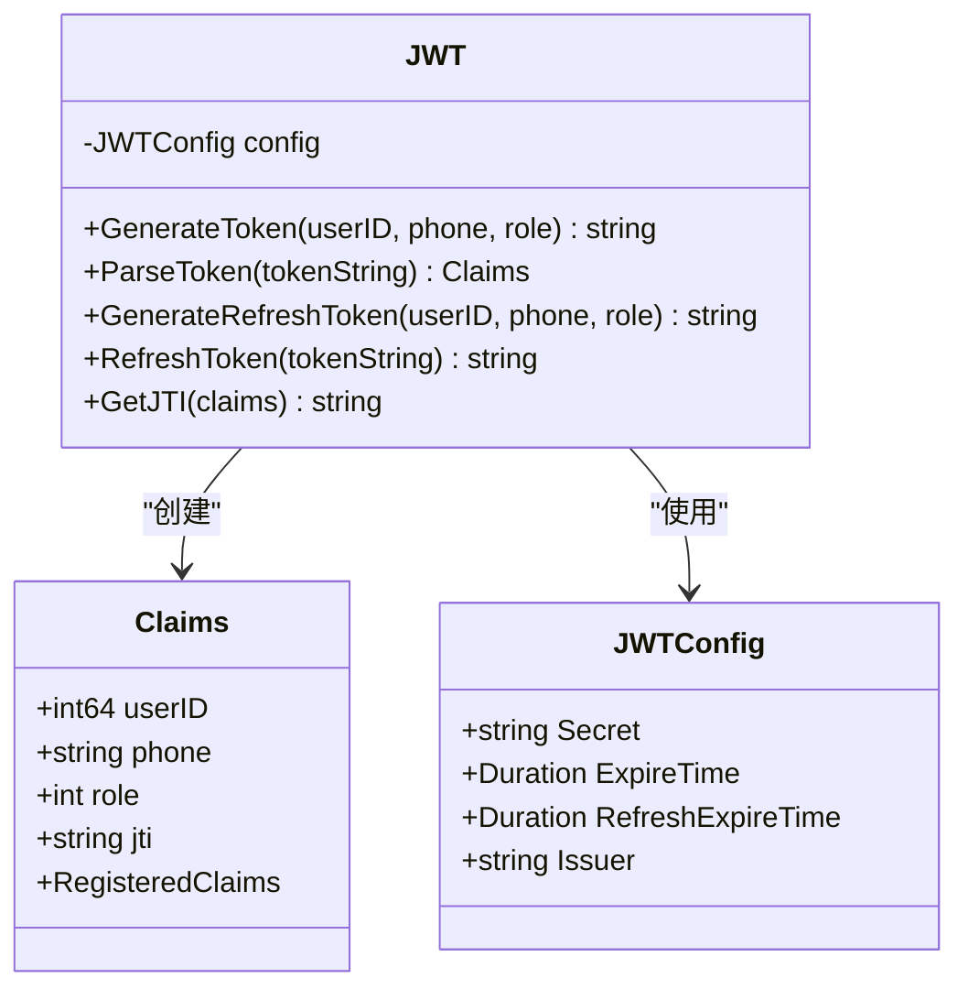

**图表来源**
- [jwt.go:12-137](file://inv_api_server/pkg/jwt/jwt.go#L12-L137)

### 认证仓储实现

认证仓储实现了完整的用户认证API接口，包括登录、注册、密码重置、会话管理等功能。新的实现采用了更清晰的接口分离和数据传输对象模式。

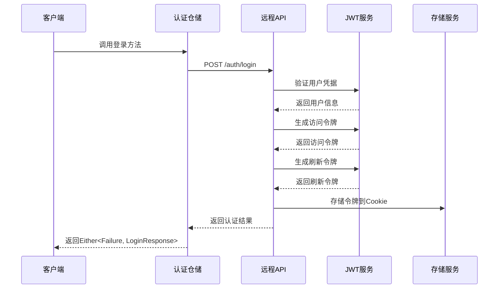

**图表来源**
- [auth_repository_impl.dart:14-24](file://inv_app/lib/features/auth/data/repositories/auth_repository_impl.dart#L14-L24)
- [auth_repository_impl.dart:39-45](file://inv_app/lib/features/auth/data/repositories/auth_repository_impl.dart#L39-L45)

### 认证BLoC状态管理

认证BLoC实现了完整的状态管理模式，包括认证状态跟踪、错误处理和用户交互响应。

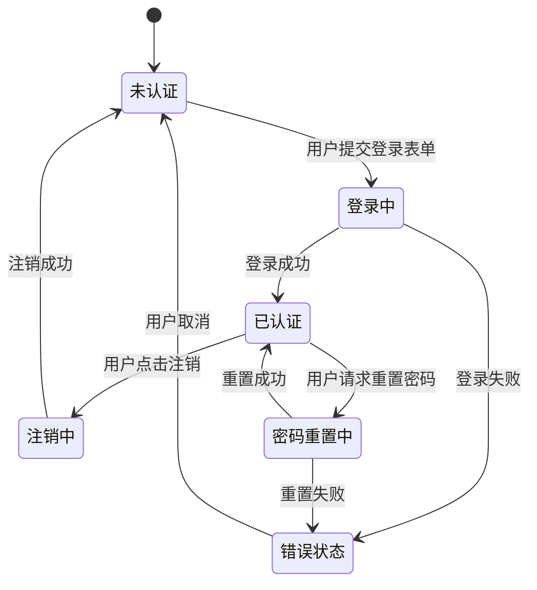

**图表来源**
- [auth_bloc.dart:1-200](file://inv_app/lib/features/auth/presentation/bloc/auth_bloc.dart#L1-L200)
- [auth_state.dart:1-150](file://inv_app/lib/features/auth/presentation/bloc/auth_state.dart#L1-L150)

**章节来源**
- [auth_repository_impl.dart:1-184](file://inv_app/lib/features/auth/data/repositories/auth_repository_impl.dart#L1-L184)
- [auth_guard.dart:1-42](file://inv_app/lib/core/router/guards/auth_guard.dart#L1-L42)
- [auth_bloc.dart:1-200](file://inv_app/lib/features/auth/presentation/bloc/auth_bloc.dart#L1-L200)

## 架构概览

系统采用Clean Architecture设计，实现了清晰的分层架构和职责分离：

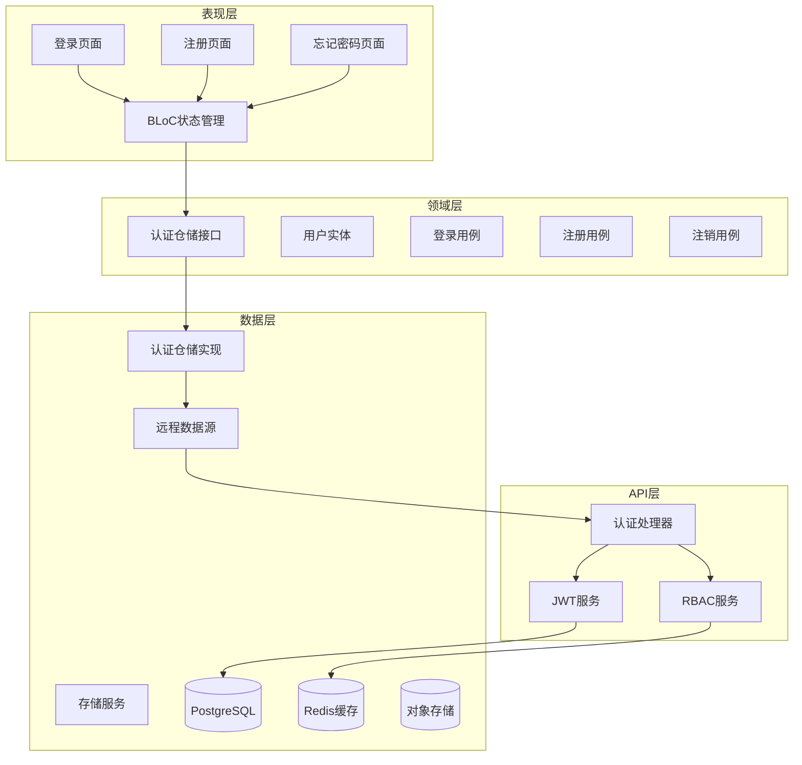

**图表来源**
- [auth_repository_impl.dart:8-12](file://inv_app/lib/features/auth/data/repositories/auth_repository_impl.dart#L8-L12)
- [auth_guard.dart:1-42](file://inv_app/lib/core/router/guards/auth_guard.dart#L1-L42)
- [auth_handler.go:1-814](file://inv_api_server/internal/handler/auth_handler.go#L1-L814)

## 详细组件分析

### 认证流程详解

#### 登录流程

系统支持多种登录方式，包括手机号密码登录、邮箱登录和第三方登录：

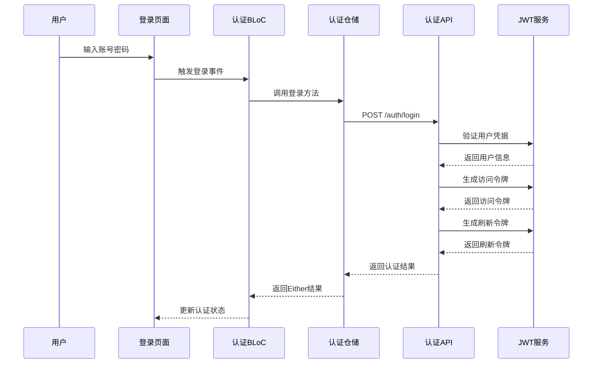

**图表来源**
- [login_page.dart:51-59](file://inv_app/lib/features/auth/presentation/pages/login_page.dart#L51-L59)
- [auth_repository_impl.dart:14-24](file://inv_app/lib/features/auth/data/repositories/auth_repository_impl.dart#L14-L24)

#### 注册流程

注册流程包含邮箱验证和手机号验证两种方式：

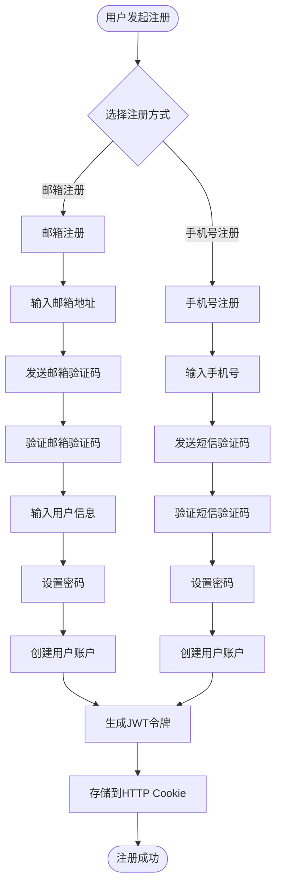

**图表来源**
- [register_page.dart:73-83](file://inv_app/lib/features/auth/presentation/pages/register_page.dart#L73-L83)
- [auth_repository_impl.dart:26-37](file://inv_app/lib/features/auth/data/repositories/auth_repository_impl.dart#L26-L37)

#### 密码重置流程

密码重置流程确保了账户安全性和用户体验：

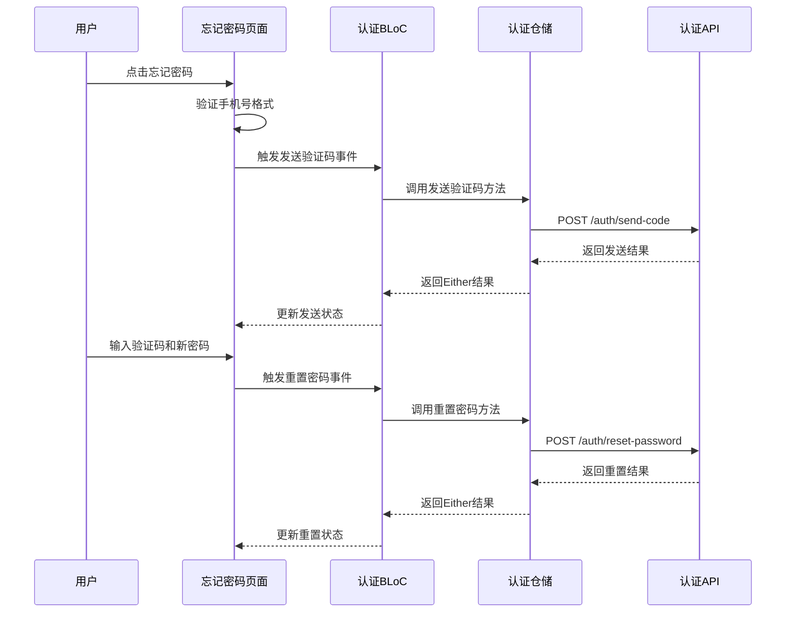

**图表来源**
- [forgot_password_page.dart:75-83](file://inv_app/lib/features/auth/presentation/pages/forgot_password_page.dart#L75-L83)
- [auth_repository_impl.dart:60-70](file://inv_app/lib/features/auth/data/repositories/auth_repository_impl.dart#L60-L70)

### 会话管理机制

系统实现了完整的会话管理机制，包括Token刷新和自动登出功能：

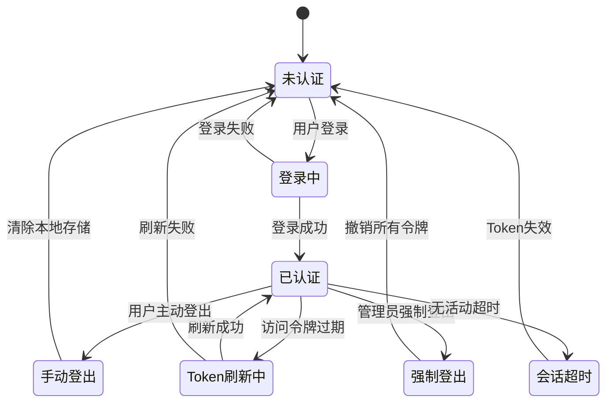

**图表来源**
- [auth_repository_impl.dart:39-45](file://inv_app/lib/features/auth/data/repositories/auth_repository_impl.dart#L39-L45)
- [auth_repository_impl.dart:152-160](file://inv_app/lib/features/auth/data/repositories/auth_repository_impl.dart#L152-L160)

### 权限控制系统

系统采用RBAC（基于角色的访问控制）模型，实现了细粒度的权限管理：

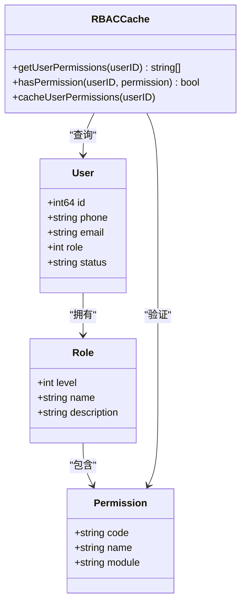

**图表来源**
- [auth_handler.go:139-141](file://inv_api_server/internal/handler/auth_handler.go#L139-L141)
- [auth.go:83-106](file://inv_api_server/internal/middleware/auth.go#L83-L106)

**章节来源**
- [auth_repository_impl.dart:1-184](file://inv_app/lib/features/auth/data/repositories/auth_repository_impl.dart#L1-L184)
- [auth_guard.dart:1-42](file://inv_app/lib/core/router/guards/auth_guard.dart#L1-L42)

## 依赖关系分析

### 前端依赖关系

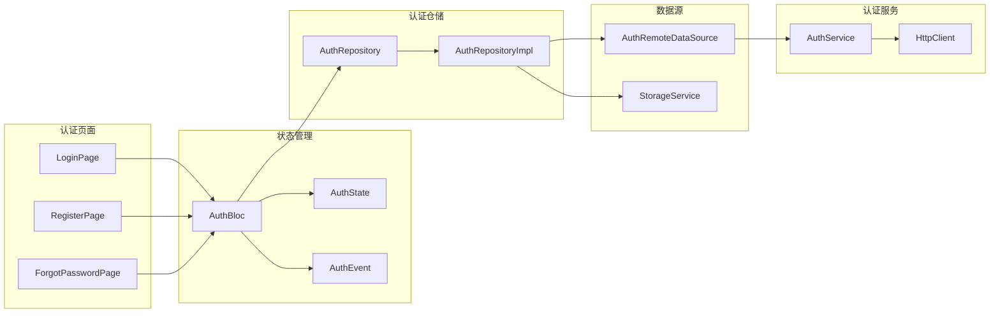

**图表来源**
- [auth_repository_impl.dart:8-12](file://inv_app/lib/features/auth/data/repositories/auth_repository_impl.dart#L8-L12)
- [auth_bloc.dart:1-200](file://inv_app/lib/features/auth/presentation/bloc/auth_bloc.dart#L1-L200)
- [auth_guard.dart:1-42](file://inv_app/lib/core/router/guards/auth_guard.dart#L1-L42)

### 后端依赖关系

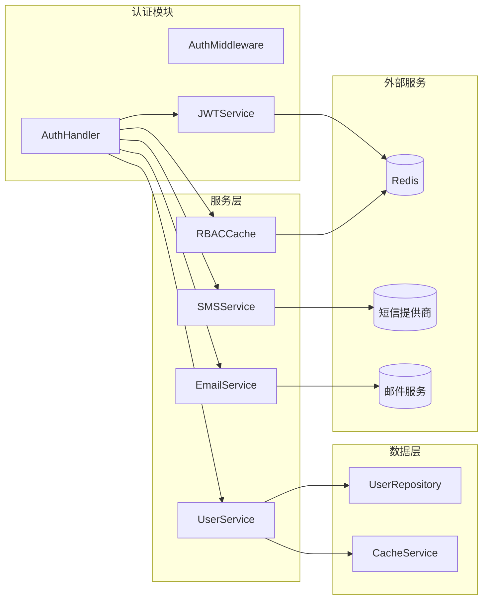

**图表来源**
- [auth_handler.go:34-50](file://inv_api_server/internal/handler/auth_handler.go#L34-L50)
- [auth.go:15-56](file://inv_api_server/internal/middleware/auth.go#L15-L56)

**章节来源**
- [auth_repository_impl.dart:1-184](file://inv_app/lib/features/auth/data/repositories/auth_repository_impl.dart#L1-L184)
- [auth_bloc.dart:1-200](file://inv_app/lib/features/auth/presentation/bloc/auth_bloc.dart#L1-L200)

## 性能考虑

### Token管理优化

系统采用了多项性能优化措施：

1. **Token缓存策略**：使用Redis缓存用户权限信息，减少数据库查询压力
2. **异步处理**：登录成功后的审计日志和权限缓存采用异步处理
3. **连接池管理**：合理配置数据库连接池大小，避免连接泄漏
4. **内存优化**：JWT令牌只在内存中处理，不进行持久化存储

### 前端性能优化

前端采用了以下优化策略：

1. **状态持久化**：使用Zustand结合localStorage实现状态持久化
2. **懒加载**：路由级别的代码分割，减少初始包体积
3. **缓存策略**：对认证相关的API请求进行智能缓存
4. **UI优化**：使用轻量级组件，避免不必要的重渲染

### 并发控制

**图表来源**
- [auth.go:158-255](file://inv_api_server/internal/middleware/auth.go#L158-L255)

## 故障排除指南

### 常见问题诊断

#### 认证失败问题

| 问题类型 | 可能原因 | 解决方案 |
|---------|---------|---------|
| 登录失败 | 密码错误或账号不存在 | 检查用户凭据，查看登录失败次数限制 |
| Token过期 | 访问令牌有效期已过 | 使用刷新令牌获取新的访问令牌 |
| 权限不足 | 用户角色权限不够 | 检查用户角色和权限配置 |
| 验证码错误 | 验证码过期或输入错误 | 重新发送验证码，检查短信/邮件服务 |

#### 网络异常处理

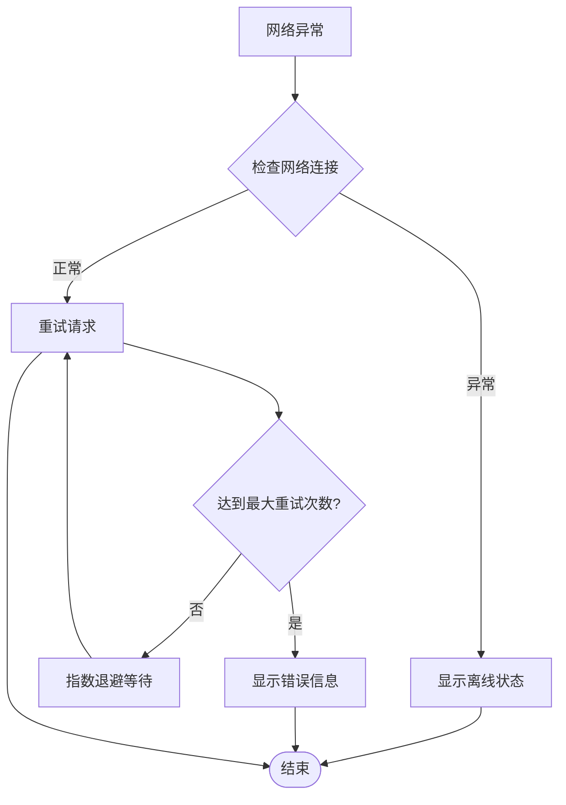

**图表来源**
- [auth_repository_impl.dart:19-24](file://inv_app/lib/features/auth/data/repositories/auth_repository_impl.dart#L19-L24)

#### 安全问题排查

1. **暴力破解防护**：检查登录失败次数限制配置
2. **Token安全**：验证JWT密钥配置和签名算法
3. **会话劫持**：检查HTTPS配置和Cookie安全属性
4. **权限泄露**：审查RBAC权限配置和中间件保护

### 调试方法

#### 前端调试

1. **浏览器开发者工具**：检查网络请求和响应
2. **状态检查**：验证BLoC状态管理和持久化
3. **路由保护**：测试AuthGuard的工作状态
4. **Token存储**：检查Cookie和localStorage的内容

#### 后端调试

1. **日志分析**：查看Gin框架日志和业务日志
2. **性能监控**：使用Prometheus监控关键指标
3. **数据库查询**：分析慢查询和连接池使用情况
4. **Redis监控**：检查缓存命中率和内存使用

**章节来源**
- [auth_repository_impl.dart:19-24](file://inv_app/lib/features/auth/data/repositories/auth_repository_impl.dart#L19-L24)
- [auth_guard.dart:1-42](file://inv_app/lib/core/router/guards/auth_guard.dart#L1-L42)

## 结论

用户认证模块通过JWT技术实现了安全、可靠的用户身份验证和授权机制。重构后的认证模块采用了更清晰的分层架构，移除了复杂的目录结构，简化了认证流程的实现。

### 主要优势

1. **安全性**：采用JWT标准协议，支持HS256签名算法，具备良好的安全性
2. **可扩展性**：模块化设计，易于扩展新的认证方式和权限控制
3. **性能优化**：多层缓存策略和异步处理机制，确保高并发场景下的稳定性
4. **用户体验**：完整的认证流程和友好的错误提示，提升用户满意度
5. **代码质量**：采用Clean Architecture设计，提高了代码的可维护性和可测试性

### 改进建议

1. **双因子认证**：可以考虑添加短信或邮箱的二次验证
2. **生物识别**：支持指纹、面部识别等现代认证方式
3. **审计日志**：增强详细的审计日志记录功能
4. **监控告警**：完善异常情况的监控和告警机制

该认证模块为整个光伏逆变器物联网监控系统提供了坚实的安全基础，确保了系统的可靠运行和用户数据的安全。