# 电站管理模块

<cite>
**本文档引用的文件**
- [station_handler.go](file://inv_api_server/internal/handler/station_handler.go)
- [repositories.go](file://inv_api_server/internal/repository/repositories.go)
- [services.go](file://inv_api_server/internal/service/services.go)
- [models.go](file://inv_api_server/internal/model/models.go)
- [main.go](file://inv_api_server/cmd/main.go)
- [index.tsx](file://inv-admin-frontend/src/pages/stations/index.tsx)
- [DeviceMonitorPage.tsx](file://inv-admin-frontend/src/pages/portal/DeviceMonitorPage.tsx)
- [protocol_parser.go](file://inv_device_server/internal/service/protocol_parser.go)
- [db_maintenance.sh](file://deploy/scripts/db_maintenance.sh)
</cite>

## 目录
1. [项目概述](#项目概述)
2. [系统架构](#系统架构)
3. [核心组件](#核心组件)
4. [电站列表管理](#电站列表管理)
5. [电站详情页面](#电站详情页面)
6. [电站创建与配置](#电站创建与配置)
7. [数据统计功能](#数据统计功能)
8. [告警管理](#告警管理)
9. [维护计划](#维护计划)
10. [性能优化](#性能优化)
11. [故障排查](#故障排查)
12. [总结](#总结)

## 项目概述

电站管理模块是智能光伏监控系统的核心功能模块，负责电站全生命周期管理。该模块基于Go语言构建后端服务，采用Gin框架提供RESTful API接口，配合React前端实现可视化管理界面。

系统采用微服务架构设计，包含以下核心子系统：
- **API网关层**：统一入口，处理请求路由和认证
- **业务逻辑层**：核心业务处理，包括电站管理、设备管理、告警处理等
- **数据访问层**：数据库操作，支持PostgreSQL和TimescaleDB
- **设备通信层**：MQTT协议处理，设备数据采集和控制
- **前端展示层**：React应用，提供直观的管理界面

## 系统架构

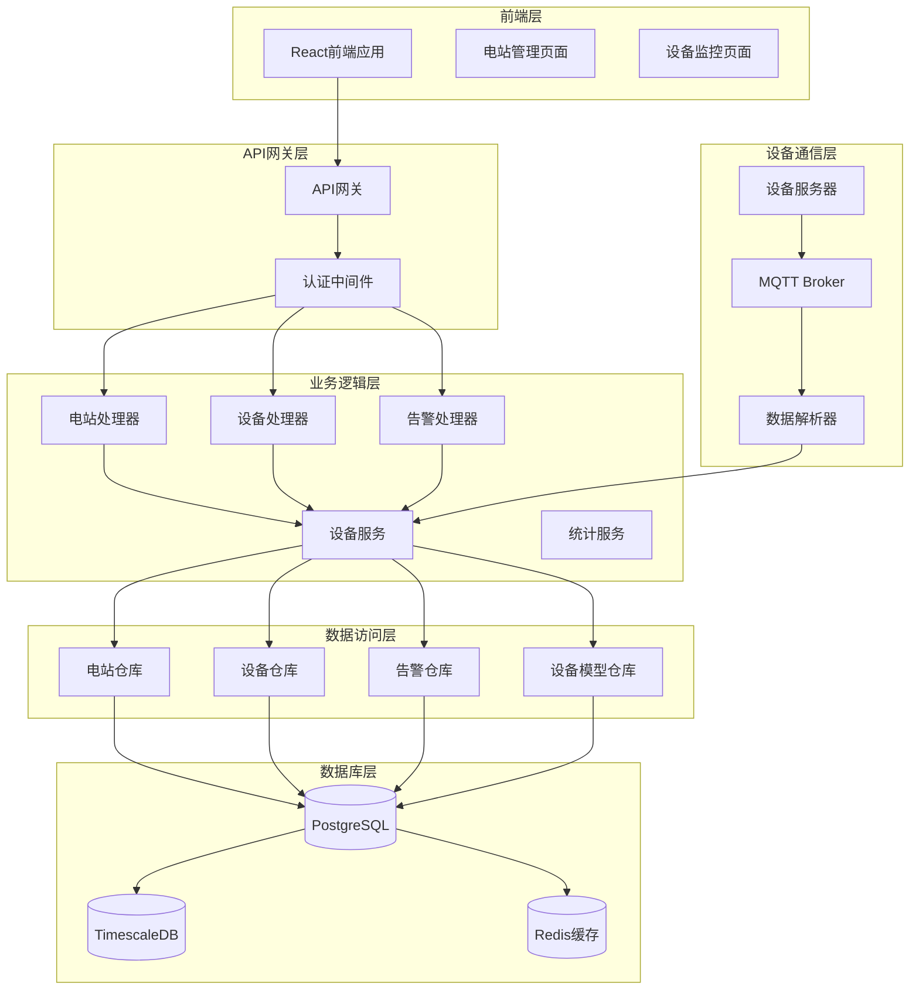

**图表来源**
- [main.go:420-441](file://inv_api_server/cmd/main.go#L420-L441)
- [station_handler.go:17-27](file://inv_api_server/internal/handler/station_handler.go#L17-L27)
- [services.go:264-306](file://inv_api_server/internal/service/services.go#L264-L306)

## 核心组件

### 1. 电站处理器 (StationHandler)

电站处理器是电站管理的核心控制器，负责处理所有与电站相关的HTTP请求：

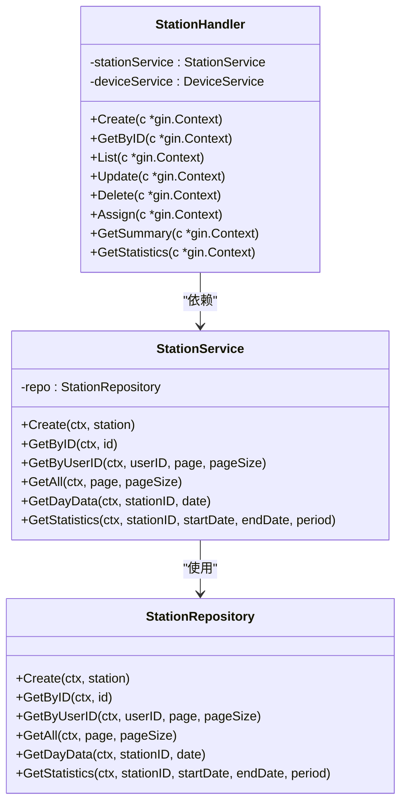

**图表来源**
- [station_handler.go:17-27](file://inv_api_server/internal/handler/station_handler.go#L17-L27)
- [services.go:264-306](file://inv_api_server/internal/service/services.go#L264-L306)

### 2. 数据模型

系统采用清晰的数据模型设计，支持灵活的扩展：

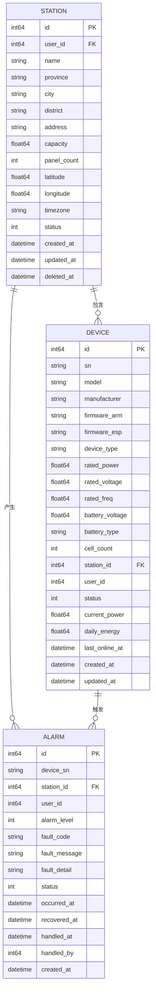

**图表来源**
- [models.go:22-41](file://inv_api_server/internal/model/models.go#L22-L41)
- [models.go:43-66](file://inv_api_server/internal/model/models.go#L43-L66)
- [models.go:130-145](file://inv_api_server/internal/model/models.go#L130-L145)

**章节来源**
- [station_handler.go:17-27](file://inv_api_server/internal/handler/station_handler.go#L17-L27)
- [services.go:264-306](file://inv_api_server/internal/service/services.go#L264-L306)
- [models.go:22-145](file://inv_api_server/internal/model/models.go#L22-L145)

## 电站列表管理

### 1. 列表展示功能

电站列表页面提供了完整的电站概览信息，支持多种筛选和排序方式：

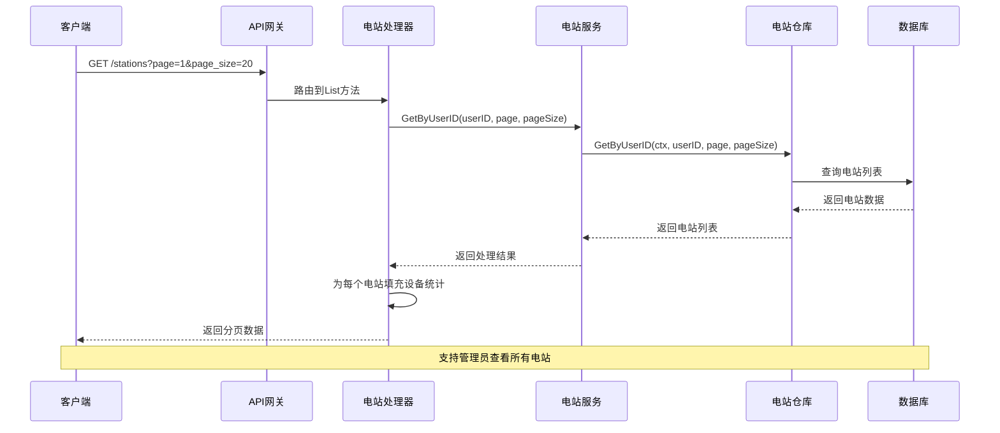

**图表来源**
- [station_handler.go:434-510](file://inv_api_server/internal/handler/station_handler.go#L434-L510)
- [repositories.go:559-591](file://inv_api_server/internal/repository/repositories.go#L559-L591)

### 2. 设备分布统计

系统提供详细的设备分布统计信息，包括在线率、故障率等关键指标：

| 指标名称 | 计算方式 | 用途 |
|---------|---------|------|
| 设备总数 | SELECT COUNT(*) FROM devices | 总体规模统计 |
| 在线设备数 | status = 1 | 运行状态监控 |
| 故障设备数 | status = 2 | 异常情况预警 |
| 今日发电量 | SUM(daily_pv) | 当日业绩评估 |
| 累计发电量 | SUM(total_pv) | 历史业绩统计 |

**章节来源**
- [station_handler.go:464-509](file://inv_api_server/internal/handler/station_handler.go#L464-L509)
- [repositories.go:1275-1324](file://inv_api_server/internal/repository/repositories.go#L1275-L1324)

## 电站详情页面

### 1. 电站概况展示

电站详情页面提供全面的电站信息展示，包括基础信息、运行状态和统计数据：

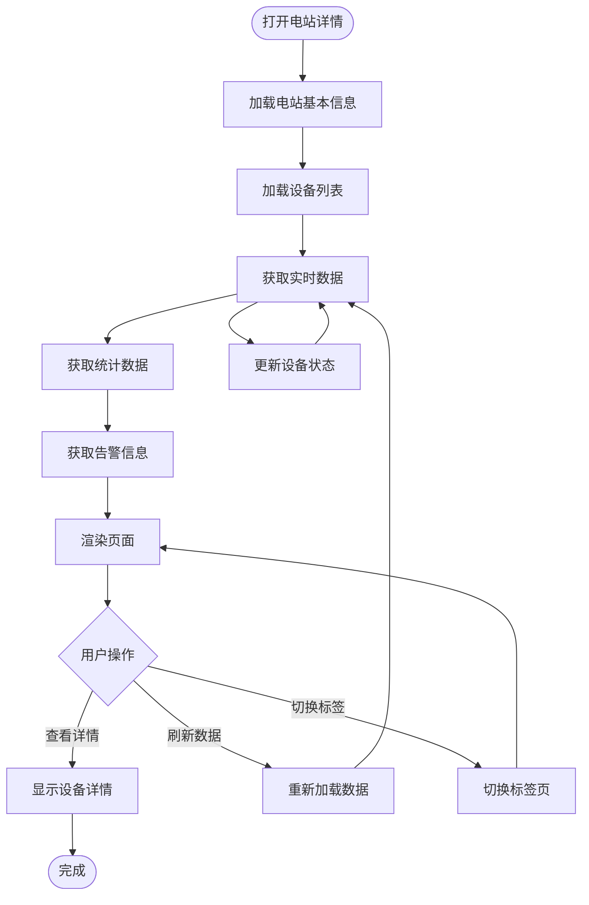

**图表来源**
- [station_handler.go:261-432](file://inv_api_server/internal/handler/station_handler.go#L261-L432)
- [index.tsx:156-216](file://inv-admin-frontend/src/pages/stations/index.tsx#L156-L216)

### 2. 设备清单管理

设备清单页面提供详细的设备信息和实时状态：

| 设备属性 | 显示格式 | 更新频率 |
|---------|---------|---------|
| 设备SN | 文本框 | 实时 |
| 设备型号 | 下拉选择 | 实时 |
| 设备状态 | 状态标签 | 15秒 |
| 额定功率 | 数字显示(W) | 实时 |
| 固件版本 | 文本框 | 实时 |
| 最后通信时间 | 日期时间 | 实时 |
| 实时功率 | 数字显示(W) | 15秒 |
| 日发电量 | 数字显示(kWh) | 实时 |

**章节来源**
- [index.tsx:432-496](file://inv-admin-frontend/src/pages/stations/index.tsx#L432-L496)
- [DeviceMonitorPage.tsx:254-281](file://inv-admin-frontend/src/pages/portal/DeviceMonitorPage.tsx#L254-L281)

### 3. 运行数据展示

运行数据页面提供历史数据和趋势分析：

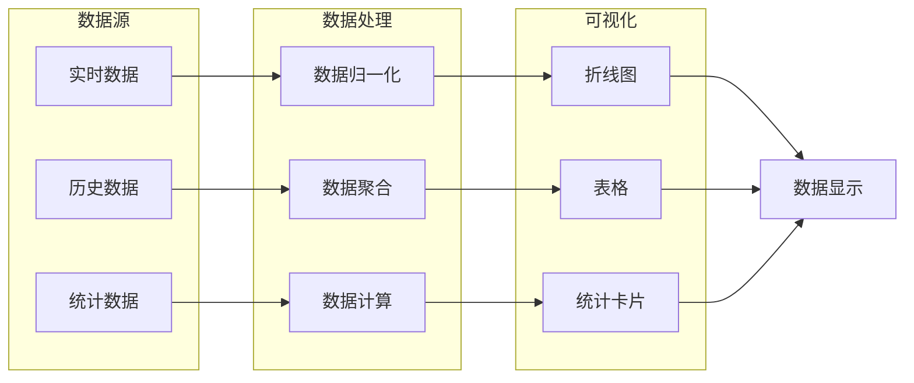

**图表来源**
- [repositories.go:1370-1380](file://inv_api_server/internal/repository/repositories.go#L1370-L1380)
- [index.tsx:270-315](file://inv-admin-frontend/src/pages/stations/index.tsx#L270-L315)

**章节来源**
- [index.tsx:643-728](file://inv-admin-frontend/src/pages/stations/index.tsx#L643-L728)
- [repositories.go:657-721](file://inv_api_server/internal/repository/repositories.go#L657-L721)

## 电站创建与配置

### 1. 电站创建流程

电站创建流程确保数据完整性和一致性：

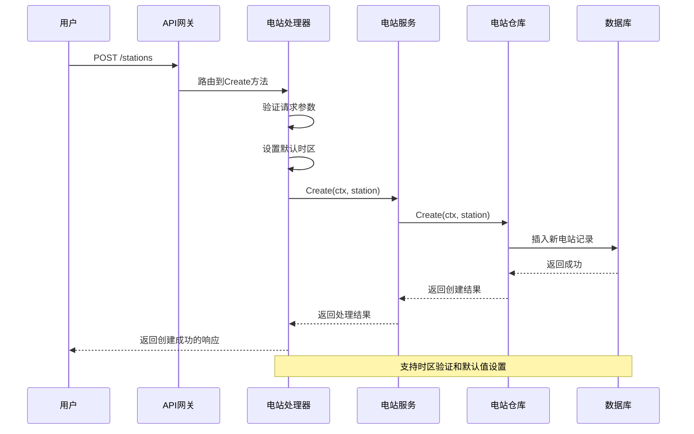

**图表来源**
- [station_handler.go:44-86](file://inv_api_server/internal/handler/station_handler.go#L44-L86)
- [services.go:272-274](file://inv_api_server/internal/service/services.go#L272-L274)

### 2. 电站配置参数

创建电站时需要配置的关键参数：

| 参数名称 | 数据类型 | 必填 | 默认值 | 说明 |
|---------|---------|------|--------|------|
| name | string | 是 | - | 电站名称 |
| province | string | 否 | - | 省份 |
| city | string | 否 | - | 城市 |
| district | string | 否 | - | 区县 |
| address | string | 否 | - | 详细地址 |
| capacity | float64 | 否 | 0 | 装机容量(kW) |
| panel_count | int | 否 | 0 | 太阳能板数量 |
| peak_price | float64 | 否 | 0 | 尖峰电价 |
| valley_price | float64 | 否 | 0 | 低谷电价 |
| latitude | float64 | 否 | 0 | 纬度 |
| longitude | float64 | 否 | 0 | 经度 |
| timezone | string | 否 | Asia/Shanghai | 时区 |

**章节来源**
- [station_handler.go:29-42](file://inv_api_server/internal/handler/station_handler.go#L29-L42)
- [station_handler.go:103-180](file://inv_api_server/internal/handler/station_handler.go#L103-L180)

### 3. 设备绑定流程

设备绑定到电站的完整流程：

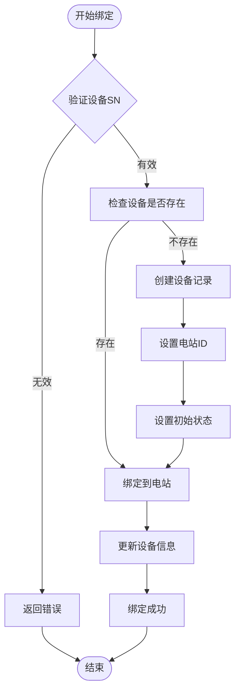

**图表来源**
- [services.go:379-381](file://inv_api_server/internal/service/services.go#L379-L381)
- [repositories.go:1063-1109](file://inv_api_server/internal/repository/repositories.go#L1063-L1109)

**章节来源**
- [services.go:379-381](file://inv_api_server/internal/service/services.go#L379-L381)
- [repositories.go:1063-1109](file://inv_api_server/internal/repository/repositories.go#L1063-L1109)

## 数据统计功能

### 1. 发电量统计

系统提供多维度的发电量统计分析：

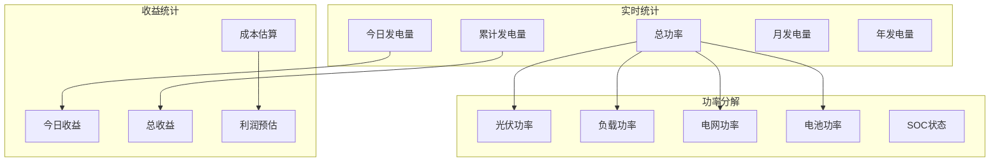

**图表来源**
- [station_handler.go:384-424](file://inv_api_server/internal/handler/station_handler.go#L384-L424)
- [repositories.go:1275-1349](file://inv_api_server/internal/repository/repositories.go#L1275-L1349)

### 2. 统计数据分析

系统支持多种时间粒度的数据分析：

| 时间粒度 | 数据精度 | 查询复杂度 | 适用场景 |
|---------|---------|-----------|----------|
| 小时级 | 1小时 | 中等 | 实时监控 |
| 日级 | 1天 | 低 | 历史趋势 |
| 月级 | 1个月 | 低 | 月度报告 |
| 年级 | 1年 | 低 | 年度分析 |

**章节来源**
- [station_handler.go:639-671](file://inv_api_server/internal/handler/station_handler.go#L639-L671)
- [repositories.go:657-721](file://inv_api_server/internal/repository/repositories.go#L657-L721)

### 3. 效率分析

效率分析功能帮助用户了解电站运行效率：

| 效率指标 | 计算公式 | 正常范围 | 分析价值 |
|---------|---------|---------|----------|
| 发电效率 | 实际发电量/理论发电量 | 70%-95% | 评估设备性能 |
| 设备利用率 | 在线设备数/总设备数 | 80%-100% | 监控设备可用性 |
| 负载率 | 实际功率/装机容量 | 60%-100% | 评估负载匹配 |
| 自用率 | 自发自用电量/总发电量 | 40%-80% | 评估能源利用 |

**章节来源**
- [repositories.go:1249-1273](file://inv_api_server/internal/repository/repositories.go#L1249-L1273)
- [repositories.go:1275-1349](file://inv_api_server/internal/repository/repositories.go#L1275-L1349)

## 告警管理

### 1. 告警分类体系

系统采用多层级告警分类机制：

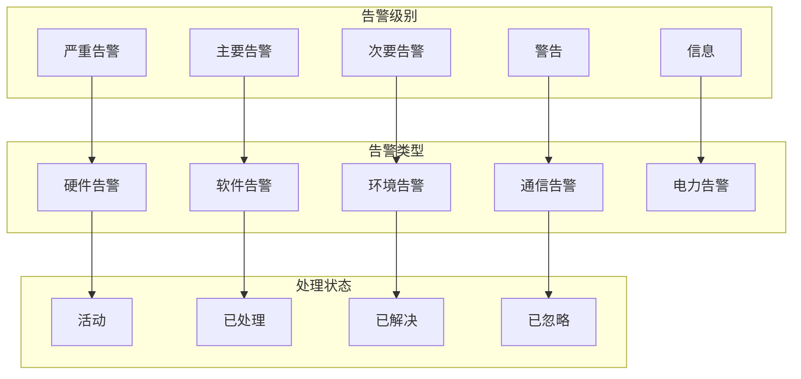

**图表来源**
- [models.go:130-145](file://inv_api_server/internal/model/models.go#L130-L145)
- [index.tsx:500-536](file://inv-admin-frontend/src/pages/stations/index.tsx#L500-L536)

### 2. 告警处理流程

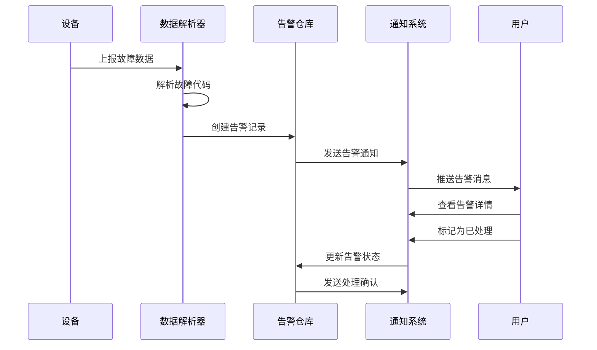

**图表来源**
- [protocol_parser.go:528-529](file://inv_device_server/internal/service/protocol_parser.go#L528-L529)
- [repositories.go:2496-2668](file://inv_api_server/internal/repository/repositories.go#L2496-L2668)

**章节来源**
- [index.tsx:212-216](file://inv-admin-frontend/src/pages/stations/index.tsx#L212-L216)
- [repositories.go:2504-2668](file://inv_api_server/internal/repository/repositories.go#L2504-L2668)

## 维护计划

### 1. 预测性维护

系统支持基于数据分析的预测性维护：

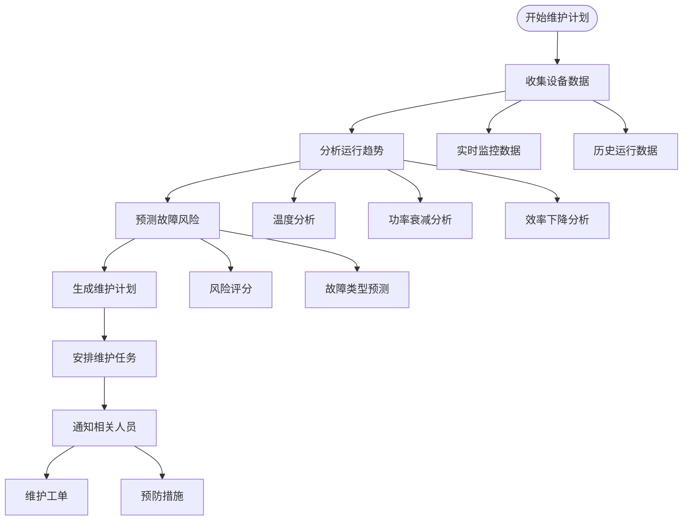

### 2. 维护工单管理

维护工单系统提供完整的维护流程管理：

| 工单状态 | 描述 | 处理要求 |
|---------|------|---------|
| 新建 | 工单创建 | 填写故障描述和紧急程度 |
| 待处理 | 工单分配 | 指派维修人员和预计到达时间 |
| 进行中 | 维修执行 | 记录维修过程和使用材料 |
| 已完成 | 维修验收 | 验收结果和客户确认 |
| 已关闭 | 工单归档 | 归档保存和统计分析 |

**章节来源**
- [db_maintenance.sh:23-41](file://deploy/scripts/db_maintenance.sh#L23-L41)

## 性能优化

### 1. 数据库优化策略

系统采用多层次的数据库优化策略：

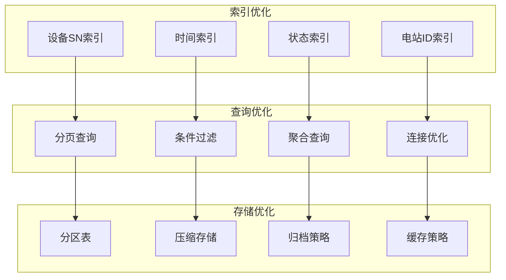

**图表来源**
- [repositories.go:657-721](file://inv_api_server/internal/repository/repositories.go#L657-L721)
- [db_maintenance.sh:23-41](file://deploy/scripts/db_maintenance.sh#L23-L41)

### 2. 缓存策略

系统采用多级缓存策略提升性能：

| 缓存层级 | 缓存类型 | 过期时间 | 用途 |
|---------|---------|---------|------|
| 应用层缓存 | 设备实时数据 | 30秒 | 实时监控数据 |
| 应用层缓存 | 用户权限信息 | 5分钟 | 权限验证 |
| 分布式缓存 | 热点数据 | 1小时 | 配置信息 |
| 数据库缓存 | 查询结果 | 10分钟 | 统计数据 |

**章节来源**
- [repositories.go:1370-1380](file://inv_api_server/internal/repository/repositories.go#L1370-L1380)
- [services.go:317-333](file://inv_api_server/internal/service/services.go#L317-L333)

## 故障排查

### 1. 常见问题诊断

系统提供完善的故障诊断和排查功能：

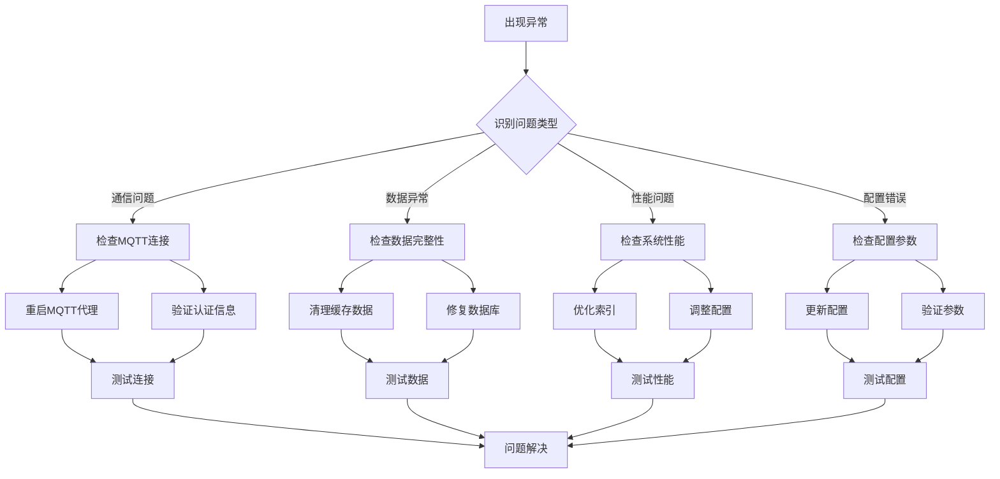

### 2. 错误处理机制

系统采用分级的错误处理机制：

| 错误级别 | 处理方式 | 通知方式 | 恢复策略 |
|---------|---------|---------|---------|
| 信息级 | 记录日志 | 无 | 自动恢复 |
| 警告级 | 记录日志 | 邮件通知 | 手动干预 |
| 严重级 | 记录日志 | 立即通知 | 自动降级 |
| 危险级 | 立即停机 | 紧急报警 | 手动恢复 |

**章节来源**
- [protocol_parser.go:513-519](file://inv_device_server/internal/service/protocol_parser.go#L513-L519)
- [services.go:524-560](file://inv_api_server/internal/service/services.go#L524-L560)

## 总结

电站管理模块是一个功能完善、架构合理的智能光伏管理系统。该模块具有以下特点：

### 核心优势

1. **完整的功能覆盖**：从电站创建到设备管理，从数据统计到告警处理，提供全生命周期管理
2. **高性能架构**：采用微服务架构，支持高并发和大数据量处理
3. **实时监控能力**：提供实时数据展示和告警通知功能
4. **灵活的扩展性**：基于接口设计，支持功能模块的灵活扩展
5. **完善的运维支持**：提供故障诊断、性能监控和维护管理功能

### 技术特色

1. **多层缓存策略**：结合应用层和分布式缓存，提升系统响应速度
2. **异步处理机制**：设备控制命令采用异步处理，提高系统吞吐量
3. **数据归档策略**：自动清理历史数据，保证系统长期稳定运行
4. **安全防护机制**：多重身份验证和权限控制，确保系统安全

### 应用价值

该模块为企业和用户提供了一个专业、可靠的光伏电站管理平台，能够有效提升电站运营效率，降低运维成本，为清洁能源的发展提供技术支撑。

通过持续的功能优化和技术升级，电站管理模块将继续为企业数字化转型和智能化发展做出重要贡献。