# 移动端应用

<cite>
**本文引用的文件**
- [README.md](file://README.md)
- [MainActivity.kt](file://inv_app/android/app/src/main/kotlin/com/example/inv_app/MainActivity.kt)
- [app_config.dart](file://inv_app/lib/core/config/app_config.dart)
- [app_constants.dart](file://inv_app/lib/core/constants/app_constants.dart)
- [alarm_code_mapping.dart](file://inv_app/lib/core/data/alarm_code_mapping.dart)
- [china_regions.dart](file://inv_app/lib/core/data/china_regions.dart)
- [command_result.dart](file://inv_app/lib/core/entities/command_result.dart)
- [device_model_field.dart](file://inv_app/lib/core/entities/device_model_field.dart)
- [energy_data_point.dart](file://inv_app/lib/core/entities/energy_data_point.dart)
- [inverter_data.dart](file://inv_app/lib/core/entities/inverter_data.dart)
- [offline_action.dart](file://inv_app/lib/core/entities/offline_action.dart)
- [exceptions.dart](file://inv_app/lib/core/errors/exceptions.dart)
- [failures.dart](file://inv_app/lib/core/errors/failures.dart)
- [ota_error_types.dart](file://inv_app/lib/core/errors/ota_error_types.dart)
- [app_router.dart](file://inv_app/lib/core/router/app_router.dart)
- [auth_guard.dart](file://inv_app/lib/core/router/guards/auth_guard.dart)
- [api_service.dart](file://inv_app/lib/core/services/api_service.dart)
- [app_update_service.dart](file://inv_app/lib/core/services/app_update_service.dart)
- [connection_mode_service.dart](file://inv_app/lib/core/services/connection_mode_service.dart)
- [contact_service.dart](file://inv_app/lib/core/services/contact_service.dart)
- [data_cache_service.dart](file://inv_app/lib/core/services/data_cache_service.dart)
- [firmware_download_service.dart](file://inv_app/lib/core/services/firmware_download_service.dart)
- [local_communication_service.dart](file://inv_app/lib/core/services/local_communication_service.dart)
- [local_discovery_service.dart](file://inv_app/lib/core/services/local_discovery_service.dart)
- [local_firmware_service.dart](file://inv_app/lib/core/services/local_firmware_service.dart)
- [ota_service.dart](file://inv_app/lib/core/services/ota_service.dart)
- [notification_service.dart](file://inv_app/lib/core/services/notification_service.dart)
- [client.go](file://inv_device_server/internal/mqtt/client.go)
- [models.go](file://inv_api_server/internal/model/models.go)
- [ota_handler.go](file://inv_api_server/internal/handler/ota_handler.go)
- [ota_repository.go](file://inv_api_server/internal/repository/ota_repository.go)
- [ota_service.go](file://inv_api_server/internal/service/ota_service.go)
- [notification_handler.go](file://inv_api_server/internal/handler/notification_handler.go)
- [ota_bloc.dart](file://inv_app/lib/features/ota/presentation/bloc/ota_bloc.dart)
- [ota_event.dart](file://inv_app/lib/features/ota/presentation/bloc/ota_event.dart)
- [ota_state.dart](file://inv_app/lib/features/ota/presentation/bloc/ota_state.dart)
- [ota_repository.dart](file://inv_app/lib/features/ota/domain/repositories/ota_repository.dart)
- [ota_repository_impl.dart](file://inv_app/lib/features/ota/data/repositories/ota_repository_impl.dart)
- [ota_remote_data_source.dart](file://inv_app/lib/features/ota/data/datasources/ota_remote_data_source.dart)
- [ota_page.dart](file://inv_app/lib/features/ota/presentation/pages/ota_page.dart)
- [local_ota_page.dart](file://inv_app/lib/features/ota/presentation/pages/local_ota_page.dart)
- [firmware_list_page.dart](file://inv_app/lib/features/ota/presentation/pages/firmware_list_page.dart)
- [ota_tab_page.dart](file://inv_app/lib/features/ota/presentation/pages/ota_tab_page.dart)
- [device_bloc.dart](file://inv_app/lib/features/device/presentation/bloc/device_bloc.dart)
- [local_mode_page.dart](file://inv_app/lib/features/device/presentation/pages/local_mode_page.dart)
- [009_upgrade_tasks.up.sql](file://database/migrations/009_upgrade_tasks.up.sql)
- [008_upgrade_packages.up.sql](file://database/migrations/008_upgrade_packages.up.sql)
</cite>

## 更新摘要
**所做更改**
- 新增固件版本列表界面，支持卡片式布局和当前版本高亮显示
- 实现复杂的复合版本号比较逻辑，支持V3.0.2.20250601格式的版本字符串
- 添加回滚警告机制，在降级安装时提供用户确认对话框
- 从三个不同的OTA页面入口点访问固件列表功能
- 增强本地固件服务，支持ESP和ARM芯片的固件上传和进度监控

## 目录
1. [简介](#简介)
2. [项目结构](#项目结构)
3. [核心组件](#核心组件)
4. [架构总览](#架构总览)
5. [详细组件分析](#详细组件分析)
6. [依赖关系分析](#依赖关系分析)
7. [性能考虑](#性能考虑)
8. [故障排查指南](#故障排查指南)
9. [结论](#结论)
10. [附录](#附录)

## 简介
本项目是一个基于 Flutter 3.x 的跨平台移动应用，采用 BLoC 状态管理模式，结合 go_router 路由系统与 AuthGuard 鉴权守卫，构建了从配置管理、实体模型、服务层到通用组件的完整核心模块。经过重大重构后，系统现已集成了全新的OTA功能模块、本地通信服务和通知系统，围绕告警管理、用户认证、仪表盘、设备管理、个人中心、电站管理、数据统计等业务模块展开。应用通过 MQTT 客户端直连 EMQX Broker 实现实时数据推送，同时利用 HTTP REST API 提供历史与统计查询能力；系统还支持国际化、主题切换与响应式布局，具备完善的错误处理与性能优化策略。

## 项目结构
移动端应用位于 inv_app 目录，采用"核心模块(core)+功能模块(features)"的分层组织方式：
- core：包含配置(app_config.dart)、常量(app_constants.dart)、实体模型(entities)、错误处理(errors)、路由(router)、服务层(services)、数据(data)
- features：按业务域划分，如 alarm、auth、dashboard、device、profile、station、statistics、ota
- assets：资源文件(images/icons/data)
- android/ios：原生平台集成
- pubspec.yaml：Dart 依赖声明

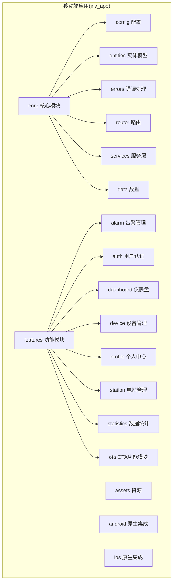

**章节来源**
- [README.md:33-58](file://README.md#L33-L58)

## 核心组件
- 配置管理：集中管理应用运行时配置，如 MQTT Broker 地址、API 服务地址、主题开关等
- 实体模型：封装逆变器实时数据、设备信息、告警、能量点等核心领域对象
- 错误处理：统一异常类型与失败封装，便于上层统一处理
- 路由系统：go_router + AuthGuard，提供声明式路由与鉴权守卫
- 服务层：HTTP API 调用(api_service.dart)、MQTT 连接、OTA 下载、本地通信、缓存等
- 数据层：告警码映射、区域数据、离线动作等

**章节来源**
- [app_config.dart:1-200](file://inv_app/lib/core/config/app_config.dart#L1-L200)
- [inverter_data.dart:1-400](file://inv_app/lib/core/entities/inverter_data.dart#L1-L400)
- [exceptions.dart:1-50](file://inv_app/lib/core/errors/exceptions.dart#L1-L50)
- [app_router.dart:1-200](file://inv_app/lib/core/router/app_router.dart#L1-L200)
- [auth_guard.dart:1-120](file://inv_app/lib/core/router/guards/auth_guard.dart#L1-L120)
- [api_service.dart:1-200](file://inv_app/lib/core/services/api_service.dart#L1-L200)

## 架构总览
系统采用"实时直连 MQTT + 历史查询 HTTP"的双通道架构：
- 实时链路：设备 → EMQX Broker → $share/inv-group/ → 设备服务 → 应用直连订阅
- 历史链路：应用 → HTTP REST → API Server → PostgreSQL 查询返回
- 认证：EMQX 内置 JWT(HS256)，App 与 API Server 共用 Secret

```mermaid
graph TB
subgraph "设备侧"
DEVICE["逆变器设备(ESP32)"]
END
subgraph "消息中间件"
EMQX["EMQX Broker<br/>JWT认证/共享订阅"]
END
subgraph "后端服务"
DEV_SRV["设备通讯服务(inv_device_server)<br/>Redis Streams/Streams消费者"]
API_SRV["API服务(inv_api_server)<br/>REST API + Admin"]
OTA_SRV["OTA服务<br/>固件管理+升级任务"]
NOTI_SRV["通知服务<br/>推送+本地通知"]
END
subgraph "移动端"
APP["Flutter App<br/>BLoC + go_router + MQTT直连"]
OTA_FEATURE["OTA功能模块<br/>固件升级+状态跟踪"]
LOCAL_COMM["本地通信服务<br/>蓝牙/WiFi直连"]
FIRMWARE_LIST["固件列表界面<br/>版本管理+回滚保护"]
NOTI_FEATURE["通知系统<br/>实时推送+本地提醒"]
END
DEVICE --> EMQX
EMQX --> DEV_SRV
DEV_SRV --> API_SRV
APP --> EMQX
APP --> API_SRV
OTA_FEATURE --> OTA_SRV
LOCAL_COMM --> DEV_SRV
FIRMWARE_LIST --> OTA_FEATURE
NOTI_FEATURE --> NOTI_SRV
```

**章节来源**
- [README.md:7-31](file://README.md#L7-L31)
- [README.md:206-225](file://README.md#L206-L225)

## 详细组件分析

### BLoC 状态管理模式
- 事件驱动：通过事件触发状态变更，保证状态可预测性
- 状态管理：将 UI 状态与业务状态分离，便于测试与维护
- 副作用管理：将网络请求、MQTT 订阅等副作用隔离在 Bloc 或 Service 层，避免 UI 层承担过多职责
- 最佳实践：使用独立的 Bloc/Repository/Service，遵循单一职责；对异步操作进行错误捕获与回退

### 路由系统与 AuthGuard
- go_router 配置：声明式路由，支持命名路由、动态参数、条件导航
- AuthGuard 鉴权守卫：在导航前检查登录状态，未登录跳转至登录页
- 页面导航：通过 context.push/pop 实现页面跳转与返回

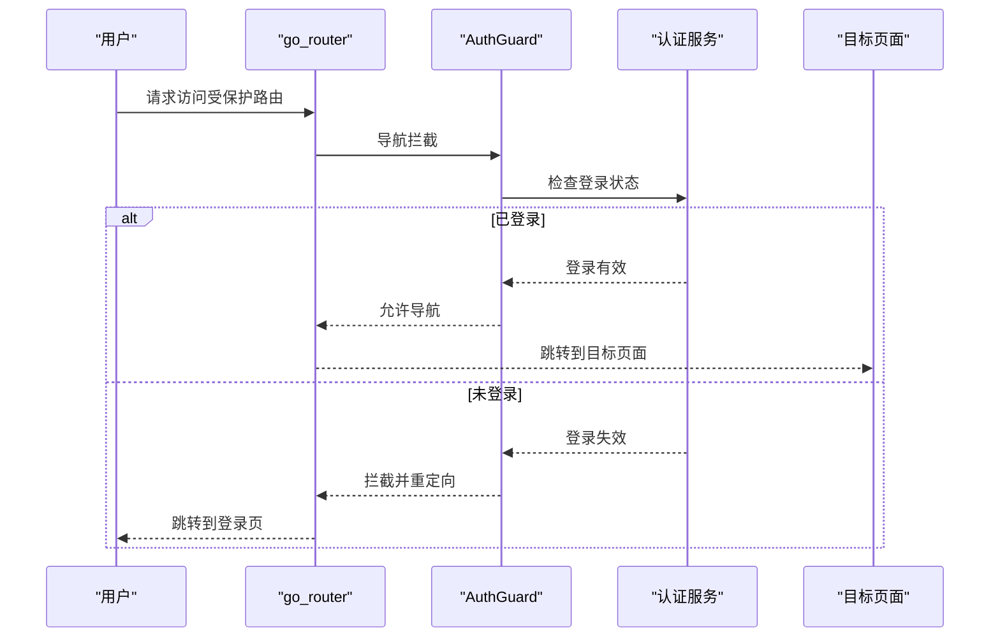

**章节来源**
- [app_router.dart:1-200](file://inv_app/lib/core/router/app_router.dart#L1-L200)
- [auth_guard.dart:1-120](file://inv_app/lib/core/router/guards/auth_guard.dart#L1-L120)

### 核心模块组织结构
- 配置管理：集中管理 MQTT Broker、API 地址、主题开关等
- 实体模型：逆变器实时数据、设备信息、告警、能量点等
- 服务层：HTTP API、MQTT 客户端、OTA 下载、本地通信、缓存
- 通用组件：仪表盘、状态指示、相位条等可复用 UI 组件
- 错误处理：统一异常与失败封装

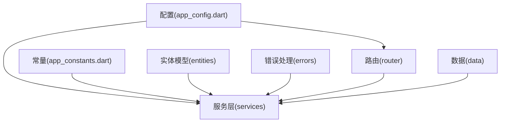

**章节来源**
- [app_config.dart:1-200](file://inv_app/lib/core/config/app_config.dart#L1-L200)
- [app_constants.dart:1-200](file://inv_app/lib/core/constants/app_constants.dart#L1-L200)
- [inverter_data.dart:1-400](file://inv_app/lib/core/entities/inverter_data.dart#L1-L400)
- [exceptions.dart:1-50](file://inv_app/lib/core/errors/exceptions.dart#L1-L50)
- [app_router.dart:1-200](file://inv_app/lib/core/router/app_router.dart#L1-L200)
- [api_service.dart:1-200](file://inv_app/lib/core/services/api_service.dart#L1-L200)

### 功能模块实现
- 告警管理：告警列表展示、告警码映射、告警详情与处理
- 用户认证：登录、注册、密码重置、会话管理
- 仪表盘：电站概览、设备状态、今日发电量等关键指标
- 设备管理：设备详情、实时监控、参数配置、Wi-Fi 配网、OTA 升级
- 个人中心：账户设置、设备分享、联系人管理
- 电站管理：电站 CRUD、设备绑定、权限分配
- 数据统计：历史数据查询、图表分析、趋势展示
- OTA功能：固件升级管理、状态跟踪、本地升级流程

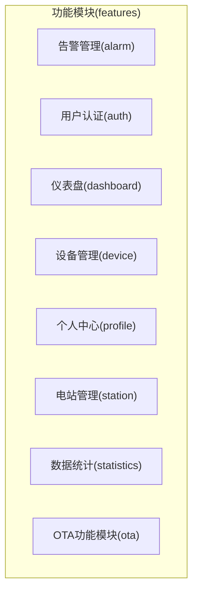

**章节来源**
- [alarm_code_mapping.dart:1-120](file://inv_app/lib/core/data/alarm_code_mapping.dart#L1-L120)
- [README.md:322-342](file://README.md#L322-L342)

### OTA功能模块重构
**更新** OTA功能经过重大重构，现在提供完整的固件升级管理能力

- OTA服务架构：基于 inv_api_server 的全新OTA服务模块，支持固件版本管理、升级任务调度和状态跟踪
- 固件下载管理：独立的 firmware_download_service.dart，支持断点续传、进度监控和校验机制
- 升级状态跟踪：实时监控升级进度，支持暂停、恢复和取消操作
- 设备兼容性：自动检测设备固件版本，智能匹配最优升级路径
- 安全机制：固件签名验证、完整性校验和加密传输

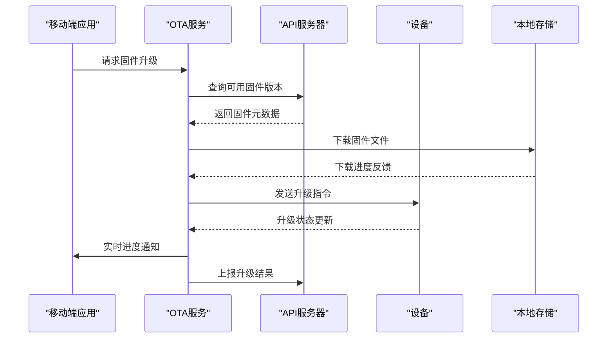

**章节来源**
- [ota_service.dart](file://inv_app/lib/core/services/ota_service.dart)
- [firmware_download_service.dart](file://inv_app/lib/core/services/firmware_download_service.dart)
- [ota_handler.go:1-200](file://inv_api_server/internal/handler/ota_handler.go#L1-L200)
- [ota_repository.go:1-200](file://inv_api_server/internal/repository/ota_repository.go#L1-L200)
- [ota_service.go:1-200](file://inv_api_server/internal/service/ota_service.go#L1-L200)

### 新增固件版本列表界面
**更新** 新增完整的固件版本列表界面，提供丰富的版本管理和回滚保护功能

- 卡片式布局：每个固件版本以卡片形式展示，包含版本号、芯片信息、更新日志和创建日期
- 当前版本高亮：自动识别并高亮显示当前安装的固件版本，使用绿色边框和标签标识
- 复杂版本比较：支持V3.0.2.20250601格式的复合版本号比较，正确处理主版本号和子版本号
- 回滚警告机制：当检测到降级安装时，弹出警告对话框提醒用户潜在风险
- 多入口点支持：从OTA页面、单芯片升级和包模式升级三个不同入口访问固件列表

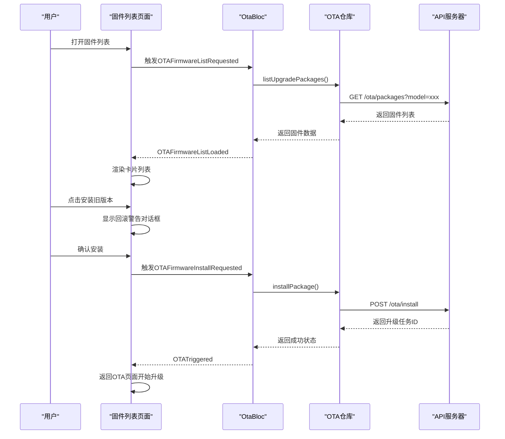

**章节来源**
- [firmware_list_page.dart:1-461](file://inv_app/lib/features/ota/presentation/pages/firmware_list_page.dart#L1-L461)
- [ota_bloc.dart:115-140](file://inv_app/lib/features/ota/presentation/bloc/ota_bloc.dart#L115-L140)
- [ota_event.dart:51-69](file://inv_app/lib/features/ota/presentation/bloc/ota_event.dart#L51-L69)
- [ota_state.dart:67-94](file://inv_app/lib/features/ota/presentation/bloc/ota_state.dart#L67-L94)

### 增强的版本比较逻辑
**更新** 实现了 sophisticated 的版本比较算法，支持复合版本号字符串

- 版本解析：支持V前缀处理和复合版本格式（如V1.2.3.20240510-V1.2.0.20260629）
- 分段比较：将版本号按点号分割为数字段，逐段进行比较
- 长度适配：自动处理不同长度的版本号，缺失段默认为0
- 规范化处理：提取复合版本中的第一个子版本进行比较

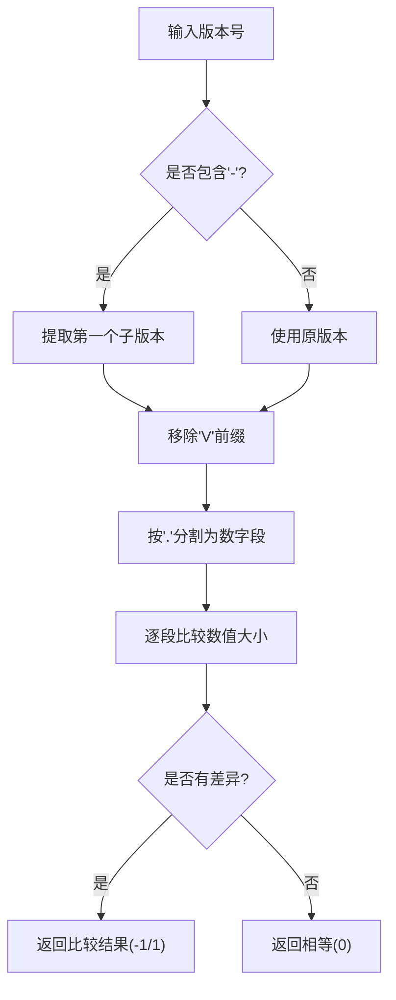

**章节来源**
- [firmware_list_page.dart:20-62](file://inv_app/lib/features/ota/presentation/pages/firmware_list_page.dart#L20-L62)

### 改进的本地通信服务
**更新** 本地通信服务经过重新设计，提供更强大的设备直连能力

- 通信协议适配：支持多种通信协议，包括蓝牙、WiFi直连和串口通信
- 设备发现机制：自动扫描和发现附近设备，支持手动添加模式
- 连接管理：智能连接管理，支持断线重连和连接状态监控
- 数据传输优化：压缩传输、批量处理和错误重试机制
- 安全通信：端到端加密、身份验证和会话管理

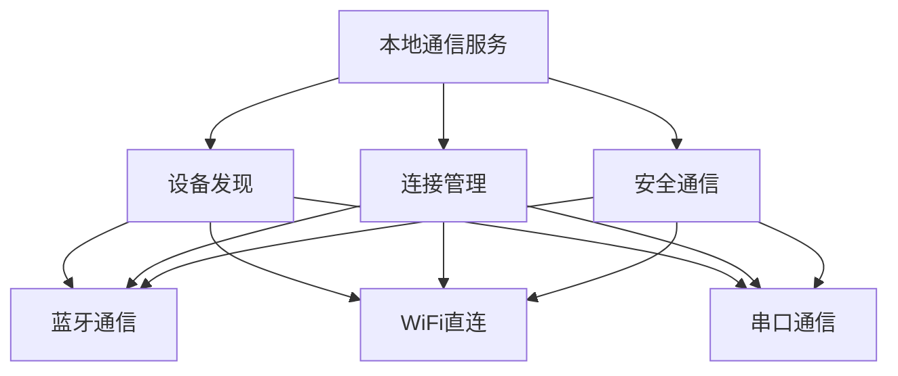

**章节来源**
- [local_communication_service.dart:1-249](file://inv_app/lib/core/services/local_communication_service.dart#L1-L249)
- [local_discovery_service.dart:1-91](file://inv_app/lib/core/services/local_discovery_service.dart#L1-L91)

### 增强的固件服务层
**更新** 固件服务层支持单芯片和升级包两种升级模式

- 单芯片升级：针对特定芯片的固件升级，支持ESP和ARM芯片
- 升级包管理：支持多芯片同时升级的升级包模式
- 版本管理：完整的固件版本管理，包括主版本和子版本
- 状态跟踪：详细的升级状态跟踪和进度监控
- 任务调度：支持立即执行、计划执行和手动执行三种模式

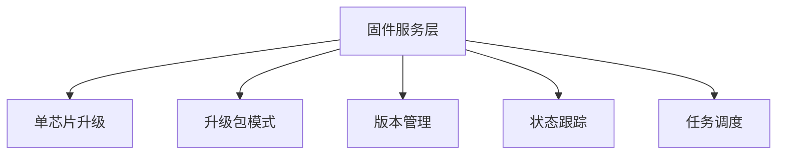

**章节来源**
- [ota_repository.dart:1-10](file://inv_app/lib/features/ota/domain/repositories/ota_repository.dart#L1-L10)
- [ota_repository_impl.dart:1-116](file://inv_app/lib/features/ota/data/repositories/ota_repository_impl.dart#L1-L116)
- [009_upgrade_tasks.up.sql:1-37](file://database/migrations/009_upgrade_tasks.up.sql#L1-L37)
- [008_upgrade_packages.up.sql:30-49](file://database/migrations/008_upgrade_packages.up.sql#L30-L49)

### 新增本地OTA升级页面
**更新** 新增完整的本地OTA升级页面，支持WiFi直连升级流程

- 自动设备发现：自动扫描和连接设备热点
- 固件下载管理：支持预下载和本地固件升级
- 实时进度监控：显示升级进度和状态信息
- 错误处理：完善的错误处理和用户提示
- 多步骤流程：从设备发现到升级完成的完整流程

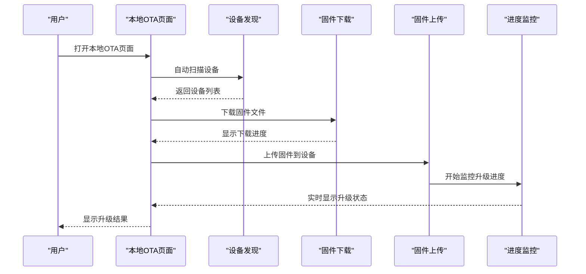

**章节来源**
- [local_ota_page.dart:1-800](file://inv_app/lib/features/ota/presentation/pages/local_ota_page.dart#L1-L800)
- [ota_page.dart:1-741](file://inv_app/lib/features/ota/presentation/pages/ota_page.dart#L1-L741)

### 新增DeviceConnectionException异常处理
**更新** 新增专门的设备连接异常处理机制

- 异常类型定义：DeviceConnectionException类专门处理设备连接异常
- 异常捕获：在OTA升级过程中捕获连接异常，提供友好的错误提示
- 重试机制：支持设备连接失败时的自动重试和用户手动重试
- 状态管理：异常状态与正常升级状态分离，避免UI混乱

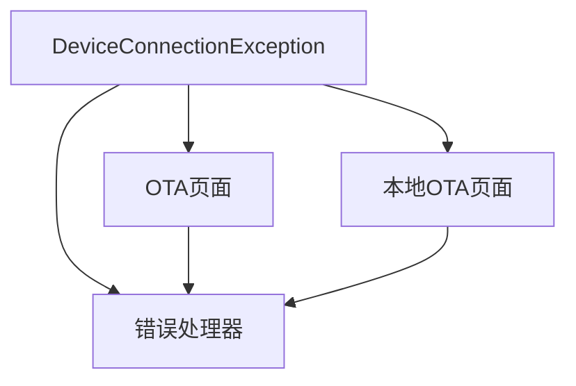

**章节来源**
- [ota_error_types.dart:1-8](file://inv_app/lib/core/errors/ota_error_types.dart#L1-L8)
- [local_ota_page.dart:560-585](file://inv_app/lib/features/ota/presentation/pages/local_ota_page.dart#L560-L585)

### 改进的本地固件服务
**更新** 新增LocalFirmwareService，提供完整的本地固件管理功能

- 固件上传：支持ESP和ARM芯片的固件文件上传，带进度回调
- MD5校验：内置MD5计算功能，确保固件文件完整性
- 连接测试：提供设备连接测试功能，验证设备可达性
- 设备信息获取：获取设备版本信息和固件状态
- 异常处理：统一的LocalFirmwareException异常类型

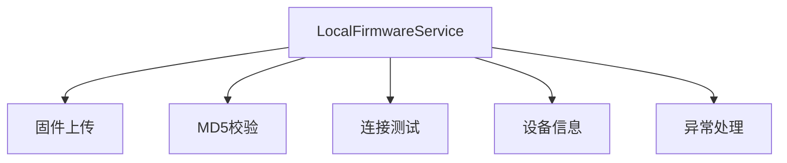

**章节来源**
- [local_firmware_service.dart:1-254](file://inv_app/lib/core/services/local_firmware_service.dart#L1-L254)

### OTA功能的多入口点支持
**更新** 固件列表功能从三个不同的OTA页面入口点提供访问

- OTA主页面入口：在单芯片升级界面底部提供"查看所有固件版本"按钮
- 包模式升级入口：在包模式升级界面同样提供固件列表访问
- 设备管理入口：通过设备列表页面的OTA功能进入固件管理

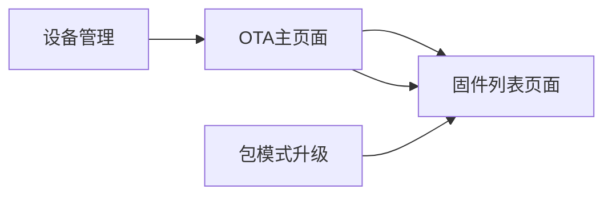

**章节来源**
- [ota_page.dart:344-369](file://inv_app/lib/features/ota/presentation/pages/ota_page.dart#L344-L369)
- [ota_page.dart:550-574](file://inv_app/lib/features/ota/presentation/pages/ota_page.dart#L550-L574)
- [ota_page.dart:829-854](file://inv_app/lib/features/ota/presentation/pages/ota_page.dart#L829-L854)

### MQTT客户端集成与实时数据推送
- 客户端连接：基于 paho.mqtt.golang 的 autopaho 库，支持 TLS/非 TLS、用户名密码、会话保持
- 共享订阅：$share/inv-group/ 前缀，实现多实例负载均衡
- 主题订阅：设备实时数据、OTA 状态、状态变更等主题
- 事件回调：OTA 状态上报、设备在线状态变化回调
- 与设备服务协作：设备服务负责解析与转发，APP 直接订阅实时数据

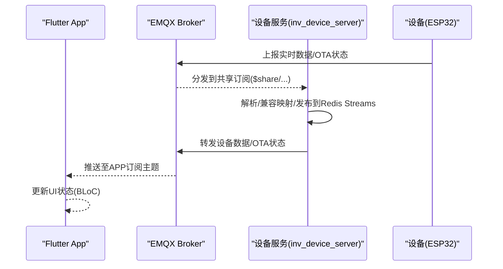

**章节来源**
- [client.go:1-236](file://inv_device_server/internal/mqtt/client.go#L1-L236)
- [README.md:206-214](file://README.md#L206-L214)

### WebSocket连接管理与实时推送
- 管理后台使用 WebSocket 实时推送告警与通知
- 移动端主要通过 MQTT 实时数据流，HTTP 用于历史与统计查询
- WebSocket 与 MQTT 在不同场景互补：后台管理侧重推送，移动端侧重设备直连

**章节来源**
- [README.md:218-222](file://README.md#L218-L222)

### 国际化、主题切换与响应式设计
- 国际化：通过语言包与翻译工具实现多语言支持
- 主题切换：亮/暗主题切换，适配系统偏好
- 响应式设计：根据屏幕尺寸与方向调整布局与组件大小

**章节来源**
- [README.md:112-133](file://README.md#L112-133)

## 依赖关系分析
- 组件耦合：core 作为基础层被 features 依赖；services 与 router 之间弱耦合
- 外部依赖：Dio(HTTP)、go_router(路由)、mqtt_client(移动端 MQTT)、EMQX(Broker)
- 依赖可视化：

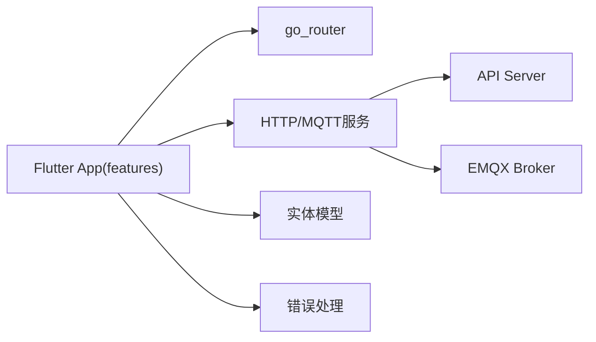

**章节来源**
- [README.md:112-133](file://README.md#L112-133)

## 性能考虑
- 实时链路优先：设备数据通过 MQTT 直连推送，减少轮询与延迟
- 历史查询按需：仅在需要时调用 HTTP API，避免不必要的网络开销
- 缓存策略：本地缓存与服务端缓存结合，提升冷启动与弱网体验
- 内存管理：合理释放订阅与定时器，避免内存泄漏
- UI 优化：懒加载、虚拟列表、图片缓存与占位符

## 故障排查指南
- MQTT 连接失败：检查 Broker 地址、端口、TLS 配置与 JWT Token 是否有效
- 认证失败：确认 JWT Secret 与 EMQX 配置一致，Token 未过期
- 页面无法跳转：检查 go_router 路由配置与 AuthGuard 条件
- 实时数据不更新：确认设备是否在线、主题是否正确订阅、设备服务是否正常转发
- OTA 升级失败：检查固件兼容性、网络连接和存储空间
- 本地通信异常：确认设备可达性、协议支持和权限配置
- 通知接收问题：检查系统通知权限和应用通知设置
- 设备连接异常：捕获 DeviceConnectionException，检查WiFi连接和设备状态
- 固件列表加载失败：检查网络连接、API服务状态和设备型号匹配
- 版本比较异常：验证版本号格式是否符合V3.0.2.20250601规范
- 回滚警告误报：检查当前版本与目标版本的比较逻辑
- 错误处理：统一捕获 exceptions 与 failures，记录日志并提示用户

**章节来源**
- [exceptions.dart:1-50](file://inv_app/lib/core/errors/exceptions.dart#L1-L50)
- [failures.dart:1-120](file://inv_app/lib/core/errors/failures.dart#L1-L120)
- [auth_guard.dart:1-120](file://inv_app/lib/core/router/guards/auth_guard.dart#L1-L120)
- [ota_error_types.dart:1-8](file://inv_app/lib/core/errors/ota_error_types.dart#L1-L8)

## 结论
该 Flutter 移动端应用以清晰的模块化架构为基础，结合 BLoC 状态管理与 go_router 路由体系，实现了从配置、实体、服务到 UI 的全链路解耦。经过重大重构后，系统新增了完整的OTA功能模块、本地通信服务和通知系统，进一步增强了设备管理能力和用户体验。通过 MQTT 直连 EMQX 的实时数据推送与 HTTP 历史查询的互补设计，满足了大规模设备监控与高效交互的需求。配合国际化、主题切换与响应式布局，提供了良好的跨平台用户体验。新增的固件版本列表界面提供了丰富的版本管理功能，包括卡片式布局、当前版本高亮、复杂版本比较和回滚保护机制，从三个不同入口点为用户提供便捷的固件管理体验。建议持续完善测试覆盖、埋点与性能监控，以保障长期稳定运行。

## 附录
- 原生入口：Android MainActivity 继承 FlutterActivity
- 服务端口与组件：API Server(8080)、设备服务(8081)、EMQX(8883/18083)、PostgreSQL、Redis
- 适用逆变器型号：CS-I10-6k2 48V 单相离网逆变器

**章节来源**
- [MainActivity.kt:1-5](file://inv_app/android/app/src/main/kotlin/com/example/inv_app/MainActivity.kt#L1-L5)
- [README.md:195-205](file://README.md#L195-L205)
- [README.md:355-358](file://README.md#L355-L358)