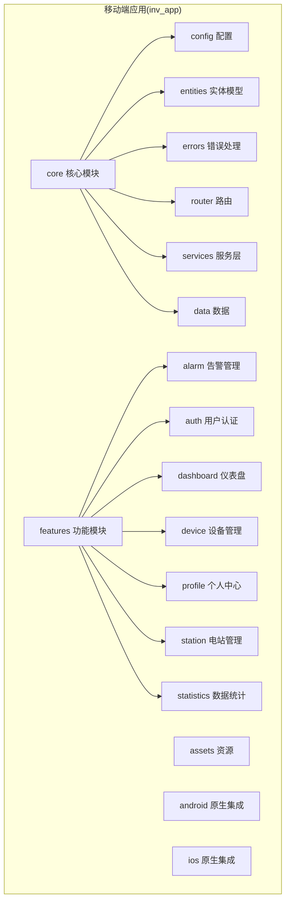
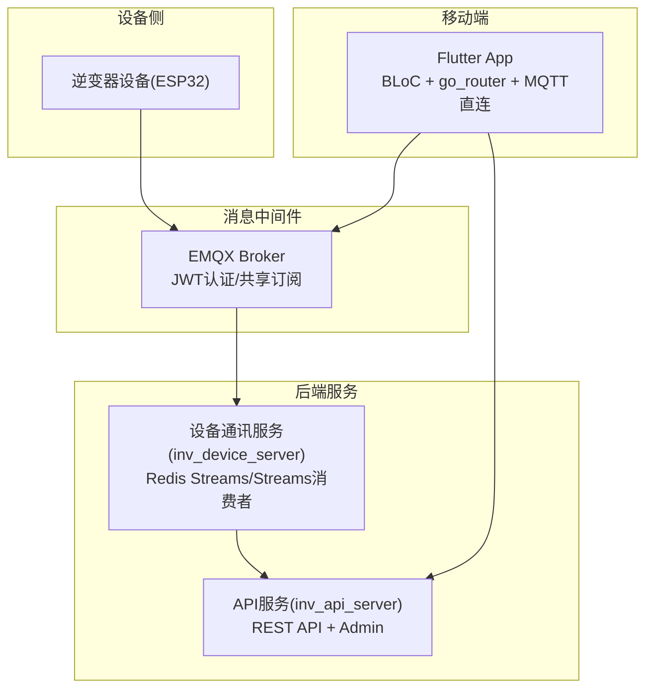
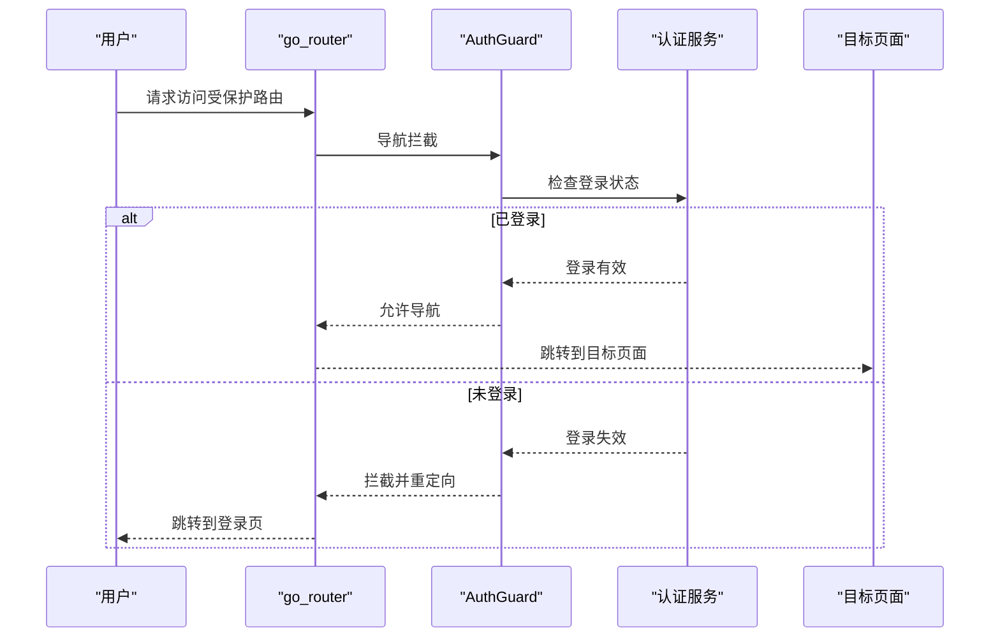
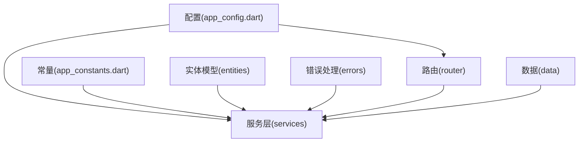
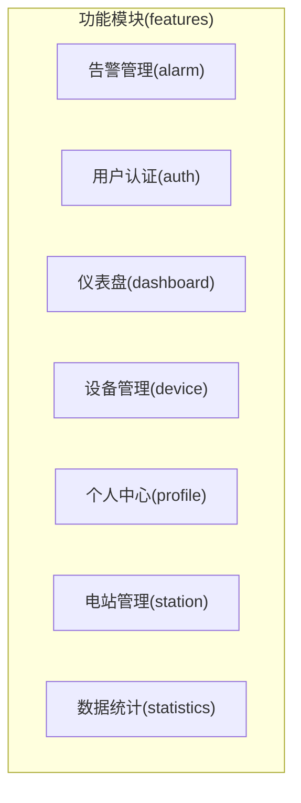
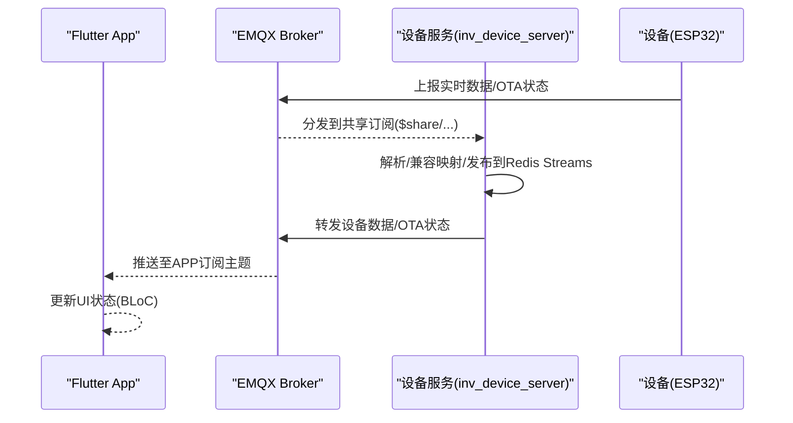
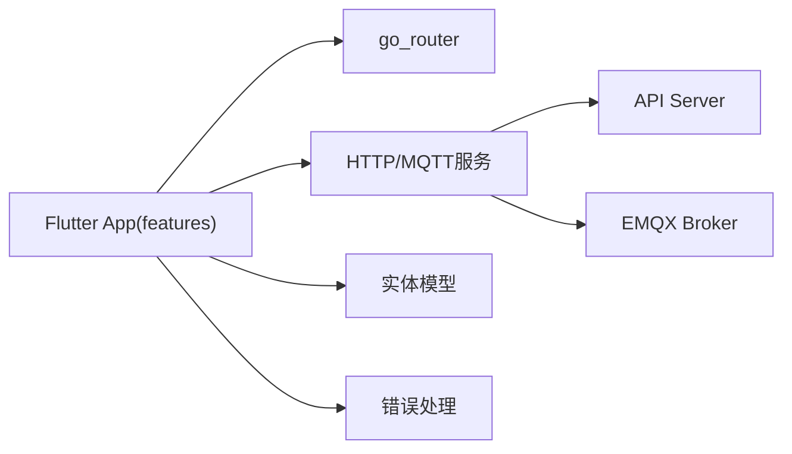

# 移动端应用

<cite>
**本文引用的文件**
- [README.md](file://README.md)
- [MainActivity.kt](file://inv_app/android/app/src/main/kotlin/com/example/inv_app/MainActivity.kt)
- [app_config.dart](file://inv_app/lib/core/config/app_config.dart)
- [app_constants.dart](file://inv_app/lib/core/constants/app_constants.dart)
- [alarm_code_mapping.dart](file://inv_app/lib/core/data/alarm_code_mapping.dart)
- [china_regions.dart](file://inv_app/lib/core/data/china_regions.dart)
- [command_result.dart](file://inv_app/lib/core/entities/command_result.dart)
- [device_model_field.dart](file://inv_app/lib/core/entities/device_model_field.dart)
- [energy_data_point.dart](file://inv_app/lib/core/entities/energy_data_point.dart)
- [inverter_data.dart](file://inv_app/lib/core/entities/inverter_data.dart)
- [offline_action.dart](file://inv_app/lib/core/entities/offline_action.dart)
- [exceptions.dart](file://inv_app/lib/core/errors/exceptions.dart)
- [failures.dart](file://inv_app/lib/core/errors/failures.dart)
- [app_router.dart](file://inv_app/lib/core/router/app_router.dart)
- [auth_guard.dart](file://inv_app/lib/core/router/guards/auth_guard.dart)
- [api_service.dart](file://inv_app/lib/core/services/api_service.dart)
- [app_update_service.dart](file://inv_app/lib/core/services/app_update_service.dart)
- [connection_mode_service.dart](file://inv_app/lib/core/services/connection_mode_service.dart)
- [contact_service.dart](file://inv_app/lib/core/services/contact_service.dart)
- [data_cache_service.dart](file://inv_app/lib/core/services/data_cache_service.dart)
- [firmware_download_service.dart](file://inv_app/lib/core/services/firmware_download_service.dart)
- [local_communication_service.dart](file://inv_app/lib/core/services/local_communication_service.dart)
- [client.go](file://inv_device_server/internal/mqtt/client.go)
- [models.go](file://inv_api_server/internal/model/models.go)
</cite>

## 目录
1. [简介](#简介)
2. [项目结构](#项目结构)
3. [核心组件](#核心组件)
4. [架构总览](#架构总览)
5. [详细组件分析](#详细组件分析)
6. [依赖关系分析](#依赖关系分析)
7. [性能考虑](#性能考虑)
8. [故障排查指南](#故障排查指南)
9. [结论](#结论)
10. [附录](#附录)

## 简介
本项目是一个基于 Flutter 3.x 的跨平台移动应用，采用 BLoC 状态管理模式，结合 go_router 路由系统与 AuthGuard 鉴权守卫，构建了从配置管理、实体模型、服务层到通用组件的完整核心模块，并围绕告警管理、用户认证、仪表盘、设备管理、个人中心、电站管理、数据统计等业务模块展开。应用通过 MQTT 客户端直连 EMQX Broker 实现实时数据推送，同时利用 HTTP REST API 提供历史与统计查询能力；系统还支持国际化、主题切换与响应式布局，具备完善的错误处理与性能优化策略。

## 项目结构
移动端应用位于 inv_app 目录，采用“核心模块(core)+功能模块(features)”的分层组织方式：
- core：包含配置(app_config.dart)、常量(app_constants.dart)、实体模型(entities)、错误处理(errors)、路由(router)、服务层(services)、数据(data)等
- features：按业务域划分，如 alarm、auth、dashboard、device、profile、station、statistics
- assets：资源文件(images/icons/data)
- android/ios：原生平台集成
- pubspec.yaml：Dart 依赖声明

**章节来源**
- [README.md:33-58](file://README.md#L33-L58)

## 核心组件
- 配置管理：集中管理应用运行时配置，如 MQTT Broker 地址、API 服务地址、主题开关等
- 实体模型：封装逆变器实时数据、设备信息、告警、能量点等核心领域对象
- 错误处理：统一异常类型与失败封装，便于上层统一处理
- 路由系统：go_router + AuthGuard，提供声明式路由与鉴权守卫
- 服务层：HTTP API 调用(api_service.dart)、MQTT 连接、OTA 下载、本地通信、缓存等
- 数据层：告警码映射、区域数据、离线动作等

**章节来源**
- [app_config.dart:1-200](file://inv_app/lib/core/config/app_config.dart#L1-L200)
- [inverter_data.dart:1-400](file://inv_app/lib/core/entities/inverter_data.dart#L1-L400)
- [exceptions.dart:1-50](file://inv_app/lib/core/errors/exceptions.dart#L1-L50)
- [app_router.dart:1-200](file://inv_app/lib/core/router/app_router.dart#L1-L200)
- [auth_guard.dart:1-120](file://inv_app/lib/core/router/guards/auth_guard.dart#L1-L120)
- [api_service.dart:1-200](file://inv_app/lib/core/services/api_service.dart#L1-L200)

## 架构总览
系统采用“实时直连 MQTT + 历史查询 HTTP”的双通道架构：
- 实时链路：设备 → EMQX Broker → $share/inv-group/ → 设备服务 → 应用直连订阅
- 历史链路：应用 → HTTP REST → API Server → PostgreSQL 查询返回
- 认证：EMQX 内置 JWT(HS256)，App 与 API Server 共用 Secret

**章节来源**
- [README.md:7-31](file://README.md#L7-L31)
- [README.md:206-225](file://README.md#L206-L225)

## 详细组件分析

### BLoC 状态管理模式
- 事件驱动：通过事件触发状态变更，保证状态可预测性
- 状态管理：将 UI 状态与业务状态分离，便于测试与维护
- 副作用管理：将网络请求、MQTT 订阅等副作用隔离在 Bloc 或 Service 层，避免 UI 层承担过多职责
- 最佳实践：使用独立的 Bloc/Repository/Service，遵循单一职责；对异步操作进行错误捕获与回退

[本节为概念性说明，不直接分析具体文件，故无“章节来源”]

### 路由系统与 AuthGuard
- go_router 配置：声明式路由，支持命名路由、动态参数、条件导航
- AuthGuard 鉴权守卫：在导航前检查登录状态，未登录跳转至登录页
- 页面导航：通过 context.push/pop 实现页面跳转与返回

**章节来源**
- [app_router.dart:1-200](file://inv_app/lib/core/router/app_router.dart#L1-L200)
- [auth_guard.dart:1-120](file://inv_app/lib/core/router/guards/auth_guard.dart#L1-L120)

### 核心模块组织结构
- 配置管理：集中管理 MQTT Broker、API 地址、主题开关等
- 实体模型：逆变器实时数据、设备信息、告警、能量点等
- 服务层：HTTP API、MQTT 客户端、OTA 下载、本地通信、缓存
- 通用组件：仪表盘、状态指示、相位条等可复用 UI 组件
- 错误处理：统一异常与失败封装

**章节来源**
- [app_config.dart:1-200](file://inv_app/lib/core/config/app_config.dart#L1-L200)
- [app_constants.dart:1-200](file://inv_app/lib/core/constants/app_constants.dart#L1-L200)
- [inverter_data.dart:1-400](file://inv_app/lib/core/entities/inverter_data.dart#L1-L400)
- [exceptions.dart:1-50](file://inv_app/lib/core/errors/exceptions.dart#L1-L50)
- [app_router.dart:1-200](file://inv_app/lib/core/router/app_router.dart#L1-L200)
- [api_service.dart:1-200](file://inv_app/lib/core/services/api_service.dart#L1-L200)

### 功能模块实现
- 告警管理：告警列表展示、告警码映射、告警详情与处理
- 用户认证：登录、注册、密码重置、会话管理
- 仪表盘：电站概览、设备状态、今日发电量等关键指标
- 设备管理：设备详情、实时监控、参数配置、Wi-Fi 配网、OTA 升级
- 个人中心：账户设置、设备分享、联系人管理
- 电站管理：电站 CRUD、设备绑定、权限分配
- 数据统计：历史数据查询、图表分析、趋势展示

**章节来源**
- [alarm_code_mapping.dart:1-120](file://inv_app/lib/core/data/alarm_code_mapping.dart#L1-L120)
- [README.md:322-342](file://README.md#L322-L342)

### MQTT 客户端集成与实时数据推送
- 客户端连接：基于 paho.mqtt.golang 的 autopaho 库，支持 TLS/非 TLS、用户名密码、会话保持
- 共享订阅：$share/inv-group/ 前缀，实现多实例负载均衡
- 主题订阅：设备实时数据、OTA 状态、状态变更等主题
- 事件回调：OTA 状态上报、设备在线状态变化回调
- 与设备服务协作：设备服务负责解析与转发，APP 直接订阅实时数据

**章节来源**
- [client.go:1-236](file://inv_device_server/internal/mqtt/client.go#L1-L236)
- [README.md:206-214](file://README.md#L206-L214)

### WebSocket 连接管理与实时推送
- 管理后台使用 WebSocket 实时推送告警与通知
- 移动端主要通过 MQTT 实时数据流，HTTP 用于历史与统计查询
- WebSocket 与 MQTT 在不同场景互补：后台管理侧重推送，移动端侧重设备直连

**章节来源**
- [README.md:218-222](file://README.md#L218-L222)

### 国际化、主题切换与响应式设计
- 国际化：通过语言包与翻译工具实现多语言支持
- 主题切换：亮/暗主题切换，适配系统偏好
- 响应式设计：根据屏幕尺寸与方向调整布局与组件大小

**章节来源**
- [README.md:112-133](file://README.md#L112-L133)

## 依赖关系分析
- 组件耦合：core 作为基础层被 features 依赖；services 与 router 之间弱耦合
- 外部依赖：Dio(HTTP)、go_router(路由)、mqtt_client(移动端 MQTT)、EMQX(Broker)
- 依赖可视化：

**章节来源**
- [README.md:112-133](file://README.md#L112-L133)

## 性能考虑
- 实时链路优先：设备数据通过 MQTT 直连推送，减少轮询与延迟
- 历史查询按需：仅在需要时调用 HTTP API，避免不必要的网络开销
- 缓存策略：本地缓存与服务端缓存结合，提升冷启动与弱网体验
- 内存管理：合理释放订阅与定时器，避免内存泄漏
- UI 优化：懒加载、虚拟列表、图片缓存与占位符

[本节为通用指导，不直接分析具体文件，故无“章节来源”]

## 故障排查指南
- MQTT 连接失败：检查 Broker 地址、端口、TLS 配置与 JWT Token 是否有效
- 认证失败：确认 JWT Secret 与 EMQX 配置一致，Token 未过期
- 页面无法跳转：检查 go_router 路由配置与 AuthGuard 条件
- 实时数据不更新：确认设备是否在线、主题是否正确订阅、设备服务是否正常转发
- 错误处理：统一捕获 exceptions 与 failures，记录日志并提示用户

**章节来源**
- [exceptions.dart:1-50](file://inv_app/lib/core/errors/exceptions.dart#L1-L50)
- [failures.dart:1-120](file://inv_app/lib/core/errors/failures.dart#L1-L120)
- [auth_guard.dart:1-120](file://inv_app/lib/core/router/guards/auth_guard.dart#L1-L120)

## 结论
该 Flutter 移动端应用以清晰的模块化架构为基础，结合 BLoC 状态管理与 go_router 路由体系，实现了从配置、实体、服务到 UI 的全链路解耦。通过 MQTT 直连 EMQX 的实时数据推送与 HTTP 历史查询的互补设计，满足了大规模设备监控与高效交互的需求。配合国际化、主题切换与响应式布局，提供了良好的跨平台用户体验。建议持续完善测试覆盖、埋点与性能监控，以保障长期稳定运行。

[本节为总结性内容，不直接分析具体文件，故无“章节来源”]

## 附录
- 原生入口：Android MainActivity 继承 FlutterActivity
- 服务端口与组件：API Server(8080)、设备服务(8081)、EMQX(8883/18083)、PostgreSQL、Redis
- 适用逆变器型号：CS-I10-6k2 48V 单相离网逆变器

**章节来源**
- [MainActivity.kt:1-5](file://inv_app/android/app/src/main/kotlin/com/example/inv_app/MainActivity.kt#L1-L5)
- [README.md:195-205](file://README.md#L195-L205)
- [README.md:355-358](file://README.md#L355-L358)